# HRMS 后端系统分析文档

> **文档版本**：v2.0.0（统一契约锚点 v1.0.0；Part I/II 与契约 §5~§11 零偏差）  
> **PRD 来源**：[人资管理系统-PRD.md](../人资管理系统-PRD.md)（2026-07-07）  
> **目标读者**：后端开发、DBA、测试、架构评审、产品经理  
> **技术栈**：Spring Boot 3 + MyBatis-Plus + MySQL 8 + Redis 7 + RabbitMQ  
> **合并来源**：`后端系统分析设计.md` · `HRMS-SAS-v1.0.md`（已并入本文附录 J~L）· 原 v1.4 本文  
> **接口契约**：与《HRMS-Frontend-System-Design(1).md》v1.8.3 路径零偏差  
> **契约锚点**：《HRMS-API-Contract.md》v1.0.0 — **API/枚举/错误码唯一权威**

**文档结构**：**Part I（§1–§5 + 附录 A~L）** 按公司系分模板 + 原 SAS 系统分析内容；**Part II（§A 起）** 为技术实现详设。本文档为项目**唯一**后端/系统分析交付物。

---

# Part I · 公司标准系分章节

# 1. 需求背景

公司人力资源管理依赖 Excel 和纸质流程，存在数据分散、算薪效率低、审批不透明等问题。本系统建立统一员工数字化档案，实现入转调离全流程线上化，提供 REST API 支撑管理后台与员工门户。

本文档为项目**唯一系统分析 + 后端开发系分**：Part I 为开发契约，Part II 为落地详设；原《HRMS-SAS-v1.0.md》已并入附录 J~L。

## 1.3 专业术语（节选）

完整术语见 **附录 J**。核心概念：

| 术语 | 定义 |
| --- | --- |
| employee_id | 员工业务主键，全局唯一，**永不复用** |
| emp_no | 展示工号 `YYYY+部门码+序号`，**当年度同部门可复用** |
| 账套 | `payroll_scheme`，定义工资项目及 SpEL 公式 |
| 分段计薪 | 按生效日将自然月切分多段分别计算后汇总（AD-08） |
| 自然月 | 薪资/考勤核算周期 YYYY-MM-01 至月末（AD-01） |

## 1.4 架构决策（AD-01~08）

| ID | 决策 | 实现要点 |
| --- | --- | --- |
| AD-01 | 自然月 + 考勤锁定 | `attendance_month_lock`；算薪触发 LOCKED |
| AD-02 | 加班独立模块 | `overtime_application` + `overtime_ledger` |
| AD-03 | SpEL 表驱动审批 | `approval_process_def`；禁用 BPM |
| AD-04 | 数据迁移 | `/imports/*` 四类型 Excel（附录 L） |
| AD-05 | employee_id / emp_no 分离 | FK 仅用 employee_id |
| AD-06 | 加班二审 | 单日累计 ≥4h 须 HR 负责人审批 |
| AD-07 | 老板审批双条件 | 实发≥30万 OR 调薪占比>15% OR 单人调薪>40% |
| AD-08 | 分段计薪 | `ProratedPayrollService` + calc_snapshot_json |

## 1.1 项目成员

| **角色** | **成员** | **备注** |
| --- | --- | --- |
| 业务方 |  |  |
| 产品经理（PD） |  |  |
| 后端技术 |  |  |
| UED（设计师） |  |  |
| 前端 |  |  |
| 质量 |  |  |

## 1.2 项目文档

| 文档 | 地址/说明 |
| --- | --- |
| PRD 文档 | [人资管理系统-PRD.md](../人资管理系统-PRD.md) v1.0 |
| **API 契约（锚点）** | [HRMS-API-Contract.md](HRMS-API-Contract.md) v1.0.0 |
| UED | PRD 内嵌原型图 |
| 前端系分 | [HRMS-Frontend-System-Design(1).md](HRMS-Frontend-System-Design(1).md) v1.8.3 |
| 系统分析（已合并） | 本文 Part I 附录 J~L（原 HRMS-SAS-v1.0） |
| OpenAPI 契约 | `hrms-server/openapi.yaml`（Sprint 0 输出） |
| 合并映射附录 | 本文附录 E/F |
| 迭代地址 | https://gitee.com/swing-king/hrmini |
| 开发环境地址 | 后端 `http://localhost:8080/api/v1` · 前端 `http://localhost:8000` |
| 测试环境地址 | 微项目首期与开发环境共用 |

---

# 2. 详细设计

## 2.1 后端迭代目标

本次迭代交付 HRMS V1.0 全量后端，主要包括：

1. **工程基建**：Spring Boot 3、MyBatis-Plus、JWT+RBAC、Flyway、OpenAPI、Apifox Mock
2. **组织与档案**：部门/职位 CRUD、员工档案、工号管理、合同与薪资档案、数据迁移
3. **入转调离**：入职申请、转正/调岗/离职、员工自主离职申请
4. **考勤请假加班**：考勤组、打卡、补卡、月汇总/锁定、节假日、请假/加班
5. **薪资核算**：SpEL 账套引擎、分段计薪、批次核算、工资条、成本报表
6. **审批引擎**：表驱动 SpEL 路由（禁用 BPM）、委托、超时
7. **系统能力**：操作/登录日志、消息通知、定时任务、安全审计、个人中心

**架构决策（AD-01~08）：** 自然月+考勤锁定、加班管理、SpEL 审批、数据迁移、employee_id/emp_no 分离、加班二审、老板审批双条件、分段计薪。

**工程约定：** 单模块 `hrms-server/`；包路径 `com.company.hrms.module.*`；部门树 `parent_id`+`path`（**不采用**闭包表）；表名无前缀（弃用 B 文档 `org_`/`emp_`/`wf_`/`att_`/`pay_`）。

## 2.2 迭代具体描述

> 通用约定：Base URL `/api/v1`；鉴权 Bearer JWT；响应 `{ code, message, data, traceId, timestamp }`；分页 `page`/`pageSize`（最大100）

### 2.2.1 认证与权限模块

> **详设**：Part II §A.3.1、§A.3.8

##### 业务说明

- JWT Access 30min（`expiresIn: 1800`）；Refresh Token **7 天**；BCrypt 密码
- 密码规则：**8 位以上，需包含大小写字母+数字**；**90 天**强制更换；**首次登录**强制改密
- 登录失败 **5 次**锁定 **15min**
- 无操作自动登出：**30 分钟**无用户操作自动登出（前端定时检测 + 后端刷新 token 时校验时间戳）
- 角色：SYS_ADMIN / HR_STAFF / DEPT_MANAGER / FINANCE / EMPLOYEE
- 数据权限：内部 `DS_ALL` / `DS_DEPT_TREE` / `DS_SELF` / `DS_PAYROLL` / `DS_NONE_PAYROLL`；**API 响应 `dataScope` 为** `ALL` / `DEPT_TREE` / `SELF` / `PAYROLL` / `NONE_PAYROLL`（契约 §4.2）
- SYS_ADMIN 对薪资接口双拦截（DS_NONE_PAYROLL）

##### 接口字段

###### 请求字段（POST `/auth/login`）

| 字段 | 说明 | 必填 | 类型 | 校验 |
| --- | --- | --- | --- | --- |
| username | 登录账号（手机号/工号） | Y | string | 11 位手机号或工号格式 |
| password | 密码 | Y | string | BCrypt 校验；8 位以上，含大小写字母+数字 |

###### 响应字段（POST `/auth/login`）

| 字段 | 说明 | 类型 |
| --- | --- | --- |
| accessToken | JWT Access Token | string |
| refreshToken | 用于刷新 Token 的凭据（有效期 7 天） | string |
| expiresIn | Access Token 有效期（秒），固定 1800 | number |
| mustChangePassword | 首次登录强制改密标志 | boolean |

###### 响应字段（GET `/auth/profile`）

| 字段 | 说明 | 类型 |
| --- | --- | --- |
| userId | 用户 ID | number |
| employeeId | 员工 ID | number |
| roles | 角色 code 列表 | string[] |
| permissions | 权限码 | string[] |
| dataScope | ALL/DEPT_TREE/SELF/PAYROLL/NONE_PAYROLL | string |
| mustChangePassword | 首次登录强制改密 | boolean |
| passwordExpiredAt | 密码过期时间（格式 `YYYY-MM-DD`），用于前端提示改密 | string |

###### 请求字段（POST `/auth/verify` — 工资条二次验证）

| 字段 | 说明 | 必填 | 类型 |
| --- | --- | --- | --- |
| verifyType | PASSWORD / SMS | Y | string |
| verifyCode | 密码或验证码 | Y | string |

##### 接口设计

| 方法 | 路径 | 说明 | PRD |
| --- | --- | --- | --- |
| POST | `/auth/login` | 登录 `{ username, password }` → `{ accessToken, refreshToken, expiresIn, mustChangePassword }` | §2 |
| POST | `/auth/logout` | 登出（Token 黑名单写入 Redis `token:blacklist:{jti}` TTL 30min） | — |
| POST | `/auth/refresh` | 刷新 Token（Refresh Token 7 天有效） | — |
| GET | `/auth/profile` | 用户+角色+权限+dataScope+passwordExpiredAt | §2 |
| PUT | `/auth/password` | 改密（登录页/首次改密；门户规范路径见 §6.8 `/profile/security/password`，附录 K.6） | §9.5 |
| PUT/DELETE | `/auth/mobile` | 绑定/解绑手机（同服务别名；门户规范路径见 §7.2 及附录 K.6） | §9.5 |
| POST | `/auth/verify` | 工资条二次验证（同服务别名；规范路径见 §7.1 `POST /profile/payslips/verify`，附录 K.5） | §7.4 |

##### 数据模型

`sys_user`、`sys_role`、`sys_permission`、`sys_user_role`、`sys_role_permission`、`login_log`

##### 业务逻辑

- `DataScopeInterceptor` 注入 SQL 过滤
- `FieldPermissionFilter` 裁剪 VO 字段
- 登出 Token 写入 Redis `token:blacklist:{jti}` TTL 30min

##### 合并裁决

| 项 | B（HRMS-Backend） | C（后端系统分析设计） | 最终 |
| --- | --- | --- | --- |
| 路径 | `/auth/me` | 已一致 | **`/auth/profile`** |
| Token | 2h | 30min | **30min** |
| 角色 | `HR_SPECIALIST` | `admin/hr` | **`HR_STAFF` 等** |

---

### 2.2.2 组织架构模块

> **详设**：Part II §A.3.2（PRD §3）

##### 业务说明

- 部门最多 5 层；合并前须迁移员工；人数统计含下级（试用期+正式）
- 部门合并：`POST /departments/{id}/merge` 批量转移员工至目标部门，源部门同时被删除
- 删除前须通过 `GET /departments/{id}/can-delete` 校验：无子部门且无在职员工，否则 30002
- 职位序列 M/P/S，职级范围 M1-M5 / P1-P10 / S1-S5

##### 接口字段

###### 部门表单字段（POST/PUT `/departments`）

| 字段 | 说明 | 必填 | 类型 | 校验 |
| --- | --- | --- | --- | --- |
| name | 部门名称 | Y | string | ≤64 |
| deptCode | 部门编码（工号用） | Y | string | 2 位，UK |
| parentId | 上级部门 | N | number | 深度≤5 |
| headEmployeeId | 部门负责人 | N | number | 在职员工 |
| sortOrder | 排序 | Y | number | 默认 0 |
| description | 描述 | N | string | ≤256 |

###### 职位表单字段（POST/PUT `/positions`）

| 字段 | 说明 | 必填 | 类型 | 校验 |
| --- | --- | --- | --- | --- |
| name | 职位名称 | Y | string | |
| sequenceCode | 序列 M/P/S | Y | string | 枚举 |
| gradeMin / gradeMax | 职级范围 | Y | string | 序列内合法 |
| departmentId | 所属部门 | N | number | 空=全公司通用 |
| defaultProbationMonths | 默认试用期 | Y | number | 默认 3 |
| isStandard | 是否标准职位 | Y | boolean | 0→入职二审 |
| description | 描述 | N | string | |

##### 接口设计

| 方法 | 路径 | 说明 | PRD |
| --- | --- | --- | --- |
| GET | `/departments/tree` | 部门树（含人数、负责人） | §3.1 |
| GET | `/departments/{id}/headcount` | 部门人数（含下属） | §3.1.4 |
| GET | `/departments/{id}/can-delete` | 删除前校验（检查是否有员工/子部门未转移） | §3.1.3 |
| POST | `/departments/{id}/merge` | 部门合并：批量转移员工至目标部门，同时删除原部门。请求体 `{ targetDepartmentId }` | §3.1.3 |
| POST | `/departments` | 新增部门 | §3.1 |
| PUT | `/departments/{id}` | 编辑部门 | §3.1 |
| DELETE | `/departments/{id}` | 删除部门 | §3.1 |
| GET/POST/PUT/DELETE | `/positions` `/positions/{id}` | 职位 CRUD | §3.2 |

##### 数据模型

`department`（dept_code UK, level≤5, parent_id, path）、`position`（sequence_code, grade_min/max, is_standard）

> **DTO 转换策略：** 请求体字段直接映射为 Entity 属性（字段名一致，驼峰 ↔ 下划线由 MyBatis-Plus 自动转换）；响应中部门负责人返回 `headEmployeeId`（ID），部门树中转为 `manager`（姓名）由 Service 层装配。

##### 业务逻辑

- 新增/移动部门：校验 `path` 深度 ≤5，否则 30001
- 删除前校验：`GET /departments/{id}/can-delete` 检查是否有子部门或在职员工，否则 30002
- 部门合并：`POST /departments/{id}/merge` 校验目标部门存在且非自身，批量转移员工后删除源部门
- 人数统计 SQL 采纳 HRMS-Backend A.3.2.2（JOIN path，不用闭包表）
- `is_standard=0` 或薪资超职级 → 入职二级审批（SpEL）

---

### 2.2.3 员工档案模块

> **详设**：Part II §A.3.3（PRD §4）

##### 业务说明

- `employee_id` 业务主键永不复用；`emp_no` 同年同部门可复用
- 敏感字段 AES-256；查看完整值记 `operation_log`
- **入职不走** `POST /employees`，统一走入职申请模块
- 手机号变更不走档案编辑：员工通过 `POST /profile/mobile-change-applications` 提交审批，HR 通过 `GET /employees/mobile-change-applications` 查看待办

##### 接口字段

###### 查询参数（GET `/employees`）

| 参数 | 说明 | 必填 | 类型 | 默认 |
| --- | --- | --- | --- | --- |
| page | 页码，从 1 开始 | N | number | 1 |
| pageSize | 每页条数，最大 100 | N | number | 20 |
| keyword | 关键词模糊搜索：姓名/工号/手机号 | N | string | — |
| departmentIds | 部门 ID 列表，逗号分隔（部门树多选） | N | string | — |
| positionIds | 职位 ID 列表，逗号分隔 | N | string | — |
| employmentStatus | 在职状态筛选，逗号分隔（如 `probation,regular`） | N | string | — |
| gradeLevels | 职级筛选，逗号分隔（如 `P5,P6,P7`） | N | string | — |
| hireDateFrom | 入职日期范围-起始（格式 `YYYY-MM-DD`） | N | string | — |
| hireDateTo | 入职日期范围-结束（格式 `YYYY-MM-DD`） | N | string | — |

###### 响应列表字段

| 字段 | 说明 |
| --- | --- |
| employeeId, empNo, name | 主键/工号/姓名 |
| department, position | 部门/职位 |
| grade, employmentStatus, hireDate | 职级/状态/入职日 |

###### 编辑白名单与字段校验（PUT `/employees/{id}`）

| 字段 | 说明 | 类型 | 校验规则 |
| --- | --- | --- | --- |
| name | 姓名 | string | ≤64 |
| gender | 性别 | string | MALE / FEMALE |
| email | 邮箱 | string | 邮箱格式，≤128 |
| birthday | 生日 | string | 格式 `YYYY-MM-DD` |
| address | 地址 | string | ≤256 |
| emergencyContact | 紧急联系人姓名 | string | ≤64 |
| emergencyPhone | 紧急联系人电话 | string | 11 位手机号 |
| **以下字段不可编辑（须走流程）** | | | |
| departmentId | 部门 | — | 走调岗流程 `POST /transfers` |
| positionId, jobLevel, managerId | 职位/职级/上级 | — | 走调岗流程 `POST /transfers` |
| idNumber | 身份证号 | — | 不可编辑（敏感字段） |
| mobile | 手机号 | — | 走 `MOBILE_CHANGE` 审批 |

##### 接口设计

| 方法 | 路径 | 说明 | PRD |
| --- | --- | --- | --- |
| GET | `/employees` | 花名册分页+高级搜索，详见查询参数定义 | §4.2 |
| GET/PUT | `/employees/{id}` | 档案详情/编辑 | §4.1 |
| GET/PUT | `/employees/{id}/salary` | 薪资档案 | §7.2 |
| GET | `/employees/{id}/sensitive/{field}` | 敏感字段查看（二次验证，记审计日志） | §2.3 |
| GET | `/employees/mobile-change-applications` | HR 手机号变更待办列表 | §4.1.2 |
| GET | `/employees/{id}/transfer-history` | 员工调岗历史 | §5.3 |

##### 数据模型

`employee`、`employee_personal`（可选）、`employee_no_history`、`employee_contract`、`employee_salary_profile`、`employee_salary_history`、`employee_transfer_history`

##### 业务逻辑

**工号生成：**
```
emp_no = YEAR(4) + dept_code(2) + seq(3)
Redis: emp_no:{year}:{deptCode}
优先复用 employee_no_history(reuse_flag=1)
```

**敏感字段加密：**

| 字段 | 存储 | 检索 |
| --- | --- | --- |
| 身份证号 | AES-256-GCM | SHA-256 哈希列精确查 |
| 银行卡号 | AES-256-GCM | 后四位明文展示 |
| 手机号 | 明文（登录账号） | 唯一索引 |

---

### 2.2.4 入职申请模块

> **详设**：Part II §A.3.4.1（PRD §5.1）

##### 业务说明

状态（**API 层**，JSON 小写）：`draft` → `pending` → `approved_pending` → `onboarded`；`rejected` / `abandoned`

> **API ↔ DB 映射**见附录 I「入职状态」；持久层为 `DRAFT/APPROVING/APPROVED/ONBOARDED/REJECTED/ABANDONED`。

##### 接口字段

###### 申请表单字段（POST/PUT `/onboarding/applications`）

| 字段 | 说明 | 必填 | 校验 |
| --- | --- | --- | --- |
| name, gender, mobile, email, idNumber | 基本信息 | Y | 身份证格式；手机号唯一 |
| expectedOnboardDate | 预计入职日 | Y | ≥ 今天 |
| departmentId, positionId | 部门/职位 | Y | 部门深度≤5 |
| employmentType | 用工类型 | Y | fulltime/parttime/intern |
| probationMonths | 试用期 | Y | 默认取职位默认值 |
| probationSalaryRatio | 试用薪资比例 | Y | 0.80–1.00 |
| managerId | 直属上级 | N | 默认部门负责人 |
| baseSalary | 约定薪资 | Y | 超职级→二审 |

###### 状态 × 角色 × 操作

| 业务状态 | 编码 | 可见角色 | 可执行操作 |
| --- | --- | --- | --- |
| 草稿 | draft | HR 本人 | 编辑、删除、提交 |
| 审批中 | pending | HR、审批人 | 审批/转交；HR 撤回（仅第一级） |
| 已批准待入职 | approved_pending | HR、部门负责人 | 确认入职、放弃 |
| 已拒绝 | rejected | HR | 重新发起 |
| 已入职 | onboarded | 按权限 | 发起转正 |
| 已放弃 | abandoned | HR | 查看 |

##### 接口设计

| 方法 | 路径 | 说明 | PRD |
| --- | --- | --- | --- |
| GET | `/onboarding/applications` | 入职申请列表 | §5.1 |
| GET | `/onboarding/applications/stats` | 统计卡片（draft/pending/approved_pending/onboarded） | §5.1 |
| POST | `/onboarding/applications` | 新建草稿 | §5.1 |
| PUT | `/onboarding/applications/{id}` | 编辑草稿 | §5.1 |
| DELETE | `/onboarding/applications/{id}` | 删除草稿 | §5.1 |
| POST | `/onboarding/applications/{id}/submit` | 提交审批 | §5.1 |
| POST | `/onboarding/applications/{id}/withdraw` | HR 撤回（仅第一级可撤回） | §5.1 |
| POST | `/onboarding/applications/{id}/confirm` | 确认入职 | §5.1 |
| POST | `/onboarding/applications/{id}/abandon` | 标记放弃 | §5.1 |

##### 数据模型

`onboarding_application`（employment_type: fulltime/parttime/intern）

##### 业务逻辑（审批通过，PRD §5.1.5）

1. 生成 employee_id、emp_no，写入 employee / employee_contract
2. 创建 sys_user（随机密码，首次登录强制改密）
3. employment_status=10（试用期）；发送欢迎邮件；通知 HR 与部门负责人
4. 申请 API 状态 → `approved_pending`（DB: APPROVED），待 HR 确认到岗

##### 业务逻辑（确认入职 `POST /onboarding/applications/{id}/confirm`）

1. 写入 `actualOnboardDate`（可与 expectedOnboardDate 不同，PRD §5.1.2）
2. 申请 API 状态 → `onboarded`（DB: ONBOARDED）
3. 关联考勤组；若尚无薪资档案则创建占位记录供后续配置

**审批 SpEL（processType=ONBOARDING）：** `#!positionStandard || #baseSalary > #gradeMax` → 触发 HR 二审

---

### 2.2.5 入转调离模块

> **详设**：Part II §A.3.4.2~4（PRD §5.2~5.4）

##### 业务说明

**员工状态机：**

| 状态 | 编码 | 可打卡 | 可算薪 |
| --- | --- | --- | --- |
| 试用期 | 10 | ✓ | ✓（试用比例） |
| 正式 | 20 | ✓ | ✓ |
| 待离职 | 30 | ✓至 last_work_day | ✓（按日截断） |
| 已离职 | 40 | ✗ | 仅离职当月 |

**离职双通道：**
```
员工 POST /profile/resignation-requests → 审批
  → HR POST /resignations（关联 requestId）→ 待离职 → 已离职
```

`ResignationEffectJob`（00:05）：禁用账号、释放工号、移出考勤组

##### 接口字段

###### 转正申请（POST `/regularization/applications`）

| 字段 | 说明 | 必填 |
| --- | --- | --- |
| employeeId | 员工 | Y（系统带出） |
| performanceEvaluation | 试用期表现 | Y |
| salaryAdjustment | 调薪金额 | N |
| approvalResult | PASS/EXTEND/FAIL | Y |

###### 调岗申请（POST `/transfers`）

| 字段 | 说明 | 必填 | 校验 |
| --- | --- | --- | --- |
| employeeId | 员工 | Y | 状态 10/20 |
| newDepartmentId | 新部门 | Y | 必须变更，否则 30004 |
| newPositionId, newJobLevel, newManagerId | 可选调整 | N | |
| salaryAdjustment | 调薪 | N | 有值→额外审批 |
| effectiveDate, reason | 生效日/原因 | Y | |

###### 员工离职申请（POST `/profile/resignation-requests`）

| 字段 | 说明 | 必填 |
| --- | --- | --- |
| expectedResignDate | 期望离职日 | Y，≥今天 |
| reasonCategory | VOLUNTARY/INVOLUNTARY/NEGOTIATED | Y |
| resignationType | resignation / dismissal / contract_expiry / other | Y |
| reasonDetail | 详细说明 | N |

##### 接口设计

| 方法 | 路径 | 说明 | PRD |
| --- | --- | --- | --- |
| GET | `/regularization/applications/pending` | 待转正列表（试用期结束-7天） | §5.2 |
| GET/POST | `/regularization/applications` | 转正申请列表/发起转正 | §5.2 |
| POST/GET | `/transfers` | 调岗申请。**约束：所属部门必须变更**，否则返回 30004 | §5.3 |
| GET | `/transfers/{id}` | 调岗详情 | §5.3 |
| POST/GET | `/resignations` | HR 发起离职/离职记录列表 | §5.4 |
| GET | `/resignations/stats` | 离职统计 | §5.4 |
| GET | `/resignations/{id}` | 离职详情 | §5.4 |
| GET/POST | `/resignation-requests` | HR 查看/管理员工离职申请 | §5.4 |
| POST/GET | `/profile/resignation-requests` | 员工门户离职申请入口（SELF） | §5.4.1 |

##### 数据模型

`regularization_application`、`transfer_application`、`employee_resignation_request`、`resignation_application`、`employee_transfer_history`

---

### 2.2.6 考勤模块

> **详设**：Part II §A.3.5（PRD §6.1~6.4）

##### 业务说明

**打卡判定：**
```
上班: ≤onDuty→normal; (onDuty, onDuty+lateThreshold]→late; else→absent
下班: ≥offDuty→normal; [offDuty-earlyLeaveThreshold, offDuty)→early_leave; else→absent
缺卡: missing_in / missing_out
```

**月锁定（AD-01）：** 算薪 draft→calculating 触发 LOCKED；补卡锁定月须 HR 解锁（422:40001）

**部门统计（PRD 6.4.2）：**
```
出勤率 = Σ实际出勤 / Σ应出勤
迟到率 = 迟到人次 / 部门人数
请假率 = Σ请假天数 / Σ应出勤
```

##### 接口字段

###### 考勤组字段（CRUD `/attendance/groups`）

| 字段 | 说明 | 必填 | 类型 | 校验 |
| --- | --- | --- | --- | --- |
| name | 考勤组名称 | Y | string | 如"标准工时组" |
| applicableScope | 适用人员范围 | Y | object | `{ departmentIds[], positionIds[], employeeIds[] }` |
| shiftType | 班次类型：fixed / flexible / schedule | Y | string | 枚举 |
| onDuty | 上班时间 | Y | string | 格式 `HH:mm` |
| offDuty | 下班时间 | Y | string | 格式 `HH:mm` |
| restStart | 中午休息开始 | N | string | 格式 `HH:mm`，默认 `12:00` |
| restEnd | 中午休息结束 | N | string | 格式 `HH:mm`，默认 `13:00` |
| flexibleRange | 弹性班范围 | N | object | `{ earliest, latest }` 格式 `HH:mm` |
| lateThreshold | 迟到阈值（分钟） | Y | number | 默认 15 |
| earlyLeaveThreshold | 早退阈值（分钟） | Y | number | 默认 15 |
| ipWhitelist | IP 白名单 | N | string[] | JSON 数组，如 `["192.168.1.0/24"]` |
| gpsRange | GPS 打卡范围 | N | object | `{ lat, lng, radiusM }` |

###### 打卡请求（POST `/attendance/punch`）

| 字段 | 说明 | 必填 | 类型 |
| --- | --- | --- | --- |
| type | in / out | Y | string |
| punchTime | 打卡时间 | N | datetime，默认 now |
| latitude, longitude | GPS | N | number |

###### 补卡申请（POST `/attendance/punch-fix`）

| 字段 | 说明 | 必填 | 校验 |
| --- | --- | --- | --- |
| punchDate | 补卡日期 | Y | 当月及前月 |
| type | in / out | Y | |
| punchTime | 补卡时间 | Y | |
| reason | 原因 | Y | ≤256 |
| | | | ≤2 次/月，否则 40002 |

##### 接口设计

| 方法 | 路径 | 说明 | PRD |
| --- | --- | --- | --- |
| POST | `/attendance/punch` | 打卡（type: in/out） | §6.2 |
| GET | `/attendance/punch/today` | 今日打卡状态 | §6.2 |
| GET | `/attendance/punch/records` | 打卡记录（分页） | §6.2 |
| POST | `/attendance/punch-fix` | 补卡申请（≤2次/月，否则 40002） | §6.2.3 |
| GET | `/attendance/punch-fix/quota` | 补卡剩余次数 | §6.2.3 |
| GET/PUT | `/attendance/monthly-summary` | 月汇总/锁定 | §6.4、AD-01 |
| GET/POST/PUT/DELETE | `/attendance/groups` `/attendance/groups/{id}` | 考勤组 CRUD | §6.1 |
| GET/PUT | `/attendance/workdays` | 工作日设置 | §6.1.2 |
| GET/POST/PUT/DELETE | `/attendance/holidays` | 节假日管理 | §6.1.2 |
| GET | `/attendance/statistics/personal` | 个人统计/日历（8项指标） | §6.4 |
| GET | `/attendance/statistics/department` | 部门统计 | §6.4 |

##### 数据模型

`attendance_group`、`attendance_group_scope`、`attendance_group_member`、`attendance_record`、`attendance_supplement`、`attendance_daily_summary`、`attendance_monthly_summary`、`attendance_month_lock`、`holiday_calendar`

##### 业务逻辑

- Redis 幂等键 `hrms:punch:{empId}:{date}:{type}` 防重复打卡
- 日终 `AttendanceSummaryJob`（02:00）聚合 daily → monthly
- 高并发打卡异步落库，日汇总最终一致

---

### 2.2.7 请假 / 加班模块

> **详设**：Part II §A.3.5.3、§A.3.10~11（PRD §6.3 + AD-02）

##### 业务说明

**年假：** <1年=0；1~10年=5；10~20年=10；≥20年=15；首年折算

**调休：** 1:1 转换；当月及次月有效；`CompensatoryLeaveExpireJob` 过期清零

**病假：** 天数>1 附件必填

**加班审批 SpEL：** `#dailyTotalHours >= 4 ? ['supervisor','HR_STAFF'] : ['supervisor']`

**加班倍率：** 工作日1.5 / 休息日2.0 / 法定3.0

##### 接口字段

###### 请假类型

| 类型 | 编码 | 余额管理 | 证明材料 |
| --- | --- | --- | --- |
| 年假 | ANNUAL | 是 | 无 |
| 病假 | SICK | 否 | >1 天需医院证明 |
| 事假 | PERSONAL | 否 | 无 |
| 婚假 | MARRIAGE | 否 | 结婚证 |
| 产假 | MATERNITY | 否 | 医院证明 |
| 丧假 | BEREAVEMENT | 否 | 无 |
| 调休 | COMP_OFF | 是 | 余额>0 |

###### 请假申请表单（POST `/leaves/applications`）

| 字段 | 说明 | 必填 |
| --- | --- | --- |
| leaveType | 请假类型 | Y |
| startTime, endTime | 起止（含上午/下午） | Y |
| days | 天数 | Y（系统计算，支持 0.5） |
| reason | 原因 | Y |
| handoverEmployeeId | 交接人 | N |
| attachment | 附件 | 病/婚/产假必填 |

###### 请假审批链

| 类型 + 天数 | 审批人 |
| --- | --- |
| 年假/调休 ≤ 3 天 | 直接上级 |
| 年假/调休 > 3 天 | 直接上级 → 部门负责人 |
| 病假/事假 ≤ 1 天 | 直接上级 |
| 病假/事假 > 1 天 | 直接上级 → 部门负责人 |
| 婚假/产假/丧假 | 直接上级 → HR 备案 |

###### 加班申请（POST `/overtime/applications`）

| 字段 | 说明 | 必填 |
| --- | --- | --- |
| overtimeDate | 加班日期 | Y |
| startTime, endTime | 起止时间 | Y |
| hours | 时长 | Y（系统计算） |
| reason | 原因 | Y |

##### 接口设计

| 方法 | 路径 | 说明 | PRD |
| --- | --- | --- | --- |
| GET | `/leaves/balances` | 假期余额 | §6.3.2 |
| GET/POST | `/leaves/applications` | 请假申请/记录 | §6.3 |
| GET | `/leaves/calc-days` | 预览请假天数 | §6.3.3 |
| PUT | `/leaves/applications/{id}/cancel` | 撤销请假（**管理端**；门户见 §6.8 `POST /profile/leave/applications/{id}/cancel`） | §6.3 |
| GET/POST | `/overtime/applications` | 加班申请/记录 | AD-02 |

##### 数据模型

`leave_balance`、`leave_application`、`overtime_application`、`overtime_ledger`

---

### 2.2.8 薪资核算模块

> **详设**：Part II §A.3.6、§A.3.12（PRD §7 + AD-01/07/08）

##### 业务说明

**批次流程（API JSON 小写）：** `draft` → `calculating` → `pending_confirm` → `approving` → `approved` → `distributed` / `rejected`

> PRD §7.3.2「已发放」对应 API `distributed`；无独立 `archived` 状态。DB 持久层编码映射见附录 I。

**分段计薪（AD-08）：**
```
边界 = {月初, 入职日, 离职日+1, 转正日, 调薪生效日, 月末+1}
seg_gross = (基本+津贴)×试用比例×seg_ratio + 绩效×seg_ratio + 加班 - 扣款
```

**老板审批 SpEL（AD-07）：**
```spel
#totalNet >= 300000 || #adjustEmployeeRatio > 0.15 || #maxSingleAdjustRatio > 0.40
```

**异常检测：** 黄：请假>15天/加班>50h；红：环比>30%/无档案（阻断）

**计算：** MQ 分片 50人/片；依赖 attendance_monthly_summary + leave + overtime_ledger

##### 接口字段

###### 账套字段（CRUD `/payroll/schemes`）

| 字段 | 说明 | 必填 |
| --- | --- | --- |
| name | 账套名称 | Y |
| scope | 适用范围（部门/职位/职级） | Y |
| effectiveDate | 生效日期 | Y |
| status | enabled / disabled | Y |
| items | 工资项目列表 | Y |

###### 工资项目类型（API 值）

| item_type | 说明 | 计算方式 |
| --- | --- | --- |
| fixed | 固定收入 | 直接取值 |
| variable | 变动收入 | SpEL 公式 |
| attendance_deduct | 考勤扣款 | 规则计算 |
| social | 社保扣除 | 基数×比例 |
| fund | 公积金扣除 | 基数×比例 |
| tax | 个税 | 累计预扣法 |

###### 薪资档案（GET/PUT `/employees/{id}/salary`）

| 字段 | 说明 |
| --- | --- |
| schemeId | 适用账套 |
| baseSalary | 基本工资 |
| allowanceBaseJson | 津贴基数 JSON |
| ssBase, hfBase | 社保/公积金基数（API 工资项目类型 `social`/`fund` 对应此值） |
| performanceBase | 绩效基数 |
| probationRatio | 试用期比例 0.80–1.00 |

###### 批次状态机（API）

| 业务状态 | API 值 | 可执行操作 |
| --- | --- | --- |
| 草稿 | draft | 删除、开始计算 |
| 计算中 | calculating | 等待 |
| 待确认 | pending_confirm | 预览、调整、提交审批 |
| 审批中 | approving | 查看进度 |
| 已通过 | approved | 发放确认 |
| 已发放 | distributed | 只读（归档） |
| 已驳回 | rejected | 修改后重提 |

##### 接口设计

| 方法 | 路径 | 说明 | PRD |
| --- | --- | --- | --- |
| GET/POST/PUT/DELETE | `/payroll/schemes` `/payroll/schemes/{id}` | 账套 CRUD（含工资项目） | §7.1 |
| POST/GET | `/payroll/batches` | 核算批次创建/列表 | §7.3 |
| GET | `/payroll/batches/{id}` | 批次详情/状态轮询 | §7.3 |
| POST | `/payroll/batches/{id}/calculate` | 触发异步计算 | §7.3 |
| GET | `/payroll/batches/{id}/details` | 核算明细（含异常检测标记 warnings[] / blocked） | §7.3 |
| GET | `/payroll/batches/{id}/chart-data` | 图表数据 | §7.3.4 |
| PUT | `/payroll/batches/{id}/details/{detailId}` | 手工调整 | §7.3 |
| POST | `/payroll/batches/{id}/submit` | 提交财务审批 | §7.3 |
| POST | `/payroll/batches/{id}/distribute` | 发放确认（approved → distributed） | §7.3 |
| GET | `/payroll/payslips` | 工资条列表（HR/财务） | §7.4 |
| GET | `/payroll/payslips/{month}` | 工资条详情（HR/财务） | §7.4 |
| GET | `/payroll/cost-report` | 成本报表 | §7 |

##### 数据模型

`payroll_scheme`、`payroll_scheme_item`（SpEL formula_expr）、`payroll_scheme_scope`、`payroll_batch`、`payroll_detail`（segment_count, calc_snapshot_json）

##### 业务逻辑

- 累计预扣法个税：5000×月数 + 专项附加扣除
- 500 人全量核算目标 <30s：MQ 分片 + 批量 INSERT 100 条/批
- 工资条首次查看需二次验证：`POST /profile/payslips/verify`（规范路径）；`POST /auth/verify` 为同服务别名（附录 K.5）。Redis `hrms:payslip:verified:{userId}` TTL 30min

---

### 2.2.9 审批引擎模块

> **详设**：Part II §A.3.7（PRD §8 + AD-03）

##### 业务说明

- 表驱动 SpEL 路由，**禁用 BPM**；task 乐观锁防双审
- 委托同时仅 1 条有效；48h 催办 / 72h 逾期
- 催办：`POST /approvals/tasks/{id}/remind` 向当前审批人发送催办通知
- 撤回：`POST /approvals/instances/{id}/withdraw` 仅发起人且第一级节点可撤回
- 待办统计：`GET /approvals/tasks/stats` 返回待办数量及 `overdueCount` 超时数量

##### 接口字段

###### 待办列表响应（GET `/approvals/tasks`）

| 字段 | 说明 |
| --- | --- |
| taskId, instanceId | 任务/实例 ID |
| processType | 业务类型（与审批引擎一致，大写） |
| title | 审批标题（如"张三入职审批"） |
| applicantName, applicantDept | 发起人姓名/部门 |
| businessNo, businessSummary | 单号/摘要 |
| currentNodeLabel | 当前节点 |
| createTime | 创建时间 |
| dueAt | 截止时间（48h 催办/72h 逾期） |
| status | pending / approved / rejected / cancelled |

###### 审批操作请求（POST `/approvals/tasks/{id}/action`）

| 字段 | 说明 | 必填 |
| --- | --- | --- |
| action | APPROVE / REJECT / FORWARD | Y |
| comment | 意见 | REJECT 必填 |
| targetUserId | 转交目标 | FORWARD 必填 |

###### 委托表单（POST `/approvals/delegations`）

| 字段 | 说明 | 必填 |
| --- | --- | --- |
| delegateUserId | 被委托人 | Y，≠本人 |
| startDate, endDate | 委托期间 | Y |
| reason | 原因 | N |

##### 接口设计

| 方法 | 路径 | 说明 | PRD |
| --- | --- | --- | --- |
| GET | `/approvals/tasks/stats` | 待办统计（含 `overdueCount` 超时数量） | §8.2 |
| GET | `/approvals/tasks` | 待办列表（响应含 `dueAt` 截止时间字段） | §8.2 |
| GET | `/approvals/tasks/{id}` | 审批详情（响应含 `dueAt` 截止时间） | §8.2 |
| POST | `/approvals/tasks/{id}/action` | 审批操作 `{ action: APPROVE/REJECT/FORWARD, comment, targetUserId? }` | §8.2 |
| POST | `/approvals/tasks/{id}/remind` | 催办：向当前审批人发送催办通知 | §5.1.4 |
| POST | `/approvals/instances/{id}/withdraw` | 撤回实例 | §8 |
| GET | `/approvals/instances` | 我发起的审批列表（按发起人过滤） | §8 |
| GET/POST/PUT/DELETE | `/approvals/delegations` `/approvals/delegations/{id}` | 委托 CRUD（同时仅 1 条有效） | §8.3 |

##### 数据模型

`approval_process_def`、`approval_node_def`（SpEL condition_expr + approver_resolver）、`approval_instance`、`approval_task`、`approval_delegation`、`approval_log`

##### SpEL 路由一览（processType，与前端 `PROCESS_TYPE_MAP` 一致）

| processType | 节点链 | 条件 |
| --- | --- | --- |
| ONBOARDING | dept_head → HR_STAFF? | 非标准职位或 baseSalary 超职级 |
| REGULARIZATION | dept_head → HR_STAFF | — |
| TRANSFER | old → new → HR_STAFF | — |
| RESIGNATION | dept_head → HR_STAFF | — |
| RESIGNATION_REQUEST | supervisor → HR_STAFF | 员工离职申请 |
| MOBILE_CHANGE | HR_STAFF | 手机号变更 |
| LEAVE | 动态 | 见请假规则表 |
| MAKEUP | supervisor | 补卡 |
| OVERTIME | supervisor → HR_STAFF? | 单日累计 ≥4h |
| PAYROLL_BATCH | finance → boss? | AD-07 条件 |

---

### 2.2.10 数据迁移 / 系统模块

> **详设**：Part II §A.3.10

##### 数据迁移（AD-04）

| 方法 | 路径 | 说明 | PRD |
| --- | --- | --- | --- |
| GET | `/imports/templates/{type}` | Excel 模板下载 | AD-04 |
| POST | `/imports/batches` | 上传校验 | AD-04 |
| POST | `/imports/batches/{id}/commit` | 确认入库 | AD-04 |

类型 `{type}`：`DEPT` / `EMPLOYEE` / `SALARY` / `ATTENDANCE_SUMMARY`；仅全通过批次可入库

##### 系统接口

| 方法 | 路径 | 说明 | PRD |
| --- | --- | --- | --- |
| GET | `/workbench/summary` | 工作台汇总 | §1.4 |
| GET | `/system/operation-logs` | 操作审计 | §11.2 |
| GET | `/system/login-logs` | 登录日志（管理端全量） | §11.2 |
| POST | `/system/backup` | 数据备份（SYS_ADMIN） | §2 |

##### 用户与角色（SYS_ADMIN，补全前端 `/admin/system/*`）

| 方法 | 路径 | 说明 | PRD |
| --- | --- | --- | --- |
| GET/POST/PUT | `/system/users` `/system/users/{id}` | 用户管理（分页/创建/修改） | §2 |
| GET/PUT | `/system/roles` `/system/roles/{id}/permissions` | 角色列表/权限配置 | §2 |

##### 数据模型

`import_batch`、`import_row_error`、`operation_log`、`login_log`；用户角色见 `sys_user`、`sys_role`、`sys_permission`、`sys_user_role`、`sys_role_permission`

---

### 2.2.11 个人中心模块

> **详设**：Part II §A.3.9（PRD §9）

员工自助 `/profile/*`，强制 `@DataScope(SELF)`。

| 方法 | 路径 | 说明 | PRD |
| --- | --- | --- | --- |
| GET/PUT | `/profile/me` | 我的档案（白名单编辑） | §9.1 |
| GET | `/profile/attendance/calendar` | 考勤日历 | §9.2 |
| POST | `/profile/attendance/punch` | 打卡（代理 `/attendance/punch`） | §9.2 |
| POST | `/profile/attendance/punch-fix` | 补卡（代理 `/attendance/punch-fix`） | §9.2 |
| GET | `/profile/leave/balances` | 假期余额 | §9.3 |
| GET/POST | `/profile/leave/applications` | 请假申请/记录 | §9.3 |
| POST | `/profile/leave/applications/{id}/cancel` | 撤销请假（**门户**；管理端用 `PUT /leaves/applications/{id}/cancel`） | §6.3 |
| GET | `/profile/payslips` | 工资条列表摘要 | §9.4 |
| GET | `/profile/payslips/trend` | 近 6 月实发趋势 | §9.4 |
| GET | `/profile/payslips/{period}` | 工资条详情（须先二次验证） | §7.4 |
| GET | `/profile/payslips/{period}/pdf` | 工资条 PDF 下载（须先二次验证） | §7.4 |
| POST | `/profile/payslips/verify` | 工资条二次验证（规范路径，附录 K.5） | §7.4 |
| PUT | `/profile/security/password` | 修改密码 | §9.5 |
| POST | `/profile/security/mobile/bind` | 首次绑定手机 | §9.5 |
| DELETE | `/profile/security/mobile` | 解绑手机 | §9.5 |
| GET | `/profile/security/login-logs` | 本人登录日志（SELF 范围） | §9.5 |
| POST/GET | `/profile/mobile-change-applications` | 手机号变更申请 | §4.1.2 |
| POST | `/profile/mobile-change-applications/{id}/cancel` | 撤销变更申请 | §4.1.2 |
| GET/POST | `/profile/overtime/applications` | 加班申请/列表（门户规范路径，强制 SELF） | AD-02 |
| POST/GET | `/profile/resignation-requests` | 员工离职申请 | §5.4.1 |
| POST | `/profile/resignation-requests/{id}/cancel` | 撤销离职申请 | §5.4.1 |

手机号变更：`employee_mobile_change_application`（走 MOBILE_CHANGE 审批，非 profile 直改）。

---

### 2.2.12 基础设施设计

#### 项目结构

```
hrms-server/
├── openapi.yaml
├── src/main/java/com/company/hrms/
│   ├── module/（auth, org, employee, onboarding, lifecycle, attendance, leave, overtime, payroll, approval, import_, portal, system）
│   ├── approval/（ApprovalEngine, SpelApproverResolver, handler/）
│   ├── payroll/（PayrollCalculator, ProratedPayrollService, TaxCalculator）
│   └── job/（转正提醒、离职生效、年假刷新、日终汇总、调休过期、Token清理、批次归档）
└── db/migration/（Flyway，DDL 素材：HRMS-Backend Part II 改表名）
```

#### 统一响应与错误码

**响应格式：**
```json
{ "code": 0, "message": "success", "data": {}, "traceId": "...", "timestamp": 1700000000000 }
```

> **完整错误码与 HTTP 映射见 [HRMS-API-Contract.md §6](HRMS-API-Contract.md#6-业务错误码)** 及本文附录 K（同步副本）。Part II §A.5.4 为历史摘要，冲突时以契约为准。

| code | 说明 |
| --- | --- |
| 30001 | 部门超5层 |
| 30002 | 合并前尚有员工 |
| 40001 | 考勤月已锁定 |
| 40002 | 补卡超限 |
| 50001 | 算薪批次已存在 |
| 50003 | 无薪资档案（阻断） |
| 50004 | 考勤数据未锁定 |
| 60001 | 审批已处理（幂等） |
| 60003 | 委托冲突 |
| 90001 | 系统内部错误 |

#### 消息队列

| 队列 | 用途 |
| --- | --- |
| hrms.payroll.calculate | 薪资异步计算 |
| hrms.approval.notify | 审批通知 |
| hrms.email.send | 欢迎邮件、催办 |
| hrms.audit.log | 异步审计 |
| hrms.employee.event | 员工状态变更 |

#### 定时任务

| 任务 | Cron | 说明 |
| --- | --- | --- |
| RegularizationReminderJob | 0 0 8 * * ? | 转正-7天提醒 |
| ResignationEffectJob | 0 5 0 * * ? | 离职生效 |
| LeaveBalanceRefreshJob | 0 0 1 1 1 ? | 年假刷新 |
| AttendanceSummaryJob | 0 0 2 * * ? | 日终汇总 |
| CompensatoryLeaveExpireJob | 0 0 2 1 * ? | 调休过期 |
| SessionCleanupJob | 0 0/30 * * * ? | Token 清理 |
| PayrollAutoArchiveJob | 0 0 3 1 * ? | 批次归档 |

#### 缓存

| Key | TTL | 用途 |
| --- | --- | --- |
| dept:tree | 5min | 部门树 |
| user:permissions:{userId} | 10min | 用户权限 |
| supplement:{empId}:{ym} | 当月 | 补卡次数 |
| emp_no:{year}:{deptCode} | — | 工号序列 |
| hrms:payslip:verified:{userId} | 30min | 工资条验证 |
| token:blacklist:{jti} | 30min | 登出 Token |

#### 安全设计

| 项 | 方案 |
| --- | --- |
| 认证 | JWT 30min；BCrypt；90 天强制改密 |
| 敏感数据 | AES-256 身份证/银行卡；查看记审计 |
| 接口安全 | HTTPS；Redis 限流；JSR-303 校验 |
| 审计 | 薪资查看、敏感字段、批量导出、权限变更必记 |

#### 部署架构

```
Nginx → App-1/2/N → MySQL(主从) + Redis(哨兵) + RabbitMQ(集群)
```

---

## 2.3 权限与接口变动

### 2.3.1 相对 PRD 的增强

| 项 | PRD | 本系分 | 说明 |
| --- | --- | --- | --- |
| SYS_ADMIN 薪资 | 不可见 | DS_NONE_PAYROLL 双拦截 | 与 PRD 一致 |
| 加班管理 | 统计中提及 | 独立模块+表 | AD-02 |
| 数据迁移 | 无 | import 模块 | AD-04 |
| 分段计薪 | 无 | ProratedPayrollService | AD-08 |
| 考勤月锁定 | 无 | attendance_month_lock | AD-01 |
| SpEL 审批 | 无 | approval_process_def | AD-03 |

### 2.3.2 全局接口路径变更（相对 B/C）

| 能力 | 最终路径 | B 原路径 | C 原路径 |
| ---- | -------- | -------- | -------- |
| 当前用户 | `/auth/profile` | `/auth/me` | 已一致 |
| 部门树 | `/departments/tree` | `/departments` | `/departments` |
| 审批待办 | `/approvals/tasks` | `/workflow/tasks/pending` | `/approvals/pending` |
| 审批操作 | `/approvals/tasks/{id}/action` | 三个独立接口 | 三个独立接口 |
| 账套 | `/payroll/schemes` | templates 概念 | `/payroll/templates` |
| 入转调离 | 拆分路径 | `/workflow/*` | `/lifecycle/*` |

### 2.3.3 新增接口（PRD 补遗）

`/resignation-requests`、`/attendance/holidays`、`/payroll/cost-report`、`/payroll/batches/{id}/chart-data`、`/system/login-logs`、`/system/backup`、`/auth/mobile`、`/imports/*`、`/profile/*`

---

## 2.4 模块划分与工作量评估

| 模块 | 细节（备注） | 开发(人日) | 联调(人日) | 自测(人日) | 前端 | 后端 |
| --- | --- | --- | --- | --- | --- | --- |
| S0 基建 | OpenAPI、Flyway（附录 F 表名）、Mock | 3 | 1 | 1 |  |  |
| 组织权限 | 部门、职位、RBAC、数据权限 | 6 | 2 | 2 |  |  |
| 员工档案 | CRUD、工号、合同、薪资档案 | 8 | 3 | 2 |  |  |
| 入职流程 | 状态机、确认入职、邮件 | 5 | 2 | 2 |  |  |
| 审批引擎 | SpEL 表驱动、委托、超时 | 8 | 3 | 3 |  |  |
| 入转调离 | 转正/调岗/离职/员工申请 | 6 | 3 | 2 |  |  |
| 考勤请假加班 | 打卡、锁定、汇总、申请 | 10 | 4 | 3 |  |  |
| 薪资引擎 | 账套SpEL、分段计薪、批次 | 12 | 4 | 4 |  |  |
| 数据迁移 | 导入校验、错误报告 | 4 | 2 | 2 |  |  |
| 系统/个人中心/Job | 日志、备份、profile、MQ | 5 | 2 | 2 |  |  |
| 联调优化 | 性能、安全、回归 | 4 | 5 | 3 |  |  |
| **合计** | 约 15 周（2后端+1前端+1测试） | **71** | **31** | **26** |  |  |

---

# 3. 监控和埋点

| 类型 | 方案 |
| --- | --- |
| 接口监控 | traceId 全链路；慢查询 >1s 告警 |
| 业务监控 | 算薪批次耗时、审批超时数、打卡失败率 |
| 日志 | 操作审计 + 登录日志；薪资/敏感字段查看必记 |
| 健康检查 | Spring Actuator `/actuator/health` |

---

# 4. 发布计划

| 节点 | 计划 | 说明 |
| --- | --- | --- |
| Sprint 0 | D1~D3 | OpenAPI + Flyway 基线（附录 B/F）+ Apifox |
| Sprint 1~8 | 按模块交付 | 见 §2.4、附录 G；每 Sprint 末联调 |
| Sprint 9 | 全链路回归 | 500人算薪<30s、200并发压测 |
| 发布文档 | 待补充 | 数据库迁移、MQ、Redis、回滚方案 |

**发布顺序：** MySQL 迁移 → Redis/RabbitMQ → 应用服务 → Nginx 切流

**发布准则摘要：**

- 没有监控核对、灰度、应急方案、CR、发布计划不允许上线
- 线上变更须走变更流程；回滚后重新发布须经开发/测试验证
- 故障优先止血，关键操作结果观察至少 10 分钟

---

# 5. 其他

## 5.1 风险评估

| 风险 | 等级 | 缓解 |
| --- | --- | --- |
| 三文档合并后命名不一致 | 中 | 以本文为准；OpenAPI 强校验 |
| 分段计薪逻辑复杂 | 高 | 20 典型场景单测 |
| 算薪与考勤耦合 | 高 | 月锁定 + 快照隔离 |
| 审批引擎自研 | 中 | Sprint 3 独立交付 + SpEL 单测 |
| 工号复用历史查询 | 中 | FK 仅用 employee_id |
| 4人团队算薪 Sprint 紧 | 中 | S7 后端 2 人专注算薪 |

## 5.2 稳定性保障

| 项 | 方案 |
| --- | --- |
| 性能 | 员工列表索引+分页；算薪 MQ 分片；审批待办索引 |
| 并发 | 月锁定+乐观锁；批次 UNIQUE(batch_month)+Redis 锁 |
| 安全 | AES-256 敏感字段；HTTPS；限流；SYS_ADMIN 薪资双拦截 |
| 高可用 | 应用多实例；MySQL 主从；Redis 哨兵 |
| 回滚 | Flyway 版本管理；应用蓝绿/滚动发布 |

## 5.3 变更记录

| 版本 | 日期 | 说明 |
| --- | --- | --- |
| 1.0 | 2026-07-10 | 由 HRMS-SAS-v1.0 拆分 |
| 1.1 | 2026-07-10 | 对照 PRD v1.0 补遗 |
| 1.2 | 2026-07-10 | 按《前端系分模版》结构重构（后端适配） |
| v1.5 | 2026-07-10 | 三文档合并入本文；Part I 按细分模板；Part II 保留详设 |
| v1.5.1 | 2026-07-10 | Part II 与 Part I 对齐：path 部门树、接口路径、DDL 注释 |
| v1.6 | 2026-07-10 | 并入原 HRMS-SAS-v1.0（附录 J~L）；本文为唯一系统分析+后端系分 |
| v1.7.1 | 2026-07-10 | 契约对齐 PRD：processType、枚举、路径、K.5/K.6 |
| v1.7.2 | 2026-07-11 | 统一契约锚点：Part I/II 全量对齐 HRMS-API-Contract v1.0.0 |
| v1.7.3 | 2026-07-11 | 修正契约章节引用（§5 API / §6 错误码 / §7 枚举）；Part II 错误码摘要补全 40004/60004 |
| v1.8.0 | 2026-07-11 | Part II DDL/代码示例表名统一为最终名（按附录 F 映射）；修复断链 §3.9.6→§A.3.9.6；接口表全量对齐契约 §6 |
| v1.8.1 | 2026-07-11 | 同步契约 v1.2.0：Part I 补充 `transfers/{id}`、`resignations/{id}`、`transfer-history`、`payslips/{period}/pdf` |
| v1.8.2 | 2026-07-11 | 修正 Part II 多项不一致：Token 过期值 2h→30min；DDL employment_status VARCHAR→TINYINT；onboard_type→employment_type；加班表补充 start_time/end_time/reason；salary_template_id→scheme_id；dept_code 长度统一为 VARCHAR(8)；ER 图移除闭包表/更新表名；错误码 60003→60004；字段名对齐（jobLevel→grade、onboard_date→hire_date 等）；gender TINYINT→VARCHAR；payroll_scheme status 值小写/payroll_scheme_scope/item template_id→scheme_id；att_workday_config→workday_config |

## 5.4 项目总结 / 复盘

（可选，上线后填写）

---

## 附录 A：ER 关系概览

```
department ── position ── employee
employee ──┬── employee_no_history / employee_contract
           ├── employee_salary_profile / employee_salary_history
           ├── attendance_record / attendance_monthly_summary
           ├── leave_application / overtime_application → overtime_ledger
payroll_scheme ── payroll_batch ── payroll_detail
approval_process_def ── approval_instance ── approval_task
import_batch ── import_row_error
attendance_month_lock / holiday_calendar
```

## 附录 B：完整数据表清单

| 分类 | 表名 |
| --- | --- |
| 系统 | sys_user, sys_role, sys_permission, sys_user_role, sys_role_permission, operation_log, login_log |
| 组织员工 | department, position, employee, employee_personal, employee_no_history, employee_contract, employee_salary_profile, employee_salary_history, employee_transfer_history, onboarding_application, regularization_application, transfer_application, employee_resignation_request, resignation_application, employee_mobile_change_application |
| 考勤 | attendance_group, attendance_group_scope, attendance_group_member, attendance_record, attendance_supplement, attendance_daily_summary, attendance_monthly_summary, attendance_month_lock, holiday_calendar, workday_config |
| 请假加班 | leave_balance, leave_application, overtime_application, overtime_ledger |
| 薪资 | payroll_scheme, payroll_scheme_item, payroll_scheme_scope, payroll_batch, payroll_detail, payroll_adjustment, pay_tax_ytd_record, payslip_view_log |
| 审批 | approval_process_def, approval_node_def, approval_instance, approval_task, approval_delegation, approval_log |
| 迁移 | import_batch, import_row_error |

## 附录 C：环境划分

| 配置项 | dev | test | prod |
| --- | --- | --- | --- |
| MySQL | 本地 | 独立 | 主从 |
| Redis | 单节点 | 单节点 | 哨兵 |
| RabbitMQ | 本地 | 独立 | 集群 |
| 短信 | Mock 123456 | 测试网关 | 生产 |
| 文件 | 本地 | MinIO | OSS |

## 附录 D：PRD 覆盖追溯矩阵

| PRD 章节 | 覆盖位置 |
| --- | --- |
| 2 权限 | §2.2.1、§2.3 |
| 3 组织 | §2.2.2 |
| 4 员工 | §2.2.3 |
| 5 入转调离 | §2.2.4、§2.2.5 |
| 6 考勤请假 | §2.2.6、§2.2.7 |
| 7 薪资 | §2.2.8 |
| 8 审批 | §2.2.9 |
| 9 个人中心 | §2.2.11、附录 K.6 | PRD §9.5 账号安全 |
| 10 技术栈 | 文首 |
| 11 非功能 | §5.2 |
| 12 状态颜色 | 前端系分附录 C |

## 附录 E：文档合并说明

| 维度 | 说明 |
| ---- | ---- |
| 业务规则 / AD-01~08 | 本文 §1.4、附录 J |
| 接口路径 / 响应契约 | [HRMS-API-Contract.md §5](HRMS-API-Contract.md#5-api-总表)；本文 Part I §2.2、附录 H 为同步副本 |
| 错误码 / Mock / 归档 | [HRMS-API-Contract.md §6](HRMS-API-Contract.md#6-业务错误码)；附录 K 为同步副本 |
| DDL / 状态机 / 伪代码 | Part II §A |
| 表名映射 | 附录 F |
| 数据迁移列定义 | 附录 L |

| 原文件 | 状态 |
| ---- | ---- |
| `HRMS-SAS-v1.0.md` | **已并入**附录 J~L |
| `后端系统分析设计.md` | 已合并，可删除 |
| `系分1.1/后端系分设计.md` | 已合并，可删除 |

### 契约补全记录（对齐 HRMS-API-Contract v1.0.0 / 前端 v1.8.3）

| 编号 | 项 | 契约章节 | 后端落点 |
| --- | --- | --- | --- |
| E-5 | 工资条二次验证 | §5.12.1 | 附录 K.5 |
| E-10 | 账号安全路径 | §5.12.1 | 附录 K.6、§2.2.11 |
| E-11 | 请假撤销分路径 | §5.12.2 | §2.2.7、附录 H |

## 附录 F：全局表名映射（B → 最终）

| B 旧表名 | 最终表名 | 说明 |
| -------- | -------- | ---- |
| org_department | department | |
| org_department_closure | — | 不建 |
| org_position | position | |
| emp_employee | employee | PK=employee_id |
| emp_employee_personal | employee_personal | 可选拆分 |
| emp_employee_contract | employee_contract | |
| emp_id_sequence | Redis+employee_no_history | |
| emp_transfer_history | employee_transfer_history | |
| wf_process_definition | approval_process_def | |
| wf_process_instance | approval_instance | |
| wf_task | approval_task | |
| wf_delegation | approval_delegation | |
| wf_audit_log | approval_log | |
| wf_onboarding_application | onboarding_application | |
| wf_regularization_application | regularization_application | |
| wf_transfer_application | transfer_application | |
| wf_resignation_request | employee_resignation_request | |
| wf_resignation_application | resignation_application | |
| att_attendance_group | attendance_group | |
| att_group_employee | attendance_group_member | |
| att_punch_record | attendance_record | |
| att_makeup_application | attendance_supplement | |
| att_daily_summary | attendance_daily_summary | |
| att_monthly_summary | attendance_monthly_summary | |
| att_holiday | holiday_calendar | |
| att_overtime_record | overtime_application + overtime_ledger | |
| att_leave_balance | leave_balance | |
| att_leave_application | leave_application | |
| pay_salary_template | payroll_scheme | |
| pay_salary_item | payroll_scheme_item | |
| pay_template_scope | payroll_scheme_scope | |
| pay_employee_salary_profile | employee_salary_profile | |
| pay_salary_adjustment_history | employee_salary_history | |
| pay_payroll_batch | payroll_batch | |
| pay_payroll_detail | payroll_detail | |
| sys_operation_log | operation_log | |
| sys_login_log | login_log | |

## 附录 G：落地执行顺序

| 阶段 | 动作 | 参考 |
| ---- | ---- | ---- |
| Sprint 0 | Flyway V1（附录 B/F）+ OpenAPI | B DDL 改表名 |
| Sprint 1~2 | 认证+组织+员工 | §2.2.1~2.2.3 + B A.3.1~3 |
| Sprint 3 | 审批引擎 SpEL | §2.2.9 + B A.3.7 |
| Sprint 4~5 | 入职+入转调离 | §2.2.4~2.2.5 + B A.3.4 |
| Sprint 6~7 | 考勤+请假+加班 | §2.2.6~2.2.7 + B A.3.5 |
| Sprint 7~8 | 薪资+分段计薪 | §2.2.8 + B A.3.6 |
| Sprint 8 | 迁移+系统+profile | §2.2.10~2.2.11 + B A.3.9 |
| 联调 | 对照 HRMS-Frontend v1.8.3 + HRMS-API-Contract | §2.2 路径零偏差 |

## 附录 H：最终 API 总表

> **权威来源**：[HRMS-API-Contract.md §5](HRMS-API-Contract.md#5-api-总表)。下表为本文同步副本，变更须先改契约再同步本文。
>
> Base URL: `/api/v1`

| 模块 | 方法 | 路径 |
| ---- | ---- | ---- |
| 认证 | POST | `/auth/login` `/auth/logout` `/auth/refresh` `/auth/verify` |
| 认证 | GET/PUT | `/auth/profile` `/auth/password` `/auth/mobile` |
| 组织 | GET | `/departments/tree` `/departments/{id}/headcount` `/departments/{id}/can-delete` `/departments/{id}/merge` |
| 组织 | POST/PUT/DELETE | `/departments` `/departments/{id}` |
| 组织 | CRUD | `/positions` |
| 员工 | GET/PUT | `/employees` `/employees/{id}` `/employees/{id}/salary` `/employees/{id}/sensitive/{field}` |
| 员工 | GET | `/employees/mobile-change-applications` | HR 手机号变更待办 |
| 员工 | GET | `/employees/{id}/transfer-history` | 员工调岗历史 |
| 入职 | CRUD+动作 | `/onboarding/applications` `/onboarding/applications/stats` `.../submit` `.../confirm` 等 |
| 生命周期 | GET/POST | `/regularization/applications/pending` `/regularization/applications` |
| 生命周期 | POST/GET | `/transfers` `/transfers/{id}` `/resignations` `/resignations/{id}` `/resignations/stats` `/resignation-requests` |
| 考勤 | POST/GET | `/attendance/punch` `/attendance/punch/today` `/attendance/punch/records` `/attendance/punch-fix` |
| 考勤 | GET | `/attendance/punch-fix/quota` |
| 考勤 | GET/PUT | `/attendance/monthly-summary` | 月汇总/锁定 |
| 考勤 | CRUD | `/attendance/groups` `/attendance/holidays` `/attendance/workdays` |
| 考勤 | GET/PUT | `/attendance/workdays` |
| 考勤 | GET | `/attendance/statistics/personal` `/attendance/statistics/department` |
| 请假加班 | GET | `/leaves/balances` |
| 请假加班 | GET/POST | `/leaves/applications` | 请假申请/记录 |
| 请假加班 | PUT | `/leaves/applications/{id}/cancel` | 管理端撤销 |
| 请假 | GET | `/leaves/calc-days` | 预览天数 |
| 加班 | GET/POST | `/overtime/applications` | 加班申请/记录 |
| 请假 | PUT/POST | `/leaves/applications/{id}/cancel`（管理端 PUT；门户 POST `/profile/leave/applications/{id}/cancel`） |
| 薪资 | CRUD | `/payroll/schemes` |
| 薪资 | POST/GET/PUT | `/payroll/batches` `.../calculate` `.../details` `.../chart-data` `.../submit` `.../distribute` |
| 薪资 | GET | `/payroll/payslips` `/payroll/payslips/{month}` `/payroll/cost-report` |
| 审批 | GET/POST | `/approvals/tasks/stats` `/approvals/tasks` `/approvals/tasks/{id}` `/approvals/tasks/{id}/action` |
| 审批 | POST | `/approvals/tasks/{id}/remind` `.../instances/{id}/withdraw` |
| 审批 | GET | `/approvals/instances` | 我发起的审批列表 |
| 审批 | CRUD | `/approvals/delegations` `/approvals/delegations/{id}` |
| 迁移 | GET/POST | `/imports/templates/{type}` `/imports/batches` `.../commit` |
| 系统 | GET/POST/PUT | `/workbench/summary` `/system/users` `/system/users/{id}` `/system/roles` `/system/roles/{id}/permissions` |
| 系统 | GET/POST | `/system/operation-logs` `/system/login-logs` `/system/backup` |
| 个人中心 | * | `/profile/me` `/profile/attendance/*` `/profile/leave/*`（撤销 `POST .../cancel`） `/profile/payslips/*` `/profile/payslips/verify` `/profile/security/password` `/profile/security/mobile/*` `/profile/security/login-logs` `/profile/mobile-change-applications` `/profile/overtime/applications` `/profile/resignation-requests` |

## 附录 I：业务枚举

> **权威来源**：[HRMS-API-Contract.md §7](HRMS-API-Contract.md#7-业务枚举)。下表为同步副本。
>
> **约定**：REST API JSON 使用**小写 snake_case**（如 `leave_type: annual`）；DB / 内部枚举使用**大写**（如 `ANNUAL`）。`processType` 在 API 中使用**大写**（与审批引擎一致）。

| 枚举 | API / 内部值 |
| ---- | -- |
| 在职状态（API） | `probation` / `regular` / `pending_resign` / `resigned` |
| 在职状态（DB） | 10 试用期 / 20 正式 / 30 待离职 / 40 已离职 |
| 入职状态（API JSON） | `draft` / `pending` / `approved_pending` / `rejected` / `onboarded` / `abandoned` |
| 入职状态（DB） | `DRAFT` / `APPROVING` / `APPROVED` / `REJECTED` / `ONBOARDED` / `ABANDONED` |
| 入职 API↔DB | draft↔DRAFT；pending↔APPROVING；approved_pending↔APPROVED；rejected↔REJECTED；onboarded↔ONBOARDED；abandoned↔ABANDONED |
| 审批状态 | pending / approved / rejected / cancelled |
| processType | ONBOARDING, REGULARIZATION, TRANSFER, RESIGNATION, RESIGNATION_REQUEST, MOBILE_CHANGE, LEAVE, MAKEUP, OVERTIME, PAYROLL_BATCH |
| 班制类型（API） | fixed / flexible / schedule |
| 班制类型（DB） | FIXED / FLEXIBLE / SCHEDULE |
| 请假类型（API） | annual / sick / personal / marriage / maternity / bereavement / compensatory |
| 请假类型（DB） | ANNUAL / SICK / PERSONAL / MARRIAGE / MATERNITY / BEREAVEMENT / COMP_OFF |
| 录用类型（API） | fulltime / parttime / intern |
| 薪资批次（API） | draft / calculating / pending_confirm / approving / approved / distributed / rejected |
| 薪资批次（DB 编码，可选） | 10 / 20 / 30 / 40 / 50 / 60 / 80 ↔ 上表 API 值一一映射 |
| 工资项目类型（API） | fixed / variable / attendance_deduct / social / fund / tax |
| 工资项目类型（DB） | FIXED / VARIABLE / ATTENDANCE_DEDUCT / SS_DEDUCT / HF_DEDUCT / TAX |

## 附录 J：术语表与系统边界（原 SAS §1~§2）

### J.1 专业术语 / 缩写

| 术语/缩写 | 英文 | 定义 |
| --- | --- | --- |
| HRMS | Human Resource Management System | 人力资源管理系统 |
| PRD | Product Requirement Document | 产品需求文档 |
| RBAC | Role-Based Access Control | 基于角色的访问控制 |
| 账套 | Payroll Scheme | 薪资计算模板 `payroll_scheme` |
| 考勤组 | Attendance Group | 共享同一套考勤规则的员工集合 |
| 应发工资 | Gross Pay | 税前 = 基本 + 津贴 + 绩效 + 加班 |
| 实发工资 | Net Pay | 税后 = 应发 - 社保 - 公积金 - 个税 |
| 入转调离 | Personnel Lifecycle | 入职、转正、调岗、离职 |
| 累计预扣法 | Cumulative Withholding | 个税按月累计预扣 |
| SpEL | Spring Expression Language | 审批路由与薪资公式 |
| employee_id | Employee Primary Key | 业务主键，永不复用 |
| emp_no | Employee Number | 展示工号，同年同部门可复用 |
| 自然月 | Calendar Month | 薪资/考勤核算周期 |
| 分段计薪 | Prorated Payroll | 按生效日切分自然月分段计算 |

### J.2 系统上下文

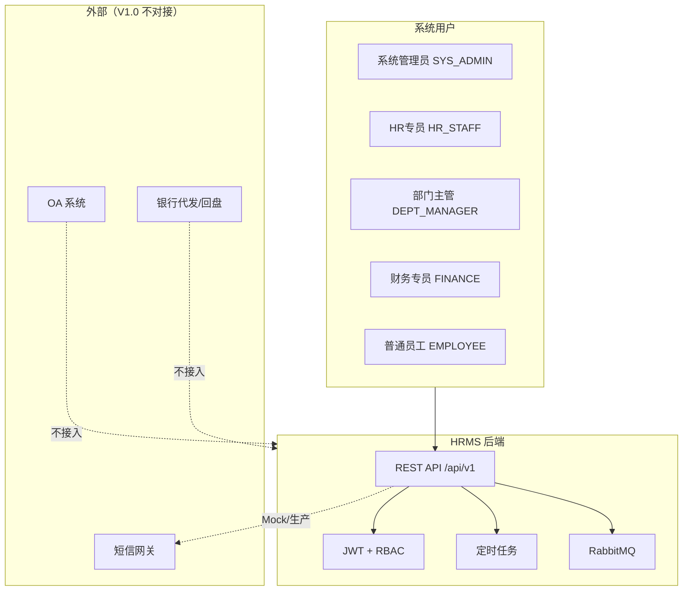

**系统边界（V1.0）：** 包含组织、档案、入转调离、考勤请假加班、薪资、审批、迁移、个人中心；**不包含** OA 对接、银行回盘、移动端 App、Flowable BPM。

### J.3 逻辑数据字典（核心表，最终表名）

> 所有业务表均建议含：`id`, `create_time`, `update_time`, `create_by`, `update_by`, `is_deleted`, `version`。Flyway 以附录 F 映射后表名为准。

**`department`**

| 字段 | 类型 | 必填 | 说明 |
| --- | --- | --- | --- |
| dept_code | VARCHAR(8) | Y | 部门编码，工号用，UK |
| dept_name | VARCHAR(100) | Y | 部门名称 |
| parent_id | BIGINT | N | 上级，0=根 |
| path | VARCHAR(256) | Y | 路径枚举 `/1/3/`，深度≤5 |
| level | TINYINT | Y | 层级 1~5 |
| head_employee_id | BIGINT | N | 部门负责人 |

**`employee`**

| 字段 | 类型 | 必填 | 说明 |
| --- | --- | --- | --- |
| employee_id | BIGINT | Y | 业务主键，永不复用 |
| emp_no | VARCHAR(20) | Y | 展示工号 |
| mobile | VARCHAR(20) | Y | 登录账号，UK |
| employment_status | TINYINT | Y | 10/20/30/40 |
| hire_date | DATE | Y | 入职日 |
| last_work_day | DATE | N | 最后工作日 |
| probation_pay_ratio | DECIMAL(3,2) | Y | 试用薪资比例 0.80~1.00 |

**关键关联：** 算薪依赖 `attendance_monthly_summary`、`leave_application`、`overtime_ledger`；所有 FK 引用 `employee_id`，**不引用 emp_no**。

## 附录 K：错误码、Mock 协议与数据归档（原 SAS §5.2~§5.3、§6.1）

> **权威来源**：[HRMS-API-Contract.md §6](HRMS-API-Contract.md#6-业务错误码)。下表为同步副本；特殊路径见契约 §5.12.1（附录 K.5/K.6）。

### K.1 HTTP 状态码

| HTTP | 含义 | 场景 |
| --- | --- | --- |
| 200 | 成功 | 正常响应 |
| 400 | 参数错误 | 校验失败 |
| 401 | 未登录 | Token 缺失/过期 |
| 403 | 无权限 | 角色/数据范围/字段权限不足 |
| 404 | 不存在 | ID 无效 |
| 409 | 冲突 | 重复提交、乐观锁、批次已存在 |
| 422 | 业务拒绝 | 部门超5层、补卡超限、考勤已锁定 |
| 500 | 系统异常 | 未捕获异常 |

### K.2 业务错误码（`code` 字段，权威）

| code | 说明 |
| --- | --- |
| 0 | 成功 |
| 10001 | 参数校验失败 |
| 20001 | 未登录或 Token 过期 |
| 20002 | 无权限 |
| 20003 | 字段权限不足 |
| 30001 | 部门层级超过 5 层 |
| 30002 | 部门合并前尚有员工 |
| 30003 | 员工状态不允许此操作 |
| 30004 | 调岗部门未变更（须不等于原部门） |
| 40001 | 考勤月已锁定 |
| 40002 | 补卡次数超限（2次/月） |
| 40003 | 请假余额不足 |
| 40004 | 不在打卡有效范围（GPS/IP 校验失败） |
| 50001 | 算薪批次已存在 |
| 50002 | 算薪进行中，请勿重复操作 |
| 50003 | 员工无薪资档案（阻断） |
| 50004 | 考勤数据未锁定（算薪前置不满足） |
| 50005 | 工资条尚未发放或当前不可查看 |
| 60001 | 审批已处理（幂等） |
| 60002 | 审批已超时 / 状态不允许撤销 |
| 60003 | 委托规则冲突（同时仅 1 条） |
| 60004 | 工资条二次验证未通过或已过期 |
| 90001 | 系统内部错误 |

### K.5 工资条二次验证路径（补全 E-5）

| 路径 | 用途 | 说明 |
| --- | --- | --- |
| `POST /profile/payslips/verify` | **员工门户（规范路径）** | 请求体 `{ verifyType, verifyCode }`；成功后 Redis `hrms:payslip:verified:{userId}` TTL 30min |
| `POST /auth/verify` | **同服务别名** | 与上一接口共用 `PayslipVerifyService`；OpenAPI 以 `/profile/payslips/verify` 为准 |

查看详情：`GET /profile/payslips/{period}` 须先验证，否则返回 `60004`。列表摘要 `GET /profile/payslips` 无需验证。HR/财务查看他人工资条走 `GET /payroll/payslips/{month}` + 角色权限，无需员工二次验证。

### K.6 账号安全路径（补全 E-10）

| 路径 | 用途 | 说明 |
| --- | --- | --- |
| `PUT /profile/security/password` | **员工门户（规范路径）** | 请求体 `{ oldPassword, newPassword }`；PRD §9.5 |
| `PUT /auth/password` | **同服务别名** | 登录页首次改密、401 拦截后改密场景 |
| `POST /profile/security/mobile/bind` | **员工门户（规范路径）** | 请求体 `{ mobile, smsCode }`；首次绑定 |
| `DELETE /profile/security/mobile` | **员工门户（规范路径）** | 解绑，须短信验证；**变更手机号**走 `POST /profile/mobile-change-applications` |
| `PUT/DELETE /auth/mobile` | **同服务别名** | 与上一组接口共用 `MobileBindService` |
| `GET /profile/security/login-logs` | **员工门户** | 仅返回当前用户记录（SELF） |
| `GET /system/login-logs` | **管理端** | SYS_ADMIN 全量审计 |

### K.3 接口 Mock 协议（4 人团队并行）

| 项 | 约定 |
| --- | --- |
| 契约工具 | **Apifox**，从 OpenAPI 3.0 导入 |
| 规范来源 | Sprint 0 输出 `openapi.yaml` |
| Mock 策略 | Apifox 自动 Mock + 分支（正常/403/422） |
| 前端基线 | Umi Max request，`UMI_APP_API_BASE` 指向 Apifox Mock |
| 切换时机 | 联调周切换至后端 dev |
| 版本对齐 | `openapi.yaml` semver，破坏性变更升 major |
| Mock 优先 | 部门树、花名册、审批待办、算薪预览、工资条 |

**并行顺序：** S0 OpenAPI+Mock → 前端 Mock 开发 → 后端按模块实现 → 联调替换 baseURL → Apifox 回归集。

### K.4 数据归档策略

| 数据类型 | 在线保留 | 归档策略 |
| --- | --- | --- |
| 打卡明细 | 24 个月 | 超期迁入归档表，月汇总保留 |
| 算薪明细 | 永久 | 已发放批次不可物理删除 |
| 操作日志 | 36 个月 | 按月分表 |
| 登录日志 | 12 个月 | 定期清理 |
| 导入失败报告 | 6 个月 | 文件存对象存储 |

### K.5 性能指标（PRD §11.1）

| 指标 | 要求 |
| --- | --- |
| 员工列表 1000 条 | < 1s |
| 薪资计算 500 人 | < 30s |
| 并发用户 | ≥ 200 |
| 审批待办 | < 500ms |
| 打卡写入 | < 300ms |

## 附录 L：模块依赖、WBS 与数据迁移（原 SAS §7）

### L.1 模块依赖关系

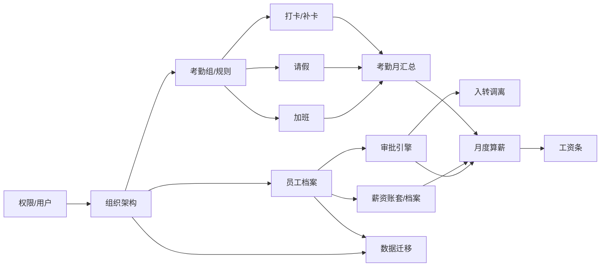

**关键路径：** 组织 → 员工 → 考勤月汇总 → 月度算薪 → 工资条

### L.2 4 人团队 Sprint 计划（前后端+测试）

| Sprint | 周期 | 后端 | 前端 | 测试 |
| --- | --- | --- | --- | --- |
| S0 | 3天 | OpenAPI、Flyway、Apifox Mock | Umi 脚手架、权限框架 | 测试计划模板 |
| S1 | 2周 | 组织+职位+RBAC | 部门树、职位管理 | 组织/权限用例 |
| S2 | 2周 | 员工档案+迁移 | 花名册、导入页 | 档案/迁移用例 |
| S3 | 2周 | 审批引擎 SpEL | 审批中心 | 审批用例 |
| S4 | 2周 | 入转调离 | 四流程 UI | 生命周期用例 |
| S5 | 2周 | 考勤+请假+加班 | 考勤全家桶 | 考勤用例 |
| S6 | 1周 | 月汇总+锁定 | 统计图表 | 锁定用例 |
| S7 | 2周 | 账套+分段计薪 | 核算工作台 | 算薪用例 |
| S8 | 1周 | 工资条+profile | 个人中心 | 工资条用例 |
| S9 | 1周 | 性能+安全+回归 | Bug 修复 | 回归报告 |

### L.3 数据迁移范围（AD-04）

| 数据类型 | 迁移 | 方式 |
| --- | --- | --- |
| 组织架构 | ✓ | Excel `DEPT` |
| 在职员工档案 | ✓ | Excel `EMPLOYEE` |
| 员工薪资档案 | ✓ | Excel `SALARY` |
| 历史考勤月汇总 | ✓ | Excel `ATTENDANCE_SUMMARY`（仅汇总，非逐日打卡） |
| 历史薪资明细 | ✗ | V1.0 不导入 |
| 历史审批记录 | ✗ | 不导入 |

### L.4 Excel 模板列定义

**DEPT（部门）**

| 列名 | 必填 | 校验 |
| --- | --- | --- |
| dept_code | Y | 2~10 位，UK |
| dept_name | Y | ≤100 |
| parent_code | N | 须已存在或为根 |
| head_emp_no | N | 在职员工工号 |
| sort_order | N | 默认 0 |

**EMPLOYEE（员工）**

| 列名 | 必填 | 校验 |
| --- | --- | --- |
| name | Y | |
| mobile | Y | 11 位，UK |
| dept_code | Y | 须存在 |
| position_name | Y | 须存在或通用职位 |
| grade_code | N | 序列内合法 |
| hire_date | Y | yyyy-MM-dd |
| employment_status | N | 10/20，默认 10 |
| email | N | |

**SALARY（薪资档案）**

| 列名 | 必填 | 校验 |
| --- | --- | --- |
| emp_no / mobile | Y | 二选一定位员工 |
| scheme_name | Y | 账套须存在 |
| base_salary | Y | >0 |
| ss_base, hf_base | N | 社保公积金基数 |
| probation_ratio | N | 0.80~1.00 |

**ATTENDANCE_SUMMARY（月汇总）**

| 列名 | 必填 | 校验 |
| --- | --- | --- |
| emp_no / mobile | Y | |
| year_month | Y | yyyy-MM |
| work_days | Y | 应出勤 |
| actual_days | Y | 实际出勤 |
| leave_days | N | 请假天数 |
| late_count | N | 迟到次数 |
| overtime_hours | N | 加班小时 |

**入库规则：** 仅 `import_batch` 全行校验通过方可 `commit`；失败行写入 `import_row_error` 并生成错误报告。

---

# Part II · 技术实现详设

> 以下 §A.1 起为开发落地详设。


## A.0 合并裁决与命名规范（v1.5）

> **权威来源**：Part I §2.2 与附录 F/H 为接口契约与最终表名；Part II 下文 DDL/示例已统一为最终表名，**Flyway 脚本按此生成即可**。

### AD-01~08 架构决策

| ID | 决策 | 实现要点 |
|----|------|---------|
| AD-01 | 自然月 + 考勤锁定 | `attendance_month_lock`；算薪触发 LOCKED |
| AD-02 | 加班独立模块 | `overtime_application` + `overtime_ledger` |
| AD-03 | SpEL 表驱动审批 | `approval_process_def`；禁用 BPM |
| AD-04 | 数据迁移 | `/imports/*` 四类型 Excel 导入 |
| AD-05 | employee_id / emp_no 分离 | FK 仅用 employee_id |
| AD-06 | 加班二审 | SpEL `#dailyTotalHours >= 4` |
| AD-07 | 老板审批双条件 | 批次总实发/调整比例 SpEL |
| AD-08 | 分段计薪 | `ProratedPayrollService` + calc_snapshot_json |

### 部门树存储（修订 v1.5）

**决策修订**：采用 **`parent_id` + `path` 路径枚举**，**不建闭包表** `org_department_closure`。人数统计用 `path LIKE` 或递归 CTE（深度≤5）。原 §A.3.2.1 闭包表方案已废弃。

## 文档说明

本文档聚焦**后端技术实现**，不重复 PRD 业务描述，与 PRD §12.2 所述系统分析文档职责一致。

### PRD 溯源

| 项 | 说明 |
|----|------|
| PRD 文件 | [`人资管理系统-PRD.md`](../人资管理系统-PRD.md) |
| PRD 版本 | 1.0（2026-07-07） |
| 配套前端系分 | [`HRMS-Frontend-System-Design(1).md`](HRMS-Frontend-System-Design(1).md) v1.8.3 |
| API 契约锚点 | [`HRMS-API-Contract.md`](HRMS-API-Contract.md) v1.0.0 |
| 工程目录 | `backend/`（Maven）、`frontend/`（Umi Max）、`config/`（公共配置） |

### PRD 章节 → 系分章节索引

| PRD | 本文档 Part II | 要点 |
|-----|---------------|------|
| §1 概述 | §A.1 | 背景、名词、模块化单体 |
| §2 权限体系 | §A.3.1 | RBAC、DataScope、字段裁剪 |
| §3 组织架构 | §A.3.2 | 部门树≤5层、职位序列 M/P/S |
| §4 员工档案 | §A.3.3 | 工号规则、高级搜索、列表操作 |
| §5 入转调离 | §A.3.4 | 状态机、48h SLA、审批链 |
| §6 考勤 | §A.3.5 | 考勤组、打卡判定、请假规则、统计 |
| §7 薪资 | §A.3.6 | 账套、核算批次、累计预扣、工资条 |
| §8 审批中心 | §A.3.7、§A.3.8 | 9 类审批聚合、委托、工作台 |
| §9 个人中心 | §A.3.9 | `/profile/*` 自助服务 |
| §10 技术栈 | §2.2 | Spring Boot / MyBatis / MySQL / Redis / MQ |
| §11 非功能 | §A.6 | 性能、安全、审计 |
| §12 附录 | §A.9.4 | 状态颜色 |
| SAS 补遗 | Part I 附录 J~L、§A.3.10~12 | 术语、错误码、Mock、WBS、迁移 |

当前实现范围与 PRD 对应关系：

| PRD 章节 | 后端模块 | 覆盖状态 |
|---------|---------|---------|
| §1.1–1.2 背景与目标用户 | 系统定位、角色枚举 | ✅ |
| §1.3 名词定义 | 枚举、数据字典 | ✅ |
| §1.4 后台布局 | 无后端专属；Dashboard API 支撑前端 | ✅ |
| §2.1–2.3 权限体系 | RBAC + 数据权限 + 字段权限 | ✅ |
| §3.1 部门管理 | 组织服务、部门树 | ✅ |
| §3.2 职位管理 | 职位/职级服务 | ✅ |
| §4.1–4.2 员工档案 | 员工服务、高级查询 | ✅ |
| §5.1 入职流程 | 入职申请、审批、确认入职 | ✅ |
| §5.2 转正流程 | 定时提醒、转正审批 | ✅ |
| §5.3 调岗流程 | 调岗申请、多级审批、历史记录 | ✅ |
| §5.4 离职流程 | 离职申请、待离职、生效处理 | ✅ |
| §6.1 考勤规则 | 考勤组、工作日、法定节假日 | ✅ |
| §6.2 打卡功能 | 网页打卡、判定引擎、补卡 | ✅ |
| §6.3 请假管理 | 假期余额、请假审批、加班（§A.3.11） | ✅ |
| §6.4 考勤统计 | 个人/部门维度、汇总任务 | ✅ |
| §7.1 薪资账套 | 账套模板、工资项目、公式引擎 | ✅ |
| §7.2 员工薪资 | 薪资档案、试用期比例、调薪历史 | ✅ |
| §7.3 月度核算 | 批次状态机、异常检测、累计预扣个税 | ✅ |
| §7.4 工资条 | 员工查看、二次验证 | ✅ |
| §8.1 审批类型汇总 | 9 类流程审批链注册 | ✅ |
| §8.2 审批人工作台 | 待办/已办、统一详情、操作 | ✅ |
| §8.3 委托审批 | 委托设置、代审记录 | ✅ |
| §9.1 我的档案 | 本人档案查看/编辑白名单 | ✅ |
| §9.2 我的考勤 | 个人日历、打卡、补卡入口 | ✅ |
| §9.3 我的请假 | 请假记录、进度、撤销 | ✅ |
| §9.4 我的薪资 | 工资条列表、趋势、二次验证 | ✅ |
| §9.5 账号安全 | 改密、手机绑定、登录日志 | ✅ |
| §10 技术栈约束 | Spring Boot/MyBatis/MySQL/Redis/RabbitMQ | ✅ |
| §11 非功能需求 | 性能/安全/容量指标 | ✅ |
| §12.1 状态颜色 | 全局状态 Tag 配色规范 | ✅ |
| §12.2 文档说明 | 本文档即 PRD 所指的系统分析交付物 | ✅ |

---

## A.1 系统概述

### A.1.1 系统定位与范围

**对应 PRD**：§1.1、§1.2

后端提供 HRMS 全部业务能力 API，核心职责：

1. **统一员工主数据**：工号生成、在职状态维护、档案 CRUD
2. **权限与数据隔离**：RBAC + 行级 + 字段级权限（§2）
3. **组织架构**：部门树（≤5 层）、职位序列职级（§3）
4. **流程编排**：入转调离状态机（§5.1–5.4）
5. **薪资核算引擎**：账套、应发/实发、累计预扣法（§7）

**PRD §1.2 目标用户与 API 侧重**：

| 角色 | 核心 API 域 |
|-----|------------|
| HR 专员 | 员工、薪资、考勤、审批全量 |
| 部门主管 | 本部门员工、下属审批（请假/转正/调岗/离职） |
| 普通员工 | `/profile/*` 自助、请假/补卡申请 |
| 财务专员 | 薪资批次审批、成本报表 |
| 系统管理员 | 系统配置、角色管理；**不含**薪资全量（§2.2） |

### A.1.2 整体技术架构

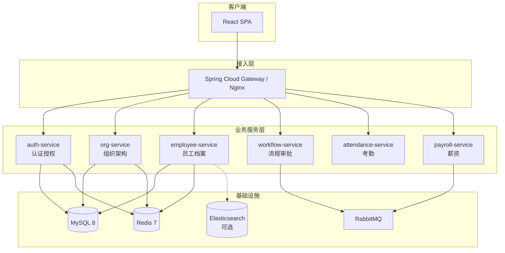

### A.1.3 与 PRD 的对应关系

| PRD 业务规则 | 后端实现要点 |
|------------|------------|
| 工号=年份+部门编码+序号 | `EmployeeIdGenerator` 分布式序号 |
| 登录账号=手机号 | 用户表 `username` = 员工手机号 |
| 部门人数含子部门、仅试用期+正式 | `path LIKE` 子树聚合 / 递归 CTE |
| 部门删除前须清空员工 | 事务内校验 + 业务异常 |
| 工作信息变更须走流程 | 档案 API 拒绝直接更新 dept/position |
| 薪资字段 HR/财务可见性不同 | 字段权限 + 响应 DTO 裁剪 |

### A.1.4 技术挑战与解决方案

| 挑战 | 方案 |
|-----|------|
| 五种角色 × 多模块数据范围 | `DataScopeInterceptor` + 注解 `@DataScope` |
| 字段级权限（§2.3） | `FieldPermissionFilter` 响应裁剪 |
| 敏感信息存储 | AES-256-GCM 列级加密 + 哈希索引 |
| 部门树递归统计性能 | `path` 枚举 + Redis 缓存 `dept:tree`（v1.5，不建闭包表） |
| 员工高级搜索 | MySQL 组合索引；后期 ES 同步 |
| 薪资批量核算（500人） | 批处理 + 并行 + Redis 进度 | ✅ §7.3 |

---

## A.2 系统架构设计

### A.2.1 微服务划分方案

**首期建议**：模块化单体（Modular Monolith），按包划分边界，降低运维成本；预留拆分接口。

| 服务/模块 | 包路径 | 职责 | PRD |
|----------|--------|------|-----|
| auth-module | `com.hrms.auth` | 登录、JWT、RBAC | §2 |
| org-module | `com.hrms.org` | 部门、职位 | §3 |
| employee-module | `com.hrms.employee` | 员工档案、搜索、个人中心档案 | §4、§9.1 |
| workflow-module | `com.hrms.workflow` | 审批流、状态机、审批中心 | §5–§8 |
| attendance-module | `com.hrms.attendance` | 考勤组、打卡、请假、统计 | §6 |
| payroll-module | `com.hrms.payroll` | 账套、核算、工资条 | §7 |
| common-module | `com.hrms.common` | 加密、日志、异常 | — |

### A.2.2 技术栈选型理由

**对应 PRD**：§10.2 后端技术栈约束

| PRD 要求 | 本项目选型 | 说明 |
|---------|-----------|------|
| Spring / Spring Boot | Spring Boot 3.2+ | 满足 PRD 强制框架 |
| MyBatis | MyBatis-Plus 3.5+ | PRD 要求 MyBatis；Plus 提供通用 CRUD，SQL 仍 XML 编写 |
| MySQL | MySQL 8.0 | 主库存储 |
| Redis | Redis 7 | 缓存、分布式锁、Token |
| RabbitMQ | RabbitMQ 3.12 | 流程事件、薪资异步、延迟催办 |

**扩展选型**（非 PRD 强制，首期可选）：

| 组件 | 选型 | 理由 |
|-----|------|------|
| Elasticsearch | 8.x（可选） | 员工 >5000 全文检索 |

### A.2.3 部署架构（生产环境）

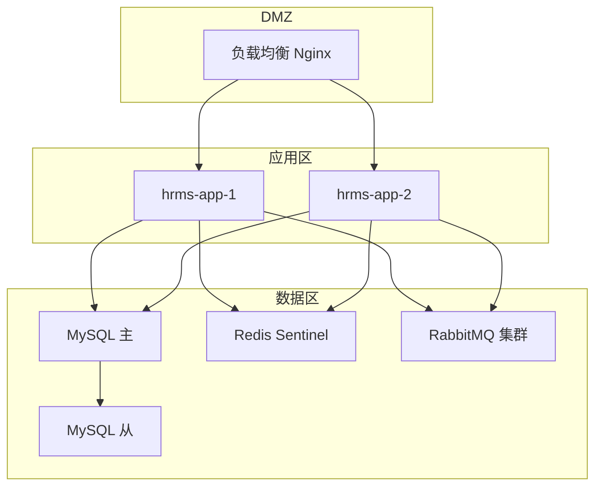

### A.2.4 关键技术决策

| 决策 | 选择 | 权衡 |
|-----|------|------|
| 部门树存储 | **path 枚举**（v1.5） | 深度≤5；不建闭包表；满足人数统计 |
| 流程引擎 | 自研状态机 + 表驱动（首期） | 比 Flowable 轻量；复杂流程后期可迁移 |
| 权限模型 | RBAC + DataScope 枚举 | 满足 PRD 矩阵，不过度抽象 ABAC |
| ID 生成 | DB 序号表 + Redis 锁 | 简单可靠，满足工号规则 |
| 敏感字段 | 应用层加密 | 可搜索字段保留哈希列 |

---

## A.3 模块详细设计

### A.3.1 权限中心模块

**对应 PRD**：§2.1、§2.2、§2.3

#### A.3.1.1 RBAC 模型

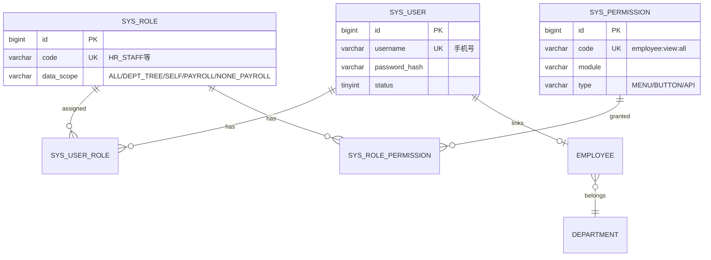

**预置角色与 data_scope**（PRD §2.1）：

| role.code | data_scope | 说明 |
|-----------|-----------|------|
| SYS_ADMIN | NONE_PAYROLL | 全平台非薪资全量；**对薪资接口双拦截**（契约 §4.2） |
| HR_STAFF | ALL | 全部员工；薪资相关全量 |
| DEPT_MANAGER | DEPT_TREE | 本部门及下属 |
| FINANCE | PAYROLL | 薪资相关 |
| EMPLOYEE | SELF | 仅本人 |

#### A.3.1.2 数据权限实现（行级）

```java
@Target(ElementType.METHOD)
@Retention(RetentionPolicy.RUNTIME)
public @interface DataScope {
    DataScopeType value() default DataScopeType.AUTO;
    String deptAlias() default "d";
    String empAlias() default "e";
}

// MyBatis 拦截器
@Component
@Intercepts({@Signature(type = Executor.class, method = "query", args = {...})})
public class DataScopeInterceptor implements Interceptor {
    @Override
    public Object intercept(Invocation invocation) {
        DataScope scope = getDataScopeAnnotation();
        if (scope == null) return invocation.proceed();

        LoginUser user = SecurityUtils.getCurrentUser();
        String sqlFragment = switch (user.getDataScope()) {
            case ALL, PAYROLL -> ""; // PAYROLL 在 Service 层过滤模块
            case DEPT -> buildDeptScopeSql(user.getDeptId(), scope.deptAlias());
            case SELF -> " AND " + scope.empAlias() + ".id = " + user.getEmployeeId();
            default -> " AND 1=0";
        };
        // 注入到 ThreadLocal，XML 中 ${dataScope} 引用
        DataScopeContext.set(sqlFragment);
        return invocation.proceed();
    }
}
```

**部门范围 SQL**（利用 `path` 子树，v1.5）：

```sql
AND ${deptAlias}.id IN (
  SELECT d2.id FROM department d2
  WHERE d2.path LIKE CONCAT(
    (SELECT path FROM department WHERE id = #{currentDeptId}), '%'
  )
  AND d2.deleted = 0
)
```

**PRD §2.2 模块矩阵落地**：

| 模块 | 系统管理员 | HR 专员 | 部门主管 | 财务专员 | 普通员工 |
|-----|-----------|---------|---------|---------|---------|
| 员工档案（全量） | ✅ | ✅ | — | — | — |
| 员工档案（本部门） | ✅ | ✅ | ✅ | — | — |
| 员工档案（仅自己） | ✅ | ✅ | ✅ | ✅ | ✅ |
| 薪资信息（全量） | **❌** | ✅ | — | ✅ | — |
| 薪资信息（仅自己） | — | — | — | — | ✅ |
| 组织架构管理 | ✅ | ✅ | — | — | — |
| 考勤管理 | ✅ | ✅ | 本部门 | — | 仅自己 |
| 审批管理 | ✅ | ✅ | 本部门 | — | 仅自己 |

**系统管理员与薪资**（PRD §2.2 已明确）：`SYS_ADMIN` **不可**访问薪资全量模块（账套、核算批次、他人工资条等）；`data_scope=ALL` 仅作用于组织、员工档案、考勤、审批等非薪资模块。实现上薪资相关 API 额外校验角色 ∈ `{HR_STAFF, FINANCE}`，或普通员工 `SELF` 查本人工资条。

| 模块 | 拦截策略 |
|-----|---------|
| 员工档案（全量） | `@DataScope(ALL)` HR/Admin |
| 员工档案（部门） | `@DataScope(DEPT)` 部门主管 |
| 员工档案（本人） | `@DataScope(SELF)` 普通员工 |
| 薪资（全量） | **仅** HR + 财务；**Admin 拒绝** |
| 考勤 | DEPT 或 SELF 按角色 |

#### A.3.1.3 字段级权限

```java
@Component
public class FieldPermissionFilter {

    private static final Map<String, Map<String, FieldAccess>> MATRIX = Map.of(
        "idNumber", Map.of(
            "HR_STAFF", FieldAccess.VIEW,
            "DEPT_MANAGER", FieldAccess.HIDDEN,
            "EMPLOYEE", FieldAccess.VIEW_SELF
        ),
        "salaryInfo", Map.of(
            "SYS_ADMIN", FieldAccess.HIDDEN,
            "HR_STAFF", FieldAccess.VIEW,
            "DEPT_MANAGER", FieldAccess.HIDDEN,
            "FINANCE", FieldAccess.VIEW,
            "EMPLOYEE", FieldAccess.VIEW_SELF
        )
        // ... PRD §2.3 全量配置可落 DB
    );

    public <T> T filter(T dto, LoginUser user, Long recordEmployeeId) {
        // 反射或 MapStruct 后置处理，无权限字段置 null 或脱敏
    }
}
```

员工详情接口响应：

```json
{
  "code": 0,
  "data": { "name": "张三", "idNumber": "110***********1234", "baseSalary": null },
  "fieldPermissions": {
    "idNumber": "view",
    "baseSalary": "hidden"
  }
}
```

#### A.3.1.4 权限缓存（Redis）

```
Key: hrms:perm:user:{userId}
Value: JSON { permissions: [], dataScope, deptId, employeeId, roles: [] }
TTL: 30min

失效事件:
- 角色变更 → 删除 Key
- 部门调动 → 删除 Key
- 管理员修改权限 → 发布 Redis Pub/Sub 通知
```

---

### A.3.2 组织架构管理模块

**对应 PRD**：§3.1、§3.2

#### A.3.2.1 部门树存储：路径枚举方案（v1.5 修订）

**决策**：采用 **`parent_id` + `path`**（如 `/1/3/7/`），深度 ≤5；**不建闭包表**。

| 方案 | 查询子树 | 写入 | 5层限制 |
|-----|---------|------|--------|
| **路径枚举** | `path LIKE '/1/3/%'` | 移动时更新子树 path | 插入时算 depth |
| ~~闭包表~~ | ~~已废弃 v1.5~~ | — | — |

**部门 CRUD 事务逻辑**：

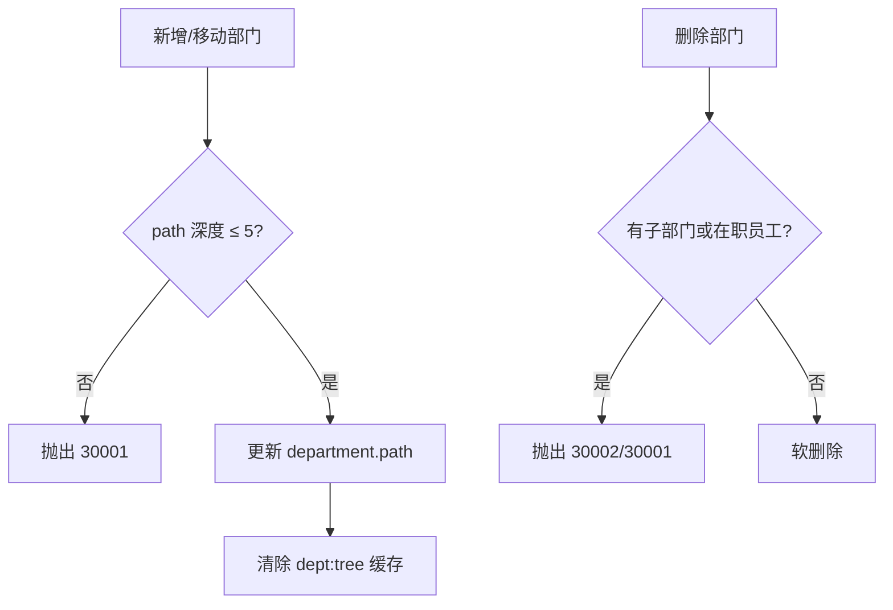

#### A.3.2.2 部门人数统计

**对应 PRD**：§3.1.4

```sql
-- 含下级总人数（headcountIncludingSub）
SELECT d.id, d.name,
       COUNT(e.id) AS headcount_including_sub
FROM department d
JOIN department child ON child.path LIKE CONCAT(d.path, '%')
JOIN employee e ON e.department_id = child.id
  AND e.employment_status IN ('PROBATION', 'REGULAR')
  AND e.deleted = 0
WHERE d.deleted = 0
GROUP BY d.id, d.name;

-- 仅本部门人数（headcount，不含下级）
SELECT d.id, d.name,
       COUNT(e.id) AS headcount
FROM department d
JOIN employee e ON e.department_id = d.id
  AND e.employment_status IN ('PROBATION', 'REGULAR')
  AND e.deleted = 0
WHERE d.deleted = 0
GROUP BY d.id, d.name;
```

**部门树响应字段映射：** `headcount` = 仅本部门人数，`headcountIncludingSub` = 含下级总人数。

优化：部门变更不频繁，可 Redis 缓存 `hrms:dept:headcount:{deptId}`，员工入离职时异步刷新。

#### A.3.2.3 职位与职级模型

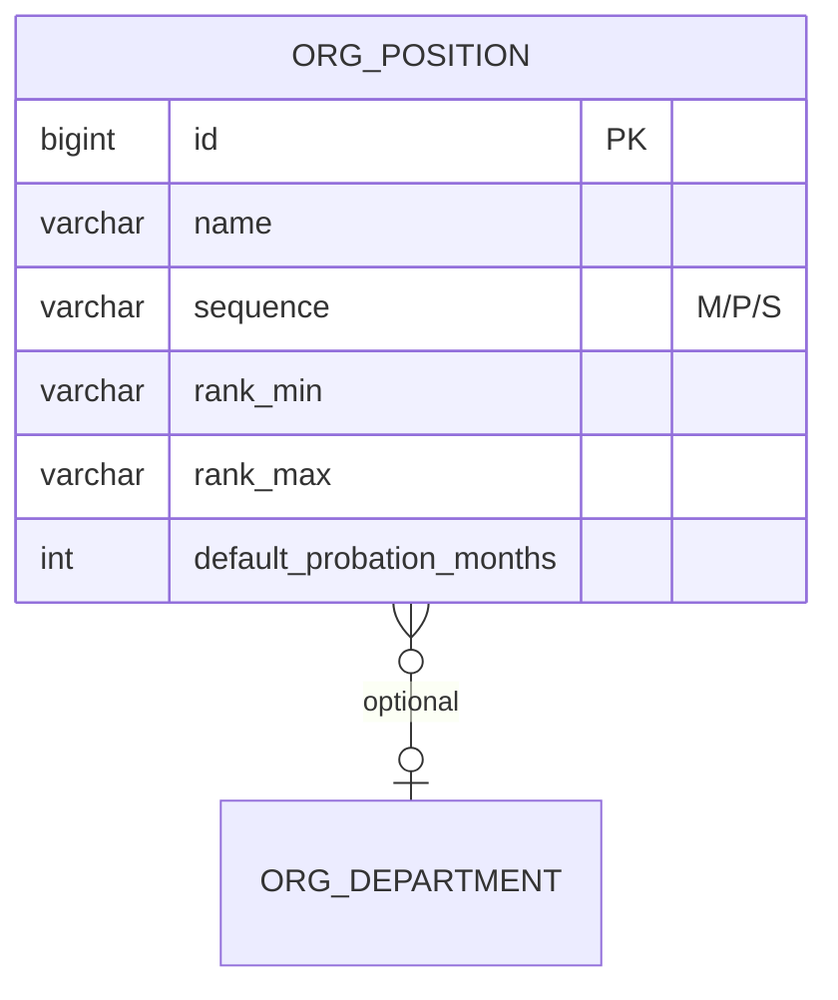

职级范围校验：

```java
public void validateRankRange(String sequence, String rankMin, String rankMax) {
    List<String> validRanks = SequenceRankRegistry.get(sequence); // M1-M5, P1-P10, S1-S5
    if (!validRanks.contains(rankMin) || !validRanks.contains(rankMax)) {
        throw new BusinessException(ErrorCode.INVALID_RANK_RANGE);
    }
    if (validRanks.indexOf(rankMin) > validRanks.indexOf(rankMax)) {
        throw new BusinessException(ErrorCode.RANK_RANGE_ORDER);
    }
}
```

---

### A.3.3 员工档案管理模块

**对应 PRD**：§4.1、§4.2

#### A.3.3.1 数据模型

员工主表 + 扩展表拆分：

- `employee`：核心字段、工作信息、状态
- `employee_personal`：个人详细信息（可加密列）
- `employee_contract`：合同、薪资账套关联
- `employee_bank`：银行信息（加密）

#### A.3.3.2 工号生成

**对应 PRD**：§4.1.1 — 格式 `YYYY` + `部门编码(2位)` + `序号(3位)`

```java
@Service
public class EmployeeIdGenerator {

    public String generate(Long departmentId) {
        String year = String.valueOf(Year.now().getValue());
        String deptCode = departmentMapper.selectCodeById(departmentId); // 2位
        String lockKey = "hrms:emp:seq:" + year + deptCode;
        Long seq = redisLockTemplate.executeWithLock(lockKey, () -> {
            int next = sequenceMapper.nextVal(year, deptCode); // employee_id_sequence_deprecated 表
            return (long) next;
        });
        return year + deptCode + String.format("%03d", seq);
    }
}
```

#### A.3.3.3 敏感信息加密

| 字段 | 存储 | 检索 |
|-----|------|------|
| 身份证号 | AES-256-GCM 密文 | SHA-256 哈希列 `id_number_hash` 精确查 |
| 银行卡号 | AES-256-GCM | 后四位明文列用于展示 |
| 手机号 | 明文（登录账号） | 唯一索引 |

```java
public String encrypt(String plain) {
    // AES/GCM/NoPadding, 随机 IV 前置存储
}

public String hashForQuery(String plain) {
    return DigestUtils.sha256Hex(plain + salt);
}
```

密钥管理：KMS 或环境变量 `HRMS_AES_KEY`，禁止硬编码。

#### A.3.3.4 档案更新规则

```java
@PutMapping("/employees/{id}")
public Result update(@PathVariable Long id, @RequestBody EmployeeUpdateDTO dto) {
    // HR 端白名单：name, gender, email, birthday, addresses...
    // 拒绝：departmentId, positionId, jobLevel, managerId, idNumber, mobile
    // mobile 变更须走 §A.3.9.6 申请流程（PRD §4.1.2 不可直接编辑）
    Set<String> allowed = Set.of("name", "gender", "email", "birthday", ...);
    employeeService.updateAllowedFields(id, dto, allowed);
}
```

#### A.3.3.5 高级查询

**对应 PRD**：§4.2.2

```xml
<!-- EmployeeMapper.xml -->
<select id="search" resultType="EmployeeListVO">
  SELECT e.id, e.employee_no, e.name, d.name AS dept_name,
         p.name AS position_name, e.grade, e.employment_status, e.hire_date
  FROM employee e
  LEFT JOIN department d ON e.department_id = d.id
  LEFT JOIN position p ON e.position_id = p.id
  WHERE e.deleted = 0
  <if test="keyword != null">
    AND (e.name LIKE CONCAT('%',#{keyword},'%')
      OR e.employee_no LIKE CONCAT('%',#{keyword},'%')
      OR e.mobile LIKE CONCAT('%',#{keyword},'%'))
  </if>
  <if test="deptIds != null">
    AND e.department_id IN
    <foreach collection="deptIds" item="id" open="(" close=")" separator=",">#{id}</foreach>
  </if>
  <!-- status, position, level, date range -->
  ${dataScope}
  ORDER BY e.created_at DESC
</select>
```

#### A.3.3.6 列表展示与操作（PRD §4.2）

**默认列表列**（§4.2.1）：`name`、`empNo`、`department`、`position`、`grade`、`employmentStatus`、`hireDate`、操作。

**列表操作**（§4.2.3）：

| 操作 | 权限 | 说明 |
|-----|------|------|
| 查看详情 | 按 DataScope | `GET /employees/{id}` |
| 编辑 | HR / Admin | 字段白名单 §3.3.4 |
| 调岗 | HR | 跳转调岗流程 `POST /transfers` |
| 离职 | HR | 正式离职 `POST /resignations`（须已有已批准的员工离职申请，PRD §5.4.1） |

**Elasticsearch 集成**（员工 > 5000 时启用）：

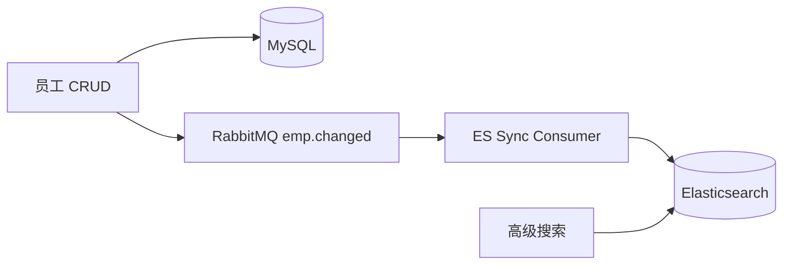

---

### A.3.4 入转调离流程引擎

**对应 PRD**：§5.1–5.4

#### A.3.4.0 流程引擎通用设计

**架构**：自研**状态模式** + **表驱动审批链**，四类流程共用 `approval_instance` / `approval_task` / `approval_log`。

```java
public enum ProcessType {
    ONBOARDING, REGULARIZATION, TRANSFER, RESIGNATION,
    RESIGNATION_REQUEST,  // 员工离职申请（PRD §5.4.1），通过后 HR 再发起 RESIGNATION
    MOBILE_CHANGE,        // 手机号变更申请（PRD §4.1.2）
    LEAVE, MAKEUP, PAYROLL_BATCH
}

public interface WorkflowState {
    ProcessType type();
    String status();
    void submit(WorkflowContext ctx);
    void approve(WorkflowContext ctx);
    void reject(WorkflowContext ctx);
    void withdraw(WorkflowContext ctx);  // HR 撤回，仅第一级
    void forward(WorkflowContext ctx, Long newAssigneeId);  // 转交
}
```

**审批人解析**（`AssigneeResolver`）：

| assigneeType | 解析规则 |
|-------------|---------|
| DEPT_MANAGER | `department.head_employee_id`，按 `sourceField` 取部门 ID |
| NEW_DEPT_MANAGER | 调岗目标部门负责人 |
| ROLE | 按 `roleCode` 查在职用户（如 HR_STAFF） |
| SPECIFIED | 表单指定（如交接人） |

**二级审批开关**（入职 §5.1.4、转正 §5.2）：

```java
public boolean needSecondApproval(ProcessContext ctx) {
    // 非标准职位 或 薪资超出职级范围 → 启用 HR 负责人节点
    return !ctx.isStandardPosition() || ctx.isSalaryOutOfRankRange();
}
```

**审批时效**（§5.1.4）：每级 48h，RabbitMQ 延迟队列到期触发催办/升级。

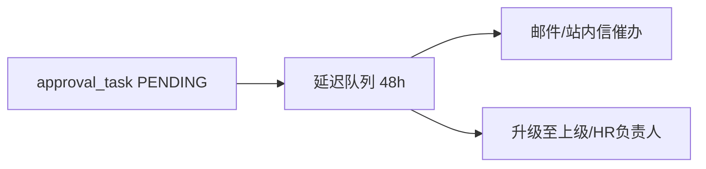

#### A.3.4.1 入职流程

**对应 PRD**：§5.1

##### 状态流转

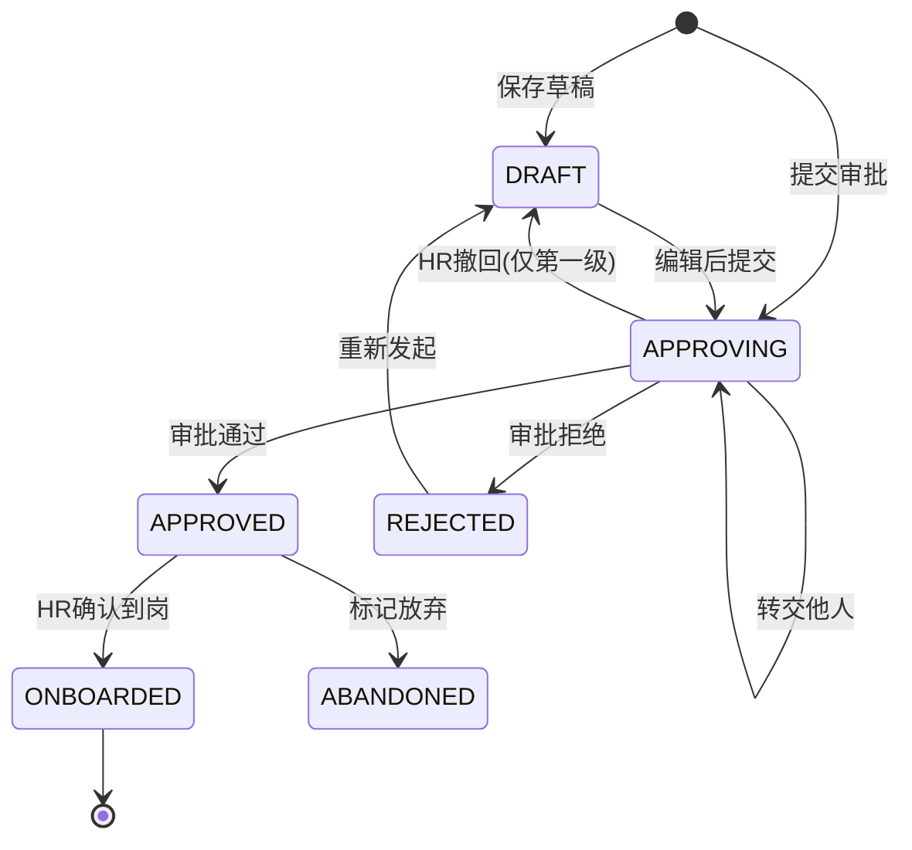

##### 状态 × 角色 × 操作

| 业务状态 | 枚举 | 可见角色 | 可执行操作 |
|---------|------|---------|-----------|
| 草稿 | DRAFT | HR 本人 | 编辑、删除、提交审批 |
| 审批中 | APPROVING | HR、当前审批人 | 审批通过/拒绝、转交；HR 撤回（仅第一级） |
| 已批准待入职 | APPROVED | HR、部门负责人 | 修改预计入职日期、标记放弃 |
| 已拒绝 | REJECTED | HR | 查看原因、重新发起 |
| 已入职 | ONBOARDED | 全员（按权限） | 发起转正流程 |
| 已放弃 | ABANDONED | HR | 查看 |

##### 申请表单字段（`onboarding_application`）

| 字段 | 必填 | 后端校验 |
|-----|------|---------|
| name, gender, mobile, email, idNumber | 是 | 身份证格式；手机号唯一（在职/待入职） |
| expectedOnboardDate | 是 | ≥ 今天 |
| departmentId, positionId | 是 | 部门深度 ≤5；职位存在 |
| employmentType | 是 | fulltime/parttime/intern |
| baseSalary | 是 | 约定薪资；超职级触发二审 |
| probationMonths | 是 | 默认取 `position.default_probation_months` |
| probationSalaryRatio | 是 | 0.80–1.00 |
| managerId | 否 | 默认部门负责人 |

##### 审批链

1. **一级**：部门负责人（固定）
2. **二级**：HR 负责人（可配置开关，条件：非标准职位或薪资超职级范围）

##### 审批通过后自动处理（§5.1.5）

```java
@Transactional
public void onOnboardingApproved(Long applicationId) {
    OnboardingApp app = load(applicationId);
    String employeeNo = employeeIdGenerator.generate(app.getDepartmentId());
    Employee emp = employeeService.createFromOnboarding(app, employeeNo);
    SysUser user = authService.createAccount(app.getMobile(), randomPassword());
    user.setMustChangePassword(true);
    notificationService.sendWelcomeEmail(app.getEmail(), user);
    notificationService.notifyHrAndDeptHead(app);
    // 状态仍为 APPROVED，待 HR 确认到岗后 → ONBOARDED
}
```

**确认入职**（`POST /onboarding/applications/{id}/confirm`）：写入 `actualOnboardDate`，申请 API 状态 → `onboarded`（DB: ONBOARDED）；员工已为试用期（employment_status=10），关联考勤组。

##### 核心 Service

```java
@Service
public class OnboardingService {
    public Long saveDraft(OnboardingCreateDTO dto);
    public void submit(Long id);
    public void withdraw(Long id);           // 校验 current_node == 1
    public void confirmOnboard(Long id, LocalDate actualDate);
    public void abandon(Long id, String reason);
    public void resubmit(Long rejectedId, OnboardingCreateDTO dto);
}
```

#### A.3.4.2 转正流程

**对应 PRD**：§5.2

##### 触发机制

```java
@Scheduled(cron = "0 0 8 * * ?")  // 每日 08:00
public void scanProbationDue() {
    // 条件：employment_status = PROBATION
    //       today >= hire_date + probation_months - 7 days
    List<Employee> dueList = employeeMapper.selectProbationDue(LocalDate.now().plusDays(7));
    dueList.forEach(emp -> notificationService.notifyHrRegularizationDue(emp));
    // 写入 emp_regularization_reminder，状态 PENDING_INIT
}
```

##### 状态流转

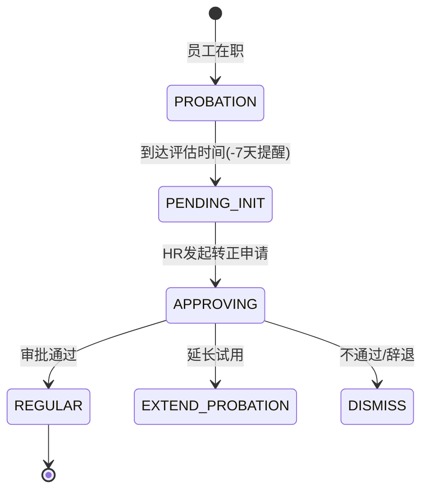

##### 申请表单（`regularization_application`）

| 字段 | 说明 |
|-----|------|
| employeeId | 系统带出 |
| probationStartDate, probationEndDate | 系统计算 |
| performanceEvaluation | 必填，试用期表现 |
| salaryAdjustment | 可选，调整则触发额外审批 |
| approvalResult | PASS / EXTEND / FAIL |

**审批链**：部门负责人 → HR 负责人（固定两级）。

**通过后处理**：

```java
public void onRegularizationApproved(RegularizationApp app) {
    if (app.getResult() == PASS) {
        employeeService.updateStatus(app.getEmployeeId(), REGULAR);
        if (app.getSalaryAdjustment() != null) {
            contractService.updateBaseSalary(app.getEmployeeId(), app.getSalaryAdjustment());
        }
    } else if (app.getResult() == EXTEND) {
        contractService.extendProbation(app.getEmployeeId(), app.getExtendMonths());
    } else {
        resignationService.initiateDismissal(app.getEmployeeId());  // 走离职流程
    }
}
```

#### A.3.4.3 调岗流程

**对应 PRD**：§5.3

##### 发起条件

- 员工状态：`PROBATION` 或 `REGULAR`
- 发起人：HR

##### 可调项校验

| 字段 | 规则 |
|-----|------|
| newDepartmentId | **必须变更**（≠ 原部门） |
| newPositionId, newJobLevel, newManagerId | 可选 |
| salaryAdjustment | 可选；有值则插入额外审批节点 |

##### 审批链

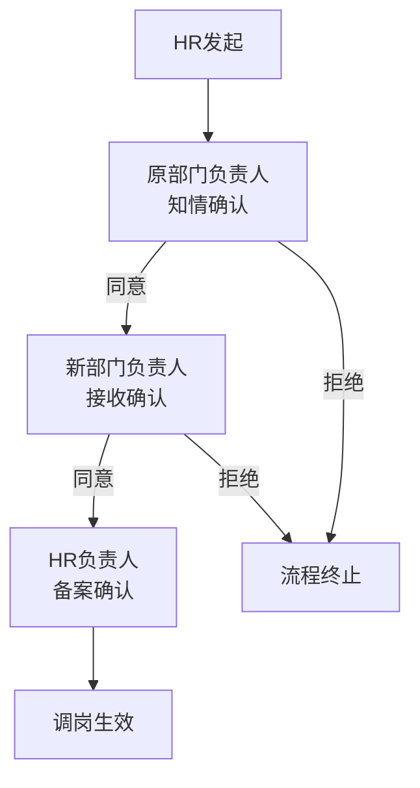

##### 生效处理（§5.3.4）

```java
@Transactional
public void onTransferEffective(TransferApp app) {
    Employee emp = employeeMapper.selectById(app.getEmployeeId());
    TransferHistory hist = TransferHistory.builder()
        .employeeId(emp.getId())
        .fromDeptId(emp.getDepartmentId())
        .toDeptId(app.getNewDepartmentId())
        .fromPositionId(emp.getPositionId())
        .toPositionId(app.getNewPositionId())
        .transferDate(app.getEffectiveDate())
        .reason(app.getReason())
        .build();
    transferHistoryMapper.insert(hist);
    // 工号不变
    employeeService.updateWorkInfo(app);
    orgTreeCache.invalidate();
}
```

业务表：`transfer_application` + `employee_transfer_history`。

#### A.3.4.4 离职流程

**对应 PRD**：§5.4

PRD §5.4.1 规定两条链路：**员工离职申请** → 审批通过 → **HR 发起正式离职**。


##### A.3.4.4.1 员工离职申请（PRD §5.4.1）

| 项 | 说明 |
|----|------|
| 发起人 | 普通员工（在职：试用期/正式） |
| 入口 | `POST /profile/resignation-requests` |
| 审批链 | 直接上级 → HR 专员（备案） |
| 通过后 | 通知 HR；HR 在离职管理页「发起正式离职」并关联 `requestId` |

**申请表单**（`employee_resignation_request`）：

| 字段 | 必填 | 说明 |
|-----|------|------|
| expectedResignDate | 是 | 期望离职日期，≥ 今天 |
| reasonCategory | 是 | VOLUNTARY/INVOLUNTARY/NEGOTIATED |
| resignationType | 是 | RESIGN/DISMISS/CONTRACT_EXPIRE/OTHER |
| reasonDetail | 否 | 详细说明 |

员工可 `GET /profile/resignation-requests` 查看进度；审批中可撤销。

##### A.3.4.4.2 正式离职（HR 发起）

##### 发起条件

- 员工状态：`PROBATION` 或 `REGULAR`
- 发起人：**HR**
- 前置：存在状态为 `APPROVED` 的 `employee_resignation_request`（同一员工；HR 代发特殊离职时可走管理员豁免开关，微项目默认强制关联）

##### 状态流转

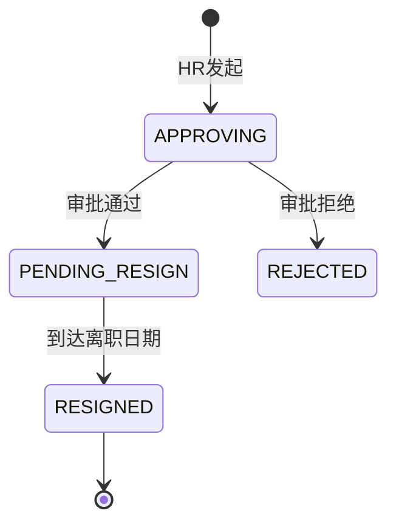

**审批链**：部门负责人（确认交接安排）→ HR 负责人（最终确认）。

##### 申请表单（`resignation_application`）

| 字段 | 必填 | 校验 |
|-----|------|------|
| employeeId | 是 | 系统带出 |
| resignationDate | 是 | ≥ 今天 |
| reasonCategory | 是 | VOLUNTARY/INVOLUNTARY/NEGOTIATED |
| resignationType | 是 | RESIGN/DISMISS/CONTRACT_EXPIRE/OTHER |
| reasonDetail | 否 | 详细说明 |
| handoverEmployeeId | 是 | 在职员工 |

##### 离职生效处理（§5.4.4，定时任务 + 事件）

```java
@Scheduled(cron = "0 5 0 * * ?")  // 每日 00:05
public void processResignationEffective() {
    List<ResignationApp> due = resignationMapper.selectDueToday();
    due.forEach(app -> {
        employeeService.updateStatus(app.getEmployeeId(), RESIGNED);
        authService.disableAccount(app.getEmployeeId());
        employeeNoService.markReleased(app.getEmployeeNo());  // 本年度可复用
        attendanceService.removeFromGroup(app.getEmployeeId());
        payrollService.settleToDate(app.getEmployeeId(), app.getResignationDate());
        // 档案保留，敏感字段脱敏策略同 FieldPermissionFilter
    });
}
```

审批通过后先将员工状态置为 `PENDING_RESIGN`，等待最后工作日。

#### A.3.4.5 流程定义配置

四类流程节点 JSON 存 `approval_process_def`：

```json
{
  "processType": "ONBOARDING",
  "nodes": [
    { "order": 1, "assigneeType": "DEPT_MANAGER", "sourceField": "departmentId" },
    { "order": 2, "assigneeType": "ROLE", "roleCode": "HR_STAFF", "optional": true,
      "condition": "needSecondApproval" }
  ],
  "slaHours": 48
}
```

```json
{
  "processType": "TRANSFER",
  "nodes": [
    { "order": 1, "assigneeType": "DEPT_MANAGER", "sourceField": "fromDepartmentId", "label": "原部门确认" },
    { "order": 2, "assigneeType": "NEW_DEPT_MANAGER", "sourceField": "newDepartmentId", "label": "新部门接收" },
    { "order": 3, "assigneeType": "ROLE", "roleCode": "HR_STAFF", "label": "HR备案" }
  ]
}
```

---

### A.3.5 考勤管理模块

**对应 PRD**：§6.1–6.4

#### A.3.5.1 考勤规则配置（§6.1）

##### 考勤组模型

考勤组 = 适用人员 + 班次规则 + 阈值。员工通过「部门/职位/个人」匹配唯一生效组（优先级：个人 > 职位 > 部门）。

| 字段 | 必填 | 存储 |
|-----|------|------|
| name | 是 | `attendance_group.name` |
| shiftType | 是 | FIXED / FLEXIBLE / SCHEDULE |
| workStartTime, workEndTime | 是 | TIME |
| lunchBreakStart/End | 否 | 默认 12:00–13:00 |
| flexStartEarliest, flexStartLatest | 否 | 弹性班最早/最晚打卡 |
| lateThresholdMinutes | 是 | 默认 15 |
| earlyLeaveThresholdMinutes | 是 | 默认 15 |
| ipWhitelist | 否 | JSON 数组 |
| gpsRange | 否 | JSON `{ lat, lng, radiusM }` |

**适用人员**（`attendance_group_scope`）：

```sql
-- scope_type: DEPARTMENT / POSITION / EMPLOYEE
INSERT INTO attendance_group_scope (group_id, scope_type, scope_id) VALUES (1, 'DEPARTMENT', 101);
```

员工入离职/调岗时，`AttendanceGroupAssignService` 异步刷新 `attendance_group_member` 映射。

##### 工作日与法定节假日（§6.1.2）

```sql
-- 全局工作日：默认周一至周五
att_workday_config (day_of_week TINYINT, is_workday TINYINT)

-- 法定节假日提前配置，考勤统计自动排除
holiday_calendar (holiday_date DATE, name VARCHAR(64))
```

**应出勤天数**计算：`当月工作日 − 法定节假日`，不含员工个人请假。

#### A.3.5.2 打卡功能（§6.2）

##### 打卡方式（§6.2.1）

- **网页端打卡**：登录后 `POST /attendance/punch`，携带可选 GPS
- **限制校验**：IP 白名单 / GPS 范围（配置在考勤组），不满足返回 `40004`（附录 K）

##### 打卡判定引擎（§6.2.2）

```java
@Service
public class PunchJudgeService {

    public PunchResult judge(Employee emp, PunchType type, LocalDateTime punchTime) {
        AttendanceGroup group = groupResolver.resolve(emp.getId());
        LocalTime scheduled = type == IN ? group.getWorkStartTime() : group.getWorkEndTime();
        int threshold = group.getLateThresholdMinutes(); // 早退同理用 earlyLeaveThreshold

        if (type == IN) {
            if (!punchTime.toLocalTime().isAfter(scheduled)) return normal();
            if (!punchTime.toLocalTime().isAfter(scheduled.plusMinutes(threshold))) return late();
            return absentHalfDay();  // 旷工半天
        } else { // OUT
            if (!punchTime.toLocalTime().isBefore(scheduled)) return normal();
            if (!punchTime.toLocalTime().isBefore(scheduled.minusMinutes(threshold))) return earlyLeave();
            return absentHalfDay();
        }
    }
}
```

| 场景 | 判定 | 日汇总标记 |
|-----|------|-----------|
| 上班 ≤ 规定时间 | 正常 | NORMAL |
| 规定 < 上班 ≤ 规定+阈值 | 迟到 | LATE |
| 上班 > 规定+阈值 | 旷工半天 | ABSENT_HALF |
| 下班 ≥ 规定时间 | 正常 | NORMAL |
| 规定−阈值 ≤ 下班 < 规定 | 早退 | EARLY_LEAVE |
| 下班 < 规定−阈值 | 旷工半天 | ABSENT_HALF |
| 当日无打卡 | 缺勤 | ABSENT |

##### 缺卡状态（§6.2.3）

日终批处理（`@Scheduled 23:30`）聚合 `attendance_record` → `attendance_daily_summary`：

| 情况 | 标记 |
|-----|------|
| 无上班卡，有下班卡 | MISSING_IN |
| 有上班卡，无下班卡 | MISSING_OUT |
| 完全无记录且为工作日 | ABSENT |

##### 补卡申请（§6.2.3）

- 每月最多 **2 次**，走轻量审批（直接上级）
- 通过后写入 `attendance_record`（`source=MAKEUP`）并重算日汇总

```java
public void applyMakeup(MakeupApplyDTO dto) {
    int used = makeupMapper.countThisMonth(dto.getEmployeeId());
    if (used >= 2) throw new BusinessException(ErrorCode.MAKEUP_LIMIT_EXCEEDED);
    workflowService.start(ProcessType.MAKEUP, dto);
}
```

##### 高并发打卡

Redis 幂等键 `hrms:punch:{empId}:{date}:{type}` + 异步落库；日汇总最终一致。

#### A.3.5.3 请假管理（§6.3）

##### 请假类型（§6.3.1）

| 类型 | 余额管理 | 证明材料 |
|-----|---------|---------|
| ANNUAL 年假 | 是 | 无 |
| SICK 病假 | 否 | >1 天需医院证明 |
| PERSONAL 事假 | 否 | 无 |
| MARRIAGE 婚假 | 否 | 结婚证 |
| MATERNITY 产假 | 否 | 医院证明 |
| BEREAVEMENT 丧假 | 否 | 无 |
| COMP_OFF 调休 | 是 | 无，余额须 >0 |

##### 假期余额计算（§6.3.2）

**年假**（按工龄，年初初始化 + 入职首年按比例）：

```java
public BigDecimal calcAnnualLeaveDays(Employee emp, int year) {
    int years = emp.getTenureYears();
    int base = years >= 20 ? 15 : years >= 10 ? 10 : years >= 1 ? 5 : 0;
    if (emp.getOnboardYear() == year) {
        int monthsLeft = 12 - emp.getOnboardMonth() + 1;
        return base.multiply(BigDecimal.valueOf(monthsLeft))
                   .divide(BigDecimal.valueOf(12), 1, RoundingMode.HALF_UP);
    }
    return BigDecimal.valueOf(base);
}
```

**调休**：加班 1:1 折算小时，当月+次月有效，过期 `@Scheduled` 清零。

##### 请假申请（§6.3.3）

表单字段：`leaveType`、`startTime`、`endTime`（日期+上午/下午）、`days`（系统计算，支持 0.5 天）、`reason`、`handoverEmployeeId`（可选）、`attachment`（病/婚/产假必填）。

**天数计算**：按工作日历排除周末/法定假日，半天以 12:00 为界。

##### 请假审批链（§6.3.4）

| 类型 + 天数 | 审批人 |
|------------|--------|
| 年假/调休 ≤ 3 天 | 直接上级 |
| 年假/调休 > 3 天 | 直接上级 → 部门负责人 |
| 病假/事假 ≤ 1 天 | 直接上级 |
| 病假/事假 > 1 天 | 直接上级 → 部门负责人 |
| 婚假/产假/丧假 | 直接上级 → HR 备案（无需二审） |

复用 `workflow-module`，`processType=LEAVE`。

**通过后**：扣减余额（年假/调休）、写入 `att_leave_record`、参与日汇总「请假天数」统计。

#### A.3.5.4 考勤统计（§6.4）

##### 个人维度（§6.4.1）

| 指标 | 计算 |
|-----|------|
| 应出勤天数 | 当月工作日 − 法定假日 |
| 实际出勤天数 | 有有效打卡或已批准请假的出勤日 |
| 迟到/早退次数 | `attendance_daily_summary` 计数 |
| 旷工天数 | ABSENT + ABSENT_HALF×0.5 |
| 请假天数 | 各类型汇总 |
| 加班时长 | 已批准加班小时 |
| 年假余额 | `leave_balance` |

##### 部门维度（§6.4.2，HR/部门主管 `@DataScope(DEPT)`）

```
部门出勤率 = Σ实际出勤 / Σ应出勤
部门迟到率 = Σ迟到人次 / 部门人数
部门请假率 = Σ请假天数 / Σ应出勤
```

##### 汇总任务

```java
@Scheduled(cron = "0 30 1 * * ?")  // 每日 01:30 重算昨日
public void aggregateDailySummary() { ... }

@Scheduled(cron = "0 0 2 1 * ?")   // 每月 1 日 02:00 生成上月报表
public void generateMonthlyReport() { ... }
```

报表表：`attendance_monthly_summary`（employee_id + period + 各指标 JSON）。

##### 对外 API 数据供前端 AntV 图表（§6.4.3）

- 部门出勤率趋势（近 6 月）
- 请假类型分布（当月 Pie）
- 迟到早退排行（部门 Bar）
- 考勤日历（个人/HR 全局）

---

### A.3.6 薪资管理模块

**对应 PRD**：§7.1–7.4

**角色约束**（PRD §2.2）：薪资全量 API 仅 `HR_STAFF`、`FINANCE` 可访问；`SYS_ADMIN` **拒绝**（403），普通员工仅 `/profile/payslips` 查本人。

#### A.3.6.1 薪资账套（§7.1）

账套 = 工资模板，定义薪资构成项及计算规则。员工通过适用范围（部门/职位/职级）或薪资档案显式绑定。

##### 账套字段（`payroll_scheme`）

| 字段 | 必填 | 说明 |
|-----|------|------|
| name | 是 | 如「标准职员工资」 |
| scope | 是 | 部门/职位/职级，存 `payroll_scheme_scope` |
| effectiveDate | 是 | 生效日期 |
| status | 是 | ENABLED / DISABLED |
| items | 是 | 工资项目列表 |

##### 工资项目类型（§7.1.2）

| item_type | 说明 | 计算方式 | 示例 |
|-----------|------|---------|------|
| FIXED | 固定收入 | 直接取值 | 基本工资、岗位津贴 |
| VARIABLE | 变动收入 | 公式计算 | 绩效=基数×系数；加班=时薪×倍数×时长 |
| ATTENDANCE_DEDUCT | 考勤扣款 | 规则计算 | 迟到=50×次数；请假=日薪×天数 |
| SS_DEDUCT | 社保扣除 | 基数×比例 | 养老 8%、医疗 2%、失业 0.5% |
| HF_DEDUCT | 公积金扣除 | 基数×比例 | 公积金 12% |
| TAX | 个税 | 累计预扣法 | 系统自动 |

##### 公式引擎

```java
@Component
public class SalaryFormulaEngine {

    public BigDecimal evaluate(PayItem item, SalaryCalcContext ctx) {
        return switch (item.getItemType()) {
            case FIXED -> ctx.getProfile().getFixedValue(item.getItemCode());
            case VARIABLE -> evalExpression(item.getFormula(), ctx);  // SpEL 或 Aviator
            case ATTENDANCE_DEDUCT -> attendanceDeductionService.calc(item, ctx);
            case SS_DEDUCT, HF_DEDUCT -> ctx.getBase(item.getBaseField())
                    .multiply(item.getRatio()).setScale(2, HALF_UP);
            case TAX -> taxCalculator.calc(ctx);  // 累计预扣法
            default -> BigDecimal.ZERO;
        };
    }
}
```

**标准职员账套示例**（§7.1.3）存为系统预置模板 `STANDARD_EMPLOYEE`，可克隆编辑。

#### A.3.6.2 员工薪资设置（§7.2）

##### 薪资档案（`employee_salary_profile`）

| 字段 | 说明 |
|-----|------|
| employeeId | 员工 |
| templateId | 适用账套 |
| baseSalary | 基本工资 |
| allowanceBaseJson | 各项津贴基数 JSON |
| ssBase, hfBase | 社保/公积金基数 |
| performanceBase | 绩效基数（可选） |
| probationRatio | 试用期比例 0.80–1.00 |

**调薪历史**（`employee_salary_history`）：记录调薪前后金额、生效日、原因、操作人。

##### 试用期薪资规则（§7.2.2）

```java
public BigDecimal effectiveFixedAmount(BigDecimal amount, Employee emp) {
    if (emp.getEmploymentStatus() != PROBATION) return amount;
    return amount.multiply(emp.getProbationRatio()).setScale(2, HALF_UP);
}

public BigDecimal socialSecurityBase(Employee emp) {
    // 试用期仍按全额基数缴纳，不受 probationRatio 影响
    return profile.getSsBase();
}
```

仅**基本工资、津贴**受试用期比例影响；社保公积金基数、个税累计不受影响。

#### A.3.6.3 月度薪资核算（§7.3）

##### 核算流程

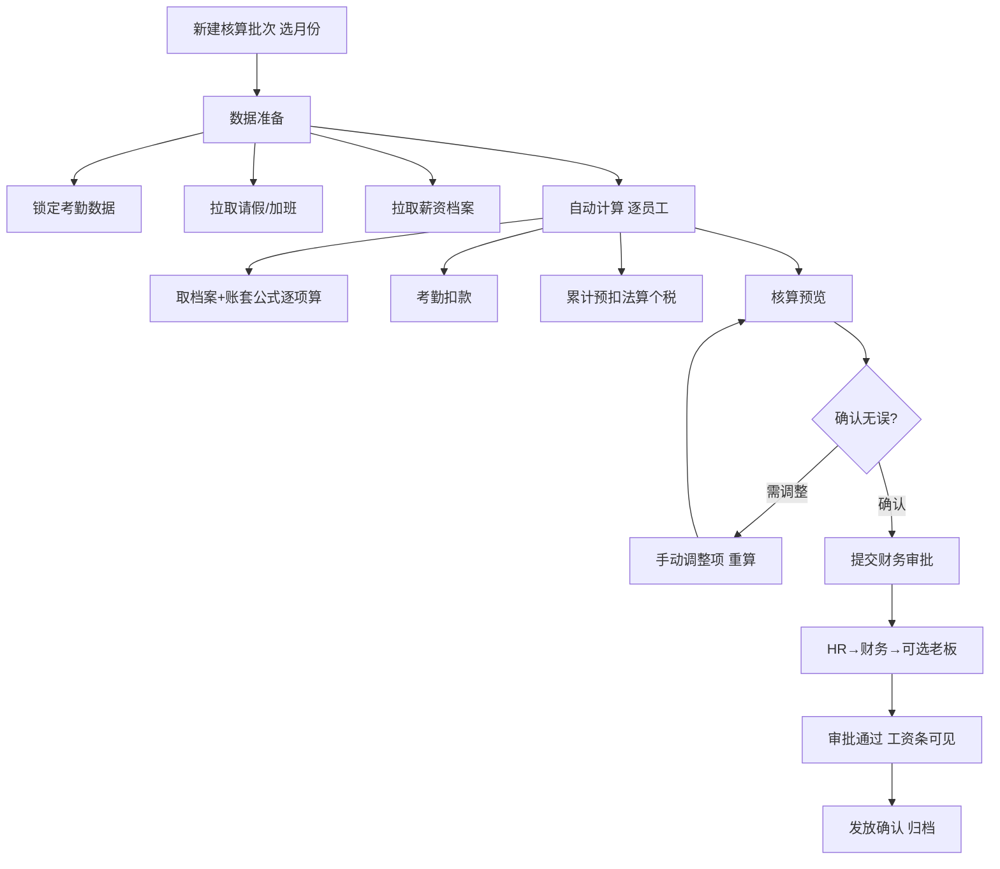

##### 批次状态机（§7.3.2）

| 状态 | 枚举 | 说明 | 可执行操作 |
|-----|------|------|-----------|
| 草稿 | DRAFT | 刚创建，数据准备中 | 删除、开始计算 |
| 计算中 | CALCULATING | 系统计算 | 等待 |
| 待确认 | PENDING_CONFIRM | 计算完成待 HR 确认 | 预览、调整、提交审批 |
| 审批中 | APPROVING | 已提交财务 | 查看进度 |
| 已通过 | APPROVED | 审批通过，工资条可见 | 发放确认 |
| 已发放 | DISTRIBUTED | 实际已发放 | 归档 |
| 已驳回 | REJECTED | 审批未通过 | 修改后重新提交 |

```java
@Service
public class PayrollBatchService {
    @Async
    public void startCalculation(Long batchId) {
        batchMapper.updateStatus(batchId, CALCULATING);
        List<Employee> emps = employeeMapper.selectActiveForPeriod(batch.getPeriod());
        emps.parallelStream().forEach(emp -> calcOne(batchId, emp));
        anomalyDetector.scan(batchId);
        batchMapper.updateStatus(batchId, PENDING_CONFIRM);
    }
}
```

##### 单员工计算

```
应发 gross = Σ(固定收入+变动收入) − Σ(考勤扣款)   // 试用期比例已应用于固定项
实发 net   = gross − Σ(社保+公积金) − 个税
```

**数据依赖**：`attendance_monthly_summary`（请假天数、迟到次数、加班时长）、`employee_salary_profile`、账套公式。

##### 异常检测（§7.3.3）

| 级别 | 规则 | 标记 |
|-----|------|------|
| 黄 WARN | 当月请假 > 15 天 | LEAVE_HIGH |
| 黄 WARN | 当月加班 > 50 小时 | OVERTIME_HIGH |
| 红 ERROR | 较上月变动 > 30% | SALARY_CHANGE_HIGH |
| 红 BLOCK | 新员工无薪资档案 | NO_SALARY_PROFILE |

`payroll_detail.anomaly_flags` JSON 数组；BLOCK 级员工 `calc_status=FAILED`，整批仍可预览但 HR 须处理。

##### 累计预扣法个税（§7.1.2）

```java
@Service
public class CumulativeTaxCalculator {

    public BigDecimal calc(SalaryCalcContext ctx) {
        // 累计收入 = 本年此前 months 应发 taxable 合计 + 本月 taxable
        BigDecimal cumulativeIncome = taxRecordMapper.sumTaxableYtd(ctx.getEmployeeId(), ctx.getPeriod());
        BigDecimal cumulativeDeduction = standardDeduction(ctx);  // 5000×月数 + 专项附加
        BigDecimal cumulativeTaxable = cumulativeIncome.subtract(cumulativeDeduction).max(ZERO);
        BigDecimal taxTotal = applyTaxBrackets(cumulativeTaxable);
        BigDecimal taxPaid = taxRecordMapper.sumTaxPaidYtd(ctx.getEmployeeId(), ctx.getPeriod());
        return taxTotal.subtract(taxPaid).max(ZERO);  // 本月应扣
    }
}
```

税率表存 `pay_tax_bracket` 或配置中心，支持年度更新。

##### 审批链

HR 提交 → 财务专员审批 → 可选老板审批（开关 `payroll.need_boss_approval`）。

复用 `workflow-module`，`processType=PAYROLL_BATCH`。

#### A.3.6.4 工资条（§7.4）

##### 查看规则

- 员工**仅本人**，`@DataScope(SELF)`
- 批次状态 ≥ `APPROVED` 后可查看
- **首次查看**需二次验证（密码/短信），Token 存 Redis `hrms:payslip:verified:{userId}` TTL 30min

##### 工资条内容

```json
{
  "period": "2024-07",
  "employee": { "name": "张三", "employeeNo": "202401005", "department": "技术部" },
  "earnings": [
    { "name": "基本工资", "amount": 10000.00 },
    { "name": "岗位津贴", "amount": 2000.00 },
    { "name": "绩效奖金", "amount": 3600.00 }
  ],
  "grossSalary": 15600.00,
  "deductions": [
    { "name": "事假扣款", "amount": -500.00 },
    { "name": "养老保险", "amount": -640.00 }
  ],
  "totalDeduction": 2620.00,
  "netSalary": 12980.00
}
```

HR 端「工资条管理」列表展示发放状态；员工端 §9.4 `/profile/payslips/*` 按月查看，支持打印/下载 PDF。

#### A.3.6.5 500 人规模性能优化

| 策略 | 说明 |
|-----|------|
| 批量 INSERT | 每批 100 条 `payroll_detail` |
| 并行计算 | `parallelStream` / `CompletableFuture` 按部门分片 |
| 只读缓存 | 账套、税率表 Redis 缓存 |
| 异步任务 | 核算 MQ 消费，Redis 进度 `hrms:payroll:batch:{id}:progress` |
| 避免 N+1 | 一次批量查档案+考勤汇总 |

目标：**500 人全量核算 < 30s**。

---

### A.3.7 审批中心模块

**对应 PRD**：§8.1–8.3（聚合 §5/§6/§7 全部审批流）

审批中心是各业务模块流程的**统一入口**，不负责业务状态机本身（由各 `*Service` 负责），职责：待办分发、详情聚合、审批操作、委托、超时催办。

#### A.3.7.1 审批类型汇总（§8.1）

| 业务类型 | processType | 发起人 | 审批链 |
|---------|-------------|--------|--------|
| 入职审批 | ONBOARDING | HR | 部门负责人 → [HR 负责人] |
| 转正审批 | REGULARIZATION | HR | 部门负责人 → HR 负责人 |
| 调岗审批 | TRANSFER | HR | 原部门负责人 → 新部门负责人 → HR 负责人 |
| 员工离职申请 | RESIGNATION_REQUEST | 员工 | 直接上级 → HR 专员（PRD §5.4.1） |
| 离职审批 | RESIGNATION | HR | 部门负责人 → HR 负责人 |
| 手机号变更 | MOBILE_CHANGE | 员工 | HR 专员（PRD §4.1.2） |
| 请假审批 | LEAVE | 员工 | 见 §6.3.4（按类型+天数） |
| 补卡审批 | MAKEUP | 员工 | 直接上级 |
| 加班审批 | OVERTIME | 员工 | 直接上级 → [HR 负责人]（单日≥4h 触发二审，AD-06）|
| 薪资批次审批 | PAYROLL_BATCH | HR | 财务专员 → [老板] |

方括号节点为可配置/条件触发，定义存 `approval_process_def.nodes_json`。

```java
@Component
public class ProcessTypeRegistry {
    private static final Map<ProcessType, ProcessDefinitionRef> MAP = Map.of(
        ONBOARDING, ref("onboarding_application", OnboardingDetailAdapter.class),
        REGULARIZATION, ref("regularization_application", RegularizationDetailAdapter.class),
        TRANSFER, ref("transfer_application", TransferDetailAdapter.class),
        RESIGNATION, ref("resignation_application", ResignationDetailAdapter.class),
        RESIGNATION_REQUEST, ref("employee_resignation_request", ResignationRequestDetailAdapter.class),
        MOBILE_CHANGE, ref("employee_mobile_change_application", MobileChangeDetailAdapter.class),
        LEAVE, ref("leave_application", LeaveDetailAdapter.class),
        MAKEUP, ref("attendance_supplement", MakeupDetailAdapter.class),
        OVERTIME, ref("overtime_application", OvertimeDetailAdapter.class),
        PAYROLL_BATCH, ref("payroll_batch", PayrollBatchDetailAdapter.class)
    );
}
```

**DetailAdapter**：按 `processType` 加载业务表单 DTO，供统一详情 API 返回。

#### A.3.7.2 审批人工作台（§8.2）

##### 待办列表

```java
@GetMapping("/approvals/tasks")
public PageResult<TaskWorkbenchVO> pendingTasks(
    @RequestParam(required = false) ProcessType type,
    @RequestParam(required = false) TaskFilterStatus status,  // ALL/OVERDUE
    @RequestParam(required = false) String keyword,
    @RequestParam int page, @RequestParam int pageSize) {
    // assignee_id = 当前用户 OR 当前用户为有效被委托人
}
```

**TaskWorkbenchVO 字段**（§8.2.1）：

| 字段 | 说明 |
|-----|------|
| taskId, instanceId | 任务/实例 ID |
| applicantName, applicantDept | 发起人 |
| processType, processTypeLabel | 申请类型 |
| businessNo | 如 APR-2024-001 |
| businessSummary | 摘要 |
| currentNodeLabel | 当前节点，如「部门负责人审批」 |
| createdAt | 申请时间 |
| dueAt | 截止时间 |
| overdue | 是否逾期 |

**操作**：查看详情、通过、拒绝、转交。

##### 工作台统计（§8.4 原型）

```
GET /approvals/tasks/stats
→ { pending: 6, approvedToday: 1, overdueCount: 6 }
```

##### 已办列表

`GET /approvals/tasks?status=done` — 同字段，含 `completedAt`、`action`（APPROVED/REJECTED/FORWARDED）。

##### 审批详情页（§8.2.2）

```
GET /approvals/tasks/{id}
```

响应结构：

```json
{
  "task": { "id", "status", "dueAt", "currentNodeLabel" },
  "instance": { "processType", "businessNo", "initiator", "createdAt" },
  "businessDetail": { /* 按 processType 动态，如入职候选人信息 */ },
  "timeline": [ { "node", "assignee", "action", "comment", "time" } ],
  "actions": ["APPROVE", "REJECT", "FORWARD"]
}
```

**businessDetail 示例**（入职）：姓名、部门、职位、入职日期、薪资、合同类型等，由各 Adapter 组装；敏感字段走 `FieldPermissionFilter`。

##### 审批操作 API

| 操作 | 路径 | 说明 |
|-----|------|------|
| 通过 | `POST /approvals/tasks/{id}/action` | `{ comment }` |
| 拒绝 | `POST /approvals/tasks/{id}/action` | `{ comment }` 必填 |
| 转交 | `POST /approvals/tasks/{id}/action` | `{ targetUserId, comment }` |
| 撤回 | `POST /approvals/instances/{id}/withdraw` | 仅发起人且 current_node=1 |

```java
@Transactional
public void approve(Long taskId, ApproveDTO dto, LoginUser operator) {
    WfTask task = resolveTaskWithDelegation(taskId, operator);
    // 若 operator 为 delegate，audit 记录 on_behalf_of
    auditLog.record(task, operator, task.getAssigneeId(), APPROVE, dto.getComment());
    stateMachine.drive(task.getInstanceId(), APPROVE);
    notificationService.notifyNextNode(task.getInstanceId());
}
```

#### A.3.7.3 委托审批（§8.3）

**规则**：
1. 委托期内新生成待办自动分配给被委托人
2. 同一委托人**同时仅允许一条**有效委托
3. 可随时取消；取消后新任务不再转交
4. 代审时审计记录「XXX 代 YYY 审批」

```java
@Service
public class DelegationService {

    public Long create(DelegationCreateDTO dto, Long delegatorId) {
        if (delegationMapper.existsActive(delegatorId)) {
            throw new BusinessException(ErrorCode.DELEGATION_ALREADY_ACTIVE);
        }
        if (dto.getDelegateUserId().equals(delegatorId)) {
            throw new BusinessException(ErrorCode.DELEGATION_SELF);
        }
        return delegationMapper.insertActive(delegatorId, dto);
    }

    public void cancel(Long delegationId, Long delegatorId) {
        delegationMapper.updateStatus(delegationId, CANCELLED);
    }

    /** 任务分配时调用：若 assignee 有有效委托，actual assignee 改为 delegate */
    public Long resolveAssignee(Long originalAssigneeId, LocalDate today) {
        return delegationMapper.findActiveDelegate(originalAssigneeId, today)
                .orElse(originalAssigneeId);
    }
}
```

**委托 API**：

| 方法 | 路径 | 说明 |
|-----|------|------|
| GET | `/approvals/delegations` | 当前有效委托 + 历史 |
| POST | `/approvals/delegations` | 新增 `{ delegateUserId, startDate, endDate, reason }` |
| DELETE | `/approvals/delegations/{id}` | 取消委托 |

#### A.3.7.4 审批历史与审计

`approval_log` 扩展字段：

| 字段 | 说明 |
|-----|------|
| operator_id | 实际操作人 |
| on_behalf_of_id | 被代审的原审批人，NULL=本人操作 |
| display_text | 如「孙强 代 李明 审批」 |

详情页 Timeline 优先展示 `display_text`。

#### A.3.7.5 超时与催办

沿用 §5.1.4：每级 48h SLA。逾期任务 `approval_task.overdue=1`，工作台红色高亮；`GET /approvals/tasks/stats` 计入 `overdueCount` 数。

RabbitMQ 延迟队列 → 催办邮件/站内信；可选升级至上级。

#### A.3.7.6 各业务模块统计接口（保留）

```
GET /onboarding/applications/stats
GET /resignations/stats
```

业务列表页 StatCard 仍由各模块提供；审批中心仅聚合**当前用户**相关待办。

---

### A.3.8 认证与会话

```java
// JWT 结构
{
  "sub": "userId",
  "empId": 12345,
  "roles": ["HR_STAFF"],
  "exp": ...
}
```

- Access Token：30min（`expiresIn: 1800`）
- Refresh Token：7d，存 Redis 白名单；刷新时旧 Token 失效（轮换机制）
- 登录失败 5 次锁定 15min
- **密码策略**（PRD §11.2）：≥8 位，含大小写字母与数字；`password_changed_at` 超 90 天强制改密
- **会话超时**（PRD §11.2）：30min 无操作 Token 失效，Gateway 返回 401

---

### A.3.9 个人中心模块

**对应 PRD**：§9.1–9.5

员工自助服务入口，统一路径前缀 `/profile/*`。所有接口强制 `@DataScope(SELF)`，Service 层校验 `employeeId == currentUser.empId`，防止水平越权。

#### A.3.9.1 我的档案（§9.1）

##### 查看

```
GET /profile/me
```

返回本人档案，敏感字段脱敏（手机号 `138****0001`），工作信息（部门、职位、薪资）只读。响应含 `editableFields` 白名单提示。

##### 可编辑字段白名单

| 字段 | 可自助编辑 |
|-----|-----------|
| email, residenceAddress, emergencyContact, emergencyPhone | ✅ |
| mobile | ❌（PRD §4.1.2 **不可编辑，需申请**，见 §A.3.9.6） |
| department, position, salary, idNumber 等 | ❌，提示「如需修改请联系 HR」 |

```java
@PutMapping("/profile/me")
public Result updateProfile(@RequestBody ProfileSelfUpdateDTO dto) {
    Long empId = SecurityUtils.getCurrentEmployeeId();
    Set<String> allowed = Set.of("email", "residenceAddress", "emergencyContact", "emergencyPhone");
    employeeService.updateAllowedFields(empId, dto, allowed);
}
```

手机号不可在此接口修改；变更须提交 §A.3.9.6 申请，HR 审批通过后更新 `employee.mobile` 与 `sys_user.username`。

复用 §4 员工档案表，不新建业务表。

#### A.3.9.2 我的考勤（§9.2）

聚合考勤子模块，scope 限定当前员工：

| 能力 | 路径 | 说明 |
|-----|------|------|
| 考勤日历 | `GET /profile/attendance/calendar?period=` | 复用 `attendance_daily_summary`，按月返回每日状态 |
| 网页打卡 | `POST /profile/attendance/punch` | 代理至 `POST /attendance/punch` |
| 申请请假 | `POST /profile/leave/applications` | 代理至请假申请 |
| 申请补卡 | `POST /profile/attendance/punch-fix` | 代理至补卡，含当月配额 |

日历数据结构与 §6.4 `GET /attendance/statistics/personal`（或 `/profile/attendance/calendar`）一致，强制 `employeeId=当前用户`。

#### A.3.9.3 我的请假（§9.3）

```
GET  /profile/leave/applications      # 本人请假记录
GET  /profile/leave/balances          # 假期余额（年假/调休等）
GET  /profile/leave/applications/{id} # 含审批进度 Timeline
POST /profile/leave/applications/{id}/cancel  # 仅 PENDING 可撤销
```

**撤销规则**：`status == PENDING` 时允许；已通过/已拒绝返回 `60002`。

#### A.3.9.4 我的薪资（§9.4）

```
GET  /profile/payslips                # 历史月工资条列表（摘要：月份、实发、构成简述）
GET  /profile/payslips/trend          # 近 6 个月实发趋势 { period, netSalary }[]
GET  /profile/payslips/{period}       # 详情，须先通过二次验证
POST /profile/payslips/verify         # 密码/短信验证，签发短期 Token
GET  /profile/payslips/{period}/pdf   # 下载 PDF
```

**列表 vs 详情**：列表仅返回 `period`、`netSalary`、`summary`（如「基本工资+绩效奖金」），不含明细金额；详情需 §7.4 二次验证 Token。

**趋势数据**：从 `payroll_detail` + `APPROVED/DISTRIBUTED` 批次聚合近 6 月 `net_salary`。

#### A.3.9.5 账号安全（§9.5）

##### 修改密码

```
PUT /profile/security/password
{ "oldPassword", "newPassword", "confirmPassword" }
```

BCrypt 校验旧密码；新密码强度 ≥8 位含字母数字；修改后可选强制登出其他端。

##### 绑定/解绑手机（PRD §9.5）

仅用于账号**首次绑定**或**解绑**（非变更档案手机号；变更手机号走 §A.3.9.6）。

```
POST   /profile/security/mobile/bind     # { mobile, smsCode } 首次绑定
DELETE /profile/security/mobile          # 解绑，需短信验证
```

#### A.3.9.6 手机号变更申请（PRD §4.1.2）

PRD §4.1.2：手机号**不可直接编辑**，须**提交申请**，经 HR 审批后生效。

```
POST /profile/mobile-change-applications
{ "newMobile", "reason" }

GET  /profile/mobile-change-applications      # 本人申请记录
POST /profile/mobile-change-applications/{id}/cancel  # 仅 PENDING 可撤销
```

**审批链**（`processType=MOBILE_CHANGE`）：HR 专员（单节点，微项目简化）。

```java
@Transactional
public void onMobileChangeApproved(MobileChangeApp app) {
    smsService.verify(app.getNewMobile(), app.getSmsCode());  // 审批通过前员工已验证新号
    employeeMapper.updateMobile(app.getEmployeeId(), app.getNewMobile());
    userMapper.updateUsername(app.getUserId(), app.getNewMobile());
}
```

HR 端：`GET /employees/mobile-change-applications` 待办列表；拒绝时员工可重新提交。

#### A.3.9.7 员工离职申请（PRD §5.4.1）

员工在个人中心发起离职意向，**不等于**正式离职；HR 收到已批准申请后再走 §3.4.4.2 正式离职流程。

```
POST /profile/resignation-requests
{ "expectedResignDate", "reasonCategory", "resignationType", "reasonDetail" }

GET  /profile/resignation-requests
POST /profile/resignation-requests/{id}/cancel   # 仅 PENDING
```

**审批链**（`processType=RESIGNATION_REQUEST`）：直接上级 → HR 专员。

通过后：`employee_resignation_request.status=APPROVED`，通知 HR；HR 调用 `POST /resignations` 并传入 `requestId`。

复用 `employee_resignation_request` 表，不新建个人中心专属表。

##### 登录日志

```
GET /profile/security/login-logs?page=&pageSize=
```

返回：`loginTime`、`ip`、`device`、`location`（IP 解析可选）、`success`。

登录成功/失败时 AOP 写入 `login_log`。

---


### A.3.10 数据迁移模块（AD-04）

**对应 PRD**：上线数据导入（SAS 补遗）

| 方法 | 路径 | 说明 |
|-----|------|------|
| GET | `/imports/templates/{type}` | 下载 Excel 模板 |
| POST | `/imports/batches` | 上传校验，返回行级错误 |
| POST | `/imports/batches/{id}/commit` | 全通过批次确认入库 |

类型：`DEPT` / `EMPLOYEE` / `SALARY` / `ATTENDANCE_SUMMARY`。表：`import_batch`、`import_row_error`。**Excel 列定义见 Part I 附录 L.4。**

### A.3.11 加班管理模块（AD-02）

**对应 PRD**：§6.3 统计依赖 + SAS AD-02

- 独立表：`overtime_application`（申请）、`overtime_ledger`（批准台账，供算薪）
- API：`POST/GET /overtime/applications`
- 审批 SpEL：`#dailyTotalHours >= 4 ? supervisor + HR_STAFF : supervisor`
- 倍率：工作日 1.5 / 休息日 2.0 / 法定 3.0（写死在业务代码中）

### A.3.12 分段计薪与考勤月锁定（AD-01/AD-08）

**考勤月锁定（AD-01）**

```sql
CREATE TABLE attendance_month_lock (
    id BIGINT PRIMARY KEY AUTO_INCREMENT,
    year_month CHAR(7) NOT NULL,
    status TINYINT NOT NULL COMMENT '10=OPEN 20=LOCKED',
    locked_at DATETIME,
    locked_by BIGINT,
    UNIQUE KEY uk_month (year_month)
);
```

算薪批次 `draft→calculating` 时自动 LOCKED；补卡锁定月返回 422:40001。

**分段计薪（AD-08）**

```java
@Service
public class ProratedPayrollService {
    // 边界 = {月初, 入职日, 离职日+1, 转正日, 调薪生效日, 月末+1}
    public List<PaySegment> splitSegments(Employee emp, YearMonth ym) { ... }
    public BigDecimal calcSegmentGross(PaySegment seg, SalaryProfile profile) {
        // seg_gross = (基本+津贴)×试用比例×seg_ratio + 绩效×seg_ratio + 加班 - 扣款
    }
}
```

写入 `payroll_detail.segment_count`、`calc_snapshot_json`。


## A.4 数据库设计

### A.4.1 核心 ER 图

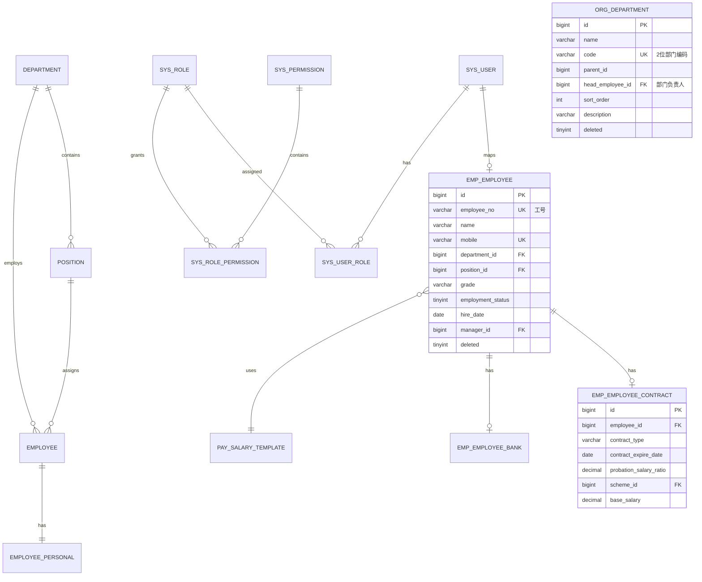

### A.4.2 关键表结构

#### A.4.2.1 组织架构

```sql
-- Flyway 落地时表名按 Part I 附录 F 映射：department → department
CREATE TABLE department (
    id              BIGINT PRIMARY KEY AUTO_INCREMENT,
    name            VARCHAR(64)  NOT NULL COMMENT '部门名称',
    code            VARCHAR(8)   NOT NULL COMMENT '部门编码，工号生成用',
    parent_id       BIGINT       NULL COMMENT '上级部门，NULL=根',
    path            VARCHAR(256) NOT NULL COMMENT '路径枚举，如 /1/3/7/，深度≤5',
    level           TINYINT      NOT NULL DEFAULT 1 COMMENT '层级 1~5',
    head_employee_id BIGINT      NULL COMMENT '部门负责人',
    sort_order      INT          NOT NULL DEFAULT 0,
    description     VARCHAR(256) NULL,
    deleted         TINYINT      NOT NULL DEFAULT 0,
    created_at      DATETIME     NOT NULL DEFAULT CURRENT_TIMESTAMP,
    updated_at      DATETIME     NOT NULL DEFAULT CURRENT_TIMESTAMP ON UPDATE CURRENT_TIMESTAMP,
    UNIQUE KEY uk_code (code),
    KEY idx_parent (parent_id),
    KEY idx_path (path(64))
) COMMENT='部门表';

-- v1.5 已废弃：不建 org_department_closure，见 Part I §A.0 / §A.3.2.1

CREATE TABLE position (
    id                      BIGINT PRIMARY KEY AUTO_INCREMENT,
    name                    VARCHAR(64)  NOT NULL,
    sequence                VARCHAR(4)   NOT NULL COMMENT 'M/P/S',
    department_id           BIGINT       NULL COMMENT 'NULL=全公司通用',
    rank_min                VARCHAR(8)   NOT NULL,
    rank_max                VARCHAR(8)   NOT NULL,
    default_probation_months INT         NOT NULL DEFAULT 3,
    is_standard             TINYINT      NOT NULL DEFAULT 1 COMMENT '是否标准职位：0→入职二审',
    description             VARCHAR(512) NULL,
    deleted                 TINYINT      NOT NULL DEFAULT 0,
    created_at              DATETIME     NOT NULL DEFAULT CURRENT_TIMESTAMP,
    updated_at              DATETIME     NOT NULL DEFAULT CURRENT_TIMESTAMP ON UPDATE CURRENT_TIMESTAMP,
    KEY idx_dept (department_id),
    KEY idx_sequence (sequence)
) COMMENT='职位表';
```

#### A.4.2.2 员工档案

```sql
CREATE TABLE employee (
    id                  BIGINT PRIMARY KEY AUTO_INCREMENT,
    employee_no         VARCHAR(16)  NOT NULL COMMENT '工号',
    user_id             BIGINT       NULL COMMENT '系统账号',
    name                VARCHAR(32)  NOT NULL,
    gender              VARCHAR(8)   NOT NULL COMMENT 'MALE/FEMALE',
    mobile              VARCHAR(16)  NOT NULL,
    email               VARCHAR(128) NOT NULL,
    department_id       BIGINT       NOT NULL,
    position_id         BIGINT       NOT NULL,
    grade               VARCHAR(8)   NULL COMMENT '职级，如 P5',
    manager_id          BIGINT       NULL,
    work_location       VARCHAR(128) NULL,
    hire_date           DATE         NOT NULL,
    employment_type     VARCHAR(16)  NOT NULL COMMENT 'fulltime/parttime/intern',
    employment_status   TINYINT      NOT NULL COMMENT '10=试用期/20=正式/30=待离职/40=已离职',
    deleted             TINYINT      NOT NULL DEFAULT 0,
    created_at          DATETIME     NOT NULL DEFAULT CURRENT_TIMESTAMP,
    updated_at          DATETIME     NOT NULL DEFAULT CURRENT_TIMESTAMP ON UPDATE CURRENT_TIMESTAMP,
    UNIQUE KEY uk_employee_no (employee_no),
    UNIQUE KEY uk_mobile (mobile),
    KEY idx_dept_status (department_id, employment_status),
    KEY idx_hire_date (hire_date),
    KEY idx_name (name)
) COMMENT='员工主表';

CREATE TABLE employee_personal (
    employee_id         BIGINT PRIMARY KEY,
    id_number_enc       VARCHAR(256) NOT NULL COMMENT '身份证密文',
    id_number_hash      VARCHAR(64)  NOT NULL COMMENT 'SHA256检索',
    birthday            DATE         NULL,
    household_address   VARCHAR(256) NULL,
    residence_address   VARCHAR(256) NULL,
    emergency_contact   VARCHAR(64)  NULL,
    emergency_phone     VARCHAR(16)  NULL
) COMMENT='员工个人信息';

CREATE TABLE employee_contract (
    id                      BIGINT PRIMARY KEY AUTO_INCREMENT,
    employee_id             BIGINT       NOT NULL,
    contract_type           VARCHAR(16)  NOT NULL COMMENT '固定/无固定/劳务',
    contract_expire_date    DATE         NULL COMMENT '固定期限必填',
    probation_salary_ratio  DECIMAL(5,4) NOT NULL COMMENT '0.80-1.00',
    scheme_id               BIGINT       NOT NULL COMMENT '关联 payroll_scheme.id',
    base_salary             DECIMAL(12,2) NOT NULL,
    created_at              DATETIME     NOT NULL DEFAULT CURRENT_TIMESTAMP,
    updated_at              DATETIME     NOT NULL DEFAULT CURRENT_TIMESTAMP ON UPDATE CURRENT_TIMESTAMP,
    UNIQUE KEY uk_employee (employee_id)
) COMMENT='合同与薪资配置';

CREATE TABLE employee_bank (
    employee_id         BIGINT PRIMARY KEY,
    bank_account_enc    VARCHAR(256) NULL,
    bank_account_tail   VARCHAR(4)   NULL COMMENT '后四位',
    bank_name           VARCHAR(64)  NULL,
    created_at          DATETIME     NOT NULL DEFAULT CURRENT_TIMESTAMP,
    updated_at          DATETIME     NOT NULL DEFAULT CURRENT_TIMESTAMP ON UPDATE CURRENT_TIMESTAMP
) COMMENT='银行信息';

CREATE TABLE employee_id_sequence_deprecated (
    id          BIGINT PRIMARY KEY AUTO_INCREMENT,
    year        CHAR(4)     NOT NULL,
    dept_code   VARCHAR(8)  NOT NULL,
    current_val INT         NOT NULL DEFAULT 0,
    created_at  DATETIME    NOT NULL DEFAULT CURRENT_TIMESTAMP,
    updated_at  DATETIME    NOT NULL DEFAULT CURRENT_TIMESTAMP ON UPDATE CURRENT_TIMESTAMP,
    UNIQUE KEY uk_year_dept (year, dept_code)
) COMMENT='工号序号';
```

#### A.4.2.3 权限

```sql
CREATE TABLE sys_user (
    id              BIGINT PRIMARY KEY AUTO_INCREMENT,
    username        VARCHAR(32)  NOT NULL COMMENT '手机号',
    password_hash   VARCHAR(128) NOT NULL,
    password_changed_at DATETIME NOT NULL DEFAULT CURRENT_TIMESTAMP COMMENT 'PRD §11.2 90天轮换',
    employee_id     BIGINT       NULL,
    status          TINYINT      NOT NULL DEFAULT 1,
    created_at      DATETIME     NOT NULL DEFAULT CURRENT_TIMESTAMP,
    updated_at      DATETIME     NOT NULL DEFAULT CURRENT_TIMESTAMP ON UPDATE CURRENT_TIMESTAMP,
    UNIQUE KEY uk_username (username)
);

CREATE TABLE sys_role (
    id          BIGINT PRIMARY KEY AUTO_INCREMENT,
    code        VARCHAR(32) NOT NULL,
    name        VARCHAR(64) NOT NULL,
    data_scope  VARCHAR(16) NOT NULL COMMENT 'ALL/DEPT_TREE/SELF/PAYROLL/NONE_PAYROLL',
    created_at  DATETIME    NOT NULL DEFAULT CURRENT_TIMESTAMP,
    updated_at  DATETIME    NOT NULL DEFAULT CURRENT_TIMESTAMP ON UPDATE CURRENT_TIMESTAMP,
    UNIQUE KEY uk_code (code)
);

CREATE TABLE sys_permission (
    id        BIGINT PRIMARY KEY AUTO_INCREMENT,
    code      VARCHAR(64) NOT NULL,
    name      VARCHAR(64) NOT NULL,
    module    VARCHAR(32) NOT NULL,
    type      VARCHAR(16) NOT NULL COMMENT 'MENU/BUTTON/API',
    created_at DATETIME   NOT NULL DEFAULT CURRENT_TIMESTAMP,
    updated_at DATETIME   NOT NULL DEFAULT CURRENT_TIMESTAMP ON UPDATE CURRENT_TIMESTAMP,
    UNIQUE KEY uk_code (code)
);

CREATE TABLE sys_user_role (
    user_id    BIGINT   NOT NULL,
    role_id    BIGINT   NOT NULL,
    created_at DATETIME NOT NULL DEFAULT CURRENT_TIMESTAMP,
    PRIMARY KEY (user_id, role_id)
);

CREATE TABLE sys_role_permission (
    role_id       BIGINT   NOT NULL,
    permission_id BIGINT   NOT NULL,
    created_at    DATETIME NOT NULL DEFAULT CURRENT_TIMESTAMP,
    PRIMARY KEY (role_id, permission_id)
);

CREATE TABLE login_log (
    id              BIGINT PRIMARY KEY AUTO_INCREMENT,
    user_id         BIGINT       NOT NULL,
    login_time      DATETIME     NOT NULL DEFAULT CURRENT_TIMESTAMP,
    login_ip        VARCHAR(45)  NOT NULL,
    user_agent      VARCHAR(512) NULL,
    device          VARCHAR(64)  NULL COMMENT '解析自 UA',
    location        VARCHAR(64)  NULL COMMENT 'IP 归属地，可选',
    success         TINYINT      NOT NULL COMMENT '1成功0失败',
    fail_reason     VARCHAR(64)  NULL,
    created_at      DATETIME     NOT NULL DEFAULT CURRENT_TIMESTAMP,
    KEY idx_user_time (user_id, login_time)
) COMMENT='登录日志，§9.5';
```

#### A.4.2.4 流程审批

```sql
CREATE TABLE approval_process_def (
    id              BIGINT PRIMARY KEY AUTO_INCREMENT,
    process_type    VARCHAR(32) NOT NULL COMMENT 'ONBOARDING/REGULARIZATION/TRANSFER/RESIGNATION',
    name            VARCHAR(64) NOT NULL,
    nodes_json      JSON        NOT NULL COMMENT '审批节点配置',
    sla_hours       INT         NOT NULL DEFAULT 48,
    status          TINYINT     NOT NULL DEFAULT 1,
    UNIQUE KEY uk_type (process_type)
) COMMENT='流程定义';

CREATE TABLE approval_instance (
    id              BIGINT PRIMARY KEY AUTO_INCREMENT,
    process_type    VARCHAR(32) NOT NULL,
    business_key    VARCHAR(64) NOT NULL COMMENT '业务表主键',
    status          VARCHAR(32) NOT NULL,
    initiator_id    BIGINT      NOT NULL,
    current_node    INT         NOT NULL DEFAULT 1,
    created_at      DATETIME    NOT NULL DEFAULT CURRENT_TIMESTAMP,
    updated_at      DATETIME    NOT NULL DEFAULT CURRENT_TIMESTAMP ON UPDATE CURRENT_TIMESTAMP,
    KEY idx_type_status (process_type, status),
    KEY idx_initiator (initiator_id),
    KEY idx_business (process_type, business_key)
);

CREATE TABLE approval_task (
    id              BIGINT PRIMARY KEY AUTO_INCREMENT,
    instance_id     BIGINT      NOT NULL,
    node_order      INT         NOT NULL,
    assignee_id     BIGINT      NOT NULL COMMENT '原审批人',
    actual_assignee_id BIGINT   NULL COMMENT '委托解析后的实际审批人',
    status          VARCHAR(16) NOT NULL COMMENT 'PENDING/APPROVED/REJECTED/FORWARDED',
    comment         VARCHAR(512) NULL,
    sla_deadline    DATETIME     NULL,
    overdue         TINYINT      NOT NULL DEFAULT 0,
    completed_at    DATETIME     NULL,
    KEY idx_assignee_status (assignee_id, status),
    KEY idx_actual_assignee (actual_assignee_id, status),
    KEY idx_instance (instance_id)
);

CREATE TABLE approval_log (
    id              BIGINT PRIMARY KEY AUTO_INCREMENT,
    instance_id     BIGINT      NOT NULL,
    task_id         BIGINT      NULL,
    operator_id     BIGINT      NOT NULL COMMENT '实际操作人',
    on_behalf_of_id BIGINT      NULL COMMENT '被代审人',
    display_text    VARCHAR(128) NULL COMMENT '孙强 代 李明 审批',
    action          VARCHAR(16) NOT NULL COMMENT 'SUBMIT/APPROVE/REJECT/WITHDRAW/FORWARD',
    comment         VARCHAR(512) NULL,
    from_status     VARCHAR(32) NULL,
    to_status       VARCHAR(32) NULL,
    created_at      DATETIME    NOT NULL DEFAULT CURRENT_TIMESTAMP,
    KEY idx_instance (instance_id)
);

CREATE TABLE approval_delegation (
    id              BIGINT PRIMARY KEY AUTO_INCREMENT,
    delegator_id    BIGINT      NOT NULL,
    delegate_user_id BIGINT     NOT NULL,
    start_date      DATE        NOT NULL,
    end_date        DATE        NOT NULL,
    reason          VARCHAR(256) NULL,
    status          VARCHAR(16) NOT NULL DEFAULT 'ACTIVE' COMMENT 'ACTIVE/CANCELLED',
    cancelled_at    DATETIME     NULL,
    created_at      DATETIME     NOT NULL DEFAULT CURRENT_TIMESTAMP,
    KEY idx_delegator (delegator_id, status),
    KEY idx_delegate (delegate_user_id, status, start_date, end_date)
) COMMENT='委托审批，同一 delegator 仅一条 ACTIVE';

-- §5.1 入职申请
CREATE TABLE onboarding_application (
    id                      BIGINT PRIMARY KEY AUTO_INCREMENT,
    instance_id             BIGINT       NULL,
    status                  VARCHAR(16)  NOT NULL COMMENT 'DRAFT/APPROVING/APPROVED/REJECTED/ONBOARDED/ABANDONED',
    name                    VARCHAR(32)  NOT NULL,
    gender                  VARCHAR(8)   NOT NULL COMMENT 'MALE/FEMALE',
    mobile                  VARCHAR(16)  NOT NULL,
    email                   VARCHAR(128) NOT NULL,
    id_number_enc           VARCHAR(256) NOT NULL,
    id_number_hash          VARCHAR(64)  NOT NULL,
    expected_onboard_date   DATE         NOT NULL,
    department_id           BIGINT       NOT NULL,
    position_id             BIGINT       NOT NULL,
    employment_type         VARCHAR(16)  NOT NULL COMMENT 'fulltime/parttime/intern',
    probation_months        INT          NOT NULL,
    probation_salary_ratio  DECIMAL(5,4) NOT NULL,
    base_salary             DECIMAL(12,2) NULL COMMENT '约定薪资',
    actual_onboard_date     DATE         NULL COMMENT '实际入职日',
    manager_id              BIGINT       NULL,
    employee_id             BIGINT       NULL COMMENT '审批通过后关联',
    created_by              BIGINT       NOT NULL,
    created_at              DATETIME     NOT NULL DEFAULT CURRENT_TIMESTAMP,
    updated_at              DATETIME     NOT NULL DEFAULT CURRENT_TIMESTAMP ON UPDATE CURRENT_TIMESTAMP,
    KEY idx_status (status),
    KEY idx_dept (department_id),
    KEY idx_mobile (mobile)
) COMMENT='入职申请';

-- §5.2 转正申请
CREATE TABLE regularization_application (
    id                      BIGINT PRIMARY KEY AUTO_INCREMENT,
    instance_id             BIGINT       NULL,
    employee_id             BIGINT       NOT NULL,
    status                  VARCHAR(16)  NOT NULL,
    probation_start_date    DATE         NOT NULL,
    probation_end_date      DATE         NOT NULL,
    performance_evaluation  TEXT         NOT NULL,
    salary_adjustment       DECIMAL(12,2) NULL,
    approval_result         VARCHAR(16)  NULL COMMENT 'PASS/EXTEND/FAIL',
    extend_months           INT          NULL,
    created_by              BIGINT       NOT NULL,
    created_at              DATETIME     NOT NULL DEFAULT CURRENT_TIMESTAMP,
    KEY idx_employee (employee_id)
) COMMENT='转正申请';

-- §5.3 调岗申请
CREATE TABLE transfer_application (
    id                      BIGINT PRIMARY KEY AUTO_INCREMENT,
    instance_id             BIGINT       NULL,
    employee_id             BIGINT       NOT NULL,
    status                  VARCHAR(16)  NOT NULL,
    from_department_id      BIGINT       NOT NULL,
    new_department_id       BIGINT       NOT NULL,
    new_position_id         BIGINT       NULL,
    new_job_level           VARCHAR(8)   NULL,
    new_manager_id          BIGINT       NULL,
    salary_adjustment       DECIMAL(12,2) NULL,
    effective_date          DATE         NOT NULL,
    reason                  VARCHAR(512) NULL,
    created_by              BIGINT       NOT NULL,
    created_at              DATETIME     NOT NULL DEFAULT CURRENT_TIMESTAMP,
    KEY idx_employee (employee_id)
) COMMENT='调岗申请';

CREATE TABLE employee_transfer_history (
    id                  BIGINT PRIMARY KEY AUTO_INCREMENT,
    employee_id         BIGINT       NOT NULL,
    transfer_app_id     BIGINT       NOT NULL,
    from_department_id  BIGINT       NOT NULL,
    to_department_id    BIGINT       NOT NULL,
    from_position_id    BIGINT       NULL,
    to_position_id      BIGINT       NULL,
    transfer_date       DATE         NOT NULL,
    reason              VARCHAR(512) NULL,
    created_at          DATETIME     NOT NULL DEFAULT CURRENT_TIMESTAMP,
    updated_at          DATETIME     NOT NULL DEFAULT CURRENT_TIMESTAMP ON UPDATE CURRENT_TIMESTAMP,
    KEY idx_employee (employee_id)
) COMMENT='调岗历史';

-- §5.4.1 员工离职申请（PRD：员工申请 → HR 再发起正式离职）
CREATE TABLE employee_resignation_request (
    id                  BIGINT PRIMARY KEY AUTO_INCREMENT,
    instance_id         BIGINT       NULL,
    employee_id         BIGINT       NOT NULL,
    status              VARCHAR(16)  NOT NULL COMMENT 'PENDING/APPROVED/REJECTED/CANCELLED',
    expected_resign_date DATE        NOT NULL,
    reason_category     VARCHAR(16)  NOT NULL COMMENT 'VOLUNTARY/INVOLUNTARY/NEGOTIATED',
    resignation_type    VARCHAR(16)  NOT NULL COMMENT 'RESIGN/DISMISS/CONTRACT_EXPIRE/OTHER',
    reason_detail       VARCHAR(512) NULL,
    created_at          DATETIME     NOT NULL DEFAULT CURRENT_TIMESTAMP,
    updated_at          DATETIME     NOT NULL DEFAULT CURRENT_TIMESTAMP ON UPDATE CURRENT_TIMESTAMP,
    KEY idx_employee (employee_id),
    KEY idx_status (status)
) COMMENT='员工离职申请';

-- §5.4 HR 正式离职
CREATE TABLE resignation_application (
    id                      BIGINT PRIMARY KEY AUTO_INCREMENT,
    instance_id             BIGINT       NULL,
    request_id              BIGINT       NOT NULL COMMENT '关联 employee_resignation_request.id',
    employee_id             BIGINT       NOT NULL,
    status                  VARCHAR(16)  NOT NULL COMMENT 'APPROVING/PENDING_RESIGN/REJECTED/RESIGNED',
    resignation_date        DATE         NOT NULL,
    reason_category         VARCHAR(16)  NOT NULL COMMENT 'VOLUNTARY/INVOLUNTARY/NEGOTIATED',
    resignation_type        VARCHAR(16)  NOT NULL COMMENT 'RESIGN/DISMISS/CONTRACT_EXPIRE/OTHER',
    reason_detail           VARCHAR(512) NULL,
    handover_employee_id    BIGINT       NOT NULL,
    created_by              BIGINT       NOT NULL,
    created_at              DATETIME     NOT NULL DEFAULT CURRENT_TIMESTAMP,
    KEY idx_employee (employee_id),
    KEY idx_request (request_id),
    KEY idx_resign_date (resignation_date, status)
) COMMENT='HR正式离职申请';
```

#### A.4.2.4.1 个人中心扩展表

```sql
-- §4.1.2 手机号变更申请
CREATE TABLE employee_mobile_change_application (
    id              BIGINT PRIMARY KEY AUTO_INCREMENT,
    instance_id     BIGINT       NULL,
    employee_id     BIGINT       NOT NULL,
    user_id         BIGINT       NOT NULL,
    old_mobile      VARCHAR(16)  NOT NULL,
    new_mobile      VARCHAR(16)  NOT NULL,
    sms_verified    TINYINT      NOT NULL DEFAULT 0 COMMENT '提交前已验证新号',
    reason          VARCHAR(256) NULL,
    status          VARCHAR(16)  NOT NULL COMMENT 'PENDING/APPROVED/REJECTED/CANCELLED',
    created_at      DATETIME     NOT NULL DEFAULT CURRENT_TIMESTAMP,
    updated_at      DATETIME     NOT NULL DEFAULT CURRENT_TIMESTAMP ON UPDATE CURRENT_TIMESTAMP,
    KEY idx_employee (employee_id),
    KEY idx_status (status)
) COMMENT='手机号变更申请';
```

#### A.4.2.5 考勤

```sql
CREATE TABLE attendance_group (
    id                          BIGINT PRIMARY KEY AUTO_INCREMENT,
    name                        VARCHAR(64)  NOT NULL COMMENT '考勤组名称',
    shift_type                  VARCHAR(16)  NOT NULL COMMENT 'FIXED/FLEXIBLE/SCHEDULE',
    work_start_time             TIME         NOT NULL COMMENT '上班时间',
    work_end_time               TIME         NOT NULL COMMENT '下班时间',
    lunch_start_time            TIME         NULL COMMENT '默认12:00',
    lunch_end_time              TIME         NULL COMMENT '默认13:00',
    flex_start_earliest         TIME         NULL COMMENT '弹性最早打卡',
    flex_start_latest           TIME         NULL COMMENT '弹性最晚打卡',
    late_threshold_minutes      INT          NOT NULL DEFAULT 15,
    early_leave_threshold_minutes INT        NOT NULL DEFAULT 15,
    ip_whitelist_json           JSON         NULL,
    gps_range_json              JSON         NULL COMMENT '{lat,lng,radiusM}',
    deleted                     TINYINT      NOT NULL DEFAULT 0,
    created_at                  DATETIME     NOT NULL DEFAULT CURRENT_TIMESTAMP,
    updated_at                  DATETIME     NOT NULL DEFAULT CURRENT_TIMESTAMP ON UPDATE CURRENT_TIMESTAMP
) COMMENT='考勤组';

CREATE TABLE attendance_group_scope (
    id          BIGINT PRIMARY KEY AUTO_INCREMENT,
    group_id    BIGINT      NOT NULL,
    scope_type  VARCHAR(16) NOT NULL COMMENT 'DEPARTMENT/POSITION/EMPLOYEE',
    scope_id    BIGINT      NOT NULL,
    KEY idx_group (group_id),
    KEY idx_scope (scope_type, scope_id)
) COMMENT='考勤组适用人员范围';

CREATE TABLE attendance_group_member (
    group_id    BIGINT NOT NULL,
    employee_id BIGINT NOT NULL,
    PRIMARY KEY (employee_id),
    KEY idx_group (group_id)
) COMMENT='员工-考勤组映射（物化）';

CREATE TABLE workday_config (
    id          BIGINT PRIMARY KEY AUTO_INCREMENT,
    day_of_week TINYINT NOT NULL COMMENT '1=周一..7=周日',
    is_workday  TINYINT NOT NULL DEFAULT 1,
    UNIQUE KEY uk_dow (day_of_week)
) COMMENT='工作日配置';

CREATE TABLE holiday_calendar (
    id           BIGINT PRIMARY KEY AUTO_INCREMENT,
    holiday_date DATE        NOT NULL,
    name         VARCHAR(64) NOT NULL,
    UNIQUE KEY uk_date (holiday_date)
) COMMENT='法定节假日';

CREATE TABLE attendance_record (
    id              BIGINT PRIMARY KEY AUTO_INCREMENT,
    employee_id     BIGINT      NOT NULL,
    punch_date      DATE        NOT NULL COMMENT '考勤日',
    punch_time      DATETIME    NOT NULL,
    punch_type      VARCHAR(8)  NOT NULL COMMENT 'IN/OUT',
    punch_status    VARCHAR(16) NOT NULL COMMENT 'NORMAL/LATE/EARLY_LEAVE/ABSENT_HALF',
    source          VARCHAR(16) NOT NULL COMMENT 'WEB/APP/MAKEUP',
    client_ip       VARCHAR(45)  NULL,
    gps_json        JSON         NULL,
    created_at      DATETIME     NOT NULL DEFAULT CURRENT_TIMESTAMP,
    KEY idx_emp_date (employee_id, punch_date),
    KEY idx_emp_time (employee_id, punch_time)
) COMMENT='打卡流水';

CREATE TABLE attendance_daily_summary (
    id              BIGINT PRIMARY KEY AUTO_INCREMENT,
    employee_id     BIGINT      NOT NULL,
    summary_date    DATE        NOT NULL,
    day_status      VARCHAR(16) NOT NULL COMMENT 'NORMAL/LATE/EARLY_LEAVE/ABSENT_HALF/ABSENT/MISSING_IN/MISSING_OUT/LEAVE',
    clock_in_time   DATETIME     NULL,
    clock_out_time  DATETIME     NULL,
    leave_days      DECIMAL(3,1) NOT NULL DEFAULT 0 COMMENT '当日请假天数',
    overtime_hours  DECIMAL(5,2) NOT NULL DEFAULT 0,
    UNIQUE KEY uk_emp_date (employee_id, summary_date),
    KEY idx_date_status (summary_date, day_status)
) COMMENT='日考勤汇总';

CREATE TABLE attendance_supplement (
    id              BIGINT PRIMARY KEY AUTO_INCREMENT,
    employee_id     BIGINT      NOT NULL,
    makeup_date     DATE        NOT NULL,
    punch_type      VARCHAR(8)  NOT NULL COMMENT 'IN/OUT',
    makeup_time     DATETIME    NOT NULL,
    reason          VARCHAR(256) NOT NULL,
    status          VARCHAR(16) NOT NULL COMMENT 'PENDING/APPROVED/REJECTED',
    instance_id     BIGINT       NULL,
    created_at      DATETIME     NOT NULL DEFAULT CURRENT_TIMESTAMP,
    KEY idx_emp_month (employee_id, created_at)
) COMMENT='补卡申请';

CREATE TABLE leave_balance (
    id              BIGINT PRIMARY KEY AUTO_INCREMENT,
    employee_id     BIGINT        NOT NULL,
    leave_type      VARCHAR(16)   NOT NULL COMMENT 'ANNUAL/COMP_OFF',
    balance         DECIMAL(6,1)  NOT NULL DEFAULT 0,
    year            INT           NULL COMMENT '年假年度',
    expire_date     DATE          NULL COMMENT '调休过期日',
    updated_at      DATETIME      NOT NULL DEFAULT CURRENT_TIMESTAMP ON UPDATE CURRENT_TIMESTAMP,
    UNIQUE KEY uk_emp_type_year (employee_id, leave_type, year)
) COMMENT='假期余额';

CREATE TABLE leave_application (
    id                  BIGINT PRIMARY KEY AUTO_INCREMENT,
    employee_id         BIGINT        NOT NULL,
    leave_type          VARCHAR(16)   NOT NULL,
    start_time          DATETIME      NOT NULL,
    end_time            DATETIME      NOT NULL,
    leave_days          DECIMAL(4,1)  NOT NULL COMMENT '支持0.5天',
    reason              VARCHAR(512)  NOT NULL,
    handover_employee_id BIGINT       NULL,
    attachment_url      VARCHAR(512)  NULL,
    status              VARCHAR(16)   NOT NULL COMMENT 'PENDING/APPROVED/REJECTED/CANCELLED',
    instance_id         BIGINT        NULL,
    created_at          DATETIME      NOT NULL DEFAULT CURRENT_TIMESTAMP,
    KEY idx_emp_status (employee_id, status),
    KEY idx_date_range (start_time, end_time)
) COMMENT='请假申请';

CREATE TABLE overtime_application (
    id              BIGINT PRIMARY KEY AUTO_INCREMENT,
    employee_id     BIGINT        NOT NULL,
    overtime_date   DATE          NOT NULL,
    start_time      DATETIME      NOT NULL COMMENT '加班开始时间',
    end_time        DATETIME      NOT NULL COMMENT '加班结束时间',
    hours           DECIMAL(5,2)  NOT NULL COMMENT '系统计算时长',
    reason          VARCHAR(512)  NOT NULL COMMENT '加班原因',
    status          VARCHAR(16)   NOT NULL COMMENT 'PENDING/APPROVED/REJECTED',
    comp_off_hours  DECIMAL(5,2)  NULL COMMENT '折算调休小时',
    created_at      DATETIME      NOT NULL DEFAULT CURRENT_TIMESTAMP,
    KEY idx_emp_date (employee_id, overtime_date)
) COMMENT='加班申请';

CREATE TABLE overtime_ledger (
    id                  BIGINT PRIMARY KEY AUTO_INCREMENT,
    employee_id         BIGINT        NOT NULL,
    application_id      BIGINT        NULL COMMENT '关联 overtime_application.id',
    period              CHAR(7)       NOT NULL COMMENT '归属账期 2026-07',
    total_hours         DECIMAL(5,2)  NOT NULL COMMENT '审批总加班时长',
    rate_type           TINYINT       NOT NULL COMMENT '倍率: 15=1.5倍/20=2.0倍/30=3.0倍',
    ledger_date         DATE          NOT NULL COMMENT '加班日期',
    created_at          DATETIME      NOT NULL DEFAULT CURRENT_TIMESTAMP,
    KEY idx_emp_period (employee_id, period),
    KEY idx_application (application_id)
) COMMENT='加班批准台账（供算薪）';

CREATE TABLE attendance_monthly_summary (
    id                  BIGINT PRIMARY KEY AUTO_INCREMENT,
    employee_id         BIGINT        NOT NULL,
    period              CHAR(7)       NOT NULL COMMENT '2026-07',
    should_attend_days  INT           NOT NULL,
    actual_attend_days  DECIMAL(5,1)  NOT NULL,
    late_count          INT           NOT NULL DEFAULT 0,
    early_leave_count   INT           NOT NULL DEFAULT 0,
    absent_days         DECIMAL(5,1)  NOT NULL DEFAULT 0,
    leave_days          DECIMAL(5,1)  NOT NULL DEFAULT 0,
    overtime_hours      DECIMAL(6,2)  NOT NULL DEFAULT 0,
    annual_balance      DECIMAL(5,1)  NULL,
    detail_json         JSON          NULL,
    created_at          DATETIME      NOT NULL DEFAULT CURRENT_TIMESTAMP,
    UNIQUE KEY uk_emp_period (employee_id, period)
) COMMENT='月考勤汇总';
```

#### A.4.2.6 薪资

```sql
CREATE TABLE payroll_scheme (
    id              BIGINT PRIMARY KEY AUTO_INCREMENT,
    name            VARCHAR(64)  NOT NULL COMMENT '账套名称',
    description     VARCHAR(256) NULL,
    effective_date  DATE         NOT NULL,
    status          VARCHAR(16)  NOT NULL DEFAULT 'enabled' COMMENT 'enabled/disabled',
    deleted         TINYINT      NOT NULL DEFAULT 0,
    created_at      DATETIME     NOT NULL DEFAULT CURRENT_TIMESTAMP,
    updated_at      DATETIME     NOT NULL DEFAULT CURRENT_TIMESTAMP ON UPDATE CURRENT_TIMESTAMP
) COMMENT='薪资账套';

CREATE TABLE payroll_scheme_scope (
    id          BIGINT PRIMARY KEY AUTO_INCREMENT,
    scheme_id   BIGINT      NOT NULL COMMENT '关联 payroll_scheme.id',
    scope_type  VARCHAR(16) NOT NULL COMMENT 'DEPARTMENT/POSITION/JOB_LEVEL',
    scope_id    VARCHAR(32) NOT NULL,
    KEY idx_scheme (scheme_id)
) COMMENT='账套适用范围';

CREATE TABLE payroll_scheme_item (
    id              BIGINT PRIMARY KEY AUTO_INCREMENT,
    scheme_id       BIGINT        NOT NULL COMMENT '关联 payroll_scheme.id',
    item_code       VARCHAR(32)   NOT NULL,
    item_name       VARCHAR(64)   NOT NULL,
    item_type       VARCHAR(20)   NOT NULL COMMENT 'FIXED/VARIABLE/ATTENDANCE_DEDUCT/SS_DEDUCT/HF_DEDUCT/TAX',
    calc_rule       VARCHAR(512)  NULL COMMENT '公式或规则描述',
    base_field      VARCHAR(32)   NULL COMMENT 'ssBase/hfBase/performanceBase',
    ratio           DECIMAL(8,4)  NULL COMMENT '社保公积金比例',
    sort_order      INT           NOT NULL DEFAULT 0,
    KEY idx_scheme (scheme_id)
) COMMENT='账套工资项目';

CREATE TABLE employee_salary_profile (
    id                  BIGINT PRIMARY KEY AUTO_INCREMENT,
    employee_id         BIGINT        NOT NULL,
    scheme_id           BIGINT        NOT NULL COMMENT '关联 payroll_scheme.id',
    base_salary         DECIMAL(12,2) NOT NULL,
    allowance_base_json JSON          NULL COMMENT '各项津贴基数',
    ss_base             DECIMAL(12,2) NOT NULL COMMENT '社保基数',
    hf_base             DECIMAL(12,2) NOT NULL COMMENT '公积金基数',
    performance_base    DECIMAL(12,2) NULL,
    probation_ratio     DECIMAL(5,4)  NOT NULL DEFAULT 1.0000,
    effective_date      DATE          NOT NULL,
    UNIQUE KEY uk_employee (employee_id)
) COMMENT='员工薪资档案';

CREATE TABLE employee_salary_history (
    id              BIGINT PRIMARY KEY AUTO_INCREMENT,
    employee_id     BIGINT        NOT NULL,
    field_name      VARCHAR(32)   NOT NULL,
    old_value       DECIMAL(12,2) NOT NULL,
    new_value       DECIMAL(12,2) NOT NULL,
    effective_date  DATE          NOT NULL,
    reason          VARCHAR(256)  NULL,
    operator_id     BIGINT        NOT NULL,
    created_at      DATETIME      NOT NULL DEFAULT CURRENT_TIMESTAMP,
    KEY idx_employee (employee_id)
) COMMENT='调薪历史';

CREATE TABLE payroll_batch (
    id                  BIGINT PRIMARY KEY AUTO_INCREMENT,
    period              CHAR(7)       NOT NULL COMMENT '2024-07',
    status              VARCHAR(20)   NOT NULL COMMENT 'DRAFT/CALCULATING/PENDING_CONFIRM/APPROVING/APPROVED/DISTRIBUTED/REJECTED',
    total_count         INT           NOT NULL DEFAULT 0,
    success_count       INT           NOT NULL DEFAULT 0,
    gross_total         DECIMAL(14,2) NULL COMMENT '应发合计',
    net_total           DECIMAL(14,2) NULL COMMENT '实发合计',
    anomaly_count       INT           NOT NULL DEFAULT 0,
    instance_id         BIGINT        NULL COMMENT '审批实例',
    attendance_locked   TINYINT       NOT NULL DEFAULT 0,
    created_by          BIGINT        NOT NULL,
    created_at          DATETIME      NOT NULL DEFAULT CURRENT_TIMESTAMP,
    updated_at          DATETIME      NOT NULL DEFAULT CURRENT_TIMESTAMP ON UPDATE CURRENT_TIMESTAMP,
    UNIQUE KEY uk_period (period)
) COMMENT='月度核算批次；同一自然月仅允许一个非 rejected 批次';

CREATE TABLE payroll_detail (
    id              BIGINT PRIMARY KEY AUTO_INCREMENT,
    batch_id        BIGINT        NOT NULL,
    employee_id     BIGINT        NOT NULL,
    calc_status     VARCHAR(16)   NOT NULL DEFAULT 'SUCCESS' COMMENT 'SUCCESS/FAILED',
    gross_salary    DECIMAL(12,2) NULL,
    net_salary      DECIMAL(12,2) NULL,
    detail_json     JSON          NOT NULL COMMENT '各薪资项明细',
    anomaly_flags   JSON          NULL COMMENT '异常标记数组',
    prev_net_salary DECIMAL(12,2) NULL COMMENT '上月实发，用于变动检测',
    manual_adjusted TINYINT       NOT NULL DEFAULT 0,
    KEY idx_batch (batch_id),
    KEY idx_employee (employee_id),
    UNIQUE KEY uk_batch_emp (batch_id, employee_id)
) COMMENT='批次核算明细';

CREATE TABLE pay_tax_bracket (
    id              BIGINT PRIMARY KEY AUTO_INCREMENT,
    tax_year        INT           NOT NULL COMMENT '纳税年度',
    min_taxable     DECIMAL(12,2) NOT NULL COMMENT '起征金额',
    max_taxable     DECIMAL(12,2) NULL COMMENT '上限，NULL=无限',
    rate            DECIMAL(5,4)  NOT NULL COMMENT '税率，如 0.03',
    quick_deduction DECIMAL(12,2) NOT NULL COMMENT '速算扣除数',
    UNIQUE KEY uk_year_range (tax_year, min_taxable)
) COMMENT='个税税率表（累计预扣法）';

CREATE TABLE payroll_adjustment (
    id              BIGINT PRIMARY KEY AUTO_INCREMENT,
    detail_id       BIGINT        NOT NULL,
    item_code       VARCHAR(32)   NOT NULL,
    adjust_amount   DECIMAL(12,2) NOT NULL,
    reason          VARCHAR(256)  NOT NULL,
    operator_id     BIGINT        NOT NULL,
    created_at      DATETIME      NOT NULL DEFAULT CURRENT_TIMESTAMP,
    KEY idx_detail (detail_id)
) COMMENT='核算手动调整项';

CREATE TABLE pay_tax_ytd_record (
    id              BIGINT PRIMARY KEY AUTO_INCREMENT,
    employee_id     BIGINT        NOT NULL,
    period          CHAR(7)       NOT NULL,
    taxable_income  DECIMAL(12,2) NOT NULL,
    tax_deducted    DECIMAL(12,2) NOT NULL,
    cumulative_tax  DECIMAL(12,2) NOT NULL,
    UNIQUE KEY uk_emp_period (employee_id, period)
) COMMENT='个税累计预扣记录';

CREATE TABLE payslip_view_log (
    id              BIGINT PRIMARY KEY AUTO_INCREMENT,
    employee_id     BIGINT      NOT NULL,
    batch_id        BIGINT      NOT NULL,
    viewed_at       DATETIME    NOT NULL DEFAULT CURRENT_TIMESTAMP,
    verify_method   VARCHAR(16) NULL COMMENT 'PASSWORD/SMS',
    KEY idx_emp (employee_id)
) COMMENT='工资条查看日志';
```

### A.4.3 索引设计

| 表 | 索引 | 用途 |
|---|------|------|
| employee | `idx_dept_status` | 部门人数统计 |
| employee | `idx_name` + 前缀 | 姓名模糊搜索（后期改 ES） |
| department | `idx_path` | 子树查询（v1.5，替代闭包表） |
| attendance_record | `idx_emp_date` | 日打卡查询 |
| attendance_daily_summary | `uk_emp_date` | 月报聚合 |
| leave_application | `idx_date_range` | 请假冲突检测 |
| attendance_monthly_summary | `uk_emp_period` | 个人月报 |
| approval_task | `idx_assignee_status` | 待办列表 |
| approval_task | `idx_actual_assignee` | 委托后代办查询 |
| approval_delegation | `idx_delegator` | 有效委托校验 |
| onboarding_application | `idx_status` | 入职列表 Tab 筛选 |
| resignation_application | `idx_resign_date` | 离职生效定时任务 |
| employee_transfer_history | `idx_employee` | 员工调岗历史 |
| payroll_batch | `period` | 月度批次查询 |
| payroll_detail | `uk_batch_emp` | 批次内员工明细 |
| employee_salary_profile | `uk_employee` | 档案 lookup |
| login_log | `idx_user_time` | 个人中心登录日志 |

### A.4.4 分库分表策略

**首期不分库分表**。触发条件：

- 员工 > 10 万：员工表按 `id` 范围分表
- 打卡流水 > 5000 万：`attendance_record` 按月分表

### A.4.5 数据字典与枚举

```sql
CREATE TABLE sys_dict (
    id          BIGINT PRIMARY KEY AUTO_INCREMENT,
    dict_type   VARCHAR(32) NOT NULL,
    dict_code   VARCHAR(32) NOT NULL,
    dict_label  VARCHAR(64) NOT NULL,
    sort_order  INT         NOT NULL DEFAULT 0,
    created_at  DATETIME    NOT NULL DEFAULT CURRENT_TIMESTAMP,
    updated_at  DATETIME    NOT NULL DEFAULT CURRENT_TIMESTAMP ON UPDATE CURRENT_TIMESTAMP,
    UNIQUE KEY uk_type_code (dict_type, dict_code)
) COMMENT='数据字典';
```

| dict_type | 示例 dict_code |
|-----------|---------------|
| employment_status | PROBATION, REGULAR, PENDING_RESIGN, RESIGNED |
| contract_type | FIXED, UNFIXED, LABOR |
| position_sequence | M, P, S |
| employment_type（DB） | FULL_TIME / PART_TIME / INTERN |
| onboarding_status（DB） | DRAFT, APPROVING, APPROVED, REJECTED, ONBOARDED, ABANDONED |
| onboarding_status（API） | draft, pending, approved_pending, rejected, onboarded, abandoned（映射见附录 I） |
| resignation_type | RESIGN, DISMISS, CONTRACT_EXPIRE, OTHER |
| resignation_reason_category | VOLUNTARY, INVOLUNTARY, NEGOTIATED |
| regularization_result | PASS, EXTEND, FAIL |
| shift_type | FIXED, FLEXIBLE, SCHEDULE |
| punch_status | NORMAL, LATE, EARLY_LEAVE, ABSENT_HALF |
| day_status | NORMAL, LATE, EARLY_LEAVE, ABSENT_HALF, ABSENT, MISSING_IN, MISSING_OUT, LEAVE |
| leave_type | ANNUAL, SICK, PERSONAL, MARRIAGE, MATERNITY, BEREAVEMENT, COMP_OFF |
| salary_item_type | FIXED, VARIABLE, ATTENDANCE_DEDUCT, SS_DEDUCT, HF_DEDUCT, TAX |
| payroll_batch_status（API） | draft, calculating, pending_confirm, approving, approved, distributed, rejected |
| payroll_batch_status（DB） | DRAFT, CALCULATING, PENDING_CONFIRM, APPROVING, APPROVED, DISTRIBUTED, REJECTED |
| payroll_anomaly | LEAVE_HIGH, OVERTIME_HIGH, SALARY_CHANGE_HIGH, NO_SALARY_PROFILE |
| process_type | ONBOARDING, REGULARIZATION, TRANSFER, RESIGNATION, RESIGNATION_REQUEST, MOBILE_CHANGE, LEAVE, MAKEUP, OVERTIME, PAYROLL_BATCH |

---

## A.5 接口设计

### A.5.1 RESTful API 规范

- 基础路径：`/api/v1`
- 版本：URL 前缀或 `Accept` 头
- 分页：`?page=1&pageSize=20`（最大 100），响应 `{ list, total, page, pageSize }`
- 时间：ISO-8601 / `yyyy-MM-dd HH:mm:ss`（统一 GMT+8 展示）

### A.5.2 关键接口定义

> **路径权威来源**：[HRMS-API-Contract.md §5](HRMS-API-Contract.md#5-api-总表)；Part I §2.2 与附录 H 为同步副本。本节与契约不一致时**以契约为准**。

#### 认证

| 方法 | 路径 | 说明 | PRD |
|-----|------|------|:---:|
| POST | `/auth/login` | 登录 `{ username, password }` → `{ accessToken, refreshToken, expiresIn, mustChangePassword }` | §2 |
| POST | `/auth/logout` | 登出（Token 黑名单） | — |
| POST | `/auth/refresh` | 刷新 Token | — |
| GET | `/auth/profile` | 用户+角色+权限+dataScope+passwordExpiredAt | §2 |
| PUT | `/auth/password` | 改密（登录页/首次改密） | §9.5 |
| PUT/DELETE | `/auth/mobile` | 绑定/解绑手机（同服务别名） | §9.5 |
| POST | `/auth/verify` | 工资条二次验证（同服务别名） | §7.4 |

#### 部门

| 方法 | 路径 | 说明 | PRD |
|-----|------|------|:---:|
| GET | `/departments/tree` | 部门树（含人数、负责人） | §3.1 |
| GET | `/departments/{id}/headcount` | 部门人数（含下属） | §3.1.4 |
| GET | `/departments/{id}/can-delete` | 删除前校验 | §3.1.3 |
| POST | `/departments/{id}/merge` | 部门合并 `{ targetDepartmentId }` | §3.1.3 |
| POST | `/departments` | 新增部门 | §3.1 |
| PUT | `/departments/{id}` | 编辑部门 | §3.1 |
| DELETE | `/departments/{id}` | 删除部门（须无员工） | §3.1 |

#### 职位

| 方法 | 路径 | 说明 | PRD |
|-----|------|------|:---:|
| GET | `/positions` `/positions/{id}` | 分页+筛选/详情 | §3.2 |
| POST | `/positions` | 新增 | §3.2 |
| PUT | `/positions/{id}` | 编辑 | §3.2 |
| DELETE | `/positions/{id}` | 软删除 | §3.2 |

#### 员工

| 方法 | 路径 | 说明 | PRD |
|-----|------|------|:---:|
| GET | `/employees` | 高级搜索（keyword/departmentIds/positionIds/employmentStatus/gradeLevels/hireDateFrom/hireDateTo） | §4.2 |
| GET | `/employees/{id}` | 详情+fieldPermissions | §4.1 |
| PUT | `/employees/{id}` | 更新白名单字段 | §4.1 |
| GET/PUT | `/employees/{id}/salary` | 薪资档案 | §7.2 |
| GET | `/employees/{id}/sensitive/{field}` | 敏感字段查看（记审计日志） | §2.3 |
| GET | `/employees/mobile-change-applications` | HR 手机号变更待办列表 | §4.1.2 |

#### 入职流程（§5.1）

| 方法 | 路径 | 说明 | PRD |
|-----|------|------|:---:|
| GET | `/onboarding/applications` | 入职申请列表 | §5.1 |
| GET | `/onboarding/applications/stats` | 统计卡片 | §5.1 |
| POST | `/onboarding/applications` | 新建草稿 | §5.1 |
| PUT | `/onboarding/applications/{id}` | 编辑草稿 | §5.1 |
| DELETE | `/onboarding/applications/{id}` | 删除草稿 | §5.1 |
| POST | `/onboarding/applications/{id}/submit` | 提交审批 | §5.1 |
| POST | `/onboarding/applications/{id}/withdraw` | HR 撤回（第一级） | §5.1 |
| POST | `/onboarding/applications/{id}/confirm` | 确认入职 | §5.1 |
| POST | `/onboarding/applications/{id}/abandon` | 标记放弃 | §5.1 |

#### 转正流程（§5.2）

| 方法 | 路径 | 说明 | PRD |
|-----|------|------|:---:|
| GET | `/regularization/applications/pending` | 待转正列表（结束-7天） | §5.2 |
| GET/POST | `/regularization/applications` | 转正申请列表/发起转正 | §5.2 |

#### 调岗流程（§5.3）

| 方法 | 路径 | 说明 | PRD |
|-----|------|------|:---:|
| GET | `/transfers` | 调岗记录列表 | §5.3 |
| POST | `/transfers` | HR 发起调岗。**约束：所属部门必须变更**，否则 30004 | §5.3 |
| GET | `/transfers/{id}` | 调岗详情 | §5.3 |
| GET | `/employees/{id}/transfer-history` | 员工调岗历史 | §5.3 |

#### 离职流程（§5.4）

| 方法 | 路径 | 说明 | PRD |
|-----|------|------|:---:|
| POST/GET | `/profile/resignation-requests` | 员工发起/查看离职申请（SELF） | §5.4.1 |
| POST | `/profile/resignation-requests/{id}/cancel` | 撤销离职申请 | §5.4.1 |
| GET/POST | `/resignation-requests` | HR 查看/管理员工离职申请列表 | §5.4 |
| GET/POST | `/resignations` | HR 发起离职/正式离职记录列表 | §5.4 |
| GET | `/resignations/stats` | 离职统计（含离职率） | §5.4 |
| GET | `/resignations/{id}` | 离职详情 | §5.4 |

#### 审批中心（§8）

| 方法 | 路径 | 说明 | PRD |
|-----|------|------|:---:|
| GET | `/approvals/tasks/stats` | 待办统计（含 `overdueCount` 超时数量） | §8.2 |
| GET | `/approvals/tasks` | 待办列表（响应含 `dueAt` 截止时间） | §8.2 |
| GET | `/approvals/tasks/{id}` | 审批详情（响应含 `dueAt` 截止时间） | §8.2 |
| POST | `/approvals/tasks/{id}/action` | 审批操作 `{ action: APPROVE/REJECT/FORWARD, comment, targetUserId? }` | §8.2 |
| POST | `/approvals/tasks/{id}/remind` | 催办：向当前审批人发送催办通知 | §5.1.4 |
| POST | `/approvals/instances/{id}/withdraw` | 撤回实例（仅发起人且第一级） | §8 |
| GET | `/approvals/instances` | 我发起的审批列表（按 initiator_id 过滤） | §8 |
| GET/POST/PUT/DELETE | `/approvals/delegations` `/approvals/delegations/{id}` | 委托 CRUD（同时仅 1 条有效） | §8.3 |

#### 考勤规则（§6.1）

| 方法 | 路径 | 说明 | PRD |
|-----|------|------|:---:|
| GET/POST/PUT/DELETE | `/attendance/groups` `/attendance/groups/{id}` | 考勤组 CRUD | §6.1 |
| GET/PUT | `/attendance/workdays` | 工作日设置 | §6.1.2 |
| GET/POST/PUT/DELETE | `/attendance/holidays` | 节假日管理 | §6.1.2 |

#### 打卡（§6.2）

| 方法 | 路径 | 说明 | PRD |
|-----|------|------|:---:|
| POST | `/attendance/punch` | 打卡 `{ type: in/out }` | §6.2 |
| GET | `/attendance/punch/today` | 今日打卡状态 | §6.2 |
| GET | `/attendance/punch/records` | 打卡记录（分页） | §6.2 |
| POST | `/attendance/punch-fix` | 补卡申请（≤2次/月） | §6.2.3 |
| GET | `/attendance/punch-fix/quota` | 补卡剩余次数 | §6.2.3 |

#### 请假（§6.3）

| 方法 | 路径 | 说明 | PRD |
|-----|------|------|:---:|
| GET | `/leaves/balances` | 假期余额 | §6.3.2 |
| GET/POST | `/leaves/applications` | 请假申请/记录 | §6.3 |
| GET | `/leaves/calc-days` | 预览请假天数 | §6.3.3 |
| PUT | `/leaves/applications/{id}/cancel` | 撤销请假（管理端） | §6.3 |

#### 加班（AD-02）

| 方法 | 路径 | 说明 | PRD |
|-----|------|------|:---:|
| GET/POST | `/overtime/applications` | 加班申请/记录 | AD-02 |

#### 考勤统计（§6.4）

| 方法 | 路径 | 说明 | PRD |
|-----|------|------|:---:|
| GET/PUT | `/attendance/monthly-summary` | 月汇总/锁定 | §6.4、AD-01 |
| GET | `/attendance/statistics/personal` | 个人统计/日历（8项指标） | §6.4 |
| GET | `/attendance/statistics/department` | 部门统计 | §6.4 |

#### 薪资账套（§7.1）

| 方法 | 路径 | 说明 | PRD |
|-----|------|------|:---:|
| GET/POST/PUT/DELETE | `/payroll/schemes` `/payroll/schemes/{id}` | 账套 CRUD（含工资项目） | §7.1 |

#### 月度核算（§7.3）

| 方法 | 路径 | 说明 | PRD |
|-----|------|------|:---:|
| POST/GET | `/payroll/batches` | 核算批次创建/列表 | §7.3 |
| GET | `/payroll/batches/{id}` | 批次详情/状态轮询 | §7.3 |
| POST | `/payroll/batches/{id}/calculate` | 触发异步计算 | §7.3 |
| GET | `/payroll/batches/{id}/details` | 核算明细（含异常检测标记） | §7.3 |
| GET | `/payroll/batches/{id}/chart-data` | 图表数据 | §7.3.4 |
| PUT | `/payroll/batches/{id}/details/{detailId}` | 手工调整 | §7.3 |
| POST | `/payroll/batches/{id}/submit` | 提交财务审批 | §7.3 |
| POST | `/payroll/batches/{id}/distribute` | 发放确认 | §7.3 |
| GET | `/payroll/cost-report` | 成本报表 | §7 |

#### 工资条（§7.4）

| 方法 | 路径 | 说明 | PRD |
|-----|------|------|:---:|
| GET | `/payroll/payslips` | 工资条列表（HR/财务） | §7.4 |
| GET | `/payroll/payslips/{month}` | 工资条详情（HR/财务） | §7.4 |
| POST | `/profile/payslips/verify` | 二次验证（规范路径，见附录 K.5） |
| POST | `/auth/verify` | 二次验证（同服务别名） |

#### 数据迁移（AD-04）

| 方法 | 路径 | 说明 | PRD |
|-----|------|------|:---:|
| GET | `/imports/templates/{type}` | Excel 模板下载 | AD-04 |
| POST | `/imports/batches` | 上传校验 | AD-04 |
| POST | `/imports/batches/{id}/commit` | 确认入库 | AD-04 |

#### 系统与工作台

| 方法 | 路径 | 说明 | PRD |
|-----|------|------|:---:|
| GET | `/workbench/summary` | 工作台汇总 | §1.4 |
| GET/POST/PUT | `/system/users` `/system/users/{id}` | 用户管理 | §2 |
| GET/PUT | `/system/roles` `/system/roles/{id}/permissions` | 角色权限管理 | §2 |
| GET | `/system/operation-logs` | 操作审计 | §11.2 |
| GET | `/system/login-logs` | 登录日志（管理端全量） | §11.2 |
| POST | `/system/backup` | 数据备份（SYS_ADMIN） | §2 |

#### 个人中心（§9）

| 方法 | 路径 | 说明 | PRD |
|-----|------|------|:---:|
| GET/PUT | `/profile/me` | 我的档案（脱敏/编辑白名单） | §9.1 |
| GET | `/profile/attendance/calendar` | 考勤日历 | §9.2 |
| POST | `/profile/attendance/punch` | 打卡（代理 `/attendance/punch`） | §9.2 |
| POST | `/profile/attendance/punch-fix` | 补卡（代理 `/attendance/punch-fix`） | §9.2 |
| GET | `/profile/leave/balances` | 假期余额 | §9.3 |
| GET/POST | `/profile/leave/applications` | 请假申请/记录 | §9.3 |
| POST | `/profile/leave/applications/{id}/cancel` | 撤销请假（与契约 §7.3 管理端 PUT 区分） | §6.3 |
| GET | `/profile/payslips` | 工资条列表摘要 | §9.4 |
| GET | `/profile/payslips/trend` | 近 6 月实发趋势 | §9.4 |
| GET | `/profile/payslips/{period}` | 工资条详情（须先验证） | §7.4 |
| GET | `/profile/payslips/{period}/pdf` | 工资条 PDF 下载（须先验证） | §7.4 |
| POST | `/profile/payslips/verify` | 二次验证（规范路径） | §7.4 |
| PUT | `/profile/security/password` | 修改密码 | §9.5 |
| POST | `/profile/security/mobile/bind` | 首次绑定手机 | §9.5 |
| DELETE | `/profile/security/mobile` | 解绑手机 | §9.5 |
| GET | `/profile/security/login-logs` | 本人登录日志 | §9.5 |
| POST/GET | `/profile/mobile-change-applications` | 手机号变更申请/记录 | §4.1.2 |
| POST | `/profile/mobile-change-applications/{id}/cancel` | 撤销变更申请 | §4.1.2 |
| GET/POST | `/profile/overtime/applications` | 加班申请/列表（门户规范路径，强制 SELF） | AD-02 |
| POST/GET | `/profile/resignation-requests` | 员工离职申请/记录 | §5.4.1 |
| POST | `/profile/resignation-requests/{id}/cancel` | 撤销离职申请 | §5.4.1 |

### A.5.3 接口安全（JWT）

```
Authorization: Bearer <access_token>
X-Trace-Id: <uuid>  // 链路追踪
```

Gateway 层：

- 校验签名、过期
- 黑名单 Token（登出）
- 限流：登录 10/min/IP，API 1000/min/user

### A.5.4 错误码规范

> **权威列表见 [HRMS-API-Contract.md §6](HRMS-API-Contract.md#6-业务错误码) 及 Part I 附录 K**。下表为 Part II 历史摘要，新开发以契约 40xxx/50xxx/60xxx 为准。

| 范围 | 含义 |
|-----|------|
| 0 | 成功 |
| 10001 | 参数校验失败 |
| 20001~20003 | 认证/权限 |
| 30001~30004 | 组织/员工 |
| 40001~40004 | 考勤/请假 |
| 50001~50005 | 薪资 |
| 60001~60004 | 审批/个人中心 |
| 90001 | 系统内部错误 |

示例：

```json
{ "code": 30001, "message": "部门层级不能超过5层", "data": null }
{ "code": 30003, "message": "当前状态不允许撤回", "data": null }
{ "code": 30004, "message": "调岗部门未变更", "data": null }
{ "code": 40001, "message": "考勤月已锁定", "data": null }
{ "code": 40002, "message": "本月补卡次数已用完", "data": null }
```

---

## A.6 非功能需求实现方案

**对应 PRD**：§11

### A.6.0 PRD 指标对照

| PRD §11.1 指标 | 目标 | 本文档落点 |
|---------------|------|-----------|
| 员工列表查询（1000 人） | < 1s | §6.1 索引 + 分页；压测 §8.3 |
| 薪资核算（500 人） | < 30s | §3.6.5 并行批处理 |
| 并发用户 | 200 | §7.3 容量规划 |

### A.6.1 性能优化

| 场景 | 方案 | 目标（PRD §11.1） |
|-----|------|-------------------|
| 员工列表（1000 人） | `idx_dept_status` + 分页，禁止全表扫 | **< 1s** |
| 部门树加载 | `path` 索引 + Redis 缓存 5min（v1.5） | < 200ms |
| 网页打卡 | Redis 幂等 + 同步判定 | < 300ms |
| 日汇总批处理 | 分批 500 人/批 | 全量 < 5min |
| 月报查询 | `attendance_monthly_summary` 预聚合 | < 500ms |
| 员工搜索（大数据） | ES | < 300ms |
| 薪资核算 500 人 | 并行批处理 | **< 30s** |
| 权限校验 | Redis 缓存 | < 5ms |

### A.6.2 安全设计

**对应 PRD**：§11.2

| 项 | PRD 要求 | 实现 |
|---|---------|------|
| 传输 | 全站 HTTPS | TLS 1.2+，Nginx 强制跳转 |
| 密码强度 | ≥8 位，大小写+数字 | 注册/改密校验 + BCrypt cost=12 |
| 密码轮换 | 90 天强制改密 | `sys_user.password_changed_at`，登录时检查 |
| 敏感数据 | 身份证、银行卡加密存储 | AES-256-GCM + 哈希索引列 |
| 操作审计 | 查看薪资、批量导出须审计 | `operation_log` AOP，见下表 |
| 自动登出 | 30min 无操作 | Token TTL + 前端 `visibilitychange` 联动 |
| SQL 注入 | — | MyBatis `#{}` 参数化 |
| 越权 | — | DataScope + 业务层二次校验 |

**须审计的操作**（PRD §11.2）：

| module | action | 触发场景 |
|--------|--------|---------|
| payroll | VIEW_PAYSLIP | 查看工资条详情 |
| payroll | EXPORT_BATCH | 薪资批次导出 |
| employee | EXPORT | 员工列表批量导出 |
| employee | REVEAL_FIELD | 敏感字段二次验证查看 |

```sql
CREATE TABLE operation_log (
    id          BIGINT PRIMARY KEY AUTO_INCREMENT,
    user_id     BIGINT       NOT NULL,
    module      VARCHAR(32)  NOT NULL,
    action      VARCHAR(32)  NOT NULL,
    target_id   VARCHAR(64)  NULL,
    request_ip  VARCHAR(45)  NOT NULL,
    detail      JSON         NULL,
    created_at  DATETIME     NOT NULL DEFAULT CURRENT_TIMESTAMP,
    KEY idx_user_time (user_id, created_at)
);
```

### A.6.3 可靠性

- **事务**：`@Transactional` 部门 path 维护 + 员工调动同事务
- **MQ**：手动 ACK + 死信队列 + 幂等消费键
- **备份**：MySQL 每日全备 + binlog；RPO 1h，RTO 4h

### A.6.4 可监控性

| 指标 | 告警阈值 |
|-----|---------|
| API P99 延迟 | > 2s |
| 错误率 | > 1% |
| MySQL 连接池 | > 80% |
| Redis 命中率 | < 90% |
| 薪资批次失败 | 任意 |

日志：`JSON` 格式，含 `traceId`、`userId`。

---

## A.7 部署与运维方案

### A.7.1 环境配置

| 环境 | 用途 | 配置 |
|-----|------|------|
| dev | 开发 | 单节点 MySQL |
| test | 测试 | 与生产同架构缩容 |
| prod | 生产 | 主从 + Sentinel |

敏感配置：`Spring Cloud Config` 或 K8s Secret。

### A.7.2 CI/CD

```
push → SonarQube → Unit Test → Build JAR → Docker Image → Deploy
```

### A.7.3 容量规划（首期）

| 资源 | 规格 | 支撑规模 |
|-----|------|---------|
| 应用节点 | 2C4G × 2 | 500 员工，**200 并发**（PRD §11.1） |
| MySQL | 4C8G | 100 万员工档案 |
| Redis | 2G | 权限缓存 |

### A.7.4 灰度发布

Nginx `weight` 或 K8s Rolling Update，`maxUnavailable=0`。

---

## A.8 测试策略

### A.8.1 单元测试

- `EmployeeIdGenerator`、`FieldPermissionFilter`、`DataScopeInterceptor`
- 职级范围校验、部门深度校验
- 覆盖率目标：核心模块 ≥ 80%

### A.8.2 集成测试重点

| 场景 | 验证点 |
|-----|--------|
| HR 查全量员工 | 返回全部 |
| 部门主管查员工 | 仅本部门及下级 |
| 普通员工查他人 | 403 |
| 部门主管看身份证 | 字段为 null |
| 删除有员工部门 | 10002 错误 |
| 工号生成并发 | 无重复 |
| 入职草稿→审批→确认入职 | 状态正确；生成工号与账号 |
| 转正定时扫描 | -7 天提醒触发 |
| 调岗三级审批 | 原部门→新部门→HR |
| 离职到期生效 | 账号禁用、状态 RESIGNED |
| 审批 48h 超时 | 催办消息发送 |
| 打卡判定 | 正常/迟到/旷工边界 |
| 补卡每月 2 次限制 | 第 3 次拒绝 |
| 请假审批通过后扣余额 | 年假/调休正确扣减 |
| 日汇总批处理 | 缺卡/缺勤标记正确 |
| 薪资批次全流程 | DRAFT→计算→审批→发放 |
| 试用期比例 | 仅固定项打折，社保全额 |
| 累计预扣个税 | 跨月累计正确 |
| 异常检测 | 30% 变动、无档案阻断 |
| 委托审批 | 代审记录 display_text 正确 |
| 工作台逾期统计 | overdueCount 计数与 SLA 一致 |
| 9 类 processType 详情 Adapter | 统一 detail API 返回正确（含 RESIGNATION_REQUEST、MOBILE_CHANGE） |
| 手机号变更申请 | 审批通过后同步 mobile 与 username |
| 员工离职申请 | 通过后 HR 可发起正式离职 |
| 个人中心改邮箱 | 白名单外字段拒绝 |
| 手机号变更申请 | 审批通过后 mobile/username 同步 |
| 员工离职申请 | 通过后 HR 可发起正式离职 |
| 请假撤销 | 仅 PENDING 成功 |
| 工资条详情 | 无 verify Token 返回 60004 |

### A.8.3 性能测试

- JMeter：500 并发员工列表 5min，错误率 < 0.1%
- JMeter：**200 并发**混合场景（PRD §11.1），P99 API < 2s
- 员工列表 1000 条压测，响应 < 1s
- 薪资 500 人核算压测，< 30s

### A.8.4 安全测试

- 水平越权：修改 URL 中 employeeId
- Token 篡改
- SQL 注入扫描

---

## A.9 附录

### A.9.1 术语表

| 术语 | 说明 |
|-----|------|
| path 枚举 | 部门树存储方案（v1.5）：`parent_id` + `path` 字段，深度≤5，**不建闭包表** |
| DataScope | 数据权限范围枚举 |
| 账套 | 薪资模板 `payroll_scheme` + 工资项目（原 `payroll_scheme`） |
| 应发/实发 | gross = 收入−考勤扣款；net = gross−社保公积金−个税 |
| 累计预扣法 | 按年累计 taxable 适用税率档 |
| 入转调离 | 入职/转正/调岗/离职流程集合 |
| 考勤组 | 适用同一套打卡/阈值规则的员工集合 |
| 日汇总 | `attendance_daily_summary`，日终批处理产物 |
| 审批中心 | 聚合各 processType 待办的统一工作台 |
| 委托审批 | 委托期内待办路由至被委托人，审计留痕 |
| 个人中心 | 员工自助 `/profile/*`，强制 SELF 数据范围 |

### A.9.4 状态颜色标识规范（PRD §12.1）

后端 API 返回 `status` 枚举，前端按此表渲染 Tag；邮件/站内信模板同色。

| 状态类型 | 语义色 | 典型 status 枚举 |
|---------|--------|-----------------|
| 草稿/待处理 | 灰色 default | DRAFT, PENDING_INIT |
| 进行中/审批中 | 蓝色 processing / 黄色 warning | APPROVING, CALCULATING, PENDING_CONFIRM |
| 成功/已批准 | 绿色 success | APPROVED, ONBOARDED, REGULAR, DISTRIBUTED |
| 警告/异常 | 橙色 warning | LEAVE_HIGH, OVERTIME_HIGH, 即将到期提醒 |
| 拒绝/失败 | 红色 error | REJECTED, FAILED, NO_SALARY_PROFILE |
| 结束/归档 | 灰色 disabled | RESIGNED, ABANDONED, ARCHIVED |

### A.9.5 与 PRD 文档关系（PRD §12.2）

| 文档 | 路径 | 职责 |
|-----|------|------|
| **PRD** | [`人资管理系统-PRD.md`](../人资管理系统-PRD.md) | 业务规则、流程、权限、字段定义 |
| **本文档** | `HRMS-Backend-System-Design(2).md` | 表结构、状态机、实现方案 |
| **API 契约** | `HRMS-API-Contract.md` v1.0.0 | API、枚举、错误码（权威） |
| **前端系分** | `HRMS-Frontend-System-Design(1).md` v1.8.3 | 页面、组件、路由、交互 |

PRD 聚焦业务规则与流程；本文档为 PRD §12.2 所述**系统分析文档**，与 PRD 互补不重复业务描述。原型截图见 PRD 各章节「原型图」小节。

### A.9.6 与 PRD 一致的关键规则

| 规则 | 实现 | PRD |
|-----|------|-----|
| 系统管理员不可见薪资全量 | 薪资 API 拒绝 SYS_ADMIN | §2.2 |
| 手机号不可直接改 | 员工提交 `MOBILE_CHANGE` 申请，HR 审批后生效 | §4.1.2 |
| 离职须员工先申请 | 员工 `RESIGNATION_REQUEST` → HR 发起 `RESIGNATION` | §5.4.1 |

### A.9.7 待解决问题列表（暂不处理）

微项目首期以下项**不纳入实现**，保留记录供后续迭代：

| # | 问题 | PRD 章节 |
|---|------|---------|
| 1 | 工号释放后复用规则细节 | §5.4.4 |
| 2 | 排班制（SCHEDULE）详细规则 | §6.1.1 |
| 3 | GPS 打卡精度与隐私合规 | §6.2.1 |
| 4 | 老板审批节点是否默认开启 | §7.3、§8.1 |
| 5 | 个税专项附加扣除 | §7.3 |
| 6 | 是否引入 Flowable | — |

### A.9.3 参考资料

- Spring Boot 3 Reference
- MyBatis-Plus 文档
- 《阿里巴巴 Java 开发手册》
- OWASP ASVS（安全基线）

---

*文档结束 — v1.7.3 与 HRMS-API-Contract v1.0.0 及前端 v1.8.3 零偏差；API 权威见契约 §5~§11；详设见 Part II §A。*
