# HRMS 前端系统分析文档

> **文档版本**：v1.8.3（统一契约锚点 v1.0.0；Part I/II 与契约 §5~§11 零偏差）  
> **PRD 来源**：[人资管理系统-PRD.md](人资管理系统-PRD.md)（2026-07-07）  
> **目标读者**：前端开发、测试、架构评审、PD  
> **技术栈**：React 18 + TypeScript + Umi Max + Ant Design 5 + AntV + Zustand  
> **代码骨架**：`frontend/`（见 [frontend/README.md](frontend/README.md)）  
> **开发计划**：[HRMini-Development-Plan.md](HRMini-Development-Plan.md)  
> **后端详设**：[HRMS-Backend-System-Design(2).md](HRMS-Backend-System-Design(2).md) v1.7.3（表结构/状态机）  
> **契约锚点**：[HRMS-API-Contract.md](HRMS-API-Contract.md) v1.0.0（**API/枚举/错误码唯一权威**）

**文档结构**：

| 部分 | 章节 | 说明 |
| --- | --- | --- |
| **Part I** | §1–§5 + 附录 A~E | 公司《前端系分模版》格式：页面字段、API、菜单、工作量 |
| **Part II** | §A.1 起 | 技术实现详设：架构、组件、状态、E2E |

**合并说明（v1.8.3）**：**API/枚举/错误码以《HRMS-API-Contract.md》v1.0.0 为唯一权威**；本文 Part I §2.2 与 Part II 须与契约 §5~§11 零偏差。实现细节（组件/表结构）见本系分及后端系分。**API JSON 枚举用小写 snake_case**；**processType 用大写**；页面 `/admin/*`、`/portal/*`；员工自助 `/profile/*`（映射见 §2.2.13、契约 §8.2）。

---

# Part I · 公司标准系分章节

# 1. 需求背景

公司人力资源管理依赖 Excel 和纸质流程，存在数据分散、算薪效率低、审批不透明等问题。本系统建立统一员工数字化档案，实现入转调离全流程线上化，覆盖组织管理、员工档案、考勤请假、薪资核算、审批中心及个人中心。

目标用户：HR 专员、部门主管、财务专员、系统管理员、普通员工。

## 1.1 项目成员

| **角色** | **成员** | **备注** |
| --- | --- | --- |
| 业务方 |  |  |
| 产品经理（PD） |  |  |
| 后端技术 |  |  |
| UED（设计师） |  |  |
| 前端 |  |  |
| 质量 |  |  |

## 1.2 项目文档

| 文档 | 链接 | 必填 |
| --- | --- | --- |
| PRD | [人资管理系统-PRD.md](人资管理系统-PRD.md) | ✅ |
| **API 契约（锚点）** | [HRMS-API-Contract.md](HRMS-API-Contract.md) v1.0.0 | ✅ |
| UED | PRD 内嵌原型图（§1.4、§3–§9 各章） | 选填 |
| 后端系分 | [HRMS-Backend-System-Design(2).md](HRMS-Backend-System-Design(2).md) v1.7.3 | ✅ |
| 前端公共组件系分 | 本文 §2.2.13、Part II §A.3 | 选填 |
| 开发计划 | [HRMini-Development-Plan.md](HRMini-Development-Plan.md) | ✅ |
| 迭代地址（Gitee） | https://gitee.com/swing-king/hrmini | ✅ |
| 开发环境地址 | 前端 `http://localhost:8000` · 后端 `http://localhost:8080` | ✅ |
| 测试环境地址 | 微项目首期与开发环境共用 | 选填 |


---

# 2. 详细设计

## 2.1 前端迭代目标

本次迭代交付 HRMS V1.0 全量前端，主要包括：

1. **工程基建**：Umi Max 脚手架、双布局（管理后台 + 员工门户）、RBAC 权限、统一请求层
2. **组织与档案**：部门树、职位管理、员工花名册、详情/编辑、数据迁移向导
3. **入转调离**：入职申请（独立流程）、转正/调岗/离职管理、员工端离职申请
4. **考勤请假加班**：考勤组、打卡、补卡、月汇总、统计图表、请假/加班申请
5. **薪资管理**：账套、月度核算工作台、成本报表、工资条（二次验证）
6. **审批中心**：待办、详情、委托审批
7. **个人中心**：我的档案/考勤/请假/加班/薪资/账号安全

**技术约束（硬性）：** React 18、Umi Max、TypeScript、Ant Design、@ant-design/charts；禁止 Vue。

**推荐：** Zustand、TanStack Query、Umi request、Less、dayjs、lodash；Axios 用于文件流；ECharts 用于考勤日历热力图。

### 2.1.2 技术栈约束

| 类别 | 技术 | 约束级别 |
| --- | --- | --- |
| 核心框架 | [React](https://zh-hans.react.dev/learn) | **硬性，禁止 Vue** |
| 应用框架 | [Umi Max](https://umijs.org/) | **硬性** |
| 语言 | TypeScript | **硬性** |
| UI | [Ant Design](https://ant.design/index-cn/) + ProComponents | **硬性** |
| 图表 | [@ant-design/charts](https://ant-design-charts.antgroup.com/) | **硬性**；ECharts 仅考勤日历等局部备选 |
| 请求 | [Umi request](https://umijs.org/docs/max/request#request) 主 / Axios 备 | 推荐 |
| 服务端状态 | [TanStack Query](https://tanstack.com.cn/query/latest) | 推荐 |
| 全局状态 | [Zustand](https://zustand.nodejs.cn/docs/getting-started/introduction) | 推荐 |
| 样式 | Less | 推荐 |
| 工具 | dayjs、lodash | 推荐；新代码不用 moment |
| 路由 | Umi 内置 React Router | 不单独安装 react-router-dom |

### 2.1.3 工程结构

```
frontend/src/
├── access.ts              # RBAC 权限
├── app.tsx                # 全局 Provider、request 配置
├── global.less
├── constants/             # 枚举、状态色 token
├── services/              # API 封装（Umi request）
├── hooks/                 # TanStack Query hooks
├── stores/                # Zustand（登录态、布局）
├── components/
│   ├── business/          # FieldGuard、ApprovalTimeline 等
│   └── charts/            # AntV 图表封装
├── layouts/
│   ├── AdminLayout.tsx    # /admin/*
│   └── PortalLayout.tsx   # /portal/*
├── pages/
│   ├── login/
│   ├── admin/             # 管理后台各模块
│   └── portal/            # 员工门户
└── typings/
```

### 2.1.4 双端布局

| 布局 | 路径前缀 | 用户 | 登录后默认跳转 |
| --- | --- | --- | --- |
| AdminLayout | `/admin/*` | SYS_ADMIN / HR_STAFF / DEPT_MANAGER / FINANCE | `/admin/workbench` |
| PortalLayout | `/portal/*` | EMPLOYEE | `/portal/profile` |
| 无布局 | `/login` | 全部 | 按角色跳转 |


## 2.2 迭代具体描述

> 接口 Base URL：`/api/v1`；鉴权：`Authorization: Bearer ${token}`；响应：`{ code, message, data, traceId, timestamp }`（见 [HRMS-API-Contract.md §2](HRMS-API-Contract.md#2-全局约定)）  
> **页面路由**：管理端 `/admin/*`；员工门户 `/portal/*`。**API 路径**与页面分离，员工自助统一 `/profile/*`（映射见 §2.2.13、契约 §8）。

### 2.2.1 登录页

##### UI&交互

- 路径：`/login`，无 Layout
- 手机号 + 密码登录；首次登录强制改密弹窗
- PRD 原型：—（通用登录表单）

##### 前端逻辑

- 登录成功按角色跳转：`EMPLOYEE` → `/portal/profile`；其他 → `/admin/workbench`
- Token 存 localStorage；401 全局拦截跳转登录

##### 所需 API

| 接口 | 方法 | 路径 |
| --- | --- | --- |
| 登录 | POST | `/auth/login` |
| 用户信息 | GET | `/auth/profile` |
| 修改密码 | PUT | `/auth/password`（登录页/首次改密；门户规范路径 `PUT /profile/security/password`，契约 §5.12.1） |
| 登出 | POST | `/auth/logout` |
| 刷新 Token | POST | `/auth/refresh` |
| 工资条二次验证（别名） | POST | `/auth/verify`（规范路径 `POST /profile/payslips/verify`，附录 E-5） |
| 绑定/解绑手机（别名） | PUT/DELETE | `/auth/mobile`（规范路径见 §2.2.12 及契约 §5.12.1） |

---

### 2.2.2 工作台

##### UI&交互

- 路径：`/admin/workbench`
- 各角色 KPI 卡片、快捷入口、访问趋势图、最近操作

##### 前端逻辑

```
WorkbenchPage
├── StatCards（待审批、本月入职、待转正、考勤异常）
├── QuickLinks
├── VisitTrendChart（@ant-design/charts Line）
└── RecentOperations
```

##### 所需 API

| 接口 | 方法 | 路径 |
| --- | --- | --- |
| 仪表盘汇总 | GET | `/workbench/summary` |
| 待办统计（卡片） | GET | `/approvals/tasks/stats` |

---

### 2.2.3 部门管理

##### UI&交互

- 路径：`/admin/org/departments`
- PRD 原型：左右分栏（部门树 + 详情面板）

##### 前端逻辑

###### 表单字段（详情/新增）

| 字段名称 | 说明 | 输入方式 | 是否必填 | 最大长度 | 输入限制 | 字段类型 | 提示文案 | 数据源 |
| --- | --- | --- | --- | --- | --- | --- | --- | --- |
| 部门名称 | dept_name | Input | Y | 100 | — | string | 请输入部门名称 | — |
| 部门编码 | deptCode，参与工号生成 | Input | Y | 10 | 唯一 | string | 如 01 | — |
| 上级部门 | parent_id | TreeSelect | N | — | 层级≤5 | number | 空=根部门 | GET /departments/tree |
| 部门负责人 | head_employee_id | EmployeeSelect | N | — | — | number | 请选择 | 员工接口 |
| 排序序号 | sort_order | InputNumber | Y | — | ≥0 | number | 越小越靠前 | — |
| 部门描述 | description | TextArea | N | 500 | — | string | — | — |

###### 操作按钮

| 字段名称 | 交互 | 二次确认 | 显示控制 |
| --- | --- | --- | --- |
| 新增根部门 | 右侧展示空表单 | N | canHr |
| 新增子部门 | 选中节点后新增 | N | canHr；层级<5 |
| 编辑 | 保存 PUT | N | canHr |
| 删除 | 检查子部门/员工后 DELETE | Y | canHr |
| 合并部门 | 弹窗引导迁移员工 | Y | canHr |

##### 所需 API

| 接口 | 方法 | 路径 |
| --- | --- | --- |
| 部门树 | GET | `/departments/tree` |
| 部门 CRUD | CRUD | `/departments` |
| 在职人数 | GET | `/departments/{id}/headcount` |
| 删除预检 | GET | `/departments/{id}/can-delete` |
| 部门合并 | POST | `/departments/{id}/merge`（请求体 `{ targetDepartmentId }`，批量转移员工后删除源部门） |

---

### 2.2.3a 职位管理

##### UI&交互

- 路径：`/admin/org/positions`
- PRD 原型：§3.2

##### 前端逻辑

###### 表单字段

| 字段名称 | 输入方式 | 是否必填 | 说明 | 数据源 |
| --- | --- | --- | --- | --- |
| 职位名称 | Input | Y | max 64 | — |
| 职位序列 | Select | Y | M/P/S | 枚举 |
| 所属部门 | TreeSelect | N | 空=全公司通用 | 部门树 |
| 职级范围 | Select multiple | Y | 随序列变化 | SEQUENCE_RANK_MAP |
| 默认试用期(月) | InputNumber | Y | 1–6 | — |
| 是否标准职位 | Switch | Y | false→入职触发二审 | — |
| 职位描述 | TextArea | N | max 500 | — |

序列变更时重置职级范围选项（见 Part II §A.3.2.2）。

##### 所需 API

| 接口 | 方法 | 路径 |
| --- | --- | --- |
| 职位 CRUD | CRUD | `/positions` |

---

### 2.2.4 员工花名册列表页

##### UI&交互

- 路径：`/admin/employee/list`
- PRD 原型：§4.2

##### 前端逻辑

###### 列表筛选项

| 字段名称 | 说明 | 输入方式 | 是否必填 | 字段类型 | 数据源 |
| --- | --- | --- | --- | --- | --- |
| 关键词 | 姓名/工号/手机号模糊 | Input | N | string | — |
| 部门 | 多选 | TreeSelect | N | number[] | 部门树 |
| 职位 | 多选 | Select | N | number[] | 职位列表 |
| 在职状态 | 多选 | Select | N | string[] | probation/regular/pending_resign/resigned（API 小写 snake_case） |
| 职级 | 多选 | Select | N | string[] | M/P/S 职级 |
| 入职日期 | 范围 | DatePicker.Range | N | date range | — |

###### 列表展示字段

| 字段名称 | 说明 | 默认值 |
| --- | --- | --- |
| 姓名 | name | — |
| 工号 | empNo（展示用） | — |
| 部门 | departmentName | — |
| 职位 | positionName | — |
| 职级 | gradeCode | — |
| 在职状态 | employmentStatus → StatusTag | — |
| 入职日期 | hireDate | — |

###### 操作按钮

| 字段名称 | 交互 | 二次确认 | 显示控制 |
| --- | --- | --- | --- |
| 查看 | 跳转 `/admin/employee/:id` | N | 数据权限 |
| 编辑 | 跳转 edit 页 | N | HR_STAFF |
| 调岗 | 跳转调岗发起 | N | HR；状态=试用/正式 |
| 离职 | 跳转离职发起 | N | HR；状态=试用/正式 |

##### 所需 API

| 接口 | 方法 | 路径 |
| --- | --- | --- |
| 花名册分页 | GET | `/employees` |
| 部门树 | GET | `/departments/tree` |
| 职位列表 | GET | `/positions` |

---

### 2.2.5 员工详情/编辑页

##### UI&交互

- 路径：`/admin/employee/:id`、`/admin/employee/:id/edit`
- Tabs：个人信息 / 工作信息 / 薪资与合同

##### 前端逻辑

###### 表单字段（可编辑项）

| 字段名称 | 可编辑 | 说明 |
| --- | --- | --- |
| 姓名、性别、邮箱、生日、地址 | Y（编辑页） | FieldGuard 控制 |
| 手机号、身份证 | N | disabled + Tooltip「请走流程」 |
| 部门、职位、职级、汇报人 | N | 走调岗流程 |
| 合同类型、账套、薪资 | N | HR 在薪资 Tab 维护 |
| 薪资 Tab | — | HR_STAFF/FINANCE 可见；SYS_ADMIN 不可见 |

##### 所需 API

| 接口 | 方法 | 路径 |
| --- | --- | --- |
| 员工详情 | GET | `/employees/{id}` |
| 编辑档案 | PUT | `/employees/{id}`（白名单：name/gender/email/birthday/address/emergencyContact/emergencyPhone） |
| 薪资档案 | GET/PUT | `/employees/{id}/salary` |
| 敏感字段 | GET | `/employees/{id}/sensitive/{field}`（二次验证后，记审计） |
| 调岗历史 | GET | `/employees/{id}/transfer-history` |

---

### 2.2.6 入职申请（列表 + 表单）

##### UI&交互

- 路径：`/admin/onboarding/list`、`/admin/onboarding/create`、`/admin/onboarding/:id`
- PRD 原型：§5.1

##### 前端逻辑

**状态机：** 草稿 → 审批中 → 已批准待入职 → 已入职；已拒绝 / 已放弃

###### 表单字段

| 字段名称 | 说明 | 输入方式 | 是否必填 | 字段类型 | 数据源 |
| --- | --- | --- | --- | --- | --- |
| 姓名 | — | Input | Y | string | — |
| 性别 | — | Select | Y | string | male / female |
| 手机号 | 登录账号 | Input | Y | string | 11位 |
| 邮箱 | — | Input | Y | string | 邮箱格式 |
| 身份证号 | — | Input | Y | string | 18位 |
| 预计入职日期 | — | DatePicker | Y | date | — |
| 所属部门 | — | TreeSelect | Y | number | 部门树 |
| 职位 | — | Select | Y | number | 职位列表 |
| 录用类型 | — | Select | Y | string | fulltime/parttime/intern |
| 试用期(月) | 默认取职位配置 | InputNumber | Y | number | — |
| 试用薪资比例 | 0.80~1.00 | InputNumber | Y | number | — |
| 约定薪资 | PRD §5.1.4 二审条件 | InputNumber | Y | number | 超职级触发 HR 二审 |
| 直接汇报人 | 默认部门负责人 | EmployeeSelect | N | number | — |

###### 操作按钮

| 字段名称 | 交互 | 二次确认 | 显示控制 |
| --- | --- | --- | --- |
| 保存草稿 | POST/PUT | N | HR；status=draft |
| 提交审批 | submit | Y | HR |
| 撤回 | withdraw | Y | HR；审批中且第一级 |
| 确认入职 | confirm 弹窗 | Y | HR；已批准待入职 |
| 标记放弃 | abandon | Y | HR |
| 删除 | DELETE | Y | HR；草稿 |

##### 所需 API

| 接口 | 方法 | 路径 |
| --- | --- | --- |
| 列表 | GET | `/onboarding/applications` |
| 统计卡片 | GET | `/onboarding/applications/stats`（draft/pending/approved_pending/onboarded 四色） |
| 新建草稿 | POST | `/onboarding/applications` |
| 编辑草稿 | PUT | `/onboarding/applications/{id}` |
| 提交/撤回/确认/放弃 | POST | `.../submit` `.../withdraw` `.../confirm` `.../abandon` |
| 删除草稿 | DELETE | `/onboarding/applications/{id}` |

---

### 2.2.7 入转调离（转正/调岗/离职）

##### UI&交互

- 路径：`/admin/lifecycle/regularization`、`/admin/lifecycle/transfer`、`/admin/lifecycle/resignation`
- 员工端离职：`/portal/resignation/apply`

##### 前端逻辑

| 模块 | 要点 |
| --- | --- |
| 转正 | 待转正列表；表现评价必填；结果：通过/延长试用/不通过 |
| 调岗 | 部门必选；ApprovalTimeline 三节点 |
| 离职(HR) | lastWorkDay≥今天；原因分类+类型+交接人；统计卡片 |
| 离职(员工) | 填写意向 → 审批通过后 HR 发起正式流程 |

##### 所需 API

| 接口 | 方法 | 路径 |
| --- | --- | --- |
| 待转正 | GET | `/regularization/applications/pending` |
| 转正列表/发起 | GET/POST | `/regularization/applications` |
| 调岗申请 | POST/GET | `/transfers`（约束：所属部门必须变更，否则 30004） |
| 调岗详情 | GET | `/transfers/{id}` |
| 离职申请（HR） | POST/GET | `/resignations` |
| 离职详情 | GET | `/resignations/{id}` |
| 离职统计 | GET | `/resignations/stats` |
| 员工离职申请（HR 管理列表） | GET | `/resignation-requests` |
| 员工离职申请（门户） | POST/GET | `/profile/resignation-requests` |
| 撤销员工离职申请（门户） | POST | `/profile/resignation-requests/{id}/cancel` |

---

### 2.2.8 考勤管理

##### UI&交互

- 管理端：考勤组、打卡记录、月汇总、统计、法定节假日
- 员工端：`/portal/attendance` 日历 + 打卡按钮

##### 前端逻辑

**打卡状态颜色：** 正常绿、迟到黄、早退橙、旷工红、上班缺卡紫、下班缺卡浅蓝

**补卡：** 每月≤2次展示剩余；月锁定后提示 422

**统计图表（PRD 6.4.3）：** 出勤率趋势(Line)、请假分布(Pie)、迟到排行(Column)、日历热力(ECharts)

##### 所需 API

| 接口 | 方法 | 路径 |
| --- | --- | --- |
| 打卡 | POST | `/attendance/punch` |
| 今日打卡状态 | GET | `/attendance/punch/today` |
| 打卡记录 | GET | `/attendance/punch/records` |
| 补卡申请 | POST | `/attendance/punch-fix`（≤2次/月，否则 40002） |
| 补卡配额 | GET | `/attendance/punch-fix/quota` |
| 月汇总/锁定 | GET/PUT | `/attendance/monthly-summary` |
| 考勤组 CRUD | CRUD | `/attendance/groups` |
| 节假日 CRUD | CRUD | `/attendance/holidays` |
| 工作日设置 | GET/PUT | `/attendance/workdays` |
| 个人统计 | GET | `/attendance/statistics/personal` |
| 部门统计 | GET | `/attendance/statistics/department` |

---

### 2.2.9 请假 / 加班

##### UI&交互

- 管理端：`/admin/leave/list`、`/admin/overtime/list`
- 员工端：`/portal/leave`、`/portal/overtime`

##### 前端逻辑

**请假：** 0.5天步进；病假>1天/婚假/产假附件必填；审批中可取消；调休当月及次月有效，过期清零（余额页面提示过期规则）

**加班：** dailyTotalHours≥4 黄色 Alert「将触发 HR 二审」

##### 所需 API

| 接口 | 方法 | 路径 |
| --- | --- | --- |
| 假期余额 | GET | `/leaves/balances` |
| 请假申请/记录 | GET/POST | `/leaves/applications` |
| 预览请假天数 | GET | `/leaves/calc-days` |
| 撤销请假（管理端） | PUT | `/leaves/applications/{id}/cancel` |
| 撤销请假（员工门户） | POST | `/profile/leave/applications/{id}/cancel`（见 §2.2.13） |
| 加班申请/记录 | GET/POST | `/overtime/applications` |

> HR 视角 `/admin/leave/list` 与管理端列表共用 `GET /leaves/applications`，数据范围由后端 `@DataScope` 过滤。

---

### 2.2.10 薪资管理（账套 + 月度核算 + 成本报表）

##### UI&交互

- 路径：`/admin/payroll/schemes`、`/admin/payroll/batches`、`/admin/payroll/batches/:id`、`/admin/payroll/cost-report`
- PRD 原型：§7.1、§7.3

##### 前端逻辑

**核算详情：**
- PayrollStepBar（草稿→计算中→待确认→审批中→已通过→已发放；已驳回为分支终点）
- 异常行：黄（请假>15天、加班>50h）、红（环比>30%、无档案）
- 图表区（PRD 7.3.4）：成本趋势、部门分布、构成占比、社保对比、变动分布

**工资条（员工端）：** 审批通过后可看；二次验证后展示明细

###### 操作按钮（核算详情）

| 字段名称 | 交互 | 二次确认 | 显示控制 |
| --- | --- | --- | --- |
| 开始计算 | calculate | Y | HR；草稿 |
| 手工调整 | 行内编辑 | N | HR；待确认 |
| 提交审批 | submit | Y | HR |
| 发放确认 | — | Y | HR/财务；已通过 |

##### 所需 API

| 接口 | 方法 | 路径 |
| --- | --- | --- |
| 账套 CRUD | CRUD | `/payroll/schemes` |
| 批次创建/列表 | POST/GET | `/payroll/batches` |
| 批次详情/轮询 | GET | `/payroll/batches/{id}` |
| 触发异步计算 | POST | `/payroll/batches/{id}/calculate` |
| 核算明细（含异常标记） | GET | `/payroll/batches/{id}/details` |
| 图表数据 | GET | `/payroll/batches/{id}/chart-data` |
| 手工调整 | PUT | `/payroll/batches/{id}/details/{detailId}` |
| 提交财务审批 | POST | `/payroll/batches/{id}/submit` |
| 发放确认 | POST | `/payroll/batches/{id}/distribute` |
| 成本报表 | GET | `/payroll/cost-report` |
| 工资条列表（HR/财务） | GET | `/payroll/payslips` |
| 工资条详情（HR/财务） | GET | `/payroll/payslips/{month}` |

---

### 2.2.11 审批中心

##### UI&交互

- 路径：`/admin/approval/workbench`、`/admin/approval/delegate`
- PRD 原型：§8

##### 前端逻辑

- 待办列表：申请人、类型、时间、截止时间（逾期红色）
- 详情：按 biz_type 动态表单 + ApprovalTimeline
- 操作：APPROVE / REJECT / TRANSFER
- 委托：同时仅 1 条生效

##### 所需 API

| 接口 | 方法 | 路径 |
| --- | --- | --- |
| 待办统计（含 `overdueCount`） | GET | `/approvals/tasks/stats` |
| 待办列表（含 `dueAt` 截止时间） | GET | `/approvals/tasks` |
| 审批详情 | GET | `/approvals/tasks/{id}` |
| 审批操作 | POST | `/approvals/tasks/{id}/action`（`{ action: APPROVE/REJECT/FORWARD, comment?, targetUserId? }`；`comment` 在 REJECT 时为必填） |
| 催办 | POST | `/approvals/tasks/{id}/remind` |
| 撤回实例 | POST | `/approvals/instances/{id}/withdraw` |
| 委托 CRUD | CRUD | `/approvals/delegations` |

---

### 2.2.12 数据迁移 / 系统设置 / 个人中心

| 模块 | 路径 | 核心逻辑 | 主要 API |
| --- | --- | --- | --- |
| 数据迁移 | `/admin/import` | 5步向导：选类型→下模板→上传→预览→确认 | `/imports/templates/{type}` `/imports/batches` `.../commit` |
| 用户/角色 | `/admin/system/users` `roles` | SYS_ADMIN | `GET/POST/PUT /system/users` `GET/PUT /system/roles/*` |
| 操作日志 | `/admin/system/operation-logs` | SYS_ADMIN | `GET /system/operation-logs` |
| 登录日志（全量） | `/admin/system/login-logs` | SYS_ADMIN | `GET /system/login-logs` |
| 数据备份 | `/admin/system/backup` | SYS_ADMIN 触发 | `POST /system/backup` |
| 我的档案 | `/portal/profile` | 可编辑邮箱/地址/紧急联系人 | `GET/PUT /profile/me` |
| 我的考勤 | `/portal/attendance` | 日历、打卡、补卡入口 | `/profile/attendance/*` |
| 我的请假 | `/portal/leave` | 余额、申请、撤销 | `/profile/leave/*` |
| 我的薪资 | `/portal/salary` | 工资条列表、趋势、二次验证 | `/profile/payslips/*` |
| 离职申请 | `/portal/resignation/apply` | 员工发起离职意向 | `/profile/resignation-requests` |
| 账号安全 | `/portal/security` | 改密、手机绑定、登录日志 | `PUT /profile/security/password` `POST/DELETE /profile/security/mobile/*` `GET /profile/security/login-logs` |
| 手机号变更申请 | `/portal/profile`（入口） | 档案页「申请变更」 | `POST/GET /profile/mobile-change-applications` |

---

### 2.2.13 通用技术设计（附录级，开发必读）

#### 系统架构

```
浏览器 → Ant Design + ProComponents
       → Umi 路由 + access
       → Zustand + TanStack Query
       → Umi request / Axios
       → /api/v1 → Spring Boot
```

#### 目录结构

```
frontend/src/
├── access.ts / app.tsx / global.less
├── constants/          # 枚举、状态色
├── services/           # Umi request API（17 个模块：auth/department/position/employee/.../workbench）
├── hooks/              # TanStack Query
├── stores/             # Zustand
├── components/         # 业务组件（business/ + charts/）
├── layouts/            # AdminLayout、PortalLayout
├── pages/
│   ├── login/
│   ├── admin/          # 管理后台：Dashboard/Organization/Employee/Workflow/Attendance/Leave/Overtime/Payroll/Approval/Import/System
│   └── portal/         # 员工端：Profile/Attendance/Leave/Overtime/Salary/ResignationApply/Security
└── typings/
```

#### 门户页面 ↔ API 映射（权威）

| 门户页面（`/portal/*`） | 对应 API（`/api/v1`） |
| --- | --- |
| `/portal/profile` | `GET/PUT /profile/me`；手机号变更 `POST/GET /profile/mobile-change-applications`、撤销 `POST /profile/mobile-change-applications/{id}/cancel` |
| `/portal/attendance` | `GET /profile/attendance/calendar`；打卡 `POST /profile/attendance/punch`；补卡 `POST /profile/attendance/punch-fix` |
| `/portal/leave` | `GET /profile/leave/balances` `GET/POST /profile/leave/applications` `GET /profile/leave/applications/{id}`（含审批进度 Timeline）；撤销 `POST /profile/leave/applications/{id}/cancel`（**注意：管理端撤销为 `PUT /leaves/applications/{id}/cancel`**） |
| `/portal/overtime` | `GET/POST /profile/overtime/applications`（门户规范路径，强制 SELF 数据范围） |
| `/portal/salary` | `GET /profile/payslips` `GET /profile/payslips/trend` `GET /profile/payslips/{period}`（须先验证）`GET /profile/payslips/{period}/pdf`；验证 `POST /profile/payslips/verify` |
| `/portal/resignation/apply` | `POST/GET /profile/resignation-requests`；撤销 `POST /profile/resignation-requests/{id}/cancel` |
| `/portal/security` | `PUT /profile/security/password`；绑定 `POST /profile/security/mobile/bind`、解绑 `DELETE /profile/security/mobile`；日志 `GET /profile/security/login-logs`（登录页首次改密可用 `PUT /auth/password`，契约 §5.12.1） |

> `GET /auth/profile` 返回的 `dataScope` 取值：`ALL` / `DEPT_TREE` / `SELF` / `PAYROLL` / `NONE_PAYROLL`（与后端 §2.2.1 一致）。

#### 权限模型

```
菜单(access) → 按钮权限 → 数据权限(后端) → 字段权限(FieldGuard)
```

| 角色 | 薪资菜单 | 说明 |
| --- | --- | --- |
| SYS_ADMIN | 不可见 | SAS 增强 |
| HR_STAFF / FINANCE | 可见 | — |

#### 状态管理

- Zustand：登录态、布局
- TanStack Query：列表/详情；`staleTime` 见各模块

#### 错误处理

| HTTP | 处理 |
| --- | --- |
| 401 | 跳转登录 |
| 403 | 无权限提示 |
| 422 | 业务规则（考勤锁定、补卡超限等） |

#### 通用组件

StatusTag、ApprovalTimeline、SensitiveField、FieldGuard、PayrollStepBar、ImportWizard、DepartmentTree、EmployeeSearchSelect、ApprovalActions、ProcessTypeTag、ApprovalDetailRenderer、PunchButton、AttendanceStatusTag、LeaveBalanceGauge、PayrollAnomalyTag、PayslipModal、PayslipVerifyModal、charts/*

##### 国际化

V1.0 仅中文，无 i18n 要求。后续扩展预留 `locales/zh-CN.ts`。

---

## 2.3 菜单与权限变动

### 2.3.1 管理后台菜单（AdminLayout）

| 一级菜单 | 二级菜单 | 路径 | 角色 |
| --- | --- | --- | --- |
| 工作台 | — | `/admin/workbench` | 全部管理角色 |
| 组织管理 | 部门管理 | `/admin/org/departments` | SYS_ADMIN, HR_STAFF |
| 组织管理 | 职位管理 | `/admin/org/positions` | SYS_ADMIN, HR_STAFF |
| 员工管理 | 花名册 | `/admin/employee/list` | SYS_ADMIN, HR_STAFF, DEPT_MANAGER |
| 员工管理 | 入职申请 | `/admin/onboarding/list` | HR_STAFF |
| 流程管理 | 转正/调岗/离职 | `/admin/lifecycle/*` | HR_STAFF |
| 考勤管理 | 考勤组/记录/汇总/统计/节假日 | `/admin/attendance/*` | 按角色 |
| 请假管理 | 请假记录 | `/admin/leave/list` | SYS_ADMIN, HR_STAFF, DEPT_MANAGER |
| 加班管理 | 加班记录 | `/admin/overtime/list` | HR_STAFF, DEPT_MANAGER |
| 薪资管理 | 账套/核算/工资条/成本报表 | `/admin/payroll/*` | HR_STAFF, FINANCE（**SYS_ADMIN 不可见**） |
| 审批中心 | 待办/委托 | `/admin/approval/*` | 有审批权限角色 |
| 数据迁移 | — | `/admin/import` | HR_STAFF |
| 系统设置 | 用户/角色/操作日志/登录日志/备份 | `/admin/system/*` | SYS_ADMIN |

### 2.3.2 员工门户菜单（PortalLayout）

| 菜单 | 路径 | 角色 |
| --- | --- | --- |
| 我的档案 | `/portal/profile` | EMPLOYEE |
| 我的考勤 | `/portal/attendance` | EMPLOYEE |
| 我的请假 | `/portal/leave` | EMPLOYEE |
| 我的加班 | `/portal/overtime` | EMPLOYEE |
| 我的薪资 | `/portal/salary` | EMPLOYEE |
| 离职申请 | `/portal/resignation/apply` | EMPLOYEE |
| 账号安全 | `/portal/security` | EMPLOYEE |

### 2.3.3 access 配置

```typescript
// access.ts
export default function access(initialState: { currentUser?: API.CurrentUser }) {
  const { roleCode, permissions, dataScope } = initialState?.currentUser ?? {};
  return {
    canSysAdmin: roleCode === 'SYS_ADMIN',
    canHr: ['SYS_ADMIN', 'HR_STAFF'].includes(roleCode ?? ''),
    canFinance: roleCode === 'FINANCE',
    canManager: roleCode === 'DEPT_MANAGER',
    canViewPayroll: roleCode !== 'SYS_ADMIN' && permissions?.includes('payroll:view'),
    canApprove: permissions?.includes('approval:handle'),
    canImport: roleCode === 'HR_STAFF',
    canViewAllEmployee: dataScope === 'ALL',
    canViewDeptEmployee: ['ALL', 'DEPT_TREE'].includes(dataScope ?? ''),
  };
}
```

---

## 2.4 模块划分与工作量评估

| 模块 | 细节（备注） | 开发(人日) | 联调(人日) | 自测(人日) | 前端 | 后端 |
| --- | --- | --- | --- | --- | --- | --- |
| S0 基建 | 脚手架、布局、权限、Mock | 2 | 0.5 | 0.5 |  |  |
| 组织职位 | 部门树、职位、用户角色 | 5 | 2 | 2 |  |  |
| 员工档案 | 花名册、详情、编辑、导入 | 8 | 3 | 2 |  |  |
| 入职流程 | 状态机、表单、确认入职 | 5 | 2 | 2 |  |  |
| 入转调离 | 转正/调岗/离职/员工申请 | 6 | 3 | 2 |  |  |
| 审批中心 | 待办、详情、委托 | 5 | 2 | 2 |  |  |
| 考勤请假加班 | 打卡、补卡、统计、申请 | 10 | 4 | 3 |  |  |
| 薪资管理 | 账套、核算、图表、工资条 | 10 | 4 | 3 |  |  |
| 个人中心 | 门户全套页面 | 5 | 2 | 2 |  |  |
| 联调优化 | Bug 修复、回归 | 3 | 5 | 3 |  |  |
| **合计** | 约 15 周（4人团队） | **59** | **27.5** | **21.5** |  |  |

---

# 3. 监控和埋点

V1.0 暂无前端埋点要求。建议预留：

| 类型 | 方案 |
| --- | --- |
| 性能监控 | 首屏加载 P95 < 2s；路由切换耗时 |
| 错误监控 | 全局 errorHandler 上报 traceId |
| 关键操作 | 薪资查看、敏感字段查看、批量导出（后端审计为主） |

---

# 4. 发布计划

| 节点 | 计划 | 说明 |
| --- | --- | --- |
| Sprint 0 | D1~D3 | 脚手架 + Apifox Mock |
| Sprint 1~8 | 各模块开发+联调 | 见 §2.4 |
| Sprint 9 | 全链路回归 | 性能+安全 |
| 发布文档 | 待补充 | 发布前准备、灰度、回滚、应急方案 |

发布准则：须有监控核对、灰度方案、应急方案、CR、发布计划后方可上线。

---

# 5. 其他

## 5.1 风险评估

| 风险 | 等级 | 缓解 |
| --- | --- | --- |
| 前后端接口契约不一致 | 中 | OpenAPI + Apifox Mock 先行 |
| 算薪页图表数据量大 | 中 | 图表数据独立接口 + 懒加载 |
| 字段权限遗漏 | 中 | FieldGuard 统一封装 + 用例覆盖 |
| 分段计薪展示复杂 | 低 | segment_count + 折叠说明 |

## 5.2 稳定性保障

| 项 | 方案 |
| --- | --- |
| 性能 | 路由懒加载；列表分页；>100行虚拟滚动 |
| 兼容 | Chrome 90+、Firefox 88+、Edge 90+、Safari 14+；1366×768 |
| 会话 | 30 分钟无操作登出；401 拦截 |
| 回滚 | 静态资源版本化；Nginx 回滚上一版本 |

## 5.3 变更记录

| 版本 | 日期 | 说明 |
| --- | --- | --- |
| 1.0 | 2026-07-10 | 初版 |
| 1.1 | 2026-07-10 | 对照 PRD v1.0 补遗 |
| 1.2 | 2026-07-10 | 按《前端系分模版》重构 |
| 1.6 | 2026-07-10 | 合并系分1.1 + 前端系统分析设计 |
| 1.7 | 2026-07-10 | 对齐后端附录 H/K；统一 `/portal/*` 页面路由；新增附录 E |
| 1.8 | 2026-07-10 | 同步后端 v1.7 补全项；附录 E 收口 |
| 1.8.1 | 2026-07-10 | 契约对齐 PRD：门户安全 API、请假撤销分路径 |
| 1.8.2 | 2026-07-11 | 统一契约锚点：Part I/II 全量对齐 HRMS-API-Contract v1.0.0 |
| 1.8.3 | 2026-07-11 | 修正契约章节引用（§5 API / §6 错误码 / §7 枚举 / §8 路由）；Part II 枚举注释同步 |

## 5.4 项目总结 / 复盘

（可选，上线后填写）

---

## 附录 A：完整 API 清单

完整列表以 **[HRMS-API-Contract.md §5](HRMS-API-Contract.md#5-api-总表)** 为准；后端系分附录 H 为同步副本；机器可读见 `hrms-server/openapi.yaml`。

## 附录 B：枚举清单

> **权威来源**：[HRMS-API-Contract.md §7](HRMS-API-Contract.md#7-业务枚举)。下表为前端开发速查；**请求/响应 JSON 必须使用 API 列**。

| 枚举 | API 值（JSON） | DB/内部（后端映射） |
| --- | --- | --- |
| 在职状态 | `probation` / `regular` / `pending_resign` / `resigned` | 10 / 20 / 30 / 40 |
| 入职状态 | `draft` / `pending` / `approved_pending` / `rejected` / `onboarded` / `abandoned` | DRAFT / APPROVING / APPROVED / … |
| 录用类型 | `fulltime` / `parttime` / `intern` | — |
| 请假类型 | `annual` / `sick` / `personal` / `marriage` / `maternity` / `bereavement` / `compensatory` | ANNUAL / SICK / … |
| 薪资批次 | `draft` / `calculating` / `pending_confirm` / `approving` / `approved` / `distributed` / `rejected` | 10~80 编码 |
| 审批状态 | `pending` / `approved` / `rejected` / `cancelled` | — |
| processType | `ONBOARDING` / `REGULARIZATION` / `TRANSFER` / `RESIGNATION` / `RESIGNATION_REQUEST` / `MOBILE_CHANGE` / `LEAVE` / `MAKEUP` / `OVERTIME` / `PAYROLL_BATCH`（全大写） | 契约 §7.8 |
| 班制类型 | `fixed` / `flexible` / `schedule` | FIXED / … |
| 打卡状态 | `normal` / `late` / `early_leave` / `absent` / `missing_in` / `missing_out` | — |

## 附录 C：状态颜色（PRD 12.1）

| 状态类型 | Tag | 场景 |
| --- | --- | --- |
| 草稿/待处理 | default 灰 | 草稿 |
| 进行中 | processing 蓝 | 审批中 |
| 计算中 | warning 黄 | 算薪 |
| 成功 | success 绿 | 通过、已发放 |
| 警告 | orange | 异常数据 |
| 失败 | error 红 | 驳回 |
| 归档 | #8c8c8c | 已离职、已归档 |

## 附录 D：非功能需求（前端）

| 指标 | 目标 | 前端方案 |
| --- | --- | --- |
| 页面加载 | < 2s | 路由懒加载、按需引入 |
| 员工列表 1000 条 | < 1s | 后端分页 |
| 会话超时 | 30min | 401 拦截 + 提醒弹窗 |
| 浏览器 | Chrome 90+ 等 | 见 PRD §11.3 |

## 附录 E：契约补全记录

> 契约 v1.0.0 已覆盖下列项（**不含增强项**）。未列入 V1.0 的能力见 §A.9.7。

### 已对齐（契约 §5~§11）

| 编号 | 项 | 契约章节 | 前端落点 |
| --- | --- | --- | --- |
| E-1 | 用户/角色 REST | §5.11 | §2.2.12 |
| E-3 | GPS 越界 `40004` | §6 | §A.5.3 |
| E-4 | 工资条状态 `50005` | §6 | §A.5.3 |
| E-5 | 二次验证路径 | §5.12.1 | `POST /profile/payslips/verify` |
| E-7 | 入职状态 API 枚举 | §7.2 | 附录 B、§2.2.6、§A.3.4.1 |
| E-9 | HR 手机号变更 | §5.3 | §A.5.2 |
| E-10 | 账号安全路径 | §5.12.1 | §2.2.13 `/portal/security` |
| E-11 | 请假撤销分路径 | §5.12.2 | 管理端 PUT；门户 POST |

### 不增强 / V1.0 不做（前端已降级）

| 编号 | 项 | 前端处理 |
| --- | --- | --- |
| E-2 | 考勤图表独立 API | 基于 `/attendance/statistics/department` 前端聚合 |
| E-6 | 员工 Excel 导出 | §A.9.7 延期 |
| E-8 | 算薪 progress 接口 | 轮询 `GET /payroll/batches/{id}.status` |

---

## Part I → Part II 索引

| Part I | Part II 技术详设 |
| --- | --- |
| §2.2.1 登录 | §A.3.1 权限与路由 |
| §2.2.2 工作台 | §A.3.7 Dashboard |
| §2.2.3~2.2.5 组织/员工 | §A.3.2、§A.3.3 |
| §2.2.3a 职位 | §A.3.2.2 |
| §2.2.6 入职 | §A.3.4.1 |
| §2.2.7 入转调离 | §A.3.4.2~4 |
| §2.2.8 考勤 | §A.3.5.1~2、§A.3.5.4 |
| §2.2.9 请假/加班 | §A.3.5.3、§A.3.10~11 |
| §2.2.10 薪资 | §A.3.6、§A.3.12 |
| §2.2.11 审批 | §A.3.8 |
| §2.2.12 门户/系统/迁移 | §A.3.9、§A.3.10 |
| §2.2.13 通用技术 | §A.1~§A.5 |
| 附录 A API | [HRMS-API-Contract.md §5](HRMS-API-Contract.md#5-api-总表) |
| 附录 E 契约索引 | [HRMS-API-Contract.md](HRMS-API-Contract.md) |

# Part II · 技术实现详设

> 以下章节供开发落地；章节编号 §A.1 起，对应原 v1.3 结构。

## 文档说明

本文档聚焦**前端技术实现**，不重复 PRD 业务描述，与 PRD §12.2 系统分析交付物中的前端部分对应。

### PRD 溯源

| 项 | 说明 |
|----|------|
| PRD 文件 | [`人资管理系统-PRD.md`](../人资管理系统-PRD.md) |
| PRD 版本 | 1.0（2026-07-07） |
| 配套后端系分 | [`HRMS-Backend-System-Design(2).md`](HRMS-Backend-System-Design(2).md) v1.7.3 |
| API 契约锚点 | [`HRMS-API-Contract.md`](HRMS-API-Contract.md) v1.0.0 |
| 工程目录 | `frontend/`（Umi Max）、`backend/`（Spring Boot） |

### PRD 章节 → 系分章节索引

| PRD | 本文档 Part II | 要点 |
|-----|---------------|------|
| §1 概述 | §A.1、§A.3.7 | 布局、Dashboard、AntV 图表 |
| §2 权限 | §A.3.1 | access.ts、FieldGuard |
| §3 组织架构 | §A.3.2 | 部门树、职位表单 |
| §4 员工档案 | §A.3.3 | 档案 Tab、高级搜索 |
| §5 入转调离 | §A.3.4 | Workflow 页面、审批 Steps |
| §6 考勤 | §A.3.5 | 打卡、请假、统计图表 |
| §7 薪资 | §A.3.6 | 账套、核算 Steps、工资条 |
| §8 审批中心 | §A.3.8 | 工作台、委托 |
| §9 个人中心 | §A.3.9 | Profile 六子模块 |
| §10 技术栈 | §2.2 | React/Umi/AntD/AntV/Zustand |
| §11 非功能 | §6 | FCP、安全、浏览器 |
| §12 附录 | §9.4 | statusColors token |

每个主要章节标注与 PRD 的对应关系。当前范围覆盖：

| PRD 章节 | 前端模块 | 本文档覆盖状态 |
|---------|---------|--------------|
| §1.1–1.2 背景与目标用户 | 角色菜单、工作台入口 | ✅ 完整 |
| §1.3 名词定义 | 枚举常量、Tooltip 文案 | ✅ 完整 |
| §1.4 后台布局 | Sider-Header-Content、Dashboard | ✅ 完整 |
| 2.1–2.3 权限体系 | 权限中心、路由守卫、字段脱敏 | ✅ 完整 |
| 3.1–3.2 组织架构 | 部门树、职位管理 | ✅ 完整 |
| 4.1–4.2 员工档案 | 档案表单、列表、高级搜索 | ✅ 完整 |
| 5.1 入职流程 | 入职列表、新建申请、审批 | ✅ 完整 |
| 5.2 转正流程 | 待转正提醒、转正申请 | ✅ 完整 |
| 5.3 调岗流程 | 调岗表单、审批进度 | ✅ 完整 |
| 5.4 离职流程 | 离职列表、风险提醒、发起抽屉 | ✅ 完整 |
| 6.1 考勤规则 | 考勤组配置、工作日设置 | ✅ 完整 |
| 6.2 打卡功能 | 打卡中心、补卡、状态说明 | ✅ 完整 |
| 6.3 请假管理 | 假期余额、请假申请与记录 | ✅ 完整 |
| 6.4 考勤统计 | AntV 图表、个人/部门报表 | ✅ 完整 |
| 7.1 薪资账套 | 账套列表、工资项目配置 | ✅ 完整 |
| 7.2 员工薪资 | 薪资档案、调薪历史 | ✅ 完整 |
| 7.3 月度核算 | 批次 Steps、预览 Table、异常标记、图表 | ✅ 完整 |
| 7.4 工资条 | 员工查看、二次验证、PDF | ✅ 完整 |
| 8.1–8.2 审批工作台 | 待办/已办、统一详情、9 类审批 | ✅ 完整 |
| 8.3 委托审批 | 委托设置、代审展示 | ✅ 完整 |
| 9.1 我的档案 | 档案查看/编辑、字段锁定 | ✅ 完整 |
| 9.2 我的考勤 | 日历、打卡、补卡/请假入口 | ✅ 完整 |
| 9.3 我的请假 | 余额、记录、撤销 | ✅ 完整 |
| 9.4 我的薪资 | 工资条列表、趋势图、二次验证 | ✅ 完整 |
| 9.5 账号安全 | 改密、手机绑定、登录日志 | ✅ 完整 |
| §10 技术栈约束 | React/TS/Umi/AntD/AntV/Zustand | ✅ 完整 |
| §11 非功能需求 | 性能/安全/浏览器兼容 | ✅ 完整 |
| §12.1 状态颜色 | 全局 Tag 配色 token | ✅ 完整 |
| §12.2 文档说明 | 本文档即 PRD 所指的系统分析交付物（前端部分） | ✅ 完整 |


> **API 路径权威来源**：[HRMS-API-Contract.md §5](HRMS-API-Contract.md#5-api-总表)。下表为 Part II 开发摘要；与 Part I / 契约不一致时**以契约为准**。统一前缀：`/api/v1`。

---

## A.1 系统概述

### A.1.1 系统定位与范围

**对应 PRD**：§1.1、§1.2、§1.4

前端承担 HRMS 后台管理系统的全部交互层职责：

- **统一工作台**：Sider-Header-Content 布局（PRD §1.4 截图），承载各业务模块
- **权限驱动 UI**：菜单、按钮、字段按角色动态渲染，不依赖前端硬编码权限
- **数据可视化**：工作台、数据分析页使用 AntV 图表（PRD 参考 UI 截图）
- **表单密集型交互**：组织架构树、员工档案多 Tab 表单、高级筛选

**本期实现边界**（PRD 全文）：

```
已实现设计 ──────────────────────────────────────────────────────────────────►
[布局] [权限] [组织] [员工] [流程] [考勤] [薪资] [审批中心] [个人中心]
```

**PRD §1.2 角色与 UI 入口**：

| 角色 | 主菜单侧重 |
|-----|-----------|
| HR 专员 | 员工、薪资、考勤、审批、流程发起 |
| 部门主管 | 本部门员工、审批工作台 |
| 普通员工 | 个人中心 `/portal/*`（API `/profile/*`） |
| 财务专员 | 薪资核算审批、成本图表 |
| 系统管理员 | 系统/角色配置；**无**薪资管理菜单（§2.2） |

### A.1.2 整体技术架构

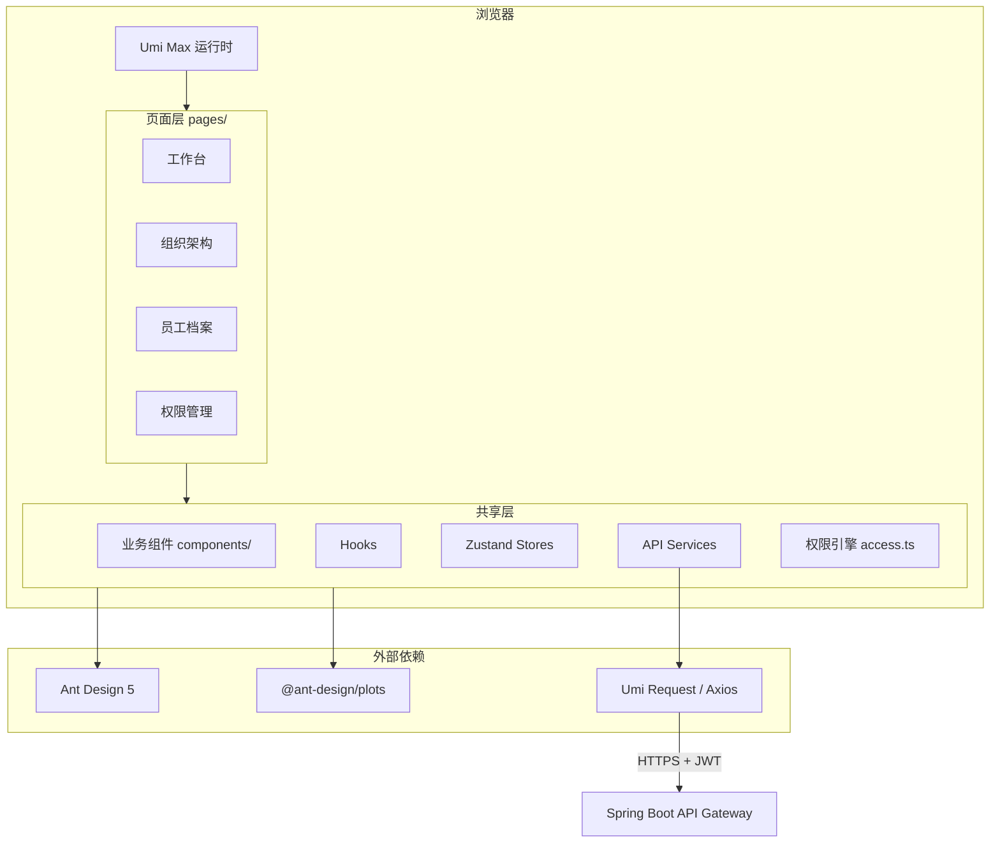

### A.1.3 与 PRD 的对应关系说明

| PRD 需求点 | 前端技术映射 |
|-----------|------------|
| 5 种角色、数据范围各异 | `access.ts` + 后端返回的 `permissions[]` 联合判断 |
| 字段级权限（§2.3） | `FieldGuard` 组件 + 后端字段白名单 |
| 部门树最多 5 层（§3.1.3） | `TreeSelect` 深度校验 + 后端二次校验 |
| 工号/账号系统生成（§4.1.1） | 表单只读展示，禁止前端构造 |
| 工作信息不可直接编辑（§4.1.3） | 字段 `disabled` + 引导至调岗流程入口（§5.3） |
| 入职/调岗/离职流程 | `pages/Workflow/*` + 复用 `ApprovalActions` |
| 审批中心（§8） | 独立一级菜单 `pages/Approval/*`，聚合 9 类待办 |

### A.1.4 技术挑战与解决方案概览

| 挑战 | 方案 |
|-----|------|
| 多角色菜单与按钮权限组合复杂 | Umi `access` 插件 + 后端权限码下发，前端零硬编码 |
| 员工档案字段多、权限差异大 | 配置化 `fieldSchema` + `FieldGuard` 统一渲染 |
| 部门树含实时人数，节点多时不流畅 | 虚拟滚动 `Tree` + 懒加载子节点 + 前端缓存 |
| 高级搜索条件多，URL 不可读 | Zustand 管理筛选态，仅关键条件同步 URL |
| 敏感字段泄露风险 | 前端脱敏展示 + 查看完整信息二次验证（待后端接口） |

---

## A.2 系统架构设计

### A.2.1 整体架构图（前后端分离）

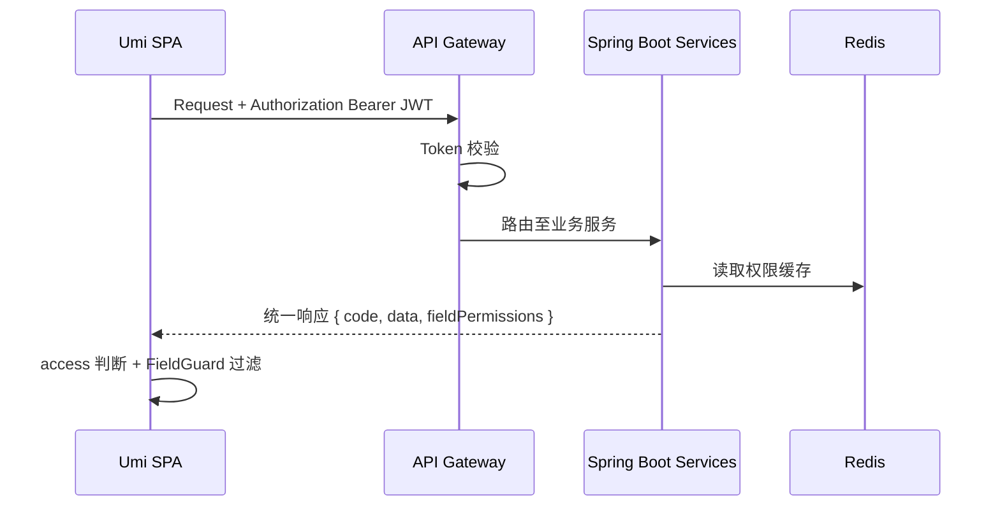

### A.2.2 技术栈详细说明与选型理由

**对应 PRD**：§10.1 前端技术栈约束

| PRD 要求 | 本项目选型 | 说明 |
|---------|-----------|------|
| React（禁止 Vue） | React 18.x | PRD 强制 |
| TypeScript | TypeScript 5.x | 全量 TS |
| 框架 Umi | Umi Max ^4.x | PRD 指定，内置路由/权限/请求 |
| 请求库 | Umi `request` + ahooks `useRequest` | PRD 允许 request/axios；Umi 内置 axios |
| 组件库 | Ant Design 5.x | PRD 强制 antd |
| 图表 | @ant-design/plots（AntV） | PRD 强制 AntV |
| 状态管理 | Zustand ^4.x | PRD 指定 |
| 路由 | Umi 路由（底层 React Router） | PRD React Router，由 Umi 封装 |
| 工具库 | lodash、dayjs | PRD 指定 lodash/dayjs/moment；**新代码统一 dayjs**，不引入 moment |

**可选扩展**（PRD 提及、按需引入）：

| 技术 | 用途 |
|-----|------|
| @tanstack/react-query | 服务端状态缓存（可与 Umi request 共存） |
| axios | 独立脚本或非 Umi 场景 |

**不引入**：Vue、MobX、Redux Toolkit、moment（新代码）。

### A.2.3 前端模块划分

```
src/
├── access.ts                 # 权限定义（对接后端 permission codes）
├── app.tsx                   # 全局初始化、请求拦截、布局配置
├── models/                   # Umi model（可选，复杂页面用）
├── stores/                   # Zustand stores
│   ├── useUserStore.ts
│   ├── usePermissionStore.ts
│   └── useOrgTreeStore.ts
├── services/                 # API 层（与后端接口模块一一对应）
│   ├── workbench.ts          # §2.2.2 工作台（/workbench/summary）
│   ├── auth.ts               # §2.2.1 认证（/auth/*）
│   ├── department.ts         # §2.2.3 部门（/departments/*）
│   ├── position.ts           # §2.2.3a 职位（/positions）
│   ├── employee.ts           # §2.2.4~5 员工（/employees/*）
│   ├── onboarding.ts         # §2.2.6 入职（/onboarding/applications/*）
│   ├── regularization.ts     # §2.2.7 转正（/regularization/applications/*）
│   ├── transfer.ts           # §2.2.7 调岗（/transfers/*）
│   ├── resignation.ts        # §2.2.7 离职（/resignations/*、/resignation-requests）
│   ├── attendance.ts         # §2.2.8 考勤（/attendance/*）
│   ├── leave.ts              # §2.2.9 请假（/leaves/*、/profile/leave/*）
│   ├── overtime.ts           # §2.2.9 加班（/overtime/applications）
│   ├── payroll.ts            # §2.2.10 薪资（/payroll/*）
│   ├── workflow.ts           # §2.2.11 审批待办/操作（/approvals/tasks/*、.../instances/*）
│   ├── delegation.ts         # §2.2.11 委托审批（/approvals/delegations）
│   ├── imports.ts            # §2.2.12 数据迁移（/imports/*）
│   ├── system.ts             # §2.2.12 系统设置（/system/*）
│   └── profile.ts            # §2.2.12 个人中心（/profile/*）
├── components/
│   ├── business/               # 业务组件
│   │   ├── DepartmentTree/         # 部门树组件（含节点人数）
│   │   ├── DeptTreeSelect/         # 部门 TreeSelect（通用）
│   │   ├── EmployeeSearchSelect/   # 员工搜索选择器
│   │   ├── EmployeeStatusTag/      # 在职状态 Tag（probation/regular/pending_resign/resigned）
│   │   ├── ProcessStatusTag/       # 流程状态 Tag（draft/pending/approved等）
│   │   ├── ProcessTypeTag/         # 审批类型 Tag（ONBOARDING/REGULARIZATION/TRANSFER等）
│   │   ├── FieldGuard/             # 字段级权限封装
│   │   ├── SensitiveField/         # 敏感字段脱敏+二次验证
│   │   ├── ApprovalActions/        # 审批操作按钮组（APPROVE/REJECT/FORWARD）
│   │   ├── ApprovalTimeline/       # 审批进度时间线
│   │   ├── ApprovalDetailRenderer/ # 按 processType 动态渲染审批详情
│   │   ├── PunchButton/            # 打卡按钮（IN/OUT）
│   │   ├── AttendanceStatusTag/    # 打卡状态 Tag（normal/late/early_leave等）
│   │   ├── LeaveBalanceGauge/      # 假期余额环形图
│   │   ├── PayrollStepBar/         # 批次状态 Steps 组件
│   │   ├── PayrollAnomalyTag/      # 核算异常 Tag（黄/红）
│   │   ├── PayslipVerifyModal/     # 工资条二次验证弹窗
│   │   ├── PayslipModal/           # 工资条展示弹窗
│   │   └── ImportWizard/           # 5 步导入向导组件
│   └── charts/                 # AntV 图表封装
│       ├── LineChart/
│       ├── ColumnChart/
│       ├── PieChart/
│       └── CalendarHeatmap/     # 考勤日历热力图（ECharts备选）
├── pages/
│   ├── login/                   # §2.2.1 登录页（无 Layout）
│   ├── admin/
│   │   ├── Dashboard/           # §2.2.2 工作台
│   │   │   ├── index.tsx
│   │   │   ├── components/
│   │   │   │   ├── StatCards.tsx
│   │   │   │   ├── QuickLinks.tsx
│   │   │   │   ├── VisitTrendChart.tsx
│   │   │   │   └── RecentOperations.tsx
│   │   ├── Organization/        # §2.2.3~3a 组织架构
│   │   │   ├── Department/
│   │   │   │   ├── index.tsx
│   │   │   │   ├── DeptForm.tsx
│   │   │   │   ├── DeptMergeModal.tsx
│   │   │   │   └── DeptDeleteConfirm.tsx
│   │   │   └── Position/
│   │   │       ├── index.tsx
│   │   │       └── PositionForm.tsx
│   │   ├── Employee/            # §2.2.4~5 员工档案
│   │   │   ├── List/
│   │   │   │   ├── index.tsx
│   │   │   │   └── columns.tsx
│   │   │   └── Detail/
│   │   │       ├── index.tsx
│   │   │       ├── PersonalInfo.tsx
│   │   │       ├── WorkInfo.tsx
│   │   │       ├── SalaryTab.tsx
│   │   │       └── EditPage.tsx
│   │   ├── Workflow/            # §2.2.6~7 入转调离
│   │   │   ├── Onboarding/
│   │   │   │   ├── List/
│   │   │   │   │   ├── index.tsx
│   │   │   │   │   └── StatCards.tsx
│   │   │   │   └── components/
│   │   │   │       ├── CreateModal.tsx
│   │   │   │       └── DetailDrawer.tsx
│   │   │   ├── Regularization/
│   │   │   │   ├── index.tsx
│   │   │   │   └── components/
│   │   │   ├── Transfer/
│   │   │   │   ├── index.tsx
│   │   │   │   └── components/
│   │   │   └── Resignation/
│   │   │       ├── index.tsx
│   │   │       └── components/
│   │   ├── Attendance/          # §2.2.8 考勤管理
│   │   │   ├── Punch/
│   │   │   │   ├── index.tsx
│   │   │   │   └── PunchFixModal.tsx
│   │   │   ├── Groups/
│   │   │   │   └── index.tsx    # 考勤规则配置
│   │   │   ├── Records/
│   │   │   │   └── index.tsx    # 打卡记录
│   │   │   ├── MonthlySummary/
│   │   │   │   └── index.tsx    # 月汇总
│   │   │   ├── Holidays/
│   │   │   │   └── index.tsx    # 法定节假日
│   │   │   └── Statistics/
│   │   │       └── index.tsx    # 考勤统计（个人/部门维度）
│   │   ├── Leave/               # §2.2.9 请假管理
│   │   │   ├── List/
│   │   │   │   └── index.tsx
│   │   │   └── components/
│   │   │       └── LeaveApplyDrawer.tsx
│   │   ├── Overtime/            # §2.2.9 加班管理
│   │   │   └── List/
│   │   │       └── index.tsx
│   │   ├── Payroll/             # §2.2.10 薪资管理
│   │   │   ├── Schemes/
│   │   │   │   └── index.tsx
│   │   │   ├── EmployeeSalary/
│   │   │   │   └── index.tsx
│   │   │   ├── Batches/
│   │   │   │   ├── List/
│   │   │   │   │   └── index.tsx
│   │   │   │   └── Preview/
│   │   │   │       └── index.tsx
│   │   │   ├── Payslips/
│   │   │   │   └── index.tsx
│   │   │   └── CostReport/
│   │   │       └── index.tsx
│   │   ├── Approval/            # §2.2.11 审批中心
│   │   │   ├── Workbench/
│   │   │   │   ├── index.tsx
│   │   │   │   └── Detail.tsx
│   │   │   └── Delegation/
│   │   │       └── index.tsx
│   │   ├── Import/              # §2.2.12 数据迁移
│   │   │   └── index.tsx
│   │   └── System/              # §2.2.12 系统设置
│   │       ├── User/
│   │       │   └── index.tsx
│   │       ├── Role/
│   │       │   └── index.tsx
│   │       ├── OperationLog/
│   │       │   └── index.tsx
│   │       ├── LoginLog/
│   │       │   └── index.tsx
│   │       └── Backup/
│   │           └── index.tsx
│   └── portal/                  # §2.2.12 员工门户
│       ├── Profile/
│       │   ├── index.tsx
│       │   └── MobileChangeModal.tsx
│       ├── Attendance/
│       │   └── index.tsx
│       ├── Leave/
│       │   └── index.tsx
│       ├── Overtime/
│       │   └── index.tsx
│       ├── Salary/
│       │   ├── index.tsx
│       │   └── PayslipVerifyModal.tsx
│       ├── ResignationApply/
│       │   └── index.tsx
│       └── Security/
│           └── index.tsx
└── constants/
    ├── enums.ts
    ├── fieldSchemas/
    ├── workflowSchemas/
    ├── attendanceSchemas/
    ├── payrollSchemas/           # 账套项目/薪资档案 schema
    └── statusColors.ts           # PRD §12.1 状态颜色 token
```

### A.2.4 构建与部署架构

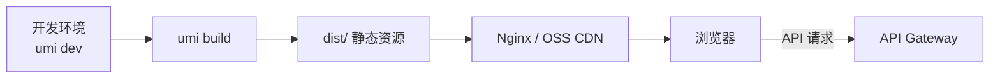

- **环境变量**：`.env.development` / `.env.production` 区分 `UMI_APP_API_BASE`
- **产物**：gzip/br 压缩；`hash` 文件名支持长期缓存
- **路由模式**：`history` 模式，Nginx `try_files` 回退 `index.html`

### A.2.5 关键技术决策与权衡

| 决策 | 选择 | 理由 |
|-----|------|------|
| 权限来源 | 后端下发为主 | 避免前后端权限不一致；前端 `access` 仅做 UI 门控 |
| 员工列表状态 | `useAntdTable` + URL 分页 | 符合 Ant Design Table 生态，减少自研 |
| 部门树数据 | 全局 Zustand 缓存 | 多页面复用，变更后 `invalidate` |
| 图表库 | @ant-design/plots | 与 Ant Design Token 统一，减少样式适配 |
| 国际化 | 首期不做 i18n | PRD 未要求；预留 `locale/` 目录 |

---

## A.3 模块详细设计

### A.3.1 权限中心模块

**对应 PRD**：§2.1、§2.2、§2.3

#### A.3.1.1 路由与菜单权限

Umi `access.ts` 定义权限码，与后端 `sys_permission.code` 一一对应：

```typescript
// src/access.ts
export default function access(initialState: InitialState) {
  const { permissions = [] } = initialState?.currentUser ?? {};
  const has = (code: string) => permissions.includes(code);

  return {
    canAdmin: has('system:admin'),
    canViewAllEmployee: has('employee:view:all'),
    canViewDeptEmployee: has('employee:view:dept'),
    canViewPayroll: has('payroll:view:all'),
    canManageOrg: has('org:manage'),
    canManageWorkflow: has('workflow:manage'),
    canCreateOnboarding: has('onboarding:create'),
    canConfirmOnboarding: has('onboarding:confirm'),
    canManageAttendance: has('attendance:manage'),
    canPunch: has('attendance:punch'),
    canManagePayroll: has('payroll:manage'),  // 仅 HR/财务；系统管理员无此权限（PRD §2.2）
    canViewPayrollBatch: has('payroll:batch:view'),
    canApprovePayroll: has('payroll:approve'),
    canAccessApprovalCenter: has('workflow:approve'),
    // ... 按 PRD §2.2 矩阵扩展
  };
}
```

路由配置示例：

```typescript
// config/routes.ts（片段）
{
  path: '/employee',
  name: '员工管理',
  access: 'canViewAllEmployee', // 或 canViewDeptEmployee
  routes: [
    { path: '/admin/employee/list', component: './Employee/List' },
    { path: '/admin/employee/:id', component: './Employee/Detail' },
  ],
},
```

#### A.3.1.2 数据权限 UI 过滤

**行级**：列表页不额外过滤——依赖后端按角色返回可见数据集。前端仅展示 API 结果。

**字段级**（PRD §2.3）：

```typescript
// src/components/FieldGuard/index.tsx
type FieldPermission = 'view' | 'view_self' | 'hidden';

interface Props {
  field: string;
  recordOwnerId?: string;
  currentUserId: string;
  permissions: Record<string, FieldPermission>;
  children: React.ReactNode;
}

export const FieldGuard: React.FC<Props> = ({
  field, recordOwnerId, currentUserId, permissions, children,
}) => {
  const perm = permissions[field] ?? 'hidden';
  if (perm === 'hidden') return null;
  if (perm === 'view_self' && recordOwnerId !== currentUserId) {
    return <span className="text-muted">***</span>;
  }
  return <>{children}</>;
};
```

字段权限映射表（PRD §2.3）：

| 字段 | HR 专员 | 部门主管 | 普通员工 |
|-----|--------|---------|---------|
| 姓名/手机号 | `view` | `view` | `view` |
| 身份证号 | `view` | `hidden` | `view_self` |
| 薪资信息 | `view` | `hidden` | `view_self` |
| 紧急联系人/银行卡 | `view` | `hidden` | `view_self` |

后端在接口响应中附带 `fieldPermissions`，前端 `usePermissionStore` 缓存。

#### A.3.1.3 按钮级权限

使用 Umi `useAccess` + 自定义 `PermissionButton`：

```tsx
const access = useAccess();
<PermissionButton
  permission="employee:edit"
  type="primary"
  onClick={handleEdit}
>
  编辑
</PermissionButton>
```

PRD §4.2.3 列表操作可见性：

| 操作 | 条件 |
|-----|------|
| 查看详情 | 有行级查看权限 |
| 编辑 | `employee:edit` + 字段可编辑（§4.1 可编辑性） |
| 调岗/离职 | 员工状态为试用期/正式 + `workflow:transfer` / `workflow:resign` |
| 确认入职 | API `status=approved_pending` + 权限 `onboarding:confirm` → `POST .../confirm` |

#### A.3.1.4 权限缓存策略

- 登录后 `/api/v1/auth/profile` 返回 `user + roles + permissions + fieldPermissions`
- 存入 `useUserStore`（内存）+ `sessionStorage`（刷新恢复，不含 Token）
- Token 存 `httpOnly Cookie`（推荐）或 `localStorage`（需 XSS 防护）
- 权限变更后 WebSocket/SSE 推送或下次请求 `403` 时强制重新拉取

---

### A.3.2 组织架构管理模块

**对应 PRD**：§3.1、§3.2

#### A.3.2.1 部门管理页面设计

**布局**：左树右表（或左树右详情）

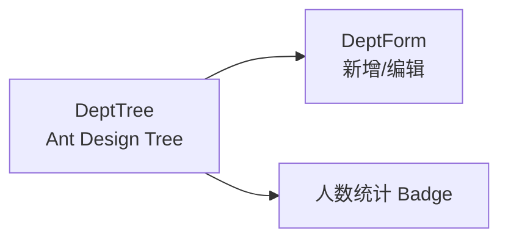

**Tree 节点数据结构**：

```typescript
interface DeptTreeNode {
  key: string;          // departmentId
  title: string;        // 部门名称 + (人数)
  children?: DeptTreeNode[];
  depth: number;        // 当前深度，用于 5 层限制
  headcount: number;    // 含子部门在职人数
  isLeaf?: boolean;
}
```

**5 层深度限制**（PRD §3.1.3）：

```typescript
const MAX_DEPT_DEPTH = 5;

function canAddChild(node: DeptTreeNode): boolean {
  return node.depth < MAX_DEPT_DEPTH;
}
```

新增子部门时，若 `parent.depth >= 5`，前端禁用并提示；提交前仍由后端校验。

**删除/合并**（PRD §3.1.3）：删除前调用 `GET /api/v1/departments/{id}/can-delete`，若 `employeeCount > 0` 则弹窗引导至员工调动流程。

#### A.3.2.2 职位管理页面设计

**对应 PRD**：§3.2.1、§3.2.2

表单联动逻辑：

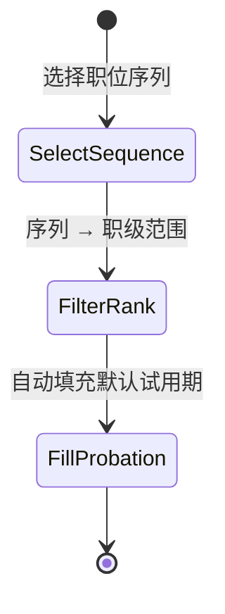

```typescript
// constants/enums.ts
export const SEQUENCE_RANK_MAP = {
  M: { label: '管理序列', ranks: ['M1','M2','M3','M4','M5'] },
  P: { label: '专业序列', ranks: ['P1','P2',/*...*/'P10'] },
  S: { label: '支持序列', ranks: ['S1','S2','S3','S4','S5'] },
} as const;

// 职位表单：序列变更时重置职级范围 Select options
```

| 字段 | 组件 | 校验 |
|-----|------|------|
| 职位名称 | `Input` | 必填，max 64 |
| 职位序列 | `Select` | 必填，M/P/S |
| 所属部门 | `DeptTreeSelect` | 可选，空=全公司通用 |
| 职级范围 | `Select` mode="multiple" | 必填，选项随序列变化 |
| 默认试用期 | `InputNumber` | 必填，1–6 月 |
| 是否标准职位 | `Switch` | false→入职触发二审 |
| 职位描述 | `TextArea` | 可选 |

#### A.3.2.3 部门树性能优化

| 策略 | 实现 |
|-----|------|
| 懒加载 | `loadData` 按需请求子节点（部门 > 200 时启用） |
| 虚拟滚动 | `@rc-component/tree` 或拆分 `Tree` + 搜索扁平列表 |
| 缓存 | `useOrgTreeStore` 缓存全量树（≤5 层 × 合理宽度可全量加载） |
| 人数更新 | 员工状态变更后 `eventBus` 触发树节点 `headcount` 刷新 |

#### A.3.2.4 AntV 集成（组织架构）

部门人数分布——工作台或组织分析子页：

```tsx
import { Column } from '@ant-design/plots';

const DeptHeadcountChart: React.FC<{ data: { dept: string; count: number }[] }> = ({ data }) => (
  <Column
    data={data}
    xField="dept"
    yField="count"
    label={{ position: 'top' }}
    meta={{ count: { alias: '在职人数' } }}
  />
);
```

---

### A.3.3 员工档案管理模块

**对应 PRD**：§4.1、§4.2

#### A.3.3.1 页面结构与路由

```
/admin/employee/list          → 员工列表（ProTable）
/admin/employee/:id           → 档案详情（Tabs 分区）
/admin/employee/:id/edit      → 编辑（仅可编辑字段）
/admin/onboarding/list    → 入职管理列表（§5.1）
/admin/lifecycle/regularization → 转正管理（§5.2）
/admin/lifecycle/transfer      → 调岗管理（§5.3）
/admin/lifecycle/resignation   → 离职管理（§5.4）
/admin/approval/workbench    → 审批工作台（§8.2）
/admin/approval/delegate     → 委托审批（§8.3）
```

详情页 Tab 划分：

| Tab | 内容 | 权限 |
|-----|------|------|
| 基础信息 | 工号、状态、入职日期 | 按行级 |
| 个人信息 | §4.1.2 字段 | 字段级 |
| 工作信息 | §4.1.3，全部只读 | 行级 |
| 薪资合同 | §4.1.4，HR/财务可见 | 字段级 + 角色 |

#### A.3.3.2 字段 Schema 配置化

```typescript
// constants/fieldSchemas/employeePersonal.ts
export const personalInfoSchema: FieldSchema[] = [
  { key: 'name', label: '姓名', type: 'text', required: true, editable: true },
  { key: 'gender', label: '性别', type: 'select', required: true, editable: true },
  { key: 'mobile', label: '手机号', type: 'text', required: true, editable: false,
    extra: 'PRD §4.1.2 不可直接编辑，请申请变更' },
  { key: 'idNumber', label: '身份证号', type: 'sensitive', required: true, editable: false },
  // ...
];
```

表单渲染器根据 `editable` + `FieldGuard` 动态设置 `disabled` / 脱敏。

#### A.3.3.3 敏感字段展示

```tsx
// SensitiveField：默认脱敏，点击后二次验证再展示完整值
<SensitiveField
  field="idNumber"
  maskedValue={maskIdNumber(value)}  // 110***********1234
  onReveal={() => verifyAndFetch('idNumber')}
/>
```

二次验证：弹窗输入登录密码或短信验证码 → 调用 `GET /api/v1/employees/{id}/sensitive/{field}`（请求头或 Query 携带验证信息，见 OpenAPI）。

#### A.3.3.4 员工列表与高级搜索

**对应 PRD**：§4.2

默认列（§4.2.1）：姓名、工号、部门、职位、职级、在职状态、入职日期、操作。

高级筛选（§4.2.2）：

```tsx
<ProTable<EmployeeListItem>
  columns={columns}
  request={async (params) => {
    const { current, pageSize, keyword, departmentIds, positionIds, employmentStatus, gradeLevels, hireDateRange } = params;
    return employeeService.list({
      page: current,
      size: pageSize,
      keyword,
      departmentIds: departmentIds?.join(','),
      positionIds: positionIds?.join(','),
      employmentStatus: employmentStatus?.join(','),
      gradeLevels: gradeLevels?.join(','),
      hireDateFrom: hireDateRange?.[0],
      hireDateTo: hireDateRange?.[1],
    });
  }}
  toolBarRender={() => [
    <Access accessible={access.canCreateEmployee} key="create">
      <Button type="primary">新建候选人</Button>
    </Access>,
  ]}
/>
```

筛选组件映射：

| 条件 | 组件 |
|-----|------|
| 关键词 | `Input.Search`（姓名/工号/手机号） |
| 部门 | `DeptTreeSelect` multiple |
| 职位/状态/职级 | `Select` mode="multiple" |
| 入职日期 | `DatePicker.RangePicker` |

#### A.3.3.5 列表性能优化

- 分页默认 20 条，最大 100
- 列宽固定，避免 Table 重排
- 部门/职位名称：列表接口后端 JOIN 返回，避免 N+1 前端请求
- 导出：异步任务 + 消息通知（待后端接口）

---

### A.3.4 入转调离流程模块

**对应 PRD**：§5.1–5.4

#### A.3.4.0 流程通用 UI 组件

**路由配置**（`config/routes.ts`）：

```typescript
{
  path: '/admin/lifecycle',
  name: '流程管理',
  icon: 'AuditOutlined',
  access: 'canManageWorkflow',
  routes: [
    { path: '/admin/onboarding/list', component: './Workflow/Onboarding/List', name: '入职管理' },
    { path: '/admin/lifecycle/regularization', component: './Workflow/Regularization', name: '转正管理' },
    { path: '/admin/lifecycle/transfer', component: './Workflow/Transfer', name: '调岗管理' },
    { path: '/admin/lifecycle/resignation', component: './Workflow/Resignation', name: '离职管理' },
  ],
},
```

（「我的审批」已独立为 §A.3.8 审批中心一级菜单 `/admin/approval/*`。）

**复用组件 `ApprovalActions`**：

```tsx
interface ApprovalActionsProps {
  taskId?: string;
  instanceId: string;
  currentNode: number;
  canWithdraw: boolean;  // HR 且第一级
  onSuccess: () => void;
}

// 渲染：通过 / 拒绝(Modal填意见) / 转交(UserSelect) / 撤回(Confirm)
```

**状态 Tag 配色**（`ProcessStatusTag`，**按 API 状态值**映射，契约 §7.2）：

| API status | 颜色 | 场景 |
|-----|------|------|
| draft | default | 草稿 |
| pending | processing | 审批中 |
| approved_pending / pending_resign | warning | 待入职/待离职 |
| onboarded / regular / resigned | success | 已完成 |
| rejected / abandoned | error | 已拒绝/已放弃 |

#### A.3.4.1 入职管理（§5.1）

**页面布局**（参考 PRD §5.1.6 原型）：

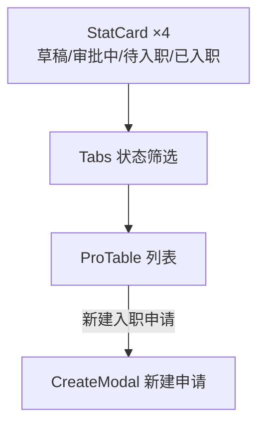

**统计卡片**：调用 `GET /api/v1/onboarding/applications/stats`，四色卡片对应 API 状态 `draft` / `pending` / `approved_pending` / `onboarded`（契约 §7.2）。

**列表列**（PRD §4.2.1）：姓名、工号、部门、职位、职级、在职状态、入职日期、操作。

**更多操作**（PRD §4.2.3）：调岗、离职（HR 可见；须关联已批准的员工离职申请，见 PRD §5.4.1）。

**列表列（入职）**：姓名（头像+手机号）、部门、职位、录用类型、预计入职日期、状态、操作。

**操作列按状态**（`status` 为 API 值）：

| status | 操作（HR） | 操作（审批人） |
|-----|-----------|--------------|
| draft | 编辑、删除、提交 | — |
| pending | 撤回 | — |
| pending | — | —（详情页审批） |
| approved_pending | 确认入职、修改日期、放弃 | 查看 |
| rejected | 重新发起 | — |
| onboarded | 查看 | 查看 |

**新建申请 Modal**（§5.1.3 字段）：

```tsx
<ModalForm title="新建入职申请" width={640}>
  <ProFormText name="name" label="姓名" rules={[{ required: true }]} />
  <ProFormSelect name="gender" label="性别" options={GENDER_OPTIONS} />
  <ProFormText name="mobile" label="手机号" rules={[{ required: true }, phoneRule]} />
  <ProFormText name="email" label="邮箱" rules={[{ required: true }, emailRule]} />
  <ProFormText name="idNumber" label="身份证号" rules={[{ required: true }, idCardRule]} />
  <ProFormDatePicker name="expectedOnboardDate" label="预计入职日期" />
  <DeptTreeSelect name="departmentId" label="所属部门" />
  <ProFormSelect name="positionId" label="职位" dependencies={['departmentId']} />
  <ProFormSelect name="employmentType" label="录用类型" options={EMPLOYMENT_TYPES} /> {/* fulltime/parttime/intern */}
  <ProFormDigit name="probationMonths" label="试用期(月)" /* 选职位后自动填充 */ />
  <ProFormDigit name="probationSalaryRatio" label="试用期薪资比例" fieldProps={{ min: 0.8, max: 1, step: 0.05 }} />
  <ProFormDigit name="baseSalary" label="约定薪资" rules={[{ required: true }]} />
  <ProFormSelect name="managerId" label="直接汇报人" /* 默认部门负责人 */ />
</ModalForm>
```

**底部按钮**：`保存草稿`（`action=draft`）| `提交审批`（校验必填后 `action=submit`）。

**详情页**：顶部 `Steps` 展示审批进度 + `ApprovalTimeline` + 右侧 `ApprovalActions`（当前审批人可见）。

#### A.3.4.2 转正管理（§5.2）

**待转正 Tab**：`GET /api/v1/regularization/applications/pending`，展示系统 -7 天提醒的员工。

**发起转正 Drawer**：

| 字段 | API 字段名 | 组件 | 说明 |
|-----|-----------|------|------|
| 员工信息 | `employeeId` | `Descriptions` | 只读，系统带出 |
| 试用期起止 | — | `DatePicker` | 只读 |
| 试用期表现评价 | `performanceEvaluation` | `TextArea` | 必填 |
| 转正后薪资调整 | `salaryAdjustment` | `InputNumber` | 可选，填写后提示需额外审批 |
| 审批结果 | `approvalResult` | `Radio` | PASS / EXTEND / FAIL |

审批进度：`Steps` 两步 — 部门负责人 → HR 负责人。

#### A.3.4.3 调岗管理（§5.3）

**发起调岗 Modal**：

```typescript
// 校验：newDepartmentId !== currentDepartmentId
const transferSchema = [
  { key: 'employeeId', component: 'EmployeeSearchSelect', required: true },
  { key: 'newDepartmentId', component: 'DeptTreeSelect', required: true },
  { key: 'newPositionId', component: 'PositionSelect' },
  { key: 'newJobLevel', component: 'Select', options: rankOptions },
  { key: 'newManagerId', component: 'EmployeeSearchSelect' },
  { key: 'salaryAdjustment', component: 'InputNumber', extra: '如有调整将触发额外审批' },
  { key: 'effectiveDate', component: 'DatePicker', required: true },
  { key: 'reason', component: 'TextArea' },
];
```

**审批 Steps 三步**：原部门负责人（知情确认）→ 新部门负责人（接收确认）→ HR 负责人（备案）。

员工详情页「工作信息」Tab 增加「发起调岗」按钮，跳转调岗表单并预填员工。

#### A.3.4.4 离职管理（§5.4）

**页面布局**（参考 PRD §5.4.5 原型）：


**风险提醒 Banner**：

```tsx
<Alert
  type="warning"
  showIcon
  message={`风险提醒：本月离职 ${stats.monthCount} 人，离职率 ${stats.rate}%，${stats.delta > 0 ? '高于' : '低于'}上月 ${Math.abs(stats.delta)}%`}
/>
```

**发起离职 Drawer**（§5.4.3，HR 正式离职）：

| 字段 | API 字段名 | 组件 | 校验 |
|-----|-----------|------|------|
| 关联申请 | `requestId` | `Select` | 必填，来自已批准的员工离职申请 |
| 员工姓名 | `employeeId` | `EmployeeSearchSelect` | 必填，选择申请后自动带出 |
| 离职日期 | `lastWorkDay` | `DatePicker` | 必填，≥ 今天 |
| 离职原因分类 | `reasonCategory` | `Select` | VOLUNTARY / INVOLUNTARY / NEGOTIATED |
| 离职类型 | `resignationType` | `Select` | resignation / dismissal / contract_expiry / other |
| 详细说明 | `reasonDetail` | `TextArea` | 可选 |
| 工作交接人 | `handoverEmployeeId` | `EmployeeSearchSelect` | 必填 |

**列表列**：员工姓名、部门、职位、离职类型、离职日期、交接人、状态、操作（查看详情）。

#### A.3.4.4.1 员工离职申请（PRD §5.4.1）

**入口**：个人中心 `/portal/resignation/apply` 或档案页「申请离职」。

| 字段 | API 字段名 | 组件 | 说明 |
|-----|-----------|------|------|
| 期望离职日期 | `expectedResignDate` | `DatePicker` | ≥ 今天 |
| 离职原因分类 | `reasonCategory` | `Select` | VOLUNTARY / INVOLUNTARY / NEGOTIATED |
| 离职类型 | `resignationType` | `Select` | resignation / dismissal / contract_expiry / other |
| 详细说明 | `reasonDetail` | `TextArea` | 可选 |

提交 `POST /api/v1/profile/resignation-requests`；审批进度在审批中心或个人中心查看。通过后 HR 在离职管理页发起正式离职。

#### A.3.4.5 业务模块内审批入口

各流程详情页仍保留 `ApprovalTimeline` + `ApprovalActions`；审批人聚合待办统一在 §A.3.8 审批中心。原 `/admin/lifecycle/approval` 重定向至 `/admin/approval/workbench`。

#### A.3.4.6 表单草稿与状态同步

- 入职草稿：API `status=draft`；Modal 关闭时可选 `localStorage` 缓存（key: `onboarding_draft_{userId}`）
- 列表 Tab 与 URL 同步：`?status=pending`（API 枚举，非 DB 大写）
- 操作成功后 `mutate` 刷新 stats + table

---

### A.3.5 考勤管理模块

**对应 PRD**：§6.1–6.4

#### A.3.5.0 路由与导航

```typescript
{
  path: '/admin/attendance',
  name: '考勤管理',
  icon: 'ClockCircleOutlined',
  routes: [
    { path: '/admin/attendance/punch', component: './Attendance/Punch', name: '打卡中心' },
    { path: '/admin/attendance/groups', component: './Attendance/Rules', name: '考勤规则', access: 'canManageAttendance' },
    { path: '/admin/attendance/records', component: './Attendance/Records', name: '打卡记录' },
    { path: '/admin/attendance/monthly-summary', component: './Attendance/MonthlySummary', name: '月汇总' },
    { path: '/admin/attendance/holidays', component: './Attendance/Holidays', name: '法定节假日', access: 'canManageAttendance' },
    { path: '/admin/attendance/statistics', component: './Attendance/Statistics', name: '考勤统计' },
  ],
},
```

侧边栏顺序对齐 PRD §6.2.4 / §6.4：打卡中心 → 考勤规则 → 记录 → 月汇总 → 节假日 → 统计。请假管理见 §2.2.9 `/admin/leave/list`。

#### A.3.5.1 考勤规则配置（§6.1）

**页面**：`/admin/attendance/groups`，HR 可见。

**布局**：

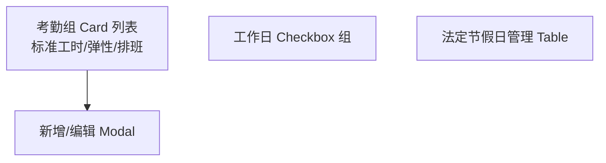

**考勤组 Card**（§6.1.1、原型 §6.2.4）展示：名称、班次类型、上下班时间、适用部门/人数、迟到阈值。

**表单字段**：

| 字段 | 组件 | 说明 |
|-----|------|------|
| 考勤组名称 | `Input` | 必填 |
| 适用人员 | `DeptTreeSelect` + `PositionSelect` + `EmployeeSearchSelect` | 部门/职位/个人 |
| 班次类型 | `Select` | 固定班/弹性班/排班制 |
| 上班/下班时间 | `TimePicker` | 必填 |
| 中午休息 | `TimePicker.RangePicker` | 默认 12:00–13:00 |
| 弹性范围 | `TimePicker` ×2 | 弹性班显示；字段 `flexibleRange: { earliest, latest }` |
| 迟到/早退阈值 | `InputNumber` | 默认 15 分钟 |
| IP 白名单 | `Select` mode="tags" | 可选 |
| GPS 范围 | 地图选点（可选） | `{ lat, lng, radius }` |

**工作日设置**（§6.1.2）：周一至周日 Checkbox，默认勾选周一–周五；底部提示「法定节假日需提前配置，自动排除出勤要求」。

#### A.3.5.2 打卡中心（§6.2）

**页面**：`/admin/attendance/punch`（管理端打卡中心；员工端见 `/portal/attendance` + `POST /profile/attendance/punch`）。

##### 打卡操作区

```tsx
<PunchButton
  type="in"
  disabled={todayStatus.hasClockIn}
  onPunch={() => attendanceService.punch({ type: 'in' })}
/>
<PunchButton type="out" disabled={!todayStatus.hasClockIn || todayStatus.hasClockOut} />
```

打卡成功后 Toast 展示判定结果（正常/迟到/早退等）。

##### 状态说明图例（§6.2.3、§6.2.4）

`AttendanceStatusTag` 配色：

| 状态 | 颜色 | 文案 |
|-----|------|------|
| NORMAL | green | 正常 |
| LATE | gold | 迟到 |
| EARLY_LEAVE | orange | 早退 |
| ABSENT_HALF | red | 旷工半天 |
| MISSING_IN | purple | 上班缺卡 |
| MISSING_OUT | blue | 下班缺卡 |
| ABSENT | red | 缺勤 |

##### 本月打卡记录 Table（§6.2.4）

列：日期、姓名、部门、上班时间、下班时间、状态、操作。

**补卡按钮**：`申请补卡 (已用/2)`，调用 `GET /api/v1/attendance/punch-fix/quota` 展示剩余次数；Modal 填写补卡日期、类型（上班/下班）、时间、原因。

##### 打卡规则说明（折叠 Panel）

静态展示 PRD §6.2.2 判定逻辑，与后端 `PunchJudgeService` 一致，便于用户理解。

#### A.3.5.3 请假管理（§6.3）

**页面**：`/admin/leave/list`

**布局**（对齐 PRD §6.3.4 原型）：

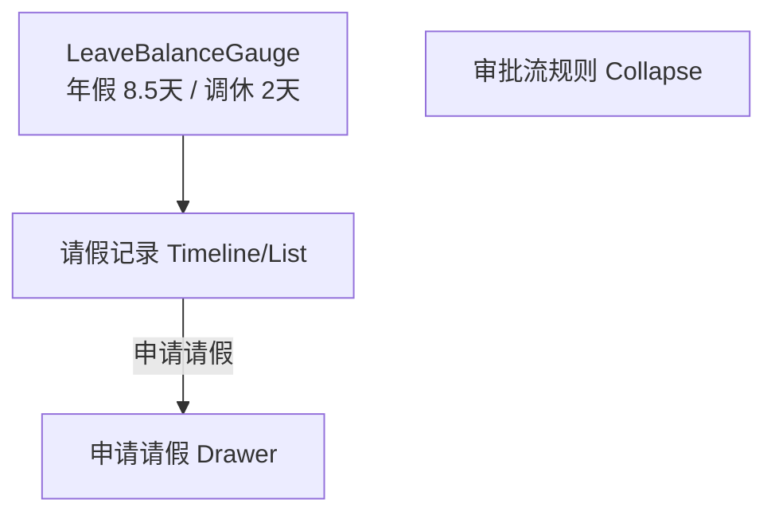

##### 假期余额（§6.3.2）

```tsx
<LeaveBalanceGauge
  title="年假余额"
  value={balance.annual}
  total={balance.annualTotal}
/>
<LeaveBalanceGauge title="调休余额" value={balance.compOff} unit="天" />
```

##### 申请请假 Drawer（§6.3.3）

| 字段 | 组件 | 校验 |
|-----|------|------|
| 请假类型 | `Select` | 必填，7 种类型 |
| 开始/结束时间 | `DatePicker` + `Select`(上午/下午) | 必填 |
| 请假天数 | `InputNumber` disabled | 系统计算，0.5 步进 |
| 请假事由 | `TextArea` | 必填 |
| 工作交接人 | `EmployeeSearchSelect` | 可选 |
| 附件 | `Upload` | 病/婚/产假必填 |

选完时间后调用 `GET /api/v1/leaves/calc-days` 预览天数。

##### 审批流规则展示（§6.3.4）

页面内嵌只读 Table，与 PRD 规则一致，减少用户咨询。

##### 请假记录

Timeline 展示：类型 Tag、天数、日期范围、事由、审批人、状态（审批中/已通过/已拒绝）。审批中显示「撤销」→ 管理端 `PUT /api/v1/leaves/applications/{id}/cancel`；员工门户 `POST /api/v1/profile/leave/applications/{id}/cancel`（数据范围由后端 `@DataScope` 控制）。

#### A.3.5.4 考勤统计（§6.4）

**页面**：`/admin/attendance/statistics`

**权限**：普通员工看个人 Tab；HR/部门主管看部门 Tab（`@DataScope` 后端过滤）。

##### 个人维度（§6.4.1）

`Statistic` 卡片行：应出勤、实际出勤、迟到次数、早退次数、旷工天数、请假天数、加班时长、年假余额。

##### 部门维度（§6.4.2，HR 可见）

部门出勤率、迟到率、请假率 — `Statistic` + 环比箭头。

##### AntV 图表（§6.4.3）

统一 `useChartTheme` 主题：

| 图表 | 组件 | 数据 API |
|-----|------|---------|
| 部门出勤率趋势 | `Line` | `/api/v1/attendance/statistics/department` |
| 请假类型分布 | `Pie` | 基于 `GET /api/v1/attendance/statistics/department` 响应**前端聚合**（附录 E：不增强） |
| 迟到早退排行 | `Column` | 同上 |
| 考勤日历 | `Calendar` + 自定义 Cell | `/api/v1/attendance/statistics/personal` |

**考勤日历 Cell**：按 `dayStatus` 着色（绿/黄/橙/红/紫/蓝），Tooltip 展示上下班时间与请假信息。

```tsx
<Calendar
  cellRender={(date) => {
    const stat = calendarMap[date.format('YYYY-MM-DD')];
    return stat ? <AttendanceStatusTag status={stat.dayStatus} compact /> : null;
  }}
/>
```

#### A.3.5.5 与薪资模块衔接

月考勤汇总 `att_monthly_summary` 的加班时长、请假天数、迟到次数在 §A.3.6.3 月度核算时自动拉取；预览页可跳转 `/admin/attendance/statistics?period=xxx` 查看明细。

---

### A.3.6 薪资管理模块

**对应 PRD**：§7.1–7.4

#### A.3.6.0 路由与导航

```typescript
{
  path: '/admin/payroll',
  name: '薪资管理',
  icon: 'MoneyCollectOutlined',
  access: 'canViewPayroll',
  routes: [
    { path: '/admin/payroll/schemes', component: './Payroll/Schemes', name: '薪资账套', access: 'canManagePayroll' },
    { path: '/admin/payroll/employee-salary', component: './Payroll/EmployeeSalary', name: '员工薪资', access: 'canManagePayroll' },
    { path: '/admin/payroll/batches', component: './Payroll/Batches/List', name: '月度核算' },
    { path: '/admin/payroll/batches/:id/preview', component: './Payroll/Batches/Preview', hideInMenu: true },
    { path: '/admin/payroll/payslips', component: './Payroll/Payslips', name: '工资条', access: 'canManagePayroll' },
    { path: '/admin/payroll/cost-report', component: './Payroll/CostReport', name: '成本报表', access: 'canManagePayroll' },
  ],
},
```

侧边栏顺序对齐 PRD §7.1.4 / §7.3.5 原型：薪资账套 → 员工薪资 → 月度核算 → 工资条 → 成本报表。

HR 与财务视图通过 `access` 区分：财务专员 `canApprovePayroll` 可见审批操作；普通员工通过 `/portal/salary` 查看本人工资条（§A.3.9.4）。

#### A.3.6.1 薪资账套管理（§7.1）

**页面**：`/admin/payroll/schemes`

**布局**（§7.1.4 原型）：

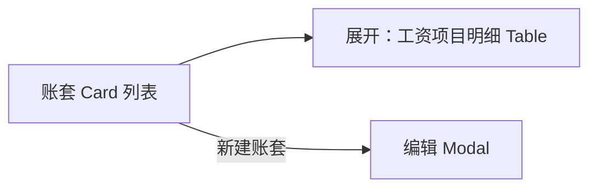

**Card 展示**：名称、启用/停用 Tag、适用范围描述、生效日期、工资项目数量。

**工资项目 Table 列**：项目名称、类型（固定收入/变动收入/考勤扣款/社保/公积金/个税）、计算规则。

**新建/编辑 Modal**：

| 字段 | 组件 |
|-----|------|
| 账套名称 | `Input` |
| 适用范围 | 部门/职位/职级多选 |
| 生效日期 | `DatePicker` |
| 工资项目 | `EditableProTable` 动态行 |

项目类型 `Select` 切换后显示不同规则输入：固定项直接填默认值；变动项填公式；社保/公积金填基数字段+比例。

预置模板：标准职员（11 项）、管理层（6 项）、试用期（6 项，可停用）。

#### A.3.6.2 员工薪资设置（§7.2）

**页面**：`/admin/payroll/employee-salary`

左：`EmployeeSearchSelect` + 员工基本信息；右：薪资档案 Form。

| 字段 | 组件 | 说明 |
|-----|------|------|
| 适用账套 | `Select` | 关联 template |
| 基本工资 | `InputNumber` | |
| 各项津贴基数 | 动态 FormList | JSON 映射 |
| 社保/公积金基数 | `InputNumber` | 试用期仍全额 |
| 绩效基数 | `InputNumber` | 可选 |
| 试用期比例 | `InputNumber` | 0.8–1.0，仅试用期员工 |

底部 **调薪历史** `Table`：字段、旧值、新值、生效日、原因。

员工详情页「薪资合同」Tab 增加「编辑薪资档案」入口（HR 可见）。

#### A.3.6.3 月度薪资核算（§7.3）

**列表页** `/admin/payroll/batches`：月份筛选 + 「新建核算批次」按钮。

**预览页** `/admin/payroll/batches/:id/preview`（§7.3.5 原型）：

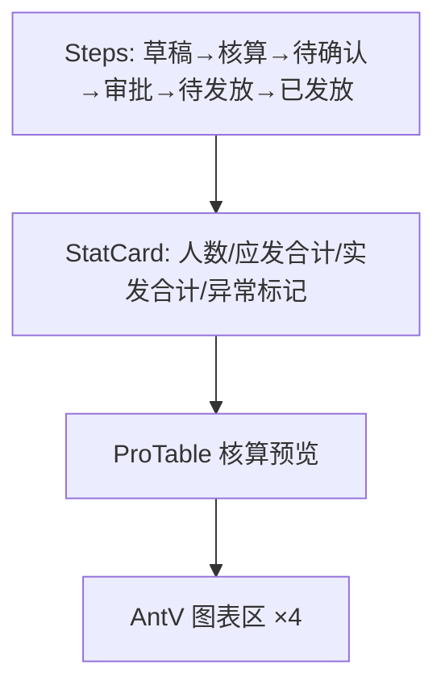

##### Steps 与批次状态映射（API `status`，契约 §7.5）

| Step | API status | 说明 |
|------|-----------|------|
| 草稿 | draft | 可删除、开始计算 |
| 计算中 | calculating | 等待异步结果 |
| 待确认 | pending_confirm | 预览、手工调整、提交审批 |
| 审批中 | approving | 等待审批结果 |
| 已通过（待发放） | approved | 发放确认 |
| 已发放 | distributed | 终态，只读 |
| 已驳回 | rejected | 分支终态，修改后可重提 |

##### 统计卡片

- 核算人数、应发合计（绿色）、实发合计（紫色）、异常标记数（红色）

##### 预览 Table 列

工号、姓名、部门、基本工资、绩效、应发、社保公积金、个税、实发、状态。

**异常 Tag**（`PayrollAnomalyTag`）：

| 标记 | 颜色 | 文案示例 |
|-----|------|---------|
| LEAVE_HIGH | gold | 请假异常 |
| OVERTIME_HIGH | gold | 加班异常 |
| SALARY_CHANGE_HIGH | red | 变动异常 |
| NO_SALARY_PROFILE | red | 无档案 |

行内红色/黄色高亮，支持点击展开明细。

##### 操作按钮（按 API status）

| status | HR | 财务 |
|-----|-----|------|
| draft | 删除、开始计算 | — |
| pending_confirm | 调整、提交审批 | — |
| approving | 查看进度 | 审批通过/驳回 |
| approved | 发放确认 | 查看 |

计算中展示 `Progress` + 轮询 `GET /api/v1/payroll/batches/{id}`，直至 `status` 离开 `calculating`（附录 E：不增强，无独立 progress 接口）。

##### AntV 图表（§7.3.4）

| 图表 | 组件 | 数据 API |
|-----|------|---------|
| 薪资成本月度趋势 | `Line`（应发/实发双线） | `GET /api/v1/payroll/batches/{id}/chart-data` → `trend` |
| 部门薪资分布 | `Column` | 同上 → `deptDistribution` |
| 薪资构成占比 | `Pie` | 同上 → `composition` |
| 社保公积金对比 | `Column` grouped | 同上 → `ssHfCompare` |
| 薪资变动分布 | `Histogram` | 同上 → `changeDistribution` |

#### A.3.6.4 工资条（§7.4）

##### HR 工资条管理 `/admin/payroll/payslips`

列表：员工、月份、发放状态（已发送/未发送）、操作（查看）。

员工端工资条详见 §A.3.9.4 `/portal/salary`（列表摘要 + 二次验证后详情）。

#### A.3.6.5 与考勤模块衔接

月度核算「开始计算」前校验考勤批次已锁定；预览 Table 中请假扣款、加班收入可点击跳转 `/admin/attendance/statistics?period=xxx`。

---

### A.3.7 工作台与数据分析

**对应 PRD**：§1.4 及参考 UI 截图（中台管理系统）

#### A.3.7.1 工作台 Dashboard

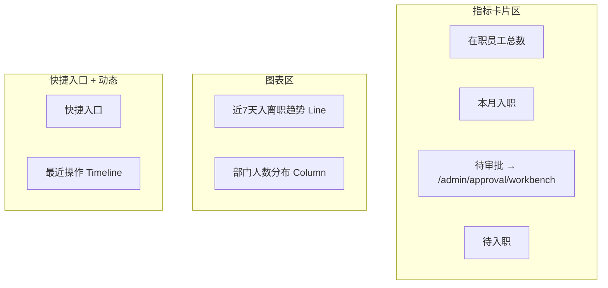

指标卡使用 `Statistic` + `Badge` 环比箭头。其中 **待审批** 数据来自 `GET /api/v1/approvals/tasks/stats` 的 `pending`，点击跳转审批工作台；其余来自 `/api/v1/workbench/summary`。

#### A.3.7.2 图表统一配置

```typescript
// utils/chartTheme.ts
import { theme } from 'antd';

export const useChartTheme = () => {
  const { token } = theme.useToken();
  return {
    color: [token.colorPrimary, token.colorSuccess, token.colorWarning],
    theme: { styleSheet: { backgroundColor: token.colorBgContainer } },
  };
};
```

所有 AntV 图表通过 `useChartTheme` 与 Ant Design 暗色/亮色主题同步。

---

### A.3.8 审批中心模块

**对应 PRD**：§8.1–8.3

#### A.3.8.0 路由与导航

```typescript
{
  path: '/admin/approval',
  name: '审批中心',
  icon: 'AuditOutlined',
  access: 'canAccessApprovalCenter',
  routes: [
    { path: '/admin/approval/workbench', component: './Approval/Workbench', name: '审批工作台' },
    { path: '/admin/approval/workbench/:taskId', component: './Approval/Workbench/Detail', hideInMenu: true },
    { path: '/admin/approval/delegate', component: './Approval/Delegation', name: '委托审批' },
  ],
},
```

#### A.3.8.1 审批类型（§8.1）

前端 `PROCESS_TYPE_MAP` 与后端 `processType` 对齐：

| processType | 标签 | 发起人 |
|-------------|------|--------|
| ONBOARDING | 入职审批 | HR |
| REGULARIZATION | 转正审批 | HR |
| TRANSFER | 调岗审批 | HR |
| RESIGNATION_REQUEST | 员工离职申请 | 员工 |
| RESIGNATION | 离职审批 | HR |
| MOBILE_CHANGE | 手机号变更 | 员工 |
| LEAVE | 请假审批 | 员工 |
| MAKEUP | 补卡审批 | 员工 |
| OVERTIME | 加班审批 | 员工 |
| PAYROLL_BATCH | 薪资批次审批 | HR |

列表/详情统一用 `ProcessTypeTag` 渲染。

#### A.3.8.2 审批工作台（§8.2）

**页面** `/admin/approval/workbench`（§8.4 原型）

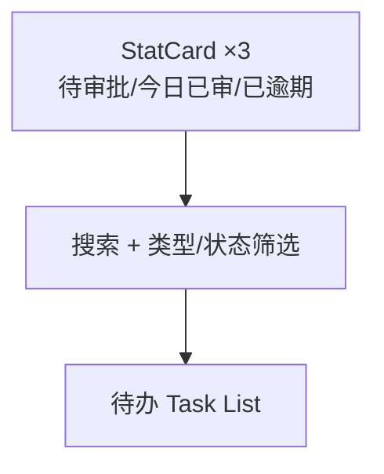

##### 统计卡片

`GET /api/v1/approvals/tasks/stats` → 待审批（蓝）、今日已审批（绿）、已逾期（红）。

##### 待办列表字段（§8.2.1）

| 列 | 说明 |
|---|------|
| 发起人 | 头像 + 姓名 + 部门 |
| 申请类型 | ProcessTypeTag |
| 申请时间 | createdAt |
| 截止时间 | slaDeadline，逾期红色 |
| 当前节点 | 如「部门负责人审批」 |
| 操作 | 查看详情、通过、拒绝 |

Tab：**待办 / 已办**。筛选：`Select` 全部类型、`Select` 全部状态（含「已逾期」）、`Input.Search` 申请人/单号。

列表行快捷操作：`通过` 弹确认；`拒绝` 弹 Modal 必填意见。

##### 审批详情页（§8.2.2）

**路由** `/admin/approval/workbench/:taskId`

布局（§8.4 详情原型）：

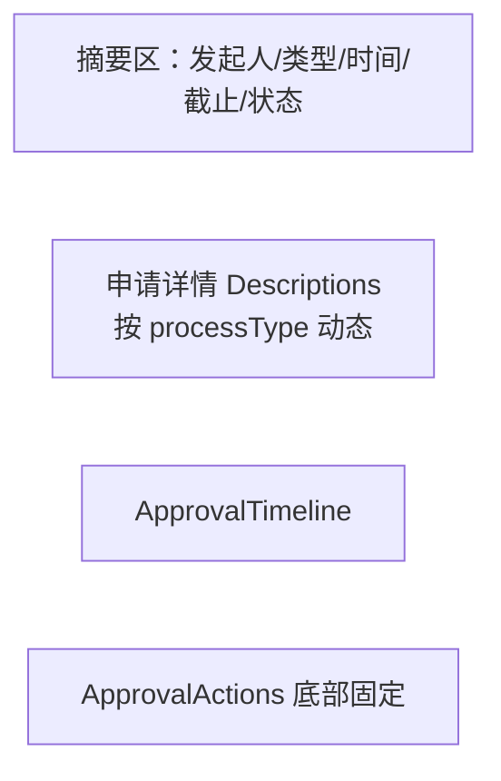

**摘要区**：单号 `APR-2024-001`、发起人张晓雯（人力资源部）、类型入职审批、申请时间、截止时间、待审批 Badge。

**申请详情**：`ApprovalDetailRenderer` 根据 `processType` 切换子组件：

```typescript
const DETAIL_RENDERERS: Record<ProcessType, React.FC<{ data: unknown }>> = {
  ONBOARDING: OnboardingDetailPanel,
  REGULARIZATION: RegularizationDetailPanel,
  TRANSFER: TransferDetailPanel,
  RESIGNATION_REQUEST: ResignationRequestDetailPanel,
  RESIGNATION: ResignationDetailPanel,
  MOBILE_CHANGE: MobileChangeDetailPanel,
  LEAVE: LeaveDetailPanel,
  MAKEUP: MakeupDetailPanel,
  PAYROLL_BATCH: PayrollBatchSummaryPanel,
};
```

**审批流程 Timeline**：节点、审批人、状态（等待审批/已通过）、意见；代审节点展示「孙强 代 李明 审批」。

**操作区**：审批意见 `TextArea` + 通过 / 拒绝 / 转交（`UserSelect`）。

#### A.3.8.3 委托审批（§8.3）

**页面** `/admin/approval/delegate`

##### 规则说明 Alert（§8.4 原型）

四条规则静态展示：委托期内任务自动转交、记录代审、可随时取消、同时仅一条有效委托。

##### 新增委托 Form

| 字段 | 组件 |
|-----|------|
| 被委托人 | `UserSelect` |
| 开始/结束日期 | `DatePicker.RangePicker` |
| 委托原因 | `TextArea` 可选 |

提交 `POST /api/v1/approvals/delegations`；若已有有效委托，后端 `30004` 提示先取消。

##### 当前有效委托列表

Card 展示：被委托人、生效中 Tag、日期范围、原因、「取消委托」链接 → `DELETE /api/v1/approvals/delegations/{id}`。

---

### A.3.9 个人中心模块

**对应 PRD**：§9.1–9.5

员工角色（`EMPLOYEE`）主入口：独立 `PortalLayout`（左侧子菜单 + 右侧内容，对齐 PRD §9 原型）。**页面路径统一 `/portal/*`**，接口见 §2.2.13 映射表。

#### A.3.9.0 路由与布局

```typescript
{
  path: '/portal',
  layout: 'PortalLayout',
  routes: [
    { path: '/portal', redirect: '/portal/profile' },
    { path: '/portal/profile', component: './Portal/Profile', name: '我的档案' },
    { path: '/portal/attendance', component: './Portal/Attendance', name: '我的考勤' },
    { path: '/portal/leave', component: './Portal/Leave', name: '我的请假' },
    { path: '/portal/overtime', component: './Portal/Overtime', name: '我的加班' },
    { path: '/portal/resignation/apply', component: './Portal/Resignation', name: '离职申请' },
    { path: '/portal/salary', component: './Portal/Salary', name: '我的薪资' },
    { path: '/portal/security', component: './Portal/Security', name: '账号安全' },
  ],
},
```

**PortalSider**：头像、姓名、工号；菜单与 §2.3.2 一致。

#### A.3.9.1 我的档案（§9.1）

**页面** `/portal/profile`

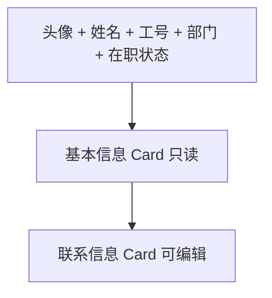

**基本信息**（只读）：工号、部门、职位、入职日期。

**联系信息**（可编辑）：邮箱、现居住地、紧急联系人、紧急联系电话。右上角「编辑」→ Inline Form 或 Modal，提交 `PUT /api/v1/profile/me`。

**手机号**（PRD §4.1.2）：只读展示（脱敏），旁侧「申请变更」→ Modal 填写新手机号 + 原因 + 短信验证 → `POST /api/v1/profile/mobile-change-applications`，审批通过后生效。

工作信息、薪资字段 `disabled`，Tooltip 引导联系 HR 或走流程（调岗等）。

复用 `FieldGuard` + `employee` 详情组件，强制 `recordOwnerId === currentUserId`。

#### A.3.9.2 我的考勤（§9.2）

**页面** `/portal/attendance`

| 区域 | 组件 | 说明 |
|-----|------|------|
| 打卡区 | `PunchButton` | 复用 §6.2，网页打卡开启时显示 |
| 考勤日历 | `Calendar` + `AttendanceStatusTag` | `GET /api/v1/profile/attendance/calendar` |
| 快捷入口 | `Button` | 「申请请假」→ `/portal/leave` 并打开 Drawer；「申请补卡」→ Modal |

日历 Cell 按 `dayStatus` 着色（正常/请假/迟到/缺卡），Tooltip 展示上下班时间。

#### A.3.9.3 我的请假（§9.3）

**页面** `/portal/leave`（对齐 PRD 请假原型）

**布局**：

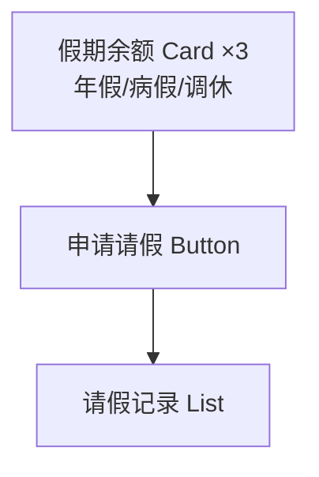

**余额 Card**：已用/总量 + `Progress`（如年假 已用5/共15）。

**记录 List**：类型 Tag、日期范围、天数、事由、审批人、状态（已批准/审批中）。审批中显示「查看进度」「取消申请」；已通过仅「查看进度」。

- 查看进度：`Modal` + `ApprovalTimeline`
- 取消：`POST /api/v1/profile/leave/applications/{id}/cancel`

#### A.3.9.4 我的薪资（§9.4）

**页面** `/portal/salary`

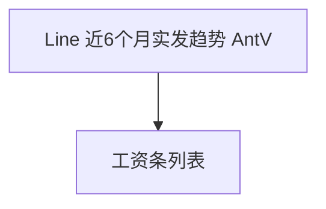

**趋势图**（§9.4）：`GET /api/v1/profile/payslips/trend`，`Line` 展示 `netSalary`，X 轴月份。

**工资条列表**：每月一行 — 标题「2026年06月工资条」、简述「基本工资+绩效奖金」、实发金额（蓝色高亮）、「查看详情」。

**查看详情**：先弹二次验证 Modal（密码/短信）→ `POST /api/v1/profile/payslips/verify` → 打开 `PayslipModal`（复用 §7.4）。

#### A.3.9.5 账号安全（§9.5）

**页面** `/portal/security`

##### 修改密码

`Form`：旧密码、新密码、确认密码 → `PUT /api/v1/profile/security/password`。成功后提示重新登录或刷新 Token。

##### 绑定/解绑手机（PRD §9.5）

首次绑定：`mobile` + 短信验证码 → `POST /api/v1/profile/security/mobile/bind`。

解绑：短信验证 → `DELETE /api/v1/profile/security/mobile`。**变更手机号**不在此操作，走档案页「申请变更」（§A.3.9.1）。

##### 登录日志

`Table`：`loginTime`、`ip`、`device`、`location`、`success`（成功/失败 Tag）。`GET /api/v1/profile/security/login-logs` 分页（仅本人记录）。

#### A.3.9.6 离职申请（PRD §5.4.1）

**页面** `/portal/resignation/apply`

| 区域 | 组件 | 说明 |
|-----|------|------|
| 说明 Alert | `Alert` | 离职须先申请，HR 审批通过后再办理正式离职 |
| 申请表单 | `ProForm` | 期望离职日期、原因分类、离职类型、详细说明 |
| 申请记录 | `List` + `ApprovalTimeline` | `GET /api/v1/profile/resignation-requests` |

提交 `POST /api/v1/profile/resignation-requests`；审批中显示「撤销申请」。状态为「已批准」时提示「请联系 HR 办理正式离职手续」。

---

## A.4 前端状态管理设计

### A.4.1 Zustand Store 结构

```typescript
// stores/useUserStore.ts
interface UserState {
  currentUser: CurrentUser | null;
  token: string | null;
  setUser: (user: CurrentUser) => void;
  logout: () => void;
}

// stores/usePermissionStore.ts
interface PermissionState {
  permissions: string[];
  fieldPermissions: Record<string, FieldPermission>;
  dataScope: 'ALL' | 'DEPT_TREE' | 'SELF' | 'PAYROLL' | 'NONE_PAYROLL';
  hydrate: (payload: PermissionPayload) => void;
}

// stores/useOrgTreeStore.ts
interface OrgTreeState {
  tree: DeptTreeNode[];
  flatMap: Map<string, DeptTreeNode>;
  loading: boolean;
  fetchTree: (force?: boolean) => Promise<void>;
  invalidate: () => void;
}
```

### A.4.2 与 Umi InitialState 集成

```typescript
// app.tsx
export async function getInitialState() {
  const token = getToken();
  if (!token) return { currentUser: undefined };
  const currentUser = await authService.getCurrentUser();
  usePermissionStore.getState().hydrate(currentUser);
  return { currentUser };
}
```

### A.4.3 请求层封装

```typescript
// app.tsx request 配置
export const request: RequestConfig = {
  timeout: 30000,
  errorConfig: {
    errorHandler(error) {
      if (error.response?.status === 401) logout();
      if (error.response?.status === 403) message.error('无操作权限');
    },
  },
  requestInterceptors: [
    (url, options) => ({
      url,
      options: {
        ...options,
        headers: { ...options.headers, Authorization: `Bearer ${getToken()}` },
      },
    }),
  ],
};
```

---

## A.5 接口对接规范

### A.5.1 前端关注的 API 契约

统一响应：

```typescript
interface ApiResponse<T> {
  code: number;       // 0 = 成功；业务码见 HRMS-API-Contract §6 / §A.5.3
  message: string;
  data: T;
  fieldPermissions?: Record<string, FieldPermission>; // 员工详情接口
  traceId?: string;
  timestamp: number;
}
```

### A.5.2 本期关键接口清单

完整 API 见 **[HRMS-API-Contract.md §5](HRMS-API-Contract.md#5-api-总表)**。前端开发重点关注：

| 模块 | 方法 | 路径（相对 `/api/v1`） | 说明 |
|-----|------|----------------------|------|
| 认证 | POST | `/auth/login` `/auth/logout` `/auth/refresh` | 登录会话 |
| 认证 | GET | `/auth/profile` | 用户+权限 |
| 认证 | PUT | `/auth/password` | 登录页/首次改密（门户改密见 `/profile/security/password`） |
| 认证 | POST | `/profile/payslips/verify` | 工资条二次验证（规范路径，契约 §5.12.1） |
| 系统 | GET/POST/PUT | `/system/users` `/system/roles/*` | 用户角色（SYS_ADMIN） |
| 组织 | GET/CRUD | `/departments/*` `/positions` | 部门树、职位 |
| 员工 | GET/PUT | `/employees` `/employees/{id}` | 花名册、档案 |
| 员工 | GET/PUT | `/employees/{id}/salary` | 薪资档案 |
| 员工 | GET | `/employees/{id}/sensitive/{field}` | 敏感字段 |
| 员工 | GET | `/employees/mobile-change-applications` | HR 手机号变更待办 |
| 入职 | CRUD+动作 | `/onboarding/applications` 及 `submit/withdraw/confirm/abandon` | 入职流程 |
| 生命周期 | GET/POST | `/regularization/applications/*` `/transfers` `/resignations` | 转正/调岗/离职 |
| 生命周期 | GET/POST | `/resignation-requests` `/profile/resignation-requests` | HR 列表 / 员工申请 |
| 审批 | GET | `/approvals/tasks/stats` | 工作台统计 |
| 审批 | GET/POST | `/approvals/tasks` `/approvals/tasks/{id}` `/approvals/tasks/{id}/action` | 待办与操作 |
| 审批 | POST | `/approvals/instances/{id}/withdraw` | 撤回实例 |
| 审批 | CRUD | `/approvals/delegations` | 委托 |
| 考勤 | * | `/attendance/*` | 打卡、补卡、组、统计 |
| 请假 | * | `/leaves/balances` `/leaves/applications` `/leaves/calc-days` | 余额、申请、天数预览 |
| 加班 | * | `/overtime/applications` | 加班申请 |
| 薪资 | * | `/payroll/schemes` `/payroll/batches` `/payroll/payslips` `/payroll/cost-report` | 账套、核算、工资条 |
| 工作台 | GET | `/workbench/summary` | 仪表盘 |
| 迁移/系统 | * | `/imports/*` `/system/operation-logs` `/system/login-logs` `/system/backup` | 导入与审计 |
| 个人中心 | * | `/profile/me` `/profile/attendance/*` `/profile/leave/*` `/profile/payslips/*` `/profile/security/*` `/profile/mobile-change-applications` `/profile/resignation-requests` | 契约 §5.12 |

### A.5.3 错误码处理

> **权威来源**：[HRMS-API-Contract.md §6](HRMS-API-Contract.md#6-业务错误码)。HTTP 401/403 对应 `20001`/`20002`。

| code | 前端行为 |
|------|---------|
| 0 | 正常处理 |
| 10001 | 参数校验失败，展示 `message` |
| 20001 | 未登录/Token 过期 → 跳转登录 |
| 20002 | 无权限 → 提示 |
| 20003 | 字段权限不足 |
| 30001 | 部门层级超过 5 层 |
| 30002 | 部门尚有员工，引导迁移 |
| 30003 | 员工状态不允许此操作 |
| 40001 | 考勤月已锁定 |
| 40002 | 补卡次数用完（2 次/月） |
| 40003 | 请假余额不足 |
| 40004 | 不在打卡有效范围（GPS/IP） |
| 50001 | 算薪批次已存在 |
| 50002 | 算薪进行中，勿重复 |
| 50003 | 员工无薪资档案 |
| 50004 | 考勤未锁定，不可算薪 |
| 50005 | 工资条尚未发放或不可查看 |
| 60001 | 审批已处理（幂等提示） |
| 60002 | 审批状态不允许撤销/超时 |
| 60003 | 委托冲突（同时仅 1 条） |
| 60004 | 工资条二次验证未通过或已过期 |
| 90001 | 系统错误，展示 traceId |

---

## A.6 非功能需求实现方案

**对应 PRD**：§11

### A.6.0 PRD 指标对照

| PRD §11.1 指标 | 目标 | 落点 |
|---------------|------|------|
| 页面加载时间 | < 2s | §6.1 首屏 FCP、Lighthouse CI |
| 员工列表（1000 人） | < 1s | 分页 + 后端索引，翻页感知 < 500ms |
| 薪资核算 500 人 | < 30s | 后端异步，前端 Progress 轮询 |
| 并发 200 用户 | 支撑 | CDN 静态资源 + API 无状态 |

### A.6.1 性能优化

| 场景 | 方案 |
|-----|------|
| 首屏加载 | 路由级 `dynamic import`；`mfsu` 开启；gzip/br |
| 大列表 | 分页；虚拟滚动（>500 行时） |
| 部门树 | 懒加载 + Store 缓存 |
| 图表 | 按需 import `@ant-design/plots`；`resize` 防抖 |
| 图片/头像 | CDN + 懒加载 |

**目标**：首屏 FCP **< 2s**（PRD §11.1）；列表首屏 **< 1s**（依赖后端）。

### A.6.2 安全设计

**对应 PRD**：§11.2

| 风险/要求 | 防护 |
|----------|------|
| HTTPS | 生产环境强制 HTTPS 访问 API |
| 密码强度 | 改密/注册表单校验 ≥8 位含大小写+数字 |
| 90 天改密 | 登录后检测 `mustChangePassword`，跳转改密页 |
| 敏感数据 | 脱敏展示；禁止存 localStorage |
| 薪资查看审计 | 触发 `reveal-field` / 工资条 verify 时后端记日志 |
| 权限绕过 | 依赖后端 403，前端不做安全假设 |
| 自动登出 | **30min** 无操作登出；`visibilitychange` + idle timer |
| XSS/CSRF | React 转义；`SameSite=Strict`；关键操作二次验证 |

### A.6.3 可靠性

- 表单自动草稿（入职流程待补充）
- 请求失败 `retry: 2`（幂等 GET）
- 离线提示：`navigator.onLine` 监听

### A.6.4 可监控性

```typescript
// 关键埋点
trackEvent('employee_list_search', { filters });
trackEvent('sensitive_field_reveal', { field, employeeId });
trackError(error, { page: location.pathname });
```

接入 Sentry 或自建前端监控（见后端日志关联 `traceId`）。

### A.6.5 浏览器兼容（PRD §11.3）

| 浏览器 | 最低版本 |
|--------|---------|
| Chrome | 90+ |
| Firefox | 88+ |
| Edge | 90+ |
| Safari | 14+ |

**分辨率**：最小 **1366×768**，布局使用 Ant Design Grid 响应式；小屏隐藏 Sider 为抽屉。

**验证**：Playwright 矩阵 CI 抽检 Chrome + Edge；CSS 避免实验性特性。

---

## A.7 部署与工程化

### A.7.1 环境配置

```bash
# .env.production
UMI_APP_API_BASE=https://hrms-api.example.com
UMI_APP_SENTRY_DSN=...
```

### A.7.2 CI/CD

```yaml
# 流水线阶段
lint (eslint + tsc) → test (jest) → build → upload dist → deploy
```

### A.7.3 代码规范

- ESLint + Prettier + Stylelint
- Husky `pre-commit`: `lint-staged`
- 组件： PascalCase；hooks：`use` 前缀

---

## A.8 测试策略

### A.8.1 单元测试

- `FieldGuard`、`maskIdNumber` 等工具函数：100% 覆盖
- 权限判断逻辑：`access.ts` 纯函数测试

### A.8.2 组件测试

- `@testing-library/react` 测试表单校验、部门树深度限制
- Mock `services` 层，不依赖真实 API

### A.8.3 E2E 重点场景

| 场景 | 工具 |
|-----|------|
| HR 登录 → 员工列表搜索 | Playwright |
| 部门主管看不到身份证号 | Playwright |
| 普通员工仅看自己薪资 Tab | Playwright |
| 入职：草稿→提交→审批→确认入职 | Playwright |
| 调岗：三级审批全流程 | Playwright |
| 离职：员工申请→HR正式离职→待离职 | Playwright |
| 手机号：申请变更→HR审批→登录账号更新 | Playwright |
| 打卡：上班迟到判定展示 | Playwright |
| 补卡：第3次申请被拒绝 | Playwright |
| 请假：余额不足提交失败 | Playwright |
| 薪资：新建批次→计算→预览异常标记 | Playwright |
| 工资条：未审批不可见、二次验证后可见 | Playwright |
| 审批中心：待办筛选、详情、通过/拒绝 | Playwright |
| 委托审批：新增、代审展示、取消 | Playwright |
| 个人中心：档案编辑、请假撤销 | Playwright |
| 个人中心：手机号变更申请、离职申请 | Playwright |
| 个人中心：工资条趋势与二次验证 | Playwright |

### A.8.4 性能测试

- Lighthouse CI 接入流水线，Performance Score ≥ 80，**FCP < 2s**（PRD §11.1）

---

## A.9 附录

### A.9.1 术语表

| 术语 | 说明 |
|-----|------|
| access | Umi 权限插件，控制路由/组件可见性 |
| FieldGuard | 字段级权限包装组件 |
| fieldSchema | 员工字段元数据配置 |
| ProTable | Ant Design Pro 高级表格（或自封装） |
| ApprovalActions | 审批操作按钮组（通过/拒绝/转交/撤回） |
| ProcessStatusTag | 流程状态 Tag 组件 |
| AttendanceStatusTag | 打卡/日考勤状态 Tag |
| LeaveBalanceGauge | 假期余额环形进度 |
| PayslipModal | 工资条弹窗（收入/扣除/实发） |
| PayrollAnomalyTag | 核算异常标记 Tag |
| ApprovalDetailRenderer | 按 processType 渲染申请详情 |
| ProcessTypeTag | 审批类型 Tag |
| ProfileLayout | 个人中心左侧菜单布局 |

### A.9.2 枚举常量（与契约 §7 对齐）

> **约定**：`services/` 与 `typings/` 中**请求/响应字段必须使用 API 列（小写 snake_case）**；UI 展示通过 `constants/statusMaps.ts` 映射中文。DB 大写仅供后端，前端禁止在 JSON 中使用。

```typescript
/** 在职状态 — 契约 §7.1 */
export type EmploymentStatus =
  | 'probation' | 'regular' | 'pending_resign' | 'resigned';

/** 入职状态 — 契约 §7.2 */
export type OnboardingStatus =
  | 'draft' | 'pending' | 'approved_pending' | 'rejected' | 'onboarded' | 'abandoned';

/** 录用类型 — 契约 §7.4 */
export type EmploymentType = 'fulltime' | 'parttime' | 'intern';

/** 审批 processType — 契约 §7.8（大写） */
export type ProcessType =
  | 'ONBOARDING' | 'REGULARIZATION' | 'TRANSFER' | 'RESIGNATION'
  | 'RESIGNATION_REQUEST' | 'MOBILE_CHANGE' | 'LEAVE' | 'MAKEUP'
  | 'OVERTIME' | 'PAYROLL_BATCH';

/** 审批任务 status — 契约 §7（pending/approved/rejected/cancelled） */
export type ApprovalStatus = 'pending' | 'approved' | 'rejected' | 'cancelled';

/** 请假类型 — 契约 §7.3 */
export type LeaveType =
  | 'annual' | 'sick' | 'personal' | 'marriage'
  | 'maternity' | 'bereavement' | 'compensatory';

/** 班制 — 契约 §7.7 */
export type ShiftType = 'fixed' | 'flexible' | 'schedule';

/** 薪资批次 — 契约 §7.5 */
export type PayrollBatchStatus =
  | 'draft' | 'calculating' | 'pending_confirm' | 'approving'
  | 'approved' | 'distributed' | 'rejected';

/** 工资项目类型 — 契约 §7.6 */
export type SalaryItemType =
  | 'fixed' | 'variable' | 'attendance_deduct' | 'social' | 'fund' | 'tax';

/** 打卡/日历状态（API snake_case） */
export type PunchStatus =
  | 'normal' | 'late' | 'early_leave' | 'absent' | 'missing_in' | 'missing_out';

export enum ResignationType {
  RESIGNATION = 'resignation',
  DISMISSAL = 'dismissal',
  CONTRACT_EXPIRY = 'contract_expiry',
  OTHER = 'other',
}

/** 性别 — 契约 §7（API snake_case） */
export const GENDER_OPTIONS = [
  { label: '男', value: 'male' },
  { label: '女', value: 'female' },
] as const;

/** 录用类型选项 — 契约 §7.4 */
export const EMPLOYMENT_TYPES = [
  { label: '全职', value: 'fulltime' },
  { label: '兼职', value: 'parttime' },
  { label: '实习', value: 'intern' },
] as const;

export enum PayrollAnomaly {
  LEAVE_HIGH = 'LEAVE_HIGH',
  OVERTIME_HIGH = 'OVERTIME_HIGH',
  SALARY_CHANGE_HIGH = 'SALARY_CHANGE_HIGH',
  NO_SALARY_PROFILE = 'NO_SALARY_PROFILE',
}

export enum PositionSequence {
  M = 'M',
  P = 'P',
  S = 'S',
}
```

### A.9.4 状态颜色标识规范（PRD §12.1）

全局统一 `constants/statusColors.ts`，各 `*StatusTag` 组件引用，与 Ant Design `Tag` color 对齐：

```typescript
export const STATUS_COLOR_MAP = {
  draft: 'default',           // 草稿/待处理
  processing: 'processing', // 审批中/计算中
  warning: 'warning',       // 进行中黄态、异常提醒
  success: 'success',       // 已通过/已入职/已发放
  error: 'error',           // 已拒绝/失败
  disabled: 'default',      // 已离职/已放弃/归档（opacity 0.45）
} as const;
```

| 状态类型 | Token | 使用场景 |
|---------|-------|---------|
| 草稿/待处理 | `default` | draft、待发起 |
| 进行中/审批中 | `processing` / `warning` | pending、calculating |
| 成功/已批准 | `success` | approved、onboarded、distributed |
| 警告/异常 | `warning` | 核算异常、即将到期 |
| 拒绝/失败 | `error` | REJECTED、FAILED |
| 结束/归档 | `default`+disabled | RESIGNED、ABANDONED |

`ProcessStatusTag`、`AttendanceStatusTag`、`PayrollAnomalyTag` 均映射此表。

### A.9.5 与 PRD 文档关系（PRD §12.2）

| 文档 | 路径 | 职责 |
|-----|------|------|
| **PRD** | [`人资管理系统-PRD.md`](../人资管理系统-PRD.md) | 业务规则、流程、原型截图 |
| **本文档** | `HRMS-Frontend-System-Design(1).md` | 页面、组件、路由、交互 |
| **API 契约** | `HRMS-API-Contract.md` v1.0.0 | API、枚举、错误码（权威） |
| **后端系分** | `HRMS-Backend-System-Design(2).md` v1.7.3 | 表结构、状态机 |

PRD 为产品视角规格；本文档为技术系分，对应 PRD §12.2 交付物。UI 原型以 PRD 各章「原型图」为准。

### A.9.6 与 PRD 一致的关键规则

| 规则 | 实现 | PRD |
|-----|------|-----|
| 系统管理员无薪资菜单 | `canManagePayroll` 仅 HR/财务 | §2.2 |
| 手机号不可直接改 | 档案页「申请变更」→ 审批 | §4.1.2 |
| 离职须员工先申请 | `/portal/resignation/apply` → HR 正式离职 | §5.4.1 |

### A.9.7 待解决问题列表（暂不处理）

微项目首期以下项**不纳入实现**：

| # | 问题 | PRD 章节 |
|---|------|---------|
| 1 | 员工导出 Excel 异步任务 UI | §4.2 |
| 2 | 暗色主题 | — |
| 3 | 排班制 UI 与交互 | §6.1.1 |
| 4 | GPS 打卡前端授权与降级 | §6.2.1 |
| 5 | 老板审批节点 UI 开关 | §7.3、§8.1 |
| 6 | 工资条 PDF 模板样式 | §7.4 |

### A.9.8 参考资料

- [Umi Max 文档](https://umijs.org/docs/max/introduce)
- [Ant Design 5](https://ant.design/components/overview-cn/)
- [@ant-design/plots](https://plots.ant.design/)
- [Zustand](https://zustand-demo.pmnd.rs/)

---

*文档结束 — v1.8.3 与 HRMS-API-Contract v1.0.0 及后端 v1.7.3 零偏差；契约索引见附录 E。*
