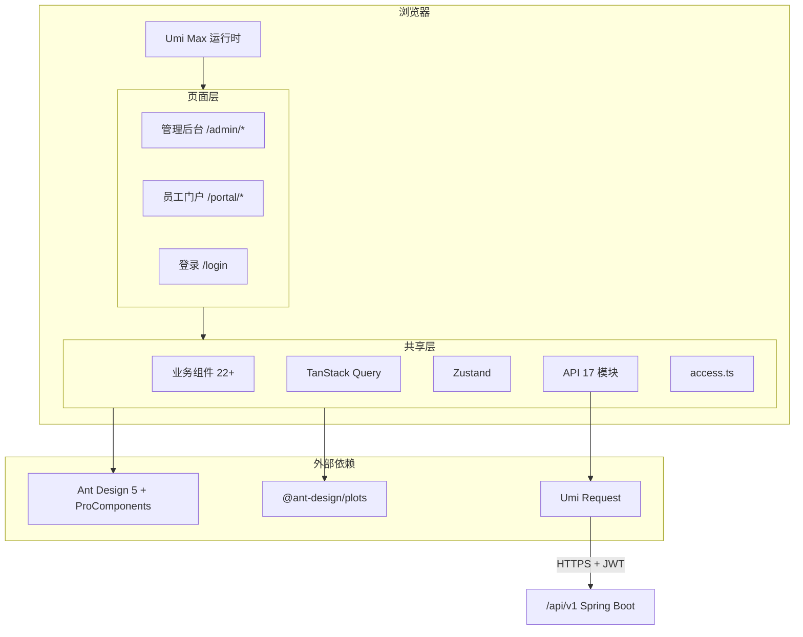

# HRMS 前端系统分析文档

> **文档版本**：v2.0.0（统一契约锚点 v1.0.0；Part I/II 与后端系分 §2.2 / 契约 §5~§11 零偏差）
> **PRD 来源**：[人资管理系统-PRD.md](../人资管理系统-PRD.md)（2026-07-07）
> **目标读者**：前端开发、测试、架构评审、PD
> **技术栈**：React 18 + TypeScript + Umi Max + Ant Design 5 + AntV + Zustand
> **代码骨架**：`frontend/`（见 [frontend/README.md](frontend/README.md)）
> **后端系分**：[HRMS-Backend-System-Design.md](HRMS-Backend-System-Design.md) v2.0.0
> **开发计划**：[HRMini-Development-Plan.md](HRMini-Development-Plan.md)
> **契约锚点**：[HRMS-API-Contract.md](HRMS-API-Contract.md) v1.0.0 — **API/枚举/错误码唯一权威**

**文档结构**：**Part I（§1–§5 + 附录 A~E）** 按公司前端系分模板格式；**Part II（§A.1 起）** 为技术实现详设。本文档为项目**唯一**前端系统分析交付物。

**对齐说明（v2.0.0）**：本文 Part I §2.2 与后端系分 §2.2 的模块划分、接口路径、业务枚举**零偏差**；API/枚举/错误码以《HRMS-API-Contract.md》v1.0.0 为唯一权威。后端系分附录 H（API 总表）、附录 I（枚举）、附录 K（错误码）为本文同步参考源。

---

# Part I · 公司标准系分章节

# 1. 需求背景

公司人力资源管理依赖 Excel 和纸质流程，存在数据分散、算薪效率低、审批不透明等问题。本系统建立统一员工数字化档案，实现入转调离全流程线上化，覆盖组织管理、员工档案、考勤请假、薪资核算、审批中心及个人中心。

目标用户：HR 专员（HR_STAFF）、部门主管（DEPT_MANAGER）、财务专员（FINANCE）、系统管理员（SYS_ADMIN）、普通员工（EMPLOYEE）。

## 1.1 项目成员

| **角色** | **成员** | **备注** |
| --- | --- | --- |
| 业务方 | | |
| 产品经理（PD） | | |
| 后端技术 | | |
| UED（设计师） | | |
| 前端 | | |
| 质量 | | |

## 1.2 项目文档

| 文档 | 链接 | 必填 |
| --- | --- | --- |
| PRD | [人资管理系统-PRD.md](../人资管理系统-PRD.md) v1.0 | ✅ |
| **API 契约（锚点）** | [HRMS-API-Contract.md](HRMS-API-Contract.md) v1.0.0 | ✅ |
| UED（原型图） | PRD 内嵌原型图（§1.4、§3–§9 各章） | 选填 |
| 后端系分 | [HRMS-Backend-System-Design.md](HRMS-Backend-System-Design.md) v2.0.0 | ✅ |
| 前端公共组件系分 | 本文 §2.2.14、Part II §A.3 | 选填 |
| 开发计划 | [HRMini-Development-Plan.md](HRMini-Development-Plan.md) | ✅ |
| OpenAPI 契约 | `hrms-server/openapi.yaml`（Sprint 0 输出） | ✅ |
| 迭代地址（Gitee） | https://gitee.com/swing-king/hrmini | ✅ |
| 开发环境地址 | 前端 `http://localhost:8000` · 后端 `http://localhost:8080/api/v1` | ✅ |
| 测试环境地址 | 微项目首期与开发环境共用 | 选填 |

---

# 2. 详细设计

## 2.1 前端迭代目标

本次迭代交付 HRMS V1.0 全量前端，主要包括：

1. **工程基建**：Umi Max 脚手架、双布局（管理后台 + 员工门户）、RBAC 权限引擎、统一请求层、Apifox Mock 联调
2. **组织与档案**：部门树（≤5 层）、职位管理（M/P/S 序列）、员工花名册（高级搜索）、详情/编辑、数据迁移向导
3. **入转调离**：入职申请（draft→pending→approved_pending→onboarded 状态机）、转正/调岗/离职管理、员工端离职申请
4. **考勤请假加班**：考勤组配置、打卡/补卡（≤2次/月）、月汇总/锁定、统计图表、请假/加班申请
5. **薪资管理**：账套 SpEL 配置、月度核算工作台（批次状态机 + 异常检测）、成本报表、工资条（二次验证）
6. **审批中心**：10 类 processType 审批聚合待办、动态详情渲染、委托审批、催办/逾期
7. **个人中心**：我的档案/考勤/请假/加班/薪资/账号安全/离职申请（7 子模块）

### 2.1.2 技术栈约束

| 类别 | 技术 | 约束级别 |
| --- | --- | --- |
| 核心框架 | [React](https://zh-hans.react.dev/learn) | **硬性，禁止 Vue** |
| 应用框架 | [Umi Max](https://umijs.org/) | **硬性** |
| 语言 | TypeScript | **硬性** |
| UI | [Ant Design](https://ant.design/index-cn/) + ProComponents | **硬性** |
| 图表 | [@ant-design/charts](https://ant-design-charts.antgroup.com/) | **硬性**；ECharts 仅考勤日历热力图备选 |
| 请求 | [Umi request](https://umijs.org/docs/max/request#request) 主 / Axios 备 | 推荐 |
| 服务端状态 | [TanStack Query](https://tanstack.com.cn/query/latest) | 推荐 |
| 全局状态 | [Zustand](https://zustand.nodejs.cn/docs/getting-started/introduction) | 推荐 |
| 样式 | Less | 推荐 |
| 工具 | dayjs、lodash | 推荐；新代码不用 moment |
| 路由 | Umi 内置 React Router | 不单独安装 react-router-dom |

### 2.1.3 工程结构

```
frontend/src/
├── access.ts              # RBAC 权限码定义
├── app.tsx                # 全局 Provider、request 配置
├── global.less
├── constants/             # 枚举、状态色 token、字段 schema
│   ├── enums.ts           # 与后端契约 §7 对齐
│   ├── statusColors.ts    # PRD §12.1 状态颜色 token
│   ├── fieldSchemas/      # 各模块字段 schema
│   └── workflowSchemas/   # 流程表单 schema
├── services/              # API 封装（17 个模块文件，与后端一一对应）
│   ├── auth.ts            # /auth/*
│   ├── department.ts      # /departments/*
│   ├── position.ts        # /positions
│   ├── employee.ts        # /employees/*
│   ├── onboarding.ts      # /onboarding/applications/*
│   ├── regularization.ts  # /regularization/applications/*
│   ├── transfer.ts        # /transfers/*
│   ├── resignation.ts     # /resignations/* /resignation-requests
│   ├── attendance.ts      # /attendance/*
│   ├── leave.ts           # /leaves/* /profile/leave/*
│   ├── overtime.ts        # /overtime/applications
│   ├── payroll.ts         # /payroll/*
│   ├── approval.ts        # /approvals/tasks/* /approvals/instances/*
│   ├── delegation.ts      # /approvals/delegations
│   ├── imports.ts         # /imports/*
│   ├── system.ts          # /system/*
│   ├── profile.ts         # /profile/*
│   └── workbench.ts       # /workbench/summary
├── hooks/                 # TanStack Query hooks
├── stores/                # Zustand（useUserStore, useOrgTreeStore 等）
├── components/
│   ├── business/          # 业务通用组件（22+ 个，见 §2.2.14）
│   └── charts/            # AntV 图表封装
├── layouts/
│   ├── AdminLayout.tsx    # /admin/* 管理后台
│   └── PortalLayout.tsx   # /portal/* 员工门户
├── pages/
│   ├── login/             # 登录页
│   ├── admin/             # 管理后台各模块
│   └── portal/            # 员工门户
└── typings/               # TypeScript 类型定义
```

### 2.1.4 双端布局

| 布局 | 路径前缀 | 用户 | 登录后默认跳转 |
| --- | --- | --- | --- |
| AdminLayout | `/admin/*` | SYS_ADMIN / HR_STAFF / DEPT_MANAGER / FINANCE | `/admin/workbench` |
| PortalLayout | `/portal/*` | EMPLOYEE | `/portal/profile` |
| 无布局 | `/login` | 全部 | 按角色跳转 |

---

## 2.2 迭代具体描述

> 接口 Base URL：`/api/v1`；鉴权：`Authorization: Bearer ${token}`；响应：`{ code, message, data, traceId, timestamp }`
> 管理端页面路由：`/admin/*`；员工门户：`/portal/*`；API 路径与页面分离，员工自助统一 `/profile/*`
> 枚举 API 值使用 JSON **小写 snake_case**（如 `leave_type: annual`）；`processType` 使用**大写**（与审批引擎一致）

### 2.2.1 登录页

##### UI&交互

- 路径：`/login`，无 Layout
- 手机号 + 密码登录；首次登录强制改密弹窗（`mustChangePassword=true` 时弹出，禁用跳过）
- 登录失败 5 次锁定 15min（后端控制，前端展示 message）
- JWT Access Token 30min 过期；无操作 30min 自动登出（前端定时检测每 5min + 后端刷新 token 校验时间戳）
- 密码规则：8 位以上，需包含大小写字母+数字；90 天强制更换（`passwordExpiredAt` 提前 7 天提示）

##### 前端逻辑

```
login流程：
  POST /auth/login { username, password }
    → 成功：{ accessToken, refreshToken, expiresIn, mustChangePassword }
    → Token 存 localStorage
    → GET /auth/profile → useUserStore 缓存
    → mustChangePassword=true → 弹改密弹窗
    → 按角色跳转：EMPLOYEE → /portal/profile；其他 → /admin/workbench
    → 失败 5 次：展示「账号已锁定，15 分钟后重试」
```

- 401 全局拦截：尝试 POST `/auth/refresh`，失败则清空 Token 跳转 `/login`
- 登出调用 `POST /auth/logout`（Redis Token 黑名单）并清除本地 Token

##### 所需 API

| 接口 | 方法 | 路径 |
| --- | --- | --- |
| 登录 | POST | `/auth/login` |
| 用户信息（含 dataScope） | GET | `/auth/profile` |
| 修改密码（首次/登录页） | PUT | `/auth/password` |
| 登出 | POST | `/auth/logout` |
| 刷新 Token | POST | `/auth/refresh` |
| 绑定/解绑手机（别名） | PUT/DELETE | `/auth/mobile` |

---

### 2.2.2 工作台

##### UI&交互

- 路径：`/admin/workbench`
- 各角色 KPI 卡片、快捷入口、访问趋势图、最近操作

##### 前端逻辑

```
WorkbenchPage
├── StatCards（待审批蓝、本月入职绿、待转正橙、考勤异常红）
│   └── 数据源：/workbench/summary + /approvals/tasks/stats（含 overdueCount）
├── QuickLinks（按角色过滤：HR→花名册/入职/迁移；财务→成本报表；SYS_ADMIN 无薪资相关）
├── VisitTrendChart（@ant-design/charts Line）
└── RecentOperations
```

##### 所需 API

| 接口 | 方法 | 路径 |
| --- | --- | --- |
| 仪表盘汇总 | GET | `/workbench/summary` |
| 待办统计（含 `overdueCount`） | GET | `/approvals/tasks/stats` |

---

### 2.2.3 部门管理

##### UI&交互

- 路径：`/admin/org/departments`
- PRD 原型 §3.1：左右分栏（部门树 + 详情/编辑面板）

##### 前端逻辑

**部门树**：Ant Design `Tree`，节点结构 `{ key, title (name + 人数), children, depth, headcountIncludingSub, managerName }`。
- 最大 5 层深度限制：`depth >= 5` 时禁用「新增子部门」按钮
- 人数：`headcountIncludingSub`（含下级在职人数，仅试用期+正式）
- 缓存策略：`useOrgTreeStore` Zustand 缓存全量树，变更后 `invalidate`

###### 表单字段（新增/编辑）

| 字段名称 | 说明 | 输入方式 | 是否必填 | 最大长度 | 输入限制 | 字段类型 | 提示文案 | 数据源 |
| --- | --- | --- | --- | --- | --- | --- | --- | --- |
| 部门名称 | dept_name | Input | Y | 100 | — | string | 请输入部门名称 | — |
| 部门编码 | dept_code | Input | Y | 8 | 唯一，2-8 位 | string | 如 01 | — |
| 上级部门 | parent_id | TreeSelect | N | — | 层级≤5，深度校验 | number | 空=根部门 | `/departments/tree` |
| 部门负责人 | head_employee_id | EmployeeSearchSelect | N | — | 在职员工 | number | 请选择 | — |
| 排序序号 | sort_order | InputNumber | Y | — | ≥0 | number | 越小越靠前 | — |
| 部门描述 | description | TextArea | N | 256 | — | string | — | — |

###### 操作按钮

| 字段名称 | 交互 | 二次确认 | 显示控制 |
| --- | --- | --- | --- |
| 新增根部门 | 右侧展示空表单 | N | canHr |
| 新增子部门 | 选中节点后新增 | N | canHr；`depth < 5` |
| 编辑 | 保存 PUT，刷新树 | N | canHr |
| 删除 | 预检 `GET .../can-delete` → 有员工则弹窗引导合并 | Y「确定删除？部门下有 N 名员工」 | canHr；无员工/子部门 |
| 合并部门 | 弹窗选择目标部门，确认后 `POST .../merge { targetDepartmentId }` | Y | canHr；有员工 |

##### 所需 API

| 接口 | 方法 | 路径 |
| --- | --- | --- |
| 部门树（含人数） | GET | `/departments/tree` |
| 部门 CRUD | CRUD | `/departments` `/departments/{id}` |
| 在职人数（含下级） | GET | `/departments/{id}/headcount` |
| 删除预检 | GET | `/departments/{id}/can-delete` |
| 部门合并 | POST | `/departments/{id}/merge` |

---

### 2.2.4 职位管理

##### UI&交互

- 路径：`/admin/org/positions`
- PRD 原型 §3.2：ProTable 列表 + 编辑弹窗

##### 前端逻辑

**序列联动**：选择「职位序列」时重置「职级范围」选项

```typescript
SEQUENCE_RANK_MAP = {
  M: ['M1','M2','M3','M4','M5'],
  P: ['P1','P2','P3','P4','P5','P6','P7','P8','P9','P10'],
  S: ['S1','S2','S3','S4','S5'],
};
```

###### 表单字段

| 字段名称 | 说明 | 输入方式 | 是否必填 | 字段类型 | 数据源/校验 |
| --- | --- | --- | --- | --- | --- |
| 职位名称 | name | Input | Y | string | max 64 |
| 职位序列 | sequence_code | Select | Y | string | M/P/S |
| 所属部门 | department_id | TreeSelect | N | number | 空=全公司通用 |
| 职级范围 | grade_min / grade_max | Select × 2 | Y | string | 随序列联动 |
| 默认试用期（月） | default_probation_months | InputNumber | Y | number | 1–6，默认 3 |
| 是否标准职位 | is_standard | Switch | Y | boolean | false→入职触发 HR 二审 |
| 职位描述 | description | TextArea | N | string | max 256 |

##### 所需 API

| 接口 | 方法 | 路径 |
| --- | --- | --- |
| 职位 CRUD | CRUD | `/positions` `/positions/{id}` |

---

### 2.2.5 员工花名册

##### UI&交互

- 路径：`/admin/employee/list`
- PRD 原型 §4.2：ProTable 高级搜索 + 定制列

##### 前端逻辑

**查询参数映射**：`keyword`（姓名/工号/手机号模糊）、`departmentIds`、`positionIds`、`employmentStatus`、`gradeLevels`、`hireDateFrom`、`hireDateTo`

**列表列**：姓名、工号、部门、职位、职级、在职状态（StatusTag 绿/蓝/橙/灰）、入职日期、操作（查看/编辑/调岗/离职）

**筛选组件映射**：

| 条件 | 组件 | API 参数 |
| --- | --- | --- |
| 关键词 | `Input.Search` | `keyword` |
| 部门（多选） | `TreeSelect` multiple | `departmentIds`（逗号分隔） |
| 职位（多选） | `Select` multiple | `positionIds` |
| 在职状态（多选） | `Select` multiple | `employmentStatus` |
| 职级（多选） | `Select` multiple | `gradeLevels` |
| 入职日期范围 | `DatePicker.RangePicker` | `hireDateFrom` / `hireDateTo` |

###### 操作按钮

| 字段名称 | 交互 | 二次确认 | 显示控制 |
| --- | --- | --- | --- |
| 查看 | 跳转 `/admin/employee/:id` | N | 数据权限 |
| 编辑 | 跳转 `/admin/employee/:id/edit` | N | HR_STAFF |
| 调岗 | 跳转调岗发起（预填员工） | N | HR；状态=probation/regular |
| 离职 | 跳转离职发起 | Y | HR；状态=probation/regular |

##### 所需 API

| 接口 | 方法 | 路径 |
| --- | --- | --- |
| 花名册分页+高级搜索 | GET | `/employees` |
| 部门树（筛选用） | GET | `/departments/tree` |
| 职位列表（筛选用） | GET | `/positions` |

---

### 2.2.6 员工详情/编辑页

##### UI&交互

- 路径：`/admin/employee/:id`（详情）、`/admin/employee/:id/edit`（编辑）
- Tabs 分区：基础信息 / 个人信息 / 工作信息 / 薪资合同

##### 前端逻辑

**详情页 Tab**：

| Tab | 内容 | 权限 |
| --- | --- | --- |
| 基础信息 | 工号、状态、入职日期、部门、职位（只读） | 按行级 |
| 个人信息 | 姓名、性别、手机号、邮箱、身份证、生日、地址、紧急联系人 | 字段级 FieldGuard |
| 工作信息 | 部门、职位、职级、汇报人（全部只读） | 行级；含「发起调岗」按钮 |
| 薪资合同 | 合同类型、账套、社保/公积金基数、试用期比例 | HR_STAFF/FINANCE 可见；**SYS_ADMIN 不可见** |

**编辑白名单**（`PUT /employees/{id}`）：

| 可编辑 | 不可编辑（走流程） |
| --- | --- |
| name, gender, email, birthday, address, emergencyContact, emergencyPhone | departmentId/positionId/grade/managerId → 调岗流程；idNumber（敏感不可编辑）；mobile → 手机号变更审批 MOBILE_CHANGE |

**敏感字段展示**：

```tsx
<SensitiveField
  field="idNumber"
  maskedValue="110***********1234"   // 默认脱敏
  onReveal={() => /* 弹窗二次验证 → GET /employees/{id}/sensitive/{field} */ }
/>
```

##### 所需 API

| 接口 | 方法 | 路径 |
| --- | --- | --- |
| 员工详情 | GET | `/employees/{id}` |
| 编辑档案（白名单） | PUT | `/employees/{id}` |
| 薪资档案 | GET/PUT | `/employees/{id}/salary` |
| 敏感字段查看（二次验证） | GET | `/employees/{id}/sensitive/{field}` |
| 调岗历史 | GET | `/employees/{id}/transfer-history` |

---

### 2.2.7 入职申请

##### UI&交互

- 路径：`/admin/onboarding/list`、`/admin/onboarding/create`、`/admin/onboarding/:id`
- PRD 原型 §5.1：统计卡片 + 列表 + 表单弹窗/详情页

##### 前端逻辑

**状态机（API 值）**：`draft` → `pending` → `approved_pending` → `onboarded`；`rejected` / `abandoned`

**统计卡片**（四色，`GET /onboarding/applications/stats`）：
- draft（default 灰） | pending（processing 蓝） | approved_pending（warning 橙） | onboarded（success 绿）

**状态 × 操作矩阵**：

| API status | HR 操作 | 审批人操作 |
| --- | --- | --- |
| draft | 编辑、删除、提交 | — |
| pending | 撤回（仅第一级） | 详情页审批（APPROVE/REJECT/FORWARD） |
| approved_pending | 确认入职（填 actualOnboardDate）、标记放弃 | 查看 |
| rejected | 重新发起 | — |
| onboarded | 查看 | 查看 |
| abandoned | 查看 | — |

**审批 SpEL 触发条件**：`非标准职位 || 约定薪资超职级` → 触发 HR 二审（前端展示提示文案）

**确认入职弹窗**：填写 `actualOnboardDate`（可与 `expectedOnboardDate` 不同），确认后创建考勤组关联。

##### 所需 API

| 接口 | 方法 | 路径 |
| --- | --- | --- |
| 入职申请列表 | GET | `/onboarding/applications` |
| 统计卡片 | GET | `/onboarding/applications/stats` |
| 新建草稿 | POST | `/onboarding/applications` |
| 编辑草稿 | PUT | `/onboarding/applications/{id}` |
| 提交审批 | POST | `/onboarding/applications/{id}/submit` |
| HR 撤回 | POST | `/onboarding/applications/{id}/withdraw` |
| 确认入职 | POST | `/onboarding/applications/{id}/confirm` |
| 标记放弃 | POST | `/onboarding/applications/{id}/abandon` |
| 删除草稿 | DELETE | `/onboarding/applications/{id}` |

---

### 2.2.8 入转调离（转正/调岗/离职）

##### UI&交互

- 管理端：`/admin/lifecycle/regularization`、`/admin/lifecycle/transfer`、`/admin/lifecycle/resignation`
- 员工端：`/portal/resignation/apply`

##### 前端逻辑

**员工状态机**：probation(试用期) → regular(正式) → pending_resign(待离职) → resigned(已离职)

**离职双通道流程**：
```
员工 POST /profile/resignation-requests（填写意向：原因分类/类型/期望离职日）
  → 审批链 supervisor → HR_STAFF
  → HR 待办 GET /resignation-requests 查看
  → HR POST /resignations（关联 requestId, 填写 lastWorkDay/交接人）→ pending_resign
  → ResignationEffectJob 次日 00:05 禁用账号/释放工号 → resigned
```

**转正**：
- 待转正 Tab：`GET /regularization/applications/pending`（试用期结束 -7 天提醒）
- 表单：`performanceEvaluation`（必填 TextArea）、`salaryAdjustment`（可选→额外审批）、`approvalResult`（PASS/EXTEND/FAIL Radio）
- 审批链：部门负责人 → HR 负责人

**调岗**：
- 发起表单：`EmployeeSearchSelect` → `DeptTreeSelect`（不得与原部门相同，否则 `30004`）→ 可选调整职位/职级/汇报人 → `salaryAdjustment`（有值→额外审批）
- 审批三步 Steps：原部门负责人 → 新部门负责人 → HR 负责人

**离职（HR）**：
- 页面：Alert 离职率风险 Banner + StatCards ×4 + Tabs（全部/审批中/待离职/已离职）+ ProTable
- 发起 Drawer：关联员工离职申请 `requestId` + `lastWorkDay`（≥今天）+ 原因分类/类型 + 交接人

##### 所需 API

| 接口 | 方法 | 路径 |
| --- | --- | --- |
| 待转正列表 | GET | `/regularization/applications/pending` |
| 转正列表/发起 | GET/POST | `/regularization/applications` |
| 调岗申请 | POST/GET | `/transfers` |
| 调岗详情 | GET | `/transfers/{id}` |
| 离职申请（HR） | POST/GET | `/resignations` |
| 离职详情 | GET | `/resignations/{id}` |
| 离职统计 | GET | `/resignations/stats` |
| 员工离职申请（HR 管理列表） | GET | `/resignation-requests` |
| 员工离职申请（门户） | POST/GET | `/profile/resignation-requests` |
| 撤销员工离职申请（门户） | POST | `/profile/resignation-requests/{id}/cancel` |

---

### 2.2.9 考勤管理

##### UI&交互

- 管理端：`/admin/attendance/groups` / `punch` / `records` / `monthly-summary` / `holidays` / `statistics`
- 员工端：`/portal/attendance`（日历 + 打卡按钮）

##### 前端逻辑

**打卡判定颜色映射**：
| 状态 | 颜色 | Ant Design Token |
| --- | --- | --- |
| normal | 绿 | success |
| late | 黄 | warning |
| early_leave | 橙 | #fa8c16 |
| absent | 红 | error |
| missing_in | 紫 | geekblue |
| missing_out | 浅蓝 | cyan |

**打卡流程**：
```
PunchButton（IN/OUT）→ POST /attendance/punch { type, punchTime?, latitude?, longitude? }
  → Redis 幂等键防重复 → 刷新 GET /attendance/punch/today 展示状态
```

**补卡**：每月≤2次（`GET /attendance/punch-fix/quota` 展示剩余次数）
- 表单：`{ punchDate, type(in/out), punchTime, reason }`
- 锁定月份提交返回 `422 40001`；需 HR 先解锁

**月汇总**：`GET /attendance/monthly-summary` 展示汇总 Table；算薪 `draft→calculating` 触发锁定

**考勤统计**（PRD §6.4.3）：
- 个人维度：日历热力图（ECharts）+ 出勤率/迟到/请假汇总
- 部门维度：出勤率趋势 Line、请假分布 Pie、迟到排行 Column、部门指标报表（出勤率/迟到率/请假率）

**考勤组表单**：

| 字段名称 | 说明 | 输入方式 | 必填 | 校验 |
| --- | --- | --- | --- | --- |
| 考勤组名称 | name | Input | Y | — |
| 适用人员范围 | applicableScope | 部门/职位/员工多选 | Y | `{ departmentIds[], positionIds[], employeeIds[] }` |
| 班次类型 | shiftType | Select | Y | fixed / flexible / schedule |
| 上班/下班时间 | onDuty / offDuty | TimePicker | Y | HH:mm |
| 中午休息 | restStart / restEnd | TimePicker | N | 默认 12:00-13:00 |
| 迟到/早退阈值 | lateThreshold / earlyLeaveThreshold | InputNumber | Y | 默认 15min |
| IP 白名单 | ipWhitelist | TagInput | N | `["192.168.1.0/24"]` |
| GPS 打卡范围 | gpsRange | 经纬度+半径 | N | `{ lat, lng, radiusM }` |

##### 所需 API

| 接口 | 方法 | 路径 |
| --- | --- | --- |
| 打卡（type: in/out） | POST | `/attendance/punch` |
| 今日打卡状态 | GET | `/attendance/punch/today` |
| 打卡记录（分页） | GET | `/attendance/punch/records` |
| 补卡申请（≤2次/月） | POST | `/attendance/punch-fix` |
| 补卡剩余次数 | GET | `/attendance/punch-fix/quota` |
| 月汇总/锁定 | GET/PUT | `/attendance/monthly-summary` |
| 考勤组 CRUD | CRUD | `/attendance/groups` |
| 工作日设置 | GET/PUT | `/attendance/workdays` |
| 节假日 CRUD | CRUD | `/attendance/holidays` |
| 个人统计 | GET | `/attendance/statistics/personal` |
| 部门统计 | GET | `/attendance/statistics/department` |

---

### 2.2.10 请假 / 加班

##### UI&交互

- 管理端：`/admin/leave/list`、`/admin/overtime/list`
- 员工端：`/portal/leave`、`/portal/overtime`

##### 前端逻辑

**请假类型与余额**：

| 类型 | API 值 | 余额管理 | 证明材料 |
| --- | --- | --- | --- |
| 年假 | annual | 是（规则：<1年=0；1~10年=5；10~20年=10；≥20年=15；首年折算） | 无 |
| 病假 | sick | 否 | >1 天需医院证明 |
| 事假 | personal | 否 | 无 |
| 婚假 | marriage | 否 | 结婚证 |
| 产假 | maternity | 否 | 医院证明 |
| 丧假 | bereavement | 否 | 无 |
| 调休 | compensatory | 是（1:1；当月及次月有效，过期清零） | 余额>0 |

**请假审批链**：
- 年假/调休 ≤3 天：直接上级 | >3 天：直接上级 → 部门负责人
- 病假/事假 ≤1 天：直接上级 | >1 天：直接上级 → 部门负责人
- 婚假/产假/丧假：直接上级 → HR 备案

**前端交互**：
- 0.5 天步进选择
- 病假>1天/婚假/产假：附件上传标记 `required`
- 取消请假：管理端 `PUT /leaves/applications/{id}/cancel`；员工端 `POST /profile/leave/applications/{id}/cancel`
- 调休余额页面提示过期规则「当月及次月有效」

**加班**：
- 单日累计 ≥4h → 黄色 Alert「将触发 HR 二审」
- 加班倍率提示：工作日 1.5 / 休息日 2.0 / 法定 3.0
- 表单：`{ overtimeDate, startTime, endTime, hours（系统计算）, reason }`

##### 所需 API

| 接口 | 方法 | 路径 |
| --- | --- | --- |
| 假期余额 | GET | `/leaves/balances` |
| 请假申请/记录 | GET/POST | `/leaves/applications` |
| 预览请假天数 | GET | `/leaves/calc-days` |
| 撤销请假（管理端） | PUT | `/leaves/applications/{id}/cancel` |
| 撤销请假（员工门户） | POST | `/profile/leave/applications/{id}/cancel` |
| 加班申请/记录 | GET/POST | `/overtime/applications` |

---

### 2.2.11 薪资管理

##### UI&交互

- 路径：`/admin/payroll/schemes` / `batches` / `batches/:id` / `cost-report`
- `canViewPayroll` 权限（HR_STAFF/FINANCE；**SYS_ADMIN 不可见**）

##### 前端逻辑

**账套表单**：

| 字段 | 说明 | 输入方式 | 必填 |
| --- | --- | --- | --- |
| 账套名称 | name | Input | Y |
| 适用范围 | scope | DeptTreeSelect + PositionSelect | Y |
| 生效日期 | effectiveDate | DatePicker | Y |
| 状态 | status | Switch | Y（enabled/disabled） |
| 工资项目 | items | Table 动态行编辑 | Y |

**工资项目行编辑**：

| item_type | 前端交互 |
| --- | --- |
| fixed | Input 金额 |
| variable | TextArea SpEL 公式 + 「测试」按钮预览 |
| attendance_deduct | 只读（系统计算） |
| social / fund | InputNumber 基数 + Select 比例 |
| tax | 只读（累计预扣法） |

**核算批次状态机**：

```
草稿(draft) → 计算中(calculating) → 待确认(pending_confirm) → 审批中(approving) → 已通过(approved) → 已发放(distributed)
                                  ↘ 已驳回(rejected) ↗
```

**状态 × 操作**：

| API 值 | Steps 位置 | 操作按钮 |
| --- | --- | --- |
| draft | ① | 开始计算 |
| calculating | ②（Spin 动画） | 5s 轮询状态 |
| pending_confirm | ③ | 预览/手工调整/提交审批 |
| approving | ④ | 查看进度 |
| approved | ⑤ | 发放确认 |
| distributed | ⑥（绿） | 只读 |
| rejected | ③（红） | 修改后重提 |

**核算详情页**：
```
PayrollBatchDetailPage
├── PayrollStepBar（6 步 Steps，含 rejected 分支）
├── 异常检测 Alert（黄：请假>15天/加班>50h；红：环比>30%/无档案 blocking）
├── 核算明细 ProTable（手工调整行内编辑，异常行 Tag 标记）
├── 图表区（5 图：成本趋势 Line / 部门分布 Pie / 构成占比 Stacked Column / 社保对比 Grouped Column / 变动分布 Scatter）
└── 操作按钮区
```

**工资条二次验证**：
```
PayslipVerifyModal
  → POST /profile/payslips/verify { verifyType: PASSWORD|SMS, verifyCode }
  → 成功 → Redis hrms:payslip:verified:{userId} TTL 30min
  → 列表 GET /profile/payslips（摘要无需验证）
  → 详情 GET /profile/payslips/{period}（须验证，否则 60004）
  → PDF GET /profile/payslips/{period}/pdf
```

##### 所需 API

| 接口 | 方法 | 路径 |
| --- | --- | --- |
| 账套 CRUD | CRUD | `/payroll/schemes` |
| 批次创建/列表 | POST/GET | `/payroll/batches` |
| 批次详情/轮询 | GET | `/payroll/batches/{id}` |
| 触发异步计算 | POST | `/payroll/batches/{id}/calculate` |
| 核算明细（含异常标记） | GET | `/payroll/batches/{id}/details` |
| 图表数据 | GET | `/payroll/batches/{id}/chart-data` |
| 手工调整 | PUT | `/payroll/batches/{id}/details/{detailId}` |
| 提交财务审批 | POST | `/payroll/batches/{id}/submit` |
| 发放确认 | POST | `/payroll/batches/{id}/distribute` |
| 成本报表 | GET | `/payroll/cost-report` |
| 工资条列表（HR/财务） | GET | `/payroll/payslips` |
| 工资条详情（HR/财务） | GET | `/payroll/payslips/{month}` |

---

### 2.2.12 审批中心

##### UI&交互

- 路径：`/admin/approval/workbench`（待办）/ `/admin/approval/delegate`（委托）
- PRD 原型 §8

##### 前端逻辑

**待办列表**：

| 字段 | 说明 |
| --- | --- |
| title | 审批标题（如「张三入职审批」） |
| processType | 业务类型 → ProcessTypeTag |
| applicantName / applicantDept | 发起人姓名/部门 |
| businessNo / businessSummary | 单号/摘要 |
| currentNodeLabel | 当前节点 |
| createTime | 创建时间 |
| dueAt | 截止时间（超 48h 显示催办按钮；超 72h 红色醒目） |
| status | pending / approved / rejected / cancelled |

**按 processType 动态详情**（`ApprovalDetailRenderer` 策略模式）：
- ONBOARDING：入职表单 + Steps 进度 + Timeline
- REGULARIZATION：转正评价 + 薪资调整
- TRANSFER：新旧部门对比 + 三步 Steps
- RESIGNATION：离职原因 + 交接人
- LEAVE：请假类型 + 天数 + 附件
- OVERTIME：加班日期 + 时长
- MAKEUP：补卡日期 + 原因
- PAYROLL_BATCH：批次摘要 + 成本对比
- MOBILE_CHANGE：新旧手机号
- RESIGNATION_REQUEST：员工离职意向

**审批操作**：
```
POST /approvals/tasks/{id}/action
{ action: APPROVE | REJECT | FORWARD, comment?, targetUserId? }
REJECT → comment 必填
FORWARD → targetUserId 必填（UserSelect）
```

**委托**：`POST /approvals/delegations`：被委托人 ≠ 本人；同时仅 1 条有效（60003）

##### 所需 API

| 接口 | 方法 | 路径 |
| --- | --- | --- |
| 待办统计（含 `overdueCount`） | GET | `/approvals/tasks/stats` |
| 待办列表（含 `dueAt`） | GET | `/approvals/tasks` |
| 审批详情 | GET | `/approvals/tasks/{id}` |
| 审批操作 | POST | `/approvals/tasks/{id}/action` |
| 催办 | POST | `/approvals/tasks/{id}/remind` |
| 撤回实例 | POST | `/approvals/instances/{id}/withdraw` |
| 我发起的审批 | GET | `/approvals/instances` |
| 委托 CRUD | CRUD | `/approvals/delegations` |

---

### 2.2.13 数据迁移 / 系统管理 / 个人中心

##### 数据迁移

- 路径：`/admin/import`
- **5 步向导（ImportWizard）**：
  1. 选择导入类型（DEPT/EMPLOYEE/SALARY/ATTENDANCE_SUMMARY）
  2. 下载 Excel 模板 `GET /imports/templates/{type}`
  3. 上传 Excel `POST /imports/batches`
  4. 预览校验结果（展示 `import_row_error` 明细）
  5. 确认入库 `POST /imports/batches/{id}/commit`（仅全通过可确认，否则禁用）

##### 系统管理（SYS_ADMIN）

| 模块 | 路径 | 主要 API |
| --- | --- | --- |
| 用户管理（CRUD） | `/admin/system/users` | `GET/POST/PUT /system/users` |
| 角色权限（权限树） | `/admin/system/roles` | `GET/PUT /system/roles` `/system/roles/{id}/permissions` |
| 操作日志 | `/admin/system/operation-logs` | `GET /system/operation-logs` |
| 登录日志（全量） | `/admin/system/login-logs` | `GET /system/login-logs` |
| 数据备份 | `/admin/system/backup` | `POST /system/backup` |

##### 个人中心（员工门户）

| 模块 | 路径 | API |
| --- | --- | --- |
| 我的档案 | `/portal/profile` | `GET/PUT /profile/me`；手机号变更 `POST/GET /profile/mobile-change-applications`；撤销 `POST .../{id}/cancel` |
| 我的考勤 | `/portal/attendance` | `GET /profile/attendance/calendar`；`POST /profile/attendance/punch`；`POST /profile/attendance/punch-fix` |
| 我的请假 | `/portal/leave` | `GET /profile/leave/balances`；`GET/POST /profile/leave/applications`；撤销 `POST /profile/leave/applications/{id}/cancel` |
| 我的加班 | `/portal/overtime` | `GET/POST /profile/overtime/applications` |
| 我的薪资 | `/portal/salary` | `GET /profile/payslips`；`GET /profile/payslips/trend`；`POST /profile/payslips/verify`；`GET /profile/payslips/{period}`（须验证）；PDF `GET /profile/payslips/{period}/pdf` |
| 离职申请（员工） | `/portal/resignation/apply` | `POST/GET /profile/resignation-requests`；撤销 `POST .../{id}/cancel` |
| 账号安全 | `/portal/security` | `PUT /profile/security/password`；`POST /profile/security/mobile/bind`；`DELETE /profile/security/mobile`；`GET /profile/security/login-logs` |

---

### 2.2.14 通用技术设计

#### 系统架构

```
浏览器 → Ant Design 5 + ProComponents
       → Umi 路由 + access 权限
       → Zustand + TanStack Query
       → Umi request / Axios
       → /api/v1 → Spring Boot
```

#### 通用组件清单

| 组件 | 用途 | 使用模块 |
| --- | --- | --- |
| `StatusTag` | 通用状态 Tag（PRD §12.1 配色） | 全局 |
| `ProcessStatusTag` | 流程状态（draft/pending/approved_pending/rejected/onboarded/abandoned） | 入职、审批 |
| `ProcessTypeTag` | 审批类型（ONBOARDING/REGULARIZATION/TRANSFER 等 10 类） | 审批中心 |
| `ApprovalTimeline` | 审批进度时间线（approval_log → 节点链） | 审批、入职、调岗 |
| `ApprovalActions` | 审批操作按钮组（APPROVE/REJECT/FORWARD） | 审批中心 |
| `ApprovalDetailRenderer` | 按 processType 策略模式渲染详情 | 审批中心 |
| `FieldGuard` | 字段级权限封装（view/view_self/hidden） | 员工详情、档案 |
| `SensitiveField` | 敏感字段脱敏 + 二次验证弹窗 | 员工详情 |
| `EmployeeSearchSelect` | 员工搜索选择器（关键词搜索） | 部门、调岗、入职 |
| `DeptTreeSelect` | 部门 TreeSelect | 员工筛选、考勤组、薪资 |
| `PunchButton` | 打卡按钮（IN/OUT 双态） | 考勤、门户 |
| `AttendanceStatusTag` | 打卡状态 Tag（6 色映射） | 考勤 |
| `LeaveBalanceGauge` | 假期余额环形图（@ant-design/charts） | 请假、门户 |
| `PayrollStepBar` | 批次状态 Steps（6 步 + rejected 分支） | 薪资 |
| `PayrollAnomalyTag` | 核算异常 Tag（黄/红两色） | 薪资 |
| `PayslipVerifyModal` | 工资条二次验证弹窗（PASSWORD/SMS） | 薪资、门户 |
| `PayslipModal` | 工资条展示弹窗（分段明细） | 薪资、门户 |
| `ImportWizard` | 5 步导入向导组件 | 数据迁移 |
| `PermissionButton` | 按钮级权限封装（Umi `useAccess`） | 全局 |
| `ApprovalFilter` | 审批待办筛选（processType + 状态 + 日期） | 审批中心 |

#### 权限模型

```
菜单（access 路由守卫）→ 按钮权限（PermissionButton）→ 数据权限（后端 @DataScope）→ 字段权限（FieldGuard）
```

```typescript
// access.ts
export default function access(initialState: { currentUser?: API.CurrentUser }) {
  const { roleCode, permissions = [], dataScope } = initialState?.currentUser ?? {};
  const has = (code: string) => permissions.includes(code);
  return {
    canSysAdmin: roleCode === 'SYS_ADMIN',
    canHr: ['SYS_ADMIN', 'HR_STAFF'].includes(roleCode ?? ''),
    canFinance: roleCode === 'FINANCE',
    canManager: roleCode === 'DEPT_MANAGER',
    canViewPayroll: roleCode !== 'SYS_ADMIN' && has('payroll:view'),
    canApprove: has('approval:handle'),
    canImport: roleCode === 'HR_STAFF',
    canManageOrg: has('org:manage'),
    canManageAttendance: has('attendance:manage'),
    canManageWorkflow: has('workflow:manage'),
  };
}
```

**dataScope 前端处理**：
- `ALL`：全量可见
- `DEPT_TREE`：部门树范围（前端无需过滤，依赖后端 SQL）
- `SELF`：仅本人数据（门户强制）
- `PAYROLL`：薪资相关范围
- `NONE_PAYROLL`：SYS_ADMIN 薪资不可见（菜单级 + 字段级拦截）

#### 状态管理

| Store | 用途 | 持久化 |
| --- | --- | --- |
| `useUserStore` | Token、用户信息、权限、dataScope | `sessionStorage`（不含 Token） |
| `useOrgTreeStore` | 部门树缓存 + loading + `invalidate` | 内存 |
| TanStack Query | 各模块列表/详情 | `staleTime` 视模块而定 |

**TanStack Query staleTime 策略**：
- 部门树：5min（变更少，多页复用）
- 审批待办：30s（实时性要求高）
- 员列表：2min
- 薪资批次状态：calculating 时 5s 轮询

#### 错误处理

| HTTP/code | UI 处理 |
| --- | --- |
| 200 (code=0) | 正常渲染 data |
| 200 (code≠0) | `notification.error` 展示 `[code] message` |
| 401 (20001) | 尝试 refresh → 失败清空登录态跳转 `/login` |
| 403 (20002) | 403 错误页「您无权访问」 |
| 422 (40001~) | message 业务提示（「考勤月已锁定」「补卡超限」等） |
| 500 | 500 错误页 + traceId |

---

## 2.3 菜单与权限变动

### 2.3.1 管理后台菜单（AdminLayout）

| 一级菜单 | 二级菜单 | 路径 | 角色 |
| --- | --- | --- | --- |
| 工作台 | — | `/admin/workbench` | 全部管理角色 |
| 组织管理 | 部门管理 | `/admin/org/departments` | SYS_ADMIN, HR_STAFF |
| 组织管理 | 职位管理 | `/admin/org/positions` | SYS_ADMIN, HR_STAFF |
| 员工管理 | 花名册 | `/admin/employee/list` | SYS_ADMIN, HR_STAFF, DEPT_MANAGER |
| 员工管理 | 入职申请 | `/admin/onboarding/list` | HR_STAFF |
| 流程管理 | 转正/调岗/离职 | `/admin/lifecycle/*` | HR_STAFF |
| 考勤管理 | 考勤组/打卡/月汇总/统计/节假日 | `/admin/attendance/*` | 按角色 |
| 请假管理 | 请假记录 | `/admin/leave/list` | SYS_ADMIN, HR_STAFF, DEPT_MANAGER |
| 加班管理 | 加班记录 | `/admin/overtime/list` | HR_STAFF, DEPT_MANAGER |
| 薪资管理 | 账套/核算/工资条/成本报表 | `/admin/payroll/*` | HR_STAFF, FINANCE（**SYS_ADMIN 不可见**） |
| 审批中心 | 待办/委托 | `/admin/approval/*` | 有审批权限角色 |
| 数据迁移 | — | `/admin/import` | HR_STAFF |
| 系统设置 | 用户/角色/操作日志/登录日志/备份 | `/admin/system/*` | SYS_ADMIN |

### 2.3.2 员工门户菜单（PortalLayout）

| 菜单 | 路径 | 角色 |
| --- | --- | --- |
| 我的档案 | `/portal/profile` | EMPLOYEE |
| 我的考勤 | `/portal/attendance` | EMPLOYEE |
| 我的请假 | `/portal/leave` | EMPLOYEE |
| 我的加班 | `/portal/overtime` | EMPLOYEE |
| 我的薪资 | `/portal/salary` | EMPLOYEE |
| 离职申请 | `/portal/resignation/apply` | EMPLOYEE |
| 账号安全 | `/portal/security` | EMPLOYEE |

---

## 2.4 模块划分与工作量评估

| 模块 | 细节（备注） | 开发（人日） | 联调（人日） | 自测（人日） | 前端 | 后端 |
| --- | --- | --- | --- | --- | --- | --- |
| S0 基建 | 脚手架、双布局、access 权限、Mock | 3 | 1 | 0.5 | | |
| 组织职位 | 部门树、职位 CRUD、用户角色 | 5 | 2 | 2 | | |
| 员工档案 | 花名册、详情/编辑、敏感字段、FieldGuard | 8 | 3 | 2 | | |
| 入职流程 | 状态机、统计卡片、确认入职 | 5 | 2 | 2 | | |
| 入转调离 | 转正/调岗/离职/员工申请 | 6 | 3 | 2 | | |
| 审批中心 | 待办、动态详情、操作、委托 | 6 | 3 | 2 | | |
| 考勤请假加班 | 打卡/补卡/月汇总/统计/申请 | 10 | 4 | 3 | | |
| 薪资管理 | 账套、核算工作台、图表、工资条 | 10 | 4 | 3 | | |
| 个人中心 | 门户 7 子模块 | 5 | 2 | 2 | | |
| 系统/迁移 | 导入向导、用户/角色/日志 | 4 | 2 | 2 | | |
| 联调优化 | Bug 修复、性能优化、回归 | 3 | 5 | 3 | | |
| **合计** | 约 15 周（4 人团队） | **65** | **31** | **23.5** | | |

---

# 3. 监控和埋点

V1.0 暂无前端埋点系统。建议预留：

| 类型 | 方案 |
| --- | --- |
| 性能监控 | 首屏加载 P95 < 2s；路由切换耗时 |
| 错误监控 | 全局 `errorHandler` 上报 traceId + 错误栈 |
| 关键操作 | 薪资查看、敏感字段查看、批量导出（后端审计为主；前端可埋操作日志） |
| 用户行为 | 页面访问 PV/UV、功能点击率（预留埋点 ID） |

# 4. 发布计划

| 节点 | 计划 | 说明 |
| --- | --- | --- |
| Sprint 0 | D1~D3 | 脚手架 + Apifox Mock + 双布局 |
| Sprint 1~8 | 按模块交付 | 见 §2.4；每 Sprint 末联调 |
| Sprint 9 | 全链路回归 | 性能+安全+兼容性测试 |
| 发布文档 | 待补充 | 发布前准备、灰度、回滚、应急方案 |

**发布顺序**：静态资源 CDN/Nginx → 后端 API → 前端路由 `try_files` 配置

**发布准则**：
- 没有监控核对、灰度方案、应急方案、CR、发布计划不允许上线
- 代码变更必须走变更流程；回滚后重新发布须经开发/测试验证
- 静态资源 hash 版本化，Nginx 支持回滚上一版本
- 故障优先止血，关键操作结果观察至少 10 分钟

# 5. 其他

## 5.1 风险评估

| 风险 | 等级 | 缓解 |
| --- | --- | --- |
| 前后端接口契约不一致 | 中 | OpenAPI v3 + Apifox Mock 先行，契约驱动开发 |
| 核算详情页图表数据量大 | 中 | 图表数据独立接口 + 懒加载 |
| 字段权限遗漏 | 中 | FieldGuard 统一封装 + 模块自测覆盖全部字段 |
| 分段计薪展示复杂 | 低 | `calc_snapshot_json` 分段折叠 + Tooltip 说明 |
| 审批 10 类动态详情耦合 | 中 | ApprovalDetailRenderer 策略模式，按 processType 注册 |
| 考勤日历热力图性能 | 低 | ECharts 渲染 + 按月分页 |

## 5.2 稳定性保障

| 项 | 方案 |
| --- | --- |
| 性能 | 路由懒加载；列表分页（默认 20，最大 100）；虚拟滚动（>1000 行） |
| 兼容 | Chrome 90+ / Firefox 88+ / Edge 90+ / Safari 14+；最小 1366×768 |
| 会话 | 30min 无操作登出（前端每 5min 检测 + 路由守卫）；401 拦截 |
| 安全 | XSS 过滤；敏感字段前端脱敏展示；二次验证机制 |
| 回滚 | 静态资源 hash 版本化；Nginx `try_files` 多版本回退 |

## 5.3 变更记录

| 版本 | 日期 | 说明 |
| --- | --- | --- |
| v1.0 | 2026-07-10 | 初版 |
| v1.1 | 2026-07-10 | 对照 PRD v1.0 补遗 |
| v1.2 | 2026-07-10 | 按《前端系分模版》重构 |
| v1.6 | 2026-07-10 | 合并系分1.1 + 前端系统分析设计 |
| v1.7 | 2026-07-10 | 对齐后端附录 H/K；统一 `/portal/*` 页面路由 |
| v1.8 | 2026-07-11 | 同步后端 v1.7 补全项；契约补全 |
| v1.8.3 | 2026-07-11 | 统一契约锚点 v1.0.0 |
| **v2.0.0** | **2026-07-15** | 对照后端系分 v2.0.0 全量升级：细化表单字段/操作按钮/状态机表；新增加班/数据迁移明细；统一业务枚举/错误码引用；对齐工程结构到实际代码骨架；补充无操作登出/敏感字段/工资条二次验证/补卡配额等遗漏交互；升级审批动态详情策略/考勤颜色映射/薪资 Steps 状态机到后端最新规范 |

## 5.4 项目总结 / 复盘

（可选，上线后填写）

---

## 附录 A：完整 API 清单

> **权威来源**：[HRMS-API-Contract.md §5](HRMS-API-Contract.md#5-api-总表)。Base URL: `/api/v1`

| 模块 | 方法 | 路径 |
| --- | --- | --- |
| 认证 | POST | `/auth/login` `/auth/logout` `/auth/refresh` `/auth/verify` |
| 认证 | GET/PUT/DELETE | `/auth/profile` `/auth/password` `/auth/mobile` |
| 组织 | GET | `/departments/tree` `/departments/{id}/headcount` `/departments/{id}/can-delete` |
| 组织 | POST/PUT/DELETE | `/departments/{id}/merge` `/departments` `/departments/{id}` |
| 组织 | CRUD | `/positions` |
| 员工 | GET/PUT | `/employees` `/employees/{id}` `/employees/{id}/salary` `/employees/{id}/sensitive/{field}` |
| 员工 | GET | `/employees/mobile-change-applications` `/employees/{id}/transfer-history` |
| 入职 | CRUD+动作 | `/onboarding/applications` `/onboarding/applications/stats` `.../submit` `.../confirm` 等 |
| 生命周期 | GET/POST | `/regularization/applications/pending` `/regularization/applications` |
| 生命周期 | POST/GET | `/transfers` `/transfers/{id}` `/resignations` `/resignations/{id}` `/resignations/stats` `/resignation-requests` |
| 考勤 | POST/GET | `/attendance/punch` `/attendance/punch/today` `/attendance/punch/records` `/attendance/punch-fix` `/attendance/punch-fix/quota` |
| 考勤 | GET/PUT | `/attendance/monthly-summary` |
| 考勤 | CRUD | `/attendance/groups` `/attendance/holidays` `/attendance/workdays` |
| 考勤 | GET | `/attendance/statistics/personal` `/attendance/statistics/department` |
| 请假 | GET/POST/PUT | `/leaves/balances` `/leaves/applications` `/leaves/calc-days` `/leaves/applications/{id}/cancel` |
| 加班 | GET/POST | `/overtime/applications` |
| 薪资 | CRUD | `/payroll/schemes` |
| 薪资 | POST/GET/PUT | `/payroll/batches` `.../calculate` `.../details` `.../chart-data` `.../submit` `.../distribute` |
| 薪资 | GET | `/payroll/payslips` `/payroll/payslips/{month}` `/payroll/cost-report` |
| 审批 | GET/POST | `/approvals/tasks/stats` `/approvals/tasks` `/approvals/tasks/{id}` `/approvals/tasks/{id}/action` `/approvals/tasks/{id}/remind` |
| 审批 | POST | `/approvals/instances/{id}/withdraw` |
| 审批 | GET | `/approvals/instances` `/approvals/delegations` |
| 迁移 | GET/POST | `/imports/templates/{type}` `/imports/batches` `.../commit` |
| 系统 | GET/POST/PUT | `/workbench/summary` `/system/users` `/system/users/{id}` `/system/roles` `/system/roles/{id}/permissions` |
| 系统 | GET/POST | `/system/operation-logs` `/system/login-logs` `/system/backup` |
| 个人中心 | * | `/profile/me` `/profile/attendance/*` `/profile/leave/*` `/profile/payslips/*` `/profile/payslips/verify` `/profile/security/*` `/profile/mobile-change-applications` `/profile/overtime/applications` `/profile/resignation-requests` |

---

## 附录 B：枚举清单

> **权威来源**：[HRMS-API-Contract.md §7](HRMS-API-Contract.md#7-业务枚举)。请求/响应 JSON 必须使用 **API 值**列。

| 枚举 | API 值（JSON 小写 snake_case） | DB/内部 |
| --- | --- | --- |
| 在职状态 | `probation` / `regular` / `pending_resign` / `resigned` | 10 / 20 / 30 / 40 |
| 入职状态 | `draft` / `pending` / `approved_pending` / `rejected` / `onboarded` / `abandoned` | DRAFT / APPROVING / … |
| 录用类型 | `fulltime` / `parttime` / `intern` | — |
| 请假类型 | `annual` / `sick` / `personal` / `marriage` / `maternity` / `bereavement` / `compensatory` | ANNUAL / SICK / … |
| 薪资批次 | `draft` / `calculating` / `pending_confirm` / `approving` / `approved` / `distributed` / `rejected` | 10~80 编码 |
| 审批状态 | `pending` / `approved` / `rejected` / `cancelled` | — |
| processType | `ONBOARDING` / `REGULARIZATION` / `TRANSFER` / `RESIGNATION` / `RESIGNATION_REQUEST` / `MOBILE_CHANGE` / `LEAVE` / `MAKEUP` / `OVERTIME` / `PAYROLL_BATCH`（全大写） | — |
| 班制类型 | `fixed` / `flexible` / `schedule` | FIXED / … |
| 打卡状态 | `normal` / `late` / `early_leave` / `absent` / `missing_in` / `missing_out` | — |
| dataScope | `ALL` / `DEPT_TREE` / `SELF` / `PAYROLL` / `NONE_PAYROLL` | — |
| 角色 code | `SYS_ADMIN` / `HR_STAFF` / `DEPT_MANAGER` / `FINANCE` / `EMPLOYEE` | — |
| 性别 | `MALE` / `FEMALE` | — |
| 工资项目类型 | `fixed` / `variable` / `attendance_deduct` / `social` / `fund` / `tax` | FIXED / … |
| 离职原因分类 | `VOLUNTARY` / `INVOLUNTARY` / `NEGOTIATED` | — |
| 离职类型 | `resignation` / `dismissal` / `contract_expiry` / `other` | — |
| 审批 action | `APPROVE` / `REJECT` / `FORWARD` | — |
| 验证类型 | `PASSWORD` / `SMS` | — |

---

## 附录 C：状态颜色定义（PRD §12.1）

| 状态类型 | Ant Design Token | 场景 |
| --- | --- | --- |
| 草稿/待处理 | default（灰 #d9d9d9） | 草稿 |
| 进行中 | processing（蓝 #1677ff） | 审批中 |
| 计算中 | warning（黄 #faad14） | 算薪 calculating |
| 成功 | success（绿 #52c41a） | 通过、已发放 |
| 异常 | #fa8c16（橙） | 异常数据 |
| 失败/驳回 | error（红 #ff4d4f） | 驳回 |
| 归档 | #8c8c8c（灰深） | 已离职、已归档 |

**打卡状态颜色**：

| 状态 | 颜色 |
| --- | --- |
| normal | 绿 |
| late | 黄 |
| early_leave | 橙 |
| absent | 红 |
| missing_in | 紫 |
| missing_out | 浅蓝 |

---

## 附录 D：业务错误码（前端处理）

> **权威来源**：[HRMS-API-Contract.md §6](HRMS-API-Contract.md#6-业务错误码)。

| code | 说明 | 前端处理 |
| --- | --- | --- |
| 0 | 成功 | — |
| 10001 | 参数校验失败 | 表单字段级错误提示 |
| 20001 | 未登录/Token 过期 | 401 拦截 → 跳转登录 |
| 20002 | 无权限 | 403 错误页 |
| 30001 | 部门层级超过 5 层 | 前端深度校验拦截 + Toast |
| 30002 | 部门合并前尚有员工 | 弹窗引导合并流程 |
| 30004 | 调岗部门未变更 | 前端同部门提示 |
| 40001 | 考勤月已锁定 | 422 提示「需 HR 解锁」 |
| 40002 | 补卡次数超限（2次/月） | Toast「当月补卡已达上限」 |
| 40003 | 请假余额不足 | 余额不足提示 |
| 40004 | GPS/IP 校验失败 | Toast「不在打卡范围」 |
| 50001 | 算薪批次已存在 | Toast |
| 50003 | 员工无薪资档案（阻断） | 红色阻断提示 |
| 50004 | 考勤数据未锁定 | 提示「请先锁定考勤月汇总」 |
| 50005 | 工资条不可查看 | Toast「尚未发放」 |
| 60001 | 审批已处理（幂等） | Toast |
| 60003 | 委托规则冲突 | Toast「同时仅 1 条生效」 |
| 60004 | 二次验证未通过/已过期 | 重新验证弹窗 |

---

## 附录 E：非功能需求（前端）

| 指标 | 目标 | 前端方案 |
| --- | --- | --- |
| 首屏加载 | < 2s (P95) | 路由懒加载、按需 Ant Design、gzip/br、hash 缓存 |
| 员工列表 1000 条 | < 1s | 后端分页（默认 20，最大 100）；列宽固定防重排 |
| 会话超时 | 30min | 前端每 5min 检测 + 路由守卫 401 + 弹窗 30s 倒计时 |
| 浏览器兼容 | Chrome 90+, Firefox 88+, Edge 90+, Safari 14+ | Babel `targets` |
| 最小分辨率 | 1366×768 | 响应式 + 可折叠 Sider |
| 静态资源 | 版本化 | hash 文件名 + Nginx long-term cache |

---

# Part II · 技术实现详设

> 以下 §A.1 起为前端开发落地详设。章节编号与后端系分 Part II §A 对应。

## A.0 前后端章节对照

| 后端 Part II | 前端 Part II | 模块 |
| --- | --- | --- |
| §A.3.1 权限中心 | §A.3.1 权限与路由 | access.ts、FieldGuard |
| §A.3.2 组织架构 | §A.3.2 组织管理 | 部门树、职位 |
| §A.3.3 员工档案 | §A.3.3 员工管理 | 花名册、详情、敏感字段 |
| §A.3.4 入转调离 | §A.3.4 流程管理 | 入职/转正/调岗/离职 |
| §A.3.5 考勤 | §A.3.5 考勤管理 | 打卡、补卡、统计 |
| §A.3.6 薪资 | §A.3.6 薪资管理 | 账套、核算、工资条 |
| §A.3.7 审批引擎 | §A.3.7 审批中心 | 待办、详情、委托 |
| §A.3.9 个人中心 | §A.3.9 个人中心 | 门户 7 子模块 |
| §A.3.10 系统/迁移 | §A.3.10 系统管理 | 用户/角色/日志/导入 |

---

## A.1 系统概述

### A.1.1 系统定位与范围

前端承担 HRMS 后台管理系统与员工门户的全部交互层职责：

- **管理后台（AdminLayout）**：Sider-Header-Content 布局，承载组织/员工/考勤/薪资/审批等管理功能
- **员工门户（PortalLayout）**：顶部导航 + 内容区，提供 7 个子模块自助服务
- **权限驱动 UI**：路由、菜单、按钮、字段按角色动态渲染
- **数据可视化**：工作台 AntV Line / 考勤统计 / 薪资图表 5 种
- **表单密集型交互**：部门树、员工档案多 Tab、高级筛选、10 类流程审批

### A.1.2 整体技术架构



### A.1.3 技术挑战与解决方案

| 挑战 | 方案 |
| --- | --- |
| 多角色 × 多模块权限组合 | Umi `access` 插件 + 后端权限码下发，零硬编码 |
| 员工档案字段多、权限差异大 | 配置化 `fieldSchema` + `FieldGuard` 统一渲染 |
| 部门树含实时人数性能 | `useOrgTreeStore` Zustand 缓存（≤5 层全量加载） |
| 审批 10 类流程动态详情 | `ApprovalDetailRenderer` 策略模式，按 `processType` 注册 |
| 敏感字段泄露风险 | 前端脱敏展示 + 二次验证弹窗 + 后端审计日志 |
| 核算批次异步计算 | TanStack Query `refetchInterval`（calculating 时 5s 轮询） |

---

## A.2 系统架构设计

### A.2.1 请求流程

```mermaid
sequenceDiagram
    participant U as Umi SPA
    participant I as Request 拦截器
    participant B as Spring Boot
    U->>I: Request
    I->>I: Bearer JWT
    I->>B: /api/v1/*
    B-->>I: { code, data, fieldPermissions }
    I->>I: 401→/login; code≠0→notification
    U->>U: FieldGuard 过滤
```

### A.2.2 目录结构

```
frontend/src/
├── access.ts                   # 权限定义
├── app.tsx                     # 全局初始化
├── global.less
├── constants/
│   ├── enums.ts                # 枚举映射
│   ├── statusColors.ts         # 状态颜色 token
│   ├── fieldSchemas/           # 表单 schema
│   │   ├── employeePersonal.ts
│   │   ├── onboarding.ts
│   │   ├── position.ts
│   │   └── department.ts
│   └── workflowSchemas/        # 审批详情 schema
│       ├── onboardingSchema.ts
│       ├── leaveSchema.ts
│       └── payrollSchema.ts
├── services/                   # 17 个模块文件
│   ├── auth.ts / department.ts / position.ts / employee.ts
│   ├── onboarding.ts / regularization.ts / transfer.ts / resignation.ts
│   ├── attendance.ts / leave.ts / overtime.ts
│   ├── payroll.ts / approval.ts / delegation.ts
│   ├── imports.ts / system.ts / profile.ts / workbench.ts
├── hooks/                      # TanStack Query hooks
├── stores/                     # Zustand stores
│   ├── useUserStore.ts
│   └── useOrgTreeStore.ts
├── components/
│   ├── business/               # 22+ 业务组件
│   │   ├── DepartmentTree/ / DeptTreeSelect/ / EmployeeSearchSelect/
│   │   ├── EmployeeStatusTag/ / ProcessStatusTag/ / ProcessTypeTag/
│   │   ├── FieldGuard/ / SensitiveField/
│   │   ├── ApprovalActions/ / ApprovalTimeline/ / ApprovalDetailRenderer/
│   │   ├── PunchButton/ / AttendanceStatusTag/ / LeaveBalanceGauge/
│   │   ├── PayrollStepBar/ / PayrollAnomalyTag/
│   │   ├── PayslipVerifyModal/ / PayslipModal/
│   │   ├── ImportWizard/ / PermissionButton/
│   │   └── ApprovalFilter/
│   └── charts/                 # AntV 图表封装
│       ├── LineChart/ / ColumnChart/ / PieChart/
│       └── CalendarHeatmap/    # ECharts 备选
├── layouts/
│   ├── AdminLayout.tsx
│   └── PortalLayout.tsx
├── pages/
│   ├── login/
│   ├── admin/                  # 13 个模块目录
│   │   ├── Dashboard/ / Organization/ / Employee/ / Workflow/
│   │   ├── Attendance/ / Leave/ / Overtime/
│   │   ├── Payroll/ / Approval/ / Import/ / System/
│   └── portal/                 # 7 个子模块
│       ├── Profile/ / Attendance/ / Leave/ / Overtime/
│       ├── Salary/ / ResignationApply/ / Security/
└── typings/
    ├── api.d.ts / employee.d.ts / approval.d.ts / payroll.d.ts
```

### A.2.3 关键技术决策

| 决策 | 选择 | 理由 |
| --- | --- | --- |
| 权限来源 | 后端下发 `permissions[]` | 避免前后端不一致；`access` 仅 UI 门控 |
| 员工列表 | `ProTable` + URL 分页 | Ant Design 生态，减少自研 |
| 部门树缓存 | Zustand 全局缓存 | 多页面复用；`invalidate` 单节点 |
| 图表库 | `@ant-design/plots` 主；ECharts 热力图备选 | AntV Token 统一；热力图 ECharts 更成熟 |
| 状态管理 | Zustand（全局）+ TanStack Query（服务端） | 分工明确 |
| 国际化 | V1.0 仅中文 | PRD 未要求；预留 `locales/zh-CN.ts` |

---

## A.3 模块详细设计

### A.3.1 权限与路由

#### 路由配置（`config/routes.ts`）

```typescript
export default [
  { path: '/login', component: './login' },
  {
    path: '/admin', component: './layouts/AdminLayout',
    routes: [
      { path: '/admin/workbench', component: './admin/Dashboard' },
      { path: '/admin/org', access: 'canManageOrg', routes: [
        { path: '/admin/org/departments', component: './admin/Organization/Department' },
        { path: '/admin/org/positions', component: './admin/Organization/Position' },
      ]},
      { path: '/admin/employee', access: 'canViewDeptEmployee', routes: [
        { path: '/admin/employee/list', component: './admin/Employee/List' },
        { path: '/admin/employee/:id', component: './admin/Employee/Detail' },
        { path: '/admin/employee/:id/edit', component: './admin/Employee/Detail/EditPage' },
      ]},
      { path: '/admin/payroll', access: 'canViewPayroll', routes: [ /* schemes, batches, cost-report */ ]},
      { path: '/admin/approval', access: 'canApprove', routes: [ /* workbench, delegation */ ]},
      { path: '/admin/system', access: 'canSysAdmin', routes: [ /* user, role, logs, backup */ ]},
      // ... 其他路由
    ],
  },
  {
    path: '/portal', component: './layouts/PortalLayout',
    routes: [
      { path: '/portal/profile', component: './portal/Profile' },
      { path: '/portal/attendance', component: './portal/Attendance' },
      { path: '/portal/leave', component: './portal/Leave' },
      { path: '/portal/overtime', component: './portal/Overtime' },
      { path: '/portal/salary', component: './portal/Salary' },
      { path: '/portal/resignation/apply', component: './portal/ResignationApply' },
      { path: '/portal/security', component: './portal/Security' },
    ],
  },
];
```

#### 字段级权限（FieldGuard）

```tsx
// 后端返回 fieldPermissions: { idNumber: 'view_self', baseSalary: 'hidden' }
type FieldPerm = 'view' | 'view_self' | 'hidden';
export const FieldGuard: React.FC<{
  field: string;
  permissions: Record<string, FieldPerm>;
  recordOwnerId?: string;
  currentUserId: string;
  children: React.ReactNode;
}> = ({ field, permissions, recordOwnerId, currentUserId, children }) => {
  const perm = permissions[field] ?? 'hidden';
  if (perm === 'hidden') return <span>***</span>;
  if (perm === 'view_self' && recordOwnerId !== currentUserId) return <span>***</span>;
  return <>{children}</>;
};
```

### A.3.2 组织管理

#### 部门树

```typescript
interface DeptTreeNode {
  key: string;                     // departmentId
  title: string;                   // name + headcountIncludingSub Badge
  children?: DeptTreeNode[];
  depth: number;                   // 当前深度
  headcount: number;               // 仅本部门
  headcountIncludingSub: number;   // 含下级
  headEmployeeId?: number;
  managerName?: string;
}
```

5 层限制：`depth < 5` 显示「新增子部门」按钮。合并弹窗选目标部门后 `POST .../merge { targetDepartmentId }`。

#### 职位

序列联动：`Select sequenceCode` → `Select gradeMin/gradeMax options` 重置。

### A.3.3 员工管理

#### 列表（ProTable + 高级筛选）

```tsx
<ProTable
  columns={columns}
  request={async (params) => {
    const { current, pageSize, keyword, departmentIds, positionIds, employmentStatus, gradeLevels, hireDateRange } = params;
    return employeeService.list({
      page: current, pageSize,
      keyword,
      departmentIds: departmentIds?.join(','),
      positionIds: positionIds?.join(','),
      employmentStatus: employmentStatus?.join(','),
      gradeLevels: gradeLevels?.join(','),
      hireDateFrom: hireDateRange?.[0],
      hireDateTo: hireDateRange?.[1],
    });
  }}
/>
```

#### 详情（Tabs + FieldGuard + SensitiveField）

Tabs：基础信息 / 个人信息 / 工作信息 / 薪资合同（`canViewPayroll`）

### A.3.4 流程管理

#### 入职申请

页面组成：`StatCards×4`（draft/pending/approved_pending/onboarded）+ Tabs + ProTable + CreateModal + DetailDrawer

状态×操作矩阵（见 §2.2.7 表）。确认入职弹窗填 `actualOnboardDate`。

#### 转正/调岗/离职

| 流程 | 审批链 | 关键字段 |
| --- | --- | --- |
| 转正 | dept_head → HR_STAFF | performanceEvaluation, salaryAdjustment, approvalResult |
| 调岗 | old_dept_head → new_dept_head → HR_STAFF | newDepartmentId（必变）, salaryAdjustment(可选) |
| 离职(HR) | dept_head → HR_STAFF | lastWorkDay, reasonCategory, resignationType |
| 离职(员工) | supervisor → HR_STAFF | expectedResignDate, reasonCategory, reasonDetail |

### A.3.5 考勤管理

**打卡状态颜色映射**（6 色，见附录 C）。**月锁定**后算薪触发 LOCKED，前端展示锁定状态。

**统计**：出勤率趋势(Line) + 请假分布(Pie) + 迟到排行(Column) + 日历热力图(ECharts)

### A.3.6 薪资管理

**账套**：工资项目动态行编辑（fixed Input / variable SpEL 公式 / social/fund 基数+比例 / tax/tax 只读）。

**批次 Steps**（`PayrollStepBar`）：
```
草稿 → 计算中 → 待确认 → 审批中 → 已通过 → 已发放
              ↘ 已驳回 ↗
```
- calculating：5s 轮询
- 异常检测：黄（请假>15天/加班>50h）| 红（环比>30%/无档案 blocking）
- 图表 5 种：成本趋势 / 部门分布 / 构成占比 / 社保对比 / 变动分布

**工资条二次验证**：PayslipVerifyModal → `POST /profile/payslips/verify` → Redis 30min TTL

### A.3.7 审批中心

**ApprovalDetailRenderer 策略**：

```typescript
const RENDERER_MAP: Record<ProcessType, React.FC<{ instanceId: string }>> = {
  ONBOARDING: OnboardingDetail,
  REGULARIZATION: RegularizationDetail,
  TRANSFER: TransferDetail,
  RESIGNATION: ResignationDetail,
  RESIGNATION_REQUEST: ResignationRequestDetail,
  MOBILE_CHANGE: MobileChangeDetail,
  LEAVE: LeaveDetail,
  OVERTIME: OvertimeDetail,
  MAKEUP: MakeupDetail,
  PAYROLL_BATCH: PayrollBatchDetail,
};
```

催办：`dueAt` 超 48h → 催办按钮；超 72h → 红色逾期标记。

### A.3.8 个人中心

门户 7 子模块及 API 映射（见 §2.2.13 表）。**SELF** 数据范围强制。

### A.3.9 系统管理 / 数据迁移

**ImportWizard 5 步**：选类型 → 下模板 → 上传 → 预览(含错误行) → 确认(仅全通过)

---

## A.4 状态管理

```typescript
// stores/useUserStore.ts
interface UserState {
  token: string | null;
  refreshToken: string | null;
  currentUser: API.CurrentUser | null;
  permissions: string[];
  dataScope: string;
  isLoggedIn: boolean;
  login: (credentials: LoginParams) => Promise<void>;
  logout: () => void;
  refreshProfile: () => Promise<void>;
}

// stores/useOrgTreeStore.ts
interface OrgTreeState {
  tree: DeptTreeNode[];
  loading: boolean;
  fetchTree: () => Promise<void>;
  invalidate: () => void;
}
```

**TanStack Query 缓存策略**：

| 数据 | staleTime | refetchOnMount |
| --- | --- | --- |
| 部门树 | 5min | true |
| 审批待办 | 30s | true |
| 员工列表 | 2min | false |
| 薪资批次状态 | 0（calculating 时 5s 轮询） | true |

---

## A.5 错误处理与边界状态

### A.5.1 全局错误处理

```typescript
// app.tsx
request.interceptors.response.use(async (response) => {
  const { code, message } = response.data;
  if (code === 20001) {
    // refresh → 失败跳转 /login
    history.push('/login');
    return response;
  }
  if (code !== 0) {
    notification.error({ message: `[${code}] ${message}` });
  }
  return response;
});
```

### A.5.2 边界状态 UI

| 场景 | 组件 |
| --- | --- |
| 空数据 | `<Empty />` |
| 加载中 | `<Skeleton />`（列表）/ `<Spin />`（详情） |
| 网络错误 | 错误页 + 重试按钮 |
| 403 | 403 页「您无权访问」 |
| 404 | 404 页「页面不存在」 |
| 表单未保存离开 | 路由守卫 `beforeunload` 弹窗 |

### A.5.3 分页与刷新

- ProTable 分页同步 URL query
- 搜索后重置页码到第 1 页
- TanStack Query `invalidateQueries` 实现变更后自动刷新

---

## A.6 关键组件设计

### A.6.1 PayrollStepBar

```tsx
const STEP_MAP = {
  draft: 0, calculating: 1, pending_confirm: 2,
  approving: 3, approved: 4, distributed: 5,
  rejected: 2, // 分支
};
<Steps current={stepIndex} status={batchStatus === 'rejected' ? 'error' : 'process'}>
  <Step title="草稿" />
  <Step title="计算中" subTitle={calculating ? '进行中...' : undefined} />
  <Step title={batchStatus === 'rejected' ? '已驳回' : '待确认'} />
  <Step title="审批中" />
  <Step title="已通过" />
  <Step title="已发放" />
</Steps>
```

### A.6.2 ImportWizard

```
Step1: Select import type (DEPT/EMPLOYEE/SALARY/ATTENDANCE_SUMMARY)
Step2: Download template GET /imports/templates/{type}
Step3: Upload Excel POST /imports/batches (multipart/form-data)
Step4: Preview (success count + error rows table)
Step5: Confirm commit POST /imports/batches/{id}/commit
```

---

## A.7 环境与构建

| 配置 | `.env.development` | `.env.production` |
| --- | --- | --- |
| API Base | `http://localhost:8080/api/v1`（或 Apifox Mock） | `https://api.hrms.com/api/v1` |
| 端口 | 8000 | — |
| Mock | Apifox | 无 |

**构建**：`umi build` → `frontend/dist/`（hash 文件名 + gzip/br）

**部署**：Nginx `try_files $uri /index.html`，hash 资源长期缓存

---

## A.8 Mock 与联调策略

| 阶段 | 策略 |
| --- | --- |
| Sprint 0 | OpenAPI → Apifox → `UMI_APP_API_BASE` 指向 Apifox Mock |
| 各 Sprint | 前端 Mock 开发；后端按模块实现 |
| 联调 | 切换至后端 dev 环境 |
| 回归 | Apifox 自动回归集 + 前端 E2E（Playwright 可选） |
