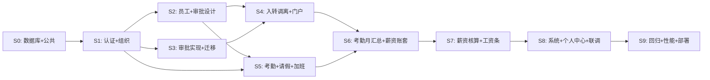
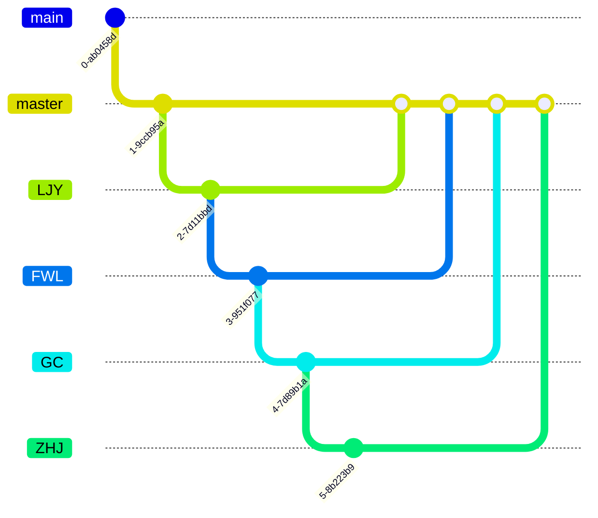

# HRMini 开发计划表

> **版本**：v1.0 | **日期**：2026-07-14  
> **团队**：李俊毅（权限+组织+公共）· 范文路（员工+个人中心）· 郭策（入转调离+审批）· 张浩杰（考勤+薪资）  
> **技术栈**：Spring Boot 3 + MyBatis-Plus + MySQL 8 + Redis 7 + RabbitMQ / React 18 + Umi Max + Ant Design 5  
> **仓库**：https://gitee.com/swing-king/hrmini

---

## 目录

1. [项目现状](#1-项目现状)
2. [总体路线图](#2-总体路线图)
3. [Sprint 分阶段计划](#3-sprint-分阶段计划)
4. [数据库设计分工](#4-数据库设计分工)
5. [后端开发分工明细](#5-后端开发分工明细)
6. [前端开发分工明细](#6-前端开发分工明细)
7. [前后端协作模式](#7-前后端协作模式)
8. [云服务器资源配置](#8-云服务器资源配置)
9. [关键里程碑与交付物](#9-关键里程碑与交付物)
10. [风险与应对](#10-风险与应对)

---

## 1. 项目现状

### 1.1 已完成（Sprint 0 起步）

| 项目 | 状态 | 说明 |
| --- | --- | --- |
| 后端 Maven 多模块骨架 | ✅ | 8 个模块（common/auth/org/employee/workflow/attendance/payroll/app），依赖已配置 |
| 后端主启动类 | ✅ | `HrmsApplication.java` |
| 后端配置 | ✅ | `application.yml` + `application-dev.yml`（MySQL/Redis/RabbitMQ 配置到位，但 Flyway 关闭） |
| 前端 Umi Max 脚手架 | ✅ | 路由配置、双布局（Admin/Portal）、access 权限框架 |
| 前端页面基础 | ✅ | 登录页、工作台占位页、门户个人中心占位页 |
| 系分文档 | ✅ | 后端系分、前端系分、API 契约、PRD 均已就绪 |
| 云服务器基建 | ✅ | MySQL 8、Redis 7、RabbitMQ 已部署 |

### 1.2 待完成（需开发）

| 项目 | 状态 | 紧急度 |
| --- | --- | --- |
| **数据库 DDL 设计** | ❌ 未开始 | 🔴 **最高优先级**，所有开发的前置依赖 |
| 后端 Java 业务代码 | ❌ 未开始 | 🔴 各模块 Entity/Mapper/Service/Controller |
| Flyway 迁移脚本 | ❌ 未开始 | 🟡 需 DDL 就绪后创建 |
| 前端 API 服务层 | ❌ 未开始 | 🟡 需 API 契约对齐 |
| 前端业务页面 | ❌ 未开始 | 🟡 可基于 Apifox Mock 先行 |
| OpenAPI / Apifox Mock | ⚠️ 占位 | 🟡 `openapi.yaml` 仅 236 字节 |

---

## 2. 总体路线图

整个项目分 **10 个 Sprint**，约 **15-17 周**（含 1 周缓冲）。

```
Sprint 0 (1周)     → 数据库设计 + 公共基础设施
Sprint 1 (1.5周)   → 认证权限 + 组织架构
Sprint 2 (2周)     → 员工档案 + 审批引擎设计
Sprint 3 (1.5周)   → 审批引擎实现 + 数据迁移
Sprint 4 (2周)     → 入转调离 + 员工门户
Sprint 5 (2周)     → 考勤打卡 + 请假加班
Sprint 6 (1.5周)   → 考勤月汇总 + 薪资账套
Sprint 7 (2周)     → 薪资核算 + 工资条
Sprint 8 (1周)     → 系统模块 + 个人中心 + 联调
Sprint 9 (1周)     → 全链路回归 + 安全 + 性能 + 部署
```

### 依赖关系图



---

## 3. Sprint 分阶段计划

### Sprint 0：数据库设计 + 基础设施（第 1 周）

> **目标**：完成所有表的 DDL 设计，搭建公共基础代码

| 日期 | 任务 | 负责人 | 产出 |
| --- | --- | --- | --- |
| D1 | ⚡ **数据库 DDL 评审会**（全员） | 全员 | 统一表名、字段类型、索引策略、ER 图确认 |
| D1-2 | 权限+组织+公共模块 DDL | 李俊毅 | `sys_user`, `sys_role`, `sys_permission`, `department`, `position` 及相关关联表 |
| D1-2 | 员工档案模块 DDL | 范文路 | `employee`, `employee_contract`, `employee_salary_profile`, `employee_no_history` 等 |
| D2-3 | 入转调离+审批模块 DDL | 郭策 | `onboarding_application`, `approval_process_def`, `approval_instance`, `regularization_application`, `transfer_application`, `resignation_application` 等 |
| D2-3 | 考勤+薪资模块 DDL | 张浩杰 | `attendance_group`, `attendance_record`, `leave_application`, `overtime_application`, `payroll_scheme`, `payroll_batch` 等 |
| D3-4 | 汇总 DDL → Flyway V1 基线脚本 | 李俊毅 | `db/migration/V1__init.sql` |
| D3-5 | 公共基础代码开发 | 李俊毅 | 统一响应 `R.java`、全局异常处理、MyBatis-Plus 配置、JWT 工具、Redis 配置、RabbitMQ 配置 |
| D3-5 | 前端基础设施 | 范文路 | 请求拦截器、Zustand stores 骨架、services 骨架、路由完善 |
| D4-5 | 云服务器环境配置 | 全员 | 各模块确认数据库连接、测试 Flyway 迁移 |
| D5 | OpenAPI / Apifox Mock 初始化 | 李俊毅 | OpenAPI 完善、Apifox 团队项目创建 |

**DDL 注意事项**（来自系分文档）：
- 表名无前缀（不使用 `org_`/`emp_`/`wf_`/`att_`/`pay_`，见后端系分附录 F）
- 部门树采用 `parent_id` + `path` 路径枚举（不使用闭包表）
- FK 仅用 `employee_id`，不引用 `emp_no`（AD-05）
- 所有业务表均含 `id`, `create_time`, `update_time`, `create_by`, `update_by`, `is_deleted`, `version`
- 表名映射参照后端系分附录 F

---

### Sprint 1：认证权限 + 组织架构（第 2-2.5 周）

> **目标**：用户可登录、查看部门树/职位管理  
> **前置依赖**：Sprint 0 数据库和公共代码已就绪

#### 后端分工

| 模块 | 负责人 | 核心产出 |
| --- | --- | --- |
| `hrms-common` 补充 | 李俊毅 | `DataScopeInterceptor`（数据权限 SQL 过滤）、`FieldPermissionFilter`、`@DataScope` 注解、全局错误码枚举 |
| `hrms-auth` | 李俊毅 | JWT 登录/登出/刷新、密码加密与校验、`/auth/login` `/auth/logout` `/auth/refresh` `/auth/profile` `/auth/password` |
| `hrms-org` | 李俊毅 | 部门树 CRUD（含合并 `POST /departments/{id}/merge`）、职位 CRUD、`DataScopeInterceptor` 集成 |

#### 前端分工

| 页面 | 负责人 | 核心产出 |
| --- | --- | --- |
| 登录页完善 | 范文路 | 登录流程、Token 管理、401 拦截、按角色跳转 |
| 部门管理页 | 李俊毅 | 部门树组件、新增/编辑/删除/合并弹窗 |
| 职位管理页 | 李俊毅 | 职位列表、序列-职级联动表单 |
| 管理后台布局完善 | 范文路 | 菜单动态生成、路由守卫、access 权限对接 |
| 员工门户布局 | 范文路 | PortalLayout 完善、Portal 路由 |

#### 联调点

- 登录 → 用户信息 → 菜单权限 全链路
- 部门树渲染 + 人数统计
- 职位 CRUD

---

### Sprint 2：员工档案 + 审批引擎设计（第 3-4.5 周）

> **目标**：员工花名册可查、审批引擎完成设计  
> **前置依赖**：Sprint 1 组织架构就绪

#### 后端分工

| 模块 | 负责人 | 核心产出 |
| --- | --- | --- |
| `hrms-employee` | 范文路 | 员工 CRUD、工号生成（Redis 序列）、敏感字段加密、花名册分页+高级搜索、薪资档案、合同管理 |
| `hrms-workflow`（审批引擎） | 郭策 | `ApprovalEngine` 核心、`approval_process_def` 路由设计、`approval_node_def` 节点定义、`SpelApproverResolver`、审批实例/任务创建流程 |
| `hrms-employee` 辅助 | 李俊毅 | `FieldPermissionFilter` 对接员工模块字段级权限 |

#### 前端分工

| 页面 | 负责人 | 核心产出 |
| --- | --- | --- |
| 花名册列表页 | 范文路 | ProTable 列表、高级筛选、部门 TreeSelect |
| 员工详情/编辑页 | 范文路 | 多 Tab 详情、字段级权限、编辑白名单 |
| 敏感字段组件 | 范文路 | `SensitiveField` 组件、二次验证弹窗 |
| 审批中心原型 | 郭策 | 待办列表页骨架、审批详情页 |

**审批引擎设计重点**：
- 表驱动 SpEL 路由（禁用 BPM），10 种 processType 的节点链配置
- 委托同时仅 1 条有效
- 48h 催办 / 72h 超时
- 乐观锁防双审

---

### Sprint 3：审批引擎实现 + 数据迁移（第 5-6 周）

> **目标**：审批引擎可实际运行审批流程、Excel 导入功能可用  
> **前置依赖**：Sprint 2 审批设计 + 员工档案

#### 后端分工

| 模块 | 负责人 | 核心产出 |
| --- | --- | --- |
| `hrms-workflow` 审批实现 | 郭策 | 审批操作（`APPROVE/REJECT/FORWARD`）、催办、撤回、委托 CRUD、待办统计/列表 |
| `hrms-common` 导入 | 李俊毅 | 4 种类型 Excel 导入（DEPT/EMPLOYEE/SALARY/ATTENDANCE_SUMMARY）、校验引擎、错误报告 |
| `hrms-auth` 角色权限 | 李俊毅 | 用户管理 CRUD `/system/users`、角色权限配置 `/system/roles` |

#### 前端分工

| 页面 | 负责人 | 核心产出 |
| --- | --- | --- |
| 审批中心完善 | 郭策 | 待办列表、审批操作（通过/拒绝/转交）、审批详情、`ApprovalTimeline` 组件 |
| 委托审批页 | 郭策 | 委托列表、新增/编辑/删除、生效范围 |
| 数据迁移页 | 李俊毅 | 5 步导入向导（选类型→下模板→上传→预览→确认）、`ImportWizard` 组件 |
| 用户/角色管理页 | 李俊毅 | 用户管理、角色权限配置树 |

---

### Sprint 4：入转调离 + 员工门户（第 6.5-8.5 周）

> **目标**：入职/转正/调岗/离职全流程跑通、员工门户可用  
> **前置依赖**：Sprint 2-3 员工档案+审批引擎就绪

#### 后端分工

| 模块 | 负责人 | 核心产出 |
| --- | --- | --- |
| `hrms-workflow`（入职） | 郭策 | 入职申请状态机（draft→pending→approved_pending→onboarded）、确认入职（生成 employee_id/emp_no、创建 sys_user、发送欢迎邮件） |
| `hrms-workflow`（转正/调岗/离职） | 郭策 | 转正申请、调岗申请（部门必变更校验）、离职双通道（员工申请→HR 正式发起）、`ResignationEffectJob` |
| `hrms-employee`（门户） | 范文路 | `/profile/*` 全量接口：`/profile/me`、`/profile/attendance/*`（代理）、`/profile/leave/*`（代理）、`/profile/payslips/*`（代理）、`/profile/security/*`、`/profile/resignation-requests` |

#### 前端分工

| 页面 | 负责人 | 核心产出 |
| --- | --- | --- |
| 入职管理 | 郭策 | 入职统计卡片、申请列表、新建/编辑表单、确认入职/放弃操作 |
| 转正/调岗/离职管理 | 郭策 | 待转正提醒、转正申请弹窗、调岗申请弹窗（部门必变更校验）、离职风险提醒 Banner |
| 员工门户-我的档案 | 范文路 | 档案查看/编辑、手机号变更申请 |
| 员工门户-我的考勤 | 范文路 | 考勤日历、打卡按钮、补卡入口 |
| 员工门户-我的请假 | 范文路 | 假期余额、请假申请/记录、撤销 |
| 员工门户-我的薪资 | 范文路 | 工资条列表、趋势图、二次验证 |
| 员工门户-账号安全 | 范文路 | 改密、手机绑定/解绑、登录日志 |
| 员工门户-离职申请 | 范文路 | 离职意向申请表单、撤销 |

---

### Sprint 5：考勤打卡 + 请假加班（第 9-11 周）

> **目标**：考勤组配置、上下班打卡、请假/加班申请可用  
> **前置依赖**：Sprint 1-2 组织+员工就绪

#### 后端分工

| 模块 | 负责人 | 核心产出 |
| --- | --- | --- |
| `hrms-attendance` | 张浩杰 | 考勤组 CRUD、打卡判定引擎、缺卡/迟到/早退/旷工规则、Redis 幂等防重复打卡、补卡申请（≤2次/月） |
| `hrms-attendance`（请假） | 张浩杰 | 假期余额管理（年假/调休）、请假申请（7 种类型）、年假折算规则、病假附件校验 |
| `hrms-attendance`（加班） | 张浩杰 | 加班申请、加班倍率（1.5/2.0/3.0）、加班台账 `overtime_ledger`、二审 SpEL `#dailyTotalHours >= 4` |
| `hrms-workflow` 审批对接 | 郭策 | 请假/加班/补卡审批路由注册到审批引擎 |

#### 前端分工

| 页面 | 负责人 | 核心产出 |
| --- | --- | --- |
| 考勤组管理 | 张浩杰 | 考勤组 CRUD、班次配置、适用人员选择、工作日/节假日设置 |
| 打卡管理 | 张浩杰 | 打卡记录列表、补卡申请弹窗（剩余次数展示） |
| 请假管理 | 张浩杰 | 请假记录、申请弹窗（0.5天步进、附件上传） |
| 加班管理 | 张浩杰 | 加班记录、加班申请、二审 Alert 提示 |
| 考勤统计图表 | 张浩杰 | 出勤率趋势(Line)、请假分布(Pie)、迟到排行(Column) |
| 门户考勤/请假/加班 | 范文路 | 员工端查看与申请入口 |

---

### Sprint 6：考勤月汇总 + 薪资账套（第 11.5-13 周）

> **目标**：考勤月锁定、薪资账套可配置  
> **前置依赖**：Sprint 5 考勤打卡数据

#### 后端分工

| 模块 | 负责人 | 核心产出 |
| --- | --- | --- |
| `hrms-attendance`（月汇总） | 张浩杰 | `AttendanceSummaryJob` 日终汇总、`attendance_monthly_summary` 聚合、月锁定机制（AD-01）、个人/部门统计 |
| `hrms-payroll`（账套） | 张浩杰 | 账套 CRUD（`payroll_scheme`）、工资项目（SpEL 公式 `formula_expr`）、适用范围配置 |
| `hrms-employee`（薪资档案） | 范文路 | 员工薪资档案维护、调薪历史记录 |

#### 前端分工

| 页面 | 负责人 | 核心产出 |
| --- | --- | --- |
| 月汇总页 | 张浩杰 | 月汇总列表、锁定/解锁操作 |
| 考勤统计页 | 张浩杰 | 个人统计日历、部门统计图表 |
| 账套管理页 | 张浩杰 | 账套列表、工资项目配置（SpEL 公式编辑）、适用范围选择 |
| 员工薪资档案页 | 范文路 | 薪资档案查看/编辑、调薪历史 |

---

### Sprint 7：薪资核算 + 工资条（第 13.5-15.5 周）

> **目标**：月度算薪全流程跑通、工资条可查  
> **前置依赖**：Sprint 6 考勤月锁定 + 账套就绪

#### 后端分工

| 模块 | 负责人 | 核心产出 |
| --- | --- | --- |
| `hrms-payroll` | 张浩杰 | 核算批次状态机、MQ 分片异步计算（50人/片）、分段计薪（AD-08）、累计预扣法个税、异常检测（黄/红）、批次审批操作 |
| `hrms-payroll`（工资条） | 张浩杰 | 工资条列表/详情、PDF 生成、二次验证 Redis 缓存 |
| `hrms-payroll`（成本报表） | 张浩杰 | 成本报表接口 |
| 审批引擎对接薪资 | 郭策 | PAYROLL_BATCH 审批路由、老板审批双条件 SpEL（AD-07） |

#### 前端分工

| 页面 | 负责人 | 核心产出 |
| --- | --- | --- |
| 核算批次管理 | 张浩杰 | 批次列表、创建批次、状态 Steps 组件、开始计算/审批/发放操作 |
| 核算预览页 | 张浩杰 | 核算明细 Table + 异常标记（黄/红）、手工调整、图表区（成本趋势/部门分布/构成占比） |
| 工资条管理（HR） | 张浩杰 | 工资条列表/详情查看 |
| 成本报表 | 张浩杰 | 成本报表页面 |
| 门户工资条 | 范文路 | 工资条列表、趋势图、二次验证弹窗、PDF 下载 |

---

### Sprint 8：系统模块 + 个人中心 + 联调（第 16 周）

> **目标**：全部功能打通，剩余系统管理页面完成  
> **前置依赖**：Sprint 1-7 全部完成

#### 后端分工

| 模块 | 负责人 | 核心产出 |
| --- | --- | --- |
| 系统管理补齐 | 李俊毅 | 操作日志、登录日志、数据备份、工作台汇总 |
| 定时任务补齐 | 李俊毅 | `RegularizationReminderJob`、`LeaveBalanceRefreshJob`、`SessionCleanupJob`、`PayrollAutoArchiveJob`、`CompensatoryLeaveExpireJob` |
| 消息队列完善 | 全员 | `hrms.email.send`（欢迎邮件）、`hrms.approval.notify`（审批通知）、`hrms.audit.log`（异步审计） |
| 前后端全量联调 | 全员 | 按 API 契约逐模块排查、修复偏差 |

#### 前端分工

| 页面 | 负责人 | 核心产出 |
| --- | --- | --- |
| 系统管理-操作日志 | 李俊毅 | 操作日志列表、筛选 |
| 系统管理-登录日志 | 李俊毅 | 登录日志列表 |
| 系统管理-数据备份 | 李俊毅 | 备份触发、记录 |
| 工作台（Dashboard） | 范文路 | StatCards、QuickLinks、趋势图、最近操作 |
| 联调修复 | 全员 | Bug 修复、UI 调整、状态颜色统一 |

---

### Sprint 9：全链路回归 + 性能 + 安全 + 部署（第 17 周）

> **目标**：达到上线标准

| 任务 | 负责人 | 说明 |
| --- | --- | --- |
| 全链路功能回归 | 全员 | 按 PRD 覆盖追溯矩阵逐条过 |
| 性能测试 | 张浩杰+李俊毅 | 员工列表 1000条 <1s、薪资 500人 <30s、并发≥200、打卡 <300ms |
| 安全审计 | 李俊毅 | 敏感字段加密验证、SQL 注入检查、XSS 防护、权限越权测试 |
| Flyway 生产验证 | 李俊毅 | 确认迁移脚本在空库可完整执行 |
| 部署文档 | 李俊毅 | 数据库迁移、MQ/Redis 配置、应用发布、Nginx 切流、回滚方案 |
| Apifox 回归集 | 李俊毅 | 确保所有接口通过回归 |
| 部署上线 | 全员 | 按发布顺序：MySQL→Redis/RabbitMQ→应用→Nginx 切流 |

---

## 4. 数据库设计分工

### 4.1 核心表清单（按负责人）

| 负责人 | 表名 | 说明 |
| --- | --- | --- |
| **李俊毅** | `sys_user` | 系统用户（登录账号关联员工） |
| | `sys_role` | 角色定义 |
| | `sys_permission` | 权限码 |
| | `sys_user_role` | 用户角色关联 |
| | `sys_role_permission` | 角色权限关联 |
| | `department` | 部门（parent_id + path 路径枚举，深度≤5） |
| | `position` | 职位（sequence_code M/P/S，grade_min/max） |
| | `operation_log` | 操作审计日志 |
| | `login_log` | 登录日志 |
| | `import_batch` | 导入批次 |
| | `import_row_error` | 导入错误行 |
| | `workday_config` | 工作日配置 |
| **范文路** | `employee` | 员工主表（PK=employee_id，永不复用） |
| | `employee_personal` | 员工个人信息（可选拆分） |
| | `employee_no_history` | 工号历史（reuse_flag 复用标记） |
| | `employee_contract` | 员工合同 |
| | `employee_salary_profile` | 员工薪资档案 |
| | `employee_salary_history` | 调薪历史 |
| | `employee_transfer_history` | 调岗历史 |
| | `employee_mobile_change_application` | 手机号变更申请 |
| **郭策** | `onboarding_application` | 入职申请 |
| | `regularization_application` | 转正申请 |
| | `transfer_application` | 调岗申请 |
| | `employee_resignation_request` | 员工离职申请 |
| | `resignation_application` | HR 离职申请 |
| | `approval_process_def` | 审批流程定义 |
| | `approval_node_def` | 审批节点定义（SpEL condition_expr + approver_resolver） |
| | `approval_instance` | 审批实例 |
| | `approval_task` | 审批任务（乐观锁防双审） |
| | `approval_delegation` | 委托 |
| | `approval_log` | 审批日志 |
| **张浩杰** | `attendance_group` | 考勤组 |
| | `attendance_group_member` | 考勤组成员 |
| | `attendance_record` | 打卡记录 |
| | `attendance_supplement` | 补卡申请 |
| | `attendance_daily_summary` | 日汇总 |
| | `attendance_monthly_summary` | 月汇总 |
| | `attendance_month_lock` | 月锁定 |
| | `holiday_calendar` | 节假日 |
| | `leave_balance` | 假期余额 |
| | `leave_application` | 请假申请 |
| | `overtime_application` | 加班申请 |
| | `overtime_ledger` | 加班台账 |
| | `overtime_rate_config` | 加班倍率配置 |
| | `payroll_scheme` | 账套 |
| | `payroll_scheme_item` | 工资项目（SpEL formula_expr） |
| | `payroll_scheme_scope` | 账套适用范围 |
| | `payroll_batch` | 核算批次 |
| | `payroll_detail` | 核算明细（segment_count, calc_snapshot_json） |

### 4.2 DDL 设计要点（统一约定）

1. **公共字段**：每个表都包含 `id BIGINT PK AUTO_INCREMENT`、`create_time DATETIME`、`update_time DATETIME`、`create_by VARCHAR(64)`、`update_by VARCHAR(64)`、`is_deleted TINYINT DEFAULT 0`、`version INT DEFAULT 0`
2. **表名**：无前缀，使用英文单数（见后端系分附录 F 映射表）
3. **字符集**：`utf8mb4` + `utf8mb4_unicode_ci`
4. **引擎**：`InnoDB`
5. **外键**：不建物理外键，使用逻辑关联（`employee_id` 关联）
6. **索引**：所有 FK 字段、查询条件字段建索引
7. **枚举存储**：DB 使用 TINYINT 或 VARCHAR（如系分附录 I 定义），API JSON 使用小写

### 4.3 DDL 评审要点

- 字段名统一：驼峰 ↔ 下划线（MyBatis-Plus 自动转换）
- `employee_id` 为业务主键，所有 FK 引用它
- `emp_no` 为展示工号 `YYYY+部门码+序号`
- 部门 `path` 字段格式：`/1/3/`，深度 level 1-5
- 敏感字段（身份证号、银行卡号）AES-256-GCM 加密存储 + SHA-256 哈希索引

---

## 5. 后端开发分工明细

### 5.1 李俊毅 — hrms-common / hrms-auth / hrms-org

| Sprint | 模块 | 类/功能 |
| --- | --- | --- |
| S0 | `hrms-common` | `R.java`（统一响应）、`GlobalExceptionHandler`、`BusinessException`、`ErrorCode` 枚举、`MyBatisPlusConfig`、`RedisConfig`、`RabbitMQConfig`、`JacksonConfig`、`JwtTokenProvider` |
| S1 | `hrms-auth` | `AuthController`、`AuthService`、`UserDetailsServiceImpl`、`JwtAuthenticationFilter`、`LoginRequest/Response`、`PasswordEncoder`、登录失败锁定、刷新 Token |
| S1 | `hrms-auth` | 登出 Token 黑名单 Redis、首次登录强制改密、90 天密码过期、无操作 30 分钟自动登出 |
| S1 | `hrms-org` | `DepartmentController`、`DepartmentService`、`DepartmentMapper`、部门树查询（path LIKE）、部门合并、删除校验 |
| S1 | `hrms-org` | `PositionController`、`PositionService`、`PositionMapper`、序列-职级联动 |
| S1 | `hrms-common` | `DataScopeInterceptor`（MyBatis-Plus 插件）、`@DataScope` 注解、`FieldPermissionFilter`（AOP） |
| S3 | `hrms-common` | 数据迁移：`ImportController`、`ExcelImportService`、4 种 Excel 解析器（DEPT/EMPLOYEE/SALARY/ATTENDANCE_SUMMARY）、校验引擎 |
| S4-5 | `hrms-auth` 补充 | 权限码对接各模块、`/system/users` 用户管理 CRUD、`/system/roles` 角色权限配置 |
| S8 | `hrms-common` 补充 | 操作日志 aop、`@OperationLog` 注解、登录日志、数据备份、工作台汇总、定时任务 Job |

**包路径**：`com.company.hrms.module.{auth,org,import_,system,job}`

**核心依赖**：hrms-common →（无）；hrms-auth → hrms-common；hrms-org → hrms-common

---

### 5.2 范文路 — hrms-employee

| Sprint | 模块 | 类/功能 |
| --- | --- | --- |
| S0 | `hrms-employee` | Entity、Mapper 基础 |
| S2 | `hrms-employee` | `EmployeeController`（列表/详情/编辑）、`EmployeeService`、`EmployeeMapper`、花名册高级搜索（keyword/department/position/status/grade/hireDate） |
| S2 | `hrms-employee` | `EmployeeIdGenerator`（Redis 工号序列）、敏感字段 AES-256-GCM 加密/解密、`/employees/{id}/sensitive/{field}` |
| S2 | `hrms-employee` | 薪资档案 `/employees/{id}/salary` GET/PUT、合同管理 |
| S4 | `hrms-employee` | 门户 `/profile/me`、`/profile/security/password`、`/profile/security/mobile/*`、`/profile/security/login-logs` |
| S4 | `hrms-employee` | `/profile/mobile-change-applications` CRUD、`/profile/resignation-requests` |
| S6 | `hrms-employee` | 员工薪资档案维护、调薪历史 `employee_salary_history` |
| S8 | `hrms-employee` | Portal `/profile/attendance/*`（代理 `/attendance/*`）、`/profile/leave/*`（代理 `/leaves/*`）、`/profile/payslips/*`（代理 `/payroll/*`） |
| S8 | `hrms-employee` | Portal `/profile/overtime/applications`（强制 SELF 数据范围） |

**包路径**：`com.company.hrms.module.employee` + `com.company.hrms.module.portal`

**核心依赖**：hrms-employee → hrms-common, hrms-auth, hrms-org

---

### 5.3 郭策 — hrms-workflow

| Sprint | 模块 | 类/功能 |
| --- | --- | --- |
| S0 | `hrms-workflow` | Entity、Mapper 基础 |
| S2 | `hrms-workflow` | 审批引擎核心：`ApprovalEngine`（启动实例/创建任务/流转）、`ApprovalProcessDefLoader`（加载流程定义）、`SpelApproverResolver`（解析审批人）、`ApprovalNodeDef`（节点定义+SpEL 条件） |
| S3 | `hrms-workflow` | `ApprovalController`（待办/详情/操作/催办/撤回）、`ApprovalTaskService`、`ApprovalInstanceService`、乐观锁防双审 |
| S3 | `hrms-workflow` | 委托 `DelegationController`、`DelegationService`、委托期间校验（同时仅 1 条有效） |
| S4 | `hrms-workflow` | 入职申请 `OnboardingController`、`OnboardingService`、状态机、确认入职事务（生成 employee_id → 创建 sys_user → 发送邮件 → 关联考勤组） |
| S4 | `hrms-workflow` | 转正 `RegularizationController`、调岗 `TransferController`、离职 `ResignationController`、`ResignationEffectJob` |
| S7 | `hrms-workflow` | 薪资审批路由 PAYROLL_BATCH + 老板审批双条件 SpEL（AD-07） |

**包路径**：`com.company.hrms.approval`（引擎） + `com.company.hrms.module.{onboarding,lifecycle}`

**核心依赖**：hrms-workflow → hrms-common, hrms-auth, hrms-org, hrms-employee

---

### 5.4 张浩杰 — hrms-attendance / hrms-payroll

| Sprint | 模块 | 类/功能 |
| --- | --- | --- |
| S0 | `hrms-attendance` | Entity、Mapper 基础 |
| S5 | `hrms-attendance` | 考勤组 CRUD、`AttendanceGroupController`、`AttendanceGroupService`、班次配置 |
| S5 | `hrms-attendance` | 打卡 `PunchController`、打卡判定引擎、Redis 幂等 `hrms:punch:{empId}:{date}:{type}`、防重复打卡 |
| S5 | `hrms-attendance` | 补卡申请 `PunchFixController`（≤2次/月 校验） |
| S5 | `hrms-attendance` | 请假 `LeaveController`、假期余额管理、7 种请假类型、年假折算规则、附件校验 |
| S5 | `hrms-attendance` | 加班 `OvertimeController`、倍率配置、二审规则 |
| S6 | `hrms-attendance` | 日终 `AttendanceSummaryJob`（02:00）、月汇总聚合、月锁定 `AttendanceMonthLock`、个人/部门统计 |
| S6 | `hrms-payroll` | 账套 CRUD `PayrollSchemeController`、工资项目 `PayrollSchemeItem`（SpEL 公式）、适用范围 |
| S7 | `hrms-payroll` | 核算批次 `PayrollBatchController`、`PayrollBatchService`、MQ 分片计算、`PayrollCalculator`（分段计薪）、`TaxCalculator`（累计预扣法） |
| S7 | `hrms-payroll` | 异常检测、`/payroll/batches/{id}/details` 核算明细、手工调整 |
| S7 | `hrms-payroll` | 工资条 `/payroll/payslips`、PDF 生成、二次验证、成本报表 |
| S8 | `hrms-payroll` | `PayrollAutoArchiveJob`、批次归档 |

**包路径**：`com.company.hrms.module.{attendance,leave,overtime,payroll}` + `com.company.hrms.payroll`（薪资引擎）

**核心依赖**：hrms-attendance → hrms-common, hrms-auth, hrms-org, hrms-employee
hrms-payroll → hrms-common, hrms-auth, hrms-employee, hrms-attendance, hrms-workflow

---

## 6. 前端开发分工明细

### 6.1 总体分工原则

| 成员 | 主要页面域 | 对应后端 |
| --- | --- | --- |
| 李俊毅 | 组织管理、系统管理、数据迁移 | hrms-auth + hrms-org |
| 范文路 | 员工门户全套、员工档案、工作台 | hrms-employee + portal |
| 郭策 | 审批中心、入转调离流程 | hrms-workflow |
| 张浩杰 | 考勤、请假、加班、薪资 | hrms-attendance + hrms-payroll |

### 6.2 前端服务层（`src/services/`）分工

| 服务文件 | 负责人 | Sprint |
| --- | --- | --- |
| `auth.ts` | 李俊毅 | S1 |
| `department.ts` | 李俊毅 | S1 |
| `position.ts` | 李俊毅 | S1 |
| `system.ts` | 李俊毅 | S3 |
| `imports.ts` | 李俊毅 | S3 |
| `workbench.ts` | 范文路 | S1 |
| `employee.ts` | 范文路 | S2 |
| `profile.ts` | 范文路 | S4 |
| `workflow.ts` | 郭策 | S3 |
| `delegation.ts` | 郭策 | S3 |
| `onboarding.ts` | 郭策 | S4 |
| `regularization.ts` | 郭策 | S4 |
| `transfer.ts` | 郭策 | S4 |
| `resignation.ts` | 郭策 | S4 |
| `attendance.ts` | 张浩杰 | S5 |
| `leave.ts` | 张浩杰 | S5 |
| `overtime.ts` | 张浩杰 | S5 |
| `payroll.ts` | 张浩杰 | S6 |

### 6.3 前端组件分工

| 组件 | 负责人 | 说明 |
| --- | --- | --- |
| `DepartmentTree` | 李俊毅 | 部门树组件 |
| `DeptTreeSelect` | 李俊毅 | 通用部门选择器 |
| `ImportWizard` | 李俊毅 | 5 步导入向导 |
| `EmployeeSearchSelect` | 范文路 | 员工搜索选择器 |
| `EmployeeStatusTag` | 范文路 | 在职状态 Tag |
| `SensitiveField` | 范文路 | 敏感字段脱敏+二次验证 |
| `FieldGuard` | 范文路 | 字段级权限组件 |
| `ApprovalActions` | 郭策 | 审批操作按钮组 |
| `ApprovalTimeline` | 郭策 | 审批进度时间线 |
| `ProcessTypeTag` | 郭策 | 审批类型 Tag |
| `ProcessStatusTag` | 郭策 | 流程状态 Tag |
| `PunchButton` | 张浩杰 | 打卡按钮 |
| `AttendanceStatusTag` | 张浩杰 | 打卡状态 Tag |
| `LeaveBalanceGauge` | 张浩杰 | 假期余额环形图 |
| `PayrollStepBar` | 张浩杰 | 批次状态 Steps |
| `PayrollAnomalyTag` | 张浩杰 | 核算异常标记 |
| `PayslipModal` | 张浩杰 | 工资条弹窗 |
| `PayslipVerifyModal` | 张浩杰 | 二次验证弹窗 |
| `charts/*` | 张浩杰 | AntV 图表封装 |

---

## 7. 前后端协作模式

### 7.1 接口契约先行

```
API 契约 (HRMS-API-Contract.md)
     ↓
OpenAPI 3.0 (openapi.yaml)
     ↓
Apifox 导入 → 自动 Mock
     ↓
前端基于 Mock 开发，后端基于契约实现
     ↓
联调周切换至真实后端
```

### 7.2 分支策略



| 分支 | 负责人 |
| --- | --- |
| `master` | 主干（merge 后发布） |
| `LJY` | 李俊毅工作分支 |
| `FWL` | 范文路工作分支 |
| `GC` | 郭策工作分支 |
| `ZHJ` | 张浩杰工作分支 |

**每次 Sprint 结束**：各分支 merge 到 `master`，全员拉取最新代码。

### 7.3 各模块联调顺序

| 批次 | 联调范围 | 参与人 | 预计 Sprint |
| --- | --- | --- | --- |
| 第一批 | 认证 + 组织架构 | 李俊毅 + 范文路 | S1 末 |
| 第二批 | 员工档案 + 审批引擎 | 范文路 + 郭策 | S3 末 |
| 第三批 | 入转调离 + 员工门户 | 郭策 + 范文路 | S4 末 |
| 第四批 | 考勤 + 请假 + 加班 | 张浩杰 + 范文路 | S5 末 |
| 第五批 | 薪资核算 + 工资条 | 张浩杰 + 范文路 | S7 末 |
| 全量 | 全模块回归联调 | 全员 | S8 |

### 7.4 日会与同步

- **每日站会**（10 分钟）：昨日完成、今日计划、阻塞点
- **每周代码评审**：轮流 Review，每人展示本周代码
- **Sprint 评审会**（每 Sprint 末）：演示完成功能、更新计划

---

## 8. 云服务器资源配置

### 8.1 当前已部署

| 服务 | 状态 | 用途 |
| --- | --- | --- |
| MySQL 8 | ✅ 已部署 | 主数据库 |
| Redis 7 | ✅ 已部署 | 缓存、分布式锁、Token 黑名单 |
| RabbitMQ | ✅ 已部署 | 异步计算、消息通知 |

### 8.2 需确认

| 项目 | 说明 |
| --- | --- |
| MySQL 连接信息 | 主机/端口/用户名/密码/库名，更新到 `application-dev.yml` |
| Redis 连接信息 | 主机/端口/密码 |
| RabbitMQ 连接信息 | 主机/端口/用户名/密码 |
| 文件存储 | V1.0 使用本地存储还是 MinIO/OSS？ |
| 短信网关 | V1.0 使用 Mock（固定验证码 123456）还是真实网关？ |
| 服务器 IP | 前端通过 API 网关连接后端的地址 |
| JDK 版本 | 服务器上的 JDK 版本（需 ≥17） |

### 8.3 配置建议

**application-prod.yml**（Sprint 9 准备）：
```yaml
spring:
  datasource:
    url: jdbc:mysql://<生产IP>:3306/hrms?useUnicode=true&characterEncoding=utf8&serverTimezone=Asia/Shanghai&rewriteBatchedStatements=true
    username: hrms_prod
    password: <加密密码>
  data:
    redis:
      host: <生产IP>
      port: 6379
      password: <密码>
  rabbitmq:
    host: <生产IP>
    port: 5672
    username: hrms
    password: <密码>
  flyway:
    enabled: true
```

---

## 9. 关键里程碑与交付物

| 里程碑 | 时间 | Sprint | 交付物 |
| --- | --- | --- | --- |
| M1: 数据库就绪 | 第 1 周末 | S0 | Flyway V1 迁移脚本、ER 图、数据库设计说明 |
| M2: 可认证登录 | 第 2.5 周末 | S1 | 登录/登出/权限、部门树、职位管理 |
| M3: 员工档案在线 | 第 4.5 周末 | S2 | 花名册、档案详情、高级搜索、审批引擎核心设计 |
| M4: 审批可流转 | 第 6 周末 | S3 | 审批待办/操作/委托、Excel 导入 |
| M5: 入转调离闭环 | 第 8.5 周末 | S4 | 全流程入职/转正/调岗/离职、员工门户 |
| M6: 考勤打卡运行 | 第 11 周末 | S5 | 考勤组、打卡、补卡、请假、加班 |
| M7: 月汇总锁定 | 第 13 周末 | S6 | 考勤月锁定、账套配置 |
| M8: 薪资算薪闭环 | 第 15.5 周末 | S7 | 批次核算、工资条、成本报表 |
| M9: 全功能联调 | 第 16 周末 | S8 | 全模块端到端测试通过 |
| M10: 上线就绪 | 第 17 周末 | S9 | 回归报告、性能报告、部署文档、生产环境 |

---

## 10. 风险与应对

| 风险 | 等级 | 概率 | 影响 | 应对 |
| --- | --- | --- | --- | --- |
| 数据库设计不一致导致返工 | 🔴 高 | 中 | 高 | DDL 全员评审 + Sprint 0 务必定稿 |
| 审批引擎自研复杂度超预期 | 🔴 高 | 中 | 高 | Sprint 2 先完成设计再编码，SpEL 单测覆盖 10 种 processType |
| 分段计薪逻辑 Bug | 🔴 高 | 高 | 高 | 20 个典型场景单元测试 |
| 算薪与考勤数据耦合问题 | 🔴 高 | 中 | 高 | 月锁定机制 + 快照隔离 |
| 前后端接口不一致 | 🟡 中 | 中 | 中 | OpenAPI + Apifox 强约束 |
| 前端员工列表大数据量卡顿 | 🟡 中 | 低 | 中 | 后端分页（最大100）+ 列宽固定 |
| 团队成员进度不均 | 🟡 中 | 中 | 中 | 李俊毅作为协调人，帮助进度慢的成员 |
| 云服务器资源不足 | 🟡 中 | 低 | 中 | 开发与测试共用环境，生产按需扩容 |

### 关键风险化解措施

1. **数据库设计**（Sprint 0 最重要）：全员必须参与 DDL 评审，使用系分文档附录 F 的表名映射
2. **审批引擎**：在 Sprint 2 先用伪代码+设计文档走通逻辑，Sprint 3 再编码实现
3. **分段计薪**：徐浩杰在 Sprint 6 提前研究 `ProratedPayrollService` 算法
4. **每日站会**：及时暴露阻塞，由李俊毅负责协调跨模块依赖

---

> **附录**：本开发计划中的 API 路径、枚举、错误码均以 [HRMS-API-Contract.md](HRMS-API-Contract.md) v1.0.0 为唯一权威。
