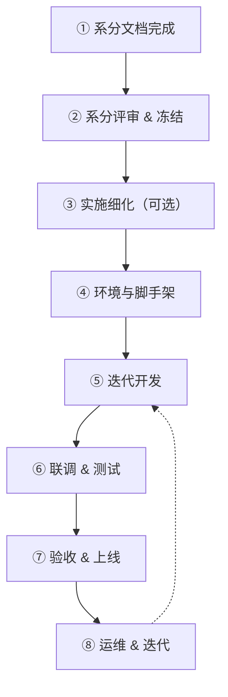
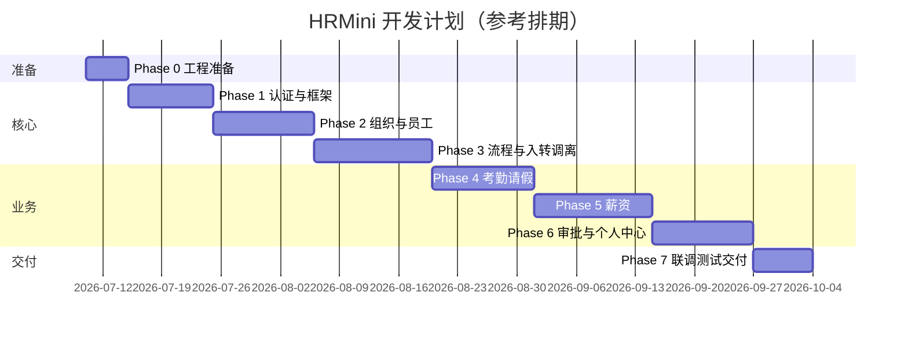

# HRMini 开发计划

> **文档版本**：v1.1（系分 v1.4 公司模板对齐后更新）  
> **编写日期**：2026-07-10  
> **适用项目**：HRMini 人力资源管理系统（微项目 / 模拟真实开发）  
> **前置文档**：[人资管理系统-PRD.md](人资管理系统-PRD.md)、[HRMS-Backend-System-Design.md](HRMS-Backend-System-Design.md)、[HRMS-Frontend-System-Design.md](HRMS-Frontend-System-Design.md)  
> **当前阶段**：系分 v1.4（公司模板对齐）→ **进入 Phase 0（系分冻结与工程准备）**

---

## 1. 文档目的

本文档回答三个问题：

1. **多角色协同评审**：现有系分是否足以开工？还有哪些风险？
2. **一般流程**：系分做完之后，正规项目接下来该做什么？
3. **本项目计划**：HRMini 按什么顺序、分几期、做到什么程度？

---

## 2. 多 Agent 协同评审（系分 v1.3）

> 模拟架构师、后端负责人、前端负责人、项目经理、测试、DBA/DevOps 六方评审，**不写代码**，只评文档与可实施性。

### 2.1 评审结论总览

| 维度 | 结论 | 说明 |
|------|------|------|
| PRD 覆盖度 | ✅ 可开工 | PRD §1–§12 在前后端系分均有章节映射 |
| 业务规则一致性 | ✅ 已对齐 | §9.6 三项关键规则与 PRD 一致（Admin 薪资、手机号申请、离职双阶段） |
| 架构选型 | ✅ 适合微项目 | 模块化单体 + Maven 多模块，运维成本低 |
| 接口/表结构完整度 | ⚠️ 设计完整、实现为零 | DDL 在系分中已描述，尚未落库脚本 |
| 前后端契约 | ⚠️ 有小缺口 | 见 §2.2，Phase 0 必须收口 |
| 复杂度 vs 人力 | ⚠️ 偏高 | 9 类审批 + 薪资引擎，建议分 7 个 Phase 迭代 |
| 非功能/测试 | ✅ 有指标 | PRD §11 已映射，Phase 7 再压测即可 |

**综合意见**：**可以进入开发**，但必须先完成 Phase 0（契约收口 + 环境 + DDL），不要直接全模块并行开写。

---

### 2.2 分角色评审意见

#### 🏛 架构师

**优点**

- 模块化单体边界清晰（auth / org / employee / workflow / attendance / payroll / common）。
- 权限三层（RBAC + DataScope + FieldPermission）与 PRD §2 匹配。
- 流程自研状态机 + 表驱动，微项目比 Flowable 更合适（§9.7 已暂缓 Flowable）。

**风险与建议**

| # | 问题 | 严重度 | Phase 0 动作 |
|---|------|--------|--------------|
| A1 | 错误码 `400xx` 重复定义（参数错误 vs 考勤模块） | 中 | 统一为：`40xxx` 参数、`41xxx` 考勤 |
| A2 | API 前缀文档不完全统一（`/api/v1` vs `/api/`） | 中 | 冻结为 `/api/v1/**`，前后端同一常量 |
| A3 | 前端引用 `GET /api/dashboard/summary`，后端系分未定义 | 高 | Phase 1 补充 Dashboard 聚合接口或 Phase 1 前端 Mock |
| A4 | Gateway 在架构图出现，微项目首期可 Nginx/直连 | 低 | 首期不引入 Spring Cloud Gateway |

#### ☕ 后端负责人

**优点**

- 表设计较完整（闭包表、流程表、考勤日汇总、薪资批次等）。
- 入转调离 + 9 类审批 + 个人中心 API 清单齐全。
- 敏感字段加密、审计日志、90 天改密等非功能有落点。

**风险与建议**

| # | 问题 | 严重度 | 建议 |
|---|------|--------|------|
| B1 | 无独立 DDL 文件，只有系分内 SQL 片段 | 中 | Phase 0 导出 `docs/db/V1__init.sql` |
| B2 | 薪资公式引擎、累计预扣法描述复杂 | 高 | Phase 5 先做「固定项 + 简单扣款」，公式引擎二期 |
| B3 | RabbitMQ 使用面较广（催办、异步核算） | 中 | Phase 1–3 可同步实现，Phase 4 起接 MQ |
| B4 | `hrms-app` 仅空壳启动类 | — | 正常，按 Phase 逐步填模块 |

#### ⚛️ 前端负责人

**优点**

- Umi Max 路由、access、FieldGuard、ProcessTypeTag 等组件规划清楚。
- 9 类审批 DetailAdapter 已列枚举（实现可逐个补）。
- 个人中心 6 项菜单与 PRD §9 对齐。

**风险与建议**

| # | 问题 | 严重度 | 建议 |
|---|------|--------|------|
| F1 | 大量页面仅在系分中，代码仅 Welcome 页 | — | 按 Phase 增量建 `pages/` |
| F2 | 前端系分 §9 仍写「Profile 五子模块」，实际已 6 项 | 低 | 开发时以路由为准（含离职申请） |
| F3 | AntV 图表多，可后置 | 低 | Phase 4/5 核心列表先行，图表后补 |
| F4 | `services/` 层为空 | — | Phase 1 起与后端 API 同步新增 |

#### 📋 项目经理

**范围建议（微项目 MVP）**

| 纳入首期 | 暂缓（系分 §9.7 已记录） |
|----------|-------------------------|
| 5 角色权限、组织、员工、入转调离 | 排班制 SCHEDULE 详细规则 |
| 考勤（固定班/弹性班）、请假、补卡 | GPS 打卡合规细节 |
| 薪资账套 + 简化核算 + 工资条 | 老板审批默认开关 |
| 9 类审批 + 委托 | 个税专项附加扣除 |
| 个人中心全套 | 工号复用细节可简化实现 |

**里程碑建议**：约 **7 个 Phase、8–12 周**（1 人全栈或 2 人前后端各半）。见 §4。

#### 🧪 测试

**优点**

- 前后端系分均含测试策略章节（单元 / 组件 / E2E / 压测场景）。

**建议**

| 阶段 | 测试重点 |
|------|----------|
| Phase 1–2 | 登录、权限越权、组织 CRUD |
| Phase 3 | 状态机流转、审批链、48h SLA（可 Mock 定时） |
| Phase 4–5 | 打卡判定、请假余额、薪资批次状态 |
| Phase 7 | PRD §11 四项指标抽样压测 |

每个 Phase 结束：**该 Phase 接口 Postman/Apifox 集合 + 1 条主路径 E2E**。

#### 🗄 DBA / DevOps

**优点**

- `config/docker/docker-compose.yml` 已含 MySQL / Redis / RabbitMQ。
- Gitee 远程、脚本、`.gitignore` 已就绪。

**Phase 0 必做**

1. Docker 启动基础设施，验证本机连通。
2. 从系分导出首版 DDL + 种子数据（5 角色、管理员账号、示例部门）。
3. IDEA 导入 `backend/pom.xml`，确认 JDK 17 + Maven 编译通过。
4. `frontend` 执行 `npm install && npm run dev` 验证骨架。

---

### 2.3 评审决议（开工门禁）

以下条件 **全部满足** 后，方可进入 Phase 1 编码：

- [ ] **R1** 冻结 API 规范：`/api/v1`、统一 `Result<T>`、错误码段修正（A1、A2）
- [ ] **R2** 补充或 Mock Dashboard 接口（A3）
- [ ] **R3** 首版 DDL 脚本入库 `docs/db/`（B1）
- [ ] **R4** 开发/测试环境可一键启动（Docker + 后端 + 前端）
- [ ] **R5** Gitee 首次提交完成，分支策略确定（建议 `main` + `dev`）

---

## 3. 一般项目：系分完成后的标准流程

| 步骤 | 活动 | 产出物 | HRMini 对应 |
|------|------|--------|-------------|
| ① | 系分编写 | 前后端系分 | ✅ 已完成 v1.3 |
| ② | **系分评审** | 评审纪要、问题清单、冻结版本 | ✅ 本文 §2 |
| ③ | 实施细化 | DDL 脚本、API 契约（Apifox）、任务拆分 | → Phase 0 |
| ④ | **环境搭建** | 本地 Docker、IDE 工程、CI 可选 | → Phase 0 |
| ⑤ | **迭代开发** | 按模块交付可运行增量 | → Phase 1–6 |
| ⑥ | 联调测试 | 接口测试、E2E、Bug 修复 | → 每 Phase 末 + Phase 7 |
| ⑦ | 验收上线 | UAT 清单、部署文档、演示 | → Phase 7 |
| ⑧ | 运维迭代 | 监控、备份、需求变更 | 微项目可简化 |

**关键原则**

- **先纵向打通一条链路，再横向扩展**（例如：登录 → 部门 → 员工 → 入职，而不是 9 个模块同时写 CRUD）。
- **前后端契约先行**：每个 Phase 开始前，列出该 Phase API 清单，前端可 Mock 并行。
- **系分不是代码**：Phase 0 的本质是把系分里的 SQL/API 变成可执行的「开工包」。

---

## 4. HRMini 分期开发计划

### 4.1 Phase 总览

| Phase | 名称 | 周期（参考） | 目标 | 可演示能力 |
|-------|------|--------------|------|------------|
| **0** | 系分冻结与工程准备 | 3–5 天 | 契约收口、DDL、环境跑通 | 空壳前后端 + 数据库 |
| **1** | 基础框架与认证 | 1–1.5 周 | 登录、JWT、RBAC 骨架、布局 | 5 角色登录、菜单按权限显示 |
| **2** | 组织架构 + 员工档案 | 1.5–2 周 | 部门树、职位、员工 CRUD/搜索 | HR 维护组织与员工 |
| **3** | 流程引擎 + 入转调离 | 2–2.5 周 | workflow 核心 + 入职/转正/调岗/离职 | 完整入职到确认 |
| **4** | 考勤与请假 | 1.5–2 周 | 考勤组、打卡、请假、补卡 | 员工打卡请假 |
| **5** | 薪资管理 | 2–2.5 周 | 账套、档案、批次核算、工资条 | HR 核算 + 员工看工资条 |
| **6** | 审批中心 + 个人中心 | 1.5–2 周 | 9 类待办、委托、profile 全套 | 审批人工作台 + 员工自助 |
| **7** | 联调、测试、交付 | 1 周 | E2E、Bug 修复、演示、文档 | 可交付演示版本 |

**合计**：约 **8–12 周**（视投入人力调整）。

---

### 4.2 Phase 0：系分冻结与工程准备（当前阶段）

**目标**：从「有文档」到「能编码」。

| 序号 | 任务 | 负责 | 产出 |
|------|------|------|------|
| 0.1 | 修正错误码段、统一 `/api/v1` | 后端 | 系分补丁或 `docs/api/conventions.md` |
| 0.2 | 定义 `GET /api/v1/dashboard/summary` | 后端 | 接口说明 + Mock 实现或占位 |
| 0.3 | 导出 DDL + 种子数据 | 后端/DBA | `docs/db/V1__init.sql`、`docs/db/seed.sql` |
| 0.4 | Docker 启动 MySQL/Redis/RabbitMQ | DevOps | 验证 `scripts/dev/start-infra.ps1` |
| 0.5 | IDEA 导入后端、本地编译运行 | 后端 | `HrmsApplication` 启动成功 |
| 0.6 | 前端 `npm install && npm run dev` | 前端 | Welcome 页 + 代理通 |
| 0.7 | Gitee 首次提交、创建 `dev` 分支 | 全员 | 远程仓库有代码 |
| 0.8 | Apifox/Postman 项目骨架 | 测试 | 空集合 + 环境变量 |

**Phase 0 完成标准（DoD）**

- 后端 `mvn compile` 通过，健康检查接口可访问
- 前端开发服务器正常，代理配置指向后端
- 数据库表结构与系分 §4 一致（至少 sys + org 相关表）
- 评审决议 R1–R5 全部勾选

---

### 4.3 Phase 1：基础框架与认证

**模块**：`hrms-common`、`hrms-auth`、`hrms-app`；前端布局与登录。

| 后端 | 前端 |
|------|------|
| 统一响应 `Result`、全局异常、错误码 | Umi Layout（Sider-Header-Content） |
| JWT 登录/登出/刷新 | 登录页、Token 拦截 |
| `sys_user` / `sys_role` / `sys_permission` | `access.ts` 对接 permissions |
| DataScope 拦截器骨架 | 动态菜单、403 页 |
| 操作日志 AOP 骨架 | 工作台占位（Dashboard Mock） |

**DoD**：5 种角色各一个测试账号登录，菜单可见性符合 PRD §2.2。

---

### 4.4 Phase 2：组织架构 + 员工档案

**模块**：`hrms-org`、`hrms-employee`。

| 后端 | 前端 |
|------|------|
| 部门 CRUD、闭包表、5 层校验 | 部门树 + 详情 |
| 职位/职级 M/P/S | 职位管理页 |
| 员工档案 CRUD、高级搜索 | 员工列表 + 详情 Tab |
| 工号生成、字段权限裁剪 | FieldGuard、SensitiveField |
| 手机号变更申请 API 骨架 | 档案页「申请变更」入口（可先 501） |

**DoD**：HR 创建部门/职位/员工；部门主管仅见本部门；员工仅见本人档案。

---

### 4.5 Phase 3：流程引擎 + 入转调离

**模块**：`hrms-workflow` + 流程业务表。

| 后端 | 前端 |
|------|------|
| `wf_process_instance` / `wf_task` 核心 | `pages/Workflow/*` |
| AssigneeResolver、审批/拒绝/转交/撤回 | ApprovalTimeline、ApprovalActions |
| 入职全流程（草稿→审批→确认入职） | 入职列表/新建/详情 |
| 转正、调岗、离职（员工申请 + HR 正式） | 对应页面 + Steps |
| 48h SLA 可先日志模拟 | 状态 Tag 配色 |

**DoD**：走通「入职申请 → 审批 → 确认入职 → 员工档案出现」主路径。

---

### 4.6 Phase 4：考勤与请假

**模块**：`hrms-attendance`。

| 后端 | 前端 |
|------|------|
| 考勤组、工作日、打卡判定 | 打卡中心、规则配置 |
| 请假类型、余额、审批链 | 请假管理页 |
| 补卡配额（每月 2 次） | 补卡 Modal |
| 日汇总批处理（可先定时简化） | 考勤日历 |
| 统计 API | 统计页（表格先行，AntV 后补） |

**DoD**：员工网页打卡；请假审批通过后余额扣减；HR 看部门统计。

---

### 4.7 Phase 5：薪资管理

**模块**：`hrms-payroll`。

| 后端 | 前端 |
|------|------|
| 薪资账套 + 工资项目 | 账套配置页 |
| 员工薪资档案 | 员工薪资页 |
| 月度批次：创建→计算→确认→审批 | 核算 Steps + 预览 Table |
| 简化公式（固定项 + 考勤扣款） | 异常标记 Tag |
| 工资条 + 二次验证 | PayslipModal |
| 财务审批、Admin 不可见薪资 | 角色菜单验证 |

**DoD**：HR 完成一月核算批次；财务审批通过；员工二次验证后看工资条。

---

### 4.8 Phase 6：审批中心 + 个人中心

**模块**：聚合 `hrms-workflow` + `profile` 相关 API。

| 后端 | 前端 |
|------|------|
| 待办/已办/统计/统一详情 | `/approval/workbench` |
| 9 类 processType DetailAdapter | ProcessTypeTag + 各 DetailPanel |
| 委托审批 | `/approval/delegation` |
| `/profile/*` 全套 | Profile 六页 |
| MOBILE_CHANGE、RESIGNATION_REQUEST | 申请 + 审批闭环 |

**DoD**：审批人在工作台处理 9 类中至少 5 类；员工完成档案编辑、请假、离职申请。

---

### 4.9 Phase 7：联调、测试、交付

| 任务 | 说明 |
|------|------|
| 全链路 E2E | 按系分 §8.3 场景清单跑 Playwright |
| 权限回归 | 5 角色 × 核心菜单 × 越权用例 |
| 性能抽样 | 员工列表 1000 条、薪资 500 人（可降级目标） |
| Bug 清零 | P0/P1 关闭 |
| 部署文档 | Docker Compose 一键演示 |
| 演示脚本 | 15 分钟 Demo：入职→考勤→算薪→发工资条 |

**DoD**：可按 PRD 主流程完成一次完整演示并录屏。

---

## 5. 协作与分支策略（微项目简化版）

| 项 | 建议 |
|----|------|
| 仓库 | Gitee `https://gitee.com/swing-king/hrmini.git` |
| 分支 | `main` 稳定可演示；`dev` 日常开发；功能分支 `feature/phase-N-xxx` 可选 |
| 提交规范 | `feat:` / `fix:` / `docs:` / `chore:` |
| 前后端协作 | 每个 Phase 第一天对齐 API 清单；后端优先 Mock 或 Swagger |
| 文档更新 | 代码变更导致接口变化时，同步改系分或 `docs/api/` |

---

## 6. 风险与应对

| 风险 | 概率 | 影响 | 应对 |
|------|------|------|------|
| 范围过大做不完 | 高 | 高 | 严格按 Phase MVP；§9.7 暂缓项不主动扩展 |
| 流程引擎复杂度 | 中 | 高 | Phase 3 先支持 4 类 HR 流程，MOBILE_CHANGE 可 Phase 6 |
| 薪资公式/个税 | 中 | 中 | Phase 5 用固定税率表 + 简化扣款，不做完整税务对接 |
| 前后端接口漂移 | 中 | 中 | Phase 0 冻结契约；Apifox 为单一事实来源 |
| 单人开发疲劳 | 中 | 中 | 每 Phase 必须有可演示 DoD，避免「半成品堆积」 |

---

## 7. 下一步行动（立即可做）

你当前处于 **Phase 0**，建议按顺序：

1. **今天**：完成 R1–R2（API 规范 + Dashboard 接口定义），导出 DDL 草案  
2. **本周**：Docker 环境 + 首版表结构 + Gitee 首次 push  
3. **下周**：启动 Phase 1（登录 + 布局 + RBAC）

如需，可在 Phase 0 任务确认后，再单独生成：

- `docs/db/V1__init.sql`（从系分提取）
- `docs/api/conventions.md`（API 规范冻结版）
- `docs/api/phase-1-apis.md`（Phase 1 接口清单）

---

## 8. 文档索引

| 文档 | 路径 |
|------|------|
| PRD | [人资管理系统-PRD.md](人资管理系统-PRD.md) |
| 后端系分 | [HRMS-Backend-System-Design.md](HRMS-Backend-System-Design.md) |
| 前端系分 | [HRMS-Frontend-System-Design.md](HRMS-Frontend-System-Design.md) |
| 本文（开发计划） | [HRMini-Development-Plan.md](HRMini-Development-Plan.md) |
| 文档目录 | [docs/README.md](docs/README.md) |

---

*系分阶段已结束；下一阶段 = Phase 0 工程准备 → Phase 1 编码。*
