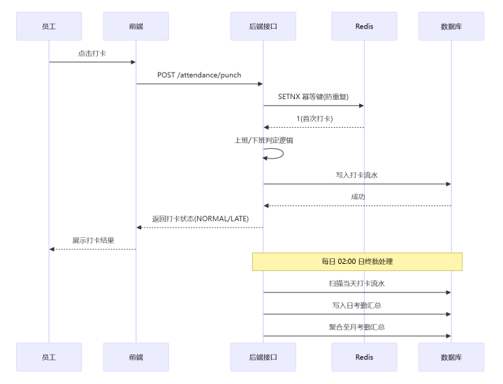
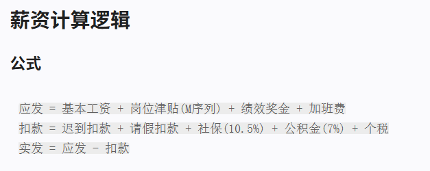
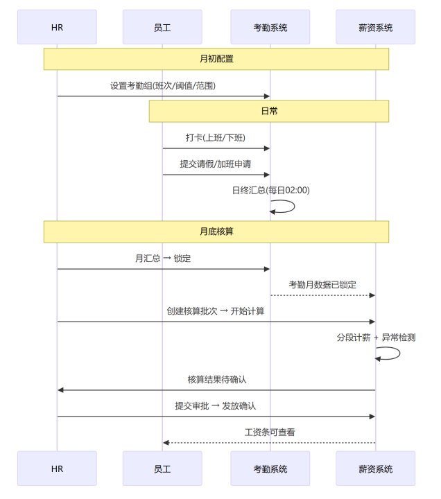

# HRMini 人资管理系统 · 答辩讲解稿

> 这份稿子按「对着讲」来写：你顺着标题往下念就能成段。  
> 评分可对照：需求完整度 / 演示清晰度 / AI 效率与协作 / 进度协作 / 技术亮点与待提升。  
> 〔现场〕表示要提前备好环境或账号，别临场现找。

---

## 开场（可直接念）

各位老师好。我们小组做的是 **HRMini 人资管理系统**。

一句话概括：这不是一个只会增删改查的后台，而是把 PRD 里真正难的几件事落地了——**权限要纵深、入转调离要走流程、考勤薪资要闭环**，管理端和员工门户两套界面共用一套鉴权。另外我们还做了 **AI 助手**：既服务业务用户查制度、办事跳转，也服务我们四人并行开发提效。

下面我先讲整体架构和需求，再按模块说亮点——**档案与个人中心、入转调离审批、考勤到薪资**都会讲细——然后讲安全性能兜底，接着演示，最后把 **AI 能力按角色和接口讲透**，并做不足与反思。

---

## 一、架构总览

### 1.1 我们怎么搭这套系统

可以把它想成三层：

**最上面是前端。** React 18 + Umi Max + Ant Design 5。两条布局：`/admin` 给 HR、主管、财务、系统管理员；`/portal` 给普通员工自助。员工登录后强制进门户，不会误进管理台。

**中间是后端。** Spring Boot 3、JDK 17，Maven 多模块：common、auth、org、employee、workflow、attendance、payroll、ai，由 `hrms-app` 统一启动。对外统一前缀 `/api/v1`，响应带 `code / message / data / traceId`。

**底下是基础设施。** MySQL 8（Flyway 管表结构）、Redis 7（会话、锁定、权限缓存、打卡幂等）、RabbitMQ（催办、算薪异步，本地可关掉）。AI 侧用阿里云百炼做对话和向量，Qdrant 存知识库向量。

### 1.2 为什么是「单体多模块」，不是微服务

我们工期紧、四人并行。上全套注册中心和分布式事务，运维成本会把交付压垮。所以选 **共享进程、模块边界清晰**：编译上按依赖序拆开，运行上还是一个应用。跨模块用 SPI、Service 接口、MQ 事件解耦，而不是互相硬耦合。

依赖关系可以记成一条链：

```text
common / auth / org（地基）
        ↓
   employee（档案）→ workflow（审批与入转调离）
        ↓                    ↓
   attendance（考勤）→ payroll（薪资）
        ↑
      ai（挂在鉴权与业务能力之上）
```

### 1.3 一张表看清「谁管什么」

| 同学 | 分支 | 后端 | 前端侧重 |
|------|------|------|----------|
| 李俊毅 | LJY | common、auth、org、AI | 登录、双布局、组织、系统、AI |
| 范文路 | FWL | employee | 花名册、档案、门户、手机号变更 |
| 郭策 | GC | workflow | 审批中心、入转调离 |
| 张浩杰 | ZHJ | attendance、payroll | 考勤、请假加班、核算与工资条 |

协作上我们是：个人分支开发 → 合入 `TEST` 联调 → 稳定后再进 `master`。接口变更钉钉群公告，阻塞半小时升级。Sprint 0 先把 Feign/内部接口和 MQ 消息体冻住，避免后面互相等。

---

## 二、需求怎么定、给谁用

### 2.1 要解决什么痛点

按 PRD，原来的人资大量靠 Excel 和纸质：档案散、算薪慢、审批不透明。我们的目标很明确——统一数字化档案，入转调离线上走，考勤和薪资核心链路能跑通、能演示、能联调。

### 2.2 多角色视角：同一套系统，不同人看到不同世界

答辩时建议主动切换角色讲，评委会更清楚「权限不是贴标签」。

| 角色 | 他关心什么 | 系统里他实际能做什么 |
|------|------------|----------------------|
| **HR 专员** | 招人、调人、管档案 | 管理端花名册、入转调离、考勤薪资运营 |
| **部门主管** | 本部门人、下属请假加班 | 只能看本部门树；能审批，但不能乱进全公司转调离管理 |
| **普通员工** | 自己的事自己办 | 门户：档案、打卡、请假、加班、工资条、离职申请 |
| **财务** | 算薪、成本 | 薪资域可见；组织/审批菜单按矩阵收敛 |
| **系统管理员** | 账号、角色、组织稳定 | **刻意看不到薪资全量**——这是 PRD 硬规则，不是疏忽 |

产品形态上就是双入口、同一套 Token 与权限码。前端 `access` 藏菜单，后端 DataScope 和 Filter 兜底，AI 意图也按角色门控——三层一起卡，才不容易漏。

### 2.3 四条必须守住的业务红线

这四条建议当场点名，它们决定了架构怎么切：

1. **系统管理员不可见薪资全量**：菜单、API、字段、AI 都不能「顺手看见」。  
2. **手机号不能直接改**：必须走手机号变更审批，通过后同步登录账号。  
3. **离职是双阶段**：员工先申请 → HR 再发正式离职 → 定时任务生效（禁号、腾工号等）。  
4. **入职必须走 onboarding**：禁止随便 `POST /employees` 直建档案。

### 2.4 本期边界（主动说清「做了什么、刻意没做什么」）

已交付、可演示：认证鉴权、组织、档案与敏感字段、审批与入转调离、打卡请假加班与月锁、账套核算与工资条二次验证、AI 知识库与办事跳转。

刻意收敛的：复杂流程编排器、考勤机硬件、外部财务系统对接、AI 代用户最终提交业务单（当前明确禁止编造提交）。

定位就是：微项目节奏下，先保证 **正确的业务闭环能跑**，而不是过度微服务化。

---

## 三、按模块讲亮点

> 这一节建议「一人一段」或主讲串、各人补充。每个模块只抓能指到代码或能演示的点，别堆概念。

### 3.1 公共底座 · 认证 · 组织（李俊毅）

**从架构师角度：** 没有 common，四人会重复造轮子。`Result`、全局异常、`traceId`、DataScope、字段脱敏，都沉在 common，业务模块只关心业务。

**从安全角度：** 登录密码**传输层 RSA-OAEP 加密**——前端先拉公钥，把 password 加密再提交，Network 面板只见密文，后端私钥解密后再走 BCrypt；另有登录失败五次锁十五分钟、Refresh Token 轮换作废、九十天强制改密、三十分钟无操作超时。仅有 JWT 不够，所以 Redis 里还有黑名单和 last-active。权限变更会踢 Redis 缓存，改完角色不用等 Token 自然过期。

**从业务规则角度：** 系统管理员走 `NONE_PAYROLL` 一类策略，再加接口拦截和前端藏菜单，形成「薪资悖论」——权限很大，但就是看不见薪资全量。

**组织侧可讲的落地细节：** 部门树有层级上限和合并事务；工号按「年 + 部门码 + 序号」生成，用 Redis 锁防并发；设部门负责人时自动授/收回 `DEPT_MANAGER`，并且用标记区分「自动授予」和「人工授予」，避免误删手工角色。

### 3.2 员工档案与个人中心（范文路）——「一档两视角」

> 同一套员工主数据，管理端管人、门户管自己；入口、可改字段、权限模型完全分开。这是产品结构亮点，不是两套重复页面。

#### 产品：管理端 vs 门户

| 视角 | 能力 | 价值 |
|------|------|------|
| 管理端员工档案 | 花名册、详情、编辑、薪资档案、敏感查看、手机号 HR 待办 | 公司视角「管人」 |
| 门户个人中心 | 我的档案、账号安全、申请改手机、登录日志 | 员工视角「管自己」 |

#### 业务：反 CRUD 的硬约束（讲解必提）

| 动作 | 普通做法 | 我们怎么做 |
|------|----------|------------|
| 新增员工 | 列表直接新增 | **禁止 `POST /employees`**，入职 confirm 才建档 |
| 改手机号 | 编辑表单直改 | **申请 → 审批/HR → 改档案并同步登录名** |
| 改部门/职位 | 编辑页下拉改 | **灰显 + 走调岗流程** |
| 员工改资料 | 进后台改全量 | **门户白名单 + 仅本人（SELF）** |

手机号闭环可念：门户申请 → PENDING → HR 通过 → 更新 `employee.mobile` → 同步 `username`。  
金句：**规则写进前后端，不是「表单能提交什么就改什么」。** 流程字段非空提交打回 **20003**。

#### 安全：看、存、验、追溯成套

脱敏展示（列表/详情掩码）→ 身份证等加密存储 → 看明文要二次验证并审计 → 改密拉黑当前会话 → 账号安全页可看登录日志。  
不是「有一个详情页」，而是敏感人事数据的成套保护。

#### 权限：谁能看、看到哪一层

花名册：鉴权 + DataScope（HR 全量、主管本部门；**财务族进不了花名册**）。  
薪资合同等字段按角色裁切；**系统管理员菜单 + API 双拦截**。  
门户身份只从 Token 取，前端不传「改谁」的员工 ID。  
亮点：同一员工详情，**不同角色字段集合不同**。

#### 架构与数据（可口述调用链）

```text
页面 → services/employee.ts
  → /employees（管理）或 /profile（门户） 两套 Controller
  → Employee / Salary / Sensitive / MobileChange 等 Service
  → 主表 employee + personal/contract/salary/bank 扩展表
  → 调岗史、调薪史、手机号变更申请留痕
```

管理端与门户 Controller 分离，规则不易串味；建档/状态变更交给入职与生命周期，档案模块不被审批绑死。

#### 体验：合规规则产品化

不可改字段禁用 + Tooltip「请走调岗/手机号变更」；详情多 Tab；无薪资档案可引导新建；门户与管理端风格统一。  
用户看得见「为什么改不了」，而不是保存后才报错。

#### 集成位置

上游接确认入职建档开号；横向接组织筛人、审批改手机、生命周期改状态；下游被考勤/算薪/工资条依赖。  
讲档案时接到：「人从哪来、状态怎么变、谁在用这份数据」。

#### 一分钟口述（范文路可用）

> 我们做的是「一档两视角」：HR 在管理端做花名册与合规变更，员工在门户自助且只能操作自己。亮点一是流程驱动——禁直建员工、禁直改手机和部门；二是权限分层——DataScope 加字段裁切，薪资对超管双拦；三是敏感保护——脱敏、加密、二次验证和登录追溯；四是主扩展分表与历史留痕；五是和入职、审批、考勤薪资打通。

### 3.3 入转调离与审批中心（郭策）——人事生命周期中枢

> 一句话：用**自研轻量审批引擎**统一承载入职 / 转正 / 调岗 / 离职，并服务请假、加班、补卡、手机号变更、薪资批次等跨模块流程；严格落地「入职不直建员工、离职双阶段」。

#### 功能：一套引擎，多类流程

不用 Flowable：实例 + 任务 + 日志三表，Java 推进节点。统一入口待办，覆盖的 `processType` 包括：

`ONBOARDING` / `REGULARIZATION` / `TRANSFER` / `RESIGNATION` / `RESIGNATION_REQUEST` / `MOBILE_CHANGE` / `LEAVE` / `MAKEUP` / `OVERTIME` / `PAYROLL_BATCH` 等。

**条件审批链**（`AssigneeResolver`）：按表单数据动态组节点——入职可二审、加班超阈值加 HR、调岗可挂财务。

**四条业务硬戏：**

1. **入职合规**：`draft → pending → approved_pending → onboarded`。审批通过只到「待入职」，**仍不可登录**；HR **confirm** 才事务建档开号。  
2. **转正三分支**：PASS / EXTEND / FAIL；FAIL 引导离职双阶段；Job 可扫试用结束前提醒。  
3. **调岗**：原部门 → 新部门 → HR（可选财务）；同部门拦 **30004**；生效日 Job 落地。  
4. **离职双阶段（PRD）**：门户登记 → HR 正式离职 → 审批交接 → `PENDING_RESIGN` → 日切 Job + MQ 通知考勤。

企业级体验：委托同时仅 1 条 ACTIVE；约 48h SLA；延迟催办；逾期可升级。

#### 架构：引擎推进 vs 业务规则拆开

```text
审批引擎 (DbApprovalService)
        │ 终态回调
        ▼
LifecycleApprovalHandler ──┬── 入职 → 建档/建号 Client
                           ├── 转正
                           ├── 调岗 → TransferEffectJob
                           └── 离职 → ResignationEffectJob + MQ
```

纯 Java `ApprovalStateMachine` 管合法迁移（无 Spring 也可测）；业务模块经 common 的 `ApprovalEngineService` SPI 创建实例，打破循环依赖。  
改审批链不必改四套业务 SQL——这是「可讲清的解耦」。

#### 性能与工程（点到即可）

催办走 RabbitMQ TTL/延迟，主事务不堵；MQ 可关则日志降级。Job 错峰（离职、调岗、逾期、转正提醒不同点）。列表控 pageSize；前端委托防抖、详情按需拉、多接口并行。  
前端：审批中心待办/已办/我发起 + KPI；入职按钮按状态矩阵显隐；离职管理双 Tab；`canManageWorkflow`（发起）与 `canApprove`（审批）拆开——主管只进审批中心。

#### 杀手级 Top 5（答辩主线可压缩成这五句）

1. 自研微审批引擎替代重型流程引擎，体量匹配、可联调。  
2. 引擎与业务彻底解耦（状态机 + Lifecycle 回调）。  
3. 入职「审批通过仍不可登录」+ confirm 建档开号。  
4. 离职双阶段 + 生效 Job + MQ 通知下游。  
5. 委托 + SLA + 催办 + 逾期——企业级体验，环境可降级。

#### 一分钟口述（郭策可用）

> 我负责入转调离和审批中心。核心不是堆 CRUD，而是自研轻量审批引擎：三表加 Java 推进，统一服务入职转正调岗离职，以及请假加班手机号变更薪资批次等九类以上流程。引擎推进和业务规则拆开，纯 Java 状态机管迁移，终态回调到各业务 Service。业务上对齐 PRD：入职必须 confirm 才建档开号；离职员工先申请、HR 再正式办、Job 按日生效。体验上有委托、SLA、催办；前端是统一审批台加入转调离状态按钮矩阵，权限上主管审、HR 管。

#### 客观边界（被问到主动说）

审批链以 Java 条件解析为主，不是完整 SpEL 编排器；部分列表适配微项目体量；入转调离页未做专门移动端适配。

### 3.4 考勤 · 请假 · 加班 · 薪资（张浩杰）——建议作为「最细闭环」重点讲

> 这条链是业务上最完整的一条：从每天打卡，到请假加班，再到日/月汇总，最后进算薪和工资条。答辩时可以按「员工日常 → HR 锁考勤 → 财务算薪 → 员工看条」四个视角串起来。

#### （1）打卡：判定状态，而不是只记时间

员工每天打 **IN（上班）/ OUT（下班）**。系统按考勤组班次判定：

- **NORMAL** 正常  
- **LATE** 迟到（超过上班点 + 阈值，默认约 15 分钟）  
- **EARLY_LEAVE** 早退  
- **ABSENT** 旷工（偏得太远）  
- **MISSING_IN / MISSING_OUT** 缺卡  
- 若整天没卡，还会看当天有没有已通过的请假，标成 **LEAVE**

班次类型：固定班（FIXED）、弹性班（FLEXIBLE）；排班制（SCHEDULE）本期按固定班兜底。  
漏打可补卡，**每月额度有限（两次）**，补卡也要走审批（上级再 HR）。  
实现上还有 Redis 幂等，防连点重复打卡。

**〔现场可指图〕打卡时序：前端 → 接口 → Redis SETNX 幂等 → 写流水 → 返回 NORMAL/LATE；凌晨 02:00 再扫流水做日汇总并滚到月汇总。**



#### （2）请假：提交 → 审批 → 扣余额 → 进考勤槽

员工选类型（年假/病假/事假/调休等）、起止、原因后提交。  
审批通过后：扣假期余额；请假天数进考勤日汇总槽位。病假超过一天要附件。  
关键机制是 **余额预扣**：先扣住，驳回/撤销再还，避免「假还在批、余额已被别人透支」。  
日终汇总时会把已通过请假写进当天上下午槽位。

#### （3）加班：提交 → 审批 → 进台账 → 算钱/调休

填日期、时段、原因，通过后进 **加班台账**。算薪从台账取数，倍率：

- 工作日 **1.5**  
- 休息日 **2.0**  
- 法定节假日 **3.0**  

加班费口径可讲：（月基本工资 ÷ 21.75 ÷ 8）× 倍率 × 小时。  
通过后还可按 8 小时=1 天折算进 **调休余额**（1 小时=0.125 天）。时长偏长会触发 HR 二审。

#### （4）考勤汇总：日汇总 + 月汇总 + 锁定

这是考勤模块的「中枢」：

**日汇总**（定时，如凌晨）：把当天打卡聚成一条；双槽位 `am:code,pm:code`（0 正常、1 迟到、2 早退、3 旷工、4 请假、5 缺卡）。例如上午迟到下午正常 → `am:1,pm:0`。

**月汇总**：累加应出勤、实际出勤（双槽正常算 1 天、单槽 0.5）、迟到/早退/旷工/请假/加班等。HR 可手动「生成汇总」；员工换考勤组后要重跑。

**锁定**：月汇总锁定后该月考勤冻结，不能再改打卡。**算薪要求当月考勤已锁定**——这是考勤和薪资的硬衔接。

#### （5）薪资核算：批次状态机 + 分段计薪 + 个税

HR 按月跑批次：

1. 创建批次（DRAFT）→ 选账期  
2. **计算**（CALCULATING，MQ 异步）  
3. 算完待确认（PENDING_CONFIRM）→ 可手工调某一项  
4. 提交审批（APPROVING）→ 通过（APPROVED）  
5. 发放确认（DISTRIBUTED）→ 员工门户可见工资条  

单人怎么算（可对着讲）：

1. 查 **薪资档案**（没有档案直接失败）  
2. **匹配账套**：档案指定 → 部门/岗位/职级范围 → 兜底启用账套  
3. 按账套项目算：固定项、浮动项（含加班费）、考勤扣款、社保公积金、个税等  
4. **分段计薪**：月中入职/转正按比例切段（同月可三段）  
5. **个税累计预扣**：累计收入 − 5000×月数 − 累计社保公积金，查税率表，本期预扣=累计应纳税−已预扣；YTD 跨年重置  
6. **异常标记**：请假过多、加班过多、实发环比波动过大，方便确认时盯梢  

金额字段用 **BigDecimal**，避免浮点误差。工资条详情还要 **二次验证**（与敏感字段验证 Key 隔离）。

**〔现场可指图〕账套公式口径（应发 / 扣款 / 实发）：**



口述时可对应：应发里含基本工资、岗位津贴（如 M 序列）、绩效、加班费；扣款含迟到/请假扣款、社保约 10.5%、公积金约 7%、个税；实发 = 应发 − 扣款。具体比例以账套配置为准，图示是演示口径。

#### （6）数据怎么流（建议现场指这张总图）

**〔现场主图〕月初配置 → 日常打卡/请假加班 → 日终汇总 → 月底锁考勤 → 创建批次算薪 → 确认审批发放 → 员工看工资条。**



文字版可对照记忆：

```text
打卡记录 ──→ 日汇总（定时聚合）
                 ↓
             月汇总 ←── 请假通过、加班台账
                 ↓（HR 锁定）
           薪资核算 ←── 薪资档案、账套
                 ↓
           批次明细 → 手工调整 → 审批 → 发放
                                      ↓
                                 门户工资条
```

**可强调的设计点：** 考勤锁是算薪闸门；加班不直接改工资，而是进台账再被账套公式消费；MQ 异步算薪，连不上时不能假装算完（批次会停在核算中，避免脏发放）。

### 3.5 AI 助手（点题；完整展开见第六节）

产品上：制度问答 + 权限内办事卡片；研发上：提效工具，不是需求来源。  
技术上记住三句即可：

1. **确定性优先**：`CapabilityRegistry` 关键词 + 角色门控办对事，不让模型猜调哪个 API。  
2. **生成式增强**：百炼对话 + Qdrant RAG 答制度；`AiDialogRouter` 分流，闲聊不灌知识库。  
3. **可降级**：纯办事可不出模型；模型挂了，表单/待办/查数卡片仍可出。

选型、意图命中链路、知识库、能力表、安全红线与演示话术 → **第六节**。

### 3.6 前端整体（跨角色体验）

双布局把管理动作和自助动作拆开；`access.ts` 和 PRD 矩阵对齐，例如系统管理员没有薪资菜单、主管审批权限和全公司人事管理权限分开。全局请求带 Token，401 尝试刷新，长时间无操作登出——和后端空闲策略一致。页面文案、审批进度也尽量中文化，审批人姓名会展到进度树上，避免「pending / OVERTIME」这类裸英文出现在员工眼前。

### 3.7 四条线怎么串成一个人资闭环（主讲收束用）

可以当场比划一条「人」的路径：

```text
入职 confirm（郭策引擎 + 范文路建档）→ 开号登录（李俊毅 auth）
    → 打卡 / 请假加班（张浩杰）→ 审批待办（郭策引擎）
    → 月锁考勤 → 算薪发放（张浩杰）→ 门户工资条 / 档案自助（范文路）
    → 调岗转正离职（郭策）→ 禁号与考勤联动
```

AI（小 R）挂在这条链上：指路、填表、待办、查数，**不另开写库旁路**。  
四条红线贯穿全程：超管无薪资全量、手机号走变更、离职双阶段、入职不直建。

---

## 四、安全设计 · 性能设计 · 兜底策略

> 评委常问「你们怎么防越权、怎么扛峰值、挂了怎么办」。这一节按三个问题答，尽量举系统里真实机制。

### 4.1 安全：不是一道墙，是纵深

我们按威胁来设防，可以这样讲：

**身份与会话。**  
登录密码走 **RSA-OAEP（SHA-256）传输加密**：`GET /auth/crypto/public-key` → 前端 Web Crypto 加密 → `POST /login` 带 `encrypted: true` → 服务端私钥解密后再 BCrypt 校验。DevTools Network 里不再出现明文密码（库内仍是 BCrypt，与传输加密分层）。另有：登录失败累计锁定；Access / Refresh 双 Token，刷新时旧 Refresh 作废；登出进黑名单；三十分钟无操作超时。前端也会配合：无操作检测、401 静默刷新，刷新失败再回登录页。目的是：密码不裸奔、Token 丢了/电脑忘关了，窗口期可控。

**垂直越权（角色能不能进这个功能）。**  
权限码 + 各模块 AccessGuard；薪资域对系统管理员做双拦截——前端藏菜单不够，接口也要拒。AI 意图同样按角色门控，防止「聊天框绕过菜单」。

**水平越权（能不能看别人的数据）。**  
行级用 DataScope：全公司 / 本部门树 / 仅本人 / 薪资域等。拼不出合法范围时，SQL 直接变成 `AND 1=0`，宁可查不到，也不要误放出全表。列级用字段过滤器：身份证、银行卡等按角色置空；真要看明文，走二次验证并写审计。

**业务篡改。**  
手机号、部门这类流程字段，更新接口白名单 + 非空即 **20003**，抓包也改不了。入职禁止直建档案、离职双阶段、审批状态机非法跳转拦截——把「业务安全」写进状态，而不是只靠前端按钮灰掉。

**敏感数据与注入面。**  
敏感字段 AES 存储；MyBatis 参数绑定，避免字符串拼 SQL；统一错误码，尽量不把堆栈和内部细节回给浏览器。导出 Excel 走后端鉴权，不是前端藏个按钮就算了。

**一句话收束：** 前端负责体验收敛，后端负责最终裁决；AI 和导出也走同一套登录态，不另开「旁路」。

### 4.2 性能：先保证热点路径别被打穿

我们没有上复杂限流网关，但在微项目里把「会爆」的点做了针对性处理：

**读多写少的权限与组织。**  
用户权限码 Redis 缓存（短 TTL），角色变更主动踢缓存——读加速，真相仍在库。部门树等可缓存、变更失效，避免每次拼树打全表。

**高并发写：打卡。**  
同一员工同一天同一类型打卡，Redis 幂等键挡住重复提交；失败会删键允许重试，避免「点一下卡死、再点永远失败」。上班卡还有库层防重兜底。

**长耗时任务：算薪。**  
全员核算不塞进一次 HTTP。批次进「核算中」，MQ 异步分片算，前端轮询进度。考勤未锁定不允许开算，减少算完又改考勤的返工成本。

**联表与 N+1。**  
列表展示姓名部门时，批量查员工再映射，而不是循环 `selectById`。审批待办、花名册分页都走分页参数，避免一次拖全量。

**AI 路径。**  
先做意图分流：能走能力卡片的，不必每次全量 RAG；制度问答才检索向量库，且相似度不够不注入 Prompt，既省 token，也少胡话。

**前端体感。**  
列表分页、筛选后再查；工作台等聚合接口失败时页面可降级展示，不因为一个 KPI 挂了整页白屏。

### 4.3 兜底：异常、降级、幂等、可关可开

答辩时建议主动说「我们假设什么会挂」：

| 场景 | 我们怎么兜 |
|------|------------|
| 数据权限解析失败 / 用户缺部门 | DataScope 退化为 `1=0`，拒绝放行 |
| 权限码种子遗漏导致管理员进不去 | `PermissionGuard` 对 SYS_ADMIN 有受控兜底，但薪资等硬规则仍拦截 |
| RabbitMQ 本地没有 / 演示环境不稳 | 条件装配可关；通知可降级打日志，主流程不绑死 Broker |
| 打卡重复点击 | Redis 幂等 + 失败可重试 |
| 审批重复点同意 | 任务状态校验，重复 action 按冲突/幂等错误返回 |
| 请假驳回 / 撤销 | 余额按规则恢复，防止「扣了不还」 |
| 入职通知、催办发不出去 | 主状态机已落库；通知失败不回滚已成功的入职主路径（可补发/日志） |
| AI 检索不到 / 模型超时 | 不硬编制度答案；办事仍引导走原页面；演示可改讲设计不连线 |
| 工资条未二次验证 | 直接 **60004**，不返回明细 |
| 全局异常 | 统一 `Result` + 业务错误码；带 `traceId` 便于排障，不把内部异常细节甩给用户 |

**设计原则可以念这句：**  
主链路优先「正确且可恢复」——该拒绝就拒绝，该异步就异步，外部依赖可降级，但不能用降级换来越权或脏数据。

---

## 五、现场演示建议（按角色走链路）

> 演示比念 PPT 更有说服力。下面链路可按时间选做 1～2 条深讲；账号见 `docs/db/demo_accounts_v14.md`，统一密码以现场种子为准（常见为 `Admin@123`）。

### 演示 A · 权限反差（系统管理员 vs 财务 / HR）

登录时可顺带打开 Network：`public-key` → `login` 的 password 是密文、`encrypted: true`（传输加密亮点，十秒带过即可）。  
用系统管理员登录：强调 **看不到薪资全量菜单**。  
再切财务或 HR：能进薪资相关能力。  
一句话收束：这是产品规则，不是前端漏配。

### 演示 B · 员工办事闭环（门户）

用普通员工进门户：打卡或请假/加班 → 看审批进度（状态中文、当前审批人）→ 如有待审批可撤销请假。  
再点开 AI：问一条制度，或让它指路到请假页。

### 演示 C · 入转调离 + 审批中心（郭策主线）

建议顺序（可压缩）：

1. **入职**：草稿 → 提交 → 审批同意 → 强调「还不能登录」→ confirm（可提预计入职日门禁）→ 新人可登录。  
2. **转正**（可选）：PASS / EXTEND / FAIL 三分支。  
3. **调岗**（可选）：发起 → 详情看三节点。  
4. **离职双通道**：门户申请 → HR 正式离职 → 审批交接 → 说明 Job 生效后禁号。  
5. **委托**（可选）：新建 ACTIVE → 再新建冲突拦截。

### 演示 D · 考勤到薪资闭环（建议作为「最细流程」主演示）

按角色切换讲，比单点功能更有说服力（可同时投屏讲解稿里的三张图）：

1. **员工**：打卡（看判定状态）→ 请假或加班提交 → 看审批进度。〔指打卡时序图〕  
2. **主管/HR**：审批通过 → 说明请假扣余额、加班进台账。  
3. **HR**：日/月汇总（可提双槽位）→ **锁定月考勤**。〔指月底核算总图〕  
4. **HR/财务**：创建核算批次 → 异步计算 → 待确认（可提异常标记/手工调整）→ 审批 → 发放。〔指应发/扣款/实发公式图〕  
5. **员工**：门户工资条（强调二次验证，AI 也不会直接报金额）。

一边点一边回扣：`考勤锁是算薪闸门`、`加班不直接改工资而是进台账`、`金额用 BigDecimal`。

### 演示 E · 员工档案与个人中心（范文路主线）

1. 花名册搜索 → 点出 DataScope / 部门筛选。  
2. 编辑页点手机号、部门 → 「流程驱动，不能直改」+ Tooltip。  
3. 换角色看同一人详情 → 字段裁切 / 超管无薪资。  
4. 看身份证 → 脱敏 + 二次验证。  
5. 门户改邮箱 / 申请改手机 → SELF + 变更审批。  
6. 收束：新人来自入职建档，不是列表「新增员工」。

### 演示备忘〔现场〕

- 后端 `8080`、前端 `8000`，库表与种子数据已导入。  
- AI 需百炼与 Qdrant 可用；不可用时改讲「能力注册表与权限门控」设计，不强行连线。  
- RabbitMQ 若本地关闭，算薪/催办可说明「生产开、本地可关」的条件装配。

---

## 六、AI 专项：技术选型 · 怎么设计 · 怎么实现

> 这一节可以单独讲 8～15 分钟。建议顺序：立靶子 → 选型 → 双轨架构 → **意图命中怎么走** → 一句话进系统后发生了什么 → 知识库 → 能力全景 → 安全与降级 → 演示。  
> 评委打断时，优先保住三句：**确定性办对事、RAG 按需、写库走原 API**。

### 6.1 我们要解决什么问题（先立靶子）

人资系统菜单深、制度散、角色多。用户常卡在三件事：**制度怎么规定、入口在哪、表单怎么填**。  
如果「句句丢给大模型」，会有两个坑：

1. **不可控**：乱指路、乱报工资、假装已提交。  
2. **贵且慢**：寒暄也去检索知识库，又慢又容易把弱相关制度硬套进回答。

所以产品定位很清楚：

> **小 R = 权限内的办事助手 + 有依据的制度问答**，不是万能代办机器人。

研发侧再用同一套 AI 工具链加速写样板和文档，但 **PRD 红线仍由人定、代码守**——AI 不能成为「绕过权限的后门」。

### 6.2 技术选型（讲「为什么」，别只报菜名）

| 层级 | 选型 | 我们为什么选它 |
|------|------|----------------|
| 大模型 + Embedding | 阿里云百炼（`BailianClient`） | 一套 Key 同时调对话和向量；OpenAI 兼容协议，换模型成本低。默认对话偏快的 flash 档，向量 `text-embedding-v4`（1024 维） |
| 向量库 | Qdrant（`QdrantClient`） | 可自托管、Cosine 检索；集合启动时自动建好；和业务 MySQL 解耦，知识开关用 payload 过滤 |
| 流式输出 | SSE（`SseEmitter`） | 打字机体验；事件顺序约定：`delta` 吐字 → `final` 带卡片/引用 → `done` |
| 意图与办事 | `CapabilityRegistry`（关键词 + 角色门控） | **办事路由不绑 LLM**：可预测、可审计、模型挂了卡片还能出 |
| 对话分流 | `AiDialogRouter` | 办事卡片 / 指路 / 制度问答 / 闲聊 四态，避免「每句都灌知识库」 |
| 跨模块查数 | SPI（`RosterQueryService` / `OrgLookupService` / `LeaveBalanceQueryService`） | AI 模块只依赖 `hrms-common` 接口，实现落在 employee / org / attendance，带 DataScope |
| 配置 | `AiProperties` + Redis 运行时设置 | 模型名、温度、topK、分块大小可调；Key/维度仍走配置文件，防页面误改密钥 |

一句话：**模型负责「说人话」，确定性代码负责「办对事、守权限」**。

### 6.3 模块落点（答辩时可指包结构）

后端在 `hrms-ai`，不绑死业务实现类：

| 包 / 类 | 职责 |
|---------|------|
| `controller/AiChatController` | `POST /ai/chat/stream`、能力列表 |
| `controller/AiKnowledgeController` | 知识库上传/启停/删除 |
| `controller/AiSettingsController` | 运行时旋钮（温度、topK 等） |
| `service/AiChatService` | 编排：意图 → 短路/分流 → RAG → 百炼 → SSE |
| `service/AiKnowledgeService` | 抽文本、分块、Embedding、写 Qdrant |
| `capability/CapabilityRegistry` | 意图词典 + `hasAccess` 门控 |
| `capability/AiDialogRouter` | 模式分类 + RAG 分数过滤（≥0.52） |
| `capability/*ActionFactory` | 把业务数据装配成前端卡片 JSON |
| `capability/AiQuerySlotExtractor` | 从话术抽部门名、人名等槽位 |
| `client/BailianClient` / `QdrantClient` | 外部依赖封装 |

前端：`AiFloatBall` → `AiChatPanel`；按 `actionType` 渲染 `AiLeaveFormCard` / `AiOvertimeFormCard` / `AiApprovalTodoCard` / `AiEmployeeListCard` / `AiDataStatsCard` 等。

### 6.4 总体设计：两套路并行，再汇合

```text
用户一句话
    │
    ├─① 确定性轨道（意图命中主链路）
    │     CapabilityRegistry 扫关键词
    │       → 角色门控（有权限 / 无权限）
    │       → 冲突消解（查余额压掉请假表单、查数压掉泛化花名册…）
    │       → 槽位抽取 / 上下文补槽
    │       → 纯办事？→ 本地短路（可不调百炼）
    │       → ActionFactory 生成导航/表单/待办/名单/数据卡
    │
    └─② 生成式轨道（需要说话时）
          AiDialogRouter 判模式
            → 仅制度/指路等需要时才 RAG（Embedding → Qdrant ≥0.52）
            → 拼 System Prompt + 风格提示 + 用户上下文 + 制度片段
            → 百炼流式输出
    │
    └─→ SSE 推给前端：文字流 + final 卡片 + done
```

**四条设计取舍（必背）：**

1. **路由确定性优先**：请假、查余额、待办、查人数，用关键词和槽位，不让模型「猜该调哪个 API」。  
2. **RAG 按需触发**：闲聊、纯办事卡片，不检索；制度/流程问法才检索。  
3. **写库仍走原 API**：聊天里点「提交请假」，调的是真正的 `/leaves/applications`，DataScope、审批、余额预扣全部生效。  
4. **Prompt 当安全带，不当唯一闸门**：禁编造 URL、禁报工资金额、未确认不得声称已提交；闸门还有角色门控和后端鉴权。

### 6.5 意图命中这条链路怎么走（重点展开）

> 评委常问：「你们怎么知道用户想请假还是查年假？」——就按这一节答。

#### （1）检测：`detectIntents`

对用户原话做 `contains` 关键词匹配（注册表里每个能力有一组关键词）。  
命中后立刻用 `hasAccess(user, accessKey)` 拆成：

- **allowedActions**：可以出卡片  
- **deniedLabels**：只记名字，**绝不生成越权卡片**；需要模型回答时提示「礼貌说明没权限」

#### （2）冲突消解（防误伤）

关键词会打架，所以有显式规则，例如：

| 用户说法 | 错误旧行为 | 现在 |
|----------|------------|------|
| 「我的年假还剩几天」 | 命中「年假」→ 甩请假表单 | 命中 `leave_balance` → **余额 DATA 卡**；并去掉 `leave` |
| 「各部门人数」+「有多少人」 | 两张卡重复 | 保留 `org_overview`，去掉单部门 `dept_headcount` |
| 已命中名单/人数 | 再出「打开花名册」 | 去掉泛化 `employee` 导航 |

请假申请的关键词也收紧了：认「请假 / 请年假 / 生病了」，**不再**单靠「年假」两个字出表单。  
查额度认「还剩几天 / 假期余额 / 我的年假」等——**查与办分开**。

#### （3）槽位与多轮补全

`AiQuerySlotExtractor` 从话术抽部门名、人名、工号。  
例如「销售中心有多少人」抽出「销售中心」再交给组织 SPI 解析；若匹配多个部门，出「请确认部门」统计卡，而不是瞎答。  
上一轮缺槽时，短时内用户只回一个部门名，可续问补上。

#### （4）本地办事短路

`isLocalBizOnly`：若本轮只命中表单/待办/名单/数据卡，**可以不调百炼**，直接：

- SSE 推一句本地提示（如「已查询你的假期余额，见下方卡片」）  
- `final` 带真实卡片  

好处：快、稳、省 token；模型挂了也能办事。

#### （5）需要说话时才进生成式轨道

`AiDialogRouter.classify` 四态：

| 模式 | 何时 | 是否 RAG |
|------|------|----------|
| `BIZ_CARD` | 已有办事/查数卡 | 一般不灌知识库 |
| `GUIDE` | 主要是 NAV 指路 | 可轻量检索 |
| `POLICY` | 制度/流程问法 | **认真走 RAG** |
| `CHITCHAT` | 寒暄、情绪表达 | **不检索**，避免硬套权限文档 |

制度模式若检索全低于 0.52，会降成闲聊——宁可少答，也不硬塞。

#### （6）卡片落地与写库边界

`*ActionFactory` 只负责**装配 UI 所需 JSON**（schema、prefill、stats、tasks…）。  
用户点「提交 / 通过」时，前端带登录 Token 调**真实业务 API**。  
AI 模块通过 SPI 只读拉数（余额、花名册、部门人数、待办），**不在聊天服务里直接改业务表**。

### 6.6 实现链路：用户点发送之后发生了什么

对着讲可以按这个顺序（与代码 `AiChatService.streamChat` 对齐）：

1. **前端**浮动球打开 `AiChatPanel`，`streamAiChat` 用 `fetch` 读 SSE。  
2. **接口** `POST /api/v1/ai/chat/stream` → `AiChatController` → `AiChatService.streamChat`。  
3. **异步线程**里把当前登录用户重新塞进 `SecurityUtils`（ThreadLocal 跨线程，否则查数会丢身份）。  
4. **`detectIntents` + 门控 + 冲突消解**（见上节）。  
5. **槽位补全**（部门/人名等）。  
6. **本地办事短路**（可跳过百炼）。  
7. **`AiDialogRouter.classify`** → 必要时 RAG。  
8. **拼装提示词**：系统约束 + 风格提示 +（非闲聊时）角色/是否可审批/是否可看薪资全量 + 制度片段 + 「下方将附带某某卡片」提示。  
9. **`BailianClient.chatStream`** → 连续发 `delta`。  
10. **`final` 事件**：各 Factory 填真实数据；前端按 `actionType` / `formId` 渲染。  
11. **`done`** 结束；异常时尽量降级出卡片或友好 `error`。

**SSE 事件约定（可指 Network）：**

| type | 内容 |
|------|------|
| `delta` | 增量文字 |
| `final` | `citations[]` + `actions[]` |
| `done` | 流结束 |
| `error` | 失败信息 |

### 6.7 知识库怎么从文件变成「能答的制度」

管理端有知识库与 AI 设置页（需 `ai:knowledge:manage`）：

1. 上传文档 → MySQL 记元数据，状态先 `PENDING`。  
2. `DocumentTextExtractor` 抽文本（PDF / TXT / MD 等）。  
3. 按运行时配置分块（默认约 **500 字、重叠 50**）。  
4. 百炼 Embedding 批量向量化（有批大小限制）。  
5. Upsert 进 Qdrant，payload 带文档 id、标题、正文、是否启用。  
6. 状态变 `READY`；停用改 payload 过滤；删除清向量 + 元数据。

**仓库里已备演示制度稿：** `docs/ai-knowledge/`（假期、加班、打卡、入转调离、手机号、工资条、审批、账号安全、小 R 指南、角色权限等）。上传后等 `READY`，再用「年假怎么算」「入职审批通过能否登录」等问法验证。

**为什么阈值用 0.52：** 太低易灌弱相关，太高经常「检索了等于没检索」。宁可少答、引导去页面/人工，也不装懂。

**运行时可调旋钮（设置页 / Redis）：** 分块大小与重叠（主要影响新上传）、检索 topK、温度、对话模型名、是否开启思考链。API Key、向量维度仍以配置/环境变量为准。

### 6.8 现有能力全景：谁能用、调什么、干什么

> 原理统一记住一句：  
> **聊天只负责识别意图和出卡片；真正读写一律走原有 `/api/v1` + 登录态权限。**

#### （1）五种卡片类型

| actionType | 含义 | 用户看到什么 |
|------------|------|--------------|
| `NAVIGATE` | 指路 | 跳转按钮 |
| `FORM_SUBMIT` | 办事表单 | 请假/加班卡，确认后 POST 业务 API |
| `TASK_LIST` | 待办列表 | 待审批，卡内通过/驳回 |
| `INFO_LIST` | 只读名单 | 员工名单（有条数上限） |
| `DATA_CARD` | 统计数字 | 部门人数、**假期余额**等 |

#### （2）能力注册表（与 `CapabilityRegistry` 对齐）

| 意图 | 能力名 | 卡片 | accessKey | 主要落地 | 实现什么 |
|------|--------|------|-----------|----------|----------|
| leave_balance | 我的假期余额 | DATA | `portal`（需 employeeId） | `LeaveBalanceQueryService` → balances | 年假/调休剩余；与请假申请分离 |
| leave | 请假申请 | FORM | `portal` | `POST /leaves/applications` | 表单 → 审批 + 余额预扣 |
| overtime | 加班申请 | FORM | 同上 | `POST /overtime/applications` | 表单 → 审批 + 台账 |
| attendance | 考勤打卡 | NAV | `portal` | `/portal/attendance` | 指路（不代打卡） |
| payslip | 我的工资条 | NAV | `canViewOwnPayslip` | `/portal/payslips` | 指路；明细仍要二次验证，AI 不报金额 |
| resignation | 离职申请 | NAV | `portal` | `/portal/resignation` | 指路离职申请 |
| approval_todo | 我的待审批 | TASK | `canApprove` | 审批引擎待办 + action API | 卡内审 |
| approval | 审批中心 | NAV | `canApprove` | `/admin/approval` | 打开工作台 |
| employee_list / search / my_team | 名单类 | INFO | `canViewEmployee` | `RosterQueryService`（DataScope） | 只读名单 |
| dept_headcount / org_overview | 人数类 | DATA | `canViewEmployee` | 组织 SPI | 直属/含下级/各部门 |
| employee | 花名册 | NAV | `canViewEmployee` | `/admin/employee/list` | 泛化导航；有查数卡时会去掉 |
| onboarding | 入职管理 | NAV | `canManageWorkflow` | `/admin/onboarding` | 打开入职 |
| attendanceGroup | 考勤组 | NAV | `canManageAttendance` | `/admin/attendance/groups` | 打开考勤组 |
| payrollScheme / payrollBatch | 账套/核算 | NAV | `canViewPayroll` | 薪资管理页 | **SYS_ADMIN 故意没有** |

知识库运营不走聊天意图，走 `AiKnowledgeController`。

#### （3）按角色对照

| 角色 | 典型说法 | 通常能用 | 明确用不了 |
|------|----------|----------|------------|
| 普通员工 | 「我要请假」「年假还剩几天」「怎么打卡」 | 请假/加班/余额卡、打卡/离职/工资条导航 | 花名册查数、公司薪资全量、他人待办 |
| 部门主管 | 「我的待办」「后端有多少人」 | 待办、本部门名单/人数（DataScope）、本人请假加班 | 财务专属；全公司薪资全量视权限 |
| HR | 「打开入职」「花名册」 | 审批、花名册、入职、考勤组、账套/批次导航等较全 | AI 仍不直接报工资数字 |
| 财务 / 财务经理 | 「打开核算」 | 账套/批次；经理可审批 | **不能**查花名册/部门人数（门控排除财务族） |
| 系统管理员 | 「看公司薪资」 | 系统/组织向较多 | **`canViewPayroll` 对 SYS_ADMIN 为 false**，对齐 PRD |

**门控要点：** 角色族 + 权限码；财务族 ⊥ 花名册；超管 ⊥ 薪资全量；表单提交还要已绑定 `employeeId`。

#### （4）办事类调用链（讲透「不是模型写库」）

以请假为例：

1. 「明天请年假」→ 命中 `leave`（不是 `leave_balance`）  
2. `LeaveBizActionFactory` 抽槽 → FORM 卡，内嵌 `submitApi`  
3. 用户确认 → 浏览器带 Token 调请假 API  
4. 请假服务：校验、预扣、建审批——与门户同一条路  

查余额：「我的年假还剩几天」→ `leave_balance` → SPI 查 balances → DATA 卡，**不出表单**。  
待办 / 查数同理：引擎与 DataScope 在服务端执行，模型看不到 SQL、改不了范围。

#### （5）制度问答调用链

1. 判成 `POLICY`  
2. Embedding → Qdrant topK → ≥0.52 才进 Prompt  
3. 百炼流式生成；System Prompt 禁编 URL、禁报工资  
4. 全弱相关 → 不硬灌制度  

### 6.9 能力边界与安全红线（收束用）

**能：** 上表导航/表单/待办/查数/余额；有依据的制度问答；情绪安抚后引导办事。  

**不能：** 输出工资金额或明细；SYS_ADMIN 借 AI 看薪资全量；财务借 AI 查花名册；未绑员工却下发可提交表单；模型静默代提交；编造制度或路径；绕过 DataScope；**代打卡**。

金句：**「AI 是带权限的前台，写库的仍是原业务 API。」**

### 6.10 降级与可靠性（模型挂了系统不能挂）

| 情况 | 行为 |
|------|------|
| 没配 / Key 无效 | 提示配置；**办事卡片仍可出** |
| 纯办事意图 | 跳过百炼，本地提示 + 卡片 |
| Qdrant / Embedding 失败 | 打日志，无 RAG 继续或引导 |
| 检索全低于 0.52 | 不注入制度片段 |
| 百炼对话失败 | 有意图则离线提示 + 卡片；否则 SSE error |
| 查数 / 余额 SPI 失败 | 提示 + 导航到业务页兜底 |
| SSE 超时 | 服务端超时上限；前端可中止 |

### 6.11 对研发协作的价值（第二层，短讲）

产品内 AI 讲完后补一句：契约/系分/样板用 AI 加速；权限矩阵与状态机仍以 PRD 和人工设计为准。

### 6.12 现场怎么演示 AI（建议话术）

1. **员工 · 办事**：「我要请假」→ 表单卡 → 「提交走请假 API，不是模型写库」。  
2. **员工 · 查额度**：「我的年假还剩几天」→ **余额卡，不是请假表单**（点出意图分离）。  
3. **员工 · 制度**：问知识库里有的规则 → 看引用/依据，强调不报工资。  
4. **主管/HR**：「我的待办」或「某部门有多少人」→ 待办卡 / 人数卡。  
5. **反差（可选）**：系统管理员提薪资全量 → 无算薪卡片；财务提花名册 → 门控拒绝。  
6. 环境不稳：改讲双轨图 + 能力表 + 意图消解例子，不强行连线。

#### 一分钟口述（主讲可用）

> 小 R 不是把人资做成聊天机器人，而是双轨：确定性注册表按关键词和角色出卡片，生成式轨道按需 RAG 答制度。意图上我们刻意把「查年假余额」和「请假申请」拆开，避免误伤。写库一律走原 API 和 DataScope；模型挂了，办事卡还能降级使用。

---

## 七、进度与协作（用事实说话）

时间线可以这样讲，不必念日期表，但要能答出来：

- 七月上旬立项与仓库骨架；中旬四人按日历并行（common/auth 地基，employee/workflow/attendance 齐头）。  
- 七月二十日前后进入 AI 合入与密集联调，提交非常密。  
- 临近答辩是稳定性冲刺：权限收紧、离职双轨、考勤与门户体验、冲突合并。

协作上真实发生过的事也可以讲：`TEST` 上合并冲突、Flyway 版本错峰、跨模块接口变更用群公告对齐。评委听的是「你们怎么协作」，不是「从未冲突」。

---

## 八、不足与反思

> 主动讲不足往往比假装完美更加分。按「现象 → 原因 → 下一步」说。

### 8.1 产品与体验

- 部分列表页和门户页经历了多轮 UI 调整，说明前期缺少统一的中后台视觉规范，后期靠返工补齐。  
- 审批进度历史文案曾出现英文码，说明「后端存码、前端展示」的中文化约定落地不完整，后来才抽到统一文案工具。  
- AI 仍偏「问答 + 指路 + 辅助填表」，距离真正的多轮代办还有距离；这是有意收敛，但也要承认能力边界。  
- 入转调离管理页未做专门移动端适配；审批链以 Java 条件为主，尚非完整可视化编排器。

### 8.2 工程与架构

- 单体多模块适合本期交付，但模块间 Java 直接调用变多后，边界纪律要靠 code review 和 Skills 约束，否则容易重新耦死。  
- MQ 可关降低了本地成本，也意味着「异步路径」的联调覆盖依赖环境，自动化测试仍不够厚。  
- 安全做了纵深，但渗透式、自动化回归（尤其 SEC 用例）还可以更体系化地固化进 CI。  
- 性能优化集中在热点路径，缺少全链路压测报告和明确的容量指标（QPS/耗时 SLA）。  
- 降级策略偏「可关 MQ / 打日志」，还缺少统一的熔断与用户侧友好提示规范。

### 8.3 协作与过程

- 并行开发对契约质量要求极高；契约一变，四条线一起抖。我们靠冻结接口缓解，但仍有临场改字段的情况。  
- 个人分支与 `TEST` 频繁互合，需要更好的「小步合并」习惯，减少一次性大冲突。  
- AI 提效明显，但若缺少 PRD 锚点，容易生成「能跑却不合规」的代码——这是我们踩过、也纠正过的点。

### 8.4 若再有一周，我们会优先补什么

1. 把 SEC 用例和核心 E2E 固化成可重复脚本。  

2. 统一管理端/门户的列表与审批进度交互规范。  

3. 加强算薪与催办在「MQ 开启」环境下的自动化验证。  

4. AI 知识库运营与评测集（哪些问题必须答对、哪些必须拒答）。

   ## 8.5

   心得与体会

---

## 九、收尾（可直接念）

总结一下：HRMini 要交付的是 **带硬规则的人资业务闭环**——权限纵深、流程可追、考勤薪资能算、门户可自助，并用 AI 降低使用与研发两侧的摩擦。四人按模块并行，靠契约和 `TEST` 联调拧成一体。

我们知道系统还有体验和测试上的不足，但主干链路是可演示、可讲清设计取舍的。汇报到这里，请各位老师批评指正。谢谢。

---

## 附录 · 答辩临场卡片

### A. 演示账号速查

| 用途 | 建议账号（手机号） | 角色印象 |
|------|--------------------|----------|
| 系统管理员 | 见 `demo_accounts_v14.md`（如 13800001000） | 无薪资全量 |
| HR | 如 13800001001 / 13800001003 | 人事主操作 |
| 部门负责人 | 如 13800001002 / 13800001009 | 本部门 + 审批 |
| 普通员工 | 如 13800001004 / 13800001005 | 门户自助 |
| 财务 | 如 13800001006 / 13800001010 | 薪资域 |

密码以现场种子为准，开讲前登录验证一遍。

### B. 评委高频追问 · 短答

**Q：系统管理员为什么看不到工资？**  
A：PRD 强制。菜单、API、字段权限、AI 意图多层拦截，防止「超级管理员」变成「薪资超级透视」。

**Q：为什么手机号不能直接改？**  
A：手机号即登录名。走审批才能改档案并同步账号，避免私下改号导致审计断裂。

**Q：登录密码在 Network 里为什么不是明文？**  
A：传输用 RSA-OAEP：拉公钥 → 前端加密 → 后端解密再 BCrypt。防的是抓包/面板明文；库内哈希与 HTTPS 仍分层，互不替代。

**Q：请假驳回余额怎么办？**  
A：申请时预扣，驳回或撤销按规则恢复，防止余额被透支。

**Q：算薪为什么要异步？**  
A：全员核算耗时长，MQ 分片异步，批次状态可轮询，避免 HTTP 一次扛完全量计算。

**Q：AI 和业务系统怎么隔离风险？**  
A：能力注册表按角色暴露；检索阈值门槛；禁止代提交与编造薪资；真正写库仍走原 API 与审批。

**Q：为什么办事不用大模型做路由？**  
A：请假、待办这类要可预测、可审计。关键词 + 角色门控出卡片，模型负责说人话；模型挂了办事卡还能用。

**Q：「年假还剩几天」为什么以前会弹出请假表单？**  
A：旧关键词把「年假」直接绑到请假申请。现已拆成 `leave_balance`（查额度 DATA 卡）与 `leave`（申请表单），并做冲突消解：命中查余额就去掉请假卡。

**Q：RAG 为什么设相似度阈值？**  
A：默认 Cosine 低于约 0.52 的片段不进 Prompt，避免弱相关制度污染回答；宁可少答，也不装懂。

**Q：知识库更新后回答会变吗？**  
A：新上传会分块向量化进 Qdrant；停用/删除会同步 payload 或清点。分块参数主要影响新文档。

**Q：聊天提交请假和页面提交有何不同？**  
A：入口不同，后端是同一套请假 API：鉴权、余额预扣、审批实例都走原链路，不是 AI 自己写库。

**Q：考勤和薪资怎么衔接？**  
A：打卡/请假/加班先汇成日汇总、月汇总；HR 锁定月考勤后才能算当月薪。加班进台账，由账套公式按 1.5/2.0/3.0 计费；分段计薪处理月中入职转正；个税走累计预扣。

**Q：财务能不能让 AI 查花名册？**  
A：不能。`canViewEmployee` 对财务族直接关闭；查数走 `RosterQueryService` 也带 DataScope，双重拦。

**Q：系统管理员问 AI「看公司薪资」会怎样？**  
A：`canViewPayroll` 排除 SYS_ADMIN，不会出账套/核算卡片，与菜单和 API 双拦截一致。

**Q：员工档案和个人中心有什么不一样？**  
A：一档两视角。管理端管人、门户管自己；Controller 与可改字段分离。手机号/部门不能直改，走流程；敏感字段脱敏 + 加密 + 二次验证。

**Q：为什么不用 Flowable？**  
A：微项目体量下自研引擎（实例/任务/日志 + 状态机）更可讲清、可联调；经 SPI 服务多 processType，MQ/Feign 可降级，不绑死重型流程平台。

**Q：入职审批通过为什么还不能登录？**  
A：PRD 要求 confirm 才建档开号。`approved_pending` 只表示审批过，HR 确认入职日与材料后才真正产生员工与账号。

**Q：你们的安全是怎么分层的？**  
A：传输层（登录密码 RSA-OAEP，Network 不见明文）→ 会话层（锁定/黑名单/空闲超时）→ 功能层（权限码/AccessGuard/薪资双拦截）→ 数据层（DataScope 行级 + 字段脱敏/AES）→ 业务层（白名单字段、状态机、二次验证）。前端藏菜单只是体验，裁决在后端。

**Q：DataScope 解析失败会怎样？**  
A：拼不出合法条件就 `AND 1=0`，查不到数据，也不放行全表。

**Q：性能上你们优化了什么？**  
A：权限缓存、打卡 Redis 幂等、算薪 MQ 异步分片、列表批量查避免 N+1、AI 先分流再决定是否 RAG。不是全面压测过的大厂方案，但热点路径有针对性处理。

**Q：MQ 挂了或本地没装怎么办？**  
A：可条件关闭；通知可降级打日志。主状态（入职结果、打卡记录）以数据库为准，不把 Broker 当成唯一真相源。

**Q：打卡连点会怎样？**  
A：同人同日同类型 Redis 幂等；失败删键可重试，避免卡死。

### C. 讲解顺序备忘（无时限，按现场气氛取舍）

1. 开场定位  
2. 架构总览 + 分工  
3. 需求与多角色 + 四条红线  
4. 分模块亮点（档案两视角 → 入转调离引擎 → **考勤→算薪** → AI 点题 → 闭环串讲）  
5. 安全 / 性能 / 兜底  
6. 现场演示（优先：入职合规 / 档案反直改 / 考勤薪资闭环，择 1～2 条深讲）  
7. **AI**（可单开一段）：立靶子 → 双轨图 → **意图命中与防误伤（年假余额 vs 请假）** → SSE 链路 → 能力表/角色门控 → 知识库与 0.52 → 降级 → 演示  
8. 不足与反思  
9. 收尾致谢  
