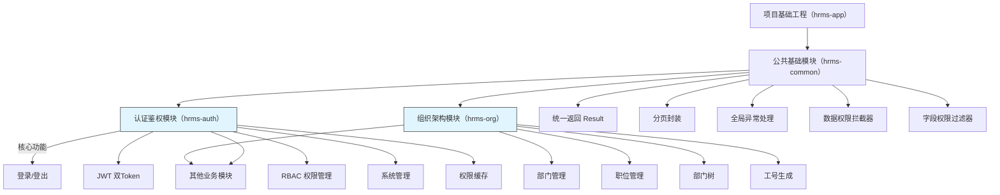
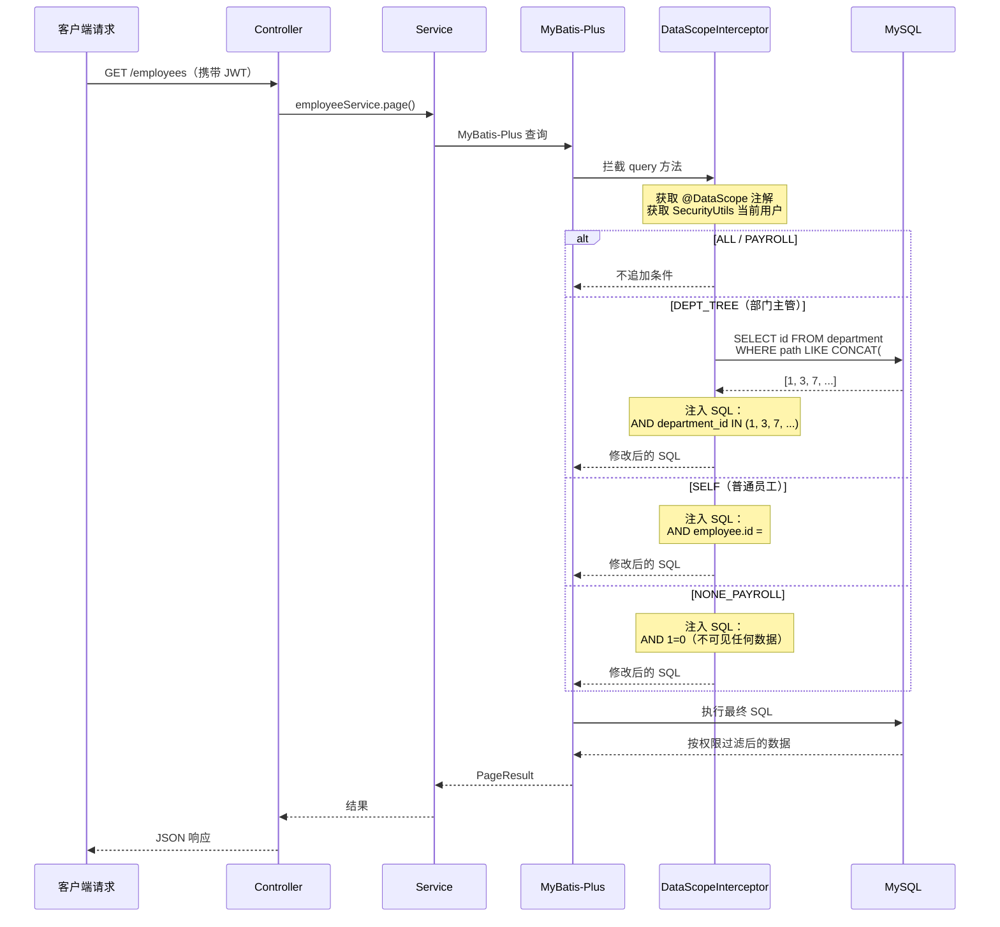
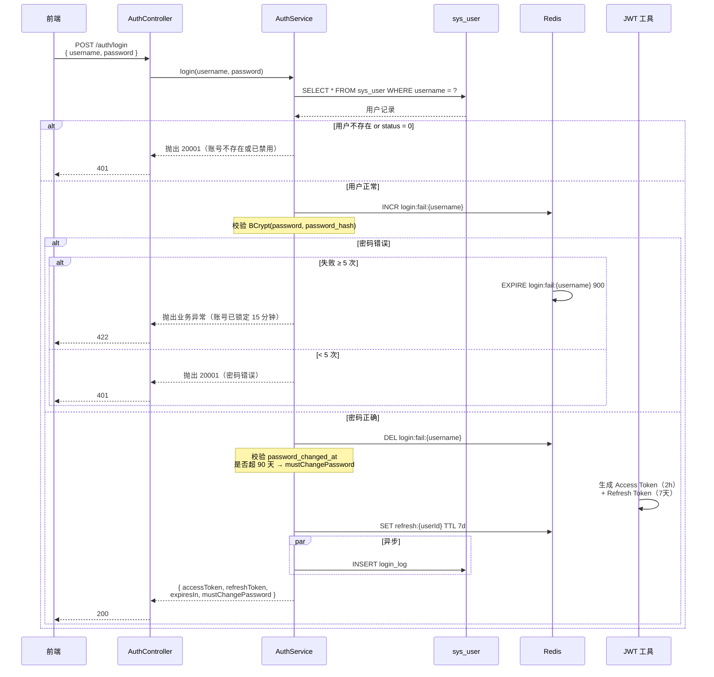
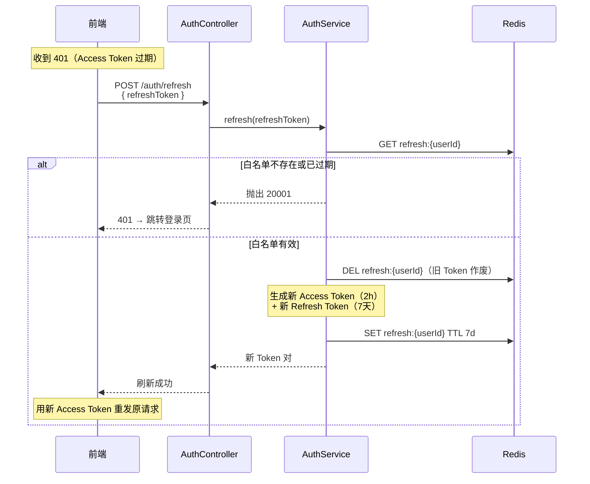
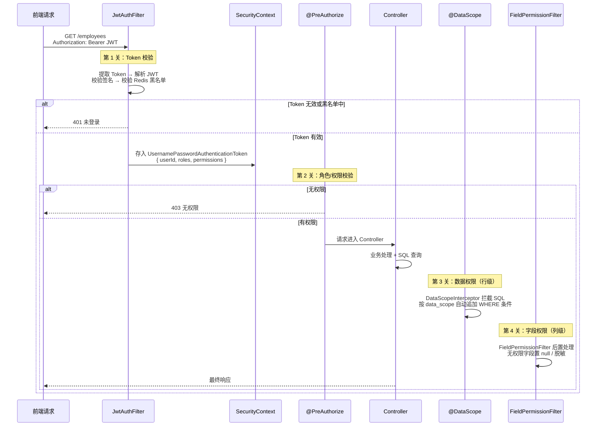
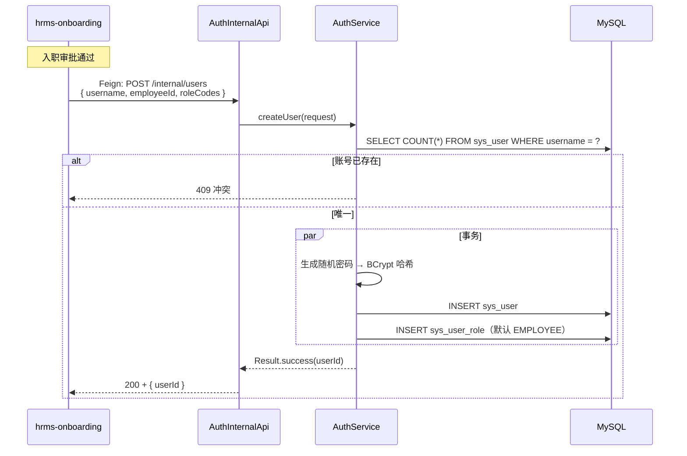
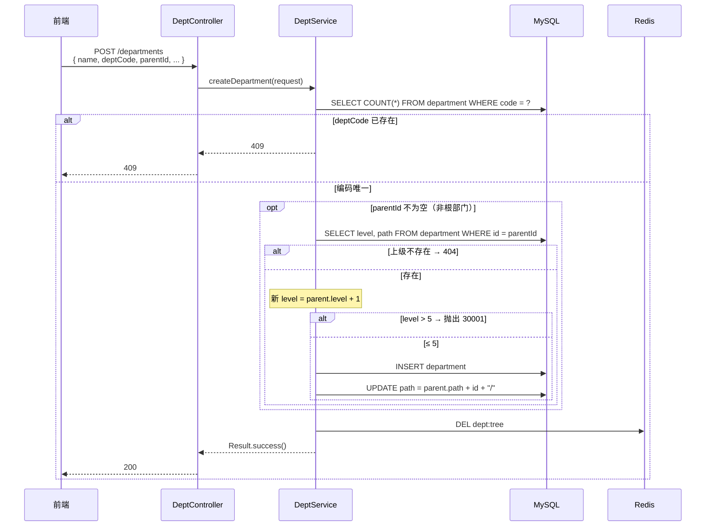
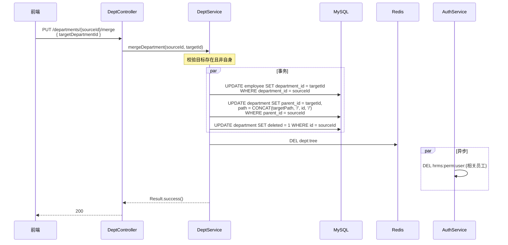
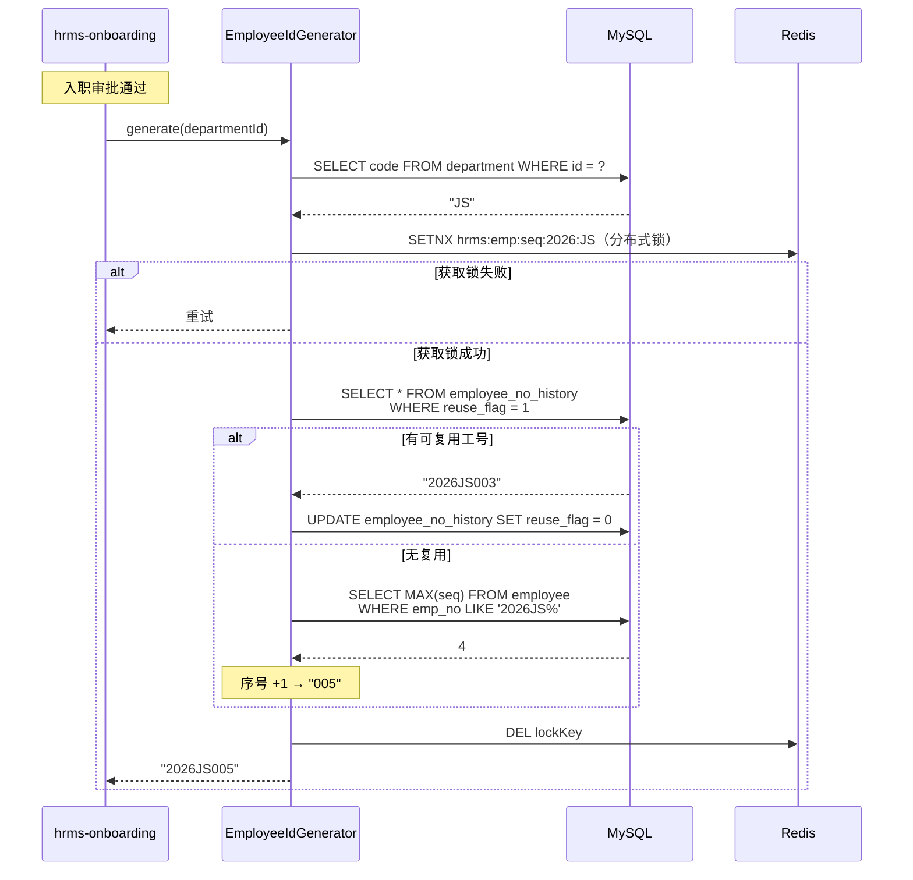
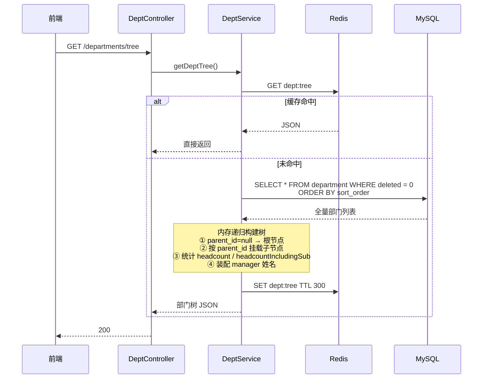

# 李俊毅 负责模块 · 后端系统分析文档

> **文档版本**：v2.0.0  
> **锚定版本**：《HRMS-Backend-System-Design(2)(2)(3).md》v1.8.2（总系分）  
> **PRD 依据**：《人资管理系统-PRD.md》v1.0  
> **目标读者**：后端开发（李俊毅）、DBA、测试、架构评审

---

## 修订记录

| 日期 | 版本 | 修订说明 | 修改人 |
|------|------|---------|--------|
| 2026-07-13 | v2.0.0 | 结构重构：按功能总览 → 模块详解 → 关键设计三层组织，补充时序图 | 李俊毅 |
| 2026-07-13 | v1.1.1 | 对齐总系分：表名/字段/路径枚举/API字段名统一 | 李俊毅 |
| 2026-07-13 | v1.1.0 | 新增 hrms-org 组织架构模块 | 李俊毅 |
| 2026-07-13 | v1.0.0 | 初稿，覆盖 hrms-app / hrms-common / hrms-auth | 李俊毅 |

---

# 一、项目概述

## 1.1 项目背景

目前公司内部人力资源管理依赖 Excel 和纸质流程，存在数据分散、算薪效率低、审批不透明等问题。本系统旨在建立统一的员工数字化档案，实现入转调离全流程线上化，提供 REST API 支撑管理后台与员工门户。

**五大用户角色：**

| 角色 | 核心需求 | 使用频率 |
|------|---------|---------|
| HR 专员 | 员工档案管理、薪资核算、考勤统计 | 每日 |
| 部门主管 | 团队人员情况查看、下属请假审批 | 每日 |
| 普通员工 | 查看个人信息、提交请假、查看工资条 | 每周 |
| 财务专员 | 薪资审核、成本报表 | 每月 |
| 系统管理员 | 权限配置、系统维护 | 低频 |

**架构策略：** 模块化单体（Modular Monolith）——按包划分边界，降低运维成本，预留拆分接口。

## 1.2 相关资料

| 文档 | 说明 |
|------|------|
| 《人资管理系统-PRD.md》v1.0 | 产品需求文档，定义业务规则与流程 |
| 《HRMS-Backend-System-Design(2)(2)(3).md》v1.8.2 | 总系分，技术架构与接口契约 |
| 《HRMS-API-Contract.md》v1.0.0 | API 契约锚点，错误码/枚举/路径权威来源 |
| 《HRMS-Frontend-System-Design(1)(2)(1).md》v1.8.3 | 前端系分，路径零偏差 |

## 1.3 负责范围

全项目共 8 个子模块，我负责 项目的组织架构和**PRD §2 权限体系 + §3 组织架构管理**：

| 模块 | 定位 | PRD 对应 |
|------|------|---------|
| **hrms-app**（父工程） | 顶层 POM，统一依赖版本、插件、部署规则 | — |
| **hrms-common**（公共模块） | 全项目共享能力：返回格式、异常处理、数据权限拦截器、字段权限过滤器、工具类、枚举 | — |
| **hrms-auth**（认证鉴权） | 登录认证、JWT 令牌、RBAC 权限管理、系统管理（用户/角色/权限） | **PRD §2 权限体系** |
| **hrms-org**（组织架构） | 部门管理（树形结构、层级校验、合并）、职位管理（M/P/S 序列） | **PRD §3 组织架构管理** |

其余 4 个模块（hrms-employee、hrms-approval、hrms-attendance、hrms-payroll、hrms-gateway）由其他组员负责。

---

# 二、功能模块总览

## 2.1 功能模块树



> **说明：** 蓝色高亮为我负责的模块。`hrms-common` 被所有模块依赖，`hrms-auth` 和 `hrms-org` 为其他业务模块提供鉴权和基础数据支撑。

## 2.2 核心功能说明

### 2.2.1 权限体系（PRD §2）

描述系统权限控制涉及的功能与场景。

本模块核心功能包括：

- **角色定义**：预置五大角色（系统管理员、HR专员、部门主管、财务专员、普通员工），各角色拥有独立的数据范围
- **数据权限控制**：不同角色看到不同范围的数据——HR专员看全部，部门主管看本部门及下属，普通员工仅本人，系统管理员看不到薪资数据
- **字段级权限**：同一员工档案，不同角色对敏感字段（身份证号、薪资信息、紧急联系人、银行卡号）的可见性不同
- **页面/按钮权限**：前端根据权限码动态渲染菜单和按钮，无权限的菜单自动隐藏
- **双Token认证**：Access Token（30分钟）+ Refresh Token（7天）+ 登出黑名单，兼顾安全与体验
- **登录安全策略**：BCrypt 成本因子12、5次失败锁定15分钟、90天密码轮换、首次登录强制改密、30分钟无操作自动登出

### 2.2.2 组织架构管理（PRD §3）

描述组织架构管理涉及的功能与场景。

本模块核心功能包括：

- **部门树管理**：树形结构（`parent_id` + `path` 路径枚举），最大深度5级，支持增删改查和部门合并
- **部门负责人**：指定部门负责人，直接决定部门主管的数据权限范围（DEPT_TREE）
- **部门人数统计**：实时统计各部门在职人数（含下属部门累加），统计口径为试用期+正式员工
- **职位管理**：三种职位序列（管理序列M1-M5、专业序列P1-P10、支持序列S1-S5），支持职级范围校验
- **默认试用期**：职位配置默认试用期，发起入职时自动填充
- **工号生成**：按"年份(4位)+部门编码(2位)+序号(3位)"规则自动生成，支持已释放工号复用

---

# 三、模块详解

## 3.1 hrms-common 公共基础模块

### 3.1.1 模块定位

`hrms-common` 为全项目公共模块，包路径 `com.hrms.common`。**所有业务模块直接依赖本模块**，本模块**不依赖**任何业务模块。

### 3.1.2 核心组件

#### 统一返回结果 `Result<T>`

```java
public class Result<T> implements Serializable {
    private int code;          // 业务码，0=成功
    private String message;    // 提示信息
    private T data;            // 数据体
    private String traceId;    // 链路追踪 ID（UUID）
    private long timestamp;    // 时间戳（ms）

    public static <T> Result<T> success(T data) { /* code=0, message="success" */ }
    public static <T> Result<T> error(int code, String message) { /* 业务异常 */ }
}
```

#### 分页封装 `PageParam` / `PageResult`

```java
// 请求分页参数
public class PageParam {
    @Min(1) private int page = 1;
    @Min(1) @Max(100) private int pageSize = 20;
}

// 统一分页响应
public class PageResult<T> implements Serializable {
    private List<T> list;
    private long total;
    private int page;
    private int pageSize;
}
```

#### 全局异常处理器

| 异常 | 错误码 | 前端表现 |
|------|--------|---------|
| `MethodArgumentNotValidException` | 10001 | 参数校验失败 |
| `BusinessException` | 业务码 | 后端返回的 message |
| `UnauthorizedException` | 20001 | 未登录或 Token 过期 → 跳登录 |
| `AccessDeniedException` | 20002 | 无权限 |
| `Exception`（兜底） | 90001 | 系统内部错误 |

#### 工具类

| 工具类 | 用途 |
|--------|------|
| `SecurityUtils` | 获取当前登录用户 `LoginUser`（从 JWT 解析的 ThreadLocal） |
| `AesEncryptUtil` | AES-256-GCM 加密/解密（身份证、银行卡） |
| `Sha256HashUtil` | SHA-256 加盐哈希（身份证号检索用） |
| `TraceIdUtil` | traceId 生成与 MDC 注入 |

#### 注解定义

| 注解 | 用途 |
|------|------|
| `@DataScope` | 行级数据权限，指定 SQL 别名字段 |
| `@FieldPermission` | 字段级权限标记 |

#### 常量与业务枚举

| 枚举 | 用途 |
|------|------|
| `EmploymentStatus` | 在职状态（probation/regular/pending_resign/resigned） |
| `OnboardType` | 用工类型（fulltime/parttime/intern） |
| `ContractType` | 合同类型（FIXED/UNFIXED/LABOR） |
| `LeaveType` | 请假类型（ANNUAL/SICK/PERSONAL/...） |
| `ShiftType` | 班制类型（fixed/flexible/schedule） |
| `ProcessType` | 审批类型（ONBOARDING/REGULARIZATION/...） |
| `DataScopeType` | 数据范围（ALL/DEPT_TREE/SELF/PAYROLL/NONE_PAYROLL） |
| `PositionSequence` | 职位序列（M/P/S） |

#### 通用数据库审计字段

所有业务表统一含 `id`、`created_at`、`updated_at`、`deleted`（可选），由 MyBatis-Plus `MetaObjectHandler` 自动填充。

### 3.1.3 数据权限拦截器

**功能：** 拦截 MyBatis 查询，根据当前用户的 `data_scope` 自动追加 SQL 过滤条件。**对业务代码零侵入。**

**数据权限拦截时序：**



**简化实现代码：**

```java
@Component
@Intercepts({@Signature(type = Executor.class, method = "query", ...)})
public class DataScopeInterceptor implements Interceptor {
    @Override
    public Object intercept(Invocation invocation) throws Throwable {
        DataScope scope = getDataScopeAnnotation();
        if (scope == null) return invocation.proceed();

        LoginUser user = SecurityUtils.getCurrentUser();
        String sqlFragment = switch (user.getDataScope()) {
            case "ALL", "PAYROLL" -> "";
            case "DEPT_TREE" -> buildDeptScopeSql(user.getDeptId());
            case "SELF" -> " AND employee.id = " + user.getEmployeeId();
            default -> " AND 1=0";
        };
        DataScopeContext.set(sqlFragment);
        return invocation.proceed();
    }
}
```

**DEPT_TREE 模式 SQL 注入：**

```sql
AND department_id IN (
    SELECT id FROM department
    WHERE path LIKE CONCAT((SELECT path FROM department WHERE id = #{deptId}), '%')
      AND deleted = 0
)
```

### 3.1.4 字段权限过滤器

**功能：** 对返回结果做后置处理，无权限的字段置 null 或脱敏。

**字段权限矩阵（PRD §2.3）：**

| 字段 | HR 专员 | 部门主管 | 普通员工（本人） |
|------|---------|---------|----------------|
| 姓名 | 查看 | 查看 | 查看 |
| 手机号 | 查看 | 查看 | 查看 |
| 身份证号 | 查看 | 不可见 | 查看 |
| 薪资信息 | 查看 | 不可见 | 查看 |
| 紧急联系人 | 查看 | 不可见 | 查看 |
| 银行卡号 | 查看 | 不可见 | 查看 |

### 3.1.5 数据库设计

公共基础模块不涉及独立的业务模块表，但提供以下全项目共享的基础数据表：

**`operation_log` — 操作审计日志**

```sql
CREATE TABLE operation_log (
    id          BIGINT PRIMARY KEY AUTO_INCREMENT,
    user_id     BIGINT       NOT NULL,
    module      VARCHAR(32)  NOT NULL,
    action      VARCHAR(32)  NOT NULL,
    target_id   VARCHAR(64)  NULL,
    request_ip  VARCHAR(45)  NOT NULL,
    detail      JSON         NULL,
    created_at  DATETIME     NOT NULL DEFAULT CURRENT_TIMESTAMP,
    KEY idx_user_time (user_id, created_at)
) COMMENT='操作审计日志，PRD §11.2';
```

**`sys_dict` — 数据字典**

```sql
CREATE TABLE sys_dict (
    id          BIGINT PRIMARY KEY AUTO_INCREMENT,
    dict_type   VARCHAR(32) NOT NULL,
    dict_code   VARCHAR(32) NOT NULL,
    dict_label  VARCHAR(64) NOT NULL,
    sort_order  INT         NOT NULL DEFAULT 0,
    created_at  DATETIME    NOT NULL DEFAULT CURRENT_TIMESTAMP,
    updated_at  DATETIME    NOT NULL DEFAULT CURRENT_TIMESTAMP ON UPDATE CURRENT_TIMESTAMP,
    UNIQUE KEY uk_type_code (dict_type, dict_code)
) COMMENT='数据字典';
```

**`import_batch` — 导入批次**

```sql
CREATE TABLE import_batch (
    id              BIGINT PRIMARY KEY AUTO_INCREMENT,
    import_type     VARCHAR(16) NOT NULL COMMENT 'DEPT/EMPLOYEE/SALARY/ATTENDANCE_SUMMARY',
    file_name       VARCHAR(256) NOT NULL,
    total_rows      INT NOT NULL DEFAULT 0,
    success_rows    INT NOT NULL DEFAULT 0,
    fail_rows       INT NOT NULL DEFAULT 0,
    status          VARCHAR(16) NOT NULL COMMENT 'VALIDATING/VALIDATED/COMMITTED/FAILED',
    created_by      BIGINT NOT NULL,
    created_at      DATETIME NOT NULL DEFAULT CURRENT_TIMESTAMP,
    updated_at      DATETIME NOT NULL DEFAULT CURRENT_TIMESTAMP ON UPDATE CURRENT_TIMESTAMP,
    KEY idx_type_status (import_type, status)
) COMMENT='导入批次';
```

**`import_row_error` — 导入错误行**

```sql
CREATE TABLE import_row_error (
    id              BIGINT PRIMARY KEY AUTO_INCREMENT,
    batch_id        BIGINT NOT NULL,
    row_index       INT NOT NULL COMMENT 'Excel 行号',
    column_name     VARCHAR(64) NULL COMMENT '出错的列',
    error_message   VARCHAR(512) NOT NULL,
    raw_data_json   JSON NULL COMMENT '该行原始数据',
    KEY idx_batch (batch_id)
) COMMENT='导入错误行';
```

---

## 3.2 hrms-auth 认证鉴权模块

### 3.2.1 模块定位

包路径 `com.hrms.auth`，对应 **PRD §2 权限体系**，职责涵盖：登录认证、JWT 令牌签发与校验、RBAC 权限管理（用户/角色/权限维护）、动态路由菜单、操作审计日志。

### 3.2.2 数据库设计

#### 表清单

| 表 | 用途 | 分类 |
|---|------|------|
| `sys_user` | 系统用户（账号+密码） | RBAC 核心 |
| `sys_role` | 角色定义（含 data_scope） | RBAC 核心 |
| `sys_permission` | 权限/菜单定义 | RBAC 核心 |
| `sys_user_role` | 用户-角色关联 | RBAC 关联 |
| `sys_role_permission` | 角色-权限关联 | RBAC 关联 |
| `login_log` | 登录日志 | 审计 |
| `operation_log` | 操作审计日志 | 审计 |
| `sys_dict` | 数据字典 | 基础数据 |

#### 核心表 DDL

**`sys_user` — 系统用户表**

```sql
CREATE TABLE sys_user (
    id              BIGINT PRIMARY KEY AUTO_INCREMENT,
    username        VARCHAR(32)  NOT NULL COMMENT '手机号（登录账号）',
    password_hash   VARCHAR(128) NOT NULL,
    password_changed_at DATETIME NOT NULL DEFAULT CURRENT_TIMESTAMP COMMENT 'PRD §11.2 90天轮换',
    employee_id     BIGINT       NULL,
    status          TINYINT      NOT NULL DEFAULT 1 COMMENT '1=启用 0=禁用',
    created_at      DATETIME     NOT NULL DEFAULT CURRENT_TIMESTAMP,
    updated_at      DATETIME     NOT NULL DEFAULT CURRENT_TIMESTAMP ON UPDATE CURRENT_TIMESTAMP,
    UNIQUE KEY uk_username (username)
);
```

**`sys_role` — 角色表**

```sql
CREATE TABLE sys_role (
    id          BIGINT PRIMARY KEY AUTO_INCREMENT,
    code        VARCHAR(32) NOT NULL,
    name        VARCHAR(64) NOT NULL,
    data_scope  VARCHAR(16) NOT NULL COMMENT 'ALL/DEPT_TREE/SELF/PAYROLL/NONE_PAYROLL',
    created_at  DATETIME    NOT NULL DEFAULT CURRENT_TIMESTAMP,
    updated_at  DATETIME    NOT NULL DEFAULT CURRENT_TIMESTAMP ON UPDATE CURRENT_TIMESTAMP,
    UNIQUE KEY uk_code (code)
);
```

**预置角色数据（PRD §2.1）：**

| role.code | data_scope | 说明 |
|-----------|-----------|------|
| SYS_ADMIN | NONE_PAYROLL | 全平台；**不可访问薪资模块**（双拦截） |
| HR_STAFF | ALL | HR 专员：全部员工+薪资全量 |
| DEPT_MANAGER | DEPT_TREE | 部门主管：本部门及下属 |
| FINANCE | PAYROLL | 财务专员：仅薪资相关 |
| EMPLOYEE | SELF | 普通员工：仅本人 |

**`sys_permission` — 权限/菜单表**

```sql
CREATE TABLE sys_permission (
    id      BIGINT PRIMARY KEY AUTO_INCREMENT,
    code    VARCHAR(64) NOT NULL COMMENT '权限唯一标识，如 employee:create',
    name    VARCHAR(64) NOT NULL COMMENT '权限中文名，如"新增员工"',
    module  VARCHAR(32) NOT NULL COMMENT '归属模块：auth/org/employee/...',
    type    VARCHAR(16) NOT NULL COMMENT 'MENU/BUTTON/API',
    created_at  DATETIME    NOT NULL DEFAULT CURRENT_TIMESTAMP,
    updated_at  DATETIME    NOT NULL DEFAULT CURRENT_TIMESTAMP ON UPDATE CURRENT_TIMESTAMP,
    UNIQUE KEY uk_code (code)
);
```

**`sys_user_role` — 用户角色关联**

```sql
CREATE TABLE sys_user_role (
    user_id    BIGINT NOT NULL,
    role_id    BIGINT NOT NULL,
    created_at DATETIME NOT NULL DEFAULT CURRENT_TIMESTAMP,
    PRIMARY KEY (user_id, role_id)
);
```

**`sys_role_permission` — 角色权限关联**

```sql
CREATE TABLE sys_role_permission (
    role_id       BIGINT NOT NULL,
    permission_id BIGINT NOT NULL,
    created_at    DATETIME NOT NULL DEFAULT CURRENT_TIMESTAMP,
    PRIMARY KEY (role_id, permission_id)
);
```

**`login_log` — 登录日志**

```sql
CREATE TABLE login_log (
    id              BIGINT PRIMARY KEY AUTO_INCREMENT,
    user_id         BIGINT       NOT NULL,
    login_time      DATETIME     NOT NULL DEFAULT CURRENT_TIMESTAMP,
    login_ip        VARCHAR(45)  NOT NULL,
    user_agent      VARCHAR(512) NULL,
    device          VARCHAR(64)  NULL COMMENT '解析自 UA',
    location        VARCHAR(64)  NULL COMMENT 'IP 归属地，可选',
    success         TINYINT      NOT NULL COMMENT '1=成功 0=失败',
    fail_reason     VARCHAR(64)  NULL,
    KEY idx_user_time (user_id, login_time)
) COMMENT='登录日志，PRD §9.5';
```

#### 索引设计

| 表 | 索引 | 用途 |
|-----|------|------|
| `sys_user` | `uk_username` | 登录账号唯一 |
| `sys_role` | `uk_code` | 角色编码唯一 |
| `sys_permission` | `uk_code` | 权限编码唯一 |
| `login_log` | `idx_user_time` | 登录日志按用户+时间查询 |
| `operation_log` | `idx_user_time` | 操作审计日志查询 |

### 3.2.3 核心业务流程

#### 登录流程



#### Token 刷新流程



#### 权限校验链 — 请求四道关卡



#### 内部创建用户流程（入职审批通过后）



### 3.2.4 API 设计

> **Base URL**：`/api/v1`  
> **统一响应**：`{ "code": 0, "message": "success", "data": {}, "traceId": "...", "timestamp": ... }`

#### 认证接口

| 方法 | 路径 | 说明 | 鉴权 |
|------|------|------|------|
| POST | `/auth/login` | 登录 → `{ accessToken, refreshToken, expiresIn, mustChangePassword }` | 否 |
| POST | `/auth/logout` | 登出（Token 加入 Redis 黑名单） | 是 |
| POST | `/auth/refresh` | 刷新 Token | 否（凭 RefreshToken） |
| GET | `/auth/profile` | 当前用户信息+权限+dataScope | 是 |
| PUT | `/auth/password` | 修改密码 | 是 |
| PUT | `/auth/mobile` | 绑定手机 | 是 |
| DELETE | `/auth/mobile` | 解绑手机 | 是 |
| POST | `/auth/verify` | 工资条二次验证 | 是 |

**`POST /auth/login` — 登录**

请求体：

| 字段 | 必填 | 类型 | 校验 |
|------|------|------|------|
| username | Y | string | 11 位手机号或工号格式 |
| password | Y | string | BCrypt 校验；≥8位，含大小写+数字 |

响应体：

| 字段 | 说明 | 类型 |
|------|------|------|
| accessToken | JWT Access Token（2h） | string |
| refreshToken | Refresh Token（7天） | string |
| expiresIn | 有效期（固定 7200） | number |
| mustChangePassword | 首次登录强制改密 | boolean |

业务逻辑：
1. 查询 `sys_user`，校验 `status=1`
2. BCrypt 校验密码
3. 失败 ≥5 次 → Redis 锁定 15 分钟
4. 校验密码是否超 90 天 → `mustChangePassword`
5. 签发 JWT Access Token（2h）+ Refresh Token（7d）
6. 异步写入 `login_log`

**`POST /auth/logout` — 登出**

业务逻辑：
1. 解析 JWT 获取 `jti`
2. 写入 Redis `token:blacklist:{jti}` TTL 2h
3. 清除 Refresh Token 白名单

**`POST /auth/refresh` — 刷新 Token**

业务逻辑：
1. 校验 Refresh Token 有效性（Redis 白名单）
2. 轮换签发新 Access Token + 新 Refresh Token
3. 旧 Refresh Token 失效

**`GET /auth/profile` — 当前用户信息**

响应体：

| 字段 | 说明 | 类型 |
|------|------|------|
| userId | 用户 ID | number |
| employeeId | 员工 ID | number |
| roles | 角色 code 列表 | string[] |
| permissions | 权限码 | string[] |
| dataScope | ALL/DEPT_TREE/SELF/PAYROLL/NONE_PAYROLL | string |
| mustChangePassword | 首次登录强制改密 | boolean |
| passwordExpiredAt | 密码过期时间 YYYY-MM-DD | string |

**`PUT /auth/password` — 修改密码**

请求体：

| 字段 | 必填 | 类型 | 说明 |
|------|------|------|------|
| oldPassword | Y | string | 当前密码，BCrypt 校验 |
| newPassword | Y | string | 新密码，≥8位，含大小写+数字 |
| confirmPassword | Y | string | 确认新密码 |

业务逻辑：
1. BCrypt 校验旧密码
2. 校验新密码强度
3. 更新 `password_hash` + `password_changed_at`
4. 若 `mustChangePassword=true` 则清除标志

> **同服务别名：** `PUT /profile/security/password`

**`PUT /auth/mobile` — 绑定手机**

请求体：

| 字段 | 必填 | 类型 | 说明 |
|------|------|------|------|
| mobile | Y | string | 新手机号，11位，唯一 |
| smsCode | Y | string | 短信验证码 |

> **同服务别名：** `POST /profile/security/mobile/bind`

**`DELETE /auth/mobile` — 解绑手机**

请求体：

| 字段 | 必填 | 类型 | 说明 |
|------|------|------|------|
| smsCode | Y | string | 短信验证码 |

> **注意：** 变更手机号不走此接口，须走 `POST /profile/mobile-change-applications` 审批。

> **同服务别名：** `DELETE /profile/security/mobile`

**`POST /auth/verify` — 工资条二次验证**

请求体：

| 字段 | 必填 | 类型 | 说明 |
|------|------|------|------|
| verifyType | Y | string | PASSWORD / SMS |
| verifyCode | Y | string | 密码或验证码 |

业务逻辑：
1. 校验验证码
2. 通过后 Redis `hrms:payslip:verified:{userId}` TTL 30min
3. 验证失败 → 错误码 **60004**

> **同服务别名：** `POST /profile/payslips/verify`

#### 系统管理接口

| 方法 | 路径 | 说明 | 权限 |
|------|------|------|------|
| GET | `/workbench/summary` | 工作台 Dashboard | HR_STAFF+ |
| GET/POST/PUT | `/system/users` `/system/users/{id}` | 用户管理（分页/创建/修改） | SYS_ADMIN |
| GET/PUT | `/system/roles` `/system/roles/{id}/permissions` | 角色列表/权限配置 | SYS_ADMIN |
| GET | `/system/operation-logs` | 操作审计日志 | SYS_ADMIN |
| GET | `/system/login-logs` | 登录日志（管理端全量） | SYS_ADMIN |
| POST | `/system/backup` | 数据备份 | SYS_ADMIN |

**`GET /workbench/summary` — 工作台 Dashboard**

```json
{
    "totalEmployees": 156,
    "newHiresThisMonth": 5,
    "pendingApprovals": 12,
    "attendanceAnomalies": 3,
    "todayPunchRate": 0.92,
    "departmentStats": [
        { "deptName": "技术部", "headcount": 45 }
    ]
}
```

**`POST /system/users` — 创建用户**

请求体：

| 字段 | 必填 | 类型 | 说明 |
|------|------|------|------|
| username | Y | string | 手机号 |
| employeeId | Y | number | 员工 ID |
| roleIds | Y | number[] | 角色 ID 列表 |
| password | N | string | 不传则随机生成+首次改密 |

#### 内部 Feign 接口

| 方法 | 路径 | 说明 | 调用方 |
|------|------|------|--------|
| POST | `/internal/users` | 创建系统账号 | hrms-employee（入职） |
| PUT | `/internal/users/{id}/status` | 启用/禁用用户 | hrms-employee（离职） |
| PUT | `/internal/users/{id}/username` | 同步用户名 | hrms-employee（手机号变更） |

**Feign 接口定义：**

```java
@FeignClient(name = "hrms-auth", path = "/internal")
public interface AuthInternalApi {
    @PostMapping("/users")
    Result<Long> createUser(@RequestBody CreateUserRequest request);
    
    @PutMapping("/users/{id}/status")
    Result<Void> updateStatus(@PathVariable Long id, @RequestParam Integer status);
}
```

### 3.2.5 JWT 鉴权流程

**JWT 结构：**

```json
{
  "sub": "userId",
  "empId": 12345,
  "roles": ["HR_STAFF"],
  "exp": 1700000000,
  "jti": "uuid"
}
```

**鉴权流程示意（含无操作超时检测）：**

```
┌──────────┐      ┌──────────────┐      ┌──────────────┐      ┌───────────┐
│ 客户端     │      │ AuthFilter    │      │  Spring       │      │  Redis     │
│ (前端 SPA) │      │ (JwtAuthFilter)│      │  Security     │      │           │
└─────┬────┘      └──────┬───────┘      └──────┬───────┘      └─────┬─────┘
      │ POST /auth/login  │                     │                     │
      │──────────────────>│                     │                     │
      │                   │ 认证成功签发 JWT     │                     │
      │<──────────────────│                     │                     │
      │                   │                     │                     │
      │ GET /employees    │                     │                     │
      │ (Bearer <JWT>)    │                     │                     │
      │──────────────────>│                     │                     │
      │                   │ 1. 解析 JWT          │                     │
      │                   │ 2. 校验签名+过期      │                     │
      │                   │ 3. 黑名单检查          │                     │
      │                   │──────────────────────│────────────────────>│
      │                   │ 4. 校验无操作超时     │                     │
      │                   │── GET user:last-active:{userId} ──────────>│
      │                   │<──── (存在 / 不存在) ─────────────────────│
      │                   │                     │                     │
      │                   │◇ 不存在 → 返回 401    │                     │
      │<──────────────────│   "登录已过期"        │                     │
      │                   │                     │                     │
      │                   │◇ 存在 → 继续         │                     │
      │                   │ 5. SETEX 更新活      │                     │
      │                   │── SETEX user:last-active ────────────────>│
      │                   │   (重置 30min TTL)   │                     │
      │                   │─────────────────────>│                     │
      │                   │ 6. 存入 SecurityContext                   │
      │                   │─────────────────────>│                     │
      │                   │                     │ 7. @PreAuthorize     │
      │                   │                     │ 8. @DataScope        │
      │                   │                     │ 9. Controller        │
      │                   │<─────────────────────│                     │
      │<──────────────────│                     │                     │
```

**JwtAuthenticationFilter 关键步骤：**
1. 从 Header 提取 `Authorization: Bearer <token>`
2. 解析 JWT → 获取 userId, empId, roles
3. 校验 Redis 黑名单 `token:blacklist:{jti}`
4. 校验无操作超时（30min） — **见下方"无操作超时检测"详细说明**
5. 更新最后活跃时间 — `SETEX user:last-active:{userId} 1800 now`
6. 构造 `UsernamePasswordAuthenticationToken` 存入 SecurityContext

---

**无操作超时检测（第4步）详细设计：**

```
┌─────────────────────────────────────────────────────────────┐
│              无操作超时检测流程                               │
├─────────────────────────────────────────────────────────────┤
│                                                               │
│  请求进入 JwtAuthenticationFilter                             │
│    ↓                                                          │
│  ① GET redis: user:last-active:{userId}                       │
│    ↓                                                          │
│  ② 判断 Key 是否存在？                                        │
│    ├── 存在 → 未超时，继续                                     │
│    └── 不存在（Key 已过期或被删除）→                           │
│         返回 401 + code=20001，message="登录已过期，请重新登录" │
│    ↓                                                          │
│  ③ 第5步更新 Key（SETEX 1800），重置 30 分钟倒计时             │
│                                                               │
└─────────────────────────────────────────────────────────────┘
```

**实现说明：**

| 项 | 说明 |
|---|------|
| Redis Key | `user:last-active:{userId}` |
| 值 | 最后活跃时间戳（ms） |
| TTL | 1800 秒（30 分钟） |
| 写入时机 | 每次合法请求通过 JwtAuthFilter 时，SETEX 更新 |
| 删除时机 | 用户主动登出时 DEL 该 Key |
| 过期效果 | 30 分钟内无任何请求 → Redis 自动删除 Key → 下次请求第4步判定超时 |
| 兜底关系 | 前端 idleDetector 主动登出后，该 Key 残留在 Redis 中，残留有效期内再次发起请求时会被第5步更新续期 → 后端仍会允许；故前端登出时应主动调 `/auth/logout` 清除此 Key |

**与前端 idle 检测的协作关系：**

```
安全保障层级：
  第一层（最快响应）：前端 idleDetector → 30分钟到 → 立即跳登录页
  第二层（后端兜底）：Redis user:last-active 过期 → 下次请求返回 401
  第三层（硬性过期）：accessToken 的 exp 到达 → JWT 校验失败

时间轴：
  第 0 分钟  用户最后一次操作
  第 30 分钟  user:last-active TTL 归零 → Key 被 Redis 删除
  第 30~30+  若前端因某种原因未登出，且此时有请求到达
               → JwtAuthFilter 第4步发现 Key 不存在
               → 返回 401，前端收到后跳登录页
```

**简化实现代码：**

```java
// JwtAuthenticationFilter.java — 校验无操作超时
@Override
protected void doFilterInternal(HttpServletRequest request,
                                HttpServletResponse response,
                                FilterChain chain) {
    // ... 前置步骤：解析 JWT、校验黑名单 ...

    // 第 4 步：校验无操作超时
    String lastActiveKey = "user:last-active:" + userId;
    Boolean keyExists = redisTemplate.hasKey(lastActiveKey);
    
    if (Boolean.FALSE.equals(keyExists)) {
        // 30 分钟内无任何请求 → 判定超时
        response.setStatus(401);
        response.setContentType("application/json;charset=UTF-8");
        response.getWriter().write(JSON.toJSONString(
            Result.error(20001, "登录已过期，请重新登录")
        ));
        return;
    }
    
    // 第 5 步：更新最后活跃时间（重置 30 分钟 TTL）
    redisTemplate.opsForValue().set(lastActiveKey,
        String.valueOf(System.currentTimeMillis()),
        1800, TimeUnit.SECONDS);
    
    // 第 6 步：存入 SecurityContext
    // ...
}
```

### 3.2.6 权限缓存设计

| Key | TTL | 用途 | 失效时机 |
|-----|-----|------|---------|
| `user:permissions:{userId}` | 10min | 用户权限码缓存 | 角色/权限变更 → 删 Key |
| `hrms:perm:user:{userId}` | 30min | 完整权限 JSON | 角色/部门变动 → 删 Key |
| `token:blacklist:{jti}` | 2h | 登出 Token 黑名单 | 自动过期 |
| `refresh:{userId}` | 7d | Refresh Token 白名单 | 登出/刷新时清除 |
| `login:fail:{username}` | 15min | 登录失败计数器 | 达到 5 次锁定 |
| `user:last-active:{userId}` | 30min | 最后活跃时间戳 | 无操作超时检测（TLL 归零 → 判定 idle）|

> **设计要点：** 权限变更后立即删除 Redis Key，下次请求自动重新加载，**操作即生效，无需重新登录**。

---

## 3.3 hrms-org 组织架构模块

### 3.3.1 模块定位

包路径 `com.hrms.org`，对应 **PRD §3 组织架构管理**，职责涵盖：部门管理（树形结构、层级校验、合并、人数统计）、职位管理（M/P/S 序列、职级范围）、部门树缓存。

**与权限体系的关联：** 部门的 **负责人字段**（`head_employee_id`）决定部门主管的数据权限范围（DEPT_TREE），部门树缓存被 `DataScopeInterceptor` 引用。

### 3.3.2 数据库设计

#### `department` — 部门表

> 采用 `parent_id` + `path` 路径枚举方案，**不建闭包表**（总系分 §A.3.2.1）。

```sql
CREATE TABLE department (
    id                BIGINT PRIMARY KEY AUTO_INCREMENT,
    name              VARCHAR(64)  NOT NULL COMMENT '部门名称',
    code              VARCHAR(8)   NOT NULL COMMENT '部门编码（工号生成用）',
    parent_id         BIGINT       NULL COMMENT '上级部门ID，NULL=根',
    path              VARCHAR(256) NOT NULL COMMENT '路径枚举，如 /1/3/7/，深度≤5',
    level             TINYINT      NOT NULL DEFAULT 1 COMMENT '层级 1~5',
    head_employee_id  BIGINT       NULL COMMENT '部门负责人 employee_id，决定数据权限',
    sort_order        INT          NOT NULL DEFAULT 0 COMMENT '排序序号',
    description       VARCHAR(256) NULL,
    deleted           TINYINT      NOT NULL DEFAULT 0,
    created_at        DATETIME     NOT NULL DEFAULT CURRENT_TIMESTAMP,
    updated_at        DATETIME     NOT NULL DEFAULT CURRENT_TIMESTAMP ON UPDATE CURRENT_TIMESTAMP,
    UNIQUE KEY uk_code (code),
    KEY idx_parent (parent_id),
    KEY idx_path (path(64))
) COMMENT='部门表，PRD §3.1';
```

#### `position` — 职位表

```sql
CREATE TABLE position (
    id                       BIGINT PRIMARY KEY AUTO_INCREMENT,
    name                     VARCHAR(64)  NOT NULL COMMENT '职位名称',
    sequence                 VARCHAR(4)   NOT NULL COMMENT 'M/P/S',
    department_id            BIGINT       NULL COMMENT 'NULL=全公司通用',
    rank_min                 VARCHAR(8)   NOT NULL COMMENT '职级范围-最小值，如P1',
    rank_max                 VARCHAR(8)   NOT NULL COMMENT '职级范围-最大值，如P10',
    default_probation_months INT          NOT NULL DEFAULT 3 COMMENT '默认试用期（月）',
    is_standard              TINYINT      NOT NULL DEFAULT 1 COMMENT '是否标准职位，0→入职二审',
    description              VARCHAR(512) NULL,
    deleted                  TINYINT      NOT NULL DEFAULT 0,
    created_at               DATETIME     NOT NULL DEFAULT CURRENT_TIMESTAMP,
    updated_at               DATETIME     NOT NULL DEFAULT CURRENT_TIMESTAMP ON UPDATE CURRENT_TIMESTAMP,
    KEY idx_dept (department_id),
    KEY idx_sequence (sequence)
) COMMENT='职位表，PRD §3.2';
```

**职位序列职级对照（PRD §3.2.2）：**

| 序列 | 职级范围 | 典型职位 |
|------|---------|---------|
| 管理序列 M | M1-M5 | M1主管、M2经理、M3总监、M5 VP |
| 专业序列 P | P1-P10 | P3初级、P5中级、P7高级、P9专家 |
| 支持序列 S | S1-S5 | S1~S5 职能等级 |

#### 索引设计

| 表 | 索引 | 用途 |
|-----|------|------|
| `department` | `uk_code` | 部门编码唯一（工号生成用） |
| `department` | `idx_parent` | 按上级部门查询子部门 |
| `department` | `idx_path` | `path LIKE` 子树查询 |
| `position` | `idx_dept` | 按部门查询职位 |
| `position` | `idx_sequence` | 按序列查询职位 |

### 3.3.3 核心业务流程

#### 新增部门流程



#### 部门合并流程



#### 工号生成流程



#### 部门树构建流程



### 3.3.4 API 设计

#### 部门管理接口

| 方法 | 路径 | 说明 | 权限 |
|------|------|------|------|
| GET | `/departments/tree` | 部门树（含人数、负责人） | SYS_ADMIN, HR_STAFF |
| GET | `/departments/{id}/headcount` | 部门人数（含下属） | SYS_ADMIN, HR_STAFF |
| GET | `/departments/{id}/can-delete` | 删除前校验 | SYS_ADMIN, HR_STAFF |
| POST | `/departments` | 新增部门 | SYS_ADMIN, HR_STAFF |
| PUT | `/departments/{id}` | 编辑部门（可移动上级） | SYS_ADMIN, HR_STAFF |
| DELETE | `/departments/{id}` | 删除部门（须先清空+合并） | SYS_ADMIN, HR_STAFF |
| PUT | `/departments/{id}/merge` | 部门合并 | SYS_ADMIN, HR_STAFF |

**`POST /departments` — 新增部门**

请求体：

| 字段 | 必填 | 类型 | 说明 |
|------|------|------|------|
| name | Y | string | 部门名称，≤64 |
| deptCode | Y | string | 2位字母数字，UK |
| parentId | N | number | 上级部门ID，空=根 |
| headEmployeeId | N | number | 部门负责人 employee_id |
| sortOrder | Y | number | 排序，默认0 |
| description | N | string | ≤256 |

业务逻辑：
1. 校验 `deptCode` 唯一
2. 计算新 `level`（parent.level + 1），超5层→**30001**
3. 生成 `path`（parent.path + id + "/"）
4. 删除 `dept:tree` 缓存

**`PUT /departments/{id}/merge` — 部门合并**

请求体：

| 字段 | 必填 | 类型 | 说明 |
|------|------|------|------|
| targetDepartmentId | Y | number | 目标部门 ID |

业务逻辑：
1. 校验目标存在且非自身
2. 批量转移员工、重新挂载子部门
3. 逻辑删除源部门、刷新缓存

**`GET /departments/tree` — 部门树**

```json
{
    "id": 1,
    "name": "技术部",
    "code": "JS",
    "headcount": 25,
    "headcountIncludingSub": 45,
    "manager": "张三",
    "children": [
        { "id": 2, "name": "前端组", "headcount": 15, "headcountIncludingSub": 15, "children": [] }
    ]
}
```

#### 职位管理接口

| 方法 | 路径 | 说明 | 权限 |
|------|------|------|------|
| GET | `/positions` | 职位列表 | SYS_ADMIN, HR_STAFF |
| GET | `/positions/{id}` | 职位详情 | SYS_ADMIN, HR_STAFF |
| POST | `/positions` | 新增职位 | SYS_ADMIN, HR_STAFF |
| PUT | `/positions/{id}` | 编辑职位 | SYS_ADMIN, HR_STAFF |
| DELETE | `/positions/{id}` | 删除职位 | SYS_ADMIN, HR_STAFF |

**`POST /positions` — 新增职位**

请求体：

| 字段 | 必填 | 类型 | 说明 |
|------|------|------|------|
| name | Y | string | 职位名称 |
| sequenceCode | Y | string | M/P/S |
| departmentId | N | number | 空=全公司通用 |
| gradeMin | Y | string | 职级范围最小值，如 P1 |
| gradeMax | Y | string | 职级范围最大值，如 P10 |
| defaultProbationMonths | Y | number | 默认试用期，默认3 |
| isStandard | Y | boolean | 是否标准职位 |
| description | N | string | 描述 |

**职级范围校验：**
1. `gradeMin` / `gradeMax` 须在序列合法范围内（M1-M5 / P1-P10 / S1-S5）
2. `gradeMin` 索引 ≤ `gradeMax` 索引
3. 不合法则抛出参数校验异常

---

# 四、关键技术设计

## 4.1 三层权限体系

```
┌─────────────────────────────────────────────────────────┐
│                    三层权限架构                            │
├───────────┬───────────────┬──────────────────────────────┤
│  第一层    │  第二层        │  第三层                       │
│  页面权限  │  数据权限      │  字段权限                     │
├───────────┼───────────────┼──────────────────────────────┤
│ 能进哪个   │ 能看到哪些     │ 能看到哪些                    │
│ 页面/按钮  │ 人的数据       │ 字段                         │
├───────────┼───────────────┼──────────────────────────────┤
│ 前端控制   │ 后端拦截器     │ 后置过滤器                    │
│ access.ts  │ DataScope    │ FieldPermissionFilter          │
│ + 路由守卫  │ SQL注入       │ 字段裁剪                      │
└───────────┴───────────────┴──────────────────────────────┘
```

| 层级 | 控制点 | 实现方式 | 谁在用 |
|------|--------|---------|--------|
| 页面/按钮 | 前端 | `access.ts` + `useAccess()` + 动态路由 | 前端开发 |
| 数据（行级） | 后端 MyBatis | `DataScopeInterceptor` 自动拼 SQL | 所有模块无感 |
| 字段（列级） | 后端响应 | `FieldPermissionFilter` 后置裁剪 | 配合前端 `<FieldGuard>` |

## 4.2 数据权限零侵入方案

其他组员写业务代码时**不需要在 WHERE 里加任何权限判断**，正常写 SQL：

```sql
-- 其他组员写的 SQL
SELECT * FROM employee WHERE status = 'regular'

-- 部门主管执行时，拦截器自动变成：
SELECT * FROM employee 
WHERE status = 'regular' 
  AND department_id IN (1, 3, 7, ...)  -- ← 自动追加
```

**五种数据范围：**

| data_scope | 拦截器行为 | 适用角色 |
|-----------|-----------|---------|
| ALL | 不追加条件 | HR 专员 |
| DEPT_TREE | `path LIKE` 查询子树 ID | 部门主管 |
| SELF | `AND employee.id = #{currentUserId}` | 普通员工 |
| PAYROLL | 不追加（Service 层按模块过滤） | 财务专员 |
| NONE_PAYROLL | `AND 1=0`（不可见任何数据） | 系统管理员 |

## 4.3 双 Token 安全机制

| Token | 有效期 | 传输频率 | 用途 |
|-------|--------|---------|------|
| Access Token | **2 小时** | 每次请求都携带 | 校验身份 |
| Refresh Token | **7 天** | 仅在过期时刷新 | 换取新 Access Token |

**设计意图：** Access Token 有效期设为 2 小时，平衡刷新频率与安全窗口——连续工作 8 小时只需刷新约 4 次，减轻后端 refresh 压力；被盗后窗口期 2 小时对企业内部 HR 系统可接受。Refresh Token 极少在网络中传输，降低泄露风险。

**无操作超时的前后端协作：**

PRD 要求的"30 分钟无操作自动登出"由前端和后端共同配合实现：

| 层级 | 角色 | 机制 | 响应速度 |
|------|------|------|---------|
| 第一层 | 前端 | `idleDetector.ts` 监听用户交互事件，30分钟无操作立即登出 | 最快（秒级） |
| 第二层 | 后端 | `JwtAuthFilter` 校验 `user:last-active:{userId}` Redis Key 是否存在 | 下次请求时 |
| 第三层 | 后端 | JWT `exp` 硬性过期（从签发时刻算 2 小时） | 最慢但最严格 |

前端主动预判刷新者（`tokenRefresher.ts`）刷 token 前先检查 idle 状态，idle 时不发起 refresh，等待 idleDetector 触发登出。后端 Redis Key `user:last-active` 作为兜底，防止前端 idleDetector 失效（如浏览器崩溃）导致 session 永不过期。

**安全策略汇总（PRD §11.2）：**

| 策略 | 说明 |
|------|------|
| 密码哈希 | BCrypt cost=12，不可逆向 |
| 登录锁定 | Redis 计数，≥5次失败锁15分钟 |
| 密码过期 | 90 天强制轮换 |
| 首次登录 | 强制修改密码 |
| 无操作超时 | 30 分钟自动登出 |
| 工资条查看 | 二次验证（密码或短信码）|

## 4.4 路径枚举部门树

采用 `parent_id` + `path` 路径枚举，不建闭包表：

```
根部门（level=1, path="/1/")
    ├── 技术部（level=2, path="/1/3/")
    │   ├── 前端组（level=3, path="/1/3/7/")
    │   │   └── 前端架构组（level=4, path="/1/3/7/12/")
    │   │       └── XXX（level=5, path="/1/3/7/12/15/"）← 最大深度
    │   └── 后端组（level=3, path="/1/3/8/")
    └── 市场部（level=2, path="/1/5/")
```

**子树查询（数据权限用）：**
```sql
SELECT id FROM department
WHERE path LIKE CONCAT((SELECT path FROM department WHERE id = #{deptId}), '%')
```

**人数统计（含下级）：**
```sql
SELECT COUNT(e.id) FROM department d
JOIN department child ON child.path LIKE CONCAT(d.path, '%')
JOIN employee e ON e.department_id = child.id AND e.employment_status IN (10, 20)
WHERE d.id = ? AND d.deleted = 0
```

## 4.5 全局项目规范

#### 统一响应格式

```json
{ "code": 0, "message": "success", "data": {}, "traceId": "...", "timestamp": 1700000000000 }
```

#### HTTP 状态码

| HTTP | 含义 | 场景 |
|------|------|------|
| 200 | 成功 | 正常响应 |
| 400 | 参数错误 | 校验失败 |
| 401 | 未登录 | Token 缺失/过期 |
| 403 | 无权限 | 角色/数据范围/字段权限不足 |
| 404 | 不存在 | ID 无效 |
| 409 | 冲突 | 重复提交、乐观锁 |
| 422 | 业务拒绝 | 部门超5层、补卡超限、考勤已锁定 |
| 500 | 系统异常 | 未捕获异常 |

#### 全局业务错误码

| code | 说明 | 归属模块 |
|------|------|---------|
| 0 | 成功 | 通用 |
| 10001 | 参数校验失败 | 通用 |
| 20001 | 未登录或 Token 过期 | hrms-auth |
| 20002 | 无权限 | hrms-auth |
| 20003 | 字段权限不足 | hrms-auth |
| 30001 | 部门层级超过 5 层 | **hrms-org** |
| 30002 | 部门合并前尚有员工 | **hrms-org** |
| 30003 | 员工状态不允许此操作 | hrms-employee |
| 40001~40004 | 考勤相关错误 | hrms-attendance |
| 50001~50005 | 薪资相关错误 | hrms-payroll |
| 60001~60004 | 审批相关错误 | hrms-approval |
| 90001 | 系统内部错误 | 通用 |

#### 分页规范

**请求：** `?page=1&pageSize=20`（`pageSize` 最大 100）

**响应：** `{ "list": [], "total": 0, "page": 1, "pageSize": 20 }`

#### 通用 API 规范

| 规范项 | 约定 |
|--------|------|
| Base URL | `/api/v1` |
| 鉴权方式 | `Authorization: Bearer <accessToken>` |
| 链路追踪 | Header `X-Trace-Id: <uuid>` |
| 时间格式 | ISO-8601 `yyyy-MM-dd HH:mm:ss`（GMT+8） |
| JSON 命名 | 小写 snake_case（如 `employment_status`） |
| 业务枚举 | API 用小写 snake_case；DB 用大写（如 `annual` / `ANNUAL`） |

---

## 附录：与总系分 / PRD 章节对应

| 本文章节 | 总系分章节 | PRD 章节 | 说明 |
|---------|----------|---------|------|
| §1 项目概述 | §1~§2.1 | §1 | 背景、技术栈、模块划分 |
| §3.1 hrms-common | §A.3.1.2/.3、§2.2.12、附录 I/K | — | 公共组件与全局规范 |
| §3.1.3 数据权限 | §A.3.1.2 | §2.2 | DataScopeInterceptor |
| §3.1.4 字段权限 | §A.3.1.3 | §2.3 | FieldPermissionFilter |
| §3.2 hrms-auth | §A.3.8、§A.5.3、§A.4.2.3 | **§2 权限体系** | 认证鉴权 + RBAC |
| §3.3 hrms-org | §A.3.2 | **§3 组织架构管理** | 部门+职位 |
| §4.5 全局规范 | §2.2、§A.5.1、§J.3、附录 K | §11、§12 | 响应/分页/审计/错误码 |

---

> **文档结束** — 本文档严格遵照《HRMS-Backend-System-Design(2)(2)(3).md》v1.8.2 和《人资管理系统-PRD.md》v1.0 生成。
