# 李俊毅 · 测试分析文档（测分）

> **文档版本**：v2.0.0  
> **编写人**：李俊毅  
> **锚定系分**：《李俊毅-后端系分.md》v2.0.0、《李俊毅-前端系分.md》v2.0.0  
> **契约锚点**：《HRMS-API-Contract.md》v1.0.0  
> **目标读者**：测试工程师、开发、架构评审  
> **被测范围**：hrms-app / hrms-common / hrms-auth / hrms-org（后端）+ 全局基座 / 登录 / Layout / 权限体系 / 组织架构 / Dashboard（前端）

---

## 修订记录

| 日期 | 版本 | 修订说明 | 修改人 |
|------|------|---------|--------|
| 2026-07-15 | v2.0.0 | 按测分模板重构：新增 hrms-org 组织架构模块，以模块为纲重排 §3 结构，更新 Token 机制/安全策略 | 李俊毅 |
| 2026-07-14 | v1.0.0 | 初稿，覆盖 hrms-common / hrms-auth 及前端基座 | 李俊毅 |

---

# 1. 产品概述

## 1.1 产品背景

### 业务背景

HRMS（人力资源管理系统）面向企业内部人事、财务、部门主管及普通员工，提供统一的入转调离、考勤、薪资、审批等全流程线上化能力。李俊毅负责的模块覆盖系统的**安全入口**与**组织基础数据**两大核心领域：

- **认证鉴权与权限基座**：所有用户通过手机号/工号登录，基于 RBAC 模型实现三级权限（页面→数据行→字段列），是其他业务模块的访问控制中枢
- **组织架构**：部门树形管理（路径枚举方案，最大5层）、职位序列（M/P/S）管理、工号自动生成，为员工档案、数据权限过滤提供基础数据支撑
- **跨模块依赖**：入职/离职/手机号变更等流程通过内部 Feign 接口触发账号创建/禁用/同步

### 开发背景

本项目采用**模块化单体（Modular Monolith）**架构——单部署单元，按 Maven 模块划分业务边界，预留拆分微服务接口。李俊毅承担以下模块：

| 层级 | 模块 | 职责 |
|------|------|------|
| 后端父工程 | `hrms-app` | Maven 聚合、依赖版本管控（BOM）、打包部署、Flyway 迁移目录约定 |
| 后端公共 | `hrms-common` | 统一响应 `Result<T>`、分页封装、全局异常处理、DataScope 数据权限拦截器、FieldPermission 字段权限过滤器、工具类 |
| 后端业务 | `hrms-auth` | 登录认证（BCrypt+JWT）、双Token 会话管理、RBAC 权限管理、系统管理、内部 Feign 接口 |
| 后端业务 | `hrms-org` | 部门管理（树形 CRUD + 合并 + 人数统计）、职位管理（M/P/S 序列 + 职级范围校验）、工号生成 |
| 前端基座 | `frontend/src` 全局层 | request 拦截器（Token 自动携带 + 401 静默刷新排队重放）、路由守卫、access 权限、Zustand Store |
| 前端页面 | 登录 / 双端Layout / 系统设置 / 组织架构 / 工作台 | 6 个管理页面 + 双端布局 |

## 1.2 相关文档

| 文档 | 版本 | 用途 |
|------|------|------|
| PRD（业务规则最终来源） | 《人资管理系统-PRD.md》v1.0 | 角色矩阵、密码策略、审计要求、部门/职位业务规则 |
| 后端总系分 | 《HRMS-Backend-System-Design(2)(2)(3).md》v1.8.2 | 架构、DDL、API 权威 |
| 李俊毅后端系分 | 《李俊毅-后端系分.md》v2.0.0 | 本模块后端详细设计 |
| 前端总系分 | 《HRMS-Frontend-System-Design(1)(2)(1).md》v1.8.3 | 路由、组件、权限模型 |
| 李俊毅前端系分 | 《李俊毅-前端系分.md》v2.0.0 | 本模块前端详细设计 |
| API 契约 | 《HRMS-API-Contract.md》v1.0.0 | 接口字段、错误码对齐 |

---

# 2. 项目整体分析

## 2.1 功能性需求清单

### hrms-common 公共基础模块

| 功能域 | 功能点 | 优先级 |
|--------|--------|--------|
| 统一响应 | `Result<T>`（code/message/data/traceId/timestamp）、分页 `PageParam`/`PageResult` | P0 |
| 异常处理 | 全局异常处理器：参数校验(10001)、业务异常(业务码)、未登录(20001)、无权限(20002)、兜底(90001) | P0 |
| 数据权限 | `@DataScope` 注解 + `DataScopeInterceptor` MyBatis 拦截器，5种数据范围自动 SQL 注入 | P0 |
| 字段权限 | `FieldPermissionFilter` 后置处理器，按角色裁剪敏感字段（身份证/薪资/银行卡/紧急联系人） | P0 |
| 工具类 | `SecurityUtils`（获取当前登录用户）、`AesEncryptUtil`（AES-256-GCM）、`Sha256HashUtil`、`TraceIdUtil` | P1 |
| 审计字段 | MyBatis-Plus `MetaObjectHandler` 自动填充 `id/created_at/updated_at/deleted` | P0 |
| 数据字典 | `sys_dict` 表 + 业务枚举（EmploymentStatus/DataScopeType/PositionSequence 等） | P1 |

### hrms-auth 认证鉴权模块

| 功能域 | 功能点 | 优先级 |
|--------|--------|--------|
| 认证 | 登录/登出/Token刷新/当前用户信息 | P0 |
| 安全策略 | 登录失败锁定（Redis 计数，5次/15min）、密码90天轮换、首次强制改密、BCrypt cost=12 | P0 |
| 会话管理 | JWT AccessToken（2h）+ RefreshToken（7d）、30min无操作超时（Redis user:last-active）、Token黑名单 | P0 |
| 二次验证 | 工资条查看密码/SMS验证（Redis `hrms:payslip:verified:{userId}` TTL 30min） | P1 |
| 手机绑定 | 绑定/解绑手机（SMS验证码） | P1 |
| 系统管理-用户 | 用户分页/搜索/创建/编辑/重置密码 | P0 |
| 系统管理-角色 | 角色列表（预置5个：SYS_ADMIN/HR_STAFF/DEPT_MANAGER/FINANCE/EMPLOYEE，不可增删/编码只读）、角色名/数据范围编辑 | P0 |
| 系统管理-权限 | 权限分配 Tree 勾选、权限缓存即时失效（删 Redis Key，无需重新登录） | P0 |
| 审计日志 | 登录日志 `login_log`、操作审计日志 `operation_log` 分页查询 | P1 |
| 工作台 | Dashboard 汇总数据 `GET /workbench/summary`（总人数/本月入职/待审批/考勤异常） | P0 |
| 内部接口 | 创建账号/禁用账号/同步用户名（Feign 调用） | P0 |
| 数据字典 | `sys_dict` 预置枚举 | P2 |

### hrms-org 组织架构模块

| 功能域 | 功能点 | 优先级 |
|--------|--------|--------|
| 部门管理 | 新增/编辑/删除/详情/删除前校验 | P0 |
| 部门树 | 树形结构（`parent_id` + `path` 路径枚举）、含人数统计（headcount + headcountIncludingSub）、负责人姓名 | P0 |
| 部门合并 | 员工批量转移 + 子部门重新挂接 + 源部门逻辑删除 | P0 |
| 部门人数 | 实时统计（SQL JOIN 在职员工） | P0 |
| 职位管理 | 新增/编辑/删除/详情/列表分页（支持 departmentId/sequence 筛选） | P0 |
| 职位序列 | 管理序列 M1-M5、专业序列 P1-P10、支持序列 S1-S5，职级范围级联选择 + 后端二次校验 | P0 |
| 默认试用期 | 职位配置 default_probation_months，入职时自动填充 | P1 |
| 标准职位标记 | isStandard 字段，非标准职位入职需二审 | P1 |
| 工号生成 | 格式「年份(4位)+部门编码(2位)+序号(3位)」，Redis 分布式锁 + 已释放工号复用 | P0 |

### 前端基座 & 页面

| 功能域 | 功能点 | 优先级 |
|--------|--------|--------|
| 请求封装 | Token 自动携带（Authorization Header）、401 静默刷新排队重放、业务错误码统一处理 | P0 |
| 路由守卫 | 未登录拦截跳转 `/login`、已登录自动跳首页、角色默认首页（EMPLOYEE→/portal/profile，管理角色→/admin/workbench） | P0 |
| 权限体系 | `access.ts` + Umi access 插件、动态菜单过滤、按钮级权限 `<FieldGuard>` | P0 |
| 全局 Store | `useUserStore`（用户信息/Token）、`usePermissionStore`（权限码/菜单） | P0 |
| idle 检测 | `idleDetector.ts` 监听用户交互事件，30分钟无操作强制登出 | P0 |
| Token 主动刷新 | `tokenRefresher.ts` 解码 JWT 提前60s 静默刷新，idle 时不刷新 | P0 |
| 登录页 | 表单校验（手机号/工号格式+密码≥8位含大小写数字）、记住登录、首次改密弹窗 | P0 |
| AdminLayout | Sider（动态菜单）+ Header（面包屑/全屏/用户下拉）+ Content `<Outlet />` | P0 |
| PortalLayout | 员工门户导航（我的档案/考勤/请假/加班/薪资/离职/安全） | P1 |
| 部门管理页 | 左侧部门树 + 右侧详情/员工列表、CRUD Modal、合并弹窗、二次确认 | P0 |
| 职位管理页 | ProTable 列表 + CRUD Modal、序列 M/P/S Select 级联职级范围 | P0 |
| 用户管理页 | ProTable（SearchBar + ActionBar + Switch 状态）、新增/编辑 Modal、EmployeeSearchSelect | P0 |
| 角色管理页 | 预置5角色（无新增/删除）、编辑 Modal（名称/数据范围）、权限分配 Tree Modal | P0 |
| 工作台 | 4 张 KPI 卡片 + 6 个快捷入口 + 访问趋势图（LineChart）+ 最近10条操作日志 | P0 |

## 2.2 改动范围

| ID | 模块 | 类型 | 需求点 |
|----|------|------|--------|
| A-01 | hrms-app | 新增 | Maven 父 POM、依赖版本 BOM、Flyway 迁移目录约定 |
| A-02 | hrms-common | 新增 | `Result`/`PageResult`/`PageParam`、全局异常处理 |
| A-03 | hrms-common | 新增 | `DataScopeInterceptor`、`FieldPermissionFilter` |
| A-04 | hrms-common | 新增 | 业务枚举、错误码常量 |
| A-05 | hrms-auth | 新增 | 8 张 DDL（sys_user/role/permission/user_role/role_permission/login_log/operation_log/sys_dict） |
| A-06 | hrms-auth | 新增 | 认证接口 7 个（login/logout/refresh/profile/password/mobile/verify） |
| A-07 | hrms-auth | 新增 | 系统管理接口 8 个（users/roles/permissions/logs/backup） |
| A-08 | hrms-auth | 新增 | 内部 Feign 接口 3 个（createUser/updateStatus/updateUsername） |
| A-09 | hrms-auth | 新增 | JWT + Redis 会话管理（黑名单/白名单/权限缓存/无操作超时） |
| A-10 | hrms-org | 新增 | 2 张 DDL（department、position） |
| A-11 | hrms-org | 新增 | 部门接口 7 个（tree/detail/can-delete/headcount/create/update/delete/merge） |
| A-12 | hrms-org | 新增 | 职位接口 5 个（list/detail/create/update/delete） |
| A-13 | hrms-org | 新增 | 工号生成（Redis SETNX 分布式锁 + 已释放号复用） |
| A-14 | frontend | 新增 | `app.tsx` 全局 request + 路由守卫 |
| A-15 | frontend | 新增 | `access.ts` 权限定义 + 动态菜单 |
| A-16 | frontend | 新增 | 登录页 `/login` |
| A-17 | frontend | 新增 | AdminLayout / PortalLayout |
| A-18 | frontend | 新增 | 部门管理页 `/admin/org/departments` |
| A-19 | frontend | 新增 | 职位管理页 `/admin/org/positions` |
| A-20 | frontend | 新增 | 系统设置页（用户/角色/权限/日志） |
| A-21 | frontend | 新增 | 工作台 `/admin/workbench` |

## 2.3 术语表

| 术语 | 英文/代码 | 说明 |
|------|-----------|------|
| 访问令牌 | Access Token | JWT，有效期 **2 小时**，Header `Authorization: Bearer`，存 localStorage |
| 刷新令牌 | Refresh Token | 字符串，Redis 白名单存储，有效期 **7 天**，极少传输 |
| 无操作超时 | Idle Timeout | 30 分钟无 API 调用 → Redis `user:last-active` Key 过期 → 401，前端 idleDetector 同时检测 |
| RBAC | Role-Based Access Control | 用户→角色→权限码 三级模型 |
| 数据范围 | dataScope | ALL / DEPT_TREE / SELF / PAYROLL / NONE_PAYROLL，控制行级 SQL 过滤 |
| 字段权限 | FieldPermission | 身份证、薪资等敏感字段按角色后端裁剪置 null |
| 权限码 | permission.code | 如 `org:manage`，驱动前端菜单/按钮显隐 + 后端 @PreAuthorize |
| 预置角色 | — | 5 个内置角色（SYS_ADMIN/HR_STAFF/DEPT_MANAGER/FINANCE/EMPLOYEE），不可删除或新增 |
| 首次改密 | mustChangePassword | 随机密码账号首次登录强制修改密码 |
| 密码轮换 | password_changed_at | 超 90 天强制改密，登录时校验 |
| 登录锁定 | login:fail:{username} | Redis INCR 原子计数，5 次失败锁定 15 分钟（EXPIRE 900） |
| 二次验证 | payslip verify | 查看工资条前须密码或 SMS 二次验证，Redis 标记 TTL 30min |
| 路径枚举 | path | 部门树路径 `/1/3/7/`，子树查询 `LIKE CONCAT(path, '%')` |
| 职位序列 | PositionSequence | M 管理序列（M1-M5）、P 专业序列（P1-P10）、S 支持序列（S1-S5） |
| 工号 | EMP_NO | 格式 `年份(4位)+部门编码(2位)+序号(3位)`，如 `2026JS005` |
| 模块化单体 | Modular Monolith | 单部署单元，按 Maven 模块划分边界 |
| 链路追踪 | traceId | 请求 Header `X-Trace-Id`，响应体 `traceId` 字段，全链路串联 |

## 2.4 系统架构分析

### 2.4.1 系统依赖关系

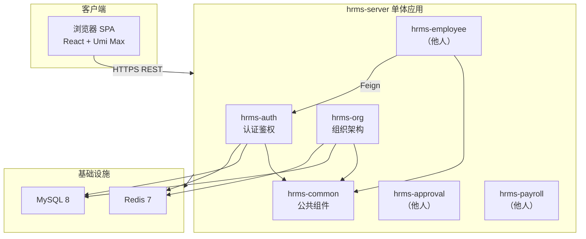

**李俊毅模块依赖说明：**

| 依赖方 | 被依赖方 | 依赖类型 | 说明 |
|--------|----------|----------|------|
| 全业务模块 | hrms-common | Maven 编译 | 统一响应、异常、数据权限 |
| hrms-auth | MySQL | 运行时 | 8 张表 |
| hrms-auth | Redis | 运行时 | Token 黑名单、权限缓存、登录锁定、无操作超时 |
| hrms-org | MySQL | 运行时 | department / position 表 |
| hrms-org | Redis | 运行时 | dept:tree 缓存、hrms:emp:seq 分布式锁 |
| hrms-employee | hrms-auth | Feign 内部 | 入职/离职/手机号变更触发账号操作 |
| 前端 SPA | hrms-auth | HTTP REST | `/api/v1/auth/*`、`/system/*` |
| 前端 SPA | hrms-org | HTTP REST | `/api/v1/departments/*`、`/positions/*` |

### 2.4.2 被测系统总体接口

**Base URL**：`/api/v1` | **统一响应**：`{ "code": 0, "message": "success", "data": {}, "traceId": "...", "timestamp": ... }`

#### 认证接口

| 方法 | 路径 | 鉴权 | 说明 |
|------|------|------|------|
| POST | `/auth/login` | 无 | 登录 → `{ accessToken, refreshToken, expiresIn, mustChangePassword }` |
| POST | `/auth/logout` | Bearer | 登出 → Token 入黑名单（jti），删 refresh 和 last-active |
| POST | `/auth/refresh` | RefreshToken | 刷新 Token 对，旧 refresh 作废 |
| GET | `/auth/profile` | Bearer | 当前用户信息 + 角色 + 权限码 + dataScope |
| PUT | `/auth/password` | Bearer | 修改密码（需旧密码校验） |
| PUT | `/auth/mobile` | Bearer | 绑定手机（SMS 验证码） |
| DELETE | `/auth/mobile` | Bearer | 解绑手机（SMS 验证码） |
| POST | `/auth/verify` | Bearer | 工资条二次验证（密码或 SMS） |

#### 系统管理接口（SYS_ADMIN）

| 方法 | 路径 | 说明 |
|------|------|------|
| GET | `/workbench/summary` | 工作台汇总（HR_STAFF+ 可访问） |
| GET | `/system/users` | 用户分页列表（keyword/status 筛选） |
| POST | `/system/users` | 创建用户 |
| PUT | `/system/users/{id}` | 编辑用户（角色/状态） |
| GET | `/system/roles` | 角色列表 |
| PUT | `/system/roles` | 编辑角色（名称/数据范围） |
| GET | `/system/roles/{id}/permissions` | 角色权限 ID 列表 |
| PUT | `/system/roles/{id}/permissions` | 分配角色权限 |
| GET | `/system/operation-logs` | 操作审计日志 |
| GET | `/system/login-logs` | 登录日志 |
| POST | `/system/backup` | 数据备份 |

#### 组织架构接口（SYS_ADMIN / HR_STAFF）

| 方法 | 路径 | 说明 |
|------|------|------|
| GET | `/departments/tree` | 部门树（含人数 + 负责人姓名） |
| GET | `/departments/{id}` | 部门详情 |
| GET | `/departments/{id}/headcount` | 部门人数（含下属） |
| GET | `/departments/{id}/can-delete` | 删除前校验（有员工/子部门？） |
| POST | `/departments` | 新增部门 |
| PUT | `/departments/{id}` | 编辑部门（可移动上级） |
| DELETE | `/departments/{id}` | 删除部门（须先清空） |
| PUT | `/departments/{id}/merge` | 部门合并到目标部门 |
| GET | `/positions` | 职位列表（分页，支持 departmentId/sequence 筛选） |
| GET | `/positions/{id}` | 职位详情 |
| POST | `/positions` | 新增职位 |
| PUT | `/positions/{id}` | 编辑职位 |
| DELETE | `/positions/{id}` | 删除职位 |

#### 内部 Feign 接口（仅模块间，需内部鉴权）

| 方法 | 路径 | 调用方 | 说明 |
|------|------|--------|------|
| POST | `/internal/users` | hrms-employee | 入职审批通过 → 创建系统账号 |
| PUT | `/internal/users/{id}/status` | hrms-employee | 离职生效 → 禁用账号 |
| PUT | `/internal/users/{id}/username` | hrms-employee | 手机号变更 → 同步用户名 |

#### 前端页面路由

| 路由 | 页面 | 角色 |
|------|------|------|
| `/login` | 登录页 | 未登录 |
| `/admin/workbench` | 工作台 | 管理角色 |
| `/admin/org/departments` | 部门管理 | SYS_ADMIN, HR_STAFF |
| `/admin/org/positions` | 职位管理 | SYS_ADMIN, HR_STAFF |
| `/admin/system/users` | 用户管理 | SYS_ADMIN |
| `/admin/system/roles` | 角色管理 | SYS_ADMIN |
| `/admin/system/operation-logs` | 操作日志 | SYS_ADMIN |
| `/admin/system/login-logs` | 登录日志 | SYS_ADMIN |
| `/portal/profile` | 员工门户首页 | EMPLOYEE |

### 2.4.3 数据模型变更

#### 数据库变更（Flyway V1 新增 10 表）

| 表 | 归属模块 | 用途 | 关键字段 |
|----|----------|------|----------|
| `sys_user` | hrms-auth | 系统用户（手机号登录） | username, password_hash, password_changed_at, employee_id, status |
| `sys_role` | hrms-auth | 角色定义（含 data_scope） | code, name, data_scope |
| `sys_permission` | hrms-auth | 权限/菜单定义 | code, name, module, type(MENU/BUTTON/API) |
| `sys_user_role` | hrms-auth | 用户-角色关联 | user_id, role_id（联合主键） |
| `sys_role_permission` | hrms-auth | 角色-权限关联 | role_id, permission_id（联合主键） |
| `login_log` | hrms-auth | 登录日志 | user_id, login_time, ip, success, fail_reason |
| `operation_log` | hrms-common | 操作审计日志 | user_id, module, action, target_id, detail(JSON) |
| `sys_dict` | hrms-common | 数据字典 | dict_type, dict_code, dict_label, sort_order |
| `department` | hrms-org | 部门（路径枚举方案） | name, code(2位), parent_id, path, level, head_employee_id |
| `position` | hrms-org | 职位（M/P/S序列） | name, sequence, department_id, rank_min, rank_max, default_probation_months |

**预置种子数据（V2）：**

| 数据 | 数量 | 说明 |
|------|------|------|
| 角色 | 5 | SYS_ADMIN / HR_STAFF / DEPT_MANAGER / FINANCE / EMPLOYEE |
| 权限 | 按模块 | 各模块 MENU/BUTTON/API 类型权限码 |
| 管理员 | 1 | 初始 SYS_ADMIN 账号可登录 |
| 部门 | ≥1 | 至少一个根部门 |
| 字典 | 若干 | employment_status, leave_type 等 |

**关键索引：**

| 表 | 索引 | 用途 |
|----|------|------|
| sys_user | uk_username | 登录账号唯一 |
| sys_role | uk_code | 角色编码唯一 |
| sys_permission | uk_code | 权限编码唯一 |
| department | uk_code | 部门编码唯一（工号生成用） |
| department | idx_parent | 按上级部门查子部门 |
| department | idx_path | path LIKE 子树查询 |
| position | idx_dept | 按部门查询职位 |
| position | idx_sequence | 按序列查询职位 |
| login_log | idx_user_time | 登录日志分页查询 |

#### 缓存变更（Redis Key）

| Key 模式 | TTL | 用途 | 所属 |
|----------|-----|------|------|
| `user:permissions:{userId}` | 10min | 权限码缓存 | hrms-auth |
| `hrms:perm:user:{userId}` | 30min | 完整权限 JSON | hrms-auth |
| `token:blacklist:{jti}` | 2h | 登出 Token 黑名单 | hrms-auth |
| `refresh:{userId}` | 7d | Refresh Token 白名单 | hrms-auth |
| `login:fail:{username}` | 15min | 登录失败计数 | hrms-auth |
| `user:last-active:{userId}` | 30min | 无操作超时检测 | hrms-auth |
| `hrms:payslip:verified:{userId}` | 30min | 工资条二次验证通过标记 | hrms-auth |
| `dept:tree` | 5min | 部门树缓存 | hrms-org |
| `hrms:emp:seq:{year}:{deptCode}` | — | 工号生成分布式锁（SETNX） | hrms-org |

#### 配置变更

| 配置项 | 文件 | 说明 |
|--------|------|------|
| JWT 密钥 | `application-{env}.yml` | 签名密钥，各环境独立，跨环境不可互用 |
| BCrypt cost | `application.yml` 默认 12 | 密码哈希强度 |
| AccessToken TTL | JWT 配置 7200s | 2 小时 |
| RefreshToken TTL | Redis 配置 7d | — |
| Redis 连接 | `application-{env}.yml` | 哨兵/单机地址 |
| Flyway | `spring.flyway.*` | 迁移开关、基线版本 |
| 前端 baseURL | `frontend/.umirc.ts` | `/api/v1` 代理配置 |

---

# 3. 功能性需求测试分析

> **本章为测分核心章节。按模块组织，每个模块内自包含业务流程分析、交互时序图、接口分析、测试用例等。读者阅读任一模块无需跳转其他章节。**

## 3.1 hrms-auth 认证鉴权模块测试分析

### 3.1.1 业务流程分析

#### （1）登录认证 — 正常流程

```mermaid
flowchart TD
    A[用户打开 /login] --> B[输入账号密码]
    B --> C{前端表单校验}
    C -->|失败| B
    C -->|通过| D[POST /auth/login]
    D --> E{BCrypt 校验}
    E -->|失败| F[提示「账号或密码错误」<br/>Redis login:fail 计数+1]
    F --> G{失败≥5次?}
    G -->|是| H[Redis EXPIRE 900<br/>锁定15分钟]
    G -->|否| B
    E -->|成功| I[DEL login:fail<br/>签发 JWT AccessToken 2h<br/>+ RefreshToken 7d]
    I --> J[前端存储Token至localStorage]
    J --> K[GET /auth/profile]
    K --> L{mustChangePassword?}
    L -->|是| M[弹出改密弹窗]
    M --> N[PUT /auth/password]
    N --> O[跳转首页]
    L -->|否| P{角色判断}
    P -->|EMPLOYEE| Q[/portal/profile]
    P -->|管理角色| R[/admin/workbench]
```

#### （2）登录认证 — 异常流程

| 异常场景 | 触发条件 | 预期结果 |
|----------|----------|----------|
| 账号不存在 | username 无匹配记录 | 提示「账号或密码错误」，不泄露具体原因 |
| 密码错误 | BCrypt 不匹配 | 同上，Redis login:fail 计数+1 |
| 账号禁用 | sys_user.status=0 | 提示「账号已禁用」 |
| 账号锁定 | 连续5次登录失败 | 提示「账号已锁定，请15分钟后重试」 |
| 锁定期内正确密码 | 锁定15分钟内 | 仍拒绝，提示锁定 |
| AccessToken 过期 | 超2小时 | HTTP 401 → 前端尝试 /auth/refresh |
| RefreshToken 过期 | 超7天 | /auth/refresh 返回 401 → 跳转登录页 |
| 无操作超时 | 30分钟无API调用 | Redis user:last-active Key 被删除 → 401 |
| 已登出 Token | jti 在黑名单 | 401，前端跳转登录 |
| 密码超90天 | password_changed_at 距今>90天 | mustChangePassword=true |
| 同时 N 个过期请求 | 浏览器休眠后唤醒 | 排队锁：仅1次 refresh，其余排队重放 |
| 篡改 JWT payload | 修改 roles | 签名失败 → 401 |
| 旧 refreshToken 再刷 | 轮换后已作废 | 401 |

#### （3）系统管理 — 用户/角色/权限

```mermaid
flowchart TD
    A[SYS_ADMIN 登录] --> B[进入 /admin/system/users]
    B --> C[GET /system/users 分页列表]
    C --> D{操作类型}
    D -->|新增| E[填写手机号/员工ID/角色]
    E --> F[POST /system/users]
    F --> G[随机密码 + mustChangePassword=true]
    D -->|编辑| H[PUT /system/users/{id} 修改角色/状态]
    D -->|角色权限| I[进入 /admin/system/roles]
    I --> J[GET /system/roles/{id}/permissions]
    J --> K[Tree 勾选权限节点]
    K --> L[PUT /system/roles/{id}/permissions]
    L --> M[Redis DEL user:permissions:{userId}]
    M --> N[用户下次请求获新权限（无需重新登录）]
```

#### （4）内部账号生命周期（跨模块联调）

```mermaid
flowchart LR
    A[入职审批通过] -->|POST /internal/users| B[创建 sys_user]
    B --> C[默认 EMPLOYEE 角色]
    C --> D[随机密码 + mustChangePassword]
    D --> E[员工首次登录改密]

    F[手机号变更审批] -->|PUT /internal/users/{id}/username| G[同步 username]
    H[离职生效 Job] -->|PUT /internal/users/{id}/status=0| I[禁用账号]
    I --> J[已有 Token 下次请求 401]
```

### 3.1.2 交互时序图

#### 登录 + Profile 获取

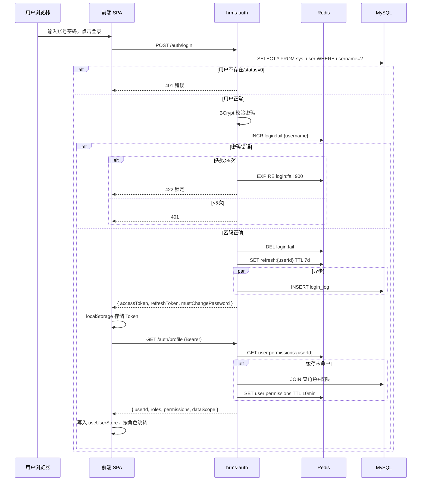

#### Token 刷新（401 静默续签 + 排队锁）

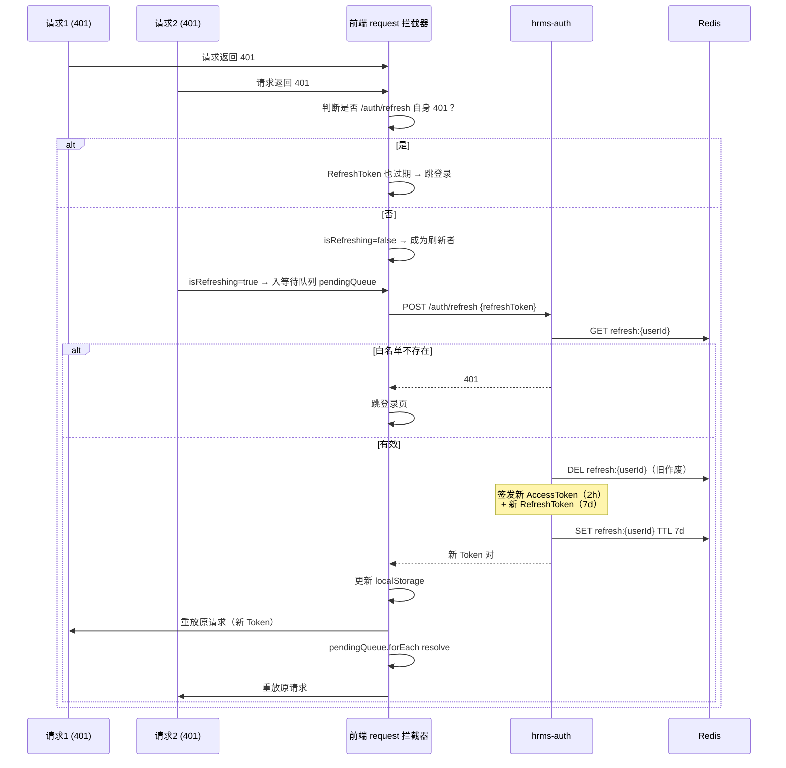

#### 登出 + Token 黑名单

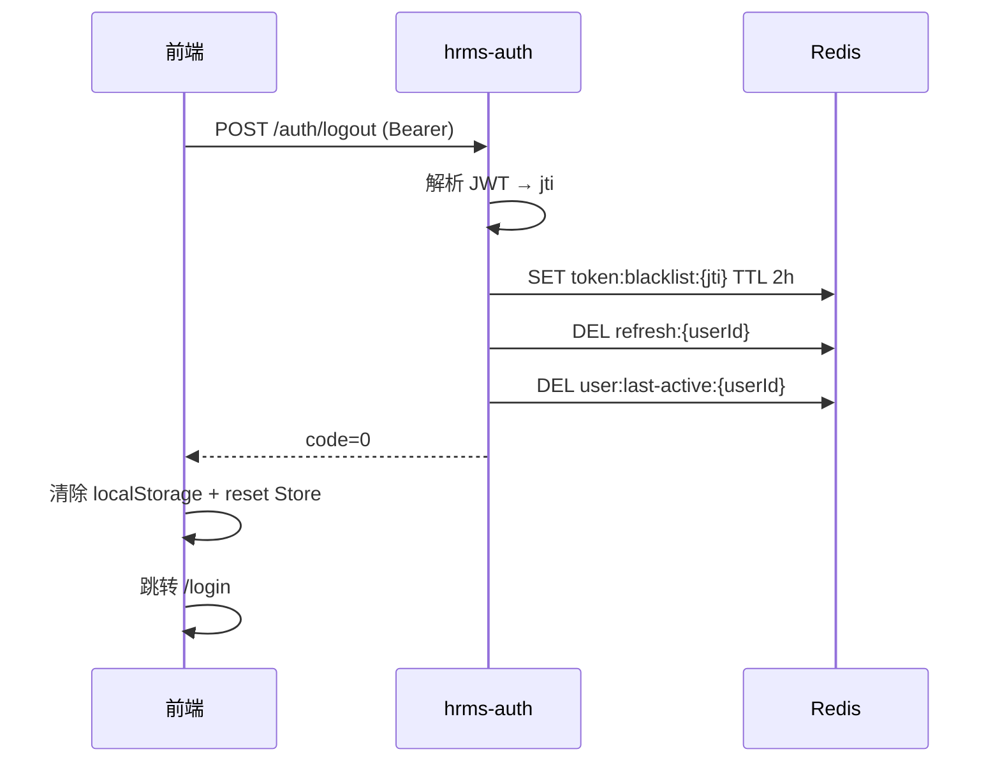

#### 权限校验全链路（4 道关卡）

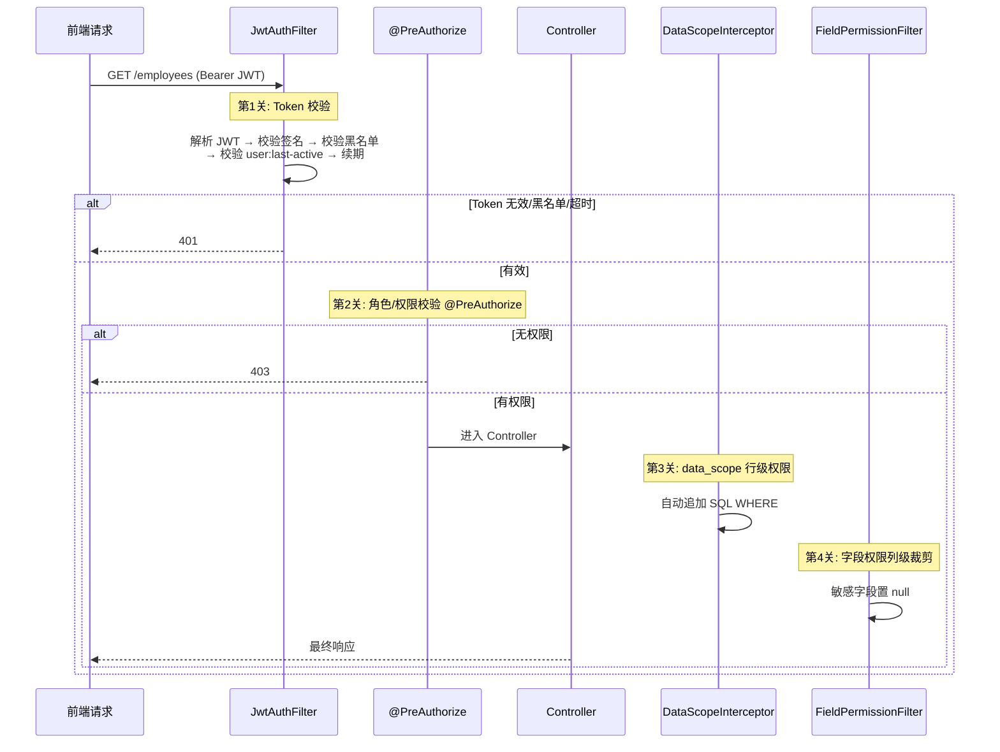

### 3.1.3 资金流分析

本模块**不涉及资金流转**。`POST /auth/verify` 仅为工资条查看的**访问控制二次验证**，不产生资金变动。

### 3.1.4 信息流分析

#### 正向信息流

| 序号 | 信息流 | 路径 | 落库/缓存 |
|------|--------|------|-----------|
| 1 | 登录凭证 | 前端 → POST /auth/login → BCrypt 校验 | login_log 异步 INSERT |
| 2 | Token 签发 | JWT { sub:userId, empId, roles, jti } | refresh:{userId} 写 Redis |
| 3 | 权限加载 | GET /auth/profile → 查角色+权限 | user:permissions 缓存 10min |
| 4 | 用户创建 | SYS_ADMIN → POST /system/users | sys_user + sys_user_role |
| 5 | 权限变更 | PUT /system/roles/{id}/permissions | sys_role_permission + 删权限缓存 Key |
| 6 | 内部建号 | hrms-employee → POST /internal/users | sys_user（默认 EMPLOYEE 角色） |
| 7 | 离职禁用 | PUT /internal/users/{id}/status=0 | sys_user.status=0 |
| 8 | 二次验证 | POST /auth/verify → 密码/SMS 校验 | hrms:payslip:verified:{userId} Redis |

#### 逆向信息流（权限回收/失效）

| 序号 | 触发事件 | 逆向动作 | 验证点 |
|------|----------|----------|--------|
| 1 | 登出 | jti 入黑名单 + 删 refresh | 旧 Token 请求 401 |
| 2 | 角色变更 | 删 user:permissions 缓存 | 下次 profile 返回新权限 |
| 3 | 禁用用户 | sys_user.status=0 | 登录拒绝 |
| 4 | 离职生效 | 内部接口禁用 | 已登录会话下次请求 401 |
| 5 | 权限码回收 | 前端菜单/按钮即时隐藏 | 后端 403 双拦截 |

### 3.1.5 定时任务分析

| 任务 | 归属 | 触发 | 对本模块影响 | 测试要点 |
|------|------|------|-------------|----------|
| 密码过期检测 | hrms-auth | 每次登录时 | 检查 password_changed_at | 超90天 → mustChangePassword |
| 登录锁定自动解锁 | Redis TTL | 15min 自动过期 | login:fail Key 删除 | 15分钟后可重新登录 |
| 无操作超时 | Redis TTL | 30min 自动过期 | user:last-active Key 删除 | 下次请求 401 |
| Token 黑名单 | Redis TTL | 2h 自动过期 | token:blacklist:{jti} 删除 | 过期后可正常使用（已无关） |
| 权限缓存 | Redis TTL | 10~30min 自动刷新 | user:permissions 重建 | 变更需主动删 Key，不依赖 TTL |

### 3.1.6 外部接口测试分析

#### 参数校验

| 接口 | 校验项 | 非法输入 | 预期 |
|------|--------|----------|------|
| POST /auth/login | username 必填 | 空 | code=10001 |
| POST /auth/login | username 格式 | 非手机号/工号 | 10001（前端+后端双校验） |
| POST /auth/login | password 必填 | 空 | 10001 |
| PUT /auth/password | oldPassword 必填 | 空 | 10001 |
| PUT /auth/password | newPassword 强度 | 少于8位/无大写/无数字 | 10001 |
| PUT /auth/password | confirmPassword 一致 | 与 newPassword 不同 | 10001 |
| PUT /auth/password | 新旧密码不同 | 新旧一致 | 业务拒绝（规则约束） |
| POST /auth/verify | verifyType 枚举 | "EMAIL" | 10001 |
| POST /auth/verify | verifyCode 必填 | 空 | 10001 |
| GET /system/users | page≥1 | page=0 | 10001 |
| GET /system/users | pageSize≤100 | pageSize=200 | 10001 |
| POST /system/users | username 手机号格式 | 非11位 | 10001 |
| POST /system/users | employeeId 存在性 | 无效 ID | 404/业务错误 |

#### 权限校验

| 接口 | 所需角色 | 越权测试 |
|------|----------|----------|
| GET/POST/PUT /system/users | SYS_ADMIN | HR_STAFF/EMPLOYEE → 403 |
| GET/PUT /system/roles | SYS_ADMIN | HR_STAFF → 403 |
| PUT /system/roles/{id}/permissions | SYS_ADMIN | HR_STAFF → 403 |
| GET /system/operation-logs | SYS_ADMIN | HR_STAFF → 403 |
| GET /system/login-logs | SYS_ADMIN | HR_STAFF → 403 |
| POST /system/backup | SYS_ADMIN | HR_STAFF → 403 |
| GET /workbench/summary | HR_STAFF+（管理角色） | EMPLOYEE → 403 |
| GET /auth/profile | 已登录任意角色 | 无 Token → 401 |
| POST /auth/login | 无 | — |

#### 并发与幂等

| 场景 | 接口 | 预期行为 |
|------|------|----------|
| 并发登录同一账号 | POST /auth/login | 失败计数原子递增，第5次锁定 |
| 并发刷新 Token | POST /auth/refresh | 轮换机制：仅最后一次可继续刷新，其余旧 Token 失效 |
| 重复登出 | POST /auth/logout | 幂等，二次仍返回成功 |
| 同手机号并发建用户 | POST /system/users | 唯一约束：一个成功，其余 409 冲突 |
| 并发权限分配 | PUT /roles/{id}/permissions | 最终一致，最后一次覆盖 |
| 并发修改同一用户 | PUT /system/users/{id} | 行乐观锁 / 最后更新覆盖 |

### 3.1.7 测试用例设计

#### 认证（A 组）

| 编号 | 测试点 | 前置条件 | 操作 | 预期 |
|------|--------|---------|------|------|
| A-01 | 正常登录 | 有效账号 | POST /auth/login | 返回 Token 对，code=0 |
| A-02 | 密码错误 | 错误密码 | POST /auth/login | 提示错误，Redis 计数+1 |
| A-03 | 第5次锁定 | 连续4次失败 | 第5次错误密码 | 锁定15分钟 |
| A-04 | 锁定期再登录 | 锁定期内 | 正确密码登录 | 仍拒绝 |
| A-05 | 15min后自动解锁 | 等待15分钟 | 正确密码登录 | 正常登录 |
| A-06 | 禁用账号 | status=0 | POST /auth/login | 拒绝登录 |
| A-07 | 首次改密 | 随机密码账号 | 登录 | mustChangePassword=true |
| A-08 | 改密成功 | 旧密码正确 | PUT /auth/password | 新密码可登录 |
| A-09 | 改密强度不足 | 纯数字 | PUT /auth/password | 10001 校验失败 |
| A-10 | 改密-新旧相同 | 新旧一致 | PUT /auth/password | 业务拒绝 |
| A-11 | 改密-确认不一致 | confirm 不同 | PUT /auth/password | 10001 |
| A-12 | 密码超90天 | changed_at>90天 | 登录 | mustChangePassword=true |
| A-13 | 登出 | 已登录 | POST /auth/logout | code=0，旧Token 401 |
| A-14 | 登出后旧Token | 已登出 Token | GET /auth/profile | 401（黑名单） |
| A-15 | Token 刷新 | 有效 refreshToken | POST /auth/refresh | 新 Token 对 |
| A-16 | 旧 refresh 再刷 | 轮换后 | POST /auth/refresh | 401 |
| A-17 | RefreshToken 过期 | 超7天 | POST /auth/refresh | 401→跳登录 |
| A-18 | AccessToken 过期 | 超2小时 | 请求受保护 API | 401→refresh |
| A-19 | 无操作超时 | 30min 无请求 | 再发起请求 | 401 |
| A-20 | 无操作超时+后端兜底 | 前端 idle 失效 | 30min后请求 | 后端 user:last-active 兜底 401 |
| A-21 | 工资条验证-密码正确 | 有效密码 | POST /auth/verify | Redis 写入标记 |
| A-22 | 工资条验证-密码错误 | 错误密码 | POST /auth/verify | 60004 |
| A-23 | 工资条验证-超30min | 验证后超30min | 查工资条 | 重新验证 |
| A-24 | 绑定手机 | 有效 SMS 码 | PUT /auth/mobile | 绑定成功 |
| A-25 | 绑定手机-唯一性 | 已用手机号 | PUT /auth/mobile | 冲突 |
| A-26 | 解绑手机 | 有效 SMS 码 | DELETE /auth/mobile | 解绑成功 |
| A-27 | 并发刷新竞态 | 10线程同时 refresh | POST /auth/refresh | 仅一个有效，其余旧 Token 失效 |
| A-28 | 篡改 JWT payload | 修改 roles | 发送请求 | 签名失败→401 |
| A-29 | 无 Token 访问 | 不传 Authorization | GET /auth/profile | 401 |
| A-30 | 账号不存在不写具体原因 | 不存在 username | POST /auth/login | 提示「账号或密码错误」 |
| A-31 | 30min 内连续操作 | 正常操作 | 不断发起请求 | user:last-active 持续续期，不超时 |

#### 系统管理（S 组）

| 编号 | 测试点 | 前置条件 | 操作 | 预期 |
|------|--------|---------|------|------|
| S-01 | 用户列表分页 | SYS_ADMIN | GET /system/users?page=1&pageSize=20 | 分页结构 |
| S-02 | 用户搜索 | keyword | GET /system/users?keyword=138 | 匹配结果 |
| S-03 | 创建用户 | 有效 employeeId | POST /system/users | 创建成功，随机密码 |
| S-04 | 创建用户-不传密码 | — | POST /system/users（不传 password） | 自动随机密码 + mustChangePassword |
| S-05 | 创建用户-传密码 | 合规密码 | POST /system/users（含 password） | 指定密码创建 |
| S-06 | 用户名重复 | 已有手机号 | POST /system/users | 409 |
| S-07 | 编辑用户角色 | 有效 userId | PUT /system/users/{id} | 角色更新 |
| S-08 | 禁用用户 | 正常用户 | PUT status=0 | 登录拒绝 |
| S-09 | 启用用户 | 已禁用 | PUT status=1 | 可登录 |
| S-10 | 角色列表 | SYS_ADMIN | GET /system/roles | 5个预置角色 |
| S-11 | 编辑角色名称 | SYS_ADMIN | PUT /system/roles | 名称更新 |
| S-12 | 编辑角色编码（不可修改） | SYS_ADMIN | PUT code | 只读返回错误 |
| S-13 | 编辑数据范围 | SYS_ADMIN | PUT dataScope | 更新 |
| S-14 | 权限分配 | SYS_ADMIN | PUT /roles/{id}/permissions | 保存权限 ID 列表 |
| S-15 | 权限即时生效 | 刚回收权限 | 用户再请求受保护 API | 403 |
| S-16 | 权限缓存失效 | 权限变更后 | 查 Redis | user:permissions Key 已删除 |
| S-17 | 非管理员访问 | HR_STAFF | GET /system/users | 403 |
| S-18 | 工作台汇总-HR_STAFF | HR_STAFF | GET /workbench/summary | KPI 字段 |
| S-19 | 工作台汇总-EMPLOYEE | EMPLOYEE | GET /workbench/summary | 403 |
| S-20 | 登录日志 | SYS_ADMIN | GET /system/login-logs | 分页 |
| S-21 | 操作日志 | SYS_ADMIN | GET /system/operation-logs | 分页 |

#### 内部接口（I 组）

| 编号 | 测试点 | 前置条件 | 操作 | 预期 |
|------|--------|---------|------|------|
| I-01 | 内部建号 | 无重复手机号 | POST /internal/users | 返回 userId |
| I-02 | 默认角色 | 不传 roleCodes | POST /internal/users | 默认 EMPLOYEE |
| I-03 | 重复建号 | 已存在 username | POST /internal/users | 409 |
| I-04 | 禁用用户 | 在职账号 | PUT /internal/users/{id}/status=0 | 登录拒绝 |
| I-05 | 启用用户 | 已禁用 | PUT /internal/users/{id}/status=1 | 可登录 |
| I-06 | 同步用户名 | 新手机号 | PUT /internal/users/{id}/username | 新号可登录 |
| I-07 | 内部接口直接外部访问 | 外网调用 | POST /internal/users | 拒绝（内部鉴权） |

---

## 3.2 hrms-org 组织架构模块测试分析

### 3.2.1 业务流程分析

#### （1）新增部门 — 正常流程

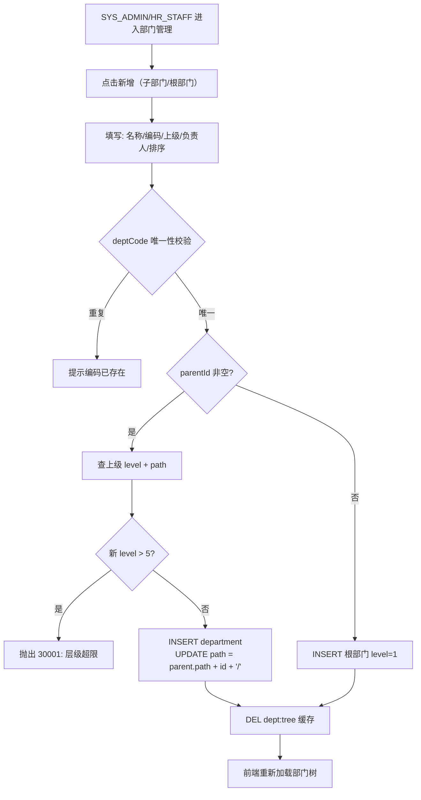

#### （2）编辑部门（含移动上级）

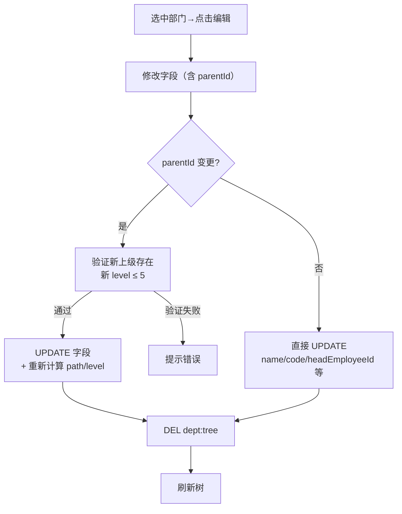

#### （3）部门合并

```mermaid
flowchart TD
    A[选中源部门→点击合并] --> B[TreeSelect 选择目标部门]
    B --> C{目标 ≠ 自身?}
    C -->|否| D[提示: 不能合并到自身]
    C -->|是| E[二次确认弹窗]
    E -->|取消| F[结束]
    E -->|确认| G[开启事务]
    G --> H[UPDATE employee SET dept_id=target<br/>WHERE dept_id=source]
    G --> I[UPDATE department SET parent_id=target<br/>WHERE parent_id=source]
    G --> J[UPDATE department SET deleted=1 WHERE id=source]
    J --> K[DEL dept:tree]
    K --> L[DEL hrms:perm:user:{相关员工}]
    L --> M[成功提示 + 刷新树]
```

#### （4）工号生成

```mermaid
flowchart TD
    A[入职审批通过→调用工号生成] --> B[SELECT code FROM department<br/>WHERE id=? → 'JS']
    B --> C[SETNX hrms:emp:seq:2026:JS 分布式锁]
    C -->|锁失败| D[重试/返回等待]
    C -->|锁成功| E{employee_no_history<br/>中有可复用工号?}
    E -->|是| F[选最早释放的工号<br/>UPDATE reuse_flag=0]
    E -->|否| G[SELECT MAX(seq) FROM employee<br/>WHERE emp_no LIKE '2026JS%']
    G --> H[seq+1 → 新序号]
    F --> I[DEL 锁 Key]
    H --> I
    I --> J[返回工号 '2026JS005']
```

#### （5）异常流程

| 异常场景 | 触发条件 | 预期结果 |
|----------|----------|----------|
| 新增-编码重复 | deptCode 已存在 | 409 冲突 |
| 新增-超5层 | parent 已是第5层 | 422 / 30001 |
| 新增-上级不存在 | parentId 无效 | 404 |
| 编辑-移动上级不存在 | 新 parentId 无效 | 404 |
| 编辑-移动后超层级 | 新 parent 层级=5 | 422 / 30001 |
| 删除-有员工 | 部门有在职员工 | can-delete 返回不可删 |
| 删除-有子部门 | 部门有下级 | can-delete 返回不可删 |
| 删除-根部门 | 唯一根部门 | 业务拒绝（至少保留一个根） |
| 合并-目标=自身 | target = source | 业务拒绝 |
| 合并-目标不存在 | 目标 ID 无效 | 404 |
| 职位-序列非法 | sequence = 'A' | 10001 |
| 职位-职级越界 | M6、P11、S6 | 校验失败 |
| 职位-职级反向 | gradeMin > gradeMax（如 P7-P3） | 校验失败 |
| 工号生成-部门不存在 | departmentId 无效 | 失败 |

### 3.2.2 交互时序图

#### 部门树加载与缓存

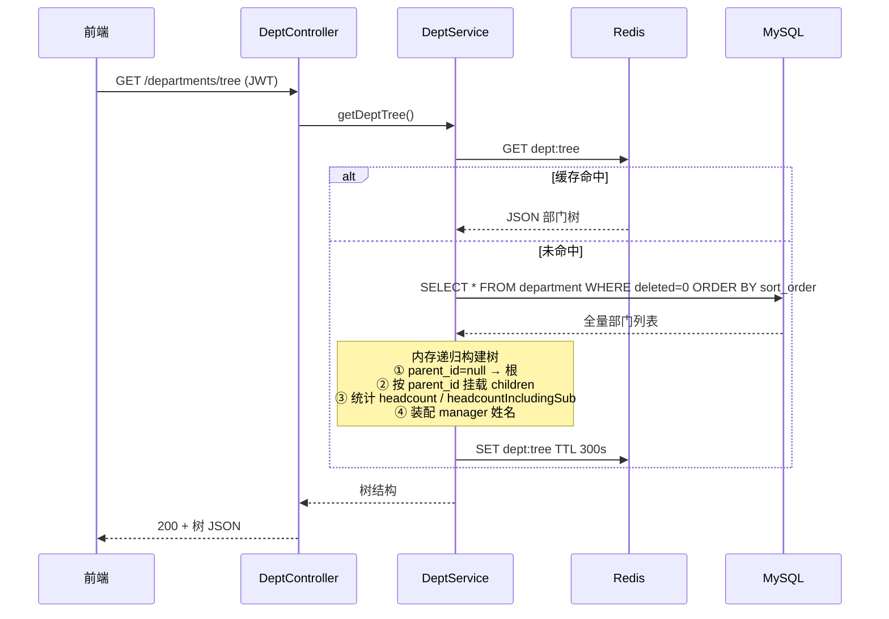

#### 新增部门

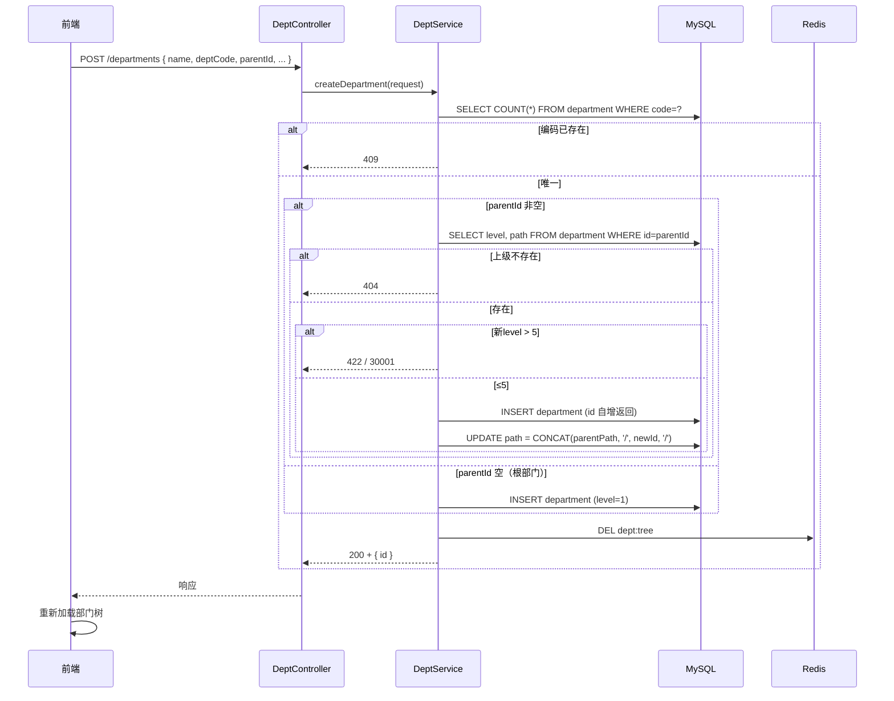

#### 部门合并（事务 + 缓存清理）

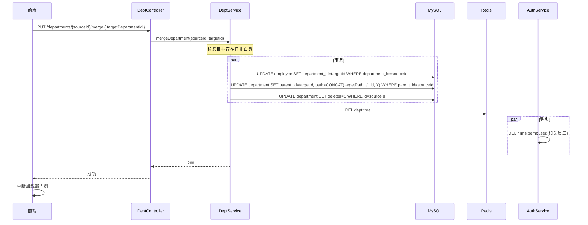

#### 工号生成（含分布式锁）

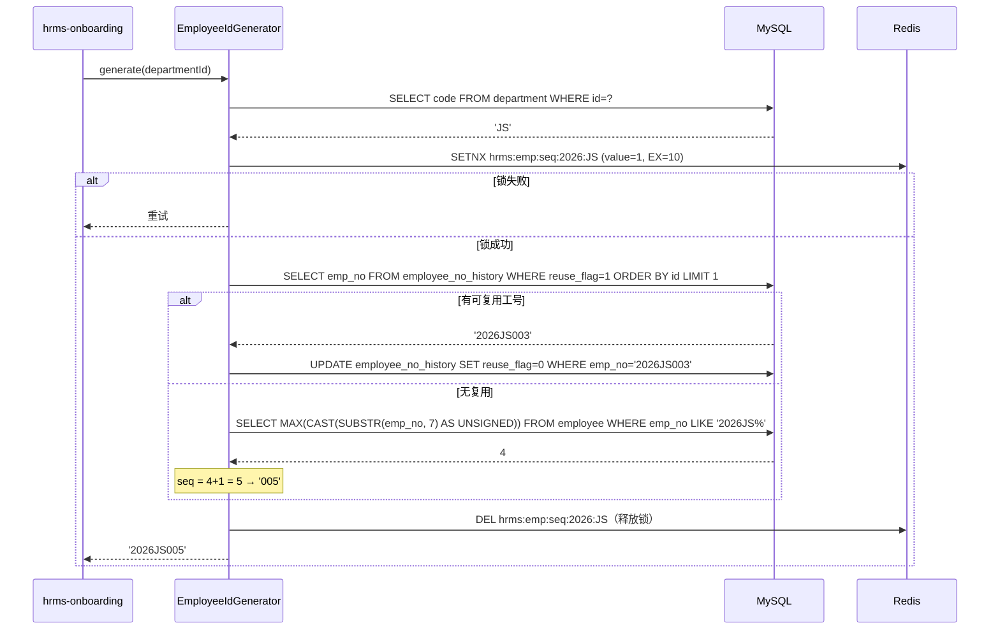

### 3.2.3 资金流分析

本模块不涉及资金流转。

### 3.2.4 信息流分析

#### 正向信息流

| 序号 | 信息流 | 路径 | 落库/缓存 |
|------|--------|------|-----------|
| 1 | 新增部门 | 前端 → POST /departments | department 表 + 删 dept:tree |
| 2 | 编辑部门（移上级） | PUT /departments/{id} | 更新 path/parent_id/level |
| 3 | 部门合并 | PUT /departments/{id}/merge | 员工转移 + 子部门重挂 + 源删 |
| 4 | 部门树查询 | GET /departments/tree | dept:tree 缓存 5min |
| 5 | 部门人数统计 | GET /departments/{id}/headcount | SQL JOIN 实时统计 |
| 6 | 删除前校验 | GET /departments/{id}/can-delete | SQL 查询员工/子部门计数 |
| 7 | 新增职位 | POST /positions | position 表 |
| 8 | 职位列表 | GET /positions（分页+筛选） | 全量查询（数据量小，不缓存）|
| 9 | 工号生成 | 入职模块 → generate() | employee.emp_no + Redis 锁 |

#### 逆向信息流

| 序号 | 触发事件 | 逆向动作 | 验证点 |
|------|----------|----------|--------|
| 1 | 部门逻辑删除 | deleted=1 | tree 不显示、API 不返回 |
| 2 | 部门合并后 | 源部门不可见，员工已转 | 员工列表无源部门归属 |
| 3 | 职位删除 | 物理/逻辑删除 | 关联该职位的员工需处理 |
| 4 | 工号复用 | reuse_flag 1→0 | 已释放工号优先分配 |

### 3.2.5 定时任务分析

| 任务 | 归属 | 触发 | 说明 |
|------|------|------|------|
| 工号序号重置 | hrms-org | 每年初（业务逻辑内置） | 按年区分，序号每年从001开始 |
| 部门人数统计 | hrms-org | 实时（SQL 查询+缓存） | 无定时任务，基于 SQL COUNT JOIN 实时计算 |
| 部门树缓存 | hrms-org | 部门变更时主动删除 | TTL 5min + 变更删 Key |

### 3.2.6 外部接口测试分析

#### 参数校验

| 接口 | 校验项 | 非法输入 | 预期 |
|------|--------|----------|------|
| POST /departments | name 必填 | 空 | 10001 |
| POST /departments | name ≤64 | 超64字符 | 10001 |
| POST /departments | deptCode 必填 | 空 | 10001 |
| POST /departments | deptCode 格式 | 2位字母数字 | "123" → 10001 |
| POST /departments | deptCode 唯一 | 重复编码 | 409 |
| POST /departments | parentId 存在性 | 999 | 404 |
| POST /departments | 层级≤5 | 第5层下再建 | 422 / 30001 |
| PUT /departments/{id} | 移动上级-存在性 | 无效 parentId | 404 |
| PUT /departments/{id} | 移动上级-层级 | 超5层 | 422 / 30001 |
| DELETE /departments/{id} | 有员工/子部门 | 非空部门 | 拒绝（can-delete 返回 false）|
| PUT /departments/{id}/merge | target 存在 | 无效 ID | 404 |
| PUT /departments/{id}/merge | target ≠ source | 自身 | 业务拒绝 |
| POST /positions | name 必填 | 空 | 10001 |
| POST /positions | sequence 枚举 M/P/S | "A" | 10001 |
| POST /positions | gradeMin 合法范围 | M6/P11/S6 | 校验失败 |
| POST /positions | gradeMin ≤ gradeMax | P7-P3 | 校验失败 |
| POST /positions | defaultProbationMonths 范围 | ≤0 或 >24 | 10001 |

#### 权限校验

| 接口 | 所需角色 | 越权测试 |
|------|----------|----------|
| POST/PUT/DELETE /departments* | SYS_ADMIN, HR_STAFF | EMPLOYEE/DEPT_MANAGER → 403 |
| POST/PUT/DELETE /positions* | SYS_ADMIN, HR_STAFF | EMPLOYEE → 403 |
| GET /departments/tree | SYS_ADMIN, HR_STAFF | EMPLOYEE → 403 |
| GET /positions | SYS_ADMIN, HR_STAFF | EMPLOYEE → 403 |

#### 并发与幂等

| 场景 | 接口 | 预期行为 |
|------|------|----------|
| 同编码并发建部门 | POST /departments | 唯一约束，一个成功其余 409 |
| 同部门并发编辑 | PUT /departments/{id} | 行乐观锁 / 最后更新覆盖 |
| 并发合并同一部门 | PUT /departments/{id}/merge | 事务隔离，无脏数据 |
| 重复提交合并 | PUT /departments/{id}/merge（相同请求） | 幂等（重新执行，结果一致）|
| 并发工号生成 | generate() 多线程 | Redis SETNX 串行化，无重复 |
| 同职位并发创建 | POST /positions | 无唯一约束，可重复（合理）|

### 3.2.7 测试用例设计

#### 部门管理（D 组）

| 编号 | 测试点 | 前置条件 | 操作 | 预期 |
|------|--------|---------|------|------|
| D-01 | 新增根部门 | 无 | POST /departments parentId=null | 成功，level=1，path='/{id}/' |
| D-02 | 新增子部门 | 根部门存在 | POST /departments parentId=根ID | 成功，level=2，path 正确 |
| D-03 | 编码重复 | 已有部门编码 | POST /departments 相同 code | 409 |
| D-04 | 超过最大层级 | 第5层部门存在 | 在第5层下建子部门 | 422 / 30001 |
| D-05 | 上级不存在 | parentId=999 | POST /departments | 404 |
| D-06 | 编辑部门名称 | 部门存在 | PUT /departments/{id} | 名称更新 |
| D-07 | 编辑移动上级 | 目标存在 | PUT 修改 parentId | path/level 重新计算 |
| D-08 | 编辑移动上级-超层级 | 目标层级=5 | PUT 移动 | 422 |
| D-09 | 编辑移动后子树级联 | 有子部门 | PUT 移动父部门 | 所有子部门 path 级联更新 |
| D-10 | 部门树加载 | 多部门+多层 | GET /departments/tree | 树结构正确 |
| D-11 | 部门树-人数统计 | 部门有员工 | GET /departments/tree | headcount 正确 |
| D-12 | 部门树-含下属人数 | 部门有子部门+员工 | GET /departments/tree | headcountIncludingSub 累加正确 |
| D-13 | 部门树-负责人姓名 | 已设负责人 | GET /departments/tree | manager 字段非空 |
| D-14 | 部门树-缓存命中 | 已加载过 | 连续 GET /departments/tree | 第二次从 Redis 返回 |
| D-15 | 部门树-缓存失效 | 新增/编辑/删除后 | 再加载 | 缓存已更新 |
| D-16 | 部门详情 | 部门存在 | GET /departments/{id} | 返回正确字段 |
| D-17 | 部门详情-不存在 | id=999 | GET /departments/{id} | 404 |
| D-18 | 部门人数（含下级） | 部门树多层 | GET /departments/{id}/headcount | 含本级+全部下属 |
| D-19 | 删除前校验-有员工 | 部门有在职员工 | GET /departments/{id}/can-delete | 返回 false + 原因 |
| D-20 | 删除前校验-有子部门 | 部门有子部门 | GET /departments/{id}/can-delete | 返回 false + 原因 |
| D-21 | 删除前校验-可删除 | 空部门 | GET /departments/{id}/can-delete | 返回 true |
| D-22 | 删除部门 | 可删除状态 | DELETE /departments/{id} | 逻辑删除，树中隐藏 |
| D-23 | 删除有员工部门（直接删） | 有员工 | DELETE /departments/{id} | 业务拒绝 |
| D-24 | 部门合并-正常 | 源部门有员工+子部门 | PUT /departments/{id}/merge | 员工转移、子部门重挂、源隐藏 |
| D-25 | 部门合并-自身 | target=source | PUT /departments/{id}/merge | 业务拒绝 |
| D-26 | 部门合并-目标不存在 | id 无效 | PUT /departments/{id}/merge | 404 |
| D-27 | 合并后数据一致性 | 合并完成 | 查员工+子部门 | 所有数据归属目标 |
| D-28 | 指定负责人 | 搜索有效员工 | POST/PUT headEmployeeId | 树中显示负责人 |
| D-29 | 无权限访问 | EMPLOYEE | GET /departments/tree | 403 |

#### 职位管理（P 组）

| 编号 | 测试点 | 前置条件 | 操作 | 预期 |
|------|--------|---------|------|------|
| P-01 | 新增职位-全字段 | 有效参数 | POST /positions | 创建成功，返回 id |
| P-02 | 新增职位-通用职位 | — | POST departmentId=null | 全公司通用 |
| P-03 | 序列 M/P/S 校验 | — | POST sequence='A' | 10001 |
| P-04 | 职级范围-M 序列正常 | — | POST gradeMin=M1 gradeMax=M5 | 成功 |
| P-05 | 职级范围-M 序列越界 | — | POST gradeMax='M6' | 校验失败 |
| P-06 | 职级范围-P 序列正常 | — | POST gradeMin=P1 gradeMax=P10 | 成功 |
| P-07 | 职级范围-P 序列越界 | — | POST gradeMin=P11 | 校验失败 |
| P-08 | 职级范围-S 序列正常 | — | POST gradeMin=S1 gradeMax=S5 | 成功 |
| P-09 | 职级范围-反向 | — | POST gradeMin=P7 gradeMax=P3 | 校验失败 |
| P-10 | 默认试用期默认值 | 不传 | POST /positions | defaultProbationMonths=3 |
| P-11 | 默认试用期自定义 | 传6 | POST defaultProbationMonths=6 | 存储6 |
| P-12 | 标准职位 | isStandard=true | POST /positions | 成功 |
| P-13 | 非标准职位 | isStandard=false | POST /positions | 成功（入职需二审）|
| P-14 | 编辑职位 | 有效 id | PUT /positions/{id} | 更新 |
| P-15 | 职位列表-分页 | 有数据 | GET /positions | 分页结构 |
| P-16 | 职位列表-按部门筛选 | 部门1有数据 | GET /positions?departmentId=1 | 仅该部门 |
| P-17 | 职位列表-按序列筛选 | P序列有数据 | GET /positions?sequence=P | 仅P序列 |
| P-18 | 职位列表-综合筛选 | 多筛选条件 | GET /positions?departmentId=1&sequence=P | 交集 |
| P-19 | 职位详情 | 存在 | GET /positions/{id} | 正确字段 |
| P-20 | 职位详情-不存在 | id=999 | GET /positions/{id} | 404 |
| P-21 | 删除职位 | 无关联 | DELETE /positions/{id} | 删除成功 |
| P-22 | 无权限操作 | EMPLOYEE | POST /positions | 403 |

#### 工号生成（G 组）

| 编号 | 测试点 | 前置条件 | 操作 | 预期 |
|------|--------|---------|------|------|
| G-01 | 正常生成 | 有效部门 | generate(departmentId) | 格式: '2026JS005' |
| G-02 | 序号递增 | 已有 001~004 | generate() | '005' |
| G-03 | 部门编码联动 | 不同部门 | generate() 不同部门 | 编码不同的工号 |
| G-04 | 年份切换 | 模拟2026年 | generate() | 基于当年 |
| G-05 | 跨年重置 | 2025年末已有 020 | 2026年 generate() | 从 '2026XX001' 开始 |
| G-06 | 已释放工号复用 | 有离职员工工号 | generate() | 优先分配已释放号 |
| G-07 | 并发生成-无重复 | 多线程同时调用 | 并发 generate() | 无重复工号 |
| G-08 | 并发生成-锁竞争 | 高并发 | 查看日志 | Redis SETNX 锁串行 |
| G-09 | 部门不存在 | id=999 | generate() | 失败 |

---

## 3.3 hrms-common 公共基础模块测试分析

### 3.3.1 业务流程分析

hrms-common 不直接暴露业务接口，通过以下机制影响全系统行为：

- **统一响应格式**：所有 API 响应自动封装为 `Result<T>` 格式（code/message/data/traceId/timestamp）
- **全局异常处理**：各类异常按错误码映射为统一响应，业务异常 `BusinessException` 返回业务码
- **DataScope 数据权限**：拦截 MyBatis 查询，按当前用户 data_scope 自动追加 SQL 过滤条件，**对业务代码零侵入**
- **FieldPermission 字段权限**：响应结果后置处理，无权限字段置 null
- **分页规范**：`PageParam`（page/pageSize 校验）+ `PageResult`（list/total/page/pageSize）
- **审计字段**：MyBatis-Plus MetaObjectHandler 自动填充 `created_at/updated_at`
- **工具类**：`SecurityUtils.getCurrentUser()` 获取当前登录用户信息

### 3.3.2 交互时序图

#### DataScope 拦截（数据行级权限）

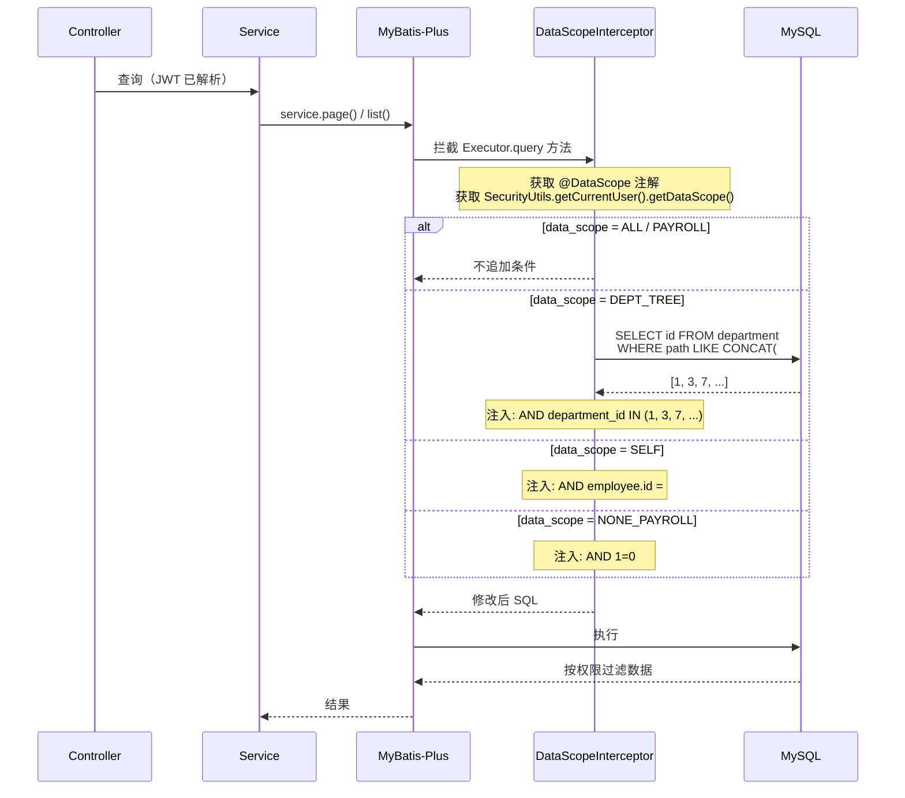

#### 字段权限过滤（列级裁剪）

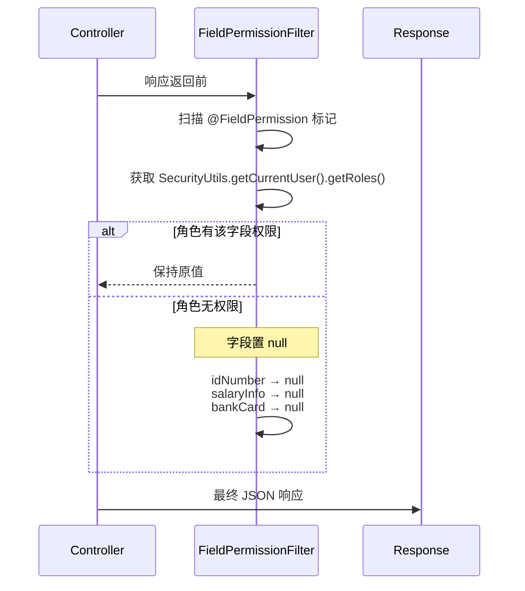

### 3.3.3 资金流/信息流/定时任务分析

| 维度 | 说明 |
|------|------|
| 资金流 | 不涉及 |
| 信息流/正向 | 统一响应封装 → traceId 注入 → DataScope SQL 注入 → FieldPermission 后置裁剪 |
| 信息流/逆向 | 异常自动捕获 → 错误码映射 → 统一错误响应 |
| 定时任务 | 不涉及 |

### 3.3.4 测试用例设计（C 组）

| 编号 | 测试点 | 前置条件 | 操作 | 预期 |
|------|--------|---------|------|------|
| C-01 | 成功响应格式 | 正常接口 | 调用 | code=0, 含 data/traceId/timestamp |
| C-02 | 参数校验失败 | 缺必填字段 | POST 空 body | code=10001, HTTP 400 |
| C-03 | 分页默认值 | 不传 page/pageSize | GET 列表 | page=1, pageSize=20 |
| C-04 | 分页上限截断 | pageSize=101 | GET 列表 | 校验拒绝或截断为100 |
| C-05 | 业务异常 | 触发 BusinessException | 调用 | 返回对应业务码 |
| C-06 | 未知异常 | 模拟 NPE | 触发 | code=90001, HTTP 500 |
| C-07 | DataScope=ALL | HR_STAFF | 查员工列表 | 全部员工 |
| C-08 | DataScope=DEPT_TREE | DEPT_MANAGER | 查员工列表 | 仅本部门及下属 |
| C-09 | DataScope=SELF | EMPLOYEE | 查员工列表 | 仅本人 |
| C-10 | DataScope=NONE_PAYROLL | SYS_ADMIN 查薪资 | 通过 payroll 模块 | AND 1=0 无数据 |
| C-11 | FieldPermission 身份证 | DEPT_MANAGER | GET 员工详情 | idNumber=null |
| C-12 | FieldPermission 薪资 | DEPT_MANAGER | GET 员工薪资 | 薪资字段 null |
| C-13 | FieldPermission 银行卡 | DEPT_MANAGER | GET 员工详情 | bankCard=null |
| C-14 | FieldPermission 紧急联系人 | DEPT_MANAGER | GET 员工详情 | emergencyContact=null |
| C-15 | FieldPermission-HR 专员 | HR_STAFF | GET 员工详情 | 全量可见 |
| C-16 | FieldPermission-本人 | EMPLOYEE | 看自己详情 | 全量可见 |
| C-17 | 数据权限+字段权限叠加 | DEPT_MANAGER | 跨部门查 | 数据权限先过滤 → 无数据 |
| C-18 | traceId 串联 | 任意请求 | 调用 | 响应 traceId 与请求头 X-Trace-Id 一致 |
| C-19 | SecurityUtils 当前用户 | JWT 有效 | 调用 | 返回正确 LoginUser |
| C-20 | SQL 注入防护 | — | 传 `' OR 1=1--` | 参数绑定，无注入 |
| C-21 | 分页 page=0 非法值 | — | GET ?page=0 | 10001 或自动修正为1 |
| C-22 | 分页 page=-1 | — | GET ?page=-1 | 10001 |
| C-23 | traceId UUID 格式 | — | 查响应 | 标准 UUID 格式 |

---

## 3.4 前端模块测试分析

### 3.4.1 业务流程分析

#### 登录页 → Layout → 首页

```mermaid
flowchart TD
    A[访问 /login] --> B{localStorage 有 Token?}
    B -->|无| C[渲染登录表单]
    B -->|有| D{Token 过期?}
    D -->|有效| E[GET /auth/profile → 跳首页]
    D -->|过期| F[POST /auth/refresh]
    F -->|成功| E
    F -->|失败| C
    C --> G[输入账号密码]
    G --> H[前端表单校验]
    H -->|失败| G
    H -->|通过| I[POST /auth/login]
    I -->|失败| J[显示后端错误]
    I -->|成功| K[存 Token → GET /auth/profile]
    K --> L{mustChangePassword?}
    L -->|是| M[弹改密窗→PUT /auth/password→首页]
    L -->|否| N{角色}
    N -->|EMPLOYEE| O[/portal/profile]
    N -->|管理| P[/admin/workbench]
```

#### Token 生命周期管理（三层联动）

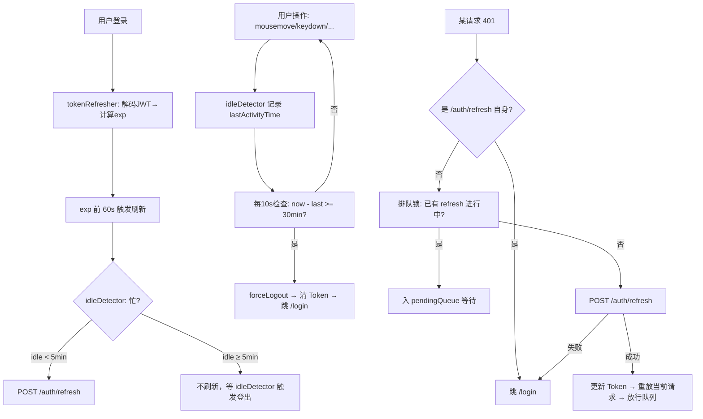

### 3.4.2 交互时序图

#### 401 排队重放

```mermaid
sequenceDiagram
    participant R1 as 请求1 (401)
    participant R2 as 请求2 (401)
    participant FI as 前端拦截器
    participant AU as /auth/refresh

    R1->>FI: 401
    R2->>FI: 401
    FI->>FI: isRefreshing=false → 成为刷新者
    FI->>AU: POST /auth/refresh
    R2->>FI: isRefreshing=true → 入 pendingQueue
    AU-->>FI: 新 Token 对
    FI->>FI: 更新 localStorage.accessToken
    FI->>R1: 重放原请求（新 Token）
    FI->>FI: pendingQueue.forEach resolve
    FI->>R2: 重放原请求
```

#### 前端路由守卫

```mermaid
sequenceDiagram
    participant U as 用户
    participant R as React Router
    participant AC as access.ts
    participant ST as useUserStore

    U->>R: 访问 /admin/xxx
    R->>ST: 是否有 Token?
    alt 无 Token
        R->>U: redirect /login
    else 有 Token
        R->>AC: 检查 access.xxx
        alt 无权限
            R->>U: 403 页面
        else 有权限
            R->>U: 正常渲染页面
        end
    end
```

### 3.4.3 前端页面路由 & 权限矩阵

| 路由 | 页面 | 角色 | 路由守卫行为 |
|------|------|------|-------------|
| `/login` | 登录 | 未登录 | 已登录→跳首页 |
| `/admin/*` | 管理后台 | 管理角色 | 无Token→/login；无权限→403 |
| `/portal/*` | 员工门户 | EMPLOYEE | 无Token→/login |
| `/admin/workbench` | 工作台 | 管理角色 | HR_STAFF/DEPT_MANAGER/FINANCE 可见 |
| `/admin/org/departments` | 部门管理 | SYS_ADMIN, HR_STAFF | 不可见时菜单隐藏+路由403 |
| `/admin/org/positions` | 职位管理 | SYS_ADMIN, HR_STAFF | 同上 |
| `/admin/system/users` | 用户管理 | SYS_ADMIN | 仅 SYS_ADMIN |
| `/admin/system/roles` | 角色管理 | SYS_ADMIN | 仅 SYS_ADMIN |
| `/portal/security` | 账号安全 | EMPLOYEE | 仅 EMPLOYEE |

### 3.4.4 测试用例设计（F 组）

#### 全局基座

| 编号 | 测试点 | 操作 | 预期 |
|------|--------|------|------|
| F-01 | 未登录访问受保护路由 | 直接访问 /admin/workbench | 跳 /login |
| F-02 | 已登录访问 /login | 有 Token 时访问 | 跳首页（不显示登录页）|
| F-03 | Token 自动携带 | 登录后任意请求 | Header 含 Authorization: Bearer |
| F-04 | 401 自动 refresh | 过期 Token | 静默刷新，重放原请求 |
| F-05 | refresh 也 401 | refreshToken 过期 | 跳 /login |
| F-06 | 排队锁 | N 个请求同时 401 | 仅1次 refresh，其余排队 |
| F-07 | idle 检测-正常登出 | 30min 无操作 | 强制登出 |
| F-08 | idle 检测-操作重置 | 29min 时操作 | 不登出，计时重置 |
| F-09 | idle + 后端兜底 | 前端 idle 后操作 | 后端 user:last-active 兜底 |
| F-10 | 业务错误码处理-20001 | 无 Token 请求 | handle401 |
| F-11 | 业务错误码处理-20002 | 越权角色 | message.warning('无权限') |
| F-12 | 业务错误码处理-20003 | 字段权限不足 | 字段隐藏 |
| F-13 | 业务错误码处理-30001 | 部门超层 | message.error（业务提示）|
| F-14 | 业务错误码处理-90001 | 系统异常 | message.error('系统内部错误')|
| F-15 | 全局 Store-用户信息 | 登录后 | useUserStore 含 userId/roles/permissions |

#### 登录页

| 编号 | 测试点 | 操作 | 预期 |
|------|--------|------|------|
| F-16 | 空表单提交 | 直接点击登录 | 前端表单校验提示 |
| F-17 | 用户名格式校验 | 输入非11位数字 | 校验提示 |
| F-18 | 密码为空 | 不输入密码 | 校验提示 |
| F-19 | 登录失败不清空 | 错误密码 | 保留输入，显示后端提示 |
| F-20 | 记住登录 | 勾选后登录 | 下次打开填充 username |
| F-21 | 首次改密弹窗 | mustChangePassword=true | 弹窗阻塞，改密后跳转 |
| F-22 | 改密-两次密码不一致 | confirm 不同 | 前端校验提示 |
| F-23 | 改密-密码强度前端校验 | 纯数字 | 校验提示 |
| F-24 | EMPLOYEE 跳转 | EMPLOYEE 登录 | 跳 /portal/profile |
| F-25 | HR_STAFF 跳转 | HR_STAFF 登录 | 跳 /admin/workbench |
| F-26 | SYS_ADMIN 跳转 | SYS_ADMIN 登录 | 跳 /admin/workbench |

#### Layout & 权限

| 编号 | 测试点 | 角色 | 预期 |
|------|--------|------|------|
| F-27 | 动态菜单-SYS_ADMIN | SYS_ADMIN | 显示全部菜单（除薪资）|
| F-28 | 动态菜单-HR_STAFF | HR_STAFF | 显示工作台/组织/员工/考勤/薪资/审批，无系统设置 |
| F-29 | 动态菜单-DEPT_MANAGER | DEPT_MANAGER | 显示工作台/员工/审批，无组织/系统设置/薪资 |
| F-30 | 动态菜单-FINANCE | FINANCE | 显示工作台/薪资 |
| F-31 | 动态菜单-EMPLOYEE | EMPLOYEE | 仅门户菜单（非 AdminLayout）|
| F-32 | 薪资菜单 SYS_ADMIN 不可见 | SYS_ADMIN | 薪资菜单不显示在左侧 |
| F-33 | 薪资菜单 HR_STAFF 可见 | HR_STAFF | 薪资菜单显示 |
| F-34 | 薪资路由 SYS_ADMIN 直达 | SYS_ADMIN | 403 页面 |
| F-35 | 系统设置-SYS_ADMIN | SYS_ADMIN | 可见 |
| F-36 | 系统设置-HR_STAFF | HR_STAFF | 不可见（无菜单）|
| F-37 | 组织管理-SYS_ADMIN | SYS_ADMIN | 可见 |
| F-38 | 组织管理-DEPT_MANAGER | DEPT_MANAGER | 不可见 |
| F-39 | 按钮级权限-新增员工 | 无 onboarding:create | 按钮隐藏 |
| F-40 | 按钮级权限-编辑员工 | 无 employee:edit | 按钮隐藏 |
| F-41 | 路由直达403 | EMPLOYEE 访问 /admin/system/users | 403 页面 |

#### 部门管理页

| 编号 | 测试点 | 操作 | 预期 |
|------|--------|------|------|
| F-42 | 部门树渲染 | 进入 /admin/org/departments | 左侧树 + 右侧详情 |
| F-43 | 树展开/收起 | 点击节点展开/收起 | 正确展示 |
| F-44 | 树节点选中 | 点击部门节点 | 右侧显示部门详情 |
| F-45 | 新增子部门-表单提交 | 填写必要字段 | 调用 POST → 树刷新 |
| F-46 | 新增-表单校验 | 缺编码 | 校验提示，不提交 |
| F-47 | 编辑-预填数据 | 点击编辑 | Modal 回填当前数据 |
| F-48 | 编辑-修改后保存 | 修改字段 | 调用 PUT → 树刷新 |
| F-49 | 删除-不可删提示 | 有员工部门 | Toast 提示原因 |
| F-50 | 删除-二次确认 | 空部门 | 弹确认窗 → 确认后删除 |
| F-51 | 删除-取消 | 弹确认窗 | 点击取消 → 不删除 |
| F-52 | 合并-选择目标 | 打开合并弹窗 | TreeSelect 可选部门列表 |
| F-53 | 合并-确认 | 选好目标 | 弹确认窗 → 合并 → 树刷新 |
| F-54 | 合并-自身不可选 | 源部门 | TreeSelect 不显示自身 |
| F-55 | 负责人选择 | 点选负责人 | EmployeeSearchSelect 搜索有效 |
| F-56 | 部门编码输入限制 | 输入3位 | 前端校验 2位字母数字 |
| F-57 | 上级部门选择 | TreeSelect | 只可选其他部门（不能选自身）|
| F-58 | 部门员工列表 | 选中拥有员工的部门 | 右侧表格显示员工 |

#### 职位管理页

| 编号 | 测试点 | 操作 | 预期 |
|------|--------|------|------|
| F-59 | 职位列表渲染 | 进入 /admin/org/positions | ProTable 分页展示 |
| F-60 | 序列筛选 | 选 P 序列 | 表格仅 P 序列 |
| F-61 | 部门筛选 | 选部门 | 表格仅该部门 |
| F-62 | 新增职位-表单 | 填写全部字段 | POST 成功 |
| F-63 | 序列级联职级 | 选 M 序列 | 职级 Select 变为 M1-M5 |
| F-64 | 序列级联-切换 | 从 M 切到 P | 职级变为 P1-P10 |
| F-65 | 编辑-预填 | 点击编辑 | Modal 回填当前数据 |
| F-66 | 删除-二次确认 | 点击删除 | 确认弹窗 |
| F-67 | 表格列展示 | 查看各列 | 序列 M/P/S 标签、职级范围格式 |
| F-68 | 职级范围显示 | 查看表格 | 如「P3 - P7」|

#### 用户管理页

| 编号 | 测试点 | 操作 | 预期 |
|------|--------|------|------|
| F-69 | 用户列表 | 进入 /admin/system/users | 分页表格 |
| F-70 | 搜索用户 | 输入手机号 | 过滤 |
| F-71 | 新增用户 | 填写表单 | 创建成功 |
| F-72 | 关联员工搜索 | EmployeeSearchSelect | 搜索 |
| F-73 | 禁用用户 Switch | 点击 Switch | PUT 状态 |
| F-74 | 多角色展示 | 用户有多角色 | Tag[] 显示 |

#### 角色管理页

| 编号 | 测试点 | 操作 | 预期 |
|------|--------|------|------|
| F-75 | 角色列表 | 进入 | 5角色，无新增/删除按钮 |
| F-76 | 编辑角色名 | 修改 | PUT 更新 |
| F-77 | 编辑数据范围 | 修改 | PUT 更新 |
| F-78 | 权限分配 Tree | 打开 Modal | 按 module 分组 |
| F-79 | 权限-半选状态 | 部分勾选子节点 | 父节点半选图标 |
| F-80 | 权限-全选 | 勾选父节点 | 所有子节点全选 |
| F-81 | 权限保存 | 勾选→保存 | PUT 成功→权限即时生效 |

#### 工作台

| 编号 | 测试点 | 操作 | 预期 |
|------|--------|------|------|
| F-82 | KPI 卡片渲染 | 进入 /admin/workbench | 4 张卡片有数据（无 loading）|
| F-83 | KPI 卡片-待审批 | 有待审批 | 数字正确 |
| F-84 | 快捷入口跳转 | 点击花名册 | 跳 /admin/employee/list |
| F-85 | 访问趋势图 | 加载 | 折线图渲染（7天）|
| F-86 | 最近操作 | 加载 | 10 条列表 |
| F-87 | 接口失败降级 | mock summary 500 | 友好提示，不白屏 |

---

## 3.5 全链路测试分析

### 3.5.1 上游依赖

| 上游 | 场景 | 失败表现 | 测试策略 |
|------|------|----------|----------|
| MySQL | 所有读写操作 | 90001 / 健康检查失败 | 断连回归 |
| Redis | Token/缓存/锁 | 登录/刷新/工号生成失败 | Redis 宕机模拟 |
| hrms-employee | 内部建号需 employeeId | 创建用户失败 | 先建员工档案再建号 |

### 3.5.2 下游影响

| 下游 | 依赖能力 | 联调用例 |
|------|----------|----------|
| hrms-employee | POST /internal/users | 入职→账号可登录 |
| hrms-employee | PUT /internal/users/{id}/status | 离职→账号禁用 |
| hrms-employee | PUT /internal/users/{id}/username | 手机号变更→新号登录 |
| hrms-approval/... | JWT 鉴权 + DataScope | 各模块带 Token 正常访问 |
| 前端其他页面 | useUserStore / access | 权限控制正确 |

### 3.5.3 端到端场景

| 编号 | 场景 | 步骤 | 验证点 |
|------|------|------|--------|
| E2E-01 | 管理员初始化 | 种子账号登录→创建HR用户→分配角色 | HR 可登录且菜单正确 |
| E2E-02 | 入职→首次登录 | 入职审批→内部建号→员工登录改密 | 完整生命周期 |
| E2E-03 | 权限变更即时生效 | 回收某权限→用户刷新 | 菜单消失 + API 403 |
| E2E-04 | 离职全流程 | 离职申请→审批→生效 Job | 账号禁用 + 已有会话 401 |
| E2E-05 | 新建部门→建职位→安排员工 | 创建部门→创建职位→入职分配员工 | 组织设置完整 |
| E2E-06 | 部门合并→员工归属 | 合并后查员工列表 | 员工已转目标部门 |
| E2E-07 | 工号生成→登录 | 入职建号→获取工号→首次登录 | 工号格式正确 |
| E2E-08 | 工作台数据一致性 | 对比 summary 与实际数据 | KPI 数值准确 |
| E2E-09 | SYS_ADMIN 薪资不可见 | SYS_ADMIN 登录 | 薪资菜单不显示 + 路由 403 |
| E2E-10 | DEPT_MANAGER 数据权限 | DEPT_MANAGER 查员工列表 | 仅本部门及其下属 |

### 3.5.4 错误码覆盖

| code | 含义 | 触发方式 | 前端处理 |
|------|------|----------|----------|
| 0 | 成功 | — | 正常处理 data |
| 10001 | 参数校验失败 | 缺字段/非法值 | `message.error('参数校验失败')` |
| 20001 | 未登录/Token过期 | 无Token/过期/黑名单 | handle401()→跳登录 |
| 20002 | 无权限 | 角色越权 | `message.warning('无权限')` |
| 20003 | 字段权限不足 | DEPT_MANAGER 看身份证 | 字段 null 显示 |
| 30001 | 部门层级超5层 | 第6层建子部门 | `message.error(业务提示)` |
| 30002 | 部门合并前尚有员工 | 非空部门合并？| `message.error(业务提示)` |
| 60004 | 未二次验证 | 直接查工资条 | 弹出 PayslipVerifyModal |
| 90001 | 系统内部错误 | 未捕获异常 | `message.error('系统内部错误')` |

### 3.5.5 异步流程

| 异步点 | 机制 | 验证点 |
|--------|------|--------|
| 登录日志写入 | 异步线程 | 登录成功后 login_log 有记录 |
| 权限缓存失效 | 同步删 Redis Key | 变更后即时生效 |
| 无操作超时 | Redis TTL 自动过期 | 30分钟后请求 401 |

---

## 3.6 配置测试

### 3.6.1 后端配置

| 配置项 | 环境 | 测试点 |
|--------|------|--------|
| `spring.profiles.active` | dev/test/prod | 各环境数据源/Redis 正确 |
| JWT secret | 各环境独立 | 跨环境 Token 不可互用（签名失败）|
| AccessToken TTL=7200s | 全部 | 2h 后返回 401 |
| RefreshToken TTL=7d | 全部 | 7 天后 refresh 失败 |
| BCrypt cost=12 | 全部 | 密码哈希耗时合理（<1s）|
| Redis 连接池 | test | 连接池参数正常 |
| RabbitMQ（如有） | — | 未使用（非异步架构）|
| Flyway enabled=true | dev | 自动迁移 |
| Flyway enabled=false | prod | 手动控制 |
| Actuator health | 全部 | GET /actuator/health → UP |
| 部门最大层级=5 | 全部 | 第6层拒绝（30001）|
| 默认试用期=3 | 全部 | 不传则默认 3 |

### 3.6.2 前端配置

| 配置项 | 测试点 |
|--------|--------|
| baseURL `/api/v1` | 请求 URL 路径拼接正确 |
| dev 代理 :8080 | 本地开发跨域正常 |
| access 插件 | 与 access.ts 定义一致 |
| 路由 `routes.ts` | 白名单 /login 无需 Token |
| idleDetector 30min | 超时触发 forceLogout |
| tokenRefresher 提前 60s | AccessToken exp 前 60s 静默刷新 |
| localStorage key | accessToken/refreshToken 存取正常 |
| 记住登录 | username 存 localStorage |

### 3.6.3 数据初始化验证

| 检查项 | 操作 | 预期 |
|--------|------|------|
| 角色数量 | SELECT COUNT(*) FROM sys_role | =5 |
| 管理员可登录 | 种子账号登录 | 成功 |
| 权限种子 | SELECT * FROM sys_permission | 含各模块 MENU/BUTTON/API |
| 根部门 | SELECT * FROM department WHERE parent_id IS NULL | ≥1 |
| sys_dict | SELECT * FROM sys_dict | 有预置数据 |
| Redis 缓存 | 首次 GET /auth/profile | user:permissions 写入 |
| Redis 部门缓存 | 首次 GET /departments/tree | dept:tree 写入 |

---

# 4. 非功能性需求测试分析

## 4.1 并发测试分析

| 场景 | 风险点 | 测试方法 | 预期 |
|------|--------|----------|------|
| 高并发登录同账号 | Redis INCR 计数竞态 | JMeter 50线程 | 计数准确，第5次锁定 |
| 并发刷新 Token | Refresh 轮换竞态 | 10线程同时 refresh | 仅一个成功，其余旧 Token 失效 |
| 并发权限分配 | 最终一致 | 多线程 PUT permissions | 最后一次覆盖 |
| 同编码并发建部门 | uk_code 约束 | 多线程 POST | 一个成功，其余 409 |
| 并发工号生成 | 重复工号 | 多线程 generate() | Redis SETNX 串行，无重复 |
| 部门树缓存击穿 | 大面积并发 | 缓存过期瞬间 100并发 | DB 压力可控，不崩溃 |
| 并发登录+刷新混合 | 混合场景 | 多场景混合 | 各接口正常 |

### 锁机制

| 组件 | 锁机制 | 测试点 |
|------|--------|--------|
| login:fail 计数 | Redis INCR 原子操作 | 并发递增准确 |
| Refresh Token 轮换 | Redis 单 Key 覆盖 | 旧 Token 失效 |
| 工号生成 | Redis SETNX 分布式锁 | 串行化无重复 |
| 用户 status | DB 行锁 | 禁用后登录终止 |
| 部门合并 | 事务 + 行锁 | 数据一致性 |

### 热点 Key

| 热点 Key | 风险 | 缓解措施 |
|----------|------|----------|
| user:permissions:{adminId} | 频繁失效重建 | 高频角色权限变化少，可控 |
| dept:tree | 全局缓存，所有部门查询依赖 | TTL 5min + 变更主动删 Key |
| login:fail:{username} | 暴力破解集中 | Redis INCR 原子 + 自动 15min 过期 |

## 4.2 权限安全

### 必测安全用例（SEC）

| 编号 | 角色 | 操作 | 预期 |
|------|------|------|------|
| SEC-01 | EMPLOYEE | GET /system/users | 403 |
| SEC-02 | EMPLOYEE | 前端访问 /admin | 403 或重定向 |
| SEC-03 | DEPT_MANAGER | 查其他部门员工（employee模块）| 数据权限过滤（无数据）|
| SEC-04 | SYS_ADMIN | GET /payroll/batches | 403 双拦截 |
| SEC-05 | SYS_ADMIN | 前端薪资菜单 | 不可见 |
| SEC-06 | 无 Token | 任意受保护 API | 401 |
| SEC-07 | 篡改 JWT payload | 修改 roles 字段 | 签名失败 401 |
| SEC-08 | 登出后旧 Token | 使用已登出 Token | 401（黑名单）|
| SEC-09 | DEPT_MANAGER 看身份证 | 查下属 | 字段权限→idNumber=null |
| SEC-10 | 直接 PUT mobile | 绕过审批 | 接口拒绝 |
| SEC-11 | 未二次验证查工资条 | 直接请求 | 60004 |
| SEC-12 | SQL 注入 | username 传 `' OR 1=1--` | 参数绑定，无注入 |
| SEC-13 | EMPLOYEE | GET /departments/tree | 403 |
| SEC-14 | DEPT_MANAGER | POST /positions | 403 |
| SEC-15 | SYS_ADMIN | 部门树/职位管理 | 正常访问 |
| SEC-16 | HR_STAFF | 查看薪资模块 | 正常访问（HR 可见）|
| SEC-17 | FINANCE | 查看薪资模块 | 正常访问（财务可见）|
| SEC-18 | HR_STAFF | POST /system/users（越权） | 403 |
| SEC-19 | DEPT_MANAGER | 删除其他部门（越权） | 403（角色校验）|
| SEC-20 | 接口参数校验 | 传递超长字符串 | 截断或 10001 |

### 审计验证

| 操作 | 审计表 | 关键字段 |
|------|--------|----------|
| 登录成功/失败 | login_log | user_id, ip, success, fail_reason |
| 权限变更 | operation_log | module=auth, action=UPDATE_PERMISSION |
| 创建用户 | operation_log | module=auth, action=CREATE_USER |
| 部门变更 | operation_log | module=org, action=UPDATE_DEPT |
| 部门合并 | operation_log | module=org, action=MERGE_DEPT |
| 职位维护 | operation_log | module=org, action=CREATE/UPDATE/DELETE_POSITION |

### 敏感数据

| 数据 | 存储 | 传输 | 测试点 |
|------|------|------|--------|
| 密码 | BCrypt 哈希（cost=12） | 不回显、不落日志 | 响应/日志无明文 |
| 身份证 | AES-256-GCM 加密 | 字段权限裁剪 | 无权限角色不可见全量 |
| 银行卡号 | AES-256-GCM 加密 | 字段权限裁剪 | 仅 HR 专员可见 |
| 紧急联系人 | 明文 | 字段权限裁剪 | DEPT_MANAGER 不可见 |
| 薪资信息 | — | 字段权限+模块双拦截 | SYS_ADMIN 不可见 |
| Token | localStorage（前端） | HTTPS | 禁止 URL 传参 |

---

# 5. 三板斧

## 5.1 可监控

| 监控项 | 指标/日志 | 告警阈值建议 |
|--------|-----------|-------------|
| 登录成功率 | login_log 中 success=1 比例 | <95% 告警 |
| 登录失败激增 | login:fail 计数 | 单账号 5 次自动锁定（业务内置）|
| Token 刷新失败率 | /auth/refresh 非 0 code 比例 | >10% 告警 |
| 401 比例 | API 网关/应用日志 401 占比 | 异常突增可能 Token 问题 |
| 权限变更 | operation_log | 无自动告警，人工审计 |
| 健康检查 | /actuator/health | DOWN 立即告警 |
| 错误码分布 | code 20001/20002/90001 | 90001 >1% 告警 |
| 部门操作审计 | operation_log | 异常删除/合并审计 |
| 工号生成 | 工号生成日志 | 生成失败告警 |

**业务看板建议：**
- 日活登录用户数（login_log 去重）
- 各角色登录分布
- 系统管理操作次数（用户/角色/部门/职位变更）
- 部门数和职位数趋势
- 密码过期即将超 90 天的用户数

## 5.2 可灰度

| 灰度维度 | 方案 |
|----------|------|
| 应用发布 | Nginx 按权重切流到多实例 |
| 权限变更 | 无需灰度，变更删缓存即时生效，无状态 |
| 新角色/权限 | 测试环境验证种子数据后 Flyway 同步生产 |
| JWT secret 变更 | 不可灰度，需全量发布同时切换 |
| 前端静态资源 | CDN 版本号，可按用户白名单逐步切换 |
| Redis Key 结构变更 | 需评估缓存穿透影响，先在预发验证 |

**注意点：**
- JWT secret 变更需全量发布，不可新旧密钥混用
- Redis Key 结构（如 `user:permissions` 格式）变更需兼容旧 Key
- 部门数据是其他模块依赖基础，组织架构变更需谨慎
- 工号生成规则变更影响员工档案，须提前通知相关模块

## 5.3 可回滚

| 回滚类型 | 顺序 | 说明 |
|----------|------|------|
| 代码回滚 | Nginx 切回旧版本 → 重启旧 Jar | 优先于数据回滚 |
| 配置回滚 | 恢复 application.yml 备份 | JWT/Redis 地址回退 |
| 数据库回滚 | Flyway 无自动回滚 | 提前备份；必要时手动逆向 DDL |
| 缓存清理 | 删特定 Key 前缀 | 权限/Token/部门树异常时清缓存 |
| 前端回滚 | 部署上一版本静态资源 | 路由/access 变更需同步 |

**发布顺序：** MySQL 迁移 → Redis 就绪 → 应用服务 → Nginx 切流

**回滚顺序：** Nginx 切回旧版本 → 停新版本 → 恢复 DB 备份（若迁移不可逆）

---

# 6. 风险评估

| ID | 风险描述 | 影响 | 概率 | 规避/缓解措施 |
|----|----------|------|------|-------------|
| R-01 | JWT 密钥泄露 | 全系统身份伪造 | 低 | 环境隔离、密钥轮换预案、短 TTL |
| R-02 | Redis 宕机 | 无法登录/刷新/部门树缓存/工号锁 | 中 | 主从哨兵、降级提示、健康检查 |
| R-03 | 权限缓存不一致 | 越权或误拒 | 中 | 变更时主动删 Key；关键 API 服务端二次校验 |
| R-04 | 内部接口裸奔 | 未授权建号 | 中 | 内网 IP 白名单 / 内部 Token 鉴权 |
| R-05 | SYS_ADMIN 薪资越权 | 薪资数据泄露 | 低 | 前后端双拦截 + 专项用例 SEC-04/05 |
| R-06 | Flyway 迁移失败 | 启动阻塞 | 低 | 预发验证、DB 备份、手动修复脚本 |
| R-07 | 前端 Token 存 localStorage | XSS 窃取 Token | 低 | CSP、输入消毒、禁止 dangerouslySetInnerHTML |
| R-08 | 入职建号不一致 | 员工无法登录 | 中 | employeeId 外键校验 + E2E-02 联调 |
| R-09 | 并发 Refresh 竞态 | 用户被迫重登 | 低 | 轮换机制保障 + 前端排队锁 |
| R-10 | 工作台 KPI 不准 | 管理决策误导 | 中 | 接口契约测试 + 源模块数据对账 |
| R-11 | 部门合并数据不一致 | 员工/子部门丢失 | 中 | 事务+事后数据对账 |
| R-12 | 工号生成重复 | 工号冲突 | 低 | Redis 分布式锁 + 唯一约束 + 重试机制 |
| R-13 | 部门树递归性能 | 大数据量内存溢出 | 低 | 最多5层，节点<100，内存构建受控 |

---

# 7. 工时评估（测试计划）

## 7.1 测试阶段划分

| 阶段 | 时间 | 内容 | 负责人 |
|------|------|------|--------|
| 测试设计 | 2.5 人日 | 用例编写、Xmind 评审、测试数据准备 | 测试 + 李俊毅 |
| 接口测试（auth） | 2 人日 | 认证/系统管理/内部接口全覆盖，错误码验证 | 李俊毅 + 测试 |
| 接口测试（org） | 1.5 人日 | 部门/职位/工号生成接口全覆盖 | 李俊毅 + 测试 |
| 前端功能测试 | 3 人日 | 登录/Layout/权限/组织架构/工作台 UI 交互 | 测试 |
| 联调测试 | 2 人日 | 入职建号/离职禁用/权限变更/部门合并 E2E | 全员 |
| 安全专项 | 1 人日 | SEC-01~20 必测、越权扫描 | 测试 |
| 非功能测试 | 1 人日 | 并发登录/刷新/工号生成、配置切换 | 测试 |
| 回归 & 验收 | 1 人日 | Bug 修复回归、验收签字 | 测试 |

**合计：约 14 人日**

## 7.2 测试环境

| 环境 | 地址 | 用途 |
|------|------|------|
| 本地 | frontend :8000 / backend :8080 | 开发自测 |
| 联调 | 39.101.67.167 | 跨模块联调 |
| 测试 | 待部署 | 正式测试周期 |

## 7.3 测试准入/准出

**准入条件：**
- [ ] V1/V2 Flyway 脚本执行成功（10表 + 种子数据）
- [ ] 认证接口 Postman Collection 可跑通（login/profile/refresh）
- [ ] 部门树 GET /departments/tree 可返回正确结构
- [ ] 前端 /login → /admin/workbench 可正常访问
- [ ] 种子 SYS_ADMIN 账号可登录

**准出条件：**
- [ ] P0 用例 100% 通过
- [ ] 无 P0/P1 未关闭缺陷
- [ ] SEC-01~20 必测 100% 通过
- [ ] 跨模块 E2E-01~10 全部通过
- [ ] 三板斧监控项已配置
- [ ] 测试报告已归档

## 7.4 缺陷优先级

| 级别 | 定义 | 示例 |
|------|------|------|
| P0 | 阻塞上线 | 无法登录、越权访问薪资、部门数据丢失、工号重复 |
| P1 | 核心功能受损 | 权限变更不生效、Token 刷新失败、部门树错误 |
| P2 | 一般功能 | 工作台 KPI 展示错误、日志分页异常、职位筛选无效 |
| P3 | 体验优化 | 记住登录失效、级联选择延迟、样式/文案问题 |

---

# 附录 A：与系分章节映射

| 测分章节 | 后端系分 | 前端系分 |
|----------|---------|---------|
| §2.1 功能清单 | §1~§3 | §1~§5 |
| §2.4.2 接口总览 | §3.2.4 / §3.3.4 | §2.2.1~§2.2.9 |
| §2.4.3 数据模型 | §3.1.5 / §3.2.2 / §3.3.2 | — |
| §3.1 hrms-auth | §3.2 | §2.2.1 / §2.2.10 |
| §3.2 hrms-org | §3.3 | §2.2.4 / §2.2.5 |
| §3.3 hrms-common | §3.1 | — |
| §3.4 前端模块 | — | §2.2 |
| §3.5 全链路 | §3.2.6 / §3.3.3 | §2.3 |
| §4.1 并发 | §4.3~§4.4 | §2.2.10 |
| §4.2 权限安全 | §4.1~§4.3 | §2.3 / §5.2 |
| §5 三板斧 | — | §3 |

---

> **文档结束** — 本测分基于《李俊毅-后端系分.md》v2.0.0、《李俊毅-前端系分.md》v2.0.0 编写，严格遵循测分模板大纲，覆盖李俊毅负责的全栈范围（hrms-common / hrms-auth / hrms-org / 前端基座 + 6 个页面）。跨模块用例在联调阶段与 B/C/D 同学协同执行。
