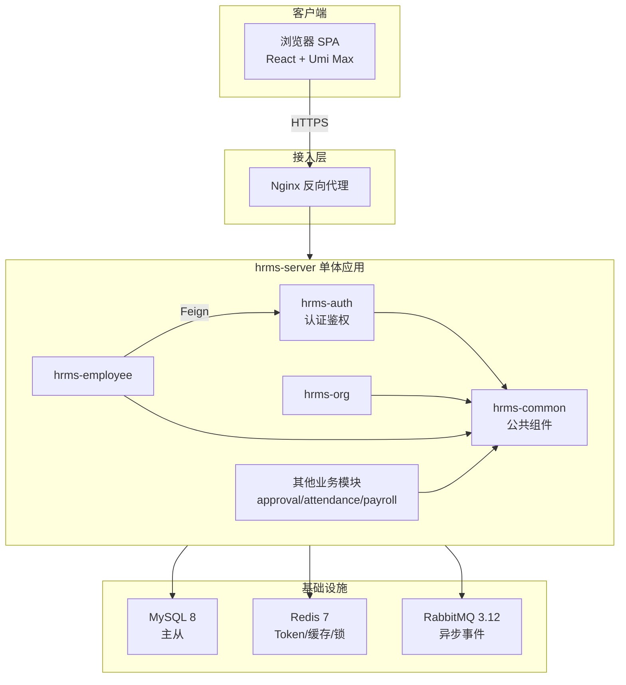
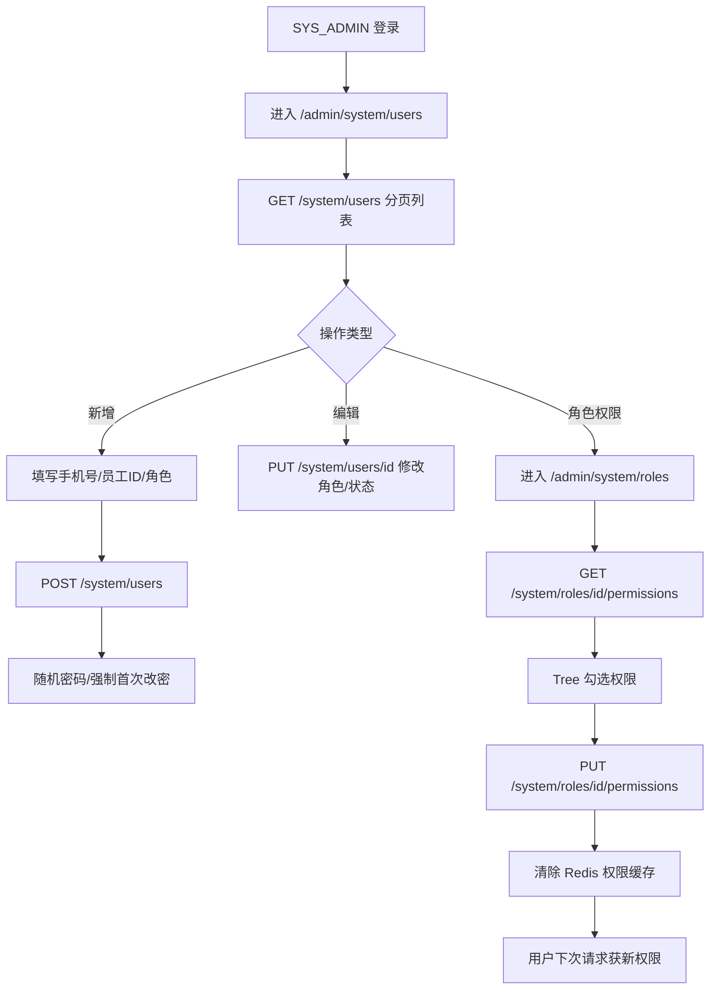
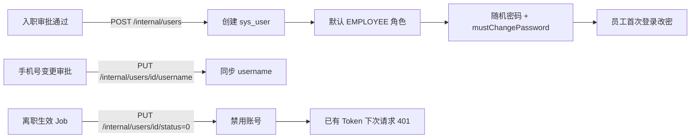
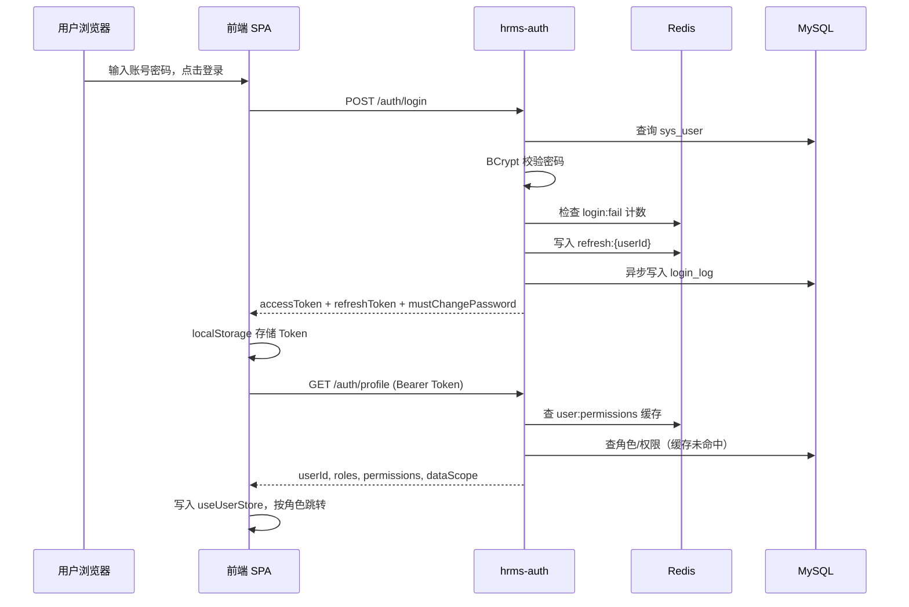
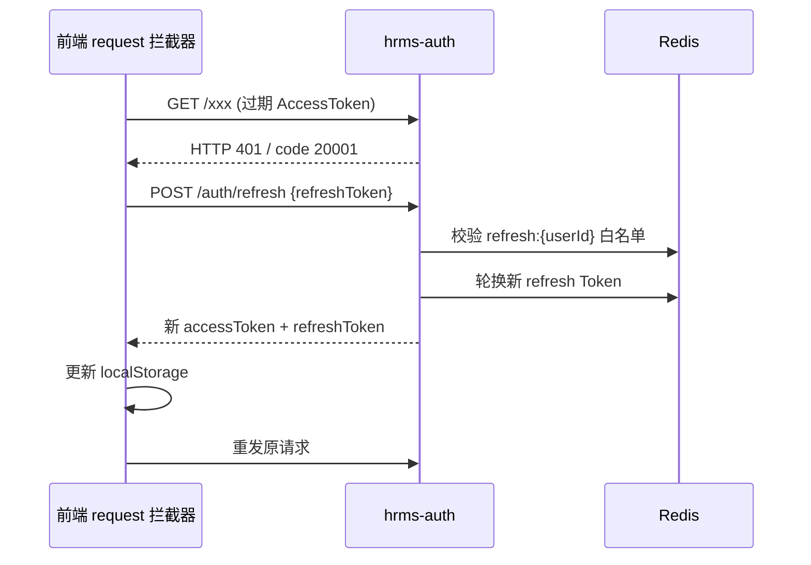
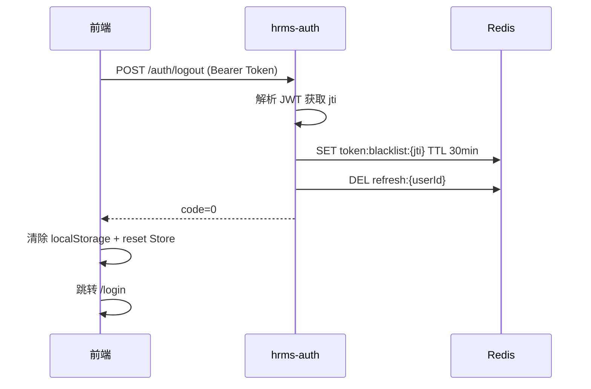

# 人员 A · 测试分析文档（测分）

> **文档版本**：v1.0.0  
> **编写人**：李俊毅（人员 A）  
> **锚定系分**：《人员A-后端系分.md》v1.0.0、《人员A-前端系分.md》v1.0.0  
> **契约锚点**：《HRMS-API-Contract.md》v1.0.0  
> **目标读者**：测试工程师、开发、架构评审  
> **被测范围**：hrms-app / hrms-common / hrms-auth（后端）+ 全局基座 / 登录 / Layout / 权限体系 / Dashboard 工作台（前端）

---

# 1. 产品概述

## 1.1 产品背景

### 业务背景

HRMS（人力资源管理系统）面向企业内部人事、财务、部门主管及普通员工，提供统一的入转调离、考勤、薪资、审批等能力。人员 A 负责的**认证鉴权与权限基座**是全系统的安全入口与访问控制中枢：

- 所有用户通过手机号/工号登录，按 RBAC 角色获得不同菜单与数据范围；
- 系统管理员（SYS_ADMIN）可管理用户/角色/权限，但**不可访问薪资模块**（PRD 强制双拦截）；
- 普通员工登录后进入员工门户，管理角色进入管理后台；
- 入职、离职、手机号变更等跨模块流程依赖本模块提供的内部账号创建/禁用/同步能力。

### 开发背景

本项目采用**模块化单体（Modular Monolith）**架构，人员 A 承担 Sprint 0 基座建设：

| 层级 | 模块 | 职责 |
| --- | --- | --- |
| 后端父工程 | `hrms-app` | Maven 聚合、依赖版本管控、打包部署 |
| 后端公共 | `hrms-common` | 统一响应、分页、异常、数据权限、字段权限、工具类 |
| 后端业务 | `hrms-auth` | 登录认证、JWT、RBAC、系统管理、内部 Feign 接口 |
| 前端基座 | `frontend/src` 全局层 | request 拦截、路由守卫、access 权限、Zustand Store |
| 前端页面 | 登录 / Layout / 系统设置 / 工作台 | 双端布局、权限管理 UI、Dashboard |

本测分聚焦人员 A 负责范围，跨模块联调场景在 §3.5 全链路测试中说明依赖边界。

## 1.2 相关文档

| 文档 | 路径/版本 | 用途 |
| --- | --- | --- |
| PRD（业务规则最终来源） | `人资管理系统-PRD.md` | 角色矩阵、密码策略、审计要求 |
| 后端总系分 | `HRMS-Backend-System-Design(2)(2)(3).md` v1.8.0 | 架构、DDL、API 权威 |
| 人员 A 后端系分 | `人员A-后端系分.md` v1.0.0 | 本模块后端详细设计 |
| 前端总系分 | `HRMS-Frontend-System-Design(1)(2)(1).md` v1.8.3 | 路由、组件、权限模型 |
| 人员 A 前端系分 | `人员A-前端系分.md` v1.0.0 | 本模块前端详细设计 |
| API 契约 | `HRMS-API-Contract(2)(1).md` v1.0.0 | 接口字段、错误码对齐 |
| 业务规则 Skill | `.cursor/skills/hrms-business-rules/SKILL.md` | 权限/薪资禁区自检 |
| 安全审查 Skill | `.cursor/skills/hrms-security-review/SKILL.md` | 必测安全用例 |

---

# 2. 项目整体分析

## 2.1 功能性需求清单

按模块划分人员 A 负责的功能点：

| 模块 | 功能域 | 功能点 | 优先级 |
| --- | --- | --- | --- |
| **hrms-common** | 基础设施 | 统一响应 `Result<T>`、分页 `PageResult` | P0 |
| | 异常处理 | 全局异常处理器（10001/20001/20002/90001 等） | P0 |
| | 数据权限 | `@DataScope` + `DataScopeInterceptor` 行级过滤 | P0 |
| | 字段权限 | `FieldPermissionFilter` 敏感字段裁剪 | P0 |
| | 工具类 | `SecurityUtils`、`AesEncryptUtil`、`TraceIdUtil` 等 | P1 |
| **hrms-auth** | 认证 | 登录 / 登出 / Token 刷新 / 当前用户信息 | P0 |
| | 安全策略 | 登录失败锁定、密码 90 天轮换、首次强制改密 | P0 |
| | 会话管理 | JWT 30min、无操作超时、Token 黑名单 | P0 |
| | 二次验证 | 工资条查看二次验证（`POST /auth/verify`） | P1 |
| | 手机绑定 | 绑定/解绑手机（SMS 验证码） | P1 |
| | 系统管理 | 用户 CRUD、角色管理、权限分配 | P0 |
| | 审计日志 | 登录日志、操作审计日志查询 | P1 |
| | 工作台 | Dashboard 汇总数据 `GET /workbench/summary` | P0 |
| | 内部接口 | 创建账号、禁用账号、同步用户名 | P0 |
| | 数据字典 | `sys_dict` 预置枚举 | P2 |
| **前端基座** | 请求层 | Token 自动携带、401 刷新/跳转、业务错误码处理 | P0 |
| | 路由守卫 | 未登录拦截、角色默认跳转 | P0 |
| | 权限体系 | `access.ts` + Umi access 插件、按钮级权限 | P0 |
| | 全局 Store | `useUserStore`、`usePermissionStore` | P0 |
| **前端页面** | 登录页 | 表单校验、记住登录、首次改密弹窗 | P0 |
| | 双端布局 | AdminLayout / PortalLayout、动态菜单 | P0 |
| | 系统设置 | 用户管理、角色管理、权限树分配 | P0 |
| | 工作台 | KPI 卡片、快捷入口、操作日志列表 | P0 |

## 2.2 改动范围

| ID | 模块 | 改动类型 | 需求点 |
| --- | --- | --- | --- |
| A-01 | hrms-app | 新增 | Maven 父 POM、依赖版本 BOM、Flyway 迁移目录约定 |
| A-02 | hrms-common | 新增 | `Result`/`PageResult`/`PageParam`、全局异常处理 |
| A-03 | hrms-common | 新增 | `DataScopeInterceptor`、`FieldPermissionFilter` |
| A-04 | hrms-common | 新增 | 业务枚举（EmploymentStatus、DataScopeType 等）、错误码常量 |
| A-05 | hrms-auth | 新增 | 8 张权限相关 DDL（sys_user/role/permission 等） |
| A-06 | hrms-auth | 新增 | 认证接口 7 个（login/logout/refresh/profile/password/mobile/verify） |
| A-07 | hrms-auth | 新增 | 系统管理接口 8 个（users/roles/permissions/logs/backup） |
| A-08 | hrms-auth | 新增 | 内部接口 3 个（createUser/updateStatus/updateUsername） |
| A-09 | hrms-auth | 新增 | JWT + Redis 会话（黑名单/白名单/权限缓存） |
| A-10 | frontend | 新增 | `app.tsx` 全局 request + 路由守卫 |
| A-11 | frontend | 新增 | `access.ts` 权限定义 |
| A-12 | frontend | 新增 | 登录页 `/login` |
| A-13 | frontend | 新增 | AdminLayout / PortalLayout |
| A-14 | frontend | 新增 | 系统设置页（用户/角色/权限/日志） |
| A-15 | frontend | 新增 | 工作台 `/admin/workbench` |

## 2.3 术语表

| 术语 | 英文/代码 | 说明 |
| --- | --- | --- |
| 访问令牌 | Access Token | JWT，有效期 30 分钟（1800s），Header `Authorization: Bearer` |
| 刷新令牌 | Refresh Token | Redis 白名单存储，有效期 7 天，用于静默续签 |
| RBAC | Role-Based Access Control | 用户 → 角色 → 权限码三级模型 |
| 数据范围 | dataScope | ALL / DEPT_TREE / SELF / PAYROLL / NONE_PAYROLL，控制行级数据可见性 |
| 字段权限 | FieldPermission | 身份证、薪资等敏感字段按角色裁剪/脱敏 |
| 权限码 | permission.code | 如 `employee:view:all`，驱动前端菜单与按钮显隐 |
| 预置角色 | SYS_ADMIN 等 | 5 个内置角色，不可删除 |
| 首次改密 | mustChangePassword | 随机密码账号首次登录须修改密码 |
| 密码轮换 | password_changed_at | 超 90 天须强制改密 |
| 登录锁定 | login:fail:{username} | Redis 计数，5 次失败锁定 15 分钟 |
| 二次验证 | payslip verify | 查看工资条前须密码/SMS 验证，Redis TTL 30min |
| 模块化单体 | Modular Monolith | 单部署单元，按 Maven 模块划分边界 |
| 链路追踪 | traceId | 请求 Header `X-Trace-Id`，响应体 `traceId` 字段 |

## 2.4 系统架构分析

### 2.4.1 系统依赖关系



**人员 A 模块依赖说明：**

| 依赖方 | 被依赖方 | 依赖类型 | 说明 |
| --- | --- | --- | --- |
| 全业务模块 | hrms-common | Maven 编译依赖 | 统一响应、异常、数据权限 |
| hrms-auth | MySQL | 运行时 | sys_user/role/permission 等表 |
| hrms-auth | Redis | 运行时 | Token 黑名单、权限缓存、登录锁定 |
| hrms-employee | hrms-auth | Feign 内部调用 | 入职/离职/手机号变更触发账号操作 |
| 前端 SPA | hrms-auth | HTTP REST | `/api/v1/auth/*`、`/system/*` |
| 前端 SPA | 其他模块 | HTTP REST | 工作台部分 KPI 来自 approval 等模块 |

### 2.4.2 被测系统总体接口

**Base URL**：`/api/v1`

#### 认证接口（无需/弱鉴权）

| 方法 | 路径 | 鉴权 | 说明 |
| --- | --- | --- | --- |
| POST | `/auth/login` | 否 | 登录 |
| POST | `/auth/logout` | 是 | 登出 |
| POST | `/auth/refresh` | RefreshToken | 刷新 Token |
| GET | `/auth/profile` | 是 | 用户信息+权限 |
| PUT | `/auth/password` | 是 | 修改密码 |
| PUT | `/auth/mobile` | 是 | 绑定手机 |
| DELETE | `/auth/mobile` | 是 | 解绑手机 |
| POST | `/auth/verify` | 是 | 工资条二次验证 |

#### 系统管理接口（SYS_ADMIN）

| 方法 | 路径 | 说明 |
| --- | --- | --- |
| GET | `/workbench/summary` | 工作台汇总（HR_STAFF+） |
| GET/POST/PUT | `/system/users`、`/system/users/{id}` | 用户管理 |
| GET/PUT | `/system/roles`、`/system/roles/{id}/permissions` | 角色与权限 |
| GET | `/system/operation-logs` | 操作审计 |
| GET | `/system/login-logs` | 登录日志 |
| POST | `/system/backup` | 数据备份 |

#### 内部接口（仅服务间调用）

| 方法 | 路径 | 调用方 |
| --- | --- | --- |
| POST | `/internal/users` | hrms-employee / 入职模块 |
| PUT | `/internal/users/{id}/status` | hrms-employee（离职生效） |
| PUT | `/internal/users/{id}/username` | hrms-employee（手机号变更） |

#### 前端页面路由

| 路由 | 页面 | 角色 |
| --- | --- | --- |
| `/login` | 登录页 | 未登录 |
| `/admin/workbench` | 工作台 | 管理角色 |
| `/admin/system/users` | 用户管理 | SYS_ADMIN |
| `/admin/system/roles` | 角色管理 | SYS_ADMIN |
| `/admin/system/operation-logs` | 操作日志 | SYS_ADMIN |
| `/admin/system/login-logs` | 登录日志 | SYS_ADMIN |
| `/portal/profile` | 员工门户首页 | EMPLOYEE |

### 2.4.3 数据模型变更

#### 数据库变更（Flyway）

| 迁移脚本 | 表 | 变更类型 | 说明 |
| --- | --- | --- | --- |
| V1__init_schema.sql | `sys_user` | 新增 | 系统用户（手机号登录） |
| V1 | `sys_role` | 新增 | 角色（含 data_scope） |
| V1 | `sys_permission` | 新增 | 权限/菜单（MENU/BUTTON/API） |
| V1 | `sys_user_role` | 新增 | 用户-角色关联 |
| V1 | `sys_role_permission` | 新增 | 角色-权限关联 |
| V1 | `login_log` | 新增 | 登录日志 |
| V1 | `operation_log` | 新增 | 操作审计 |
| V1 | `sys_dict` | 新增 | 数据字典 |
| V2__seed_data.sql | 上述表 | 初始化 | 5 预置角色 + 权限种子数据 |

**关键索引：**

| 表 | 索引 | 用途 |
| --- | --- | --- |
| sys_user | uk_username | 登录账号唯一 |
| sys_role | uk_code | 角色编码唯一 |
| sys_permission | uk_code | 权限编码唯一 |
| login_log | idx_user_time | 登录日志分页查询 |

#### 缓存变更（Redis Key）

| Key 模式 | TTL | 用途 |
| --- | --- | --- |
| `user:permissions:{userId}` | 10min | 权限码缓存 |
| `hrms:perm:user:{userId}` | 30min | 完整权限 JSON |
| `token:blacklist:{jti}` | 30min | 登出 Token 黑名单 |
| `refresh:{userId}` | 7d | Refresh Token 白名单 |
| `login:fail:{username}` | 15min | 登录失败计数 |
| `user:active:{userId}` | 30min | 无操作超时检测 |
| `hrms:payslip:verified:{userId}` | 30min | 工资条二次验证通过标记 |

#### 配置变更

| 配置项 | 文件 | 说明 |
| --- | --- | --- |
| JWT 密钥 | `application-{env}.yml` | 签名密钥，各环境独立 |
| BCrypt cost | 默认 12 | 密码哈希强度 |
| Redis 连接 | `application-{env}.yml` | 哨兵/单机地址 |
| Flyway | `spring.flyway.*` | 迁移开关与基线版本 |
| 前端 baseURL | `frontend/.umirc.ts` | `/api/v1` 代理 |

---

# 3. 功能性需求测试分析

> 本章为核心章节，按人员 A 负责模块逐项分析。

## 3.1 各模块功能测试分析

### 3.1.1 业务流程分析

#### （1）登录认证 — 正常流程

```mermaid
flowchart TD
    A[用户打开 /login] --> B[输入账号密码]
    B --> C{表单校验}
    C -->|失败| B
    C -->|通过| D[POST /auth/login]
    D --> E{认证结果}
    E -->|失败| F[提示错误/计数+1]
    F --> G{失败≥5次?}
    G -->|是| H[锁定15分钟]
    G -->|否| B
    E -->|成功| I[存储 Token 至 localStorage]
    I --> J[GET /auth/profile]
    J --> K{mustChangePassword?}
    K -->|是| L[弹出改密弹窗]
    L --> M[PUT /auth/password]
    M --> N[跳转首页]
    K -->|否| O{角色判断}
    O -->|EMPLOYEE| P[/portal/profile]
    O -->|管理角色| Q[/admin/workbench]
```

#### （2）登录认证 — 异常流程

| 异常场景 | 触发条件 | 预期结果 |
| --- | --- | --- |
| 账号不存在 | username 无匹配记录 | 提示「账号或密码错误」，不写具体原因 |
| 密码错误 | BCrypt 不匹配 | 同上，Redis 计数 +1 |
| 账号禁用 | status=0 | 提示账号已禁用 |
| 账号锁定 | 5 次失败 | 提示锁定，15min 内拒绝登录 |
| Token 过期 | Access Token 超 30min | 401 → 尝试 refresh → 失败则跳转登录 |
| 无操作超时 | 30min 无 API 调用 | Token 失效，401 |
| 已登出 Token | jti 在黑名单 | 401 |
| 密码超 90 天 | password_changed_at 过期 | mustChangePassword=true |

#### （3）用户/角色权限管理 — 正常流程



#### （4）跨模块账号生命周期（联调边界）



### 3.1.2 交互时序图

#### 登录 + Profile 获取



#### Token 刷新（401 静默续签）



#### 登出 + Token 黑名单



### 3.1.3 资金流分析

**本模块不涉及资金流转。**

人员 A 范围无支付、转账、结算等资金实体。与「薪资」相关的 `POST /auth/verify` 仅为**访问控制二次验证**，不产生资金变动，在 §3.1.4 信息流中覆盖。

### 3.1.4 信息流分析

#### 正向信息流（用户操作 → 数据落库）

| 序号 | 信息流 | 路径 | 落库/缓存 |
| --- | --- | --- | --- |
| 1 | 登录凭证 | 前端 → POST /auth/login → BCrypt 校验 | login_log 异步写入 |
| 2 | Token 签发 | auth → JWT(sub, empId, roles, jti) | refresh:{userId} 写 Redis |
| 3 | 权限加载 | GET /auth/profile → roles + permissions | user:permissions 缓存 10min |
| 4 | 用户创建 | SYS_ADMIN → POST /system/users | sys_user + sys_user_role |
| 5 | 权限变更 | PUT /system/roles/{id}/permissions | sys_role_permission + 删权限缓存 |
| 6 | 内部建号 | employee 模块 → POST /internal/users | sys_user（默认 EMPLOYEE） |
| 7 | 离职禁用 | ResignationEffectJob → PUT /internal/users/{id}/status | sys_user.status=0 |
| 8 | 二次验证 | POST /auth/verify → 密码/SMS 校验 | hrms:payslip:verified:{userId} |

#### 逆向信息流（权限回收 / 失效）

| 序号 | 触发事件 | 逆向动作 | 验证点 |
| --- | --- | --- | --- |
| 1 | 登出 | jti 入黑名单，删 refresh | 旧 Token 请求返回 401 |
| 2 | 角色变更 | 删 user:permissions 缓存 | 下次 profile 返回新权限 |
| 3 | 禁用用户 | status=0 | 登录拒绝 |
| 4 | 离职生效 | 内部接口禁用 | 已登录会话下次 API 失败 |
| 5 | 权限码回收 | 菜单/按钮即时不可见 | 前端 access + 后端 403 双拦截 |

### 3.1.5 定时任务分析

人员 A **不直接实现**定时任务，但需验证跨模块触发对本模块的影响：

| 任务 | 归属模块 | 触发频率 | 对本模块影响 | 测试要点 |
| --- | --- | --- | --- | --- |
| ResignationEffectJob | hrms-employee | 每日/按需 | 调用 PUT /internal/users/{id}/status | 离职生效后账号禁用、无法登录 |
| 密码过期检测 | hrms-auth（登录时） | 每次登录 | 检查 password_changed_at | 超 90 天返回 mustChangePassword |
| 权限缓存过期 | Redis TTL | 10~30min | 自动刷新 | 角色变更后删 Key 即时生效 |

---

## 3.2 测试用例设计说明

### 设计方法

| 方法 | 应用场景 |
| --- | --- |
| 等价类划分 | 登录账号（手机号/工号）、密码强度、分页参数 |
| 边界值分析 | pageSize 最大 100、登录失败第 5 次锁定 |
| 场景法 | 首次改密、角色切换、跨模块入职建号 |
| 错误推测 | Token 篡改、越权访问、并发刷新 |
| 状态迁移 | 用户 status 启用↔禁用、Token 有效↔过期↔黑名单 |

### 测试点矩阵（按模块）

#### hrms-common

| 编号 | 测试点 | 前置条件 | 操作 | 预期 |
| --- | --- | --- | --- | --- |
| C-01 | 成功响应格式 | 任意成功接口 | 调用 | code=0, 含 traceId/timestamp |
| C-02 | 参数校验失败 | 缺少必填字段 | POST 带空 body | code=10001, HTTP 400 |
| C-03 | 分页默认值 | 不传 page/pageSize | GET 列表 | page=1, pageSize=20 |
| C-04 | 分页上限 | pageSize=101 | GET 列表 | 校验拒绝或截断为 100 |
| C-05 | 业务异常 | 触发 BusinessException | 调用 | 返回对应业务码 |
| C-06 | 未知异常 | 模拟 NPE | 调用 | code=90001, HTTP 500 |
| C-07 | DataScope=SELF | EMPLOYEE 角色 | 查员工列表 | SQL 仅本人 |
| C-08 | DataScope=DEPT_TREE | DEPT_MANAGER | 查员工列表 | 仅本部门树 |
| C-09 | FieldPermission | DEPT_MANAGER 查下属 | GET 员工详情 | idNumber 字段为 null/脱敏 |

#### hrms-auth · 认证

| 编号 | 测试点 | 前置条件 | 操作 | 预期 |
| --- | --- | --- | --- | --- |
| A-01 | 正常登录 | 有效账号 | POST /auth/login | 返回 Token，code=0 |
| A-02 | 密码错误 | 错误密码 | 登录 | 失败提示，计数+1 |
| A-03 | 第5次锁定 | 连续4次失败 | 第5次错误 | 锁定15min |
| A-04 | 禁用账号 | status=0 | 登录 | 拒绝登录 |
| A-05 | 首次改密 | 随机密码账号 | 登录 | mustChangePassword=true |
| A-06 | 密码超期 | changed_at>90天 | 登录 | mustChangePassword=true |
| A-07 | 登出 | 已登录 | POST /auth/logout | 旧 Token 失效 |
| A-08 | 刷新 Token | 有效 refreshToken | POST /auth/refresh | 新 Token 对，旧 refresh 失效 |
| A-09 | 无操作超时 | 30min 无请求 | 再请求 | 401 |
| A-10 | 改密成功 | 已知旧密码 | PUT /auth/password | 新密码可登录 |
| A-11 | 改密强度不足 | 纯数字密码 | PUT /auth/password | 10001 校验失败 |
| A-12 | 工资条验证 | 正确密码 | POST /auth/verify | Redis 写入验证标记 |

#### hrms-auth · 系统管理

| 编号 | 测试点 | 前置条件 | 操作 | 预期 |
| --- | --- | --- | --- | --- |
| S-01 | 用户列表分页 | SYS_ADMIN | GET /system/users | 返回分页结构 |
| S-02 | 创建用户 | 有效 employeeId | POST /system/users | 用户创建，随机密码 |
| S-03 | 用户名重复 | 已有手机号 | POST /system/users | 冲突错误 |
| S-04 | 编辑角色 | 有效 userId | PUT /system/users/{id} | 角色更新 |
| S-05 | 角色权限分配 | 有效 roleId | PUT permissions | 权限保存 |
| S-06 | 权限即时生效 | 刚回收权限 | 用户再请求 | 403 或菜单消失 |
| S-07 | 非管理员访问 | HR_STAFF | GET /system/users | 403 |
| S-08 | 工作台汇总 | HR_STAFF | GET /workbench/summary | 返回 KPI 字段 |
| S-09 | 登录日志查询 | SYS_ADMIN | GET /system/login-logs | 分页返回 |
| S-10 | 操作审计 | SYS_ADMIN | GET /system/operation-logs | 分页返回 |

#### hrms-auth · 内部接口

| 编号 | 测试点 | 前置条件 | 操作 | 预期 |
| --- | --- | --- | --- | --- |
| I-01 | 内部建号 | 无重复手机号 | POST /internal/users | 返回 userId |
| I-02 | 默认角色 | 不传 roleCodes | POST /internal/users | 绑定 EMPLOYEE |
| I-03 | 禁用用户 | 在职账号 | PUT status=0 | 无法登录 |
| I-04 | 同步用户名 | 手机号变更后 | PUT username | sys_user.username 更新 |
| I-05 | 外部直接调用 | 无内部鉴权头 | POST /internal/users | 拒绝访问（若启用内部 Token） |

#### 前端 · 登录页

| 编号 | 测试点 | 操作 | 预期 |
| --- | --- | --- | --- |
| F-01 | 空表单提交 | 点击登录 | 表单校验提示 |
| F-02 | 记住登录 | 勾选后登录 | 下次自动填充 username |
| F-03 | 首次改密弹窗 | mustChangePassword=true | 弹窗阻塞，改密后跳转 |
| F-04 | EMPLOYEE 跳转 | EMPLOYEE 登录 | 跳转 /portal/profile |
| F-05 | 管理角色跳转 | HR_STAFF 登录 | 跳转 /admin/workbench |
| F-06 | 401 自动刷新 | Token 过期 | 静默 refresh 或跳转登录 |

#### 前端 · Layout & 权限

| 编号 | 测试点 | 角色 | 预期 |
| --- | --- | --- | --- |
| F-07 | 未登录访问 | 无 Token 访问 /admin | 跳转 /login |
| F-08 | 系统设置可见性 | SYS_ADMIN | 显示系统设置菜单 |
| F-09 | 系统设置不可见 | HR_STAFF | 无系统设置菜单 |
| F-10 | 薪资菜单 | SYS_ADMIN | **不可见**薪资管理 |
| F-11 | 薪资菜单 | HR_STAFF / FINANCE | 可见 |
| F-12 | 按钮权限 | 无 onboarding:create | 「新增员工」按钮隐藏 |
| F-13 | 路由直达403 | EMPLOYEE 访问 /admin/system/users | 403 页面 |

#### 前端 · 工作台

| 编号 | 测试点 | 操作 | 预期 |
| --- | --- | --- | --- |
| F-14 | KPI 卡片渲染 | 进入 /admin/workbench | 4 张卡片有数据 |
| F-15 | 快捷入口跳转 | 点击花名册 | 跳转 /admin/employee/list |
| F-16 | 最近操作列表 | 加载页面 | 展示最近 10 条操作日志 |
| F-17 | 接口失败降级 | mock summary 失败 | 友好错误提示，不白屏 |

### Xmind 用例结构建议

```
人员A测分
├── 认证鉴权
│   ├── 登录
│   │   ├── 正常登录
│   │   ├── 异常登录（密码错误/锁定/禁用）
│   │   └── 首次改密/密码过期
│   ├── Token 管理
│   │   ├── 刷新
│   │   ├── 登出黑名单
│   │   └── 无操作超时
│   └── 二次验证
├── 权限管理
│   ├── 用户 CRUD
│   ├── 角色管理
│   └── 权限分配与缓存失效
├── 公共组件
│   ├── 统一响应/异常
│   ├── 数据权限 DataScope
│   └── 字段权限 FieldPermission
├── 前端基座
│   ├── 路由守卫
│   ├── access 权限
│   └── request 拦截
└── 跨模块联调
    ├── 入职建号
    ├── 离职禁用
    └── 手机号同步
```

---

## 3.3 外部接口测试分析

人员 A 模块的「外部接口」指对前端暴露的 REST API，以及供其他微服务模块调用的内部 Feign 接口。

### 参数校验

| 接口 | 校验项 | 非法输入 | 预期 |
| --- | --- | --- | --- |
| POST /auth/login | username 必填 | 空 | 10001 |
| POST /auth/login | password 必填 | 空 | 10001 |
| PUT /auth/password | 新密码强度 | 少于8位 | 10001 |
| PUT /auth/password | confirmPassword | 不一致 | 10001 |
| GET /system/users | page ≥ 1 | page=0 | 10001 |
| GET /system/users | pageSize ≤ 100 | pageSize=200 | 10001 |
| POST /system/users | username 手机号格式 | 非11位 | 10001 |
| POST /system/users | employeeId 存在性 | 无效 ID | 404/业务错误 |

### 权限校验

| 接口 | 所需角色/权限 | 越权测试 |
| --- | --- | --- |
| GET /system/users | SYS_ADMIN | HR_STAFF/EMPLOYEE 调用 → 403 |
| PUT /system/roles/{id}/permissions | SYS_ADMIN | 同上 |
| GET /workbench/summary | HR_STAFF+ | EMPLOYEE → 403 |
| POST /system/backup | SYS_ADMIN | HR_STAFF → 403 |
| GET /auth/profile | 已登录任意角色 | 无 Token → 401 |

### 并发与幂等

| 场景 | 接口 | 预期行为 |
| --- | --- | --- |
| 并发登录 | POST /auth/login | 均成功，各发独立 Token |
| 并发刷新 | POST /auth/refresh | 仅最后一次 refresh 有效（轮换机制） |
| 重复登出 | POST /auth/logout | 幂等，第二次仍返回成功 |
| 并发创建同手机号用户 | POST /system/users | 唯一约束，一个成功一个冲突 |
| 并发权限分配 | PUT permissions | 最终一致，无脏数据 |

---

## 3.4 迁移测试（可选）

### 数据库迁移

| 测试项 | 操作 | 预期 |
| --- | --- | --- |
| 全新库 Flyway | 执行 V1+V2 | 8 张表创建成功，种子数据就绪 |
| 重复执行 | 再次启动应用 | Flyway 跳过已执行脚本 |
| 回滚策略 | 备份后手动回滚 DDL | 应用启动失败或降级（需预案） |
| 字符集 | 检查表 charset | utf8mb4 |

### 兼容性

| 测试项 | 说明 |
| --- | --- |
| 浏览器兼容 | Chrome / Edge 最新版；Safari 可选 |
| 移动端 | 本阶段 Layout 以 PC 为主，门户页基本响应式 |
| API 版本 | 仅 /api/v1，旧版本不存在 |

### 数据初始化

| 数据 | 验证点 |
| --- | --- |
| 5 预置角色 | SYS_ADMIN/HR_STAFF/DEPT_MANAGER/FINANCE/EMPLOYEE 存在 |
| 权限种子 | sys_permission 含 MENU/BUTTON/API 类型 |
| 管理员账号 | 可登录的初始 SYS_ADMIN（V2 种子） |
| sys_dict | employment_status 等字典可查 |

---

## 3.5 全链路测试分析

### 上游依赖（本模块消费）

| 上游 | 场景 | 失败时表现 | 测试策略 |
| --- | --- | --- | --- |
| MySQL | 所有读写 | 90001 / 健康检查失败 | 断连回归 |
| Redis | Token/缓存 | 登录/刷新失败 | Redis 宕机模拟 |
| hrms-employee | 创建用户需 employeeId | 创建用户失败 | 先建员工档案再建号 |

### 下游影响（依赖本模块的模块）

| 下游 | 依赖能力 | 联调用例 |
| --- | --- | --- |
| hrms-employee | POST /internal/users | 入职审批通过 → 账号可登录 |
| hrms-employee | PUT /internal/users/{id}/status | 离职生效 → 账号禁用 |
| hrms-employee | PUT /internal/users/{id}/username | 手机号变更 → 新号可登录 |
| 全业务模块 | JWT 鉴权 + DataScope | 各模块 API 带 Token 正常访问 |
| 前端 B/C/D 页面 | useUserStore / access | 组员页面权限控制正确 |

### 端到端场景

| 编号 | 场景 | 步骤 | 验证点 |
| --- | --- | --- | --- |
| E2E-01 | 管理员初始化 | 种子账号登录 → 创建 HR 用户 → 分配角色 | HR 可登录且菜单正确 |
| E2E-02 | 入职到首次登录 | 入职审批通过 → 内部建号 → 员工登录改密 | 完整账号生命周期 |
| E2E-03 | 权限变更即时生效 | 回收某权限 → 用户刷新 | 菜单/按钮消失 + API 403 |
| E2E-04 | 离职全流程 | 离职申请 → 审批 → 生效 Job | 账号禁用 + 会话失效 |
| E2E-05 | 工作台数据一致性 | 对比 workbench/summary 与各模块实际数据 | KPI 数值准确 |

### 错误码覆盖

| code | 触发方式 | 前端处理 |
| --- | --- | --- |
| 20001 | 无 Token / 过期 | handle401 → 跳转登录 |
| 20002 | 越权角色 | message.warning 无权限 |
| 20003 | 字段权限不足 | 字段隐藏或提示 |
| 10001 | 非法参数 | message.error 校验失败 |
| 60004 | 未二次验证查工资条 | 弹 PayslipVerifyModal |

### 异步流程

| 异步点 | 机制 | 验证 |
| --- | --- | --- |
| 登录日志写入 | 异步线程/MQ | 登录成功后 login_log 有记录 |
| 权限缓存失效 | 同步删 Redis Key | 变更后立刻生效 |

---

## 3.6 配置测试

### 后端配置

| 配置项 | 环境 | 测试点 |
| --- | --- | --- |
| `spring.profiles.active` | dev/test/prod | 各环境数据源正确 |
| JWT secret | 各环境独立 | 跨环境 Token 不可互用 |
| Redis 地址 | test | 连接池正常 |
| Flyway enabled | dev=true | 自动迁移 |
| Actuator health | 全部 | /actuator/health 返回 UP |
| BCrypt cost=12 | 全部 | 密码哈希耗时合理 |

### 前端配置

| 配置项 | 测试点 |
| --- | --- |
| baseURL `/api/v1` | 请求路径正确 |
| 代理配置 | 本地 dev 代理到 8080 |
| access 插件 | 与 access.ts 定义一致 |
| 路由白名单 | /login 无需 Token |

### 数据初始化验证

| 检查项 | 命令/方式 | 预期 |
| --- | --- | --- |
| 角色数量 | SELECT COUNT(*) FROM sys_role | ≥ 5 |
| 管理员可登录 | 种子账号登录 | 成功 |
| 权限缓存空 | 首次登录后查 Redis | Key 被写入 |

---

# 4. 非功能性需求测试分析

## 4.1 并发测试分析

| 场景 | 风险点 | 测试方法 | 预期 |
| --- | --- | --- | --- |
| 高并发登录 | Redis 计数竞态 | JMeter 50 线程同时登录同一账号 | 失败计数准确，第5次锁定 |
| 并发刷新 Token | Refresh 轮换 | 10 线程同时 refresh | 仅一个 refresh 有效，其余失败 |
| 权限缓存击穿 | 大量 profile 请求 | 缓存过期瞬间 100 并发 | 无脏读，DB 压力可控 |
| 并发创建用户 | uk_username 冲突 | 同手机号并发 POST | 一个成功，其余冲突 |
| 登录限流 | 10/min/IP | 单 IP 短时间 >10 次 | 触发限流拒绝 |

### 锁与状态机

| 组件 | 锁机制 | 测试点 |
| --- | --- | --- |
| login:fail 计数 | Redis INCR | 原子递增 |
| Refresh Token 轮换 | Redis 单 Key 覆盖 | 旧 Token 不可用 |
| 用户 status | DB 行更新 | 禁用后登录状态机终止 |

### 热点 Key

| 热点 Key | 风险 | 缓解 |
| --- | --- | --- |
| user:permissions:{adminId} | 频繁失效重建 | 变更时主动删除，非高频 |
| dept:tree | 全局缓存 | 部门变更时删除（common 模块） |

## 4.2 权限安全

### 必测安全用例（PRD + 安全 Skill）

| 编号 | 角色 | 操作 | 预期 |
| --- | --- | --- | --- |
| SEC-01 | EMPLOYEE | GET /system/users | 403 |
| SEC-02 | EMPLOYEE | GET /admin 路由（前端） | 403 或重定向 |
| SEC-03 | DEPT_MANAGER | GET 其他部门员工（经 employee 模块） | 数据权限过滤 |
| SEC-04 | SYS_ADMIN | GET /payroll/batches（经 payroll 模块） | 403 双拦截 |
| SEC-05 | SYS_ADMIN | 前端薪资菜单 | 不可见 |
| SEC-06 | 无 Token | 任意受保护 API | 401 |
| SEC-07 | 篡改 JWT payload | 修改 roles | 签名校验失败 401 |
| SEC-08 | 登出后旧 Token | 使用已登出 Token | 401 黑名单 |
| SEC-09 | HR_STAFF | 查看下属 idNumber 字段 | 按 FieldPermission 返回 |
| SEC-10 | 直接 PUT mobile | 绕过审批改手机号 | 接口拒绝（employee 模块） |
| SEC-11 | 未二次验证 | 查看工资条详情 | 60004 |
| SEC-12 | SQL 注入 | username 传 `' OR 1=1--` | 参数绑定，无注入 |

### 审计验证

| 操作 | 审计表 | 字段 |
| --- | --- | --- |
| 登录成功/失败 | login_log | user_id, ip, success |
| 查看工资条 | operation_log | module=payroll, action=VIEW_PAYSLIP |
| 导出员工 | operation_log | module=employee, action=EXPORT |

### 敏感数据

| 数据 | 存储 | 传输 | 测试 |
| --- | --- | --- | --- |
| 密码 | BCrypt 哈希 | 不回显 | 响应/日志无明文 |
| 身份证 | AES-256-GCM（employee 模块） | 字段权限裁剪 | DEPT_MANAGER 不可见全量 |
| Token | localStorage | HTTPS | 禁止 URL 传参 |

---

# 5. 三板斧

## 5.1 可监控

| 监控项 | 指标/日志 | 告警阈值建议 |
| --- | --- | --- |
| 登录成功率 | login_log success 比例 | 成功率 < 95% 告警 |
| 登录失败激增 | login:fail 计数 | 单账号 5 次锁定（业务内置） |
| Token 刷新失败率 | /auth/refresh 非 0 code | 失败率 > 10% |
| 401 比例 | API 网关/应用日志 | 突增可能 Token 问题 |
| 权限变更 | operation_log | 无自动告警，人工审计 |
| 健康检查 | /actuator/health | DOWN 立即告警 |
| 错误码分布 | code 20001/20002/90001 | 90001 > 1% 告警 |

**业务看板建议：**

- 日活登录用户数（login_log 去重）
- 各角色登录分布
- 系统管理操作次数（用户/角色变更）

## 5.2 可灰度

| 灰度维度 | 方案 |
| --- | --- |
| 应用发布 | Nginx 按权重切流到 App-1/App-2 |
| 权限变更 | 无需灰度，变更后删缓存即时生效 |
| 新角色权限 | 可先在测试环境验证种子数据，再 Flyway 同步生产 |
| 前端 | 静态资源 CDN 版本号，可按用户白名单切换 |

**人员 A 模块灰度注意点：**

- JWT secret 变更需全量发布，不可新旧密钥混用
- Redis Key 结构变更需评估缓存穿透

## 5.3 可回滚

| 回滚类型 | 顺序 | 说明 |
| --- | --- | --- |
| 代码回滚 | Nginx 切回旧版本 → 重启旧 Jar | 优先于数据回滚 |
| 配置回滚 | 恢复 application.yml 备份 | JWT/Redis 地址回退 |
| 数据库回滚 | **Flyway 无自动回滚** | 提前备份；必要时手动逆向 DDL |
| 缓存清理 | FLUSHDB 或删特定 Key 前缀 | 权限/Token 异常时清缓存 |
| 前端回滚 | 部署上一版本静态资源 | 路由/access 变更需同步 |

**发布顺序（与系分一致）：**

```
MySQL 迁移 → Redis/RabbitMQ 就绪 → 应用服务 → Nginx 切流
```

回滚时逆序：Nginx 切回 → 停新版本 → 恢复 DB 备份（若迁移不可逆）。

---

# 6. 风险评估

| 风险 ID | 风险描述 | 影响 | 概率 | 规避/缓解措施 |
| --- | --- | --- | --- | --- |
| R-01 | JWT 密钥泄露 | 全系统身份伪造 | 低 | 环境隔离、密钥轮换预案、短 TTL |
| R-02 | Redis 宕机 | 无法登录/刷新 | 中 | 主从哨兵、降级提示、健康检查 |
| R-03 | 权限缓存不一致 | 越权或误拒 | 中 | 变更时主动删 Key；关键 API 服务端二次校验 |
| R-04 | 跨模块内部接口裸奔 | 未授权建号 | 中 | 内部 Token / IP 白名单 / 网关隔离 |
| R-05 | SYS_ADMIN 薪资越权 | 薪资数据泄露 | 低 | 前后端双拦截 + 专项用例 SEC-04/05 |
| R-06 | Flyway 迁移失败 | 启动阻塞 | 中 | 预发验证、DB 备份、手动修复脚本 |
| R-07 | 前端 Token 存 localStorage | XSS 窃取 Token | 低 | CSP、输入消毒、禁止 dangerouslySetInnerHTML |
| R-08 | 入职建号与员工档案不一致 | 无法登录 | 中 | employeeId 外键校验、联调 E2E-02 |
| R-09 | 并发 Refresh 竞态 | 用户被迫重登 | 低 | 轮换机制测试、前端刷新锁 |
| R-10 | 工作台 KPI 跨模块数据不准 | 管理决策误导 | 中 | 与源模块对账、接口契约测试 |

---

# 7. 工时评估（测试计划）

## 7.1 测试阶段划分

| 阶段 | 时间 | 内容 | 负责人 |
| --- | --- | --- | --- |
| 测试设计 | 2 人日 | 用例编写、Xmind 评审、测试数据准备 | 测试 + 李俊毅 |
| 单元/接口测试 | 3 人日 | Postman/JMeter 接口全覆盖、错误码验证 | 李俊毅 + 测试 |
| 前端功能测试 | 2 人日 | 登录/Layout/权限/工作台 UI 与交互 | 测试 |
| 联调测试 | 2 人日 | 入职建号、离职禁用、权限变更 E2E | 全员 |
| 安全专项 | 1 人日 | SEC-01~12 必测、越权扫描 | 测试 |
| 非功能测试 | 1 人日 | 并发登录/刷新、配置切换 | 测试 |
| 回归 & 验收 | 1 人日 | Bug 修复回归、验收签字 | 测试 |

**合计：约 12 人日**

## 7.2 测试环境

| 环境 | 地址 | 用途 |
| --- | --- | --- |
| 本地 | frontend :8000 / backend :8080 | 开发自测 |
| 联调 | 39.101.67.167 | 跨模块联调 |
| 测试 | 待部署 | 正式测试周期 |

## 7.3 测试准入/准出

**准入条件：**

- [ ] V1/V2 Flyway 脚本执行成功
- [ ] 认证接口 Postman Collection 可跑通
- [ ] 前端 /login、/admin/workbench 可访问
- [ ] 种子管理员账号可登录

**准出条件：**

- [ ] P0 用例 100% 通过
- [ ] 无 P0/P1 未关闭缺陷
- [ ] SEC 必测 12 项全部通过
- [ ] 跨模块 E2E-01~05 通过
- [ ] 三板斧监控项已配置

## 7.4 缺陷优先级定义

| 级别 | 定义 | 示例 |
| --- | --- | --- |
| P0 | 阻塞上线 | 无法登录、越权访问薪资、批量建号失败 |
| P1 | 核心功能受损 | 权限变更不生效、刷新 Token 失败 |
| P2 | 一般功能 | 工作台 KPI 展示错误、日志分页异常 |
| P3 | 体验优化 | 记住登录失效、样式问题 |

---

# 附录 A：与系分章节映射

| 测分章节 | 后端系分 | 前端系分 |
| --- | --- | --- |
| §2.1 功能清单 | §1~§3 | §1~§5 |
| §2.4.2 接口 | §3.4、§3.5 | §2.4、§4、§5.4 |
| §2.4.3 数据模型 | §3.2、§3.7 | — |
| §3.1.1 登录流程 | §3.4.1、§3.6 | §2.5 |
| §3.1.2 时序图 | §3.6 | §1.2 |
| §3.1.4 跨模块信息流 | §4 | §6 |
| §3.2 权限测试 | §3.4.2 | §3、§4 |
| §4.2 安全 | §3.6、§2.10 | §1.3、§3.6 |

---

> **文档结束** — 本测分基于《人员A-后端系分.md》《人员A-前端系分.md》v1.0.0 编写，覆盖人员 A 负责的全栈范围。跨模块用例（employee/onboarding/payroll）在联调阶段与 B/C/D 同学协同执行。
