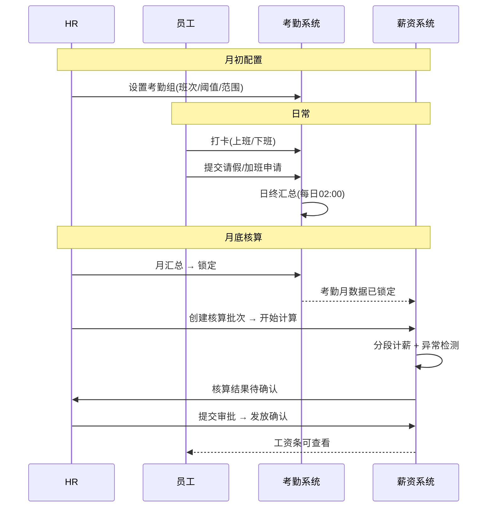
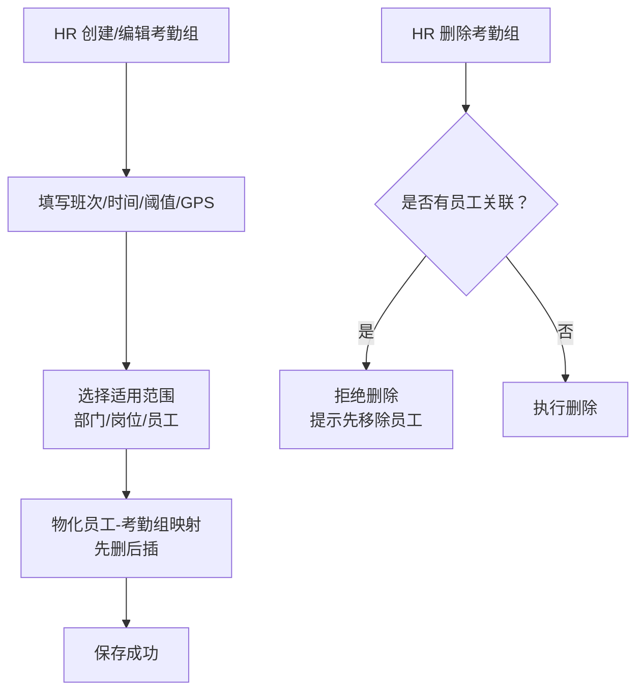
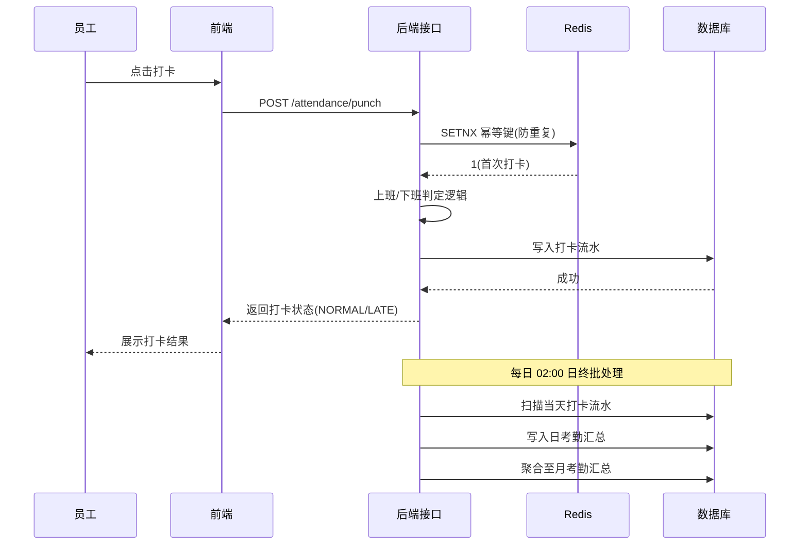
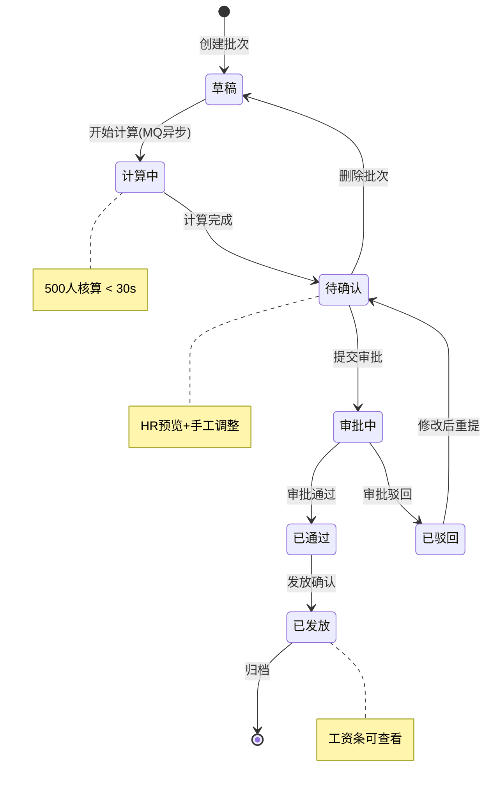

> **文档版本**：v1.0.0  
> **对应模块**：hrms-attendance（考勤请假加班）

---

# 1. 需求背景

公司人力资源管理依赖 Excel 和纸质流程，存在数据分散、算薪效率低、审批不透明等问题。本系统建立统一员工数字化档案，实现入转调离全流程线上化。人员 D 负责考勤打卡、请假加班模块的后端开发。

## 1.1 项目成员

| **成员** | **模块** | **备注（与我（D）的业务相交）** |
| --- | --- | --- |
| 李俊毅 | 权限 + 组织架构 | 所有接口依赖李俊毅 JWT 鉴权；考勤组适用范围需读取李俊毅部门树和岗位数据 |
| 范文路 | 员工档案 + 个人中心 | 打卡/请假/加班需读取范文路员工档案 |
| 郭策 | 入转调离 + 审批中心 | 请假/加班/补卡需调用郭策审批引擎创建实例、轮询状态；离职联动需郭策触发后张浩杰执行考勤移出 |
| 张浩杰 | 考勤请假 | 自研 hrms-attendance（考勤组/打卡/请假/加班/统计），依赖 李俊毅/范文路/郭策提供鉴权、员工、审批能力 |

## 1.2 项目文档

| 文档 | 说明 |
| --- | --- |
| PRD 文档 | 《人资管理系统-PRD.md》v1.0 |
| 前端系分 | 《人员D-考勤请假-前端系分.md》v1.0.0 |
| 后端系分 | 本文档 |
| 总系分（后端） | 《HRMS-Backend-System-Design.md》v1.8.0 |
| 总系分（前端） | 《HRMS-Frontend-System-Design.md》v1.8.3 |
| API 契约 | 《HRMS-API-Contract.md》v1.0.0 |
| 迭代地址 | https://gitee.com/swing-king/hrmini |
| 开发环境地址 | 后端 `http://localhost:8080/api/v1` · 前端 `http://localhost:8000` |
| 测试环境地址 | 待补充 |

## 1.3 后端技术栈

| 类别 | 技术选型 |
| --- | --- |
| 通用框架 | Spring、Spring Boot |
| ORM 框架 | MyBatis |
| 数据库 | MySQL |
| 缓存 | Redis |
| 消息中间件 | RabbitMQ |

---

# 2. 详细设计

## 2.1 后端迭代目标

本次迭代实现考勤管理和请假加班模块的全部后端能力：

**功能模块总览：**

| 模块 | 子模块 | 核心功能 | 涉及表 | 接口数 | 复杂度 |
| --- | --- | --- | --- | --- | --- |
| **考勤** | 考勤组管理 | 考勤组 CRUD、工作日/节假日配置、适用范围物化 | attendance_group / scope / member / workday_config / holiday_calendar | 5 | ⭐⭐ |
| | 打卡管理 | 打卡判定（NORMAL/LATE/等）、Redis 幂等、GPS 校验 | attendance_record | 5 | ⭐⭐⭐ |
| | 补卡管理 | 补卡申请、配额校验（≤2次/月）、审批联动 | attendance_supplement | 2 | ⭐⭐ |
| | 月考勤汇总 | 日终 Job 聚合、月锁定/解锁 | attendance_daily_summary / monthly_summary / month_lock | 2 | ⭐⭐⭐ |
| | 考勤统计 | 个人 8 项指标、部门 3 项率 | （查询聚合） | 2 | ⭐⭐ |
| **请假** | 假期余额 | 年假/调休余额查询、年假刷新 Job、调休过期 Job | leave_balance | 1 | ⭐⭐ |
| | 请假申请 | CRUD、calc-days 天数计算、审批链流转 | leave_application | 4 | ⭐⭐⭐ |
| **加班** | 加班管理 | CRUD、倍率计算（1.5/2.0/3.0）、审批二审 | overtime_application / overtime_ledger | 2 | ⭐⭐ |
| **门户** | 代理接口 | `/profile/*` 8 条 SELF 范围代理 | — | 8 | ⭐ |
| **公共** | 定时任务 | 3 个 Job（日终/调休/年假） | — | — | ⭐⭐ |

**外部依赖：**

| 依赖 | 具体能力 | 使用场景 |
| --- | --- | --- |
|李俊毅（权限+组织） | JWT 鉴权（所有接口 Bearer Token）、部门树（`/departments/tree`）、岗位数据 | 考勤组选择适用范围时读取部门/岗位列表；接口鉴权拦截 |
|范文路（员工档案） | 员工基本信息（姓名/工号/部门/岗位）、在职状态（`employment_status`） | 打卡记录回显、请假选择员工 |
|郭策（审批引擎） | 创建审批实例（请假/加班/补卡）、轮询审批状态、审批完成事件通知（MQ）、离职生效事件触发 | 请假/加班提交后创建审批流；补卡审批通过后重写记录；离职联动执行考勤移出 |
| RabbitMQ | `hrms.approval.*` — 审批事件通知 | 请假/加班/补卡审批完成后异步通知状态变更 |

---

## 2.2 业务流程图汇总

### 2.2.1 核心业务全链路

```
考勤组配置 → 打卡/补卡 → 日汇总(02:00) → 月汇总(锁定) → 月度算薪 → 工资条
                     ↕                        ↕
              请假/加班审批通过          异常检测(核算时)
             影响日汇总状态              黄牌/红牌标记
```



### 2.2.2 考勤组管理

```
HR 创建考勤组(班次/时间/阈值/GPS)
  → 选择适用人员范围(部门/岗位/员工)
  → 物化员工-考勤组映射 attendance_group_member
  → 保存成功

HR 修改考勤组 → 重新物化映射
HR 删除考勤组 → 校验无关联员工 → 删除
```



### 2.2.3 打卡管理

```
员工端打卡：
  → 写入打卡流水 → 返回打卡状态(正常/迟到/早退/旷工半天)

日终批处理(凌晨 2 点)：
  扫描当日打卡流水 → 判定缺上班卡/缺下班卡/全天旷工
  → 写入日考勤汇总
```



### 2.2.4 核算批次状态机

```
草稿 → [开始计算] → 计算中(异步 MQ) → 待确认
  → [预览调整][提交审批] → 审批中 → [审批通过] → 已通过
  → [发放确认] → 已发放
  任一节点可驳回 → 已驳回 → [修改后重提] → 待确认
```



---

## 2.3 迭代具体描述

### 2.3.1 考勤组管理

#### API 设计

| 接口名称 | 请求方式 | 接口路径 | 请求参数（示例） | 响应结果（示例） | 备注 |
| --- | --- | --- | --- | --- | --- |
| 创建考勤组 | POST | /api/v1/attendance/groups | `{ "name": "标准工时", "shiftType": "fixed", "onDuty": "09:00", "offDuty": "18:00" }` | `{ "id": 1 }` | 需鉴权，HR_STAFF |
| 查询考勤组列表 | GET | /api/v1/attendance/groups | `?page=1&size=20` | `{ "total": 10, "list": [...] }` | 分页 |
| 查询考勤组详情 | GET | /api/v1/attendance/groups/{id} | 路径参数 id | `{ "id": 1, "name": "...", ... }` | |
| 更新考勤组 | PUT | /api/v1/attendance/groups/{id} | `{ "name": "新名称" }` | `{ "success": true }` | |
| 删除考勤组 | DELETE | /api/v1/attendance/groups/{id} | 路径参数 id | `{ "success": true }` | 有关联员工则拒绝 |

##### 请求参数说明（创建/更新）

| 参数名 | 位置 | 类型 | 必填 | 说明 | 校验规则 |
| --- | --- | --- | --- | --- | --- |
| name | body | string | Y | 考勤组名称 | 2-20 字符 |
| shiftType | body | string | Y | FIXED/FLEXIBLE/SCHEDULE | 枚举 |
| onDuty | body | string | Y | 上班时间 | HH:mm 格式 |
| offDuty | body | string | Y | 下班时间 | HH:mm 格式 |
| restStart | body | string | N | 午休开始 | HH:mm，默认 12:00 |
| restEnd | body | string | N | 午休结束 | HH:mm，默认 13:00 |
| lateThreshold | body | int | N | 迟到阈值(min) | 默认 15 |
| earlyLeaveThreshold | body | int | N | 早退阈值(min) | 默认 15 |
| applicableScope | body | object | Y | 适用范围 | `{ departmentIds[], positionIds[], employeeIds[] }` |
| ipWhitelist | body | array | N | IP 白名单 | |
| gpsRange | body | object | N | GPS 范围 | `{ lat, lng, radiusM }` |

#### 数据库设计

表名规则：无前缀（总系分约定），以下仅列核心字段。

##### 表结构：attendance_group

| 字段名 | 类型 | 长度 | 主键 | 必填 | 默认值 | 说明 |
| --- | --- | --- | --- | --- | --- | --- |
| id | bigint | | Y | Y | AUTO_INCREMENT | 主键 ID |
| name | varchar | 64 | N | Y | | 考勤组名称 |
| shift_type | varchar | 16 | N | Y | | FIXED/FLEXIBLE/SCHEDULE |
| work_start_time | time | | N | Y | | 上班时间 |
| work_end_time | time | | N | Y | | 下班时间 |
| late_threshold_minutes | int | | N | Y | 15 | 迟到阈值 |
| early_leave_threshold_minutes | int | | N | Y | 15 | 早退阈值 |
| deleted | tinyint | 1 | N | Y | 0 | 逻辑删除 |
| created_at | datetime | | N | N | CURRENT_TIMESTAMP | 创建时间 |
| updated_at | datetime | | N | N | CURRENT_TIMESTAMP ON UPDATE | 更新时间 |

索引设计：

| 索引名 | 字段 | 类型 |
| --- | --- | --- |
| (无额外索引，主键即可) | | |

##### 表结构：attendance_group_scope

| 字段名 | 类型 | 长度 | 主键 | 必填 | 说明 |
| --- | --- | --- | --- | --- | --- |
| id | bigint | | Y | Y | 主键 |
| group_id | bigint | | N | Y | 考勤组 ID |
| scope_type | varchar | 16 | N | Y | DEPARTMENT/POSITION/EMPLOYEE |
| scope_id | bigint | | N | Y | 对应 ID |

索引：`idx_group(group_id)`、`idx_scope(scope_type, scope_id)`

##### 表结构：attendance_group_member

| 字段名 | 类型 | 主键 | 必填 | 说明 |
| --- | --- | --- | --- | --- |
| group_id | bigint | N | Y | 考勤组 ID |
| employee_id | bigint | Y | Y | 员工 ID（PK）|

##### 表结构：att_workday_config

| 字段名 | 类型 | 说明 |
| --- | --- | --- |
| day_of_week | tinyint | 1=周一..7=周日（UK）|
| is_workday | tinyint | 默认 1 |

##### 表结构：holiday_calendar

| 字段名 | 类型 | 说明 |
| --- | --- | --- |
| holiday_date | date | 日期（UK）|
| name | varchar(64) | 节假日名称 |

#### 业务逻辑说明

##### 核心逻辑流程

```
1. 创建/更新考勤组后 → 解析 applicableScope（部门/岗位/员工）
2. 调用范文路接口获取范围内员工列表
3. 全量覆盖写入 attendance_group_member（先删后插）
4. 删除考勤组时校验 attendance_group_member 无关联数据
```

##### 关键业务规则

| 规则 | 说明 |
| --- | --- |
| 员工只能属于一个考勤组 | attendance_group_member 以 employee_id 为主键 |
| 适用范围变更需重新物化 | 先删后插，保证数据一致 |
| 删除考勤组需无关联员工 | 有员工关联时返回 40001 |

##### 异常处理

| 异常场景 | 错误码 | 说明 |
| --- | --- | --- |
| 删除考勤组时仍有员工关联 | 40001 | 请先移除关联员工 |
| 考勤组名称重复 | 40001 | 唯一约束冲突 |

#### 补充 API：工作日与节假日配置

| 接口名称 | 请求方式 | 接口路径 | 请求参数（示例） | 响应结果（示例） | 备注 |
| --- | --- | --- | --- | --- | --- |
| 查询工作日配置 | GET | /api/v1/attendance/workdays | | `{ "code": 0, "data": [{ "dayOfWeek": 1, "isWorkday": true }, { "dayOfWeek": 6, "isWorkday": false }] }` | 返回 7 行 |
| 更新工作日配置 | PUT | /api/v1/attendance/workdays | `[{ "dayOfWeek": 1, "isWorkday": true }]` | `{ "code": 0, "message": "success" }` | 全量覆盖 |
| 节假日列表 | GET | /api/v1/attendance/holidays | `?page=1&size=20` | `{ "code": 0, "data": { "list": [{ "id": 1, "holidayDate": "2026-10-01", "name": "国庆节" }], "total": 10 } }` | 分页 |
| 新增节假日 | POST | /api/v1/attendance/holidays | `{ "holidayDate": "2026-10-01", "name": "国庆节" }` | `{ "code": 0, "data": { "id": 1 } }` | |
| 更新节假日 | PUT | /api/v1/attendance/holidays/{id} | `{ "holidayDate": "2026-10-01", "name": "国庆节" }` | `{ "code": 0, "message": "success" }` | |
| 删除节假日 | DELETE | /api/v1/attendance/holidays/{id} | | `{ "code": 0, "message": "success" }` | |

---

### 2.3.2 打卡管理

#### API 设计

| 接口名称 | 请求方式 | 接口路径 | 请求参数（示例） | 响应结果（示例） | 备注 |
| --- | --- | --- | --- | --- | --- |
| 打卡 | POST | /api/v1/attendance/punch | `{ "type": "in", "punchTime": "2026-07-13T09:00:00" }` | `{ "code": 0, "data": { "punchStatus": "NORMAL" } }` | Redis 幂等 |
| 今日打卡状态 | GET | /api/v1/attendance/punch/today | | `{ "code": 0, "data": { "clockedCount": 45, "totalCount": 50, "lateCount": 3, "earlyLeaveCount": 1, "absentCount": 1 } }` | |
| 打卡记录 | GET | /api/v1/attendance/punch/records | `?page=1&size=20&keyword=&dateFrom=&dateTo=` | `{ "code": 0, "data": { "list": [{ "employeeId": 1, "employeeName": "张三", "departmentName": "技术部", "punchDate": "2026-07-13", "clockInTime": "09:00", "clockInStatus": "NORMAL", "clockOutTime": "18:05", "clockOutStatus": "NORMAL", "source": "WEB", "clientIp": "192.168.1.1", "gpsJson": null }], "total": 100, "page": 1, "pageSize": 20 } }` | 分页 |
| 补卡申请 | POST | /api/v1/attendance/punch-fix | `{ "punchDate": "2026-07-13", "type": "in", "punchTime": "09:00", "reason": "忘记打卡" }` | `{ "code": 0, "data": { "id": 1, "status": "PENDING" } }` | ≤2次/月 |
| 补卡剩余次数 | GET | /api/v1/attendance/punch-fix/quota | | `{ "code": 0, "data": { "totalQuota": 2, "usedQuota": 1, "remainingQuota": 1 } }` | |
| 考勤日历（门户） | GET | /api/v1/profile/attendance/calendar | `?period=2026-07` | `{ "code": 0, "data": { "year": 2026, "month": 7, "days": [{ "date": "2026-07-13", "dayStatus": "NORMAL", "clockInTime": "09:00", "clockOutTime": "18:00" }] } }` | SELF 范围，仅本人 |

##### 请求参数说明（打卡）

| 参数名 | 位置 | 类型 | 必填 | 说明 | 校验规则 |
| --- | --- | --- | --- | --- | --- |
| type | body | string | Y | in/out | 枚举 |
| punchTime | body | datetime | N | 打卡时间 | 默认当前时间 |
| latitude | body | number | N | GPS 纬度 | |
| longitude | body | number | N | GPS 经度 | |

##### 请求参数说明（补卡）

| 参数名 | 位置 | 类型 | 必填 | 校验规则 |
| --- | --- | --- | --- | --- |
| punchDate | body | date | Y | 当月及前月 |
| type | body | string | Y | in/out |
| punchTime | body | datetime | Y | |
| reason | body | string | Y | ≤256 字符 |

#### 数据库设计

##### 表结构：attendance_record

| 字段名 | 类型 | 长度 | 主键 | 必填 | 说明 |
| --- | --- | --- | --- | --- | --- |
| id | bigint | | Y | Y | 主键 |
| employee_id | bigint | | N | Y | |
| punch_date | date | | N | Y | 考勤日 |
| punch_time | datetime | | N | Y | 打卡时间 |
| punch_type | varchar | 8 | N | Y | IN/OUT |
| punch_status | varchar | 16 | N | Y | NORMAL/LATE/EARLY_LEAVE/ABSENT_HALF |
| source | varchar | 16 | N | Y | WEB/APP/MAKEUP |
| client_ip | varchar | 45 | N | N | |
| gps_json | json | | N | N | |

索引：`idx_emp_date(employee_id, punch_date)`、`idx_emp_time(employee_id, punch_time)`

##### 表结构：attendance_daily_summary

| 字段名 | 类型 | 主键 | 必填 | 说明 |
| --- | --- | --- | --- | --- |
| id | bigint | Y | Y | 主键 |
| employee_id | bigint | N | Y | |
| summary_date | date | N | Y | |
| day_status | varchar(16) | N | Y | NORMAL/LATE/EARLY_LEAVE/ABSENT_HALF/ABSENT/MISSING_IN/MISSING_OUT/LEAVE |
| clock_in_time | datetime | N | N | |
| clock_out_time | datetime | N | N | |
| leave_days | decimal(3,1) | N | Y | 0 |
| overtime_hours | decimal(5,2) | N | Y | 0 |

唯一索引：`uk_emp_date(employee_id, summary_date)`
索引：`idx_date_status(summary_date, day_status)`

##### 表结构：attendance_supplement

| 字段名 | 类型 | 说明 |
| --- | --- | --- |
| id | bigint | 主键 |
| employee_id | bigint | |
| makeup_date | date | 补卡日期 |
| punch_type | varchar(8) | IN/OUT |
| makeup_time | datetime | 补卡时间 |
| reason | varchar(256) | |
| status | varchar(16) | PENDING/APPROVED/REJECTED |
| instance_id | bigint | 审批实例 ID |

#### 业务逻辑说明

##### 核心逻辑流程

```
打卡判定（上班）：
  punchTime ≤ onDuty           → NORMAL
  onDuty < punchTime ≤ onDuty+lateThreshold → LATE
  punchTime > onDuty+lateThreshold → ABSENT_HALF

打卡判定（下班）：
  punchTime ≥ offDuty           → NORMAL
  offDuty-earlyLeaveThreshold ≤ punchTime < offDuty → EARLY_LEAVE
  punchTime < offDuty-earlyLeaveThreshold → ABSENT_HALF

日终判定（02:00 Job）：
  有上班卡+有下班卡 → 保持已有状态
  无上班卡+有下班卡 → MISSING_IN
  有上班卡+无下班卡 → MISSING_OUT
  无记录+工作日     → ABSENT
  无记录+节假日     → 不生成记录
```

##### 关键业务规则

| 规则 | 说明 |
| --- | --- |
| 打卡幂等 | Redis key `hrms:punch:{empId}:{date}:{type}` SETNX，单次有效 |
| GPS 校验 | 配置了 gps_range 的考勤组，打卡时校验距离 |
| 补卡配额 | 每月≤2次，Redis `supplement:{empId}:{ym}` 计数 |
| 月锁定 | 月锁定后补卡返回 422:40001 |

##### 异常处理

| 异常场景 | 错误码 | 说明 |
| --- | --- | --- |
| 重复打卡 | 400 | 您已打卡，请勿重复操作 |
| GPS 越界 | 40004 | 不在打卡有效范围 |
| 补卡超限 | 40002 | 每月最多补卡 2 次 |
| 月锁定后补卡 | 40001 | 考勤月已锁定，请联系 HR 解锁 |

#### 缓存策略

| 缓存对象 | Key 格式 | 过期时间 | 说明 |
| --- | --- | --- | --- |
| 打卡幂等 | `hrms:punch:{empId}:{date}:{type}` | 当天 | SETNX 防重 |
| 补卡次数 | `supplement:{empId}:{ym}` | 当月 | 原子计数 |

##### 高并发处理

| 场景 | 策略 | 说明 |
| --- | --- | --- |
| 上下班高峰期打卡（500 人同时 IN） | 打卡请求同步写入 Redis（SETNX 幂等），异步落库至 DB | 避免 DB 瞬间写入压力，日终 Job 保证最终一致性 |
| 日终汇总 | `AttendanceSummaryJob（02:00）` 批处理聚合 daily → monthly | 错峰执行，不与打卡实时写入争抢 DB 资源 |

---

### 2.3.3 请假管理

#### API 设计

| 接口名称 | 请求方式 | 接口路径 | 请求参数（示例） | 响应结果（示例） | 备注 |
| --- | --- | --- | --- | --- | --- |
| 假期余额 | GET | /api/v1/leaves/balances | `?employeeId=1` | `{ "code": 0, "data": [{ "leaveType": "annual", "balance": 5.0 }, { "leaveType": "compensatory", "balance": 8.0 }] }` | 年假+调休 |
| 请假申请列表 | GET | /api/v1/leaves/applications | `?page=1&leaveType=annual&status=approved` | `{ "code": 0, "data": { "list": [{ "id": 1, "employeeName": "张三", "leaveType": "annual", "startTime": "2026-07-14T09:00", "endTime": "2026-07-16T18:00", "leaveDays": 3, "reason": "年假", "status": "APPROVED" }], "total": 10, "page": 1, "pageSize": 20 } }` | |
| 提交请假 | POST | /api/v1/leaves/applications | `{ "leaveType": "annual", "startTime": "...", "endTime": "...", "days": 3, "reason": "..." }` | `{ "code": 0, "data": { "id": 1, "status": "PENDING" } }` | 触发审批 |
| 预览天数 | GET | /api/v1/leaves/calc-days | `?startTime=&endTime=` | `{ "code": 0, "data": { "days": 3.0 } }` | 排除周末/节假日 |
| 撤销请假（管理端） | PUT | /api/v1/leaves/applications/{id}/cancel | | `{ "code": 0, "data": { "status": "CANCELLED" } }` | 仅 PENDING 可撤销 |

##### 请求参数说明（提交请假）

| 参数名 | 位置 | 类型 | 必填 | 说明 |
| --- | --- | --- | --- | --- |
| leaveType | body | string | Y | ANNUAL/SICK/PERSONAL/MARRIAGE/MATERNITY/BEREAVEMENT/COMP_OFF |
| startTime | body | datetime | Y | 含上午/下午 |
| endTime | body | datetime | Y | 含上午/下午 |
| days | body | decimal(4,1) | Y | 支持 0.5 |
| reason | body | string | Y | ≤512 |
| handoverEmployeeId | body | long | N | 交接人 |
| attachment | body | string | N | 附件 URL（病/婚/产必填）|

#### 数据库设计

##### 表结构：leave_balance

| 字段名 | 类型 | 说明 |
| --- | --- | --- |
| id | bigint | 主键 |
| employee_id | bigint | |
| leave_type | varchar(16) | ANNUAL/COMP_OFF |
| balance | decimal(6,1) | 余额 |
| year | int | 年假年度 |
| expire_date | date | 调休过期日 |

唯一索引：`uk_emp_type_year(employee_id, leave_type, year)`

##### 表结构：leave_application

| 字段名 | 类型 | 说明 |
| --- | --- | --- |
| id | bigint | 主键 |
| employee_id | bigint | |
| leave_type | varchar(16) | |
| start_time | datetime | |
| end_time | datetime | |
| leave_days | decimal(4,1) | 支持 0.5 |
| reason | varchar(512) | |
| handover_employee_id | bigint | |
| attachment_url | varchar(512) | |
| status | varchar(16) | PENDING/APPROVED/REJECTED/CANCELLED |
| instance_id | bigint | 审批实例 ID |

索引：`idx_emp_status(employee_id, status)`、`idx_date_range(start_time, end_time)`

#### 业务逻辑说明

##### 关键业务规则

| 规则 | 说明 |
| --- | --- |
| 年假计算 | `<1年=0`，`1~10年=5`，`10~20年=10`，`≥20年=15`，首年按比例折算 |
| 年假刷新 | LeaveBalanceRefreshJob 每年 1 月 1 日 01:00 执行 |
| 调休 | 1:1 转换，当月及次月有效，过期清零 |
| 余额扣减 | 提交请假时预扣，审批驳回后恢复，撤销后恢复 |
| 天数计算 | calc-days 排除周末和法定节假日 |

##### 异常处理

| 异常场景 | 错误码 |
| --- | --- |
| 请假余额不足 | 40003 |
| 病假>1天未上传附件 | 前端校验 |

#### 外部依赖

| 依赖服务 | 接口 | 说明 |
| --- | --- | --- |
|郭策审批引擎 | 创建审批实例 | 请假提交后触发审批流转 |

---

### 2.3.4 加班管理

#### API 设计

| 接口名称 | 请求方式 | 接口路径 | 响应结果（示例） | 备注 |
| --- | --- | --- | --- | --- |
| 加班列表 | GET | /api/v1/overtime/applications | `{ "code": 0, "data": { "list": [{ "id": 1, "employeeName": "张三", "overtimeDate": "2026-07-13", "hours": 3.0, "status": "PENDING" }], "total": 5 } }` | 分页 |
| 提交加班 | POST | /api/v1/overtime/applications | `{ "code": 0, "data": { "id": 1, "status": "PENDING" } }` | 触发审批 |

##### 请求参数说明（提交加班）

| 参数名 | 位置 | 类型 | 必填 | 说明 | 校验规则 |
| --- | --- | --- | --- | --- | --- |
| overtimeDate | body | date | Y | 加班日期 | 不能是未来日期 |
| startTime | body | time | Y | 开始时间 | HH:mm 格式 |
| endTime | body | time | Y | 结束时间 | HH:mm 格式，须晚于 startTime |
| reason | body | string | Y | 加班原因 | ≤256 字符 |

#### 数据库设计

##### 表结构：overtime_application

| 字段名 | 类型 | 说明 |
| --- | --- | --- |
| id | bigint | 主键 |
| employee_id | bigint | |
| overtime_date | date | |
| hours | decimal(5,2) | |
| status | varchar(16) | PENDING/APPROVED |
| comp_off_hours | decimal(5,2) | 折算调休小时 |

索引：`idx_emp_date(employee_id, overtime_date)`

##### 表结构：overtime_ledger

| 字段名 | 类型 | 说明 |
| --- | --- | --- |
| id | bigint | 主键 |
| employee_id | bigint | |
| application_id | bigint | |
| period | char(7) | 归属账期 |
| total_hours | decimal(5,2) | 审批总时长 |
| rate_type | tinyint | 15=1.5倍/20=2.0倍/30=3.0倍 |
| ledger_date | date | 加班日期 |

索引：`idx_emp_period(employee_id, period)`

#### 业务逻辑说明

| 加班日期 | 倍率 |
| --- | --- |
| 工作日 | 1.5 |
| 休息日 | 2.0 |
| 法定节假日 | 3.0 |

加班≥4 小时触发 HR 二审。

---

### 2.3.5 月考勤汇总与统计

#### API 设计

| 接口名称 | 请求方式 | 接口路径 | 响应结果（示例） | 备注 |
| --- | --- | --- | --- | --- |
| 月汇总查看/锁定 | GET/PUT | /api/v1/attendance/monthly-summary | `{ "code": 0, "data": { "list": [{ "employeeId": 1, "employeeName": "张三", "period": "2026-07", "shouldAttendDays": 23, "actualAttendDays": 21.5, "lateCount": 1, "earlyLeaveCount": 0, "absentDays": 0, "leaveDays": 1.5, "overtimeHours": 3.0 }], "total": 50, "locked": false } }` | `?period=&departmentId=&page=&pageSize=` |
| 个人统计 | GET | /api/v1/attendance/statistics/personal | `{ "code": 0, "data": { "employeeId": 1, "period": "2026-07", "shouldAttendDays": 23, "actualAttendDays": 21.5, "lateCount": 1, "earlyLeaveCount": 0, "absentDays": 0, "leaveDays": 1.5, "overtimeHours": 3.0, "annualBalance": 5.0 } }` | `?employeeId=&period=` |
| 部门统计 | GET | /api/v1/attendance/statistics/department | `{ "code": 0, "data": { "departmentId": 1, "period": "2026-07", "attendanceRate": 0.95, "lateRate": 0.02, "leaveRate": 0.03 } }` | `?departmentId=&period=` |

##### 请求参数说明

| 接口 | 参数名 | 位置 | 类型 | 必填 | 说明 |
| --- | --- | --- | --- | --- | --- |
| 月汇总 | period | query | string | Y | 账期，格式 YYYY-MM |
| 月汇总 | departmentId | query | long | N | 部门筛选 |
| 月汇总 | locked | body(PUT) | boolean | N | 锁定/解锁 |
| 个人统计 | employeeId | query | long | Y | 员工 ID |
| 个人统计 | period | query | string | Y | 账期 |
| 部门统计 | departmentId | query | long | Y | 部门 ID |
| 部门统计 | period | query | string | Y | 账期 |
| 部门统计 | departmentId | query | long | Y | 部门 ID |
| 部门统计 | period | query | string | Y | 账期 |

#### 数据库设计

##### 表结构：attendance_monthly_summary

| 字段名 | 类型 | 说明 |
| --- | --- | --- |
| id | bigint | 主键 |
| employee_id | bigint | |
| period | char(7) | 2026-07 |
| should_attend_days | int | 应出勤 |
| actual_attend_days | decimal(5,1) | 实际出勤 |
| late_count | int | 迟到次数 |
| early_leave_count | int | 早退次数 |
| absent_days | decimal(5,1) | 旷工天数 |
| leave_days | decimal(5,1) | 请假天数 |
| overtime_hours | decimal(6,2) | 加班时长 |
| annual_balance | decimal(5,1) | 年假余额 |
| detail_json | json | 明细快照 |

唯一索引：`uk_emp_period(employee_id, period)`

#### 定时任务

| 任务名称 | 调度表达式 | 执行逻辑 |
| --- | --- | --- |
| AttendanceSummaryJob | 0 0 2 * * ?（每日 02:00） | 将当天 daily_summary 聚合进 monthly_summary |

---

### 2.3.6 门户代理接口（/profile/*）

> 所有 `/profile/*` 接口均走 `@DataScope(SELF)`，仅限本人数据，统一代理对应管理端接口。

| 接口名称 | 请求方式 | 接口路径 | 响应结果（示例） | 对应管理端路径 | 备注 |
| --- | --- | --- | --- | --- | --- |
| 员工打卡 | POST | /api/v1/profile/attendance/punch | `{ "code": 0, "data": { "punchStatus": "NORMAL" } }` | `POST /attendance/punch` | 代理打卡 |
| 员工补卡 | POST | /api/v1/profile/attendance/punch-fix | `{ "code": 0, "data": { "id": 1, "status": "PENDING" } }` | `POST /attendance/punch-fix` | 代理补卡 |
| 考勤日历 | GET | /api/v1/profile/attendance/calendar | `{ "code": 0, "data": { "year": 2026, "month": 7, "days": [{ "date": "2026-07-13", "dayStatus": "NORMAL" }] } }` | — | 仅本人日历 |
| 请假列表 | GET | /api/v1/profile/leave/applications | 同 `GET /leaves/applications`（SELF 范围） | `GET /leaves/applications` | 仅本人 |
| 提交请假 | POST | /api/v1/profile/leave/applications | `{ "code": 0, "data": { "id": 1, "status": "PENDING" } }` | `POST /leaves/applications` | 仅本人 |
| 撤销请假 | PUT | /api/v1/profile/leave/applications/{id}/cancel | `{ "code": 0, "data": { "status": "CANCELLED" } }` | `PUT /leaves/applications/{id}/cancel` | 仅本人 |
| 加班列表 | GET | /api/v1/profile/overtime/applications | 同 `GET /overtime/applications`（SELF 范围） | `GET /overtime/applications` | 仅本人 |
| 提交加班 | POST | /api/v1/profile/overtime/applications | `{ "code": 0, "data": { "id": 1, "status": "PENDING" } }` | `POST /overtime/applications` | 仅本人 |

---

### 2.3.7 定时任务汇总

| 任务名称 | 调度表达式 | 执行逻辑 | 补偿机制 |
| --- | --- | --- | --- |
| AttendanceSummaryJob | 0 0 2 * * ?（每日 02:00） | 日汇总→月汇总聚合 | 手动触发重跑 |
| CompensatoryLeaveExpireJob | 0 0 2 1 * ?（每月 1 日） | 调休过期清零 | 手动触发 |
| LeaveBalanceRefreshJob | 0 0 1 1 1 ?（1 月 1 日） | 年假按工龄重算 | 手动触发 |

---

## 2.4 菜单与权限变动

### 2.4.1 接口权限

| 接口 | 权限角色 | 备注 |
| --- | --- | --- |
| `/attendance/groups/*` | HR_STAFF | 考勤组管理 |
| `/attendance/punch` | 所有在职员工 | 打卡 |
| `/attendance/punch-fix` | EMPLOYEE | 补卡 |
| `/attendance/monthly-summary` | HR_STAFF | 月汇总 |
| `/attendance/statistics/*` | HR_STAFF, DEPT_MANAGER | 统计 |
| `/leaves/*` | HR_STAFF, EMPLOYEE | 请假 |
| `/overtime/*` | HR_STAFF, EMPLOYEE | 加班 |

---

## 2.5 模块划分与工作量评估

| 模块 | 子模块 | 细节（备注） | 开发 | 联调 | 自测 | 前端 | 后端 |
| --- | --- | --- | --- | --- | --- | --- | --- |
| 考勤 | 考勤组管理 | CRUD + 工作日 + 节假日 + 范围物化 | 1.5 | 0.5 | 0.5 | D | D |
| 考勤 | 打卡管理 | 打卡判定 + Redis 幂等 + GPS 校验 | 1.5 | 0.5 | 0.5 | D | D |
| 考勤 | 补卡管理 | 补卡申请 + 配额校验 + 审批联动 | 1 | 0.5 | 0.5 | D | D |
| 考勤 | 月汇总/统计 | 汇总聚合 + Job + 统计查询 | 1.5 | 0.5 | 0.5 | D | D |
| 请假 | 请假管理 | CRUD + 级别批量导入/扣减 + 审批联动 | 1.5 | 1 | 0.5 | D | D |
| 加班 | 加班管理 | CRUD + 倍率计算 + 审批联动 | 1 | 0.5 | 0.5 | D | D |
| 公共 | 门户代理 | `/profile/*` 8 条代理接口 | 1 | 0.5 | 0.5 | D | D |
| 公共 | 定时任务 | 3 个 Job（日终/调休/年假） | 1 | 0 | 0.5 | - | D |
| **合计** | | | **10** | **4** | **4** | | |

> 注：联调时间含前后端联调以及跨服务（郭策审批）联调。

---

# 3. 日志 & 监控 & 告警

## 3.1 日志规范

| 日志类型 | 日志内容 | 日志级别 |
| --- | --- | --- |
| 接口入参出参 | 请求参数、响应结果 | INFO（可开关） |
| 业务操作记录 | 打卡/请假等操作 | INFO |
| 核心链路追踪 | traceId、关键节点耗时 | INFO |
| 异常日志 | 异常堆栈、上下文参数 | ERROR |
| SQL 慢查询 | 超过 500ms 的 SQL | WARN |

## 3.2 监控指标

| 指标名称 | 指标类型 | 阈值 | 告警级别 |
| --- | --- | --- | --- |
| 打卡 QPS | 计数 | >200/s 告警 | P2 |
| 打卡响应时间 TP99 | 延迟 | >300ms 告警 | P2 |
| 打卡接口错误率 | 比率 | >1% 告警 | P1 |
| 日终 Job 执行 | 状态 | 超时未完成告警 | P2 |
| MQ 积压 | 堆积数量 | >1000 条告警 | P2 |

## 3.3 业务埋点

| 事件名称 | 触发时机 | 上报字段 |
| --- | --- | --- |
| punch_create | 打卡成功 | employeeId, status(NORMAL/LATE等) |
| punch_fix_submit | 补卡提交 | employeeId, month |
| leave_submit | 请假提交 | employeeId, leaveType, days |

---

# 4. 发布计划

## 4.1 发布顺序

```
1. 数据库变更（14 张 DDL 脚本先行，兼容旧代码）
2. 中间件配置更新（RabbitMQ topic 新建、Redis key 规划）
3. 考勤模块服务发布（attendance → 观察 → 全量）
4. 定时任务上线（观察第一轮执行结果）
```

## 4.2 回滚方案

| 回滚步骤 | 操作 | 影响 |
| --- | --- | --- |
| 1. 服务回滚 | 回退到上一个稳定版本 | 接口中断约 1min |
| 2. 数据库回滚 | 执行回滚 SQL | 需确认无新数据写入 |
| 3. 功能开关 | 关闭考勤/请假开关 | 功能下线 |

## 4.3 发布检查清单

- [ ] 数据库变更脚本已执行并验证（14 张表）
- [ ] 接口自测通过（约 34 条接口 Postman / 单元测试覆盖）
- [ ] 与前端联调完成
- [ ] 与郭策审批联调完成
- [ ] 缓存 key 规划确认（2 个 Redis key）
- [ ] MQ topic 已创建（hrms.approval.*）
- [ ] 日志打印符合规范，无敏感信息
- [ ] 监控大盘已配置
- [ ] 告警规则已配置
- [ ] 代码 CR 完成
- [ ] 回滚方案已评审

---

# 5. 其他

## 5.1 风险评估

| 风险点 | 影响 | 概率 | 应对方案 |
| --- | --- | --- | --- |
|郭策审批接口未定 | 请假/加班/补卡无法联调 | 高 | 先行 Mock，接口确定后替换 |
| 考勤数据与薪资不一致 | 月锁定前算薪不准 | 中 | 锁定机制 + 快照隔离 |
| 打卡 Redis 幂等键丢失 | 重复打卡 | 低 | SETNX + TTL 兜底 |

## 5.2 稳定性保障

- **容量评估**：500 员工规模，打卡峰值 500 QPS
- **兼容性**：API 版本路径 `/api/v1/`，响应字段预留扩展，不兼容变更需升版本号
- **限流方案**：打卡接口接入 Sentinel 限流
- **灰度方案**：先开放一个部门试用考勤打卡

## 5.3 安全相关

- **SQL 注入防护**：MyBatis-Plus 参数占位符
- **越权校验**：`@DataScope(SELF)` 覆盖全部门户接口

## 5.4 变更记录

| 日期 | 版本 | 变更内容 | 变更人 |
| --- | --- | --- | --- |
| 2026-07-13 | v1.0 | 初版（按模板重构） | 张浩杰 |
