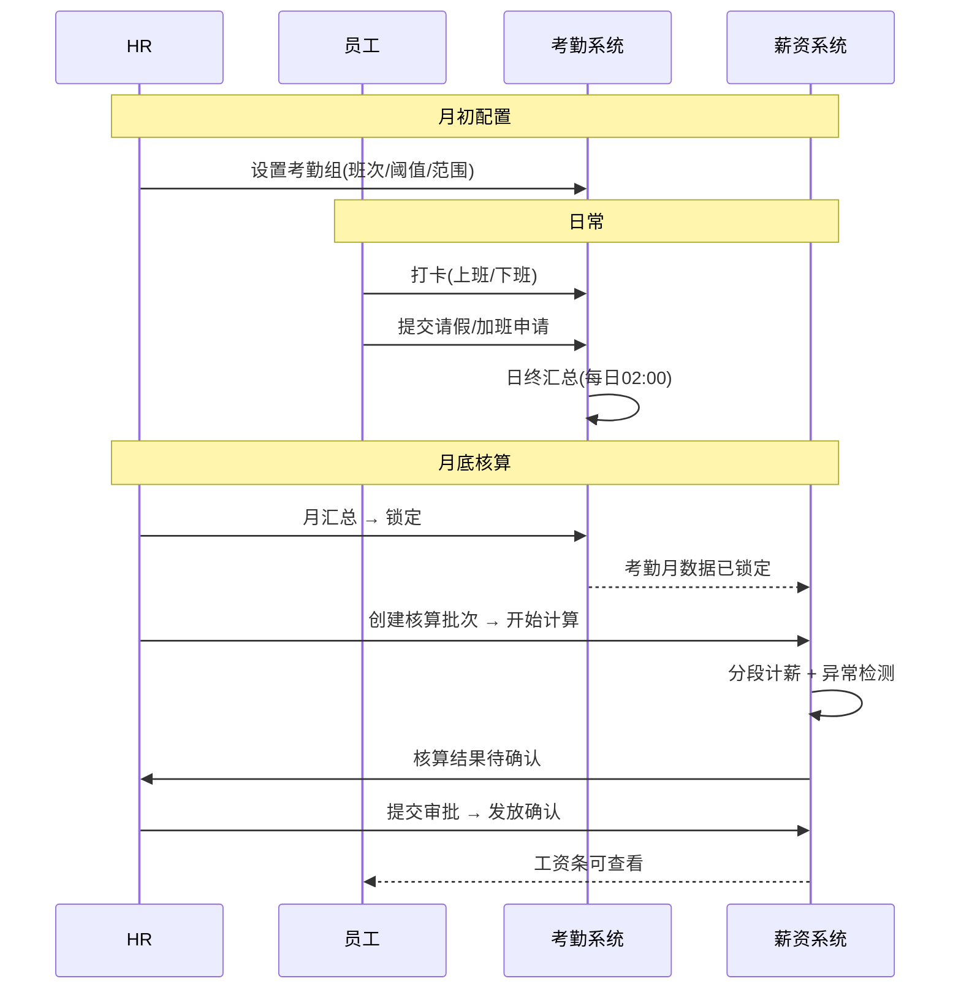
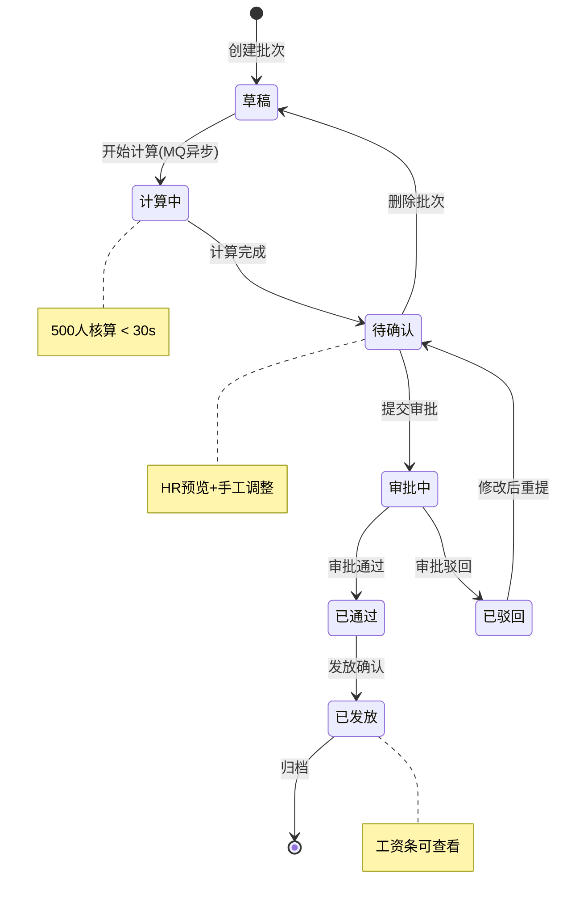

# 人员 D · 后端系统分析文档（薪资模块）

> **文档版本**：v1.0.0  
> **对应模块**：hrms-payroll（薪资核算工资条）

---

# 1. 需求背景

公司人力资源管理依赖 Excel 和纸质流程，存在数据分散、算薪效率低、审批不透明等问题。本系统建立统一员工数字化档案，实现入转调离全流程线上化。人员 D 负责薪资核算、工资条模块的后端开发。

## 1.1 项目成员

| **成员** | **模块** | **备注（与我（D）的业务相交）** |
| --- | --- | --- |
| 李俊毅 | 权限 + 组织架构 | 所有接口依赖李俊毅 JWT 鉴权；薪资账套适用范围需读取李俊毅部门树和岗位数据 |
| 范文路 | 员工档案 + 个人中心 | 算薪依赖范文路`employee_salary_profile` 薪资档案和合同试用比例 |
| 郭策 | 入转调离 + 审批中心 | 核算批次需调用郭策审批引擎创建实例、轮询状态；离职联动需郭策触发后张浩杰执行薪资结算 |
| 张浩杰 | 薪资 | 自研 hrms-payroll（账套/核算/工资条/成本报表），依赖 李俊毅/范文路/郭策提供鉴权、员工、审批能力 |

## 1.2 项目文档

| 文档 | 说明 |
| --- | --- |
| PRD 文档 | 《人资管理系统-PRD.md》v1.0 |
| 前端系分 | 《人员D-薪资-前端系分.md》v1.0.0 |
| 后端系分 | 本文档 |
| 总系分（后端） | 《HRMS-Backend-System-Design.md》v1.8.0 |
| 总系分（前端） | 《HRMS-Frontend-System-Design.md》v1.8.3 |
| API 契约 | 《HRMS-API-Contract.md》v1.0.0 |
| 迭代地址 | https://gitee.com/swing-king/hrmini |
| 开发环境地址 | 后端 `http://localhost:8080/api/v1` · 前端 `http://localhost:8000` |
| 测试环境地址 | 待补充 |

## 1.3 后端技术栈

| 类别 | 技术选型 |
| --- | --- |
| 通用框架 | Spring、Spring Boot |
| ORM 框架 | MyBatis |
| 数据库 | MySQL |
| 缓存 | Redis |
| 消息中间件 | RabbitMQ |

---

# 2. 详细设计

## 2.1 后端迭代目标

本次迭代实现薪资核算模块的全部后端能力：

**功能模块总览：**

| 模块 | 子模块 | 核心功能 | 涉及表 | 接口数 | 复杂度 |
| --- | --- | --- | --- | --- | --- |
| **薪资** | 账套管理 | 账套 CRUD、工资项目配置（SpEL 公式） | payroll_scheme / scheme_item / scheme_scope | 4 | ⭐⭐ |
| | 薪资档案 | 档案查看/编辑、调薪历史 | employee_salary_profile / salary_history | 2 | ⭐ |
| | 核算批次 | 状态机、MQ 异步计算、分段计薪、异常检测 | payroll_batch / payroll_detail / adjustment | 9 | ⭐⭐⭐⭐⭐ |
| | 工资条 | 管理端查看、员工端二次验证、PDF 下载 | pay_tax_ytd_record / payslip_view_log | 5 | ⭐⭐⭐ |
| **门户** | 代理接口 | `/profile/*` 5 条 SELF 范围代理 | — | 5 | ⭐ |
| **公共** | 定时任务 | 1 个 Job（归档） | — | — | ⭐⭐ |

**外部依赖：**

| 依赖 | 具体能力 | 使用场景 |
| --- | --- | --- |
|李俊毅（权限+组织） | JWT 鉴权（所有接口 Bearer Token）、部门树（`/departments/tree`）、岗位数据 | 薪资账套选择适用范围时读取部门/岗位列表；接口鉴权拦截 |
|范文路（员工档案） | 员工基本信息（姓名/工号/部门/岗位）、薪资档案（`employee_salary_profile`）、合同（`employee_contract` 试用比例）、在职状态（`employment_status`）、入职/离职日期（分段计薪边界） | 算薪时批量读取档案+合同 |
|郭策（审批引擎） | 创建审批实例（核算批次）、轮询审批状态、审批完成事件通知（MQ）、离职生效事件触发 | 批次审批通过后流转状态；离职联动执行薪资结算 |
| RabbitMQ | `hrms.payroll.calculate` — 核算分片消息；`hrms.payroll.progress` — 核算进度更新；`hrms.approval.*` — 审批事件通知 | 异步算薪解耦（500 人分片并行），避免 HTTP 阻塞；实时更新核算进度供前端轮询 |

---

## 2.2 业务流程图汇总

### 2.2.1 核心业务全链路

```
考勤组配置 → 打卡/补卡 → 日汇总(02:00) → 月汇总(锁定) → 月度算薪 → 工资条
                     ↕                        ↕
              请假/加班审批通过          异常检测(核算时)
             影响日汇总状态              黄牌/红牌标记
```



### 2.2.2 核算批次状态机

```
草稿 → [开始计算] → 计算中(异步 MQ) → 待确认
  → [预览调整][提交审批] → 审批中 → [审批通过] → 已通过
  → [发放确认] → 已发放
  任一节点可驳回 → 已驳回 → [修改后重提] → 待确认
```



---

## 2.3 迭代具体描述

### 2.3.1 薪资账套管理

#### API 设计

| 接口名称 | 请求方式 | 接口路径 | 响应结果（示例） | 备注 |
| --- | --- | --- | --- | --- |
| 账套列表 | GET | /api/v1/payroll/schemes | `{ "code": 0, "data": { "list": [{ "id": 1, "name": "标准账套", "effectiveDate": "2026-01-01", "status": "ENABLED", "items": [{ "itemCode": "baseSalary", "itemName": "基本工资", "itemType": "fixed" }] }], "total": 5 } }` | |
| 创建账套 | POST | /api/v1/payroll/schemes | `{ "code": 0, "data": { "id": 1 } }` | 含工资项目 |
| 更新账套 | PUT | /api/v1/payroll/schemes/{id} | `{ "code": 0, "message": "success" }` | |
| 删除账套 | DELETE | /api/v1/payroll/schemes/{id} | `{ "code": 0, "message": "success" }` | |

##### 请求参数说明（创建/更新账套）

| 参数名 | 位置 | 类型 | 必填 | 说明 | 校验规则 |
| --- | --- | --- | --- | --- | --- |
| name | body | string | Y | 账套名称 | 2-50 字符 |
| scope | body | object | Y | 适用范围 | `{ departmentIds[], positionIds[], jobLevels[] }` |
| effectiveDate | body | date | Y | 生效日期 | |
| status | body | string | N | ENABLED/DISABLED | 默认 ENABLED |
| items | body | array | Y | 工资项目列表 | 至少 1 项 |
| items[].itemCode | body | string | Y | 项目编码 | 唯一 |
| items[].itemName | body | string | Y | 项目名称 | |
| items[].itemType | body | string | Y | fixed/variable/attendance_deduct/social/fund/tax | 枚举 |
| items[].calcRule | body | string | N | SpEL 公式 | variable 类型时必填 |
| items[].baseField | body | string | N | ssBase/hfBase/performanceBase | social/fund 类型时必填 |
| items[].ratio | body | decimal | N | 社保公积金比例 | social/fund 类型时必填 |
| items[].sortOrder | body | int | N | 排序号 | 默认 0 |

#### 数据库设计

##### 表结构：payroll_scheme

| 字段名 | 类型 | 说明 |
| --- | --- | --- |
| id | bigint | 主键 |
| name | varchar(64) | |
| description | varchar(256) | |
| effective_date | date | |
| status | varchar(16) | ENABLED/DISABLED |
| deleted | tinyint | 逻辑删除 |

##### 表结构：payroll_scheme_item

| 字段名 | 类型 | 说明 |
| --- | --- | --- |
| id | bigint | 主键 |
| template_id | bigint | 账套 ID |
| item_code | varchar(32) | 项目编码 |
| item_name | varchar(64) | 项目名称 |
| item_type | varchar(20) | FIXED/VARIABLE/ATTENDANCE_DEDUCT/SS_DEDUCT/HF_DEDUCT/TAX |
| calc_rule | varchar(512) | SpEL 公式 |
| base_field | varchar(32) | 基数字段 |
| ratio | decimal(8,4) | 比例 |

##### 表结构：payroll_scheme_scope

| 字段名 | 类型 | 说明 |
| --- | --- | --- |
| id | bigint | 主键 |
| template_id | bigint | |
| scope_type | varchar(16) | DEPARTMENT/POSITION/JOB_LEVEL |
| scope_id | varchar(32) | |

---

### 2.3.2 薪资档案

#### API 设计

| 接口名称 | 请求方式 | 接口路径 | 响应结果（示例） | 备注 |
| --- | --- | --- | --- | --- |
| 查看薪资档案 | GET | /api/v1/employees/{id}/salary | `{ "code": 0, "data": { "employeeId": 1, "schemeId": 1, "baseSalary": 10000.00, "ssBase": 10000.00, "hfBase": 10000.00, "performanceBase": 5000.00, "probationRatio": 1.0000 } }` | |
| 编辑薪资档案 | PUT | /api/v1/employees/{id}/salary | `{ "code": 0, "message": "success" }` | |

##### 请求参数说明（编辑薪资档案）

| 参数名 | 位置 | 类型 | 必填 | 说明 | 校验规则 |
| --- | --- | --- | --- | --- | --- |
| schemeId | body | long | Y | 适用账套 ID | |
| baseSalary | body | decimal(12,2) | Y | 基本工资 | ≥ 0 |
| allowanceBaseJson | body | json | N | 各项津贴基数 | |
| ssBase | body | decimal(12,2) | Y | 社保基数 | ≥ 当地最低标准 |
| hfBase | body | decimal(12,2) | Y | 公积金基数 | ≥ 当地最低标准 |
| performanceBase | body | decimal(12,2) | N | 绩效基数 | |
| probationRatio | body | decimal(5,4) | N | 试用期比例 | 0.80~1.00，默认 1.0000 |

#### 数据库设计

##### 表结构：employee_salary_profile

| 字段名 | 类型 | 说明 |
| --- | --- | --- |
| id | bigint | 主键 |
| employee_id | bigint | UK |
| template_id | bigint | 适用账套 |
| base_salary | decimal(12,2) | 基本工资 |
| allowance_base_json | json | 津贴基数 |
| ss_base | decimal(12,2) | 社保基数 |
| hf_base | decimal(12,2) | 公积金基数 |
| performance_base | decimal(12,2) | 绩效基数 |
| probation_ratio | decimal(5,4) | 试用比例 |
| effective_date | date | |

---

### 2.3.3 核算批次（核心）

#### API 设计

| 接口名称 | 请求方式 | 接口路径 | 响应结果（示例） | 备注 |
| --- | --- | --- | --- | --- |
| 创建批次 | POST | /api/v1/payroll/batches | `{ "code": 0, "data": { "id": 1, "status": "draft" } }` | `{ "period": "2026-07" }` |
| 批次列表 | GET | /api/v1/payroll/batches | `{ "code": 0, "data": { "list": [{ "id": 1, "period": "2026-07", "status": "pending_confirm", "totalCount": 50, "successCount": 48, "grossTotal": 780000.00, "netTotal": 649000.00 }], "total": 1 } }` | `?period=&page=&pageSize=` |
| 批次详情 | GET | /api/v1/payroll/batches/{id} | `{ "code": 0, "data": { "id": 1, "period": "2026-07", "status": "calculating", "totalCount": 50, "successCount": 48, "anomalyCount": 2, "progress": 96 } }` | 含状态轮询 |
| 开始计算 | POST | /api/v1/payroll/batches/{id}/calculate | `{ "code": 0, "message": "计算任务已提交" }` | draft→calculating |
| 核算明细 | GET | /api/v1/payroll/batches/{id}/details | `{ "code": 0, "data": { "list": [{ "employeeId": 1, "employeeName": "张三", "grossSalary": 15600.00, "netSalary": 12980.00, "calcStatus": "SUCCESS", "anomalyFlags": ["LEAVE_HIGH"], "manualAdjusted": false }], "total": 50, "page": 1, "pageSize": 20 } }` | 含异常标记 |
| 图表数据 | GET | /api/v1/payroll/batches/{id}/chart-data | `{ "code": 0, "data": { "costTrend": [{ "period": "2026-01", "grossTotal": 500000 }], "deptDistribution": [{ "deptName": "技术部", "grossTotal": 200000 }] } }` | |
| 手工调整 | PUT | /api/v1/payroll/batches/{id}/details/{detailId} | `{ "code": 0, "data": { "manualAdjusted": true } }` | `{ "itemCode": "bonus", "adjustAmount": 500.00, "reason": "绩效奖励" }` |
| 提交审批 | POST | /api/v1/payroll/batches/{id}/submit | `{ "code": 0, "data": { "status": "approving" } }` | |
| 发放确认 | POST | /api/v1/payroll/batches/{id}/distribute | `{ "code": 0, "data": { "status": "distributed" } }` | |

##### 请求参数说明

| 接口 | 参数名 | 位置 | 类型 | 必填 | 说明 |
| --- | --- | --- | --- | --- | --- |
| 创建批次 | period | body | string | Y | 账期 YYYY-MM（不可重复） |
| 批次列表 | period | query | string | N | 筛选月份 |
| 批次列表 | page | query | int | N | 默认 1 |
| 批次列表 | pageSize | query | int | N | 默认 20，最大 100 |
| 核算明细 | page | query | int | N | |
| 核算明细 | pageSize | query | int | N | |
| 手工调整 | itemCode | body | string | Y | 调整项目编码 |
| 手工调整 | adjustAmount | body | decimal | Y | 调整金额（可为负） |
| 手工调整 | reason | body | string | Y | 调整原因 ≤256 |

#### 数据库设计

##### 表结构：payroll_batch

| 字段名 | 类型 | 说明 |
| --- | --- | --- |
| id | bigint | 主键 |
| period | char(7) | UK |
| status | varchar(20) | 状态机 |
| total_count | int | |
| success_count | int | |
| gross_total | decimal(14,2) | |
| net_total | decimal(14,2) | |
| anomaly_count | int | |
| attendance_locked | tinyint | 考勤是否已锁定 |

##### 表结构：payroll_detail

| 字段名 | 类型 | 说明 |
| --- | --- | --- |
| id | bigint | 主键 |
| batch_id | bigint | |
| employee_id | bigint | |
| calc_status | varchar(16) | SUCCESS/FAILED |
| gross_salary | decimal(12,2) | |
| net_salary | decimal(12,2) | |
| detail_json | json | 各薪资项明细 |
| anomaly_flags | json | 异常标记 |
| prev_net_salary | decimal(12,2) | 上月实发 |
| manual_adjusted | tinyint | |

唯一索引：`uk_batch_emp(batch_id, employee_id)`

#### 业务逻辑说明

##### 分段计薪

```
边界点：{月初, 入职日, 离职日+1, 转正日, 调薪生效日, 月末+1}
seg_gross = (基本+津贴)×试用比例×seg_ratio + 绩效×seg_ratio + 加班 - 扣款
```

| 场景 | 段数 | 说明 |
| --- | --- | --- |
| 全月在职 | 1 段 | 基准 |
| 月中入职 | 2 段 | 入职前不计 + 入职后计 |
| 月中转正 | 2 段 | 试用 → 正式 |
| 月中调薪 | 2 段 | 原薪资 → 新薪资 |
| 月中离职 | 2 段 | 结算至离职日 |
| 入职+转正同月 | 3 段 | 组合场景 |

##### 异常检测规则

| 级别 | 条件 | 标记 | 阻断 |
| --- | --- | --- | --- |
| 黄牌 | 请假 > 15 天 | LEAVE_HIGH | ❌ |
| 黄牌 | 加班 > 50h | OVERTIME_HIGH | ❌ |
| 红牌 | 环比变动 > 30% | SALARY_CHANGE_HIGH | ❌ |
| 红牌 | 无薪资档案 | NO_SALARY_PROFILE | ✅ 阻断 |

##### 老板审批条件（AD-07）

提交审批时若满足以下任一条件，自动路由至老板审批（超出部门负责人权限）：

| 条件 | SpEL 表达式 | 说明 |
| --- | --- | --- |
| 实发总额 ≥ 30 万 | `#totalNet >= 300000` | 批次实发合计超出阈值 |
| 调薪员工占比 > 15% | `#adjustEmployeeRatio > 0.15` | 当月调薪人数 / 总人数 |
| 单人调薪比例 > 40% | `#maxSingleAdjustRatio > 0.40` | 单人调薪幅度超出阈值 |

##### 个税累计预扣法

```
本期应预扣税额 = (累计收入 - 累计免税收入 - 累计减除费用 - 累计专项扣除 - 累计专项附加扣除) × 税率 - 速算扣除数 - 累计已预扣税额
```

- **减除费用**：5,000 元/月 × 累计月份
- **税率表**：采用七级超额累进税率（3%~45%），按累计应纳税所得额查表
- **专项附加扣除**：子女教育、继续教育、大病医疗、住房贷款利息、住房租金、赡养老人（数据来源于员工提交，V1.0 暂按 0 处理）

#### 消息队列（MQ）

| topic/queue | 消息体 | 生产者 | 消费者 | 说明 |
| --- | --- | --- | --- | --- |
| hrms.payroll.calculate | `{ "batchId": 1, "period": "2026-07" }` | 批次服务 | 核算服务 | 异步核算分片 |
| hrms.payroll.progress | `{ "batchId": 1, "progress": 60 }` | 核算服务 | — | Redis 进度更新 |

#### 缓存策略

| 缓存对象 | Key 格式 | 过期时间 |
| --- | --- | --- |
| 核算进度 | `hrms:payroll:batch:{id}:progress` | 核算期间 |
| 账套信息 | `payroll:scheme:{id}` | 5min |
| 税率表 | `payroll:tax:rates` | 1h |

#### 性能优化

| 策略 | 说明 |
| --- | --- |
| 批量 INSERT | 每批 100 条 payroll_detail |
| 并行计算 | CompletableFuture 按部门分片 |
| 只读缓存 | 账套、税率表 Redis 缓存 |
| 避免 N+1 | 一次批量查档案+考勤汇总 |

目标：500 人全量核算 < 30s。

---

### 2.3.4 工资条

#### API 设计

| 接口名称 | 请求方式 | 接口路径 | 响应结果（示例） | 备注 |
| --- | --- | --- | --- | --- |
| 工资条列表（HR/财务）| GET | /api/v1/payroll/payslips | `{ "code": 0, "data": { "list": [{ "employeeId": 1, "employeeName": "张三", "period": "2026-07", "grossSalary": 15600.00, "netSalary": 12980.00, "status": "distributed" }], "total": 50 } }` | `?period=&departmentId=&page=&pageSize=` |
| 工资条详情（HR/财务）| GET | /api/v1/payroll/payslips/{month} | `{ "code": 0, "data": { "period": "2026-07", "employee": { "name": "张三", "employeeNo": "2024001", "department": "技术部" }, "earnings": [{ "name": "基本工资", "amount": 10000.00 }], "grossSalary": 15600.00, "deductions": [{ "name": "养老保险", "amount": -640.00 }], "totalDeduction": 2620.00, "netSalary": 12980.00 } }` | |
| 成本报表 | GET | /api/v1/payroll/cost-report | `{ "code": 0, "data": { "trend": [{ "period": "2026-01", "grossTotal": 500000, "netTotal": 400000 }], "deptDistribution": [{ "deptName": "技术部", "grossTotal": 200000, "netTotal": 160000 }] } }` | `?periodFrom=&periodTo=&departmentId=` |
| 门户工资条列表 | GET | /api/v1/profile/payslips | 同上（SELF 范围） | SELF 范围 |
| 门户趋势 | GET | /api/v1/profile/payslips/trend | `{ "code": 0, "data": [{ "period": "2026-07", "netSalary": 12980.00 }] }` | 近 6 月 |
| 门户详情 | GET | /api/v1/profile/payslips/{period} | 同管理端详情 | 须二次验证 |
| 二次验证 | POST | /api/v1/profile/payslips/verify | `{ "code": 0, "data": { "verified": true } }` | `{ "password": "xxxx" }` |
| PDF 下载 | GET | /api/v1/profile/payslips/{period}/pdf | 二进制文件流 | |

##### 请求参数说明

| 接口 | 参数名 | 位置 | 类型 | 必填 | 说明 |
| --- | --- | --- | --- | --- | --- |
| 工资条列表 | period | query | string | N | 筛选月份 |
| 工资条列表 | departmentId | query | long | N | 部门筛选 |
| 工资条列表 | page | query | int | N | 默认 1 |
| 工资条列表 | pageSize | query | int | N | 默认 20 |
| 成本报表 | periodFrom | query | string | Y | 起始月份 YYYY-MM |
| 成本报表 | periodTo | query | string | Y | 结束月份 |
| 成本报表 | departmentId | query | long | N | 部门筛选 |
| 二次验证 | password | body | string | Y | 验证密码 |

#### 业务逻辑说明

##### 二次验证

```
员工首次查看 → 弹验证框 → POST /profile/payslips/verify
  → 验证通过 → Redis hrms:payslip:verified:{userId} TTL 30min
  → 30min 内免验证
  → 批次未≥APPROVED → 50005 不可查看
```

> **注：** `POST /profile/payslips/verify` 为规范路径，同服务另有别名 `POST /auth/verify`，二者共用 `PayslipVerifyService`。OpenAPI 以 `/profile/payslips/verify` 为准。
>
> 查看详情 `GET /profile/payslips/{period}` 须先验证，否则返回 `60004`。列表摘要 `GET /profile/payslips` 无需验证。HR/财务端查看他人工资条走 `GET /payroll/payslips/{month}` + 角色权限，无需员工二次验证。

#### 缓存策略

| 缓存对象 | Key 格式 | TTL |
| --- | --- | --- |
| 工资条验证 | `hrms:payslip:verified:{userId}` | 30min |

---

### 2.3.5 门户代理接口（/profile/*）

> 所有 `/profile/*` 接口均走 `@DataScope(SELF)`，仅限本人数据，统一代理对应管理端接口。

| 接口名称 | 请求方式 | 接口路径 | 响应结果（示例） | 对应管理端路径 | 备注 |
| --- | --- | --- | --- | --- | --- |
| 工资条列表 | GET | /api/v1/profile/payslips | 同 `GET /payroll/payslips`（SELF 范围） | `GET /payroll/payslips` | 仅本人 |
| 工资条趋势 | GET | /api/v1/profile/payslips/trend | `{ "code": 0, "data": [{ "period": "2026-07", "netSalary": 12980.00 }] }` | — | 近 6 月 |
| 工资条详情 | GET | /api/v1/profile/payslips/{period} | 同 `GET /payroll/payslips/{month}` | `GET /payroll/payslips/{month}` | 须二次验证 |
| 二次验证 | POST | /api/v1/profile/payslips/verify | `{ "code": 0, "data": { "verified": true } }` | — | |
| PDF 下载 | GET | /api/v1/profile/payslips/{period}/pdf | 二进制文件流 | — | |

---

### 2.3.6 定时任务汇总

| 任务名称 | 调度表达式 | 执行逻辑 | 补偿机制 |
| --- | --- | --- | --- |
| PayrollAutoArchiveJob | 0 0 3 1 * ?（每月 1 日） | 批次归档 | 手动触发 |

---

## 2.4 菜单与权限变动

### 2.4.1 接口权限

| 接口 | 权限角色 | 备注 |
| --- | --- | --- |
| `/payroll/schemes/*` | HR_STAFF, FINANCE | 账套 |
| `/payroll/batches/*` | HR_STAFF, FINANCE | 核算 |
| `/payroll/payslips` | HR_STAFF, FINANCE | 工资条管理 |
| `/payroll/cost-report` | HR_STAFF, FINANCE | 成本报表 |
| `/profile/payslips` | EMPLOYEE（SELF） | 门户工资条 |

### 2.4.2 薪资特殊权限

| 角色 | 薪资全量 | 本人工资条 |
| --- | --- | --- |
| HR_STAFF | ✅ | ✅ |
| FINANCE | ✅ | ✅ |
| SYS_ADMIN | ❌（403:20002） | ❌ |
| DEPT_MANAGER | ❌ | ✅ |
| EMPLOYEE | ❌ | ✅（`/profile/payslips`） |

后端控制：`@PreAuthorize` + `@DataScope` 注解。

---

## 2.5 模块划分与工作量评估

| 模块 | 子模块 | 细节（备注） | 开发 | 联调 | 自测 | 前端 | 后端 |
| --- | --- | --- | --- | --- | --- | --- | --- |
| 薪资 | 账套管理 | 账套 CRUD + 工资项目配置 | 1.5 | 0.5 | 0.5 | D | D |
| 薪资 | 薪资档案 | 档案查看/编辑 + 调薪历史 | 0.5 | 0.5 | 0.5 | D | D |
| 薪资 | 核算批次 | 状态机 + MQ 异步计算 + 分段计薪 | 3 | 1 | 1 | D | D |
| 薪资 | 异常检测 | 4 条规则 + 阻断/非阻断标记 | 1 | 0.5 | 0.5 | D | D |
| 薪资 | 工资条 | 管理端 + 员工端 + 二次验证 + PDF | 1.5 | 0.5 | 0.5 | D | D |
| 薪资 | 成本报表 | 聚合查询 | 0.5 | 0.5 | 0.5 | D | D |
| 公共 | 门户代理 | `/profile/*` 5 条代理接口 | 1 | 0.5 | 0.5 | D | D |
| 公共 | 定时任务 | 1 个 Job（归档） | 1 | 0 | 0.5 | - | D |
| **合计** | | | **10** | **3.5** | **4.5** | | |

> 注：联调时间含前后端联调以及跨服务（郭策审批）联调。

---

# 3. 日志 & 监控 & 告警

## 3.1 日志规范

| 日志类型 | 日志内容 | 日志级别 |
| --- | --- | --- |
| 接口入参出参 | 请求参数、响应结果 | INFO（可开关） |
| 业务操作记录 | 算薪等操作 | INFO |
| 核心链路追踪 | traceId、关键节点耗时 | INFO |
| 异常日志 | 异常堆栈、上下文参数 | ERROR |
| SQL 慢查询 | 超过 500ms 的 SQL | WARN |

## 3.2 监控指标

| 指标名称 | 指标类型 | 阈值 | 告警级别 |
| --- | --- | --- | --- |
| 算薪批次耗时 | 延迟 | 500 人 >30s 告警 | P2 |
| 日终 Job 执行 | 状态 | 超时未完成告警 | P2 |
| MQ 积压 | 堆积数量 | >1000 条告警 | P2 |

## 3.3 业务埋点

| 事件名称 | 触发时机 | 上报字段 |
| --- | --- | --- |
| payroll_calc_start | 触发核算 | batchId, period |
| payroll_calc_complete | 核算完成 | batchId, totalCount, anomalyCount |
| payslip_view | 查看工资条 | employeeId, period |

---

# 4. 发布计划

## 4.1 发布顺序

```
1. 数据库变更（8 张 DDL 脚本先行，兼容旧代码）
2. 中间件配置更新（RabbitMQ topic 新建、Redis key 规划）
3. 薪资模块服务发布（payroll → 观察 → 全量）
4. 定时任务上线（观察第一轮执行结果）
```

## 4.2 回滚方案

| 回滚步骤 | 操作 | 影响 |
| --- | --- | --- |
| 1. 服务回滚 | 回退到上一个稳定版本 | 接口中断约 1min |
| 2. 数据库回滚 | 执行回滚 SQL | 需确认无新数据写入 |
| 3. 功能开关 | 关闭薪资核算开关 | 功能下线 |

## 4.3 发布检查清单

- [ ] 数据库变更脚本已执行并验证（8 张表）
- [ ] 接口自测通过（约 28 条接口 Postman / 单元测试覆盖）
- [ ] 与前端联调完成
- [ ] 与郭策审批联调完成
- [ ] 缓存 key 规划确认（3 个 Redis key）
- [ ] MQ topic 已创建（hrms.payroll.*）
- [ ] 日志打印符合规范，无敏感信息
- [ ] 监控大盘已配置
- [ ] 告警规则已配置
- [ ] 代码 CR 完成
- [ ] 回滚方案已评审

---

# 5. 其他

## 5.1 风险评估

| 风险点 | 影响 | 概率 | 应对方案 |
| --- | --- | --- | --- |
|郭策审批接口未定 | 核算批次无法联调 | 高 | 先行 Mock，接口确定后替换 |
| 分段计薪逻辑复杂 | 算薪结果偏差 | 中 | 20 个场景单元测试覆盖 |
| 算薪性能不达标 | 500 人 >30s | 中 | MQ 分片 + 批量 INSERT + 并行计算 |
| 考勤数据与薪资不一致 | 月锁定前算薪不准 | 中 | 锁定机制 + 快照隔离 |

## 5.2 稳定性保障

- **容量评估**：500 员工规模
- **兼容性**：API 版本路径 `/api/v1/`，响应字段预留扩展，不兼容变更需升版本号
- **灰度方案**：先开放一个部门试用薪资核算

## 5.3 安全相关

- **SQL 注入防护**：MyBatis-Plus 参数占位符
- **敏感数据**：薪资数据脱敏返回
- **越权校验**：`@DataScope(SELF)` 覆盖全部门户接口
- **薪资双拦截**：SYS_ADMIN 菜单不可见 + API 返回 403

## 5.4 变更记录

| 日期 | 版本 | 变更内容 | 变更人 |
| --- | --- | --- | --- |
| 2026-07-13 | v1.0 | 初版（按模板重构） | 张浩杰 |
